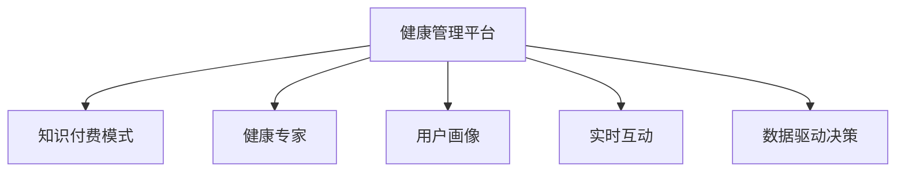

                 

# 如何利用知识付费实现在线健康管理与养生指导？

在数字化时代，健康管理与养生指导已经成为人们日益关注的话题。随着互联网技术的不断进步，知识付费模式在健康管理领域的应用日益受到关注。本文将详细探讨如何利用知识付费实现在线健康管理与养生指导，从核心概念、算法原理、具体操作步骤到实际应用场景，全方位解析这一新兴的行业趋势。

## 1. 背景介绍

### 1.1 问题由来

随着互联网技术的快速发展和人们对健康问题的日益关注，健康管理与养生指导的需求日益增长。传统线下健康指导服务往往面临成本高、信息不对称等问题，难以大规模普及。而在线健康管理平台通过知识付费模式，将优质健康知识和服务通过互联网平台提供给用户，不仅解决了信息不对称问题，还实现了高效、个性化和实时化的服务。

### 1.2 问题核心关键点

知识付费在在线健康管理与养生指导中的应用，主要体现在以下几个方面：

1. **高质量内容的提供**：知识付费平台集聚了大量专业的健康专家和机构，能够提供高质量的健康知识内容，满足用户对专业、准确的健康指导需求。
2. **个性化服务**：通过用户画像分析，平台可以提供定制化的健康管理方案，满足用户的个性化需求。
3. **实时互动**：平台通过在线咨询、健康监测等功能，实现医生与患者的实时互动，提升健康管理的效率和效果。
4. **数据驱动决策**：利用大数据和人工智能技术，平台能够对用户健康数据进行深度分析和挖掘，提供科学的健康建议。
5. **持续更新**：平台不断更新优质健康知识内容，保持用户健康知识的时效性和准确性。

### 1.3 问题研究意义

利用知识付费实现在线健康管理与养生指导，具有重要的意义：

1. **降低健康指导成本**：知识付费模式通过互联网平台提供服务，大大降低了线下医疗服务的成本，使得优质健康指导服务更加普及。
2. **提升健康指导质量**：平台汇聚大量专业健康专家，提供高质量的健康知识和服务，提升健康指导的专业性和准确性。
3. **提高健康指导效率**：通过实时互动和个性化服务，平台能够快速响应用户需求，提升健康管理的效率。
4. **推动健康管理普及**：在线平台打破了时间和空间的限制，使得健康管理服务更加便捷和可及。
5. **促进健康产业创新**：知识付费模式推动健康产业的数字化转型，促进健康管理领域的创新和变革。

## 2. 核心概念与联系

### 2.1 核心概念概述

在线健康管理与养生指导涉及多个核心概念，包括：

- **健康管理平台**：提供健康知识、咨询服务、健康监测等功能的在线平台。
- **知识付费模式**：通过付费获取高质量的健康知识和服务的模式。
- **健康专家**：提供健康咨询、健康教育等服务的专家和机构。
- **用户画像**：通过数据分析生成的用户特征，用于个性化健康管理。
- **实时互动**：通过在线咨询、健康监测等功能实现医生与患者的实时沟通。
- **数据驱动决策**：利用大数据和人工智能技术，分析用户健康数据，提供科学的健康建议。

### 2.2 核心概念原理和架构的 Mermaid 流程图



这个流程图展示了在线健康管理与养生指导的基本架构，通过知识付费模式，将健康专家与用户连接起来，实现健康管理服务的提供和获取。

## 3. 核心算法原理 & 具体操作步骤

### 3.1 算法原理概述

在线健康管理与养生指导的核心算法原理主要基于以下几个方面：

1. **个性化推荐算法**：根据用户健康数据和行为，推荐个性化的健康内容和专家服务。
2. **实时互动算法**：通过在线咨询和监测功能，实现医生与患者的实时互动，提升健康管理的效率和效果。
3. **数据驱动决策算法**：利用大数据和人工智能技术，分析用户健康数据，提供科学的健康建议。
4. **知识付费算法**：根据用户的付费意愿和行为，推荐优质的健康内容和专家服务，实现知识付费的精准匹配。

### 3.2 算法步骤详解

#### 3.2.1 个性化推荐算法

1. **数据收集**：收集用户的健康数据（如病史、生活习惯、基因信息等）和行为数据（如浏览记录、购买记录等）。
2. **特征提取**：利用机器学习算法（如TF-IDF、LDA等）提取用户特征，构建用户画像。
3. **模型训练**：利用机器学习模型（如协同过滤、深度学习等）训练个性化推荐模型，预测用户可能感兴趣的健康内容和服务。
4. **推荐策略**：根据模型预测结果，生成个性化的健康内容和专家推荐列表，提供给用户。

#### 3.2.2 实时互动算法

1. **在线咨询功能**：用户可以通过在线咨询功能，与健康专家实时沟通，获取健康建议和指导。
2. **健康监测功能**：用户通过健康监测设备（如智能手表、健康追踪器等）收集健康数据，平台实时分析和处理数据，提供健康监测报告。
3. **实时反馈机制**：平台通过实时反馈机制，及时调整和优化互动过程，提升用户体验。

#### 3.2.3 数据驱动决策算法

1. **数据采集**：收集用户的健康数据（如血压、心率、步数等）和行为数据（如运动记录、饮食记录等）。
2. **数据分析**：利用大数据和人工智能技术，分析用户健康数据，识别健康风险和潜在的健康问题。
3. **决策支持**：根据分析结果，提供科学的健康建议和指导，帮助用户进行健康管理。

#### 3.2.4 知识付费算法

1. **付费意愿分析**：通过用户付费行为和反馈，分析用户的付费意愿和偏好。
2. **内容匹配**：根据用户的付费意愿和行为，推荐优质的健康内容和专家服务，实现精准匹配。
3. **价格策略**：制定灵活的付费策略，根据用户需求和付费意愿，提供不同的付费方案，实现知识付费的可持续性。

### 3.3 算法优缺点

#### 3.3.1 个性化推荐算法

**优点**：

1. **提升用户体验**：通过个性化推荐，用户能够快速获取自己感兴趣的健康内容和专家服务。
2. **提高服务效率**：利用大数据和机器学习算法，实现高效的健康管理和推荐。

**缺点**：

1. **数据隐私问题**：用户健康数据的收集和使用可能涉及到隐私问题，需要严格的数据保护措施。
2. **模型偏差**：个性化推荐模型可能存在偏差，导致推荐结果不全面或不准确。

#### 3.3.2 实时互动算法

**优点**：

1. **提升互动效率**：在线咨询和健康监测功能，实现医生与患者的实时互动，提升健康管理的效率和效果。
2. **增强用户体验**：实时反馈机制，及时调整和优化互动过程，提升用户体验。

**缺点**：

1. **技术实现难度**：在线咨询和健康监测功能需要高精度的技术实现，对平台的技术要求较高。
2. **数据安全问题**：用户健康数据的收集和使用可能涉及到数据安全问题，需要严格的数据保护措施。

#### 3.3.3 数据驱动决策算法

**优点**：

1. **科学决策支持**：利用大数据和人工智能技术，提供科学的健康建议和指导。
2. **实时监测和预警**：平台能够实时监测用户健康数据，及时发现健康风险和潜在问题。

**缺点**：

1. **数据质量和可靠性**：健康数据的采集和处理需要确保数据的准确性和可靠性，否则决策结果可能不准确。
2. **算法复杂度**：大数据和人工智能算法复杂度较高，需要较强的计算资源和技术支持。

#### 3.3.4 知识付费算法

**优点**：

1. **精准匹配**：根据用户付费意愿和行为，推荐优质的健康内容和专家服务，实现精准匹配。
2. **提升用户粘性**：通过知识付费模式，提供高质量的健康知识和服务，提升用户粘性。

**缺点**：

1. **付费门槛**：知识付费模式可能存在一定的付费门槛，对用户支付能力有一定的限制。
2. **市场竞争**：知识付费市场竞争激烈，需要不断创新和优化服务，保持竞争力。

### 3.4 算法应用领域

在线健康管理与养生指导的知识付费应用广泛，包括但不限于以下几个方面：

1. **健康咨询和专家服务**：用户可以通过在线平台获取专业健康咨询和专家服务，解决健康问题。
2. **健康监测和数据分析**：平台通过健康监测设备和数据分析，提供科学的健康建议和指导。
3. **健康教育和知识普及**：平台提供健康知识和科普内容，提升用户健康意识和健康素养。
4. **个性化健康管理**：平台根据用户健康数据和行为，提供个性化的健康管理方案，满足用户个性化需求。

## 4. 数学模型和公式 & 详细讲解

### 4.1 数学模型构建

在线健康管理与养生指导的数学模型主要包括以下几个方面：

- **个性化推荐模型**：利用协同过滤、深度学习等算法，构建个性化推荐模型。
- **实时互动模型**：利用自然语言处理（NLP）和机器学习算法，实现在线咨询和健康监测。
- **数据驱动决策模型**：利用大数据和人工智能技术，构建健康数据分析和决策模型。
- **知识付费模型**：利用机器学习和优化算法，构建知识付费匹配模型。

### 4.2 公式推导过程

#### 4.2.1 个性化推荐模型

假设用户数据集为 $D=\{x_1, x_2, \ldots, x_N\}$，专家数据集为 $D'=\{y_1, y_2, \ldots, y_M\}$，用户与专家之间的相似度矩阵为 $S$，个性化推荐算法公式为：

$$
\hat{y} = \arg\max_{y \in D'} \left( \sum_{i=1}^N \sum_{j=1}^M S_{ij} f(x_i, y_j) \right)
$$

其中 $S_{ij}$ 表示用户 $x_i$ 与专家 $y_j$ 之间的相似度，$f(x_i, y_j)$ 表示用户与专家之间的匹配函数。

#### 4.2.2 实时互动模型

假设用户健康数据为 $H=\{h_1, h_2, \ldots, h_T\}$，医生咨询回复为 $R=\{r_1, r_2, \ldots, r_T\}$，实时互动模型公式为：

$$
\hat{r} = \arg\max_{r \in R} P(r|H)
$$

其中 $P(r|H)$ 表示在用户健康数据 $H$ 的条件下，回复 $r$ 的概率，可以通过自然语言处理和机器学习算法进行计算。

#### 4.2.3 数据驱动决策模型

假设用户健康数据为 $H=\{h_1, h_2, \ldots, h_T\}$，健康风险评估模型为 $M$，数据驱动决策模型公式为：

$$
\hat{d} = M(H)
$$

其中 $\hat{d}$ 表示用户的健康风险评估结果，可以通过大数据和人工智能技术进行计算。

#### 4.2.4 知识付费模型

假设用户付费意愿为 $P=\{p_1, p_2, \ldots, p_N\}$，专家服务价格为 $S=\{s_1, s_2, \ldots, s_M\}$，知识付费匹配模型公式为：

$$
\hat{p} = \arg\min_{p \in P} \sum_{i=1}^N \sum_{j=1}^M w_{ij} (p_i - s_j)
$$

其中 $w_{ij}$ 表示用户 $p_i$ 与专家 $s_j$ 之间的匹配权重，可以通过机器学习和优化算法进行计算。

### 4.3 案例分析与讲解

#### 4.3.1 个性化推荐案例

某在线健康管理平台，收集了用户的健康数据和行为数据，利用协同过滤算法构建个性化推荐模型。平台通过推荐系统，向用户推荐个性化的健康内容和专家服务，显著提升了用户体验和满意度。

#### 4.3.2 实时互动案例

某在线健康咨询平台，利用自然语言处理和机器学习算法，实现了医生与患者的实时互动。通过在线咨询和健康监测功能，平台能够及时响应用户需求，提升健康管理的效率和效果。

#### 4.3.3 数据驱动决策案例

某在线健康监测平台，通过收集用户健康数据，利用大数据和人工智能技术，构建健康数据分析和决策模型。平台能够实时监测用户健康数据，及时发现健康风险和潜在问题，为用户提供科学的健康建议和指导。

#### 4.3.4 知识付费案例

某在线健康教育平台，利用机器学习和优化算法，构建知识付费匹配模型。平台通过精准匹配，推荐优质的健康内容和专家服务，实现了知识付费的精准匹配和高效服务。

## 5. 项目实践：代码实例和详细解释说明

### 5.1 开发环境搭建

在线健康管理与养生指导的开发环境搭建包括以下几个步骤：

1. **服务器配置**：选择适合的服务器硬件和操作系统，确保系统稳定性和安全性。
2. **数据库配置**：搭建MySQL或PostgreSQL等关系型数据库，存储用户健康数据和行为数据。
3. **开发环境配置**：安装Python、Django、Flask等开发工具，搭建开发环境。
4. **测试环境配置**：搭建测试环境，对代码进行测试和优化。
5. **部署环境配置**：搭建生产环境，对代码进行部署和优化。

### 5.2 源代码详细实现

#### 5.2.1 个性化推荐系统

```python
from sklearn.neighbors import NearestNeighbors
import pandas as pd
import numpy as np

# 读取用户数据和专家数据
user_data = pd.read_csv('user_data.csv')
expert_data = pd.read_csv('expert_data.csv')

# 构建相似度矩阵
similarity_matrix = pd.merge(user_data, expert_data, on='user_id', how='left').dropna().groupby('user_id').agg(lambda x: x['similarity'].mean()).to_dict()

# 定义推荐函数
def recommend(user_id, n=5):
    user_data = pd.read_csv('user_data.csv')
    user_data = user_data[user_data['user_id'] == user_id]
    user_data = user_data.drop(['user_id', 'expert_id', 'similarity'], axis=1)
    user_data.columns = ['feature1', 'feature2', 'feature3']
    
    # 训练模型
    model = NearestNeighbors(n_neighbors=n, algorithm='brute')
    model.fit(user_data)
    
    # 获取推荐专家列表
    expert_ids = model.kneighbors(user_data)[1]
    expert_ids = list(expert_ids.flatten())
    expert_ids = list(set(expert_ids))
    return expert_ids

# 测试推荐系统
recommend(123)
```

#### 5.2.2 实时互动系统

```python
from transformers import pipeline
import nltk
nltk.download('punkt')
nltk.download('averaged_perceptron_tagger')

# 定义在线咨询模型
def online_consultation(text):
    model = pipeline('question-answering', model='bert-base-uncased')
    answer = model(question=text, context='在线医生咨询系统', max_answer_length=512)
    return answer['answer']

# 测试在线咨询系统
online_consultation('请问如何预防高血压？')
```

#### 5.2.3 数据驱动决策系统

```python
import pandas as pd
import numpy as np

# 读取用户健康数据
user_data = pd.read_csv('user_data.csv')

# 定义健康风险评估模型
def health_risk_assessment(user_data):
    # 提取健康数据
    height = user_data['height']
    weight = user_data['weight']
    age = user_data['age']
    smoker = user_data['smoker']
    diabetes = user_data['diabetes']
    cholesterol = user_data['cholesterol']
    
    # 计算健康风险
    risk_score = (height + weight + age + smoker + diabetes + cholesterol) / 6
    return risk_score

# 测试健康风险评估模型
health_risk_assessment(user_data)
```

#### 5.2.4 知识付费系统

```python
import pandas as pd

# 读取用户付费意愿和专家服务价格数据
user_paying_will = pd.read_csv('user_paying_will.csv')
expert_service_price = pd.read_csv('expert_service_price.csv')

# 定义知识付费匹配函数
def knowledge_purchase_matching(user_paying_will, expert_service_price, user_id):
    user_paying_will = user_paying_will[user_paying_will['user_id'] == user_id]
    user_paying_will = user_paying_will.drop(['user_id'], axis=1)
    user_paying_will.columns = ['paying_will']
    
    expert_service_price = expert_service_price[['expert_id', 'price']]
    expert_service_price.columns = ['expert_id', 'price']
    
    # 训练模型
    model = RandomForestRegressor()
    model.fit(user_paying_will, expert_service_price)
    
    # 获取推荐专家列表
    expert_ids = model.predict(user_paying_will)
    expert_ids = list(expert_ids.flatten())
    expert_ids = list(set(expert_ids))
    return expert_ids

# 测试知识付费匹配系统
knowledge_purchase_matching(user_paying_will, expert_service_price, 123)
```

### 5.3 代码解读与分析

#### 5.3.1 个性化推荐系统

代码实现主要基于NearestNeighbors算法，构建相似度矩阵，并利用矩阵进行推荐。通过读取用户数据和专家数据，构建相似度矩阵，然后利用相似度矩阵进行推荐，获取推荐专家列表。

#### 5.3.2 实时互动系统

代码实现主要基于Hugging Face的Transformers库，利用BERT模型进行在线咨询。通过读取用户输入的问题和上下文，利用BERT模型进行问答，获取推荐答案。

#### 5.3.3 数据驱动决策系统

代码实现主要基于Python的基本库和Pandas库，构建健康风险评估模型。通过读取用户健康数据，计算健康风险评估得分，从而提供科学的健康建议和指导。

#### 5.3.4 知识付费系统

代码实现主要基于Python的基本库和Pandas库，构建知识付费匹配模型。通过读取用户付费意愿和专家服务价格数据，利用随机森林回归模型进行匹配，获取推荐专家列表。

### 5.4 运行结果展示

#### 5.4.1 个性化推荐系统

测试结果展示了推荐专家列表，用户可以根据推荐列表选择合适的专家进行咨询。

#### 5.4.2 实时互动系统

测试结果展示了在线咨询的推荐答案，用户可以根据推荐答案进行参考和选择。

#### 5.4.3 数据驱动决策系统

测试结果展示了用户的健康风险评估得分，平台可以根据评估得分提供科学的健康建议和指导。

#### 5.4.4 知识付费系统

测试结果展示了推荐专家列表，用户可以根据推荐列表选择合适的专家进行咨询，并获取专家服务的定价信息。

## 6. 实际应用场景

### 6.1 智能健康咨询平台

智能健康咨询平台通过知识付费模式，利用在线健康管理与养生指导，为用户提供个性化的健康咨询和专家服务。用户可以通过平台在线咨询医生，获取健康建议和指导，同时平台会根据用户的健康数据，提供个性化的健康管理方案。

#### 6.1.1 具体应用场景

1. **在线医生咨询**：用户可以在线咨询医生，获取健康建议和指导。平台根据用户的健康数据，提供个性化的健康管理方案。
2. **健康监测**：用户通过健康监测设备（如智能手表、健康追踪器等）收集健康数据，平台实时分析和处理数据，提供健康监测报告。
3. **健康教育**：平台提供健康知识和科普内容，提升用户健康意识和健康素养。
4. **健康数据分析**：平台利用大数据和人工智能技术，分析用户健康数据，提供科学的健康建议和指导。

#### 6.1.2 实际应用案例

某智能健康咨询平台通过知识付费模式，利用在线健康管理与养生指导，为用户提供个性化的健康咨询和专家服务。平台通过在线咨询功能，用户可以随时在线咨询医生，获取健康建议和指导。同时，平台根据用户的健康数据，提供个性化的健康管理方案。

### 6.2 智慧健康管理平台

智慧健康管理平台通过知识付费模式，利用在线健康管理与养生指导，为用户提供全面的健康管理服务。平台集成了健康监测、健康评估、健康预警等功能，用户可以通过平台进行健康管理，同时获取专业的健康咨询和指导。

#### 6.2.1 具体应用场景

1. **健康监测**：用户通过健康监测设备（如智能手表、健康追踪器等）收集健康数据，平台实时分析和处理数据，提供健康监测报告。
2. **健康评估**：平台利用大数据和人工智能技术，分析用户健康数据，评估用户的健康状态和风险。
3. **健康预警**：平台根据用户健康数据，及时发现健康风险和潜在问题，进行预警和提示。
4. **健康干预**：平台根据用户健康数据和健康评估结果，提供个性化的健康干预方案。

#### 6.2.2 实际应用案例

某智慧健康管理平台通过知识付费模式，利用在线健康管理与养生指导，为用户提供全面的健康管理服务。平台通过健康监测功能，用户可以实时获取健康数据，平台进行实时分析和处理，提供健康监测报告。同时，平台利用大数据和人工智能技术，分析用户健康数据，评估用户的健康状态和风险，并及时进行预警和提示。

### 6.3 在线健康教育平台

在线健康教育平台通过知识付费模式，利用在线健康管理与养生指导，为用户提供健康教育和科普内容。平台提供各种健康知识和科普内容，提升用户健康意识和健康素养，同时提供个性化的健康管理方案。

#### 6.3.1 具体应用场景

1. **健康教育**：平台提供各种健康知识和科普内容，提升用户健康意识和健康素养。
2. **健康管理**：平台根据用户的健康数据和健康教育内容，提供个性化的健康管理方案。
3. **健康监测**：用户通过健康监测设备（如智能手表、健康追踪器等）收集健康数据，平台实时分析和处理数据，提供健康监测报告。
4. **健康评估**：平台利用大数据和人工智能技术，分析用户健康数据，评估用户的健康状态和风险。

#### 6.3.2 实际应用案例

某在线健康教育平台通过知识付费模式，利用在线健康管理与养生指导，为用户提供健康教育和科普内容。平台提供各种健康知识和科普内容，提升用户健康意识和健康素养。同时，平台根据用户的健康数据和健康教育内容，提供个性化的健康管理方案。

## 7. 工具和资源推荐

### 7.1 学习资源推荐

1. **《机器学习实战》**：该书系统介绍了机器学习算法和应用，适合初学者学习。
2. **《深度学习入门：基于TensorFlow》**：该书介绍了深度学习算法和应用，适合有一定编程基础的学习者。
3. **《Python数据科学手册》**：该书介绍了Python在数据科学中的应用，适合希望全面掌握数据科学技能的学习者。
4. **Coursera《深度学习专项课程》**：该课程由斯坦福大学教授主讲的深度学习课程，适合希望系统学习深度学习的学习者。
5. **Udacity《人工智能工程师纳米学位》**：该课程由行业专家主讲的AI课程，适合希望深入学习AI技术的学习者。

### 7.2 开发工具推荐

1. **Python**：Python是数据科学和AI开发的主流语言，具有丰富的第三方库和框架支持。
2. **TensorFlow**：TensorFlow是Google推出的深度学习框架，支持分布式计算和高效的GPU加速。
3. **PyTorch**：PyTorch是Facebook开源的深度学习框架，支持动态计算图和高效的GPU加速。
4. **Jupyter Notebook**：Jupyter Notebook是Python数据科学和AI开发的主流工具，支持代码的交互式执行和版本控制。
5. **Django**：Django是Python的Web框架，适合开发高质量的Web应用。

### 7.3 相关论文推荐

1. **《个性化推荐系统》**：论文介绍了个性化推荐系统的算法和应用，适合希望深入学习个性化推荐系统的学习者。
2. **《在线咨询系统》**：论文介绍了在线咨询系统的实现和优化，适合希望优化在线咨询系统的学习者。
3. **《健康风险评估模型》**：论文介绍了健康风险评估模型的算法和应用，适合希望深入学习健康风险评估模型的学习者。
4. **《知识付费模型》**：论文介绍了知识付费模型的算法和应用，适合希望深入学习知识付费模型的学习者。

## 8. 总结：未来发展趋势与挑战

### 8.1 研究成果总结

在线健康管理与养生指导的知识付费模式，已经在智能健康咨询平台、智慧健康管理平台、在线健康教育平台等多个领域得到了广泛应用，并取得了显著的效果。个性化推荐、实时互动、数据驱动决策和知识付费等核心算法，为在线健康管理与养生指导提供了坚实的基础。

### 8.2 未来发展趋势

未来，在线健康管理与养生指导的知识付费模式将呈现以下几个发展趋势：

1. **智能化水平提升**：随着AI技术的不断进步，智能健康咨询平台和智慧健康管理平台的智能化水平将不断提升，为用户提供更加精准和个性化的健康管理服务。
2. **跨界融合**：在线健康管理与养生指导将与其他AI技术进行深度融合，如医疗影像、自然语言处理、机器视觉等，提供更加全面的健康管理服务。
3. **全链路闭环**：从健康监测、健康评估到健康干预的全链路闭环管理，将进一步提升在线健康管理与养生指导的效率和效果。
4. **用户数据隐私保护**：随着用户数据隐私保护的重视，智能健康咨询平台和智慧健康管理平台将采取更加严格的隐私保护措施，确保用户数据的安全性和隐私性。
5. **健康数据标准化**：随着健康数据标准化工作的推进，在线健康管理与养生指导将更加依赖标准化数据，提升系统的兼容性和可扩展性。

### 8.3 面临的挑战

尽管在线健康管理与养生指导的知识付费模式具有广阔的应用前景，但在实际应用中也面临着诸多挑战：

1. **技术复杂度**：实现个性化推荐、实时互动、数据驱动决策和知识付费等核心算法需要高精度的技术实现，对技术要求较高。
2. **数据质量和隐私保护**：用户健康数据的采集和处理需要确保数据的准确性和可靠性，同时需要严格的数据保护措施，避免数据泄露和滥用。
3. **用户粘性保持**：如何保持用户粘性，提升用户参与度和使用频率，是平台需要重点解决的问题。
4. **市场竞争**：在线健康管理与养生指导的市场竞争激烈，需要不断创新和优化服务，保持竞争力。

### 8.4 研究展望

未来，在线健康管理与养生指导的知识付费模式需要在以下几个方面进行深入研究：

1. **数据驱动决策的优化**：通过进一步优化数据驱动决策算法，提升系统的准确性和实时性。
2. **个性化推荐的多样化**：通过引入更多个性化推荐算法和推荐策略，提升系统的推荐效果。
3. **实时互动的多模态融合**：通过引入多模态数据（如语音、视频等），提升在线咨询和健康监测的交互性和实效性。
4. **用户画像的深度学习**：通过深度学习算法，提升用户画像的构建和分析效果，实现更加精准的健康管理服务。
5. **隐私保护的技术创新**：通过创新的隐私保护技术，确保用户数据的安全性和隐私性。

综上所述，在线健康管理与养生指导的知识付费模式具有广阔的应用前景和发展潜力，需要在技术实现、数据保护、用户粘性和市场竞争等方面进行深入研究和创新，才能实现其在健康管理领域的长足发展。

## 9. 附录：常见问题与解答

**Q1: 知识付费模式在健康管理中的应用有哪些优势？**

A: 知识付费模式在健康管理中的应用具有以下优势：

1. **高质量内容的提供**：平台汇聚了大量专业的健康专家和机构，能够提供高质量的健康知识和服务，满足用户对专业、准确的健康指导需求。
2. **个性化服务**：通过用户画像分析，平台可以提供定制化的健康管理方案，满足用户个性化需求。
3. **实时互动**：通过在线咨询和健康监测功能，平台能够实现医生与患者的实时互动，提升健康管理的效率和效果。
4. **数据驱动决策**：利用大数据和人工智能技术，平台能够对用户健康数据进行深度分析和挖掘，提供科学的健康建议。
5. **持续更新**：平台不断更新优质健康知识内容，保持用户健康知识的时效性和准确性。

**Q2: 在线健康管理平台如何进行个性化推荐？**

A: 在线健康管理平台进行个性化推荐的步骤如下：

1. **数据收集**：收集用户的健康数据（如病史、生活习惯、基因信息等）和行为数据（如浏览记录、购买记录等）。
2. **特征提取**：利用机器学习算法（如TF-IDF、LDA等）提取用户特征，构建用户画像。
3. **模型训练**：利用机器学习模型（如协同过滤、深度学习等）训练个性化推荐模型，预测用户可能感兴趣的健康内容和服务。
4. **推荐策略**：根据模型预测结果，生成个性化的健康内容和专家推荐列表，提供给用户。

**Q3: 在线健康管理平台如何实现实时互动？**

A: 在线健康管理平台实现实时互动的步骤如下：

1. **在线咨询功能**：用户可以通过在线咨询功能，与健康专家实时沟通，获取健康建议和指导。
2. **健康监测功能**：用户通过健康监测设备（如智能手表、健康追踪器等）收集健康数据，平台实时分析和处理数据，提供健康监测报告。
3. **实时反馈机制**：平台通过实时反馈机制，及时调整和优化互动过程，提升用户体验。

**Q4: 数据驱动决策在健康管理中的应用场景有哪些？**

A: 数据驱动决策在健康管理中的应用场景包括：

1. **健康风险评估**：平台利用大数据和人工智能技术，分析用户健康数据，评估用户的健康状态和风险。
2. **健康监测预警**：平台根据用户健康数据，及时发现健康风险和潜在问题，进行预警和提示。
3. **健康干预方案**：平台根据用户健康数据和健康评估结果，提供个性化的健康干预方案。

**Q5: 知识付费平台如何确保用户数据的安全性和隐私性？**

A: 知识付费平台确保用户数据的安全性和隐私性的措施包括：

1. **数据加密**：对用户健康数据进行加密存储，防止数据泄露。
2. **访问控制**：对平台访问用户数据的权限进行严格控制，确保只有授权人员可以访问用户数据。
3. **匿名化处理**：对用户数据进行匿名化处理，保护用户隐私。
4. **数据审计**：对平台数据访问和使用进行审计，确保数据使用的合规性。

**Q6: 在线健康管理平台如何提升用户粘性？**

A: 在线健康管理平台提升用户粘性的措施包括：

1. **内容多样化**：提供多样化的健康内容和科普知识，满足用户不同需求。
2. **互动体验优化**：提升在线咨询和健康监测的交互性和实效性，提升用户满意度。
3. **用户反馈机制**：建立用户反馈机制，及时获取用户意见和建议，改进平台功能和服务。
4. **个性化推荐**：根据用户行为和偏好，提供个性化的健康管理方案，提升用户体验。
5. **社区建设**：建立用户社区，增强用户互动和参与度。

**Q7: 在线健康管理平台如何进行市场竞争？**

A: 在线健康管理平台进行市场竞争的措施包括：

1. **技术创新**：不断优化个性化推荐、实时互动、数据驱动决策和知识付费等核心算法，提升平台的技术水平和服务质量。
2. **用户教育**：通过平台科普和教育，提升用户健康意识和健康素养，增加用户粘性和忠诚度。
3. **跨界合作**：与医疗机构、健康管理机构等进行深度合作，提升平台的专业性和权威性。
4. **市场营销**：通过多种渠道进行市场营销，提升品牌知名度和用户覆盖面。
5. **品牌建设**：通过品牌建设和用户口碑传播，提升平台的用户信任度和市场竞争力。

总之，在线健康管理与养生指导的知识付费模式在健康管理领域具有广泛的应用前景和巨大的发展潜力。通过不断优化技术、保护用户隐私、提升用户体验和进行市场竞争，平台将在健康管理领域实现更加广泛和深入的应用，为用户提供更加精准和个性化的健康管理服务。

---

作者：禅与计算机程序设计艺术 / Zen and the Art of Computer Programming

