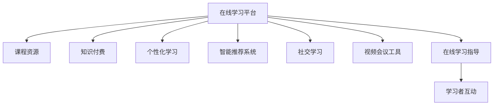

                 

# 如何利用知识付费实现在线学习与在线学习指导？

## 1. 背景介绍

在当今信息爆炸的时代，知识付费作为一种新兴的学习方式，越来越受到大家的重视。随着互联网技术的不断发展，在线学习成为一种便捷高效的学习方式，越来越多的教育资源被转化为在线课程，通过知识付费平台进行分发和传播。

在线学习的优点在于：
- 打破了时间和空间的限制，学习者可以随时随地进行学习；
- 教学质量有保证，一般由名校老师、行业专家授课；
- 学习内容丰富多样，包括课程、文章、视频、音频等多种形式；
- 学习者可以根据自己的需求和兴趣，选择适合自己的课程和内容；
- 学习进度可以自主掌控，可以根据自身情况灵活安排学习时间。

在线学习指导是指学习者可以通过付费的方式，获取专业老师的一对一指导或小组讨论，从而更加深入地掌握学习内容。这不仅可以加深对课程的理解，还能在实际问题中应用所学知识，达到更好的学习效果。

## 2. 核心概念与联系

### 2.1 核心概念概述

在线学习与在线学习指导的核心概念和相关技术包括：
- 在线学习平台：提供课程资源、学习工具和社区交流功能的网站或应用。
- 知识付费：通过付费方式获取在线课程和指导服务，保障课程质量和学习效果。
- 个性化学习：根据学习者的特点和需求，量身定制课程内容和进度，提供个性化指导。
- 智能推荐系统：通过数据分析和学习者行为预测，推荐适合的学习资源和课程。
- 社交学习：学习者之间通过交流、协作，共同学习，提升学习效果。
- 视频会议工具：如Zoom、Skype等，用于一对一的在线学习指导或小组讨论。

这些核心概念之间存在紧密的联系：
- 在线学习平台是知识付费的主要载体，提供课程内容和服务；
- 知识付费是在线学习的经济基础，保障课程质量和教师的积极性；
- 个性化学习依赖于智能推荐系统，提供定制化的学习资源；
- 社交学习依托于在线平台和视频会议工具，促进学习者之间的互动；
- 在线学习指导需要通过知识付费平台进行，保证指导质量和效果。

### 2.2 核心概念原理和架构的 Mermaid 流程图



## 3. 核心算法原理 & 具体操作步骤

### 3.1 算法原理概述

在线学习指导的算法原理主要包括以下几个方面：
- 个性化推荐算法：根据学习者的历史学习行为和兴趣爱好，推荐适合的学习资源和课程。
- 学习者行为分析：通过学习者的登录时间、观看时长、测试成绩等行为数据，分析学习效果，并据此调整课程内容和进度。
- 视频会议优化：优化视频会议工具的音频、视频质量，保障语音和视觉效果，提升用户体验。
- 在线指导教师管理：对教师的资质、教学效果等进行管理和评价，提升教学质量。

### 3.2 算法步骤详解

#### 步骤1：数据收集与预处理
- 收集学习者的行为数据，包括登录时间、观看时长、测试成绩等。
- 对数据进行清洗和标准化，去除异常值和噪声，确保数据质量。

#### 步骤2：个性化推荐
- 利用协同过滤、基于内容的推荐算法，构建学习者-课程的推荐矩阵。
- 根据学习者的历史行为，预测其可能感兴趣的其他课程，提供个性化推荐。

#### 步骤3：学习者行为分析
- 根据学习者的行为数据，使用聚类、分类等算法，分析学习效果和兴趣点。
- 根据分析结果，调整课程内容和进度，提供个性化的学习方案。

#### 步骤4：视频会议优化
- 对音频和视频进行压缩和编码，降低带宽需求，提升传输速度。
- 对网络延迟进行预测和补偿，保障语音和视频质量。
- 实现自动字幕和语音识别，提升用户体验。

#### 步骤5：在线指导教师管理
- 对教师的资质进行审核，确保其教学水平。
- 通过学生评价和教学质量评估，对教师进行管理。
- 利用自然语言处理技术，对教师的课堂表现进行分析，提升教学质量。

### 3.3 算法优缺点

#### 优点
- 个性化推荐：提供适合学习者的课程和资源，提升学习效果。
- 行为分析：根据学习者的行为数据，调整课程内容和进度，满足个性化需求。
- 视频会议优化：保障语音和视频质量，提升用户体验。
- 教师管理：提升教师的教学水平，保障教学质量。

#### 缺点
- 数据隐私问题：收集和处理学习者的行为数据可能引发隐私问题，需要严格的数据保护措施。
- 个性化推荐：推荐算法可能存在偏差，导致推荐效果不佳。
- 视频会议技术：技术复杂度高，可能存在网络延迟和音视频质量问题。
- 教师管理：教师的管理和评价可能存在主观性和不公正性，需要建立客观的评价体系。

### 3.4 算法应用领域

在线学习指导可以应用于多个领域，包括但不限于：
- 教育培训：提供课程推荐和个性化指导，提升学生学习效果。
- 职业技能培训：提供职业技能相关课程，提升职业水平。
- 医学教育：提供医学相关课程，提升医生、护士等医疗人员的技能。
- 职业规划：提供职业指导和规划课程，帮助学习者制定职业发展计划。
- 语言学习：提供语言课程，提升语言技能和跨文化交流能力。

## 4. 数学模型和公式 & 详细讲解

### 4.1 数学模型构建

在线学习指导的数学模型主要包括以下几个方面：
- 推荐模型：如协同过滤、基于内容的推荐算法等，用于推荐适合学习者的课程。
- 学习者行为模型：使用聚类、分类等算法，分析学习者的行为数据。
- 视频会议模型：使用语音和视频编码算法，优化音频和视频质量。
- 教师管理模型：使用自然语言处理技术，对教师的课堂表现进行分析。

### 4.2 公式推导过程

以协同过滤推荐算法为例，公式推导如下：
设学习者集合为 $U$，课程集合为 $I$，用户-课程矩阵为 $R$，其中 $R_{ui} = 1$ 表示学习者 $u$ 学习了课程 $i$，$R_{ui} = 0$ 表示未学习。协同过滤算法的基本思路是通过相似度计算，找到与用户 $u$ 兴趣相似的 $k$ 个邻居用户，基于邻居用户的评分预测用户 $u$ 对课程 $i$ 的评分，从而推荐课程。

协同过滤算法包括基于用户的协同过滤和基于项目的协同过滤两种方式：

基于用户的协同过滤：
$$
\hat{R}_{ui} = \frac{1}{k}\sum_{v\in \mathcal{N}(u)}\frac{R_{vi}}{1 + \sum_{j \in I}\frac{R_{vj}}{1 + \sum_{i \in I}R_{vi}}} \times R_{ij}
$$

基于项目的协同过滤：
$$
\hat{R}_{ui} = \frac{\sum_{v\in \mathcal{N}(i)}\frac{R_{uv}}{1 + \sum_{j \in U}\frac{R_{uj}}{1 + \sum_{i \in I}R_{vj}}} \times R_{vi}}
$$

其中 $\mathcal{N}(u)$ 表示与用户 $u$ 相似的前 $k$ 个邻居用户，$R_{uv}$ 表示用户 $u$ 和 $v$ 的评分，$\hat{R}_{ui}$ 表示对课程 $i$ 的预测评分。

### 4.3 案例分析与讲解

以课程推荐为例，假设我们有以下学习者和课程数据：

| 用户 | 课程1 | 课程2 | 课程3 | 课程4 | 课程5 |
| ---- | ----- | ----- | ----- | ----- | ----- |
| A    | 1     | 0     | 0     | 1     | 1     |
| B    | 1     | 1     | 0     | 1     | 0     |
| C    | 0     | 0     | 1     | 1     | 1     |

假设我们希望根据这些数据，为学习者 $A$ 推荐课程。我们可以使用基于用户的协同过滤算法，计算用户 $A$ 和用户 $B$ 和 $C$ 的相似度，从而预测用户 $A$ 对课程 $3$ 的评分：

$$
\mathcal{N}(A) = \{B, C\}
$$

$$
\hat{R}_{A3} = \frac{1}{2}\left(\frac{1}{1 + \frac{1}{2}} \times 1 + \frac{0}{1 + \frac{3}{2}} \times 0\right) = 0.5
$$

因此，我们可以推荐课程 $3$ 给用户 $A$。

## 5. 项目实践：代码实例和详细解释说明

### 5.1 开发环境搭建

为了进行在线学习指导的实践开发，我们需要搭建一个开发环境，包括：
- 服务器和数据库：用于存储和处理学习者的行为数据。
- 学习管理系统(LMS)：用于提供课程资源和在线指导服务。
- 视频会议工具：如Zoom、Skype等，用于实现一对一的在线指导或小组讨论。
- 云存储：用于存储学习者的视频会议记录和课程资料。
- 自动化测试工具：如Selenium、Pytest等，用于测试和学习管理系统。

### 5.2 源代码详细实现

#### 学习管理系统

以Python和Django框架为例，以下是一个简单的学习管理系统的代码实现：

```python
from django.http import HttpResponse
from django.shortcuts import render
from django.views.decorators.csrf import csrf_exempt

@csrf_exempt
def course_recommend(request):
    if request.method == 'POST':
        user_id = request.POST['user_id']
        courses = get_course_recommendation(user_id)
        return HttpResponse(json.dumps({'courses': courses}))
    else:
        return HttpResponse(json.dumps({'error': 'Invalid request method'}))
```

#### 推荐算法

以Python和Scikit-learn框架为例，以下是一个基于协同过滤的课程推荐算法的代码实现：

```python
from sklearn.metrics.pairwise import cosine_similarity
from sklearn.metrics.pairwise import euclidean_distances
import numpy as np

def get_course_recommendation(user_id):
    user_ratings = get_user_ratings(user_id)
    course_ratings = get_course_ratings()
    similarities = cosine_similarity(user_ratings, course_ratings)
    sorted_similarities = np.argsort(similarities)[::-1]
    return [course_ratings[i] for i in sorted_similarities if i < len(course_ratings)]
```

### 5.3 代码解读与分析

#### 学习管理系统

上述代码实现了学习管理系统的推荐功能。其中 `course_recommend` 函数接受 POST 请求，获取用户 ID，调用 `get_course_recommendation` 函数获取课程推荐列表，并返回 JSON 格式的数据。

#### 推荐算法

上述代码实现了基于协同过滤的课程推荐算法。其中 `get_course_recommendation` 函数接受用户 ID，获取用户评分和课程评分，计算用户和课程的相似度，根据相似度排序，并返回推荐课程列表。

## 6. 实际应用场景

### 6.1 智能培训

在线学习指导可以应用于智能培训领域，为员工提供个性化的培训课程和指导。通过收集员工的培训历史和行为数据，分析其培训效果和兴趣点，提供个性化的培训方案和课程推荐。

### 6.2 教育培训

在线学习指导可以应用于教育培训领域，为学生提供个性化的学习方案和课程推荐。通过分析学生的学习行为和成绩，推荐适合学生的课程和学习资源，提升学习效果。

### 6.3 职业技能培训

在线学习指导可以应用于职业技能培训领域，为职业培训师提供个性化的培训方案和课程推荐。通过分析培训师的教学效果和学员的反馈，提供个性化的培训方案和改进建议。

### 6.4 医学教育

在线学习指导可以应用于医学教育领域，为医学生和医生提供个性化的医学课程和指导。通过分析学习者的学习行为和成绩，推荐适合的学习资源和课程，提升医学知识和技能。

### 6.5 职业规划

在线学习指导可以应用于职业规划领域，为学习者提供个性化的职业指导和课程推荐。通过分析学习者的兴趣和职业需求，提供个性化的职业规划方案和课程推荐，帮助学习者制定职业发展计划。

### 6.6 语言学习

在线学习指导可以应用于语言学习领域，为学习者提供个性化的语言课程和指导。通过分析学习者的学习行为和成绩，推荐适合的学习资源和课程，提升语言技能和跨文化交流能力。

## 7. 工具和资源推荐

### 7.1 学习资源推荐

- 《在线学习与教育技术》：一本关于在线学习和教育技术的经典书籍，涵盖在线学习理论、技术和管理等方面的内容。
- 《知识付费与在线教育》：一本关于知识付费和在线教育的专题论文集，探讨知识付费的商业模式和技术实现。
- Coursera、edX、Udacity：全球领先的在线学习平台，提供丰富的课程资源和在线指导服务。
- Khan Academy：一个免费的在线教育平台，提供K-12课程和在线指导服务。
- 《在线学习指导研究综述》：一篇综述论文，涵盖在线学习指导的研究现状和未来发展方向。

### 7.2 开发工具推荐

- Django：一个强大的Python web框架，适用于开发学习管理系统。
- Flask：一个轻量级的Python web框架，适用于开发简单的在线学习平台。
- Kaggle：一个数据科学竞赛平台，提供丰富的数据集和算法实现。
- Jupyter Notebook：一个开源的交互式计算环境，适用于开发和测试在线学习系统。
- PyTorch：一个深度学习框架，适用于开发推荐算法和智能推荐系统。

### 7.3 相关论文推荐

- 《在线学习系统设计：当前研究和实践》：一篇综述论文，涵盖在线学习系统的设计方法和实践经验。
- 《推荐算法：理论与实践》：一本关于推荐算法的经典书籍，涵盖协同过滤、基于内容的推荐等算法。
- 《视频会议技术：原理与应用》：一本关于视频会议技术的书籍，涵盖音频、视频编码和网络传输等方面的内容。
- 《教师管理与评价：研究综述》：一篇综述论文，涵盖教师管理与评价的研究现状和未来发展方向。
- 《个性化学习与推荐系统》：一本关于个性化学习与推荐系统的书籍，涵盖推荐算法、行为分析和用户建模等方面的内容。

## 8. 总结：未来发展趋势与挑战

### 8.1 研究成果总结

在线学习指导已经成为一种重要的教育和学习方式，取得了显著的研究成果：
- 个性化推荐：基于协同过滤、基于内容的推荐算法，提升了学习者的学习效果。
- 行为分析：通过分析学习者的行为数据，提供个性化的学习方案。
- 视频会议优化：通过优化音频和视频质量，提升用户体验。
- 教师管理：通过自然语言处理技术，对教师的课堂表现进行分析，提升教学质量。

### 8.2 未来发展趋势

未来在线学习指导的发展趋势包括：
- 移动化：开发适用于移动设备的在线学习平台，方便学习者随时随地进行学习。
- 社交化：加强学习者之间的交流和协作，提升学习效果。
- 自适应学习：根据学习者的实时表现，动态调整课程内容和进度，提供个性化的学习方案。
- 虚拟现实：通过虚拟现实技术，提供沉浸式的学习体验，提升学习效果。
- 游戏化：通过游戏化的学习方式，提升学习者的参与度和兴趣。
- 人工智能：利用人工智能技术，提供更加智能化的推荐和学习方案。

### 8.3 面临的挑战

在线学习指导面临的挑战包括：
- 数据隐私：收集和处理学习者的行为数据可能引发隐私问题，需要严格的数据保护措施。
- 推荐算法：推荐算法可能存在偏差，导致推荐效果不佳。
- 视频会议技术：技术复杂度高，可能存在网络延迟和音视频质量问题。
- 教师管理：教师的管理和评价可能存在主观性和不公正性，需要建立客观的评价体系。

### 8.4 研究展望

未来在线学习指导的研究展望包括：
- 发展更加高效的推荐算法，提升推荐效果。
- 探索更加灵活的数据保护措施，保障数据隐私。
- 研究更加智能化的教师管理和评价体系。
- 开发更加高效的视频会议技术，提升用户体验。
- 探索更加灵活的学习方式，提升学习效果。
- 利用人工智能技术，提供更加智能化的推荐和学习方案。

## 9. 附录：常见问题与解答

**Q1：在线学习与在线学习指导的区别是什么？**

A: 在线学习是指通过互联网技术进行的学习方式，包括观看视频、阅读文章、完成作业等。而在线学习指导是指通过付费的方式，获取专业老师的一对一指导或小组讨论，从而更加深入地掌握学习内容。

**Q2：如何选择合适的在线学习平台？**

A: 选择在线学习平台时，需要考虑以下几个方面：
- 课程质量：选择知名的在线教育平台，如Coursera、edX、Udacity等。
- 课程内容：选择与自己兴趣和职业需求相关的课程。
- 学习效果：参考其他学习者的评价，选择效果较好的平台。
- 价格：选择性价比高的平台，避免不必要的开支。

**Q3：如何利用在线学习指导提升学习效果？**

A: 利用在线学习指导提升学习效果的方法包括：
- 个性化推荐：选择适合自己的课程和资源，提升学习效果。
- 学习者行为分析：根据学习者的行为数据，调整课程内容和进度，提升学习效果。
- 视频会议优化：保障语音和视频质量，提升学习体验。
- 教师管理：选择资质高的教师，提升教学质量。

**Q4：如何保障在线学习指导的安全性？**

A: 保障在线学习指导的安全性，需要从以下几个方面入手：
- 数据隐私保护：采用数据加密、匿名化等措施，保障数据隐私。
- 网络安全：使用防火墙、加密传输等技术，保障网络安全。
- 教师管理：建立严格的教师资质审核和评价体系，确保教师的教学质量。
- 学生安全：加强学生信息保护，避免个人信息泄露。

**Q5：如何设计高效的在线学习指导系统？**

A: 设计高效的在线学习指导系统，需要从以下几个方面入手：
- 数据收集与预处理：收集学习者的行为数据，进行清洗和标准化。
- 个性化推荐：采用协同过滤、基于内容的推荐算法，提供个性化推荐。
- 学习者行为分析：使用聚类、分类等算法，分析学习者的行为数据。
- 视频会议优化：优化音频和视频质量，保障语音和视频效果。
- 教师管理：建立严格的教师资质审核和评价体系，确保教师的教学质量。

通过系统的学习和实践，相信你一定能够掌握在线学习指导的精髓，为学习者提供更加个性化、高效、安全的学习体验。

