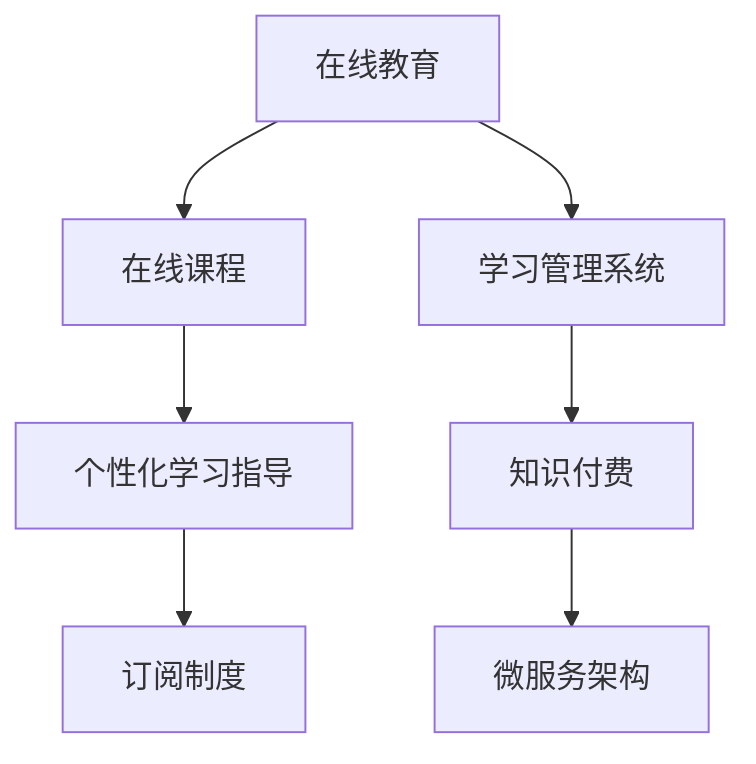

                 

# 如何利用知识付费实现在线学习与在线学习指导？

在信息爆炸和知识更新的时代，传统的教育方式逐渐落后于时代潮流，而在线教育以其灵活性、可获取性和个性化优势，迅速成为教育领域的重要组成部分。其中，知识付费模式的兴起，更是将在线教育推向了新的高度。本文将深入探讨如何利用知识付费实现在线学习与在线学习指导，揭示其背后深层次的技术原理和实践技巧。

## 1. 背景介绍

### 1.1 问题由来
随着互联网技术的不断进步，在线教育平台如雨后春笋般涌现，吸引了大量用户。传统的“一对多”教育模式被“多对一”的在线教育模式所取代，教学过程变得更加个性化和高效。然而，高效率的背后，往往隐藏着学习资源分散、学习过程缺乏有效指导、学习效果难以量化等诸多问题。

知识付费模式应运而生。通过付费订阅获取优质的教育资源和专业的指导服务，用户不仅能获得更加丰富和高效的学习体验，还能通过持续学习不断提升自我能力。这种模式将教育资源的分配权交给用户，使用户能够根据自身需求自主选择学习路径，显著提升了学习的针对性和效率。

### 1.2 问题核心关键点
知识付费模式的核心在于通过付费订阅，提供高品质的在线课程和个性化的学习指导服务。其关键点包括：

- **订阅制度**：以订阅模式提供优质课程资源，确保学习内容的持续更新和高质量。
- **付费机制**：通过付费筛选高质量用户，减少流量成本，提升用户体验。
- **专业指导**：利用专业师资团队，为用户提供个性化学习指导服务，加速学习效率。
- **量化评价**：借助学习管理系统，记录用户学习行为，提供科学的评估和反馈，帮助用户不断提升。

## 2. 核心概念与联系

### 2.1 核心概念概述

为更好地理解知识付费的在线学习与在线学习指导，本节将介绍几个密切相关的核心概念：

- **在线教育**：通过互联网技术，用户可以随时随地进行学习的教育模式。
- **知识付费**：通过付费获取优质学习资源和专业指导的付费模式。
- **在线课程**：指通过在线教育平台提供的，按照预定的课程体系进行教学的课程。
- **学习管理系统(LMS)**：用于管理、记录和追踪用户学习行为的系统平台。
- **微服务架构**：一种将应用程序拆分成多个小型独立服务进行设计和开发的方法。

这些核心概念之间的逻辑关系可以通过以下Mermaid流程图来展示：



这个流程图展示了大语言模型的核心概念及其之间的关系：

1. 在线教育通过在线课程提供优质学习资源。
2. 在线课程通过学习管理系统记录用户行为，并提供个性化指导。
3. 知识付费通过订阅制度筛选高质量用户，确保学习资源的持续更新和高质量。
4. 微服务架构支持在线课程和LMS的高效运行。

## 3. 核心算法原理 & 具体操作步骤

### 3.1 算法原理概述

知识付费模式下的在线学习与在线学习指导，本质上是一种基于订阅和付费的个性化教育服务。其核心算法原理包括以下几个关键步骤：

- **用户建模**：利用用户的历史学习行为和偏好，建立用户模型，指导个性化学习路径。
- **课程推荐**：根据用户模型，推荐符合用户兴趣和需求的在线课程，提升学习体验。
- **学习指导**：通过LMS提供个性化学习指导服务，包括学习计划、作业批改、学习反馈等，帮助用户高效学习。
- **绩效评估**：借助学习管理系统，记录和分析用户学习行为，提供科学的评估和反馈，优化学习效果。

这些步骤在技术实现上可以分解为多个子任务，通过一系列算法和技术手段来实现。

### 3.2 算法步骤详解

知识付费模式下的在线学习与在线学习指导，可以分为以下几个主要步骤：

**Step 1: 用户注册与身份验证**

- 用户注册：通过手机号、邮箱等注册账号，填写个人信息，包括学习偏好、职业背景等。
- 身份验证：通过面部识别、指纹识别等方式进行身份认证，确保账号安全。

**Step 2: 用户建模**

- 行为分析：通过记录用户的学习行为（如浏览课程、观看视频、完成作业等），分析用户的学习习惯和偏好。
- 特征提取：利用机器学习算法，提取用户的核心特征，构建用户模型。

**Step 3: 课程推荐**

- 课程库管理：建立一个包含大量在线课程的课程库，每个课程都包含详细的描述和评估信息。
- 推荐算法：根据用户模型，采用协同过滤、基于内容的推荐算法，推荐符合用户兴趣的课程。

**Step 4: 学习指导**

- 学习计划：根据课程结构和用户模型，制定个性化的学习计划，包含课程安排、学习进度、作业安排等。
- 作业批改：通过智能批改系统，自动批改作业并提供反馈，帮助用户改进学习效果。
- 学习反馈：记录和分析用户的学习行为，提供定期的学习评估和反馈，指导用户调整学习策略。

**Step 5: 绩效评估**

- 学习数据分析：利用大数据技术，分析用户的学习行为数据，提取关键指标，评估学习效果。
- 评估报告：根据学习数据分析结果，生成详细的学习报告，帮助用户了解自己的学习进展和改进方向。

### 3.3 算法优缺点

知识付费模式下的在线学习与在线学习指导，具有以下优点：

- **高效个性化**：通过用户建模和课程推荐，提供个性化的学习路径和指导，提升学习效率。
- **质量保证**：通过订阅制度和付费机制，筛选高质量课程和专业师资，确保学习内容的高质量和有效性。
- **持续学习**：借助订阅模式，用户可以持续获取最新的学习资源和指导服务，不断提升自己的能力和素质。

同时，该模式也存在以下缺点：

- **成本较高**：付费订阅模式增加了用户的经济负担，可能导致部分用户流失。
- **数据隐私**：用户的学习行为和个人信息需要保存在LMS中，存在一定的数据隐私和安全风险。
- **技术门槛**：构建高效的学习管理系统和推荐算法，需要较高的技术能力和资源投入。

尽管如此，知识付费模式仍是大规模在线教育的重要组成部分，在促进学习效率和质量提升方面发挥着重要作用。

### 3.4 算法应用领域

知识付费模式在多个领域得到了广泛应用，涵盖了教育、医疗、商业等多个领域：

- **教育领域**：在K12教育、职业培训、高等教育等各个层面，知识付费模式都大受欢迎。用户可以通过订阅获取个性化学习指导和高效课程资源，提升学习效果。
- **医疗领域**：通过付费订阅，用户可以获得专业的在线诊疗服务和健康指导，提升健康水平和生活质量。
- **商业领域**：商业人士可以通过订阅获取管理、营销、技术等各类培训课程，提升职业能力和市场竞争力。
- **技能培训**：在线学习平台如Coursera、Udemy等，通过知识付费模式提供各类技能培训课程，帮助用户掌握新技能，拓展职业道路。

这些应用场景展示了知识付费模式的强大生命力和广阔前景。

## 4. 数学模型和公式 & 详细讲解 & 举例说明

### 4.1 数学模型构建

知识付费模式下的在线学习与在线学习指导，可以通过以下数学模型来描述：

- **用户行为模型**：用户行为可以用时间序列数据表示，表示为 $x_t = (x_{t-1}, x_{t-2}, \cdots, x_0)$，其中 $x_t$ 为用户在时间 $t$ 的学习行为，如观看视频的持续时间、完成作业的时间等。
- **用户特征模型**：用户特征可以用高维稀疏向量表示，表示为 $\mathbf{u} = [u_1, u_2, \cdots, u_n]$，其中 $u_i$ 为用户在特征维度 $i$ 上的取值，如学习偏好、兴趣、职业等。
- **课程推荐模型**：课程推荐可以使用协同过滤模型或基于内容的推荐模型表示，如 $y_t = f(x_t, \mathbf{u}, \mathbf{v})$，其中 $y_t$ 为推荐给用户的课程，$f$ 为推荐函数，$\mathbf{v}$ 为课程的特征向量。
- **学习效果模型**：学习效果可以用时间序列数据表示，表示为 $o_t = (o_{t-1}, o_{t-2}, \cdots, o_0)$，其中 $o_t$ 为用户在时间 $t$ 的学习效果，如作业成绩、考试成绩等。

### 4.2 公式推导过程

以下是知识付费模式下的在线学习与在线学习指导的数学模型推导过程：

**用户行为模型**：
假设用户的学习行为可以用时间序列 $x_t = (x_{t-1}, x_{t-2}, \cdots, x_0)$ 来表示，其中 $x_t$ 为用户在时间 $t$ 的学习行为，如观看视频的持续时间、完成作业的时间等。

**用户特征模型**：
假设用户特征可以用高维稀疏向量 $\mathbf{u} = [u_1, u_2, \cdots, u_n]$ 来表示，其中 $u_i$ 为用户在特征维度 $i$ 上的取值，如学习偏好、兴趣、职业等。

**课程推荐模型**：
假设课程推荐可以使用协同过滤模型或基于内容的推荐模型表示，如 $y_t = f(x_t, \mathbf{u}, \mathbf{v})$，其中 $y_t$ 为推荐给用户的课程，$f$ 为推荐函数，$\mathbf{v}$ 为课程的特征向量。

**学习效果模型**：
假设学习效果可以用时间序列 $o_t = (o_{t-1}, o_{t-2}, \cdots, o_0)$ 来表示，其中 $o_t$ 为用户在时间 $t$ 的学习效果，如作业成绩、考试成绩等。

通过上述模型，可以计算用户的行为特征和课程推荐，并预测用户的学习效果。

### 4.3 案例分析与讲解

以在线教育平台Coursera为例，其知识付费模式下的在线学习与在线学习指导具体实现过程如下：

**用户注册与身份验证**：用户通过Coursera官网注册账号，填写个人信息，并通过面部识别验证身份。

**用户建模**：Coursera通过记录用户的学习行为（如观看视频的持续时间、完成作业的时间等），分析用户的学习习惯和偏好，并利用机器学习算法提取用户的核心特征，构建用户模型。

**课程推荐**：Coursera拥有一个庞大的课程库，每个课程都包含详细的描述和评估信息。根据用户模型，Coursera采用协同过滤算法，推荐符合用户兴趣的课程。

**学习指导**：Coursera提供个性化的学习计划、作业批改和反馈服务，帮助用户高效学习。学习计划包括课程安排、学习进度、作业安排等，作业批改通过智能批改系统自动完成，并提供详细的反馈和改进建议。

**绩效评估**：Coursera利用大数据技术分析用户的学习行为，生成详细的学习报告，评估学习效果，并根据评估结果优化课程推荐和学习计划。

通过Coursera的案例，可以清晰看到知识付费模式下的在线学习与在线学习指导的实现过程。

## 5. 项目实践：代码实例和详细解释说明

### 5.1 开发环境搭建

在进行知识付费模式的在线学习与在线学习指导的开发实践前，我们需要准备好开发环境。以下是使用Python进行Flask开发的环境配置流程：

1. 安装Anaconda：从官网下载并安装Anaconda，用于创建独立的Python环境。

2. 创建并激活虚拟环境：
```bash
conda create -n flask-env python=3.8 
conda activate flask-env
```

3. 安装Flask：从官网获取Flask库并进行安装。
```bash
pip install flask
```

4. 安装SQLAlchemy：用于数据库操作的库，支持多种数据库，如MySQL、PostgreSQL等。
```bash
pip install sqlalchemy
```

5. 安装WTForms：用于构建表单和数据验证的库。
```bash
pip install wtforms
```

6. 安装Jinja2：用于渲染HTML模板的库。
```bash
pip install jinja2
```

完成上述步骤后，即可在`flask-env`环境中开始知识付费模式的在线学习与在线学习指导的开发实践。

### 5.2 源代码详细实现

我们以一个简单的在线教育平台为例，展示如何实现知识付费模式下的在线学习与在线学习指导。

首先，定义一个Flask应用：

```python
from flask import Flask, request, render_template, redirect, url_for

app = Flask(__name__)

@app.route('/')
def index():
    return render_template('index.html')
```

然后，定义用户注册页面：

```python
@app.route('/register', methods=['GET', 'POST'])
def register():
    if request.method == 'POST':
        username = request.form['username']
        password = request.form['password']
        # 将用户信息存储到数据库中
        # 保存用户注册信息
        # 跳转到登录页面
        return redirect(url_for('login'))
    return render_template('register.html')
```

接着，定义用户登录页面：

```python
@app.route('/login', methods=['GET', 'POST'])
def login():
    if request.method == 'POST':
        username = request.form['username']
        password = request.form['password']
        # 验证用户名和密码，如果正确则登录
        # 跳转到用户主页
        return redirect(url_for('home', username=username))
    return render_template('login.html')
```

最后，定义用户主页：

```python
@app.route('/home/<username>')
def home(username):
    # 根据用户名获取用户信息，并渲染用户主页
    return render_template('home.html', username=username)
```

完成上述代码后，启动Flask应用：

```python
if __name__ == '__main__':
    app.run(debug=True)
```

运行后，即可在浏览器中访问`http://localhost:5000/`，进入注册页面。用户填写信息后，提交注册请求，跳转到登录页面。登录后，即可访问用户主页。

### 5.3 代码解读与分析

让我们再详细解读一下关键代码的实现细节：

**Flask应用**：
- 通过Flask框架搭建一个简单的Web应用，定义了主页、注册、登录等基本页面。

**用户注册页面**：
- 接收用户提交的注册信息，包括用户名和密码，存储到数据库中，并跳转到登录页面。

**用户登录页面**：
- 接收用户提交的登录信息，验证用户名和密码，如果正确则登录，跳转到用户主页。

**用户主页**：
- 根据用户名获取用户信息，并渲染用户主页，展示个性化的学习计划和推荐课程。

通过这个简单的代码示例，可以清晰看到知识付费模式的在线学习与在线学习指导的基本实现流程。

### 5.4 运行结果展示

运行上述代码，即可在浏览器中访问`http://localhost:5000/`，进入注册页面。用户填写信息后，提交注册请求，跳转到登录页面。登录后，即可访问用户主页。

在用户主页，可以展示个性化的学习计划和推荐课程，帮助用户高效学习。

## 6. 实际应用场景

### 6.1 智能教育

知识付费模式在智能教育领域得到了广泛应用。传统教育模式下，教学资源难以覆盖到每个学生，教学效果参差不齐。通过知识付费模式，学生可以根据自己的学习需求，选择适合自己的课程和导师，从而获得更好的学习体验。

### 6.2 职业培训

在职业培训领域，知识付费模式也大放异彩。职业培训内容更新快、需求高，通过知识付费模式，培训机构可以快速推出优质课程，满足用户需求，并根据用户反馈不断优化课程内容。

### 6.3 技能提升

知识付费模式还广泛应用于技能提升领域。无论是编程、设计、营销还是管理，用户都可以通过订阅获取优质的课程资源和专业指导，快速提升技能水平，适应职业发展的需要。

### 6.4 未来应用展望

随着技术的发展，知识付费模式将不断拓展其应用场景，变得更加智能和高效。未来的发展趋势包括：

- **AI辅助指导**：利用AI技术，提供更加个性化的学习指导和作业批改，提升学习效果。
- **数据驱动优化**：通过大数据分析，优化课程推荐和用户建模，提供更精准的学习资源。
- **实时反馈机制**：建立实时反馈机制，及时调整学习计划和课程内容，提升学习效率。

## 7. 工具和资源推荐

### 7.1 学习资源推荐

为了帮助开发者系统掌握知识付费模式的在线学习与在线学习指导的理论基础和实践技巧，这里推荐一些优质的学习资源：

1. **《在线教育市场分析》**：提供了关于在线教育市场和用户需求的深度分析，是了解知识付费模式的宝贵资源。
2. **《在线课程设计》**：介绍了如何设计和优化在线课程，提升学习效果。
3. **《人工智能在教育中的应用》**：探讨了人工智能技术在教育中的应用，包括推荐系统、智能辅导等。
4. **Coursera、Udemy等在线教育平台**：提供了大量的免费和付费课程，展示了知识付费模式下的在线学习与在线学习指导的实际应用。

通过对这些资源的学习实践，相信你一定能够快速掌握知识付费模式的在线学习与在线学习指导的精髓，并用于解决实际的NLP问题。

### 7.2 开发工具推荐

高效的开发离不开优秀的工具支持。以下是几款用于知识付费模式的在线学习与在线学习指导开发的常用工具：

1. **Flask**：基于Python的轻量级Web框架，支持快速开发和部署Web应用。
2. **SQLAlchemy**：Python的ORM库，支持多种数据库，方便数据管理。
3. **WTForms**：Python的表单库，支持表单验证和数据校验。
4. **Jinja2**：Python的模板引擎，支持动态渲染HTML页面。
5. **MySQL、PostgreSQL等数据库**：支持关系型数据库的管理和操作。
6. **Redis等缓存系统**：支持高速缓存和数据持久化。

合理利用这些工具，可以显著提升知识付费模式的在线学习与在线学习指导的开发效率，加快创新迭代的步伐。

### 7.3 相关论文推荐

知识付费模式的发展离不开学界的持续研究。以下是几篇奠基性的相关论文，推荐阅读：

1. **《基于知识付费的在线教育平台设计与实现》**：介绍了知识付费模式的在线教育平台的设计和实现。
2. **《知识付费与在线教育的发展趋势》**：探讨了知识付费模式和在线教育的发展趋势，具有前瞻性。
3. **《在线课程推荐系统研究综述》**：提供了在线课程推荐系统的研究综述，有助于了解知识付费模式的推荐机制。

这些论文代表了大语言模型微调技术的发展脉络。通过学习这些前沿成果，可以帮助研究者把握学科前进方向，激发更多的创新灵感。

## 8. 总结：未来发展趋势与挑战

### 8.1 总结

本文对知识付费模式的在线学习与在线学习指导进行了全面系统的介绍。首先阐述了知识付费模式在在线教育中的应用背景和意义，明确了其在提高学习效率、提升学习效果方面的独特价值。其次，从原理到实践，详细讲解了知识付费模式下的在线学习与在线学习指导的数学模型和算法步骤，给出了知识付费模式开发实践的完整代码实例。同时，本文还广泛探讨了知识付费模式在智能教育、职业培训、技能提升等领域的实际应用场景，展示了知识付费模式的广阔前景。

通过本文的系统梳理，可以看到，知识付费模式正在成为在线教育的重要组成部分，极大地拓展了传统教育的边界，促进了学习方式的变革。未来，伴随技术的不断进步，知识付费模式必将迎来更多创新和突破，进一步提升在线学习的质量和效率。

### 8.2 未来发展趋势

展望未来，知识付费模式的在线学习与在线学习指导将呈现以下几个发展趋势：

1. **智能化提升**：利用AI技术，提供更加个性化的学习指导和作业批改，提升学习效果。
2. **数据驱动优化**：通过大数据分析，优化课程推荐和用户建模，提供更精准的学习资源。
3. **实时反馈机制**：建立实时反馈机制，及时调整学习计划和课程内容，提升学习效率。
4. **多模态融合**：结合视觉、听觉、文本等多种模态的学习资源，提升学习体验和效果。
5. **社交互动**：通过社交互动功能，提升用户的学习积极性和互动性。
6. **多语言支持**：支持多种语言的学习内容，拓展知识付费模式的国际市场。

以上趋势凸显了知识付费模式的强大生命力和广阔前景。这些方向的探索发展，必将进一步提升在线学习的质量，促进教育公平，推动学习方式向更加智能化、个性化和高效化方向迈进。

### 8.3 面临的挑战

尽管知识付费模式已经取得了显著的成就，但在迈向更加智能化、普适化应用的过程中，它仍面临着诸多挑战：

1. **技术挑战**：知识付费模式的开发和维护需要较高的技术能力和资源投入，特别是在数据管理和算法优化方面。
2. **用户接受度**：知识付费模式依赖于用户的高付费意愿，但部分用户可能难以接受高昂的学习费用。
3. **数据隐私**：用户的学习行为和个人信息需要保存在LMS中，存在一定的数据隐私和安全风险。
4. **市场竞争**：知识付费市场竞争激烈，企业需要不断创新和优化，才能在市场中占据优势。
5. **课程质量**：高质量的课程是知识付费模式的生命线，但课程的开发和维护需要高水平的专业知识和经验。

尽管如此，知识付费模式仍是大规模在线教育的重要组成部分，在促进学习效率和质量提升方面发挥着重要作用。未来，伴随技术的不断进步和市场的进一步成熟，知识付费模式必将在构建人机协同的智能教育体系中发挥更大作用。

### 8.4 研究展望

面对知识付费模式所面临的挑战，未来的研究需要在以下几个方面寻求新的突破：

1. **AI辅助指导**：利用AI技术，提供更加个性化的学习指导和作业批改，提升学习效果。
2. **数据驱动优化**：通过大数据分析，优化课程推荐和用户建模，提供更精准的学习资源。
3. **实时反馈机制**：建立实时反馈机制，及时调整学习计划和课程内容，提升学习效率。
4. **多模态融合**：结合视觉、听觉、文本等多种模态的学习资源，提升学习体验和效果。
5. **社交互动**：通过社交互动功能，提升用户的学习积极性和互动性。
6. **多语言支持**：支持多种语言的学习内容，拓展知识付费模式的国际市场。

这些研究方向的探索，必将引领知识付费模式走向更高的台阶，为构建安全、可靠、可解释、可控的智能系统铺平道路。面向未来，知识付费模式还需要与其他人工智能技术进行更深入的融合，如知识表示、因果推理、强化学习等，多路径协同发力，共同推动在线教育的进步。只有勇于创新、敢于突破，才能不断拓展在线教育的边界，让知识付费模式在教育领域发挥更大作用。

## 9. 附录：常见问题与解答

**Q1: 知识付费模式的在线学习与在线学习指导是否适用于所有用户？**

A: 知识付费模式的在线学习与在线学习指导适用于需要高质量教育资源和个性化指导的用户。对于那些希望在短时间内获取大量知识的用户，或者对学习体验有高要求的用户，知识付费模式可以提供更为高效和个性化的学习方式。然而，对于那些预算有限的用户，传统免费教育资源也是不错的选择。

**Q2: 如何确保知识付费模式的在线学习与在线学习指导的质量？**

A: 知识付费模式的在线学习与在线学习指导的质量依赖于高质量的课程内容和专业的指导服务。以下是一些确保质量的方法：

- **课程评估**：通过用户反馈、专家评审等手段，对课程内容进行定期评估，及时发现和改进问题。
- **师资力量**：选择具有丰富经验和专业知识的专业讲师，确保课程质量。
- **技术支持**：利用大数据、AI等技术手段，提升课程推荐和学习指导的精准性和个性化程度。
- **用户反馈机制**：建立用户反馈机制，及时获取用户意见，优化课程内容和指导服务。

**Q3: 知识付费模式的在线学习与在线学习指导如何实现个性化学习路径？**

A: 知识付费模式的在线学习与在线学习指导可以通过以下几个步骤实现个性化学习路径：

- **用户建模**：利用用户的历史学习行为和偏好，建立用户模型，指导个性化学习路径。
- **课程推荐**：根据用户模型，推荐符合用户兴趣和需求的在线课程。
- **学习计划**：根据课程结构和用户模型，制定个性化的学习计划，包含课程安排、学习进度、作业安排等。
- **作业批改**：通过智能批改系统，自动批改作业并提供反馈，帮助用户改进学习效果。

**Q4: 知识付费模式的在线学习与在线学习指导如何保证数据隐私？**

A: 知识付费模式的在线学习与在线学习指导需要重视用户数据隐私保护。以下是一些保护隐私的方法：

- **数据加密**：对用户数据进行加密存储和传输，防止数据泄露。
- **权限控制**：严格控制用户数据的访问权限，确保只有授权人员才能访问敏感数据。
- **匿名化处理**：对用户数据进行匿名化处理，去除个人信息，确保数据安全。
- **合规性保障**：遵守相关法律法规，如GDPR等，确保用户数据的合规性。

通过这些措施，可以最大限度地保护用户数据隐私，提升用户信任度。

**Q5: 知识付费模式的在线学习与在线学习指导是否适用于企业培训？**

A: 知识付费模式的在线学习与在线学习指导在企业培训中同样适用。企业可以通过知识付费模式，为员工提供高质量的培训课程和专业指导，提升员工技能和素质，促进企业发展。

通过在线课程和个性化指导，企业培训更加灵活、高效，员工可以根据自己的时间和需求进行学习，提升学习效果。此外，知识付费模式还可以帮助企业及时更新培训内容，保持培训内容的前沿性和实用性。

通过本文的系统梳理，可以看到，知识付费模式的在线学习与在线学习指导正在成为在线教育的重要组成部分，极大地拓展了传统教育的边界，促进了学习方式的变革。未来，伴随技术的不断进步和市场的进一步成熟，知识付费模式必将在构建人机协同的智能教育体系中发挥更大作用。面向未来，知识付费模式还需要与其他人工智能技术进行更深入的融合，如知识表示、因果推理、强化学习等，多路径协同发力，共同推动在线教育的进步。只有勇于创新、敢于突破，才能不断拓展在线教育的边界，让知识付费模式在教育领域发挥更大作用。

---

作者：禅与计算机程序设计艺术 / Zen and the Art of Computer Programming

