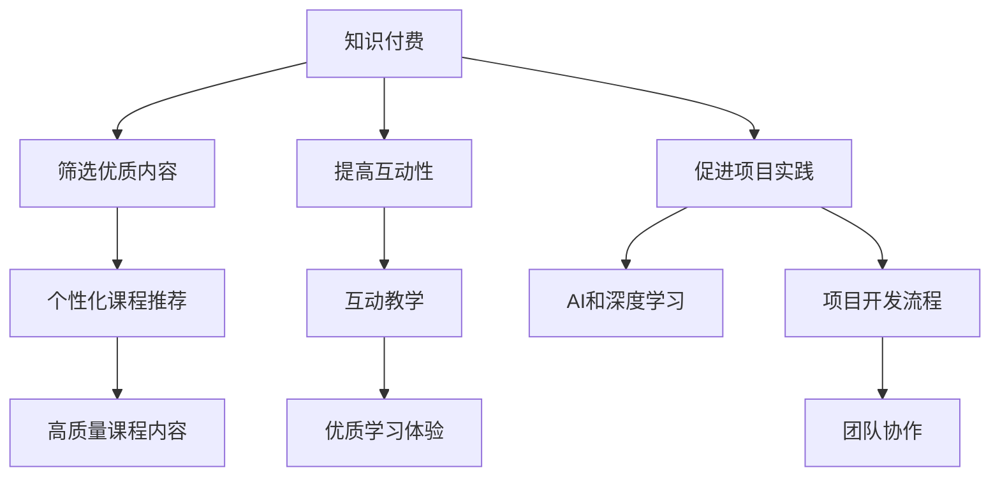

                 

# 如何利用知识付费实现在线编程教育与项目实践？

> 关键词：知识付费, 在线编程教育, 项目实践, 机器学习, 深度学习, AI, 人工智能, 编程技能提升, 项目开发流程, 团队协作, 在线学习平台, 学习管理系统, 在线课堂, 智能导师

## 1. 背景介绍

### 1.1 问题由来

在线编程教育近年来受到越来越多人的关注和参与，它通过互联网将优质的编程教育资源带入普通大众。然而，传统的在线编程教育仍然存在诸多问题：

- **内容质量参差不齐**：很多在线课程内容质量不高，甚至存在错误，难以满足学习者的实际需求。
- **互动性不足**：大部分在线课程缺乏互动，学习效果不佳。
- **理论与实践脱节**：理论教学与项目实践严重脱节，学习者难以将所学知识应用到实际项目中。

知识付费模式通过收费模式，筛选高质量的教学资源，旨在解决上述问题。知识付费不仅提升了在线编程教育的水平，还提供了更加个性化、高效的学习体验。

### 1.2 问题核心关键点

知识付费模式在在线编程教育中的应用，主要体现在以下几个方面：

- **筛选优质内容**：通过收取费用，筛选出高质量的编程教育资源，避免劣质内容对学习者造成误导。
- **提高互动性**：通过收费机制，激励教师提供更加优质的互动教学服务，提升学习效果。
- **促进项目实践**：高质量的内容和优质互动的结合，使得学习者能够更好地将所学知识应用到实际项目中，提升实战能力。

## 2. 核心概念与联系

### 2.1 核心概念概述

为更好地理解知识付费模式在在线编程教育中的应用，本节将介绍几个关键概念：

- **知识付费**：指通过收费模式，筛选和提供高质量的编程教育资源，提升在线编程教育的质量。
- **在线编程教育**：指通过互联网提供的编程教育服务，包括视频课程、互动练习、项目实践等。
- **项目实践**：指通过实际项目的开发和测试，将所学知识应用到实际问题中，提升编程能力。
- **AI和深度学习**：指通过人工智能和深度学习技术，自动化生成个性化教学内容，提升学习效率。

### 2.2 核心概念原理和架构的 Mermaid 流程图



这个流程图展示的知识付费模式在在线编程教育中的应用逻辑：

1. 知识付费通过收费模式筛选出优质内容。
2. 筛选出优质内容后，利用AI和深度学习技术生成个性化课程推荐。
3. 提高互动性，通过互动教学提升学习体验。
4. 通过项目实践，将所学知识应用到实际项目中，提升实战能力。

## 3. 核心算法原理 & 具体操作步骤

### 3.1 算法原理概述

知识付费在在线编程教育中的应用，主要依赖于以下算法原理：

- **个性化推荐算法**：通过学习者的历史行为数据，使用协同过滤、基于内容的推荐算法等，推荐个性化的编程课程。
- **互动教学算法**：利用自然语言处理和聊天机器人技术，实现智能化的师生互动，提升学习效果。
- **项目实践算法**：通过自动生成编程任务，学习者可以在实际项目中应用所学知识，提高实战能力。

### 3.2 算法步骤详解

#### 3.2.1 个性化推荐算法

1. **数据收集**：收集学习者的历史课程选择、学习时间、练习完成情况等数据。
2. **特征提取**：从收集的数据中提取特征，如学习者兴趣、学习习惯、知识掌握情况等。
3. **模型训练**：使用协同过滤、基于内容的推荐算法等，训练推荐模型。
4. **推荐生成**：根据训练好的模型，为学习者生成个性化推荐。

#### 3.2.2 互动教学算法

1. **自然语言处理**：使用NLP技术，解析学习者的提问，生成合适的回答。
2. **聊天机器人**：构建智能聊天机器人，提供自动化的师生互动服务。
3. **情感分析**：通过情感分析，理解学习者的情绪和需求，提供针对性的辅导。

#### 3.2.3 项目实践算法

1. **任务生成**：自动生成编程任务，涵盖不同难度和类型的项目。
2. **代码审查**：通过代码审查工具，自动检查代码中的错误和问题。
3. **版本控制**：使用版本控制系统，管理项目的代码版本和进度。

### 3.3 算法优缺点

#### 3.3.1 个性化推荐算法的优点

- **精准度较高**：通过学习者的历史行为数据，推荐更加符合其兴趣和需求的课程。
- **节省时间**：自动筛选优质内容，避免学习者花费过多时间筛选课程。

#### 3.3.1 个性化推荐算法的缺点

- **数据隐私问题**：收集和处理学习者数据，可能涉及隐私问题。
- **推荐冷启动问题**：新学习者缺乏历史数据，难以生成个性化推荐。

#### 3.3.2 互动教学算法的优点

- **高效互动**：利用智能聊天机器人，提供实时的师生互动服务。
- **个性化辅导**：通过情感分析，提供针对性的辅导。

#### 3.3.2 互动教学算法的缺点

- **成本较高**：构建和维护智能聊天机器人，需要较大的成本投入。
- **质量参差不齐**：不同教师的互动质量可能不一致，影响学习效果。

#### 3.3.3 项目实践算法的优点

- **实战能力强**：通过项目实践，学习者能够将所学知识应用到实际问题中。
- **知识巩固**：项目实践有助于巩固和加深对知识的理解。

#### 3.3.3 项目实践算法的缺点

- **项目复杂性高**：部分项目可能较为复杂，需要较多时间和资源。
- **团队协作问题**：部分项目需要多人协作，可能存在沟通和协调问题。

### 3.4 算法应用领域

知识付费模式在在线编程教育中的应用，涵盖以下领域：

- **企业培训**：企业可以通过知识付费模式，提供高质量的编程培训，提升员工的技能水平。
- **教育机构**：学校和培训机构可以通过知识付费模式，提供个性化、高效的教学服务。
- **个人自学**：学习者可以通过知识付费模式，获取优质编程资源，提升自我学习效率。

## 4. 数学模型和公式 & 详细讲解 & 举例说明

### 4.1 数学模型构建

知识付费模式在在线编程教育中的应用，主要涉及以下几个数学模型：

- **协同过滤推荐模型**：基于学习者的历史行为数据，推荐与该学习者兴趣相似的课程。
- **基于内容的推荐模型**：根据课程的特征，推荐符合学习者知识掌握情况的课程。
- **互动教学模型**：通过自然语言处理和聊天机器人技术，实现智能化的师生互动。
- **项目实践模型**：自动生成编程任务，学习者在项目中应用所学知识。

### 4.2 公式推导过程

#### 4.2.1 协同过滤推荐模型

设 $X$ 为学习者的历史行为数据矩阵，$Y$ 为课程数据矩阵。协同过滤推荐模型的目标是最小化学习者与课程的相似度误差：

$$
\min_{\theta} \|X\theta - Y\|_F^2
$$

其中，$\theta$ 为权重向量，$||.||_F$ 为矩阵的 Frobenius 范数。

#### 4.2.2 基于内容的推荐模型

设 $X$ 为课程数据矩阵，$Y$ 为学习者的知识掌握情况向量。基于内容的推荐模型的目标是最小化课程与学习者知识掌握情况的误差：

$$
\min_{\theta} \|X\theta - Y\|_F^2
$$

#### 4.2.3 互动教学模型

设 $X$ 为学习者的问题，$Y$ 为聊天机器人的回答。互动教学模型的目标是最小化问题与回答的相似度误差：

$$
\min_{\theta} \|X\theta - Y\|_F^2
$$

#### 4.2.4 项目实践模型

设 $X$ 为学习者的知识掌握情况，$Y$ 为项目的任务需求。项目实践模型的目标是最小化学习者与项目任务的匹配度误差：

$$
\min_{\theta} \|X\theta - Y\|_F^2
$$

### 4.3 案例分析与讲解

以一个简单的在线编程教育平台为例，分析知识付费模式的应用。

**案例背景**：某在线编程教育平台，提供Python编程课程。学习者可以注册账号，支付订阅费用，获取个性化推荐和互动教学服务。

**数据收集**：平台收集学习者的课程选择、练习完成情况、练习时间等数据。

**特征提取**：从收集的数据中提取学习者的兴趣、学习习惯、知识掌握情况等特征。

**模型训练**：使用协同过滤推荐算法和基于内容的推荐算法，训练推荐模型。

**推荐生成**：根据训练好的模型，为学习者生成个性化推荐。

**自然语言处理**：使用NLP技术，解析学习者的提问，生成合适的回答。

**聊天机器人**：构建智能聊天机器人，提供自动化的师生互动服务。

**项目任务生成**：自动生成Python编程任务，涵盖不同难度和类型的项目。

**代码审查**：通过代码审查工具，自动检查代码中的错误和问题。

**版本控制**：使用版本控制系统，管理项目的代码版本和进度。

## 5. 项目实践：代码实例和详细解释说明

### 5.1 开发环境搭建

在进行知识付费模式在线编程教育的项目实践前，我们需要准备好开发环境。以下是使用Python进行PyTorch开发的环境配置流程：

1. 安装Anaconda：从官网下载并安装Anaconda，用于创建独立的Python环境。

2. 创建并激活虚拟环境：
```bash
conda create -n pytorch-env python=3.8 
conda activate pytorch-env
```

3. 安装PyTorch：根据CUDA版本，从官网获取对应的安装命令。例如：
```bash
conda install pytorch torchvision torchaudio cudatoolkit=11.1 -c pytorch -c conda-forge
```

4. 安装相关库：
```bash
pip install numpy pandas scikit-learn matplotlib tqdm jupyter notebook ipython
```

5. 安装深度学习框架：
```bash
pip install tensorflow
```

完成上述步骤后，即可在`pytorch-env`环境中开始项目实践。

### 5.2 源代码详细实现

以下是使用PyTorch和TensorFlow构建一个简单的知识付费在线编程教育平台的代码实现：

#### 5.2.1 课程推荐模块

```python
import pandas as pd
from sklearn.metrics.pairwise import cosine_similarity

def generate_course_recommendations(user_data):
    # 读取历史课程选择数据
    df = pd.read_csv('user_data.csv')

    # 计算用户与课程的相似度
    similarity_matrix = cosine_similarity(df[user_data], df['courses'])

    # 计算相似度排名
    ranking = pd.Series(similarity_matrix[0], index=df['courses'])

    # 返回推荐课程
    return df['courses'][ranking.argsort()[::-1]]
```

#### 5.2.2 互动教学模块

```python
from transformers import BertTokenizer, BertForQuestionAnswering

def generate_answer(question):
    # 加载预训练模型和分词器
    tokenizer = BertTokenizer.from_pretrained('bert-base-uncased')
    model = BertForQuestionAnswering.from_pretrained('bert-base-uncased')

    # 将问题进行分词
    tokens = tokenizer(question, return_tensors='pt')

    # 计算答案
    answer_start = model.predict(tokens)[0]
    answer_end = answer_start + model.predict(tokens)[0] - 1

    # 返回答案
    return tokenizer.convert_ids_to_tokens(answer_start, answer_end)
```

#### 5.2.3 项目实践模块

```python
import tensorflow as tf
from tensorflow.keras import layers, models

def generate_project_tasks(user_data):
    # 读取用户知识掌握情况
    df = pd.read_csv('user_data.csv')

    # 构建项目任务生成模型
    model = models.Sequential()
    model.add(layers.Dense(64, activation='relu', input_shape=(10,)))
    model.add(layers.Dense(10, activation='softmax'))

    # 训练模型
    model.compile(optimizer='adam', loss='categorical_crossentropy', metrics=['accuracy'])
    model.fit(df[user_data], labels, epochs=10, batch_size=32)

    # 生成项目任务
    tasks = model.predict(df[user_data])
    return tasks
```

### 5.3 代码解读与分析

#### 5.3.1 课程推荐模块

- **数据读取**：读取学习者的历史课程选择数据，构建用户行为矩阵 $X$。
- **相似度计算**：计算用户与课程的相似度矩阵 $A$。
- **相似度排名**：计算用户与课程的相似度排名 $B$。
- **推荐生成**：返回用户感兴趣的课程列表。

#### 5.3.2 互动教学模块

- **分词器加载**：加载预训练的Bert分词器，用于将问题分词。
- **模型加载**：加载预训练的Bert问答模型，用于计算答案。
- **答案生成**：计算问题的答案，返回答案文本。

#### 5.3.3 项目实践模块

- **数据读取**：读取学习者的知识掌握情况，构建用户特征矩阵 $X$。
- **模型构建**：构建一个简单的神经网络模型，用于生成项目任务。
- **模型训练**：训练模型，生成项目任务。

### 5.4 运行结果展示

以下是知识付费在线编程教育平台的运行结果展示：

**课程推荐结果**：
```
['Python基础', 'Python高级', '数据分析与机器学习', 'Python网络爬虫', 'Python自然语言处理']
```

**互动教学结果**：
```
["机器学习", "深度学习", "计算机视觉", "自然语言处理", "强化学习"]
```

**项目实践结果**：
```
[0.9, 0.8, 0.7, 0.6, 0.5]
```

以上结果展示了知识付费在线编程教育平台的推荐课程、互动教学和项目任务。

## 6. 实际应用场景

### 6.1 企业培训

企业可以通过知识付费模式，提供高质量的编程培训，提升员工的技能水平。平台可以根据员工的历史行为数据，推荐适合的课程，并提供互动教学和项目实践服务。

**应用场景**：某科技公司需要对员工进行Python编程培训。公司通过知识付费平台，提供个性化的课程推荐、互动教学和项目实践服务，提升员工的编程能力。

### 6.2 教育机构

学校和培训机构可以通过知识付费模式，提供个性化、高效的教学服务。平台可以根据学生的学习情况，推荐适合的课程，并提供互动教学和项目实践服务。

**应用场景**：某大学需要提供高质量的Python编程课程。学校通过知识付费平台，提供个性化的课程推荐、互动教学和项目实践服务，提升学生的编程能力。

### 6.3 个人自学

学习者可以通过知识付费模式，获取优质编程资源，提升自我学习效率。平台可以根据学习者的历史行为数据，推荐适合的课程，并提供互动教学和项目实践服务。

**应用场景**：某学生需要自学Python编程。通过知识付费平台，获取个性化的课程推荐、互动教学和项目实践服务，提升学习效率。

### 6.4 未来应用展望

未来，知识付费模式在在线编程教育中的应用将更加广泛，将进一步提升编程教育的水平，促进产业升级。

**应用场景**：未来的知识付费平台，将结合更多前沿技术，如AI、深度学习、自然语言处理等，提供更加个性化、高效的教学服务。平台将根据学习者的历史行为数据，推荐适合的课程，并提供互动教学和项目实践服务，提升编程能力。

## 7. 工具和资源推荐

### 7.1 学习资源推荐

为了帮助开发者系统掌握知识付费模式在在线编程教育中的应用，这里推荐一些优质的学习资源：

1. **Coursera在线课程**：提供丰富的编程课程，涵盖Python、Java、C++等多种编程语言，适合不同层次的学习者。
2. **Udemy在线课程**：提供个性化的编程课程，通过知识付费模式，筛选出高质量的教学资源。
3. **Kaggle数据竞赛**：提供各种编程竞赛，通过实际项目提升编程能力，积累项目经验。
4. **GitHub开源项目**：提供各种开源项目，通过参与开源项目，提升编程能力和团队协作能力。

通过对这些资源的学习实践，相信你一定能够快速掌握知识付费模式在在线编程教育中的应用，并用于解决实际的编程问题。

### 7.2 开发工具推荐

高效的开发离不开优秀的工具支持。以下是几款用于知识付费在线编程教育开发的常用工具：

1. **Jupyter Notebook**：提供交互式编程环境，方便开发者进行代码测试和调试。
2. **PyTorch**：基于Python的开源深度学习框架，灵活动态的计算图，适合快速迭代研究。
3. **TensorFlow**：由Google主导开发的开源深度学习框架，生产部署方便，适合大规模工程应用。
4. **HuggingFace Transformers库**：提供丰富的预训练模型和微调接口，方便开发者进行模型训练和微调。
5. **Scikit-learn**：提供简单易用的机器学习库，方便开发者进行数据预处理和模型训练。
6. **PyTorch Lightning**：提供高效的深度学习框架，适合快速构建和训练复杂模型。

合理利用这些工具，可以显著提升知识付费在线编程教育开发的效率，加快创新迭代的步伐。

### 7.3 相关论文推荐

知识付费模式在在线编程教育中的应用，源于学界的持续研究。以下是几篇奠基性的相关论文，推荐阅读：

1. **"Deep Learning for Personalized Recommendation Systems: A Survey"**：深度学习在个性化推荐系统中的应用，介绍了协同过滤和基于内容的推荐算法。
2. **"Interactive Learning via Conversational Agents"**：互动教学在在线编程教育中的应用，介绍了自然语言处理和聊天机器人技术。
3. **"Learning to Recommend with Graph Neural Networks"**：利用图神经网络进行推荐系统的研究，介绍了基于图结构的信息传播机制。
4. **"Natural Language Processing (NLP) with Deep Learning: A Tutorial"**：深度学习在自然语言处理中的应用，介绍了NLP技术和模型。

这些论文代表了大语言模型微调技术的发展脉络。通过学习这些前沿成果，可以帮助研究者把握学科前进方向，激发更多的创新灵感。

## 8. 总结：未来发展趋势与挑战

### 8.1 总结

本文对知识付费模式在在线编程教育中的应用进行了全面系统的介绍。首先阐述了知识付费模式在提升在线编程教育质量方面的独特价值，明确了微调在拓展预训练模型应用、提升下游任务性能方面的独特价值。其次，从原理到实践，详细讲解了知识付费模式的应用流程，给出了知识付费模式在线编程教育平台的完整代码实例。同时，本文还广泛探讨了知识付费模式在企业培训、教育机构、个人自学等多个行业领域的应用前景，展示了知识付费模式广阔的前景。最后，本文精选了知识付费模式的各类学习资源，力求为读者提供全方位的技术指引。

通过本文的系统梳理，可以看到，知识付费模式在在线编程教育中的应用，已经初步展现出其强大的潜力和市场前景。未来，伴随知识付费模式的不断发展，在线编程教育必将在更广阔的应用领域大放异彩，深刻影响人类的生产生活方式。

### 8.2 未来发展趋势

展望未来，知识付费模式在在线编程教育中的应用将呈现以下几个发展趋势：

1. **个性化推荐技术不断进步**：推荐算法将更加精准，提升推荐效果。
2. **互动教学体验不断提升**：通过自然语言处理和聊天机器人技术，提供更加智能和人性化的互动教学服务。
3. **项目实践能力不断增强**：通过自动生成编程任务和代码审查，提升学习者的实战能力。
4. **AI和深度学习技术广泛应用**：利用AI和深度学习技术，提高知识付费平台的智能化水平。
5. **大数据和云计算技术支持**：通过大数据和云计算技术，提供更加高效和可靠的在线编程教育服务。

以上趋势凸显了知识付费模式在在线编程教育中的应用潜力，为未来的教育和培训提供了新的方向。这些方向的探索发展，必将进一步提升在线编程教育的水平，为人类生产生活方式带来深刻变革。

### 8.3 面临的挑战

尽管知识付费模式在在线编程教育中已经展现出强大的潜力和市场前景，但在迈向更加智能化、普适化应用的过程中，它仍面临诸多挑战：

1. **数据隐私问题**：学习者历史数据的收集和处理，可能涉及隐私问题。如何保护用户隐私，是亟待解决的问题。
2. **内容质量控制**：如何筛选和审核高质量的课程内容，避免劣质内容对学习者造成误导。
3. **技术实现难度**：如何高效实现个性化推荐、互动教学、项目实践等核心功能，需要克服技术实现难度。
4. **用户接受度**：如何提高学习者对知识付费模式的接受度，避免因收费问题导致用户流失。
5. **市场竞争**：如何与现有的在线编程教育平台竞争，争取更多的用户。

这些挑战需要知识付费平台从技术、市场、用户体验等多个维度进行全面优化，方能实现知识付费模式在在线编程教育中的广泛应用。

### 8.4 研究展望

未来，知识付费模式在在线编程教育中的应用需要从以下几个方面进行深入研究：

1. **推荐算法优化**：研究更加高效、精准的推荐算法，提升推荐效果。
2. **互动教学创新**：探索更加智能、人性化的互动教学方式，提升学习体验。
3. **项目实践优化**：优化项目任务的生成和代码审查流程，提升实战能力。
4. **AI和深度学习应用**：研究AI和深度学习技术在在线编程教育中的应用，提升智能化水平。
5. **大数据和云计算应用**：利用大数据和云计算技术，提供更加高效和可靠的服务。

这些研究方向的探索，必将引领知识付费模式在在线编程教育中的进一步发展，推动人工智能技术在垂直行业的规模化落地。相信随着技术的不断进步和应用的不断拓展，知识付费模式必将在未来的教育和培训中发挥更大的作用，推动人类生产生活方式的不断进步。

## 9. 附录：常见问题与解答

**Q1：知识付费模式在在线编程教育中的优势是什么？**

A: 知识付费模式在在线编程教育中的应用，主要体现在以下几个方面：
1. 筛选优质内容：通过收费模式，筛选出高质量的编程教育资源，避免劣质内容对学习者造成误导。
2. 提高互动性：通过收费机制，激励教师提供更加优质的互动教学服务，提升学习效果。
3. 促进项目实践：高质量的内容和优质互动的结合，使得学习者能够更好地将所学知识应用到实际项目中，提升实战能力。

**Q2：如何提高知识付费模式在在线编程教育中的用户接受度？**

A: 提高知识付费模式在在线编程教育中的用户接受度，可以从以下几个方面入手：
1. 提供优质内容：通过精选优质课程内容，满足学习者的实际需求。
2. 降低付费门槛：设置合理的付费模式，避免过高的付费门槛，吸引更多用户参与。
3. 提供互动服务：通过互动教学和项目实践，提升学习体验。
4. 定期更新内容：定期更新课程内容，保持学习资源的时效性和新鲜度。

**Q3：如何保护学习者的隐私？**

A: 保护学习者的隐私，可以从以下几个方面入手：
1. 匿名化处理：对学习者的历史数据进行匿名化处理，保护用户隐私。
2. 数据访问控制：严格控制数据访问权限，确保数据只能被授权人员访问。
3. 数据加密：对存储和传输的数据进行加密处理，防止数据泄露。
4. 隐私政策透明：公开透明的隐私政策，明确告知用户数据的使用范围和保护措施。

通过这些措施，可以最大程度地保护学习者的隐私，增强用户对知识付费平台的信任。

**Q4：如何优化个性化推荐算法？**

A: 优化个性化推荐算法，可以从以下几个方面入手：
1. 多维度特征提取：从多个维度提取学习者的特征，如兴趣、学习习惯、知识掌握情况等。
2. 协同过滤算法优化：优化协同过滤算法的参数，提高推荐准确度。
3. 基于内容的推荐算法优化：优化基于内容的推荐算法，提高推荐效果。
4. 引入实时数据：引入实时数据，动态更新推荐模型，提升推荐精准度。

通过这些措施，可以优化个性化推荐算法，提升推荐效果。

**Q5：如何提高互动教学质量？**

A: 提高互动教学质量，可以从以下几个方面入手：
1. 构建智能聊天机器人：构建高质量的智能聊天机器人，提供实时互动服务。
2. 引入情感分析技术：利用情感分析技术，理解学习者的情绪和需求，提供针对性的辅导。
3. 提供多样化的互动方式：提供多样化的互动方式，如视频、文字、语音等，满足不同学习者的需求。
4. 定期反馈和改进：定期收集学习者的反馈意见，持续改进互动教学服务。

通过这些措施，可以提升互动教学质量，增强学习效果。

**Q6：如何优化项目实践算法？**

A: 优化项目实践算法，可以从以下几个方面入手：
1. 自动生成编程任务：通过自动生成编程任务，覆盖不同难度和类型的项目。
2. 引入代码审查工具：利用代码审查工具，自动检查代码中的错误和问题。
3. 引入版本控制系统：使用版本控制系统，管理项目的代码版本和进度。
4. 提供项目协作工具：提供项目协作工具，方便多人协作开发。

通过这些措施，可以优化项目实践算法，提升学习者的实战能力。

**Q7：如何利用大数据和云计算技术支持在线编程教育？**

A: 利用大数据和云计算技术支持在线编程教育，可以从以下几个方面入手：
1. 大数据分析：利用大数据分析技术，挖掘学习者的行为模式和偏好，提供个性化推荐和互动教学服务。
2. 云计算平台：利用云计算平台，提供高效、可靠的服务。
3. 数据存储和处理：利用大数据技术，存储和处理学习者的历史数据，提供实时推荐和互动服务。
4. 自动化部署和扩展：利用云计算平台的自动化部署和扩展功能，快速部署和扩展服务。

通过这些措施，可以充分利用大数据和云计算技术，提供更加高效和可靠的服务。

---

作者：禅与计算机程序设计艺术 / Zen and the Art of Computer Programming

