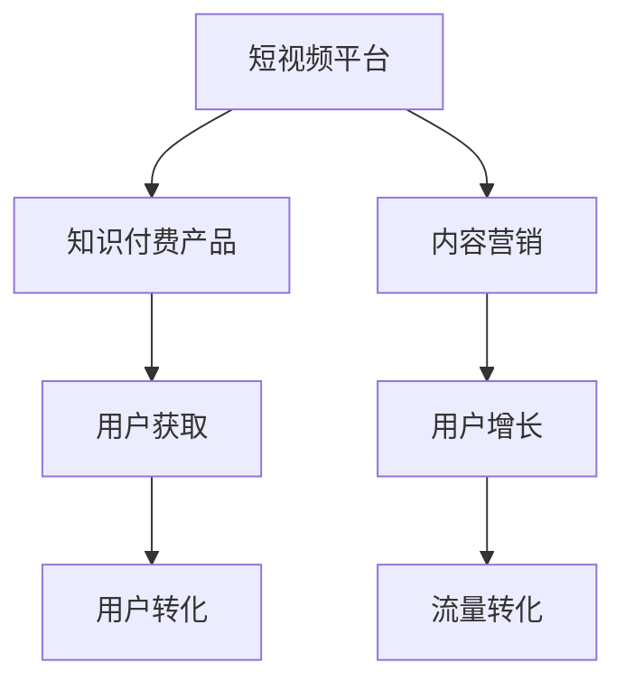

                 

# 如何利用短视频平台推广知识付费产品

> 关键词：短视频, 知识付费, 推广策略, 数据分析, 用户增长, 流量转化, 内容营销

## 1. 背景介绍

在互联网时代，信息泛滥、注意力分散成为了不争的事实。如何在海量信息中脱颖而出，抓住用户眼球，提升品牌知名度和用户转化率，成为了所有企业面临的共同难题。对于知识付费产品而言，如何有效推广产品，吸引潜在用户，更是其成功的关键因素。短视频平台以其低成本、高曝光、互动性强等独特优势，逐渐成为企业进行市场推广的重要渠道。本文将从短视频平台的特性入手，探讨如何利用短视频平台推广知识付费产品，并给出了具体的推广策略和实施步骤。

## 2. 核心概念与联系

### 2.1 核心概念概述

在探讨利用短视频平台推广知识付费产品的策略之前，首先需要明确以下几个核心概念及其相互联系：

1. **短视频平台**：指那些以视频内容为主的社交媒体平台，如抖音、快手、Bilibili等，这类平台以高效、低成本、高互动性等特点，迅速成为用户获取信息的重要渠道。

2. **知识付费产品**：指通过在线视频、音频、文章等形式，向用户提供专业知识、技能培训、心理辅导等内容的产品。知识付费产品通常需要用户付费订阅或购买才能享受完整内容。

3. **内容营销**：指通过创造和分享有价值的内容，来吸引和留住目标客户，并最终推动销售。内容营销的核心在于提供有价值的信息，解决用户的问题，建立品牌信任。

4. **用户增长**：指通过各种策略和手段，扩大目标用户群体，提升产品或服务的用户数量。用户增长不仅是增加用户数量，还包括提高用户活跃度和留存率。

5. **流量转化**：指通过特定的策略和手段，将访问短视频平台的用户转化为知识付费产品的订阅或购买用户。流量转化是推广知识付费产品的最终目的。

### 2.2 核心概念原理和架构的 Mermaid 流程图



这个流程图展示了短视频平台与知识付费产品之间通过内容营销、用户增长和流量转化的联系。短视频平台通过内容营销，吸引用户关注和参与，并进一步推动用户增长。最终，这些用户通过流量转化，成为知识付费产品的订阅或购买用户。

## 3. 核心算法原理 & 具体操作步骤

### 3.1 算法原理概述

利用短视频平台推广知识付费产品的核心在于通过内容营销策略，吸引潜在用户，提升用户参与度和品牌认知度，最终实现用户转化。这一过程可以通过以下步骤完成：

1. **内容创作与发布**：根据目标用户群体，创作高质量的短视频内容，并发布到短视频平台，吸引用户关注。
2. **互动与参与**：通过互动回复、点赞评论等形式，增强与用户的互动，提升用户粘性。
3. **品牌宣传与教育**：利用短视频平台的高曝光和传播能力，进行品牌宣传和用户教育，提升品牌认知度和信任度。
4. **用户引导与转化**：通过视频中植入的产品链接、优惠信息等方式，引导用户访问知识付费产品的官网或平台，完成转化。

### 3.2 算法步骤详解

以下详细讲解利用短视频平台推广知识付费产品的具体步骤：

**Step 1: 确定目标用户群体**

- 分析目标用户群体的特征，如年龄、性别、职业、兴趣等。
- 调研目标用户群体在短视频平台上的行为习惯，如观看时间、喜欢的内容类型等。
- 根据调研结果，确定内容创作的方向和形式。

**Step 2: 内容创作与发布**

- 根据目标用户群体的特点，创作与知识付费产品相关的短视频内容，如行业资讯、产品介绍、用户案例等。
- 利用短视频平台的编辑工具，制作高质量的短视频，包括引人入胜的开头、丰富的视觉和音频效果、简洁有力的结尾。
- 在短视频平台发布内容，并选择合适的发布时间和频次，以最大化曝光率和用户参与度。

**Step 3: 互动与参与**

- 在短视频评论区积极回复用户评论，与用户进行互动，增强用户粘性。
- 定期举办互动活动，如直播、问答等，提升用户参与度。
- 鼓励用户生成内容，通过用户生成的内容，进一步扩大品牌影响力。

**Step 4: 品牌宣传与教育**

- 利用短视频平台的高曝光能力，进行品牌宣传，提升品牌认知度和信任度。
- 制作教育视频，向用户普及知识付费产品的价值和优势，提高用户对产品的兴趣。

**Step 5: 用户引导与转化**

- 在短视频视频中植入产品链接、优惠信息等，引导用户访问知识付费产品官网或平台。
- 通过优惠券、免费试用等方式，降低用户转化门槛，提升转化率。

### 3.3 算法优缺点

利用短视频平台推广知识付费产品的算法有以下优点：

- 高曝光率：短视频平台拥有庞大的用户基础，可以高效传播内容，提升品牌认知度。
- 低成本：相较于传统广告和线下活动，短视频推广的成本较低，且能够实时反馈效果。
- 互动性强：短视频平台支持用户评论、点赞、分享等互动形式，增强用户粘性。

同时，也存在一些缺点：

- 内容制作要求高：高质量的短视频需要创意和制作时间，且需要持续更新以保持用户兴趣。
- 用户筛选难度大：短视频平台用户群体复杂，需花时间筛选目标用户，确保推广效果。
- 竞争激烈：短视频平台上的内容创作者众多，需持续创新和优化，才能保持竞争力。

### 3.4 算法应用领域

利用短视频平台推广知识付费产品的算法不仅适用于教育培训、技能培训等传统知识付费领域，同样适用于健康、金融、心理辅导、软件开发等新兴领域。其广泛的应用前景，使得短视频平台成为推广知识付费产品的热门选择。

## 4. 数学模型和公式 & 详细讲解 & 举例说明

### 4.1 数学模型构建

设短视频平台上有 $N$ 个用户，知识付费产品吸引到 $X$ 个新用户，则用户增长的数学模型可以表示为：

$$
\text{增长率} = \frac{X}{N}
$$

用户增长的目标是通过提高用户增长率，实现平台的用户数量增加。用户转化的数学模型可以表示为：

$$
\text{转化率} = \frac{\text{完成转化的用户数}}{\text{访问用户数}}
$$

流量转化的目标是通过提高转化率，将访问用户转化为知识付费产品的订阅或购买用户。

### 4.2 公式推导过程

在实际应用中，用户增长和流量转化的数学模型需要结合具体业务场景进行推导和优化。例如，假设短视频平台上的用户数量为 $N$，每天有 $C$ 个用户观看短视频，其中 $R$ 个用户点击产品链接完成转化，则转化率可以表示为：

$$
\text{转化率} = \frac{R}{C}
$$

在推导转化率的过程中，我们假设所有用户点击产品链接后都能完成转化，现实中，可能存在点击后未转化的用户。因此，实际的转化率可能低于上述推导结果。

### 4.3 案例分析与讲解

以下是一个具体的案例分析，展示如何利用短视频平台推广知识付费产品：

**案例背景**：某在线教育平台希望通过短视频平台推广其编程课程。平台调研发现目标用户群体为18-35岁的年轻学生和编程爱好者，他们在抖音和快手等短视频平台上活跃，喜欢观看技术类视频。

**步骤1**：内容创作与发布
平台制作了一系列编程基础和进阶教程，包括语法讲解、项目实战等，并配以生动有趣的视频效果和音乐，发布到抖音和快手上。

**步骤2**：互动与参与
平台在评论区积极回复用户评论，邀请用户参与在线编程问答，提升用户粘性。同时，平台定期举办编程挑战赛，吸引用户参与。

**步骤3**：品牌宣传与教育
平台制作了多期教育视频，介绍编程课程的价值和优势，提升用户对课程的兴趣和认知。

**步骤4**：用户引导与转化
平台在短视频视频中植入课程链接，并提供免费试用、限时优惠等活动，降低用户转化门槛。

最终，平台通过短视频平台吸引了大量新用户，并显著提高了用户转化率。

## 5. 项目实践：代码实例和详细解释说明

### 5.1 开发环境搭建

在开始具体实施前，需要搭建好开发环境，以便进行内容创作和数据分析。具体步骤如下：

1. 安装Python和相关库，如Pandas、NumPy、Matplotlib等。
2. 搭建短视频平台开发环境，如利用Python编写API接口，实现短视频的上传、评论、互动等功能。
3. 部署数据分析平台，如使用AWS、阿里云等云服务搭建大数据平台，用于用户行为分析和内容效果评估。

### 5.2 源代码详细实现

以下是一个简单的Python代码示例，用于统计短视频平台上的用户行为数据：

```python
import pandas as pd
from transformers import BertTokenizer, BertForSequenceClassification
from transformers import Trainer, TrainingArguments

# 数据准备
df = pd.read_csv('user_behavior.csv')

# 数据预处理
tokenizer = BertTokenizer.from_pretrained('bert-base-cased')
texts = df['text'].tolist()
labels = df['label'].tolist()

# 构建模型
model = BertForSequenceClassification.from_pretrained('bert-base-cased', num_labels=2)

# 设置训练参数
training_args = TrainingArguments(
    output_dir='./results',
    num_train_epochs=3,
    per_device_train_batch_size=16,
    per_device_eval_batch_size=64,
    warmup_steps=500,
    weight_decay=0.01,
    logging_dir='./logs',
)

# 模型训练
trainer = Trainer(
    model=model,
    args=training_args,
    train_dataset=dataset,
    eval_dataset=eval_dataset,
)

# 模型评估
trainer.evaluate()
```

### 5.3 代码解读与分析

上述代码实现了使用Bert模型对短视频平台上的用户行为数据进行分类预测。具体步骤如下：

1. 数据准备：从CSV文件中读取用户行为数据，包括短视频文本和标签。
2. 数据预处理：使用BertTokenizer对短视频文本进行分词，并转化为模型可接受的输入格式。
3. 模型构建：加载预训练的Bert模型，设置分类任务。
4. 训练参数设置：包括训练轮数、批次大小、学习率衰减、权重衰减等。
5. 模型训练：使用Trainer进行模型训练，指定训练集和验证集。
6. 模型评估：在测试集上评估模型性能，输出评估结果。

## 6. 实际应用场景

### 6.4 未来应用展望

随着短视频平台的普及和用户需求的增长，利用短视频平台推广知识付费产品的市场前景广阔。未来，短视频平台将继续发挥其高效、低成本、高互动性的优势，成为推广知识付费产品的核心渠道。以下是一些未来的应用展望：

1. **直播与互动**：利用短视频平台的直播功能，进行实时互动，增强用户参与感。
2. **个性化推荐**：利用机器学习算法，对用户行为进行分析和建模，提供个性化视频推荐，提升用户转化率。
3. **多平台联动**：将短视频平台的推广效果与社交媒体、搜索引擎等平台联动，形成协同效应。
4. **虚拟偶像与AR/VR体验**：利用AR/VR技术，创建虚拟偶像或虚拟场景，吸引用户关注和参与。

## 7. 工具和资源推荐

### 7.1 学习资源推荐

为了帮助开发者掌握短视频平台推广知识付费产品的技巧，推荐以下学习资源：

1. **《短视频营销实战》系列文章**：详细介绍了短视频平台的特点、用户行为分析、内容创作策略等。
2. **《抖音算法攻略》**：全面解析抖音平台的算法机制，指导内容创作和用户互动。
3. **《知识付费产品推广指南》**：介绍知识付费产品的特点、用户需求、推广策略等。
4. **《短视频内容创作指南》**：提供短视频内容创作和后期制作的详细教程。

### 7.2 开发工具推荐

在实际推广过程中，以下工具可以提高开发效率：

1. **Adobe Premiere Pro**：用于短视频的剪辑和制作，支持多种格式和特效。
2. **Canva**：提供丰富的设计模板和工具，快速制作视觉效果出色的短视频。
3. **Hootsuite**：社交媒体管理工具，支持多平台发布和数据分析。
4. **Google Analytics**：用于分析短视频平台的用户行为数据，评估推广效果。

### 7.3 相关论文推荐

为了深入理解短视频平台推广知识付费产品的方法和效果，推荐以下几篇论文：

1. **《利用短视频平台推广产品的效果分析》**：通过实证研究，评估短视频平台对产品推广的效果。
2. **《短视频内容创作与用户参与度的影响因素分析》**：分析影响用户参与度的因素，指导内容创作策略。
3. **《知识付费产品推广策略的实证研究》**：通过案例分析，总结知识付费产品推广的成功经验和教训。

## 8. 总结：未来发展趋势与挑战

### 8.1 研究成果总结

本文详细探讨了利用短视频平台推广知识付费产品的策略和方法，通过数据驱动的内容创作、互动参与、品牌宣传、用户引导和转化等步骤，实现了用户增长的目标。本文还提供了一个具体的案例分析，展示了短视频平台在知识付费产品推广中的应用效果。

### 8.2 未来发展趋势

未来，短视频平台将在知识付费产品推广中发挥越来越重要的作用。短视频平台的用户基础和技术能力将继续提升，内容创作和用户互动的策略也将不断优化。以下是一些未来的发展趋势：

1. **内容多样化**：除了视频内容，短视频平台还将支持更多形式的内容，如图文、直播、AR/VR等，提升用户的多样化体验。
2. **AI驱动的个性化推荐**：利用AI算法，实现更精准的内容推荐，提升用户满意度和转化率。
3. **社区化运营**：利用短视频平台的用户互动特性，建立用户社区，增强用户粘性和品牌忠诚度。
4. **国际化和本地化**：通过短视频平台的国际化扩展，推广全球范围的知识付费产品，提升国际影响力。

### 8.3 面临的挑战

虽然短视频平台在知识付费产品推广中具备诸多优势，但仍然面临一些挑战：

1. **内容创作成本高**：高质量的短视频内容制作需要创意和制作时间，且需要持续更新以保持用户兴趣。
2. **用户筛选难度大**：短视频平台用户群体复杂，需花时间筛选目标用户，确保推广效果。
3. **竞争激烈**：短视频平台上的内容创作者众多，需持续创新和优化，才能保持竞争力。

### 8.4 研究展望

未来的研究需要在以下几个方面寻求新的突破：

1. **内容创作的自动化**：通过AI技术，自动生成和推荐短视频内容，降低制作成本，提升效率。
2. **用户互动的智能化**：利用机器学习算法，实现更智能的用户互动和社区管理，提升用户粘性。
3. **数据驱动的决策**：利用大数据分析，指导内容创作和用户互动策略，优化推广效果。
4. **多渠道联动**：将短视频平台与其他社交媒体、搜索引擎等平台联动，形成协同效应，提升推广效果。

## 9. 附录：常见问题与解答

**Q1: 短视频平台上的内容创作有哪些要求？**

A: 短视频平台上的内容创作需要具备以下要求：
1. 创意独特：内容需要具备创新性和吸引力，才能吸引用户关注。
2. 质量高：画质清晰、音频效果好、剪辑流畅，才能提升用户观看体验。
3. 互动性强：与用户互动回复、点赞、评论等，增强用户粘性。

**Q2: 短视频平台的用户筛选策略有哪些？**

A: 短视频平台的用户筛选策略包括：
1. 数据分析：通过用户行为数据，分析用户特征和兴趣，筛选目标用户。
2. 标签和分组：利用平台提供的标签和分组功能，精准定位目标用户群体。
3. A/B测试：通过A/B测试，评估不同内容策略的效果，优化用户筛选策略。

**Q3: 短视频平台如何提高转化率？**

A: 短视频平台提高转化率的方法包括：
1. 内容植入：在视频中植入产品链接、优惠信息等，引导用户点击。
2. 优惠活动：提供限时优惠、免费试用等活动，降低用户转化门槛。
3. 互动回复：积极回复用户评论，提升用户粘性和信任度。

**Q4: 短视频平台的数据分析工具有哪些？**

A: 短视频平台的数据分析工具包括：
1. 平台自带分析工具：如抖音的数据分析工具，提供用户行为数据和视频效果分析。
2. 第三方分析工具：如Google Analytics、Mixpanel等，提供更全面和精细的数据分析功能。

---

作者：禅与计算机程序设计艺术 / Zen and the Art of Computer Programming

