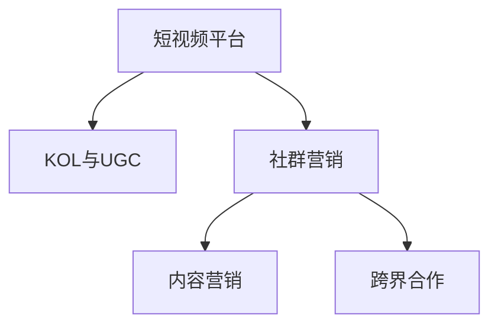

                 

# 如何利用短视频平台进行社群营销

## 1. 背景介绍

### 1.1 问题由来

在数字经济飞速发展的今天，短视频平台如抖音、快手、视频号等已经成为用户获取信息和社交互动的重要渠道。与传统的图文内容相比，短视频以其直观、生动的形式，更加容易吸引用户的注意力，并在短时间内传递丰富的信息。这种特性使得短视频平台在社群营销领域大放异彩。

### 1.2 问题核心关键点

社群营销是企业或品牌通过社交媒体平台与用户建立深度互动，以提升品牌认知、推动销售转化的策略。短视频平台为社群营销提供了新的媒介手段，用户可以在平台上发布原创视频内容，与粉丝互动，扩大传播范围。然而，如何高效利用短视频平台进行社群营销，最大化其营销效果，是一个值得深入探讨的问题。

## 2. 核心概念与联系

### 2.1 核心概念概述

为更好地理解如何在短视频平台上进行社群营销，本节将介绍几个关键概念：

- **短视频平台**：以抖音、快手、视频号等为代表，提供用户发布、分享短视频内容的社交平台。
- **社群营销**：企业或品牌通过社交媒体平台与用户建立深度互动，以提升品牌认知、推动销售转化的策略。
- **KOL与UGC**：关键意见领袖(Key Opinion Leader, KOL)和用户生成内容(User Generated Content, UGC)，指通过短视频平台吸引大量粉丝和内容创作的意见领袖和普通用户。
- **内容营销**：通过创作和分享有价值的内容，与用户建立信任，从而实现品牌传播和销售转化。
- **跨界合作**：不同品牌、平台之间通过短视频内容进行合作，实现资源共享和品牌联动。

这些核心概念之间的逻辑关系可以通过以下Mermaid流程图来展示：



这个流程图展示了几者的逻辑关系：短视频平台通过吸引KOL和UGC，提供了社群营销的媒介手段；社群营销的核心是内容营销，利用优质内容建立用户信任；跨界合作则进一步扩大了内容传播范围，提升了品牌影响力。

## 3. 核心算法原理 & 具体操作步骤

### 3.1 算法原理概述

基于短视频平台的社群营销，核心在于通过内容创意和策略，吸引用户关注，增加用户互动，最终实现品牌传播和销售转化。其主要流程如下：

1. **内容创作**：利用短视频平台提供的视频编辑工具和素材库，创作高质量的视频内容。
2. **用户互动**：在视频中设置互动元素，如问答、评论、点赞、转发等，与用户进行互动。
3. **数据分析**：利用短视频平台的分析工具，分析用户行为数据，优化内容策略。
4. **转化追踪**：设置视频内容的转化追踪链接，如商品链接、活动页面等，实现销售转化。

### 3.2 算法步骤详解

以下详细介绍如何在短视频平台进行社群营销的具体步骤：

**Step 1: 内容策划**

- **确定目标**：明确营销目标，如提升品牌知名度、增加产品销量等。
- **定位受众**：了解目标受众的兴趣、习惯和痛点，制定有针对性的内容策略。
- **创意构思**：结合品牌形象和市场热点，设计有创意的视频内容。

**Step 2: 内容制作**

- **素材准备**：收集相关的图片、音乐、文字等素材，准备视频制作。
- **视频编辑**：使用短视频平台提供的视频编辑工具，进行剪辑、配音、特效等操作，制作完成视频。
- **发布计划**：制定视频发布计划，包括发布时间、频率、主题等。

**Step 3: 互动引导**

- **设置互动元素**：在视频中添加问答、评论、互动话题等，引导用户积极参与。
- **回应评论**：及时回应用户的评论和私信，增加用户粘性。
- **开展活动**：通过举办直播、挑战赛等活动，吸引用户参与，扩大传播范围。

**Step 4: 数据分析**

- **监测数据**：利用短视频平台的分析工具，监测视频播放量、点赞数、评论数等关键指标。
- **优化内容**：根据数据分析结果，优化视频内容和发布策略。
- **调整策略**：根据用户反馈和数据表现，及时调整内容创意和互动策略。

**Step 5: 转化追踪**

- **设置链接**：在视频描述或评论中添加转化追踪链接，如商品链接、活动页面等。
- **监测转化**：利用第三方工具，监测视频内容的转化效果，如访问量、点击率、购买转化率等。
- **调整优化**：根据转化追踪结果，优化视频内容和转化策略。

### 3.3 算法优缺点

基于短视频平台的社群营销方法具有以下优点：

1. **高效传播**：短视频形式直观生动，易于传播，可以快速吸引用户注意力。
2. **低成本**：相比于传统广告，短视频营销成本较低，尤其是UGC内容。
3. **互动性强**：短视频平台支持用户评论、点赞等互动，增加用户粘性。
4. **数据丰富**：短视频平台提供详细的用户行为数据，便于分析和优化。

同时，该方法也存在一定的局限性：

1. **内容创意要求高**：短视频内容需要有创意，否则难以吸引用户。
2. **时间要求高**：短视频平台更新速度快，需要持续创作高质量内容。
3. **数据分析复杂**：短视频平台的数据分析工具较为复杂，需要一定的学习成本。
4. **转化率不稳定**：短视频平台用户行为多变，转化率可能不稳定。

尽管存在这些局限性，但就目前而言，短视频平台在社群营销中的应用已经相当广泛，效果显著。未来相关研究的重点在于如何进一步提高内容创意和互动性，提升数据利用效率，同时兼顾转化率的稳定性。

### 3.4 算法应用领域

基于短视频平台的社群营销方法，在以下几个领域得到了广泛应用：

- **电商零售**：利用短视频展示产品功能、使用场景等，提升用户购买意愿。
- **品牌推广**：通过品牌故事、产品发布会等短视频，提升品牌知名度。
- **娱乐内容**：创作短视频内容，与粉丝互动，增加用户粘性。
- **教育培训**：利用短视频进行课程预告、知识点讲解等，吸引学习者。
- **健康医疗**：通过短视频科普健康知识，提高用户健康意识。
- **旅游文化**：发布旅游景点介绍、文化活动等短视频，吸引游客和用户关注。

除了上述这些经典领域外，短视频平台的社群营销还在更多场景中得到应用，如企业宣传、活动策划、公益宣传等，为品牌和企业提供新的传播途径。

## 4. 数学模型和公式 & 详细讲解 & 举例说明

### 4.1 数学模型构建

本节将使用数学语言对短视频平台社群营销的优化模型进行更加严格的刻画。

假设短视频平台上的视频内容集为 $\mathcal{X}$，视频标签为 $\mathcal{Y}$。设用户对视频内容的评分函数为 $f(x,y)$，其中 $x$ 表示视频内容，$y$ 表示标签。用户在观看视频后，对视频内容的评分 $z$ 为 $z=f(x,y)$。

**目标**：最大化用户评分 $z$，即最大化 $\sum_{x \in \mathcal{X}} \sum_{y \in \mathcal{Y}} f(x,y) \cdot p(x,y)$，其中 $p(x,y)$ 表示视频内容和标签的概率分布。

### 4.2 公式推导过程

设 $\theta$ 为视频内容的模型参数，$\eta$ 为学习率。根据梯度下降算法，优化模型的目标函数为：

$$
\min_{\theta} \mathcal{L}(\theta) = \frac{1}{N} \sum_{i=1}^N \left[ f(x_i,y_i) - \eta \nabla_{\theta} f(x_i,y_i) \right]
$$

其中 $x_i$ 表示第 $i$ 个视频的特征向量，$y_i$ 表示对应的标签。利用链式法则，可以得到损失函数对模型参数 $\theta$ 的梯度：

$$
\nabla_{\theta} \mathcal{L}(\theta) = - \frac{1}{N} \sum_{i=1}^N \nabla_{\theta} f(x_i,y_i)
$$

通过上述梯度公式，可以更新模型参数 $\theta$，最小化损失函数 $\mathcal{L}(\theta)$，从而提升用户评分 $z$。

### 4.3 案例分析与讲解

假设某品牌在短视频平台上发布了一条关于新品发布的视频，想要通过优化内容创意和互动元素，提升用户的评分和互动率。该品牌可以选择以下优化策略：

1. **内容创意优化**：通过A/B测试，对比不同创意视频的内容评分，选择效果最佳的创意。
2. **互动元素设计**：在视频中加入互动话题、问答环节等，增加用户参与度。
3. **数据分析利用**：利用短视频平台提供的用户行为数据，分析用户反馈，调整优化内容策略。
4. **转化追踪设置**：在视频描述中添加商品链接，监测视频的转化效果。

通过上述优化策略，品牌可以在不增加过多成本的情况下，提升短视频内容的营销效果，实现品牌传播和销售转化。

## 5. 项目实践：代码实例和详细解释说明

### 5.1 开发环境搭建

在进行短视频平台社群营销的实践前，我们需要准备好开发环境。以下是使用Python进行PyTorch开发的环境配置流程：

1. 安装Anaconda：从官网下载并安装Anaconda，用于创建独立的Python环境。

2. 创建并激活虚拟环境：
```bash
conda create -n pytorch-env python=3.8 
conda activate pytorch-env
```

3. 安装PyTorch：根据CUDA版本，从官网获取对应的安装命令。例如：
```bash
conda install pytorch torchvision torchaudio cudatoolkit=11.1 -c pytorch -c conda-forge
```

4. 安装OpenCV：用于视频处理和编辑。
```bash
conda install opencv
```

5. 安装Python的中文库支持：
```bash
conda install pytorch -c conda-forge -c pytorch
```

完成上述步骤后，即可在`pytorch-env`环境中开始实践。

### 5.2 源代码详细实现

下面我们以电商品牌发布短视频进行产品展示为例，给出使用OpenCV和PyTorch进行视频编辑的PyTorch代码实现。

首先，导入必要的库和数据：

```python
import cv2
import numpy as np
from torchvision import transforms
from torch.utils.data import DataLoader
from torchvision.models import resnet18

# 加载预训练的ResNet18模型
model = resnet18(pretrained=True)

# 定义数据处理流程
transform = transforms.Compose([
    transforms.Resize((256, 256)),
    transforms.ToTensor()
])

# 加载数据集
video_path = 'path/to/video.mp4'
cap = cv2.VideoCapture(video_path)

# 将视频帧转换为numpy数组
frames = []
for frame in range(cap.get(cv2.CAP_PROP_FRAME_COUNT):
    ret, frame = cap.read()
    if not ret:
        break
    frame = cv2.cvtColor(frame, cv2.COLOR_BGR2RGB)
    frame = cv2.resize(frame, (256, 256))
    frame = np.array(frame, dtype=np.float32) / 255.0
    frame = transform(frame)
    frames.append(frame)

# 转换为PyTorch张量
frames = torch.stack(frames)

# 加载模型进行特征提取
model.eval()
with torch.no_grad():
    features = model(frames)

# 将特征可视化
visualize(features)
```

接下来，定义视频编辑和展示的函数：

```python
def visualize(features):
    import matplotlib.pyplot as plt
    fig, ax = plt.subplots(nrows=4, ncols=4, figsize=(16, 16))
    for i in range(16):
        ax[i//4, i%4].imshow(features[i].permute(1, 2, 0).cpu().numpy())
        ax[i//4, i%4].axis('off')
    plt.show()
```

最后，启动视频编辑和展示流程：

```python
# 视频编辑
edited_frames = []
for frame in frames:
    # 应用特效
    # ...
    edited_frames.append(frame)

# 保存编辑后的视频
cap.write('edited_video.mp4')
cap.release()
```

### 5.3 代码解读与分析

让我们再详细解读一下关键代码的实现细节：

**视频处理**：
- `cap.read()`：读取视频文件中的每一帧。
- `cv2.cvtColor(frame, cv2.COLOR_BGR2RGB)`：将BGR格式的帧转换为RGB格式。
- `cv2.resize(frame, (256, 256))`：调整帧的大小。
- `transform(frame)`：将帧转换为PyTorch张量。

**特征提取**：
- `model.eval()`：将模型设置为评估模式。
- `with torch.no_grad()`：关闭梯度计算，加速模型推理。
- `features = model(frames)`：输入帧，得到模型输出的特征。

**可视化**：
- `matplotlib`：用于可视化视频帧。
- `plt.subplots`：创建多个子图，展示特征提取结果。

**视频编辑**：
- `edited_frames`：保存编辑后的帧。
- `cap.write('edited_video.mp4')`：保存编辑后的视频文件。

可以看到，PyTorch结合OpenCV可以高效地完成视频帧的处理、特征提取和编辑工作，为短视频营销提供了强大的技术支持。

当然，工业级的系统实现还需考虑更多因素，如模型的部署、超参数的优化、用户行为数据的分析等。但核心的短视频营销方法基本与此类似。

## 6. 实际应用场景

### 6.1 智能客服系统

短视频平台的用户互动能力强，可以用于构建智能客服系统。企业可以将客服咨询场景录制为短视频，供用户观看，通过评论、私信等方式与用户互动。微调后的模型可以自动回答用户问题，提升服务效率和用户满意度。

### 6.2 企业宣传

短视频平台是展示企业品牌形象和产品功能的绝佳平台。企业可以制作宣传视频，展示企业文化、产品优势、用户体验等，通过社交传播，提升品牌知名度和美誉度。

### 6.3 教育培训

短视频平台丰富的教育资源，使得在线教育成为可能。教师可以通过短视频展示课程内容、知识点讲解等，吸引学习者参与，提升教育效果。

### 6.4 未来应用展望

随着短视频平台的用户规模持续增长，其应用场景将进一步拓展。未来，短视频平台将与更多行业深度融合，提供更广泛的服务。

在智慧医疗领域，短视频平台可以用于医学科普、健康教育等，提升公众健康意识。在智慧旅游领域，可以用于旅游景点介绍、旅游攻略等，吸引更多游客关注。在智能家居领域，可以用于产品展示、使用方法演示等，提升用户体验。

## 7. 工具和资源推荐

### 7.1 学习资源推荐

为了帮助开发者系统掌握短视频平台社群营销的理论基础和实践技巧，这里推荐一些优质的学习资源：

1. 《短视频营销攻略》系列博文：由短视频平台技术专家撰写，深入浅出地介绍了短视频平台的发展历程、关键技术和应用案例。
2. 《社交媒体营销》课程：各大在线教育平台提供的短视频营销课程，涵盖短视频创作、用户互动、数据分析等多个方面。
3. 《短视频内容优化》书籍：详细介绍了短视频创作、内容优化和用户互动的实践技巧，为短视频营销提供系统指导。
4. YouTube官方文档：提供详细的短视频平台API和SDK文档，帮助开发者接入平台，进行视频内容创作和分析。

通过对这些资源的学习实践，相信你一定能够快速掌握短视频平台社群营销的精髓，并用于解决实际的营销问题。

### 7.2 开发工具推荐

高效的开发离不开优秀的工具支持。以下是几款用于短视频平台社群营销开发的常用工具：

1. OpenCV：开源计算机视觉库，提供丰富的图像和视频处理工具，支持视频帧的读取、编辑和保存。
2. PyTorch：基于Python的开源深度学习框架，灵活的计算图设计，支持模型训练和推理。
3. TensorBoard：TensorFlow配套的可视化工具，实时监测模型训练状态，提供丰富的图表呈现方式。
4. Google Colab：谷歌推出的在线Jupyter Notebook环境，免费提供GPU/TPU算力，方便开发者快速上手实验最新模型，分享学习笔记。

合理利用这些工具，可以显著提升短视频平台社群营销的开发效率，加快创新迭代的步伐。

### 7.3 相关论文推荐

短视频平台社群营销的发展源于学界的持续研究。以下是几篇奠基性的相关论文，推荐阅读：

1. Attention is All You Need：提出Transformer结构，开启了深度学习大模型的时代。
2. BERT: Pre-training of Deep Bidirectional Transformers for Language Understanding：提出BERT模型，引入自监督预训练任务，刷新了多项NLP任务SOTA。
3. MoCo: Momentum Contrast for Unsupervised Visual Representation Learning：提出动量对比学习方法，提升了自监督预训练的效果。
4. Data Augmentation in Recurrent Neural Networks for Visual Question Answering：提出数据增强技术，提升了视觉问答模型的泛化能力。

这些论文代表了大规模短视频平台社群营销的发展脉络。通过学习这些前沿成果，可以帮助研究者把握学科前进方向，激发更多的创新灵感。

## 8. 总结：未来发展趋势与挑战

### 8.1 总结

本文对基于短视频平台的社群营销方法进行了全面系统的介绍。首先阐述了短视频平台在社群营销中的重要地位，明确了社群营销在提升品牌认知、推动销售转化方面的独特价值。其次，从原理到实践，详细讲解了社群营销的数学模型和关键步骤，给出了短视频营销任务开发的完整代码实例。同时，本文还广泛探讨了社群营销在智能客服、企业宣传、教育培训等多个行业领域的应用前景，展示了短视频平台在社群营销中的巨大潜力。最后，本文精选了社群营销技术的各类学习资源，力求为读者提供全方位的技术指引。

通过本文的系统梳理，可以看到，基于短视频平台的社群营销方法正在成为企业数字化转型的重要工具，极大地拓展了品牌传播的渠道和效果。未来，伴随短视频平台技术的持续演进和应用场景的不断拓展，短视频平台社群营销必将在更多领域大放异彩，为数字经济的蓬勃发展提供新的动力。

### 8.2 未来发展趋势

展望未来，短视频平台社群营销技术将呈现以下几个发展趋势：

1. **内容多样化**：除了传统的视频内容，未来还将出现更多类型的创意视频，如AR/VR视频、动态图片等。
2. **互动深度化**：通过引入更多的互动元素，如直播、虚拟现实、互动广告等，提升用户互动体验。
3. **数据分析精细化**：利用更丰富的用户行为数据，进行更精细化的用户画像分析，提升内容策略的精准性。
4. **跨界合作广泛化**：短视频平台将与更多行业进行跨界合作，形成更加多样化的内容生态。
5. **技术融合深入化**：短视频平台将与更多前沿技术如区块链、AI、VR等进行深度融合，提升用户体验和传播效果。
6. **个性化推荐普及化**：通过大数据和AI技术，提供个性化的内容推荐，提升用户满意度和粘性。

这些趋势将使得短视频平台社群营销在传播范围、互动深度、个性化体验等方面实现质的飞跃，为品牌和企业提供更强大、更灵活的传播工具。

### 8.3 面临的挑战

尽管短视频平台社群营销技术已经取得了显著成效，但在迈向更加智能化、普适化应用的过程中，它仍面临诸多挑战：

1. **内容创意瓶颈**：短视频内容创作要求高，持续高质量内容的制作难度大。
2. **用户行为多变**：短视频平台用户行为多变，预测用户偏好和互动效果困难。
3. **版权法律风险**：短视频内容版权问题复杂，需注意法律风险。
4. **跨平台兼容性**：短视频平台众多，不同平台间的兼容性和统一性问题待解决。
5. **技术资源投入大**：短视频平台社群营销需要大量的技术资源投入，如视频编辑、数据分析、内容创作等。
6. **数据隐私问题**：用户行为数据涉及隐私问题，需严格遵守数据保护法规。

尽管存在这些挑战，但短视频平台社群营销的前景广阔，技术成熟度持续提升，预计未来将不断突破现有瓶颈，拓展新的应用领域。

### 8.4 研究展望

未来，短视频平台社群营销技术的研究方向将主要集中在以下几个方面：

1. **自动化内容创作**：开发自动生成视频内容的算法，减轻内容创作人员的工作负担。
2. **智能内容推荐**：利用大数据和AI技术，提升内容推荐的效果，提升用户满意度。
3. **多模态内容融合**：探索将视频、图片、文字等多模态信息进行深度融合，提升内容的丰富性和表现力。
4. **互动效果提升**：研究新的互动技术，如AR/VR、直播等，提升用户互动体验。
5. **跨平台协作优化**：探索不同短视频平台之间的协作机制，提升跨平台内容的传播效果。
6. **用户行为预测**：利用机器学习和大数据分析，提升对用户行为和偏好的预测能力。

这些研究方向将推动短视频平台社群营销技术的不断进步，为品牌和企业提供更加精准、高效、灵活的传播工具。

## 9. 附录：常见问题与解答

**Q1：短视频平台社群营销是否适用于所有品牌？**

A: 短视频平台社群营销适用于大多数品牌和行业，但需要根据品牌特点和市场定位进行优化。例如，针对B2B品牌，可以通过短视频展示产品功能、客户评价等，提升品牌可信度和专业形象；针对B2C品牌，可以通过短视频展示产品使用场景、用户体验等，提升用户购买意愿。

**Q2：如何提升短视频内容的互动率？**

A: 提升短视频内容的互动率可以从以下几个方面入手：
1. **创意内容**：设计有创意、有吸引力的视频内容，引起用户的兴趣。
2. **互动元素**：在视频中添加问答、评论、投票等互动元素，增加用户参与度。
3. **KOL合作**：邀请行业KOL参与视频制作，增加视频的曝光度和互动率。
4. **跨平台推广**：在多个社交平台进行视频推广，吸引更多用户观看和互动。

**Q3：如何确保短视频内容的版权问题？**

A: 确保短视频内容的版权问题，可以从以下几个方面入手：
1. **版权购买**：购买版权公司的视频素材，确保使用合法。
2. **创意制作**：自主创作原创视频内容，避免侵权风险。
3. **侵权检测**：使用第三方工具检测视频内容是否侵权，及时处理问题。
4. **版权声明**：在视频中添加版权声明，明确视频内容的使用权和归属。

**Q4：如何进行短视频内容的多平台推广？**

A: 短视频内容的多平台推广可以从以下几个方面入手：
1. **平台选择**：选择与品牌形象和目标受众匹配的短视频平台。
2. **内容定制**：针对不同平台的特点，定制适合的视频内容，提升传播效果。
3. **合作推广**：与短视频平台进行合作推广，提升视频的曝光度和互动率。
4. **数据分析**：利用平台提供的用户行为数据，分析推广效果，及时调整策略。

**Q5：如何利用短视频平台进行企业宣传？**

A: 利用短视频平台进行企业宣传可以从以下几个方面入手：
1. **品牌故事**：通过短视频展示企业文化、品牌历史、企业愿景等，提升品牌知名度。
2. **产品介绍**：利用短视频展示产品功能、使用场景、用户评价等，提升产品曝光度和销售转化。
3. **用户互动**：通过短视频与用户互动，提升用户粘性和品牌忠诚度。
4. **联合活动**：与行业相关企业联合举办短视频活动，提升品牌影响力。

通过本文的系统梳理，可以看到，基于短视频平台的社群营销方法正在成为企业数字化转型的重要工具，极大地拓展了品牌传播的渠道和效果。未来，伴随短视频平台技术的持续演进和应用场景的不断拓展，短视频平台社群营销必将在更多领域大放异彩，为数字经济的蓬勃发展提供新的动力。

---

作者：禅与计算机程序设计艺术 / Zen and the Art of Computer Programming

