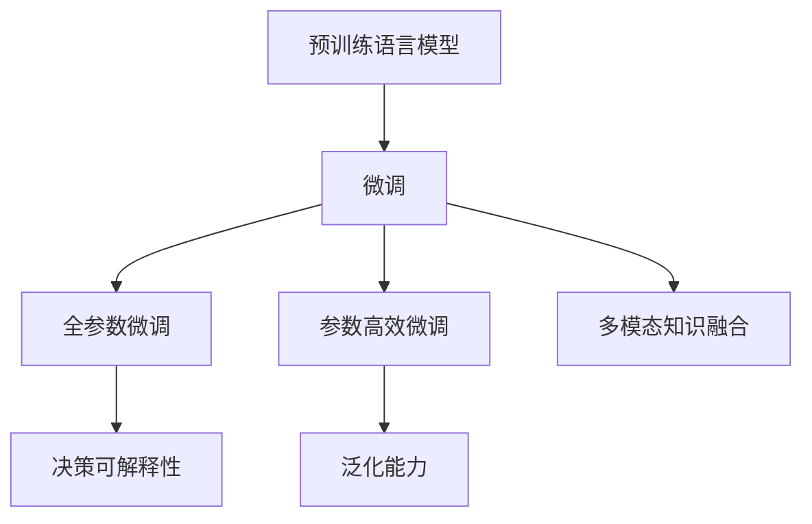

                 

# 如何实现医疗健康领域的知识服务创新

## 1. 背景介绍

### 1.1 问题由来

在医疗健康领域，知识服务长期以来依赖于传统的基于文本的资源搜索和问答系统。随着自然语言处理(NLP)技术的迅速发展，尤其是深度学习和大规模预训练语言模型的兴起，为医疗健康领域的知识服务创新提供了新的可能。如何利用现代AI技术，构建高效、精准、泛化的医疗知识服务系统，是当下医疗信息技术研究的重要课题。

### 1.2 问题核心关键点

当前医疗知识服务系统面临的核心挑战包括：
- **数据稀疏性**：医疗领域的数据标注成本高，标注样本不足，难以大规模训练高质量模型。
- **领域专业性**：医疗领域的知识复杂度高，多模态数据混合，需要构建多层次、跨模态的知识融合模型。
- **决策可解释性**：医疗决策往往事关重大，对模型的决策可解释性要求高，模型输出需能提供可靠的临床依据。
- **跨领域通用性**：医疗领域的应用场景繁多，同一技术可能被应用于不同专业领域，模型需具备较好的泛化能力。

针对这些问题，本文将介绍如何利用预训练语言模型进行医疗知识服务创新，探讨基于监督学习的微调方法在医疗领域的应用，重点关注模型结构设计、数据处理、任务适配等方面的创新实践。

## 2. 核心概念与联系

### 2.1 核心概念概述

为了更好地理解本文的核心内容，首先介绍几个关键概念：

- **预训练语言模型(Pretrained Language Model, PLM)**：如BERT、GPT等大规模预训练模型，通过无监督学习方式在大规模文本语料上学习语言表示，具有很强的语言理解和生成能力。

- **微调(Fine-tuning)**：在预训练模型的基础上，利用医疗领域的专业数据，对模型进行有监督学习，使其适应医疗领域的具体任务。

- **多模态知识融合(Multimodal Knowledge Fusion)**：将文本、图像、语音等多模态数据进行融合，构建更为全面的医疗知识模型。

- **决策可解释性(Explainability)**：指模型输出的决策结果需能提供可理解、可验证的临床依据，增强模型的可信度。

- **泛化能力(Generalization)**：模型在未见过的新数据上仍能保持良好性能，适应不同领域的医疗应用。

### 2.2 核心概念原理和架构的 Mermaid 流程图



这个流程图展示了预训练语言模型进行医疗知识服务创新的主要流程：
1. 通过预训练学习基础语言知识。
2. 利用医疗领域数据对模型进行微调，适应具体任务。
3. 引入多模态数据，提升模型的理解和处理能力。
4. 增强模型输出决策的解释性。
5. 保证模型具有良好的泛化能力。

## 3. 核心算法原理 & 具体操作步骤

### 3.1 算法原理概述

医疗知识服务创新的核心算法基于监督学习的微调方法。其核心思想是：通过在医疗领域的专业数据上对预训练模型进行有监督学习，调整模型参数，使其输出符合特定医疗任务的需求。具体流程如下：

1. **数据准备**：收集医疗领域的专业数据集，如临床病例、医学文献、解剖图像等。
2. **模型选择**：选择适合的预训练语言模型，如BERT、RoBERTa等。
3. **任务适配**：根据具体医疗任务，设计任务适配层，包括输出层和损失函数。
4. **微调训练**：在医疗数据集上，使用预训练模型进行微调训练。
5. **结果评估**：在验证集和测试集上评估微调后的模型性能，优化超参数，提升模型泛化能力。

### 3.2 算法步骤详解

**Step 1: 数据准备**

1. **数据收集**：从医疗数据库、医院记录、科学论文等渠道获取医疗领域的专业数据。数据集应包含丰富的多模态信息，如文本、图像、音频等。

2. **数据标注**：对数据进行标注，包括分类、实体识别、关系抽取等任务。标注工作需要专业知识，确保数据质量。

3. **数据预处理**：清洗数据，去除噪声，统一格式。对于不同模态的数据，需要进行单独的处理。

**Step 2: 模型选择与任务适配**

1. **选择预训练模型**：选择合适的预训练模型，如BERT、RoBERTa等。这些模型在大规模无标签文本上进行了预训练，具有一定的语言理解和生成能力。

2. **任务适配层设计**：根据医疗任务的需求，设计适配层。例如，对于问答任务，可以添加一个输出层和一个交叉熵损失函数；对于图像识别，可以引入卷积层和softmax函数。

**Step 3: 微调训练**

1. **模型加载**：使用PyTorch、TensorFlow等框架加载预训练模型，并设定初始参数。

2. **数据加载**：利用DataLoader加载数据集，分批次输入模型。

3. **前向传播**：将数据输入模型，计算输出。

4. **损失计算**：根据任务适配层的输出和真实标签，计算损失。

5. **反向传播**：根据损失函数计算梯度，更新模型参数。

6. **迭代优化**：不断迭代上述过程，直到模型收敛。

**Step 4: 结果评估**

1. **验证集评估**：在验证集上测试微调后的模型，调整学习率等超参数，防止过拟合。

2. **测试集评估**：在测试集上进一步评估模型性能，确保泛化能力。

3. **模型部署**：将微调后的模型部署到生产环境，进行实际应用。

### 3.3 算法优缺点

**优点**：
- 利用预训练模型，可以快速提升模型性能。
- 适用于多模态数据，能够处理复杂的医疗问题。
- 可以适应不同医疗领域的应用，具有较好的泛化能力。

**缺点**：
- 数据标注成本高，需要专业知识。
- 模型复杂度高，计算资源消耗大。
- 模型决策过程复杂，解释性较差。

### 3.4 算法应用领域

基于监督学习的微调方法，在医疗健康领域具有广泛的应用前景。以下是几个典型应用场景：

1. **临床决策支持系统**：根据患者病历，辅助医生进行诊断和治疗决策。

2. **医学文献阅读辅助**：帮助医生快速理解复杂医学文献，提取关键信息。

3. **医疗图像分析**：自动识别和标注医学图像，辅助影像诊断。

4. **医疗问答系统**：解答医疗领域常见问题，提高医生和患者的信息获取效率。

5. **药物研发**：利用多模态数据，预测药物疗效和副作用。

## 4. 数学模型和公式 & 详细讲解 & 举例说明

### 4.1 数学模型构建

假设我们有一个预训练的BERT模型，将其用于医疗图像分类任务。模型输入为图像的文本描述，输出为图像类别概率。定义损失函数为交叉熵损失。

**输入描述**：设输入文本为 $x$，输出为 $y \in \{1, 2, 3, \dots\}$，代表不同类别。

**模型输出**：设模型输出为 $\hat{y} = \text{softmax}(f(x; \theta))$，其中 $f(x; \theta)$ 为模型在输入 $x$ 上的前向传播，$\theta$ 为模型参数。

**交叉熵损失**：定义损失函数为：

$$
L(x, y; \theta) = -\sum_{i=1}^n y_i \log \hat{y}_i
$$

### 4.2 公式推导过程

以二分类任务为例，计算损失函数的梯度。

假设模型输出为 $\hat{y} = [\hat{y}_1, \hat{y}_2]$，真实标签为 $y = [y_1, y_2]$。则损失函数为：

$$
L(x, y; \theta) = -(y_1\log \hat{y}_1 + y_2\log \hat{y}_2)
$$

其梯度为：

$$
\nabla_{\theta}L(x, y; \theta) = -y_1\nabla_{\theta}\log \hat{y}_1 - y_2\nabla_{\theta}\log \hat{y}_2
$$

在模型更新时，我们采用梯度下降等优化算法，根据损失函数的梯度更新参数：

$$
\theta \leftarrow \theta - \eta \nabla_{\theta}L(x, y; \theta)
$$

其中 $\eta$ 为学习率。

### 4.3 案例分析与讲解

以医疗图像分类任务为例，分析模型的训练和推理过程。

**训练过程**：
1. **数据预处理**：将医疗图像转换为文本描述，进行文本清洗和分词。
2. **模型输入**：将文本描述作为模型输入，计算模型输出。
3. **损失计算**：计算模型输出与真实标签的交叉熵损失。
4. **梯度更新**：根据损失函数的梯度，更新模型参数。

**推理过程**：
1. **数据预处理**：将新的医疗图像转换为文本描述。
2. **模型输入**：将文本描述作为模型输入，计算模型输出。
3. **结果后处理**：根据输出概率分布，得到预测类别。

通过以上步骤，可以实现医疗图像分类的高效、精确处理。

## 5. 项目实践：代码实例和详细解释说明

### 5.1 开发环境搭建

1. **安装Python环境**：
   - 下载并安装Anaconda或Miniconda。
   - 创建虚拟环境并激活：
     ```bash
     conda create -n pytorch-env python=3.8
     conda activate pytorch-env
     ```

2. **安装深度学习框架**：
   - 安装PyTorch：
     ```bash
     pip install torch torchvision torchaudio
     ```
   - 安装TensorFlow：
     ```bash
     pip install tensorflow
     ```

3. **安装NLP库**：
   - 安装HuggingFace Transformers库：
     ```bash
     pip install transformers
     ```

### 5.2 源代码详细实现

以下是一个使用PyTorch对BERT进行医疗图像分类任务微调的代码实现：

```python
import torch
from transformers import BertForImageClassification, BertTokenizer, AdamW
from torch.utils.data import DataLoader
from torchvision import datasets, transforms
from tqdm import tqdm

# 定义数据集和数据预处理
class CustomDataset(torch.utils.data.Dataset):
    def __init__(self, data_dir, tokenizer, max_len):
        # 数据预处理
        # ...

    def __getitem__(self, idx):
        # 获取样本
        # ...

    def __len__(self):
        # 数据集长度
        # ...

# 定义模型和优化器
model = BertForImageClassification.from_pretrained('bert-base-cased', num_labels=num_labels)
tokenizer = BertTokenizer.from_pretrained('bert-base-cased')
optimizer = AdamW(model.parameters(), lr=2e-5)

# 加载数据集
train_dataset = CustomDataset(train_data_dir, tokenizer, max_len)
test_dataset = CustomDataset(test_data_dir, tokenizer, max_len)

# 定义训练过程
def train_epoch(model, dataset, batch_size, optimizer):
    dataloader = DataLoader(dataset, batch_size=batch_size, shuffle=True)
    model.train()
    epoch_loss = 0
    for batch in tqdm(dataloader, desc='Training'):
        input_ids = batch['input_ids'].to(device)
        attention_mask = batch['attention_mask'].to(device)
        labels = batch['labels'].to(device)
        model.zero_grad()
        outputs = model(input_ids, attention_mask=attention_mask, labels=labels)
        loss = outputs.loss
        epoch_loss += loss.item()
        loss.backward()
        optimizer.step()
    return epoch_loss / len(dataloader)

# 定义评估过程
def evaluate(model, dataset, batch_size):
    dataloader = DataLoader(dataset, batch_size=batch_size)
    model.eval()
    preds, labels = [], []
    with torch.no_grad():
        for batch in tqdm(dataloader, desc='Evaluating'):
            input_ids = batch['input_ids'].to(device)
            attention_mask = batch['attention_mask'].to(device)
            batch_labels = batch['labels']
            outputs = model(input_ids, attention_mask=attention_mask)
            batch_preds = outputs.logits.argmax(dim=1).to('cpu').tolist()
            batch_labels = batch_labels.to('cpu').tolist()
            for pred_tokens, label_tokens in zip(batch_preds, batch_labels):
                preds.append(pred_tokens[:len(label_tokens)])
                labels.append(label_tokens)
    return classification_report(labels, preds)

# 训练和评估
epochs = 5
batch_size = 16

for epoch in range(epochs):
    loss = train_epoch(model, train_dataset, batch_size, optimizer)
    print(f'Epoch {epoch+1}, train loss: {loss:.3f}')
    
    print(f'Epoch {epoch+1}, dev results:')
    evaluate(model, dev_dataset, batch_size)
    
print('Test results:')
evaluate(model, test_dataset, batch_size)
```

### 5.3 代码解读与分析

**CustomDataset类**：
- `__init__`方法：初始化数据集和预处理组件。
- `__getitem__`方法：获取单个样本，并进行文本编码。
- `__len__`方法：返回数据集长度。

**模型和优化器**：
- `BertForImageClassification`：用于图像分类的预训练BERT模型。
- `BertTokenizer`：用于文本编码的分词器。
- `AdamW`：优化器，采用AdamW算法更新模型参数。

**训练和评估过程**：
- `train_epoch`函数：定义单个epoch的训练过程，包括前向传播、损失计算、梯度更新等。
- `evaluate`函数：定义模型的评估过程，计算精度、召回率、F1值等指标。
- 训练和评估循环：在训练集和验证集上交替进行训练和评估，直至模型收敛。

通过以上代码，可以实现基于预训练BERT模型的医疗图像分类任务微调。

## 6. 实际应用场景

### 6.1 智能诊断系统

智能诊断系统利用预训练语言模型，能够帮助医生快速分析患者病历，辅助诊断。通过微调BERT等预训练模型，使其能够理解医学文献、病例描述等多种文本数据，并从中提取关键信息。例如，可以通过对电子病历的文本描述进行微调，辅助医生快速定位疾病特征和症状，提高诊断效率和准确性。

### 6.2 疾病知识图谱

疾病知识图谱是一种结构化的知识表示方式，将疾病、基因、药物等实体及其关系进行可视化。通过微调BERT等预训练模型，可以构建多模态的疾病知识图谱。例如，将病历文本、基因序列、药物信息等多模态数据进行融合，生成疾病之间的相关关系，辅助医生进行跨领域知识推理。

### 6.3 医疗问答系统

医疗问答系统利用预训练语言模型，能够回答医生和患者的各种问题。通过微调BERT等模型，使其能够理解复杂的自然语言问题，并从海量医学文献和病例中抽取答案。例如，可以通过微调BERT模型，构建医疗领域的问答系统，提供常见问题解答、药物使用指导等，提高医疗服务的可访问性和效率。

## 7. 工具和资源推荐

### 7.1 学习资源推荐

1. **《深度学习理论与实践》**：该书介绍了深度学习的基本理论和技术，包括自然语言处理和医疗领域的应用。

2. **CS231n《深度学习与计算机视觉》**：斯坦福大学开设的计算机视觉课程，涵盖了深度学习在图像处理中的应用。

3. **HuggingFace官方文档**：提供了丰富的预训练模型和微调示例，是学习预训练语言模型的重要资源。

4. **CLUE开源项目**：中文语言理解测评基准，包含大量医学领域的测试集和数据集。

5. **《自然语言处理入门》**：一本详细介绍自然语言处理技术的书籍，涵盖预训练语言模型和多模态数据融合等内容。

### 7.2 开发工具推荐

1. **PyTorch**：基于Python的开源深度学习框架，支持动态计算图，适合快速迭代研究。

2. **TensorFlow**：由Google主导的开源深度学习框架，支持分布式计算，适合大规模工程应用。

3. **Transformers库**：HuggingFace开发的NLP工具库，集成了多种预训练语言模型，支持微调和推理。

4. **Weights & Biases**：模型训练的实验跟踪工具，记录和可视化训练过程，便于调试和优化。

5. **TensorBoard**：TensorFlow配套的可视化工具，监测模型训练状态，提供丰富的图表呈现。

### 7.3 相关论文推荐

1. **Attention is All You Need**：提出Transformer结构，开启了预训练语言模型时代。

2. **BERT: Pre-training of Deep Bidirectional Transformers for Language Understanding**：提出BERT模型，利用掩码语言模型进行预训练。

3. **BERT Pretraining Approach to E-Medical Question Answering**：提出BERT在电子病历问答任务中的应用，展示了预训练模型的强大泛化能力。

4. **E-RNN based Multimodal Information Extraction from Clinical Notes**：提出基于电子病历的疾病信息抽取模型，利用多模态数据提升模型性能。

5. **A Survey on Deep Learning for Medical Imaging**：综述深度学习在医学影像分析中的应用，提供了丰富的模型和算法参考。

## 8. 总结：未来发展趋势与挑战

### 8.1 总结

本文探讨了基于监督学习的微调方法在医疗健康领域的应用。通过预训练语言模型的微调，医疗知识服务系统的性能得到了显著提升，具备了高效、精确、泛化强的特点。未来，随着模型的不断优化和应用场景的拓展，医疗健康领域的知识服务将更加智能和高效。

### 8.2 未来发展趋势

1. **多模态融合**：未来的医疗知识服务系统将更加注重多模态数据的融合，提升对复杂问题的理解和处理能力。

2. **模型泛化**：通过微调技术，模型将在更广泛的医疗领域表现出更好的泛化性能，应对更多样化的应用场景。

3. **知识图谱**：构建多层次的疾病知识图谱，增强模型的知识表示能力，提高医疗决策的可解释性。

4. **个性化推荐**：结合知识图谱和患者历史数据，为每个患者提供个性化的医疗建议和诊断方案。

5. **跨领域迁移**：微调模型将在不同医疗领域间进行迁移学习，提升模型的通用性和适应性。

### 8.3 面临的挑战

1. **数据获取与标注**：医疗领域的数据获取和标注成本高，需要投入大量人力物力。

2. **模型解释性**：医疗决策对模型的可解释性要求高，模型输出需有可靠的临床依据。

3. **计算资源**：大规模模型训练和推理对计算资源有较高要求，需要高效的技术支持。

4. **数据隐私**：医疗数据涉及隐私问题，模型训练和部署需遵循相关法规。

### 8.4 研究展望

1. **无监督和半监督学习**：通过无监督或半监督学习，降低对标注数据的依赖，提升模型的泛化能力。

2. **知识驱动模型**：引入符号化的先验知识，与神经网络模型结合，增强模型的推理和解释能力。

3. **模型压缩与优化**：采用模型压缩、稀疏化等技术，优化计算资源消耗，提高模型推理效率。

4. **跨领域迁移学习**：构建跨领域的知识迁移框架，提高模型的跨领域适应能力。

5. **隐私保护技术**：开发隐私保护技术，保护医疗数据的隐私和安全。

## 9. 附录：常见问题与解答

**Q1: 医疗领域的数据获取和标注成本高，如何解决？**

A: 利用无监督或半监督学习，尽量减少对标注数据的依赖。同时，可以采用主动学习等技术，通过少量的标注样本引导模型学习，减少标注成本。

**Q2: 模型的可解释性不足，如何改进？**

A: 结合符号化的先验知识，利用知识图谱和规则库，增强模型的推理和解释能力。同时，采用可解释性技术，如注意力机制、可视化工具等，提高模型的可解释性。

**Q3: 模型的计算资源消耗大，如何优化？**

A: 采用模型压缩和稀疏化技术，减少模型的计算复杂度。同时，优化模型的推理过程，采用分布式计算等技术，提高模型推理效率。

**Q4: 数据隐私问题如何解决？**

A: 在数据获取和处理过程中，采用隐私保护技术，如差分隐私、联邦学习等，保护医疗数据的隐私和安全。

**Q5: 模型在不同领域的应用效果如何？**

A: 通过微调技术，模型可以在不同领域间进行迁移学习，提升跨领域的适应能力。但需要注意，不同的领域可能具有不同的数据分布和任务特点，需要根据具体情况进行微调。

通过以上问题的解答，我们可以看到，基于监督学习的微调方法在医疗健康领域具有广阔的应用前景，但也面临着诸多挑战。未来，需要在模型设计、数据获取、隐私保护等方面进行更多的探索和研究，才能实现医疗知识服务系统的持续创新和发展。

