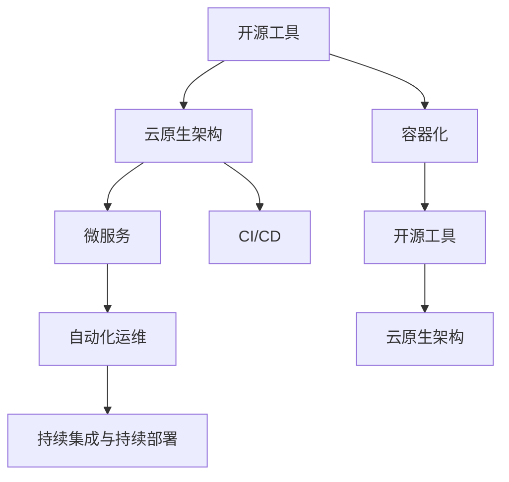

                 

# 如何将开源工具转化为SaaS产品

> 关键词：开源工具, SaaS产品, 云原生, DevOps, 容器化, 微服务, 持续集成, 持续部署, 自动化

## 1. 背景介绍

### 1.1 问题由来
随着云计算和软件即服务(Software as a Service, SaaS)模式的兴起，越来越多的企业选择将自身的产品或服务通过云平台提供给用户。SaaS模式具有低成本、高扩展性、快速迭代等特点，深受中小型企业欢迎。而开源工具由于其开放性、免费性、灵活性等优点，成为构建SaaS产品的首选。

然而，开源工具直接转化为SaaS产品并不简单。开源工具通常是单体应用，缺乏分布式架构、云原生支持等特性，无法直接部署在云端。此外，开源工具的部署、运维、扩展等操作也存在不少问题，需要进一步优化。因此，本文将详细介绍如何将开源工具成功转化为SaaS产品，为开源社区和企业提供参考。

### 1.2 问题核心关键点
将开源工具转化为SaaS产品，主要涉及以下几个关键点：

- 云原生架构：将开源工具升级为云原生架构，实现分布式、弹性、可伸缩的部署模式。
- 容器化：将工具封装在Docker等容器中，方便部署和扩展。
- 微服务：将应用拆分为多个微服务，提升可维护性和扩展性。
- 持续集成与持续部署(CI/CD)：实现自动化流水线，提高开发和部署效率。
- 自动化运维：引入监控、日志、告警等工具，保障系统稳定运行。

通过解决以上关键点，我们可以将开源工具成功转化为SaaS产品，构建高可用、高性能、易扩展的云平台。

## 2. 核心概念与联系

### 2.1 核心概念概述

为更好地理解将开源工具转化为SaaS产品的过程，本节将介绍几个密切相关的核心概念：

- 开源工具(Open Source Tools)：指可以自由获取、修改和分发的软件，其源代码对所有人公开。常见开源工具如Kubernetes、Prometheus、Hadoop等。

- SaaS产品(Software as a Service)：指通过云端提供的服务，用户无需关心底层技术细节，即可轻松使用。SaaS产品通常具备高可用性、可扩展性、高安全性等特点。

- 云原生(Cloud Native)：指基于云平台的分布式、弹性、可扩展、自愈合等特性进行应用开发和部署的方式。

- 容器化(Containerization)：指将应用打包到Docker等容器中，通过容器引擎进行部署和管理。

- 微服务(Microservices)：指将应用拆分为多个独立服务，每个服务独立部署、独立运行、独立扩展。

- 持续集成与持续部署(CI/CD)：指通过自动化流水线，实现从代码提交到产品部署的全过程自动化，提高开发和部署效率。

- 自动化运维(Automatic Operations)：指通过自动化工具和脚本，实现系统的自动化部署、监控、升级等运维操作。

这些概念之间的逻辑关系可以通过以下Mermaid流程图来展示：



这个流程图展示了几类关键技术之间的联系：

1. 将开源工具升级为云原生架构。
2. 容器化封装工具。
3. 应用拆分和微服务化。
4. 实现CI/CD流水线。
5. 引入自动化运维工具。

这些技术共同构成了将开源工具转化为SaaS产品的技术框架，使其能够灵活地部署、管理和扩展。

## 3. 核心算法原理 & 具体操作步骤
### 3.1 算法原理概述

将开源工具转化为SaaS产品的过程，本质上是一个应用架构和部署方式的优化升级过程。其核心思想是：通过云原生架构和容器化技术，将开源工具转化为可弹性伸缩、高可用、高性能的云平台。

具体而言，我们需要将开源工具升级为云原生架构，实现以下目标：

- 分布式部署：将工具部署在多台服务器上，实现负载均衡和高可用。
- 弹性伸缩：根据实际负载动态调整服务实例数量，提升系统扩展性。
- 自愈合能力：通过自动故障检测和修复机制，实现服务的自我恢复和稳定运行。

此外，我们还需要对工具进行容器化和微服务化处理，以便更好地与云平台集成和部署。同时，引入CI/CD和自动化运维工具，实现自动化流水线和系统运维的自动化，提高开发和部署效率。

### 3.2 算法步骤详解

将开源工具转化为SaaS产品的关键步骤包括：

**Step 1: 确定架构需求**
- 分析工具的现有架构，确定其在云原生架构下的部署需求，如分布式部署、负载均衡、弹性伸缩等。
- 设计新架构的架构图，确定各个组件的分布、通信机制、数据流等。

**Step 2: 容器化封装**
- 选择合适的容器技术，如Docker，将工具打包成容器镜像。
- 编写容器编排文件，指定服务的运行环境和配置。

**Step 3: 微服务拆分**
- 根据业务功能拆分应用为多个微服务，确保每个服务独立部署、独立运行。
- 为每个微服务设计独立的API接口，并编写接口文档。

**Step 4: 实现CI/CD流水线**
- 设计CI/CD流水线，包括代码提交、测试、构建、部署、监控等环节。
- 配置CI/CD工具，如Jenkins、GitLab CI/CD，自动化执行各个环节。

**Step 5: 自动化运维**
- 引入监控工具，如Prometheus、Grafana，实时监控系统运行状态。
- 配置告警规则，及时发现和解决问题。
- 自动化运维工具，如Ansible，实现配置管理、故障恢复等操作。

**Step 6: 测试和部署**
- 在测试环境上验证新架构和功能的正确性，确保系统稳定运行。
- 将系统部署到生产环境，并进行负载测试和压力测试，验证系统的可扩展性和稳定性。

**Step 7: 持续优化**
- 根据用户反馈和系统运行数据，不断优化系统架构和功能。
- 引入更多高级技术，如DevOps、Kubernetes、SRE等，提升系统的自动化和智能化水平。

### 3.3 算法优缺点

将开源工具转化为SaaS产品的方法，具有以下优点：

1. 快速迭代：通过CI/CD流水线，实现从代码提交到产品部署的全过程自动化，提高开发和部署效率。
2. 可扩展性强：云原生架构支持弹性伸缩和负载均衡，可以根据实际负载动态调整资源配置，提高系统扩展性。
3. 稳定可靠：引入监控、告警等自动化运维工具，实时监测系统状态，及时发现和解决问题，保障系统稳定运行。
4. 高可用性：通过分布式部署和自愈合能力，确保系统高可用，提升用户体验。

同时，该方法也存在一些缺点：

1. 架构复杂：云原生架构需要设计复杂的分布式系统，对开发者要求较高。
2. 部署成本高：云平台资源使用需要付费，初期成本较高。
3. 学习曲线陡峭：需要掌握大量新技术，如容器化、微服务、DevOps等，有一定学习曲线。
4. 依赖第三方工具：CI/CD、自动化运维等工具的引入，增加了系统的复杂度和维护难度。

尽管存在这些局限性，但就目前而言，将开源工具转化为SaaS产品仍是最主流和有效的范式。未来相关研究的重点在于如何进一步简化架构设计和部署流程，降低初期成本，提升系统的可维护性和可扩展性。

### 3.4 算法应用领域

将开源工具转化为SaaS产品的范式，已经在众多领域得到广泛应用，例如：

- 云计算平台：如AWS、阿里云、腾讯云等，都是基于开源技术构建的云平台。
- DevOps工具链：如Jenkins、GitLab CI/CD、Ansible等，提供自动化部署、测试、监控等功能。
- 容器编排平台：如Kubernetes，提供分布式、弹性、可扩展的容器编排管理。
- 数据分析工具：如Hadoop、Spark，通过容器化和微服务化处理，提升系统的可扩展性和稳定性能。
- 开源社区：如Apache Kafka、Apache Zookeeper等，通过引入云原生技术，提升社区工具的可用性和扩展性。

除了上述这些经典应用外，将开源工具转化为SaaS产品的技术也正在被创新性地应用到更多场景中，如云原生Kubernetes、自动化运维工具、数据湖等，为云计算技术的发展带来了新的动力。

## 4. 数学模型和公式 & 详细讲解  
### 4.1 数学模型构建

为了更好地理解将开源工具转化为SaaS产品的过程，本节将使用数学语言对系统架构和部署方式进行更加严格的刻画。

假设开源工具为 $M$，在云原生架构下的部署为 $M_{C}$，容器化为 $M_{C,container}$，微服务化为 $M_{microservice}$。

定义 $M_{C}$ 在数据集 $D$ 上的性能指标为 $P(D)$，包括可用性、响应时间、吞吐量等。则云原生架构的优化目标为：

$$
\max_{D} P(D)
$$

在容器化封装后，定义 $M_{C,container}$ 的性能指标为 $P_{container}(D)$，包括容器启动时间、资源消耗、扩展性等。则容器化优化的目标为：

$$
\max_{D} P_{container}(D)
$$

在微服务拆分后，定义 $M_{microservice}$ 的性能指标为 $P_{microservice}(D)$，包括服务可靠性、接口一致性、扩展性等。则微服务优化的目标为：

$$
\max_{D} P_{microservice}(D)
$$

### 4.2 公式推导过程

以下我们以监控系统Prometheus为例，推导云原生架构下系统性能指标的优化公式。

假设原始监控系统 $M$ 的性能指标为 $P_0$，则其基于云原生架构 $M_C$ 的性能指标为：

$$
P_C = P_0 + \alpha_1 \times \text{可用性提升} + \alpha_2 \times \text{响应时间优化} + \alpha_3 \times \text{吞吐量提升}
$$

其中 $\alpha_1, \alpha_2, \alpha_3$ 为权重系数，可以综合考虑实际需求进行调整。

将 $M_C$ 容器化封装后，定义其性能指标为 $P_{C,container}$，则其基于容器化的优化目标为：

$$
P_{C,container} = P_C + \beta_1 \times \text{容器启动时间缩短} + \beta_2 \times \text{资源消耗降低} + \beta_3 \times \text{扩展性提升}
$$

其中 $\beta_1, \beta_2, \beta_3$ 为权重系数，需要根据实际情况进行调整。

最后，将 $M_{C,container}$ 微服务拆分后，定义其性能指标为 $P_{C,container,microservice}$，则其基于微服务化的优化目标为：

$$
P_{C,container,microservice} = P_{C,container} + \gamma_1 \times \text{服务可靠性提升} + \gamma_2 \times \text{接口一致性保障} + \gamma_3 \times \text{扩展性增强}
$$

其中 $\gamma_1, \gamma_2, \gamma_3$ 为权重系数，需要根据实际情况进行调整。

通过以上公式，可以清晰地理解云原生架构、容器化和微服务化对系统性能的提升作用。在实际部署过程中，可以根据具体的性能指标，调整各个步骤的优化目标，实现最佳的系统性能。

## 5. 项目实践：代码实例和详细解释说明
### 5.1 开发环境搭建

在进行SaaS产品开发前，我们需要准备好开发环境。以下是使用Python进行Docker开发的环境配置流程：

1. 安装Docker：从官网下载并安装Docker，用于构建和运行容器。
2. 安装Docker Compose：从官网下载并安装Docker Compose，用于定义和运行多容器应用。
3. 安装Kubernetes：从官网下载并安装Kubernetes，用于部署和管理容器集群。
4. 配置CI/CD工具：如Jenkins、GitLab CI/CD，配置自动化流水线，实现代码提交、测试、部署等自动化操作。
5. 安装自动化运维工具：如Prometheus、Grafana、Ansible，实现系统监控、告警、自动化运维等功能。

完成上述步骤后，即可在Docker和Kubernetes环境下开始SaaS产品开发。

### 5.2 源代码详细实现

下面我们以监控系统Prometheus为例，给出使用Docker和Kubernetes进行容器化和微服务化处理的Python代码实现。

首先，编写Dockerfile定义Prometheus容器：

```dockerfile
FROM prometheus/prometheus:v2.32
COPY ./prometheus.yml /etc/prometheus/prometheus.yml
COPY ./rules/ /etc/prometheus/rules/
```

然后，使用Docker Compose定义Prometheus集群：

```yaml
version: '3.8'
services:
  prometheus:
    image: prometheus/prometheus:v2.32
    volumes:
      - ./prometheus.yml:/etc/prometheus/prometheus.yml
      - ./rules:/etc/prometheus/rules/
    ports:
      - "9090:9090"
  grafana:
    image: grafana/grafana:9.3.4
    volumes:
      - ./grafana:/var/lib/grafana/grafana
    ports:
      - "3000:3000"
```

接着，在Kubernetes上部署Prometheus集群：

```yaml
apiVersion: v1
kind: Deployment
metadata:
  name: prometheus
  labels:
    app: prometheus
spec:
  replicas: 3
  selector:
    matchLabels:
      app: prometheus
  template:
    metadata:
      labels:
        app: prometheus
    spec:
      containers:
      - name: prometheus
        image: prometheus/prometheus:v2.32
        ports:
        - containerPort: 9090
        volumeMounts:
        - name: prometheus-config
          mountPath: /etc/prometheus
        volumeClaimTemplates:
        - apiVersion: v1
          metadata:
            name: prometheus-config
            labels:
              app: prometheus
        args:
        - /bin/prometheus
        - --web.listen-address=:9090
        - --web.external-url=http://<service-name>:9090
        - --storage.tsdb.path=/prometheus/timeseries
        - --web.route-relic.kubernetes-service-name=prometheus
        - --storage.tsdb.retention-size=10Gi
        - --storage.tsdb.retention-period=7d
```

最后，编写CI/CD流水线，使用Jenkins实现自动化部署和测试：

```groovy
pipeline {
    agent none
    stages {
        stage('Build') {
            steps {
                sh 'docker build -t prometheus:latest ./'
            }
        }
        stage('Test') {
            steps {
                sh 'docker run --rm -it prometheus:latest prometheus --web.console.linking=false --web.external-url=http://<service-name>:9090'
                sleep 30
                sh 'docker exec -it prometheus prometheus --web.console.linking=false --web.external-url=http://<service-name>:9090 --web.listen-address=:9090 --storage.tsdb.path=/prometheus/timeseries --web.route-relic.kubernetes-service-name=prometheus --storage.tsdb.retention-size=10Gi --storage.tsdb.retention-period=7d'
            }
        }
        stage('Deploy') {
            steps {
                sh 'kubectl apply -f prometheus-deployment.yaml'
            }
        }
    }
}
```

以上就是使用Docker和Kubernetes对Prometheus进行容器化和微服务化处理的完整代码实现。可以看到，Docker和Kubernetes的组合使得Prometheus的部署和管理变得简洁高效。

### 5.3 代码解读与分析

让我们再详细解读一下关键代码的实现细节：

**Dockerfile**：
- 使用Prometheus官方Docker镜像作为基础，复制prometheus.yml和rules目录，将其作为配置文件。

**Docker Compose**：
- 定义Prometheus和Grafana两个服务，指定镜像、端口、持久化卷等配置。

**Kubernetes Deployment**：
- 定义Prometheus Deployment，指定镜像、副本数、端口、资源限制等配置。
- 使用VolumeClaimTemplates声明配置文件持久化卷，确保配置文件不丢失。
- 使用Args指定Prometheus的启动参数，包括Web地址、存储路径等。

**CI/CD流水线**：
- 定义Build、Test、Deploy三个阶段，依次实现构建、测试和部署。
- 使用Docker命令在Jenkins上执行构建和测试任务。
- 使用Kubernetes命令在Jenkins上执行部署任务。

可以看出，通过Docker、Kubernetes和CI/CD工具的结合，可以实现从代码提交到系统部署的全过程自动化，极大提升开发和运维效率。

当然，工业级的系统实现还需考虑更多因素，如容器编排、自动扩缩容、服务发现、负载均衡等。但核心的技术范式基本与此类似。

## 6. 实际应用场景
### 6.1 智能监控平台

基于Prometheus等监控系统，构建智能监控平台，可以大幅提升企业的运维效率。传统运维模式依赖人工监控和告警，效率低下，误报率高。而使用智能监控平台，通过自动化、智能化的运维手段，能够实时监测系统状态，及时发现和解决问题，显著提高运维效率和系统稳定性。

在技术实现上，可以收集企业内部的系统运行数据，包括CPU、内存、网络、日志等，并使用Prometheus进行实时监控。微调后的Prometheus可以自动分析异常情况，发出告警通知，并提供诊断信息。同时，引入Grafana等可视化工具，展示系统运行情况，方便运维人员查看和操作。通过这些技术手段，可以实现系统运行状态的全面监控，保障业务稳定运行。

### 6.2 云服务平台

使用Prometheus等监控系统构建的云服务平台，可以为云服务提供商提供更全面的监控服务。云服务提供商需要实时监测服务性能、资源使用情况、用户反馈等数据，确保服务稳定性和用户体验。

在技术实现上，可以部署Prometheus集群，对云服务平台进行实时监控。使用Kubernetes等容器化技术，实现应用的弹性扩展和自愈合。通过CI/CD流水线，实现应用的快速部署和更新。引入Grafana等可视化工具，展示系统性能数据，供用户查看和管理。通过这些技术手段，可以实现云服务的全面监控和自动化管理，提升用户体验和系统稳定性。

### 6.3 数据湖平台

数据湖平台是企业级数据管理、分析和存储解决方案，可以存储海量结构化和非结构化数据。传统数据湖平台依赖人工管理和分析，效率低、成本高。而使用智能监控平台，可以实时监测数据湖平台运行状态，及时发现和解决问题，提升数据湖平台的可用性和稳定性。

在技术实现上，可以部署Prometheus集群，对数据湖平台进行实时监控。使用Kubernetes等容器化技术，实现应用的弹性扩展和自愈合。通过CI/CD流水线，实现应用的快速部署和更新。引入Grafana等可视化工具，展示系统性能数据，供用户查看和管理。通过这些技术手段，可以实现数据湖平台的全面监控和自动化管理，提升数据湖平台的可用性和稳定性。

### 6.4 未来应用展望

随着微服务、云原生、DevOps等技术的发展，基于开源工具构建的SaaS产品将会更加丰富和强大。未来，这些技术将会与人工智能、区块链、物联网等前沿技术进一步融合，构建更加智能化、自动化、安全化的云服务平台。

在智慧城市领域，基于云原生架构的智能监控平台，可以实现对城市各个系统的全面监控，提升城市管理效率和安全性。在工业互联网领域，基于微服务架构的工业云平台，可以实现对生产过程的全面监控和自动化管理，提升生产效率和产品质量。在智能制造领域，基于容器化技术的智能制造平台，可以实现对生产设备的全面监控和自动化管理，提升制造效率和设备利用率。

总之，将开源工具转化为SaaS产品，不仅能够提升企业的运维效率，还能为云服务提供商和各行各业带来新的创新机遇。未来，随着技术的发展和应用的推广，SaaS产品将进一步拓展应用范围，提升企业数字化转型水平，构建更加智能化的未来。

## 7. 工具和资源推荐
### 7.1 学习资源推荐

为了帮助开发者系统掌握将开源工具转化为SaaS产品的技术，这里推荐一些优质的学习资源：

1. Docker官方文档：提供Docker的安装、使用、配置等详细信息，是Docker入门必备指南。
2. Kubernetes官方文档：提供Kubernetes的安装、使用、配置等详细信息，是Kubernetes开发指南。
3. Jenkins官方文档：提供Jenkins的安装、使用、配置等详细信息，是CI/CD工具开发指南。
4. Ansible官方文档：提供Ansible的安装、使用、配置等详细信息，是自动化运维工具开发指南。
5. Prometheus官方文档：提供Prometheus的安装、使用、配置等详细信息，是监控系统开发指南。
6. Grafana官方文档：提供Grafana的安装、使用、配置等详细信息，是数据可视化工具开发指南。

通过对这些资源的学习实践，相信你一定能够快速掌握将开源工具转化为SaaS产品的精髓，并用于解决实际的运维问题。

### 7.2 开发工具推荐

高效的开发离不开优秀的工具支持。以下是几款用于SaaS产品开发的常用工具：

1. Docker：用于构建、运行和管理容器，是容器化开发必备工具。
2. Kubernetes：用于部署和管理容器集群，实现分布式、弹性、可扩展的部署模式。
3. Jenkins：用于实现自动化流水线，自动执行代码提交、测试、部署等操作。
4. Ansible：用于实现自动化运维，自动化部署、配置管理、故障恢复等操作。
5. Grafana：用于实现数据可视化，展示系统运行状态和监控数据。
6. Prometheus：用于实现实时监控，自动分析异常情况，发出告警通知。

合理利用这些工具，可以显著提升SaaS产品的开发效率，加快创新迭代的步伐。

### 7.3 相关论文推荐

将开源工具转化为SaaS产品的发展源于学界的持续研究。以下是几篇奠基性的相关论文，推荐阅读：

1. "Deploying and Managing Big Data Technologies"（部署和管理大数据技术）：介绍Docker和Kubernetes的安装和使用，是容器化和微服务化开发的基础。
2. "Kubernetes: A Platform for Highly Available, Scalable, and Managed Distributed Systems"（Kubernetes：可用的、可扩展的、可管理的分布式系统平台）：介绍Kubernetes的架构和部署模式，是云原生架构开发的指南。
3. "Jenkins: An Open Source Automated Build Server"（Jenkins：开源自动化构建服务器）：介绍Jenkins的安装和使用，是CI/CD流水线开发的指南。
4. "Ansible 2.0: Effortless Automation with a Puppet for Humans"（Ansible 2.0：人性化管理自动化）：介绍Ansible的安装和使用，是自动化运维工具开发的指南。
5. "Prometheus: A system for building monitoring and alerting for any system"（Prometheus：构建任何系统的监控和告警系统）：介绍Prometheus的安装和使用，是监控系统开发的指南。
6. "Grafana: A tool for beautiful visualizations and monitoring"（Grafana：实现美丽可视化和监控的工具）：介绍Grafana的安装和使用，是数据可视化工具开发的指南。

这些论文代表了大语言模型微调技术的发展脉络。通过学习这些前沿成果，可以帮助研究者把握学科前进方向，激发更多的创新灵感。

## 8. 总结：未来发展趋势与挑战
### 8.1 总结

本文对将开源工具转化为SaaS产品的过程进行了全面系统的介绍。首先阐述了云原生、容器化、微服务、CI/CD、自动化运维等关键技术在SaaS产品开发中的应用，明确了从单体应用到云平台架构的升级需求。其次，从原理到实践，详细讲解了SaaS产品的构建步骤和关键技术细节，给出了详细的代码实现。同时，本文还广泛探讨了SaaS产品在智能监控、云服务、数据湖等多个领域的应用前景，展示了SaaS产品技术的广阔前景。此外，本文精选了SaaS产品的各类学习资源，力求为读者提供全方位的技术指引。

通过本文的系统梳理，可以看到，将开源工具转化为SaaS产品是一种高效、灵活、可扩展的开发范式，能够将传统单体应用升级为高性能、高可用、可扩展的云平台。得益于云原生技术的发展，越来越多的开源工具正在被成功转化为SaaS产品，推动了云计算技术的创新和应用。未来，随着更多前沿技术的引入和融合，基于开源工具构建的SaaS产品必将在更多领域大放异彩，为各行各业带来新的变革。

### 8.2 未来发展趋势

展望未来，SaaS产品的开发将呈现以下几个发展趋势：

1. 微服务化趋势：随着业务规模的扩大，微服务架构将逐渐取代传统的单体应用架构，实现应用的独立部署、独立扩展、独立运维。

2. 容器化趋势：容器化技术将越来越普及，实现应用的快速部署、扩展、回滚，提高开发和运维效率。

3. DevOps趋势：DevOps文化将进一步推广，实现自动化流水线和自动化运维，提升开发和运维效率。

4. 云原生趋势：云原生架构将逐渐成为SaaS产品的主流架构，实现分布式、弹性、可扩展的部署模式。

5. AI赋能趋势：引入人工智能、机器学习等技术，提升SaaS产品的智能化水平，实现自动化监控、自动化告警、自动化故障修复等功能。

6. 安全化趋势：引入安全技术，如微分段、安全编排等，实现SaaS产品的安全保障，确保数据和系统的安全。

以上趋势凸显了SaaS产品的未来发展方向，技术的融合和应用将使得SaaS产品更具灵活性、可扩展性和智能化水平，进一步提升企业和行业的数字化转型速度。

### 8.3 面临的挑战

尽管SaaS产品开发已经取得了显著进展，但在迈向更加智能化、普适化应用的过程中，它仍面临诸多挑战：

1. 技术复杂度高：云原生架构和容器化技术需要高水平的技术支持，对开发者要求较高。

2. 部署成本高：云平台资源使用需要付费，初期成本较高。

3. 运维难度大：系统复杂度增加，运维难度也随之提升，需要更多资源和经验。

4. 学习曲线陡峭：新技术的引入需要开发者不断学习，有一定学习曲线。

5. 安全风险高：SaaS产品面临更多的安全风险，如数据泄露、攻击等。

6. 用户信任难建立：SaaS产品的安全性和可靠性需要不断提升，才能赢得用户的信任。

尽管存在这些挑战，但SaaS产品的发展潜力巨大，随着技术的不断成熟和应用的不断推广，SaaS产品必将在未来得到更广泛的应用，为各行各业带来新的创新机遇。

### 8.4 研究展望

面对SaaS产品开发所面临的种种挑战，未来的研究需要在以下几个方面寻求新的突破：

1. 简化架构设计：引入更多开源工具和组件，实现更简单、更易维护的架构设计。

2. 降低初期成本：引入更多免费开源工具，降低SaaS产品的初期成本，提升市场竞争力。

3. 提升运维效率：引入更多自动化工具和脚本，实现更高效、更可靠的运维操作。

4. 保障安全性：引入更多安全技术和策略，保障SaaS产品的安全性和可靠性。

5. 增强用户体验：引入更多人性化设计和用户交互技术，提升用户体验和满意度。

6. 拓展应用场景：引入更多前沿技术和创新思路，拓展SaaS产品的应用场景和市场潜力。

这些研究方向的探索，必将引领SaaS产品技术迈向更高的台阶，为各行业带来更多的创新价值。面向未来，SaaS产品需要与其他AI、区块链、物联网等技术进行更深入的融合，共同推动人工智能技术的普及和应用，为构建智能化的未来提供新的技术路径。

## 9. 附录：常见问题与解答

**Q1：开源工具如何升级到云原生架构？**

A: 开源工具升级到云原生架构，需要以下步骤：

1. 确定架构需求：分析工具的现有架构，确定其在云原生架构下的部署需求，如分布式部署、负载均衡、弹性伸缩等。

2. 设计新架构：设计新架构的架构图，确定各个组件的分布、通信机制、数据流等。

3. 容器化封装：使用Docker等容器技术，将工具打包成容器镜像。

4. 微服务拆分：根据业务功能拆分应用为多个微服务，确保每个服务独立部署、独立运行。

5. 实现CI/CD流水线：设计CI/CD流水线，实现从代码提交到产品部署的全过程自动化。

6. 引入自动化运维：引入监控、告警等自动化运维工具，保障系统稳定运行。

7. 测试和部署：在测试环境上验证新架构和功能的正确性，确保系统稳定运行。

**Q2：如何实现快速迭代和自动化部署？**

A: 快速迭代和自动化部署是SaaS产品开发的关键。

1. 快速迭代：使用CI/CD流水线，实现从代码提交到产品部署的全过程自动化，提高开发和部署效率。

2. 自动化部署：使用自动化运维工具，如Kubernetes，实现应用的快速部署和更新。

3. 自动化测试：引入自动化测试工具，如Selenium、JMeter等，进行自动化测试，保障产品稳定性和可靠性。

4. 自动化监控：引入监控工具，如Prometheus、Grafana，实时监测系统状态，及时发现和解决问题。

5. 自动化告警：配置告警规则，自动发出告警通知，保障系统稳定运行。

通过以上技术手段，可以极大提升开发和运维效率，实现快速迭代和自动化部署。

**Q3：SaaS产品的运维难点有哪些？**

A: SaaS产品的运维难点包括：

1. 系统复杂度高：云原生架构和容器化技术使得系统复杂度增加，运维难度提升。

2. 资源占用高：SaaS产品通常运行在高负载环境中，资源占用较高。

3. 数据量大：SaaS产品需要处理大量的数据，数据管理和处理难度大。

4. 用户多：SaaS产品用户数量多，运维复杂度增加。

5. 故障恢复难度高：SaaS产品需要快速识别和解决故障，故障恢复难度高。

6. 安全性保障：SaaS产品面临更多的安全风险，如数据泄露、攻击等。

7. 用户体验保障：SaaS产品需要保证用户体验，及时响应用户反馈和需求。

通过引入更多自动化工具和脚本，实现更高效、更可靠的运维操作，可以有效应对这些运维难点，保障SaaS产品的稳定性和安全性。

---

作者：禅与计算机程序设计艺术 / Zen and the Art of Computer Programming

