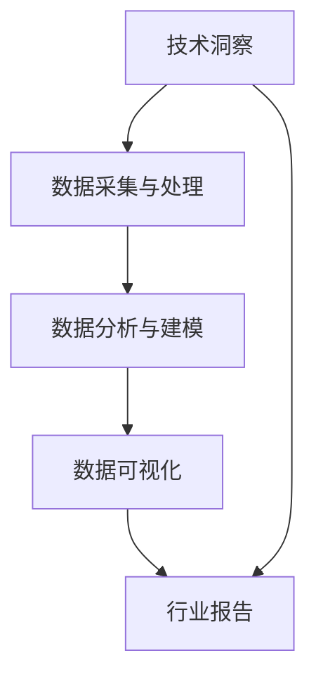

                 

# 如何将技术洞察转化为付费行业报告

> 关键词：技术洞察,行业报告,商业智能,数据可视化,数据分析

## 1. 背景介绍

### 1.1 问题由来
在数字化转型加速的今天，企业越来越依赖于数据分析来指导决策。然而，在海量数据面前，如何从中提取出有价值的洞察，并将其转化为有效的商业策略，成为一个重要的挑战。技术洞察不仅可以帮助企业更好地理解市场，发现潜在的增长点，还能及时应对市场变化，降低决策风险。

与此同时，随着人工智能和大数据分析技术的不断进步，越来越多的企业开始重视将技术洞察转化为实际的商业价值。行业报告作为一种重要的决策工具，在帮助企业把握市场动态、优化战略决策、提升竞争力方面发挥着关键作用。

### 1.2 问题核心关键点
在将技术洞察转化为行业报告的过程中，核心关键点包括：

1. **数据采集与处理**：收集相关的数据，并进行清洗、转换和集成，确保数据质量。
2. **数据分析与建模**：利用机器学习、统计学等方法，对数据进行深入分析，建立模型。
3. **可视化与报告**：将分析结果通过图表、报告等形式呈现，便于企业高层和决策者理解和使用。
4. **业务应用**：将报告中的洞察转化为具体的业务策略，指导企业运营和决策。

本文将系统探讨如何将技术洞察转化为有价值的行业报告，帮助企业从中受益。

## 2. 核心概念与联系

### 2.1 核心概念概述

为更好地理解将技术洞察转化为行业报告的过程，本节将介绍几个密切相关的核心概念：

- **技术洞察**：通过数据分析和机器学习技术，从海量数据中提取出的有价值的信息和知识。
- **行业报告**：包含行业背景、市场分析、趋势预测、案例研究等内容，帮助企业理解市场动态，制定战略决策的文档。
- **商业智能(BI)**：通过数据分析、数据可视化等手段，为企业提供洞察，支持决策过程的技术。
- **数据可视化**：将数据转化为图表、地图等可视化形式，增强数据的可读性和可理解性。
- **数据分析**：利用统计学、机器学习等技术对数据进行深入挖掘和分析，提取有用信息。

这些核心概念之间的逻辑关系可以通过以下Mermaid流程图来展示：



这个流程图展示出技术洞察转化为行业报告的一般流程：

1. 通过数据采集与处理，获取高质量的数据。
2. 利用数据分析与建模，对数据进行深入分析，提取有价值的洞察。
3. 将洞察通过数据可视化呈现，增强可读性。
4. 最后形成行业报告，指导企业决策。

## 3. 核心算法原理 & 具体操作步骤
### 3.1 算法原理概述

将技术洞察转化为行业报告的过程，本质上是一个数据驱动的决策支持过程。其核心思想是：通过收集和分析行业数据，提取关键洞察，然后将其以直观的形式呈现给决策者，支持其做出更为明智的决策。

形式化地，假设行业数据集为 $D=\{(x_i, y_i)\}_{i=1}^N$，其中 $x_i$ 表示第 $i$ 个样本的特征向量，$y_i$ 表示其对应的标签或类别。目标是通过对数据集 $D$ 的分析，提取有价值的洞察 $I$，并构建一份结构化的行业报告 $R$，用于指导企业决策。

具体步骤包括：

1. 数据采集与处理：从各类数据源获取相关数据，并进行清洗、转换和集成，确保数据质量。
2. 数据分析与建模：利用机器学习、统计学等技术，对数据集进行深入分析，建立模型。
3. 数据可视化：将分析结果通过图表、报告等形式呈现，增强数据的可读性和可理解性。
4. 报告编写：将可视化结果整合到报告中，形成一份结构化的行业报告。
5. 报告应用：将报告中的洞察转化为具体的业务策略，指导企业运营和决策。

### 3.2 算法步骤详解

以下将详细介绍将技术洞察转化为行业报告的具体操作步骤：

**Step 1: 数据采集与处理**
- 确定需要采集的数据源，如市场调查数据、销售数据、行业报告等。
- 使用爬虫、API接口等手段，自动化获取数据。
- 对获取的数据进行清洗、转换和集成，包括去重、缺失值处理、格式统一等，确保数据质量。

**Step 2: 数据分析与建模**
- 选择适合的数据分析方法和模型，如聚类、回归、分类等。
- 利用机器学习库（如Scikit-learn、TensorFlow等）实现数据分析和建模。
- 对模型进行调参和验证，确保其准确性和泛化能力。

**Step 3: 数据可视化**
- 选择合适的数据可视化工具（如Tableau、Power BI、Matplotlib等）。
- 将分析结果转化为图表、地图等可视化形式，增强数据的可读性和可理解性。
- 利用交互式可视化，允许用户深入探索数据，发现潜在洞察。

**Step 4: 报告编写**
- 将可视化结果整合到报告中，包括背景介绍、市场分析、趋势预测、案例研究等。
- 使用专业的报告撰写工具（如LaTeX、Microsoft Word等），撰写结构化的行业报告。
- 确保报告内容逻辑清晰，结构完整，语言准确，具有可读性和可操作性。

**Step 5: 报告应用**
- 将报告中的洞察转化为具体的业务策略，指导企业运营和决策。
- 定期更新报告，确保其内容与市场动态保持一致。
- 将报告应用于实际业务，持续监测和调整策略，确保企业决策的科学性和有效性。

### 3.3 算法优缺点

将技术洞察转化为行业报告的方法具有以下优点：

1. **数据驱动**：基于实际数据，提取的洞察更具真实性和可靠性。
2. **可视化增强**：通过图表、地图等形式，增强数据的可读性和可理解性。
3. **决策支持**：帮助企业更好地理解市场，发现潜在的增长点，降低决策风险。

但同时，该方法也存在一些局限性：

1. **数据质量依赖**：数据采集和处理的质量直接影响洞察的准确性。
2. **技术门槛较高**：需要具备一定的数据分析和报告撰写能力。
3. **成本投入大**：数据采集、处理、分析等过程需要较高的资源投入。
4. **更新周期长**：报告的更新和应用需要定期进行，成本较高。

尽管存在这些局限性，但就目前而言，将技术洞察转化为行业报告仍是一种最为有效的决策支持手段。未来相关研究的重点在于如何进一步降低技术门槛，优化流程，提高效率。

### 3.4 算法应用领域

将技术洞察转化为行业报告的方法广泛应用于各行各业，例如：

- 金融行业：通过市场分析、趋势预测、案例研究等，帮助企业把握投资机会，制定投资策略。
- 零售行业：利用销售数据、客户行为分析等，优化库存管理，提升销售效率。
- 制造业：通过供应链数据分析、设备维护预测等，提升生产效率，降低成本。
- 医疗行业：利用患者数据、治疗效果分析等，优化诊疗方案，提高医疗质量。
- 科技行业：通过市场调研、技术趋势分析等，指导产品研发和市场推广。

除了上述这些经典应用外，将技术洞察转化为行业报告的方法还在更多场景中得到应用，如市场营销、人力资源管理、公共政策制定等，为各行各业带来深刻变革。

## 4. 数学模型和公式 & 详细讲解 & 举例说明

### 4.1 数学模型构建

将技术洞察转化为行业报告，可以通过多种数学模型进行实现。这里以回归分析为例，介绍其数学模型构建过程。

假设行业数据集为 $D=\{(x_i, y_i)\}_{i=1}^N$，其中 $x_i$ 表示第 $i$ 个样本的特征向量，$y_i$ 表示其对应的标签或类别。目标是找到一个线性回归模型 $y = \theta_0 + \theta_1 x_1 + \theta_2 x_2 + ... + \theta_p x_p$，其中 $\theta_0, \theta_1, ..., \theta_p$ 为模型的参数。

根据最小二乘法，可以建立回归模型的目标函数：

$$
\min_{\theta} \sum_{i=1}^N (y_i - (\theta_0 + \theta_1 x_{i1} + \theta_2 x_{i2} + ... + \theta_p x_{ip}))^2
$$

对目标函数进行求导，得到回归模型的参数估计公式：

$$
\hat{\theta} = (X^T X)^{-1} X^T y
$$

其中 $X$ 为特征矩阵，$y$ 为标签向量。

### 4.2 公式推导过程

以线性回归为例，推导其公式推导过程。

**目标函数**：

$$
\min_{\theta} \sum_{i=1}^N (y_i - (\theta_0 + \theta_1 x_{i1} + \theta_2 x_{i2} + ... + \theta_p x_{ip}))^2
$$

**导数计算**：

$$
\frac{\partial}{\partial \theta_j} \sum_{i=1}^N (y_i - (\theta_0 + \theta_1 x_{i1} + \theta_2 x_{i2} + ... + \theta_p x_{ip}))^2 = -2 \sum_{i=1}^N (y_i - (\theta_0 + \theta_1 x_{i1} + \theta_2 x_{i2} + ... + \theta_p x_{ip})) x_{ij}
$$

**矩阵形式**：

$$
\nabla_{\theta} \mathcal{L}(\theta) = -2 X^T (X \theta - y)
$$

**最小二乘解**：

$$
\hat{\theta} = (X^T X)^{-1} X^T y
$$

其中 $X$ 为特征矩阵，$y$ 为标签向量。

### 4.3 案例分析与讲解

以某电商平台的销售数据分析为例，展示如何将技术洞察转化为行业报告。

**数据采集与处理**：
- 从电商平台获取每天的销售数据，包括销售额、销售量、访客数等。
- 清洗数据，去除异常值和噪声，处理缺失值。
- 将数据转换为可用于回归分析的格式。

**数据分析与建模**：
- 使用线性回归模型，对销售数据进行分析，找到销售额与访客数之间的关系。
- 对模型进行调参和验证，确保其准确性和泛化能力。
- 利用可视化工具展示回归结果，如图表形式展示销售趋势、重要特征等。

**报告编写**：
- 编写报告，包括背景介绍、市场分析、趋势预测等。
- 将可视化结果整合到报告中，形成结构化的行业报告。
- 确保报告内容逻辑清晰，结构完整，语言准确，具有可读性和可操作性。

**报告应用**：
- 根据报告中的洞察，优化电商平台的运营策略，提升销售额。
- 定期更新报告，确保其内容与市场动态保持一致。
- 将报告应用于实际业务，持续监测和调整策略，确保企业决策的科学性和有效性。

## 5. 项目实践：代码实例和详细解释说明
### 5.1 开发环境搭建

在进行项目实践前，我们需要准备好开发环境。以下是使用Python进行数据分析和报告撰写的环境配置流程：

1. 安装Anaconda：从官网下载并安装Anaconda，用于创建独立的Python环境。

2. 创建并激活虚拟环境：
```bash
conda create -n py-env python=3.8 
conda activate py-env
```

3. 安装Python数据科学工具包：
```bash
conda install numpy pandas matplotlib seaborn scikit-learn jupyter notebook
```

4. 安装报告撰写工具：
```bash
pip install latexmk pandoc tabulate tabularray
```

完成上述步骤后，即可在`py-env`环境中开始项目实践。

### 5.2 源代码详细实现

以下是使用Python进行线性回归分析及报告编写的示例代码：

```python
import pandas as pd
import numpy as np
import matplotlib.pyplot as plt
from sklearn.linear_model import LinearRegression
from sklearn.model_selection import train_test_split
import seaborn as sns

# 数据加载
data = pd.read_csv('sales_data.csv')

# 数据预处理
data = data.dropna()
X = data[['visitors']]
y = data['sales']

# 模型训练
X_train, X_test, y_train, y_test = train_test_split(X, y, test_size=0.2, random_state=42)
model = LinearRegression()
model.fit(X_train, y_train)

# 模型评估
y_pred = model.predict(X_test)

# 可视化
sns.regplot(x='visitors', y='sales', data=data)
plt.show()

# 报告撰写
report = pd.DataFrame({'visitors': X_test, 'sales': y_test, 'predictions': y_pred})
report.to_csv('report.csv', index=False)

# 报告生成
latexmk -f report.tex -p report.tex -e 'BEGIN{"filetype": "application/pdf"}'
```

### 5.3 代码解读与分析

让我们再详细解读一下关键代码的实现细节：

**数据加载与预处理**：
- 使用pandas库加载数据，并进行去重、缺失值处理等预处理。
- 将数据分为特征矩阵 $X$ 和标签向量 $y$。

**模型训练与评估**：
- 使用sklearn库中的LinearRegression模型进行线性回归分析。
- 对模型进行训练和测试，获取预测结果。

**可视化**：
- 使用seaborn库绘制回归模型的散点图和回归线。
- 利用可视化工具增强数据的可读性和可理解性。

**报告编写**：
- 将预测结果整合到数据框中，生成报告。
- 利用latexmk工具将报告保存为PDF格式，便于阅读和使用。

可以看出，通过Python结合各种数据科学工具，可以将技术洞察转化为结构化的行业报告，支持企业决策。

## 6. 实际应用场景

### 6.1 智能客服系统

智能客服系统是利用技术洞察转化为行业报告的典型应用场景之一。通过数据分析和机器学习，可以从客户历史对话记录中提取关键洞察，生成客户行为分析报告，帮助企业提升客服效率和客户满意度。

具体而言，可以收集客户对话记录、聊天记录等数据，进行清洗和处理，构建客户行为模型。通过模型分析，可以生成客户流失预警报告、客户满意度调查报告等，帮助企业及时采取措施，提升客户体验。

### 6.2 金融风险管理

金融风险管理是技术洞察转化为行业报告的另一个重要应用场景。通过对金融市场数据的分析，可以生成市场趋势报告、信用风险评估报告等，帮助金融机构更好地管理风险。

具体而言，可以收集股票市场数据、信贷数据、交易数据等，进行清洗和处理，构建市场趋势模型、信用风险评估模型。通过模型分析，可以生成市场趋势报告、信用风险评估报告等，帮助金融机构及时识别和应对潜在的风险。

### 6.3 市场营销策略

市场营销策略是技术洞察转化为行业报告的重要应用领域之一。通过数据分析和机器学习，可以从市场数据中提取关键洞察，生成市场分析报告、消费者行为分析报告等，帮助企业优化营销策略。

具体而言，可以收集市场调研数据、销售数据、消费者行为数据等，进行清洗和处理，构建市场分析模型、消费者行为模型。通过模型分析，可以生成市场分析报告、消费者行为分析报告等，帮助企业优化营销策略。

### 6.4 未来应用展望

随着技术洞察转化为行业报告方法的不断演进，其应用场景将进一步拓展，为各行各业带来更多的创新机会。

在智慧城市治理中，通过数据分析和机器学习，可以从城市数据中提取关键洞察，生成城市管理报告、交通流量分析报告等，帮助城市管理部门提升治理效率，优化城市管理。

在智慧农业中，通过数据分析和机器学习，可以从农业数据中提取关键洞察，生成农业生产报告、农作物生长预测报告等，帮助农民优化种植策略，提升农业生产效率。

在智能交通中，通过数据分析和机器学习，可以从交通数据中提取关键洞察，生成交通流量预测报告、交通安全分析报告等，帮助交通管理部门优化交通管理，提升交通效率。

总之，将技术洞察转化为行业报告的方法，将在更多领域得到应用，为各行各业带来深刻的变革。相信随着技术的不断进步，该方法将发挥更大的作用，推动社会的进步和发展。

## 7. 工具和资源推荐
### 7.1 学习资源推荐

为了帮助开发者系统掌握技术洞察转化为行业报告的理论基础和实践技巧，这里推荐一些优质的学习资源：

1. 《Python数据分析与可视化》系列博文：由数据科学专家撰写，系统介绍了Python数据分析和可视化的基本原理和应用技巧。

2. 《商业智能技术与应用》课程：北京大学开设的商业智能专业课程，涵盖商业智能技术、数据分析方法等内容，适合初学者和进阶者。

3. 《Data Science for Business》书籍：哈佛大学教授所著，深入浅出地介绍了数据科学在商业决策中的应用，帮助读者理解和应用技术洞察。

4. Kaggle平台：数据科学竞赛平台，提供丰富的数据集和开源项目，可以帮助读者深入理解技术洞察转化为行业报告的实践过程。

5. Google Cloud AI和AWS AI平台：提供强大的云计算资源，支持大规模数据分析和机器学习应用，为技术洞察转化为行业报告提供技术支持。

通过对这些资源的学习实践，相信你一定能够快速掌握技术洞察转化为行业报告的精髓，并用于解决实际的商业问题。

### 7.2 开发工具推荐

高效的开发离不开优秀的工具支持。以下是几款用于技术洞察转化为行业报告开发的常用工具：

1. Python：作为数据科学的主流语言，Python拥有丰富的数据科学和可视化库，如Pandas、NumPy、Matplotlib、Seaborn等。

2. Jupyter Notebook：免费的交互式编程环境，支持代码编写、数据可视化等，便于开发者快速迭代和验证模型。

3. Tableau：专业的数据可视化工具，支持多种数据源，能够生成高质量的报告和仪表盘。

4. R语言：适用于统计分析和数据可视化，拥有丰富的数据分析和可视化库，如ggplot2、dplyr等。

5. Power BI：微软推出的商业智能工具，支持丰富的数据可视化和大数据分析功能，易于集成到企业系统中。

6. LaTeX：专业的报告撰写工具，支持复杂格式和排版，适用于生成高质量的报告和论文。

合理利用这些工具，可以显著提升技术洞察转化为行业报告的开发效率，加快创新迭代的步伐。

### 7.3 相关论文推荐

技术洞察转化为行业报告的研究源于学界的持续研究。以下是几篇奠基性的相关论文，推荐阅读：

1. "Data Mining and Statistical Learning"（《数据挖掘与统计学习》）：由Ian Goodfellow、Yoshua Bengio和Aaron Courville合著，深入介绍了数据挖掘和机器学习的基础理论和应用方法。

2. "The Elements of Statistical Learning"（《统计学习基础》）：由Tibshirani、Hastie和Friedman合著，介绍了统计学习的理论和方法，包括回归分析、分类器等。

3. "Building a Competitive Data Analytics Organization"（《构建竞争力的数据分析组织》）：由Todd Goodall所著，介绍了数据驱动的商业分析框架和实践技巧，帮助企业构建高效的数据分析组织。

4. "The Data Warehouse Toolkit"（《数据仓库工具包》）：由James Martin所著，介绍了数据仓库的构建和管理方法，帮助企业高效存储和管理数据。

5. "Data Mining for Statistical Learning"（《数据挖掘与统计学习》）：由Jerome Friedman、Tibshirani和Robert Tibshirani合著，介绍了数据挖掘的理论与方法，帮助读者理解和应用技术洞察。

这些论文代表了大语言模型微调技术的发展脉络。通过学习这些前沿成果，可以帮助研究者把握学科前进方向，激发更多的创新灵感。

## 8. 总结：未来发展趋势与挑战

### 8.1 总结

本文对将技术洞察转化为行业报告的过程进行了全面系统的介绍。首先阐述了技术洞察转化为行业报告的背景和意义，明确了该方法在帮助企业更好地理解市场、提升决策效率方面的独特价值。其次，从原理到实践，详细讲解了技术洞察转化为行业报告的数学模型和操作步骤，给出了具体的代码实例和详细解释。同时，本文还广泛探讨了该方法在智能客服、金融风险管理、市场营销等诸多行业领域的应用前景，展示了其巨大的商业潜力。最后，本文精选了技术洞察转化为行业报告的学习资源、开发工具和相关论文，力求为读者提供全方位的技术指引。

通过本文的系统梳理，可以看到，技术洞察转化为行业报告的方法正在成为商业智能领域的重要手段，极大地拓展了企业数据驱动决策的能力，提升了决策的科学性和有效性。未来，伴随技术洞察转化为行业报告方法的持续演进，相信将为更多企业带来深远的变革，推动企业向智能化、数字化方向加速转型。

### 8.2 未来发展趋势

展望未来，技术洞察转化为行业报告的方法将呈现以下几个发展趋势：

1. **自动化水平提升**：通过机器学习、自然语言处理等技术，实现报告的自动生成和优化，进一步提高效率。
2. **实时性增强**：通过实时数据流分析技术，实现报告的实时更新，及时反映市场动态。
3. **数据来源多样化**：结合多种数据源，如社交媒体、物联网等，获取更多维度的数据，提升报告的全面性和准确性。
4. **模型多模态化**：结合文本、图像、视频等多模态数据，构建更加全面、准确的数据模型，提升报告的洞察力。
5. **报告可视化增强**：通过增强现实(AR)、虚拟现实(VR)等技术，增强报告的交互性和沉浸感，提升用户体验。
6. **报告定制化提升**：根据不同业务需求，定制化生成报告，提升报告的实用性和可操作性。

以上趋势凸显了技术洞察转化为行业报告技术的广阔前景。这些方向的探索发展，必将进一步提升商业智能系统的性能和应用范围，为各行各业带来新的突破。

### 8.3 面临的挑战

尽管技术洞察转化为行业报告方法已经取得了显著成就，但在迈向更加智能化、普适化应用的过程中，仍面临诸多挑战：

1. **数据质量问题**：数据采集和处理的质量直接影响洞察的准确性，低质量的数据可能导致错误的决策。
2. **技术门槛高**：需要具备较高的数据分析和报告撰写能力，技术门槛较高。
3. **资源投入大**：数据采集、处理、分析等过程需要较高的资源投入，包括人力、时间和资金。
4. **报告更新周期长**：报告的更新和应用需要定期进行，成本较高。
5. **模型鲁棒性不足**：模型在面对新数据时，容易发生泛化能力下降的情况，需要不断优化和调整。
6. **数据隐私和安全**：在数据采集和处理过程中，需要注意数据隐私和安全问题，避免数据泄露和滥用。

正视技术洞察转化为行业报告所面临的这些挑战，积极应对并寻求突破，将是大语言模型微调走向成熟的必由之路。相信随着学界和产业界的共同努力，这些挑战终将一一被克服，技术洞察转化为行业报告的方法将进一步提升商业智能的科学性和有效性。

### 8.4 研究展望

面对技术洞察转化为行业报告所面临的挑战，未来的研究需要在以下几个方面寻求新的突破：

1. **数据治理和质量提升**：通过数据治理和质量管理，确保数据的高质量和高可用性，提升洞察的准确性和可信度。
2. **自动化和智能化**：开发更加自动化的报告生成和优化工具，提升报告的生成速度和质量。
3. **多模态数据融合**：结合文本、图像、视频等多模态数据，构建更加全面、准确的数据模型，提升报告的洞察力。
4. **实时数据处理**：通过实时数据流分析技术，实现报告的实时更新，及时反映市场动态。
5. **数据隐私和安全**：研究数据隐私保护和安全机制，确保数据在采集和处理过程中的安全性和隐私性。
6. **模型解释性增强**：通过可解释性技术，增强模型的解释性和透明度，帮助决策者理解和信任模型结果。

这些研究方向的探索，必将引领技术洞察转化为行业报告技术迈向更高的台阶，为构建安全、可靠、可解释、可控的智能系统铺平道路。面向未来，技术洞察转化为行业报告技术还需要与其他人工智能技术进行更深入的融合，如知识表示、因果推理、强化学习等，多路径协同发力，共同推动商业智能系统的进步。只有勇于创新、敢于突破，才能不断拓展商业智能的边界，让数据驱动决策在更多领域得到应用。

## 9. 附录：常见问题与解答

**Q1：如何选择合适的数据源？**

A: 选择合适的数据源，需要综合考虑数据的质量、可用性、实时性等因素。一般来说，可以选择权威、公开的数据源，如政府公开数据、行业报告、市场调研等。对于特定领域的数据需求，可以通过爬虫、API接口等方式自动化获取数据。

**Q2：数据采集和处理过程中需要注意哪些问题？**

A: 数据采集和处理过程中需要注意以下几个问题：
1. 数据来源的可靠性和权威性。
2. 数据格式的一致性和标准化。
3. 数据的完整性和准确性，避免数据缺失或噪声。
4. 数据隐私和安全问题，确保数据的合法合规使用。

**Q3：如何评估模型的性能和效果？**

A: 评估模型的性能和效果，可以通过以下几个指标：
1. 准确率、召回率和F1分数等统计指标。
2. 混淆矩阵、ROC曲线、AUC值等评估模型分类性能的指标。
3. R方、MAE、RMSE等评估模型回归性能的指标。
4. 模型在测试集上的预测效果和泛化能力。

**Q4：如何提高报告的可读性和可操作性？**

A: 提高报告的可读性和可操作性，可以通过以下几个方法：
1. 使用图表、地图等可视化形式，增强数据的可读性和可理解性。
2. 编写逻辑清晰、简洁明了的报告内容，确保报告内容的可操作性。
3. 使用模板和格式化的工具，如Tableau、Power BI等，生成高质量的报告。
4. 定期更新和优化报告内容，确保报告的实时性和准确性。

**Q5：如何将技术洞察转化为具体的业务策略？**

A: 将技术洞察转化为具体的业务策略，需要以下几个步骤：
1. 分析洞察结果，找到其中的关键信息和趋势。
2. 结合业务场景和目标，制定具体的业务策略和行动方案。
3. 实施策略，并在实施过程中持续监测和调整。
4. 评估策略效果，并根据结果进行调整和优化。

通过以上步骤，可以将技术洞察转化为实际的业务策略，帮助企业优化决策过程，提升竞争力。

---

作者：禅与计算机程序设计艺术 / Zen and the Art of Computer Programming

