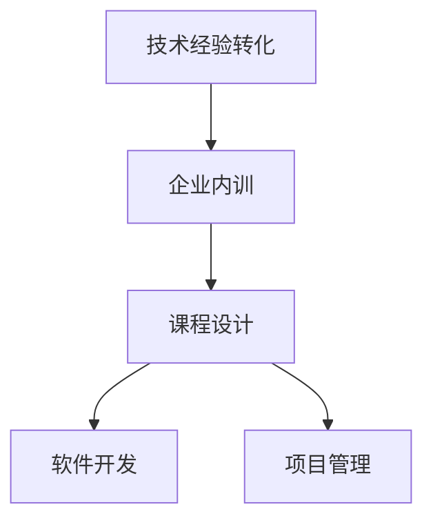

                 

# 如何将技术经验转化为企业内训课程

> 关键词：企业内训,技术经验转化,课程设计,软件开发,项目管理

## 1. 背景介绍

在信息技术飞速发展的今天，企业内部培训成为了提升员工技能、推动技术进步、加速组织转型的重要手段。然而，如何高效地将前沿的技术经验转化为可操作的课程内容，实现从实践到教学的良好衔接，成为了企业和培训机构的共同难题。本文将深入探讨如何将技术经验有效地转化为企业内训课程，为企业技术人才培养提供有益的参考。

## 2. 核心概念与联系

### 2.1 核心概念概述

- **技术经验转化**：将个人或团队在技术项目开发、问题解决、技术实验等实际工作中的经验、知识和技能，通过系统化的整理和提炼，转化为可教授、可复制的课程内容。
- **企业内训**：以企业内部员工为培训对象，通过内训课程传授特定的技术知识、工具和技能，提升员工的技术水平和业务能力。
- **课程设计**：基于培训目标，合理设计课程结构、内容、教学方法等，确保教学效果和学习成果。
- **软件开发**：利用编程语言、框架和工具等技术手段，实现软件产品或系统的开发过程。
- **项目管理**：通过计划、组织、执行、监控和控制等活动，管理项目资源、进度和质量，确保项目按计划完成。

这些概念之间的逻辑关系可以通过以下Mermaid流程图来展示：



这个流程图展示了一系列核心概念之间的联系：

1. 技术经验转化是企业内训的基础。
2. 课程设计是技术经验转化的产物。
3. 课程内容涵盖了软件开发和项目管理等多个方面。

## 3. 核心算法原理 & 具体操作步骤

### 3.1 算法原理概述

技术经验转化的核心在于将具体的实践活动提炼为可传授的知识和技能。这一过程可以分为以下几个步骤：

1. **经验总结**：对技术项目中的关键环节进行复盘，提炼出成功和失败的案例，总结出关键技能和最佳实践。
2. **内容抽象**：将具体的实践经验抽象为可教可学的理论框架，设计出逻辑清晰的课程结构和内容。
3. **技能训练**：通过设计实践练习、案例分析、互动讨论等环节，帮助学员掌握具体技能。
4. **知识应用**：通过实战项目或模拟场景，引导学员将所学知识应用于实际工作，提高实战能力。

### 3.2 算法步骤详解

#### 步骤1：经验总结

- **案例收集**：收集代表性技术项目，包括成功的案例和失败的教训。
- **问题分析**：对每个案例中的技术问题、决策过程和解决方案进行分析，提取核心要素。
- **技能总结**：从技术问题中提炼出核心技能，如编码技巧、测试方法、性能优化等。
- **最佳实践**：总结出在项目开发过程中最优的实践方式，如代码规范、版本管理、团队协作等。

#### 步骤2：内容抽象

- **课程规划**：根据技术经验总结的结果，设计课程的总体框架，包括课程名称、模块划分、课时安排等。
- **知识体系**：构建课程的知识体系，将具体技能和最佳实践整合为理论框架。
- **教学设计**：设计每个模块的教学内容，包括理论讲解、实践操作、案例分析等环节。
- **教学材料**：准备教学材料，如PPT、代码示例、实践任务等，确保教学的丰富性和可操作性。

#### 步骤3：技能训练

- **理论讲解**：通过PPT、视频等方式，系统讲解课程内容，帮助学员理解技术原理和最佳实践。
- **实践练习**：设计实战练习，让学员在模拟环境中进行技能训练，巩固所学知识。
- **案例分析**：提供真实或模拟的案例，引导学员进行问题分析和解决方案设计，培养解决实际问题的能力。
- **互动讨论**：通过小组讨论、角色扮演等方式，激发学员的思考和交流，提升学习效果。

#### 步骤4：知识应用

- **实战项目**：设计实际项目或模拟场景，让学员在真实的或接近真实的环境中应用所学知识。
- **模拟任务**：提供模拟任务，帮助学员在低风险环境中进行技能验证和问题解决。
- **反馈改进**：收集学员的反馈和建议，不断改进课程内容和教学方法，提高课程质量。

### 3.3 算法优缺点

#### 优点

- **理论与实践结合**：将实际技术经验转化为可传授的课程，有效结合理论和实践，提升教学效果。
- **内容系统化**：将复杂的实践经验系统化、结构化，便于学员理解和掌握。
- **技能全面性**：覆盖软件开发和项目管理等多个方面，全面提升学员的综合技能。

#### 缺点

- **时间和成本投入大**：技术经验转化的过程需要投入大量时间和资源，且转化难度较大。
- **依赖经验丰富度**：课程设计依赖于经验的丰富度，对有经验专家的需求较高。
- **个性化不足**：课程设计可能忽视特定场景或个体差异，难以满足所有学员的需求。

### 3.4 算法应用领域

技术经验转化方法广泛应用于软件开发、项目管理、人工智能、大数据等领域的企业内训中。以下以软件开发为例，展示其具体应用：

#### 软件开发

- **前端开发**：针对前端开发技术栈（如HTML/CSS/JavaScript等），设计具体的前端框架和工具使用课程。
- **后端开发**：针对后端开发技术栈（如Java、Python、Node.js等），设计具体的框架和库使用课程。
- **全栈开发**：结合前端和后端开发技术，设计全栈开发课程，涵盖前后端技术和项目开发流程。
- **DevOps**：针对DevOps工具链（如Docker、Kubernetes、CI/CD等），设计DevOps实践课程，提升自动化部署和运维能力。
- **性能优化**：针对代码优化、数据库优化、服务器优化等，设计性能调优课程，提升系统性能和稳定性。

## 4. 数学模型和公式 & 详细讲解

### 4.1 数学模型构建

技术经验转化的数学模型可以抽象为如下形式：

$$
\text{Course} = f(\text{Experience}, \text{Tools}, \text{Process})
$$

其中：
- **Experience**：技术经验，包括项目背景、技术问题、解决方案等。
- **Tools**：使用的工具和技术栈，如编程语言、框架、库等。
- **Process**：项目开发流程，包括需求分析、设计、开发、测试、部署等环节。

### 4.2 公式推导过程

以一个简单的软件开发案例为例，展示如何通过技术经验转化构建课程：

- **案例背景**：一个电商网站的开发项目，包括前端界面、后端服务、数据库等模块。
- **技术问题**：在前端界面开发过程中，遇到性能瓶颈，页面加载缓慢。
- **解决方案**：优化前端代码，采用懒加载技术，减少页面请求，提高页面渲染速度。
- **技能总结**：前端性能优化技能，包括懒加载、代码压缩、资源合并等。

根据上述案例，可以设计如下课程：

- **课程名称**：前端性能优化课程
- **模块划分**：
  - 模块1：前端性能优化基础
  - 模块2：懒加载技术
  - 模块3：代码压缩与合并
  - 模块4：性能优化实战
- **课时安排**：每个模块2课时，总计8课时

### 4.3 案例分析与讲解

以“懒加载技术”模块为例，进行详细分析与讲解：

- **理论讲解**：讲解懒加载的基本概念、原理和优势，介绍常见的懒加载实现方式。
- **实践练习**：提供示例代码，让学员实现懒加载功能，并通过实践练习巩固所学知识。
- **案例分析**：通过分析实际项目中的懒加载应用，帮助学员理解其在实际项目中的作用和效果。
- **互动讨论**：组织学员讨论，分享懒加载在实际项目中的经验，探讨其应用场景和挑战。

## 5. 项目实践：代码实例和详细解释说明

### 5.1 开发环境搭建

在进行软件开发课程实践前，需要准备好开发环境。以下是使用Python进行Django开发的环境配置流程：

1. 安装Anaconda：从官网下载并安装Anaconda，用于创建独立的Python环境。

2. 创建并激活虚拟环境：
```bash
conda create -n myenv python=3.8 
conda activate myenv
```

3. 安装Django：根据CUDA版本，从官网获取对应的安装命令。例如：
```bash
conda install django=3.2
```

4. 安装必要的库：
```bash
pip install django-rest-framework
pip install Pillow
pip install django-cors-headers
```

5. 安装数据库：
```bash
pip install psycopg2-binary
```

完成上述步骤后，即可在`myenv`环境中开始Django开发实践。

### 5.2 源代码详细实现

以下是一个简单的Django REST API开发的代码实现：

```python
# settings.py
DATABASES = {
    'default': {
        'ENGINE': 'django.db.backends.postgresql',
        'NAME': 'mydatabase',
        'USER': 'mydatabaseuser',
        'PASSWORD': 'mypassword',
        'HOST': 'localhost',
        'PORT': '5432',
    }
}
```

```python
# models.py
from django.db import models

class Product(models.Model):
    name = models.CharField(max_length=255)
    price = models.DecimalField(max_digits=10, decimal_places=2)
    description = models.TextField()

    def __str__(self):
        return self.name
```

```python
# views.py
from rest_framework import generics
from .models import Product
from .serializers import ProductSerializer

class ProductList(generics.ListAPIView):
    queryset = Product.objects.all()
    serializer_class = ProductSerializer

class ProductDetail(generics.RetrieveAPIView):
    queryset = Product.objects.all()
    serializer_class = ProductSerializer
```

```python
# serializers.py
from rest_framework import serializers
from .models import Product

class ProductSerializer(serializers.ModelSerializer):
    class Meta:
        model = Product
        fields = '__all__'
```

### 5.3 代码解读与分析

**Django REST API开发**：
- **环境配置**：使用Anaconda和pip安装必要的库，确保Django开发环境准备好。
- **项目结构**：包含settings.py、models.py、views.py和serializers.py等文件，定义数据库连接、模型、视图和序列化器。
- **功能实现**：实现了一个简单的REST API，包括产品列表和产品详情的获取。
- **代码注释**：每段代码都进行了详细的注释，帮助读者理解代码结构和功能。

### 5.4 运行结果展示

启动Django开发环境，访问`http://localhost:8000/products/`，即可获取产品列表数据。

## 6. 实际应用场景

### 6.1 企业内训

#### 项目实战

- **案例**：开发一个简单的电商网站，涵盖商品列表、商品详情、购物车等功能模块。
- **任务**：分阶段完成每个模块的开发，包括需求分析、设计、开发、测试和部署等环节。
- **成果**：培养学员的全栈开发能力和项目管理能力。

#### 进阶训练

- **案例**：将电商网站进行性能优化，包括数据库优化、缓存配置、CDN加速等。
- **任务**：通过实战项目，提升学员在性能优化方面的技能。
- **成果**：培养学员的性能调优能力和优化思维。

### 6.2 技术培训

#### 技术培训

- **案例**：针对某个特定的技术栈（如Java、Python等），设计一系列系统化的培训课程。
- **任务**：通过理论讲解、实践练习、案例分析等环节，帮助学员掌握技术栈的使用和最佳实践。
- **成果**：提升学员的技术能力和职业发展潜力。

#### 技术栈迁移

- **案例**：企业需要从某个技术栈迁移到另一个技术栈，如从Java迁移到Python。
- **任务**：通过对比分析、技术迁移、项目实践等环节，帮助学员掌握新栈的技术特点和应用场景。
- **成果**：实现技术栈的平滑迁移，提升团队的技术适应性和创新能力。

### 6.3 技术沉淀

#### 技术沉淀

- **案例**：企业内部积累了大量的技术经验，需要进行系统化的沉淀和分享。
- **任务**：将技术经验转化为课程内容，形成内部的技术文档和培训材料。
- **成果**：形成系统的技术沉淀，提升企业内部的技术知识和经验共享水平。

#### 技术传承

- **案例**：企业需要培养新的技术骨干，传承现有的技术经验和知识。
- **任务**：通过内训课程，帮助新员工快速掌握企业内部的技术架构和开发流程。
- **成果**：培养新员工的技术能力和团队合作精神，提升企业的技术传承能力。

### 6.4 未来应用展望

随着信息技术的不断进步，企业内训的形式和内容也在不断丰富和发展。未来，技术经验转化在企业内训中的应用将更加广泛和深入，具体展望如下：

- **远程培训**：利用互联网技术，实现远程培训，打破地域限制，提升培训的覆盖面和效率。
- **虚拟教室**：开发虚拟教室系统，实现互动式学习，提升培训的互动性和参与度。
- **个性化培训**：根据学员的学习能力和职业需求，设计个性化的培训课程，满足不同学员的需求。
- **混合学习**：结合线上学习和线下培训，实现混合式学习，提升培训的灵活性和效果。
- **智能辅导**：引入智能辅导系统，通过智能推荐和学习路径优化，提升培训的针对性和效率。

## 7. 工具和资源推荐

### 7.1 学习资源推荐

- **Django官方文档**：详细介绍了Django框架的使用方法和最佳实践，是Django开发的必备资源。
- **Django REST Framework官方文档**：介绍了如何使用Django REST Framework进行API开发，是Django REST API开发的参考。
- **Django实战教程**：通过实战案例，系统讲解了Django的各个模块和功能，适合初学者和进阶者学习。
- **Django Girl**：提供了大量的Django开发教程和实践项目，适合女性开发者入门学习。
- **Django tutorial**：提供了简单易懂的Django入门教程，适合初学者学习。

### 7.2 开发工具推荐

- **PyCharm**：功能强大的Python IDE，提供了代码提示、代码调试、版本控制等功能，适合Django开发。
- **Visual Studio Code**：轻量级但功能强大的文本编辑器，支持多种编程语言和插件，适合Django开发和代码编辑。
- **Git**：版本控制系统，适合代码版本管理和协作开发。
- **Docker**：容器化技术，适合Django应用部署和持续集成。
- **Jenkins**：持续集成和持续部署工具，适合自动化测试和部署。

### 7.3 相关论文推荐

- **"Designing Effective Training Programs: A Review and Analysis of Training Program Characteristics and Outcomes"**：研究了培训项目的特点和效果，为课程设计提供了理论支持。
- **"An Empirical Study of the Impact of Collaborative Learning on Software Developers"**：研究了协作学习对软件开发的影响，为团队内训提供了参考。
- **"An Exploratory Study of Programming Practice in Software Engineers"**：研究了软件工程师的编程实践，为代码教学提供了指导。
- **"Designing and Implementing Effective Training Programs for Software Developers"**：研究了软件开发培训项目的有效设计方法，为课程设计提供了实践建议。

## 8. 总结：未来发展趋势与挑战

### 8.1 研究成果总结

技术经验转化和内训课程设计是提升企业技术水平和人才素质的重要手段。本文总结了技术经验转化的主要步骤和方法，提出了具体的应用场景和工具推荐。通过系统化的培训和实战练习，企业可以培养出更多具有实战能力和创新精神的技术人才。

### 8.2 未来发展趋势

随着技术的不断进步和企业需求的不断变化，技术经验转化和内训课程设计也将不断发展和创新。未来，技术经验转化将更加智能化、个性化和多样化，具体趋势如下：

- **智能化培训**：引入AI和机器学习技术，提升培训的个性化和互动性，帮助学员更高效地学习。
- **可视化学习**：利用可视化工具和技术，提升学习效果和理解深度，帮助学员更好地掌握复杂概念。
- **虚拟化实践**：通过虚拟化技术，提供虚拟化的实践环境，帮助学员在低风险环境下进行技能验证和问题解决。
- **跨界融合**：结合多种技术手段和工具，提升培训的多样性和创新性，帮助学员在实际工作中更好地应用所学知识。

### 8.3 面临的挑战

尽管技术经验转化和内训课程设计在企业培训中已展现出显著的效果，但未来仍面临以下挑战：

- **技术更新快**：信息技术发展迅速，需要不断更新培训内容和方法，跟上技术发展的步伐。
- **学员差异大**：不同学员的年龄、背景、技能水平差异较大，需要设计差异化的培训方案。
- **培训效果评估**：如何准确评估培训效果和学员的学习成果，是企业内训亟需解决的难题。
- **资源投入大**：培训需要投入大量的时间、人力和物力资源，如何优化资源配置和利用效率，是企业培训管理的关键。
- **技术应用难**：将新技术应用到培训中，需要克服技术实现和使用的复杂性，提高应用效率。

### 8.4 研究展望

未来的技术经验转化和内训课程设计需要从多个角度进行深入研究和实践：

- **理论研究**：结合心理学、教育学等学科，深入研究培训方法和效果评估，提升培训的科学性和有效性。
- **技术应用**：结合AI、VR、AR等新兴技术，提升培训的智能化和互动性，提供更好的学习体验。
- **课程创新**：结合企业实际需求和市场变化，设计更多富有创新性的培训课程，提升企业的竞争力。
- **国际合作**：借鉴国际先进的企业培训经验和案例，提升企业内训的国际化水平。

通过持续的技术创新和实践优化，技术经验转化和内训课程设计将为企业技术人才的培养提供更加有效的支撑，推动企业的持续发展和创新。

## 9. 附录：常见问题与解答

**Q1：如何进行技术经验总结？**

A: 技术经验总结主要分为以下步骤：
1. 回顾项目历程，梳理项目的各个关键阶段和决策点。
2. 分析项目中的技术问题和挑战，总结出解决方案和最佳实践。
3. 提炼出项目中的关键技能和工具，形成技术总结文档。
4. 形成案例集，作为内训课程的基础素材。

**Q2：如何设计有效的内训课程？**

A: 有效的内训课程设计主要包括以下几个步骤：
1. 明确培训目标和需求，确定培训内容。
2. 设计课程结构和内容，形成系统化的知识体系。
3. 设计教学方法和互动环节，提升学员的学习效果。
4. 提供实战练习和案例分析，帮助学员巩固所学知识。
5. 收集学员反馈，持续改进课程内容和教学方法。

**Q3：如何进行技术栈迁移培训？**

A: 技术栈迁移培训主要包括以下几个步骤：
1. 分析原技术栈和目标技术栈的特点和优势，形成对比分析文档。
2. 设计技术迁移路径和步骤，明确迁移的重点和难点。
3. 提供迁移实战练习，帮助学员掌握新栈的技能和工具。
4. 设计迁移后的项目实战，帮助学员在实际环境中应用所学技能。
5. 提供迁移后的技术支持，帮助学员解决迁移过程中遇到的问题。

**Q4：如何进行虚拟化实践？**

A: 虚拟化实践主要包括以下几个步骤：
1. 利用虚拟化技术，搭建虚拟化的开发和测试环境。
2. 提供虚拟化的实战练习和案例，帮助学员在低风险环境下进行技能验证。
3. 设计虚拟化的团队协作和项目管理流程，提升虚拟化实践的效率和效果。
4. 收集虚拟化实践的反馈和数据，持续优化虚拟化环境和流程。

**Q5：如何进行培训效果评估？**

A: 培训效果评估主要包括以下几个方面：
1. 设计评估指标和标准，明确评估的内容和方法。
2. 收集学员的反馈和数据，分析培训效果和学习成果。
3. 结合实际工作表现，评估学员在实际工作中应用所学知识的能力。
4. 持续改进培训内容和方法，提升培训的针对性和有效性。

通过以上方法，可以有效地将技术经验转化为内训课程，帮助企业提升技术水平和人才素质，推动企业的持续发展和创新。

---

作者：禅与计算机程序设计艺术 / Zen and the Art of Computer Programming

