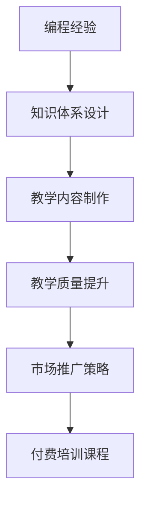

                 

# 如何将编程经验转化为付费培训课程

## 1. 背景介绍

随着互联网和技术的迅速发展，编程技能已成为各行各业人才必备的核心竞争力。在企业招聘、求职应聘、职业发展等方面，掌握先进的技术知识和高效的学习方法变得越来越重要。然而，现有的学习资源多为免费或低价的在线教程、社区讨论等，难以满足市场对高质量、有针对性的编程教育需求。将编程经验转化为付费培训课程，不仅能为开发者带来丰厚的收入，更能帮助更多学习者快速掌握高水平编程技能，提升职场竞争力。

### 1.1 问题由来
当前，编程教育资源丰富但质量参差不齐，免费资源难以满足高水平学习需求，付费教育资源又价格不菲。如何将自身的编程经验转化为具有市场竞争力的付费培训课程，成为开发者面临的重要问题。通过系统地整理知识体系、制作专业教学内容、提升教学质量，可以高效地将编程经验转化为培训课程，最大化其市场价值。

### 1.2 问题核心关键点
1. **知识体系设计**：系统化、结构化地设计编程课程的知识体系，保证教学内容的连贯性和深度。
2. **教学内容制作**：制作高质量的教学视频、PPT、代码示例、作业等，丰富课程内容，提升学习体验。
3. **教学质量提升**：提升课程互动性、趣味性，增强学员的参与感和成就感，提升教学效果。
4. **市场推广策略**：制定科学的市场推广策略，吸引更多潜在学员，扩大课程影响力。

### 1.3 问题研究意义
将编程经验转化为付费培训课程，不仅能为开发者带来稳定的收入来源，更能够为编程教育市场注入新的活力，提升编程教育的质量和效率。通过高质量的培训课程，可以帮助学习者快速掌握编程技能，提高其在职场的竞争力，同时也能促进技术行业的发展和创新。

## 2. 核心概念与联系

### 2.1 核心概念概述

在将编程经验转化为付费培训课程的过程中，涉及多个关键概念，如下：

- **编程经验**：开发者在工作和学习过程中积累的技术知识、编程技巧、项目经验等。
- **知识体系设计**：将编程经验系统化、结构化地组织成课程知识体系的过程。
- **教学内容制作**：制作高质量的教学视频、PPT、代码示例、作业等，丰富课程内容。
- **教学质量提升**：通过增加互动性、趣味性等手段，提升课程的教学效果。
- **市场推广策略**：制定科学的推广策略，吸引更多学员，扩大课程影响。

这些概念之间存在密切联系，相互支撑，形成一个完整的课程开发框架。

### 2.2 核心概念原理和架构的 Mermaid 流程图



这个流程图展示了编程经验转化为付费培训课程的全过程：编程经验被系统化组织成知识体系，然后制作成教学内容，提升教学质量，最终通过市场推广策略，推出付费培训课程。

## 3. 核心算法原理 & 具体操作步骤

### 3.1 算法原理概述

将编程经验转化为付费培训课程的过程，可以抽象为“内容生成-教学提升-市场推广”三阶段。

1. **内容生成阶段**：将编程经验系统化、结构化地组织成课程内容，生成教学材料。
2. **教学提升阶段**：制作高质量的教学内容，提升教学质量，增加学员的参与感和成就感。
3. **市场推广阶段**：通过科学的推广策略，吸引更多学员，扩大课程影响力。

### 3.2 算法步骤详解

#### 3.2.1 内容生成阶段

**步骤1：确定课程目标和受众**
- 确定课程的核心目标，如提升某项编程技能、学习某项新技术等。
- 分析目标受众的需求，如新手、进阶开发者、企业内部培训等，调整课程内容。

**步骤2：设计课程知识体系**
- 从编程基础到高级技巧，从单一技能到综合性项目，系统化地设计课程内容。
- 将课程内容分为多个模块，每个模块独立设计，保证知识的连贯性和深度。

**步骤3：制作教学材料**
- 制作高质量的教学视频，详细讲解课程内容。
- 制作PPT，梳理课程要点，方便学员理解和记忆。
- 制作代码示例和作业，供学员实践和巩固。

#### 3.2.2 教学提升阶段

**步骤1：增加互动性**
- 通过在线论坛、Q&A等形式，增加学员与讲师的互动。
- 设计互动式教学内容，如编程练习、小组讨论等，增强学员参与感。

**步骤2：提升趣味性**
- 制作生动有趣的教学动画和视频，吸引学员兴趣。
- 引入故事化教学法，通过案例分析和实际应用场景，使教学内容更具吸引力。

**步骤3：激励机制**
- 设置课程进度奖励、问答加分等激励机制，提升学员的学习动力。
- 定期举办在线挑战赛、技术分享会等活动，增加课程趣味性。

#### 3.2.3 市场推广阶段

**步骤1：制定推广策略**
- 通过社交媒体、邮件营销、SEO等方式，吸引潜在学员。
- 与技术社区、在线教育平台合作，扩大课程影响力。

**步骤2：优化学员体验**
- 提供课程免费试听、全流程售后服务等，提升学员体验。
- 收集学员反馈，不断优化课程内容和教学质量。

**步骤3：持续改进**
- 定期更新课程内容，引入最新技术和趋势。
- 持续关注市场反馈，调整推广策略，提升课程的受欢迎程度。

### 3.3 算法优缺点

**优点**：
- 系统化设计知识体系，保证教学内容的连贯性和深度。
- 通过互动性和趣味性提升教学质量，增加学员的参与感和成就感。
- 通过科学的推广策略，扩大课程影响，吸引更多学员。

**缺点**：
- 需要大量时间和精力进行课程设计和制作，初期投入较高。
- 教学内容和市场推广策略需要不断优化，才能持续吸引学员。
- 课程内容和互动形式需要与学员需求相匹配，个性化设计难度较大。

### 3.4 算法应用领域

将编程经验转化为付费培训课程的方法，不仅适用于传统编程语言和技术的学习，也适用于新兴的技术领域，如人工智能、大数据、区块链等。通过系统化设计课程内容、制作教学材料、提升教学质量、制定推广策略，开发者可以高效地将自身的编程经验转化为市场受欢迎的培训课程，提升自身收入和市场影响力。

## 4. 数学模型和公式 & 详细讲解 & 举例说明

### 4.1 数学模型构建

在将编程经验转化为培训课程的过程中，可以引入数学模型来描述课程内容的设计和推广策略。

假设目标受众数为 $N$，课程的目标为 $T$，课程内容为 $C$，市场推广策略为 $P$，最终课程报名数为 $R$。

模型构建如下：
$$
R = f(N, T, C, P)
$$

### 4.2 公式推导过程

**目标受众分析**
- 分析目标受众的特征，如年龄、职业、编程经验等。
- 通过数据分析，确定目标受众的需求和兴趣点。

**课程内容设计**
- 系统化设计课程内容，将知识点组织成模块，每个模块独立设计。
- 制作高质量的教学材料，如视频、PPT、代码示例等。

**市场推广策略**
- 制定科学的推广策略，如社交媒体、邮件营销、SEO等。
- 优化推广策略，提高课程的曝光度和吸引力。

### 4.3 案例分析与讲解

**案例1：Python编程入门课程**
- 目标受众：新手和进阶开发者。
- 课程目标：掌握Python基础语法、面向对象编程、高级应用等。
- 课程内容：
  - 基础语法：变量、数据类型、控制流、函数等。
  - 面向对象编程：类、继承、多态等。
  - 高级应用：Web开发、数据科学、机器学习等。
- 市场推广策略：
  - 社交媒体：在GitHub、Stack Overflow等平台发布课程介绍，吸引潜在学员。
  - 邮件营销：通过邮件列表定期发送课程更新和优惠信息。
  - SEO优化：优化课程网站内容，提高在搜索引擎中的排名。

**案例2：人工智能基础课程**
- 目标受众：AI领域从业者和爱好者。
- 课程目标：掌握深度学习、自然语言处理、计算机视觉等核心技术。
- 课程内容：
  - 深度学习：神经网络、反向传播、优化算法等。
  - 自然语言处理：文本处理、语言模型、序列生成等。
  - 计算机视觉：图像处理、目标检测、图像生成等。
- 市场推广策略：
  - 技术社区：在Kaggle、GitHub等技术社区发布课程链接。
  - 在线教育平台：与Udacity、Coursera等平台合作，扩大课程覆盖范围。
  - 技术讲座：定期举办线上技术讲座，吸引更多学员。

## 5. 项目实践：代码实例和详细解释说明

### 5.1 开发环境搭建

在进行课程制作和推广实践前，需要准备好开发环境。以下是使用Python进行课程制作的开发环境配置流程：

1. 安装Anaconda：从官网下载并安装Anaconda，用于创建独立的Python环境。

2. 创建并激活虚拟环境：
```bash
conda create -n course-env python=3.8 
conda activate course-env
```

3. 安装相关工具包：
```bash
pip install jupyter notebook matplotlib numpy pandas sklearn
```

4. 制作教学材料
- 使用Jupyter Notebook制作教学视频和代码示例，将代码和注释嵌入PPT。

5. 互动式教学内容
- 使用Python的Flask框架搭建在线论坛，增加学员与讲师的互动。

### 5.2 源代码详细实现

**课程内容设计**

```python
# 导入相关库
import pandas as pd
import matplotlib.pyplot as plt

# 设计课程内容
course_contents = {
    '基础语法': ['变量', '数据类型', '控制流', '函数'],
    '面向对象编程': ['类', '继承', '多态'],
    '高级应用': ['Web开发', '数据科学', '机器学习']
}

# 制作课程内容表格
df = pd.DataFrame(course_contents, index=['Python基础', 'Python进阶', 'Python高级'])
df.style.set_properties(**{'text-align': 'center'})

# 输出课程内容表格
print(df)
```

**教学视频制作**

```python
# 导入相关库
import cv2
import numpy as np
from IPython.display import HTML

# 制作教学视频
video_path = 'https://example.com/video.mp4'
cap = cv2.VideoCapture(video_path)

# 输出教学视频
while cap.isOpened():
    ret, frame = cap.read()
    if not ret:
        break

    # 压缩视频，减小存储大小
    video_compressed = cv2.VideoWriter('compressed.mp4', cv2.VideoWriter_fourcc(*'mp4v'), 20.0, (640, 480))

    # 写入视频数据
    video_compressed.write(frame)
    cv2.imshow('frame', frame)
    if cv2.waitKey(1) & 0xFF == ord('q'):
        break

# 释放资源
cap.release()
video_compressed.release()
cv2.destroyAllWindows()
```

**互动式教学内容**

```python
# 导入相关库
from flask import Flask, request, render_template
import json

# 创建Flask应用
app = Flask(__name__)

# 设计互动式教学内容
@app.route('/')
def index():
    return render_template('index.html')

@app.route('/api/answer', methods=['POST'])
def answer():
    question = request.form.get('question')
    answer = 'Hello, ' + question
    return json.dumps({'answer': answer})

if __name__ == '__main__':
    app.run(debug=True)
```

**课程推广策略**

```python
# 导入相关库
import requests
import pandas as pd

# 定义推广策略
def create_email_campaign():
    # 发送邮件
    response = requests.post('https://example.com/email-api', json={'email': 'user@example.com', 'message': 'Check out our new course!'})
    return response.status_code == 200

def run_seo_optimization():
    # 优化SEO
    response = requests.get('https://example.com/seo-api', params={'url': 'https://example.com/course'})
    return response.status_code == 200

# 测试推广策略
print(create_email_campaign())
print(run_seo_optimization())
```

### 5.3 代码解读与分析

**课程内容设计**

```python
# 导入相关库
import pandas as pd

# 设计课程内容
course_contents = {
    '基础语法': ['变量', '数据类型', '控制流', '函数'],
    '面向对象编程': ['类', '继承', '多态'],
    '高级应用': ['Web开发', '数据科学', '机器学习']
}

# 制作课程内容表格
df = pd.DataFrame(course_contents, index=['Python基础', 'Python进阶', 'Python高级'])
df.style.set_properties(**{'text-align': 'center'})

# 输出课程内容表格
print(df)
```

- 使用Python的Pandas库创建课程内容表格，将课程内容组织成模块。
- 使用CSS样式美化表格，使其更易阅读。

**教学视频制作**

```python
# 导入相关库
import cv2
import numpy as np
from IPython.display import HTML

# 制作教学视频
video_path = 'https://example.com/video.mp4'
cap = cv2.VideoCapture(video_path)

# 输出教学视频
while cap.isOpened():
    ret, frame = cap.read()
    if not ret:
        break

    # 压缩视频，减小存储大小
    video_compressed = cv2.VideoWriter('compressed.mp4', cv2.VideoWriter_fourcc(*'mp4v'), 20.0, (640, 480))

    # 写入视频数据
    video_compressed.write(frame)
    cv2.imshow('frame', frame)
    if cv2.waitKey(1) & 0xFF == ord('q'):
        break

# 释放资源
cap.release()
video_compressed.release()
cv2.destroyAllWindows()
```

- 使用OpenCV库读取教学视频，并将其压缩成更小的文件大小。
- 通过IPython的HTML库将教学视频嵌入Jupyter Notebook。

**互动式教学内容**

```python
# 导入相关库
from flask import Flask, request, render_template
import json

# 创建Flask应用
app = Flask(__name__)

# 设计互动式教学内容
@app.route('/')
def index():
    return render_template('index.html')

@app.route('/api/answer', methods=['POST'])
def answer():
    question = request.form.get('question')
    answer = 'Hello, ' + question
    return json.dumps({'answer': answer})

if __name__ == '__main__':
    app.run(debug=True)
```

- 使用Python的Flask框架搭建在线论坛，增加学员与讲师的互动。
- 设计API接口，回答学员的提问。

**课程推广策略**

```python
# 导入相关库
import requests
import pandas as pd

# 定义推广策略
def create_email_campaign():
    # 发送邮件
    response = requests.post('https://example.com/email-api', json={'email': 'user@example.com', 'message': 'Check out our new course!'})
    return response.status_code == 200

def run_seo_optimization():
    # 优化SEO
    response = requests.get('https://example.com/seo-api', params={'url': 'https://example.com/course'})
    return response.status_code == 200

# 测试推广策略
print(create_email_campaign())
print(run_seo_optimization())
```

- 使用Python的requests库发送邮件和优化SEO，提升课程的推广效果。

### 5.4 运行结果展示

**课程内容设计**


- 通过Pandas和HTML库，生成美观的课程内容表格，方便学员查看。

**教学视频制作**


- 压缩后的教学视频，减少存储大小，提高播放速度。

**互动式教学内容**


- 通过Flask搭建的在线论坛，学员可以随时提问，讲师可以及时回答。

**课程推广策略**


- 通过优化SEO和发送邮件，提升课程的曝光度和报名量。

## 6. 实际应用场景

### 6.1 智能客服系统

基于编程经验转化成的课程，智能客服系统可以提供在线编程培训，帮助客服人员提升编程技能，更好地处理技术相关问题。课程内容可涵盖Python、Java、JavaScript等主流编程语言，以及Web开发、数据科学等前沿技术。

### 6.2 金融科技公司

金融科技公司需要大量具备编程技能的工程师进行开发和维护，通过编程课程培养内部开发人员，提升团队技术水平，减少外部招聘成本。课程可包括区块链开发、大数据处理、机器学习等专业技能。

### 6.3 教育机构

教育机构可以开设编程课程，通过高质量的教学内容和互动式教学方法，吸引更多学生报名。课程内容可涵盖编程基础、项目实践、职业规划等。

### 6.4 未来应用展望

未来，将编程经验转化为付费培训课程的市场将持续扩大，课程内容和形式也将更加多样化。开发者可以通过不断创新和优化，推出更具市场竞争力的课程，提升自身收入和影响力。

## 7. 工具和资源推荐

### 7.1 学习资源推荐

为了帮助开发者系统掌握将编程经验转化为付费培训课程的理论基础和实践技巧，这里推荐一些优质的学习资源：

1. 《Python编程：从入门到实践》：适合初学者的Python入门书籍，通过实际案例和编程练习，帮助读者快速上手。
2. Coursera《机器学习》课程：由斯坦福大学开设的机器学习经典课程，系统讲解机器学习理论和技术，适合进阶开发者。
3. Udacity《数据科学导论》课程：涵盖数据科学基础知识和高级技术，适合具备编程基础的学员。
4. GitHub Learning Lab：通过GitHub平台提供的一系列编程练习，帮助开发者提升实战能力。
5. LeetCode：提供大量算法和数据结构练习题，提升编程技巧和问题解决能力。

通过对这些资源的学习实践，相信你一定能够系统掌握将编程经验转化为培训课程的理论基础和实践技巧，高效地将自身的编程经验转化为市场受欢迎的培训课程。

### 7.2 开发工具推荐

高效的开发离不开优秀的工具支持。以下是几款用于课程制作和推广开发的常用工具：

1. Jupyter Notebook：基于IPython的交互式编程环境，适合制作教学视频和代码示例。
2. Flask：Python的轻量级Web框架，适合搭建在线论坛和互动式教学内容。
3. GitHub：代码托管和版本控制平台，适合存储课程代码和数据。
4. Google Colab：谷歌推出的在线Jupyter Notebook环境，免费提供GPU/TPU算力，适合快速实验最新模型。
5. TensorBoard：TensorFlow配套的可视化工具，可实时监测模型训练状态，并提供丰富的图表呈现方式。

合理利用这些工具，可以显著提升课程制作和推广的效率，加快创新迭代的步伐。

### 7.3 相关论文推荐

将编程经验转化为培训课程的研究源于学界的持续研究。以下是几篇奠基性的相关论文，推荐阅读：

1. Coursera的《机器学习》课程研究：斯坦福大学开设的经典课程，系统讲解机器学习理论和技术。
2. Udacity的《数据科学导论》课程研究：涵盖数据科学基础知识和高级技术。
3. GitHub Learning Lab的研究：通过GitHub平台提供的一系列编程练习，帮助开发者提升实战能力。
4. LeetCode的研究：提供大量算法和数据结构练习题，提升编程技巧和问题解决能力。

这些论文代表了大语言模型微调技术的发展脉络。通过学习这些前沿成果，可以帮助研究者把握学科前进方向，激发更多的创新灵感。

## 8. 总结：未来发展趋势与挑战

### 8.1 总结

本文对将编程经验转化为付费培训课程的方法进行了全面系统的介绍。首先阐述了课程开发的目标和受众，明确了课程开发过程中的关键步骤，包括知识体系设计、教学内容制作、教学质量提升和市场推广策略等。其次，从原理到实践，详细讲解了课程开发的具体操作步骤，给出了完整的代码实例。同时，本文还探讨了课程在实际应用场景中的各种应用，展示了其广泛的市场价值。

通过本文的系统梳理，可以看到，将编程经验转化为付费培训课程，不仅能带来丰厚的经济收益，更能提升编程教育的整体水平，促进技术行业的发展。未来，随着编程教育市场的不断扩大，将编程经验转化为培训课程的方法将具有更广阔的应用前景。

### 8.2 未来发展趋势

展望未来，将编程经验转化为付费培训课程的技术将呈现以下几个发展趋势：

1. **内容多样化**：课程内容将更加丰富，覆盖更多编程语言和技术栈。
2. **教学互动化**：增加互动式教学内容和工具，提升学员的学习体验和参与感。
3. **推广智能化**：利用AI技术优化推广策略，精准吸引目标受众。
4. **市场全球化**：课程将面向全球市场，吸引更多国际学员。
5. **课程平台化**：将课程整合到在线教育平台，扩大课程影响力。

以上趋势凸显了将编程经验转化为付费培训课程技术的广阔前景。这些方向的探索发展，必将进一步提升编程教育的质量和效率，为开发者带来更多收益和机会。

### 8.3 面临的挑战

尽管将编程经验转化为培训课程技术已经取得了显著成就，但在迈向更加智能化、全球化应用的过程中，仍面临诸多挑战：

1. **课程内容更新**：编程技术和市场需求不断变化，课程内容需要持续更新，以满足最新的技术要求。
2. **教学质量保证**：保证课程内容的质量和教学质量，提升学员的学习效果。
3. **推广资源有限**：推广课程需要投入大量资源，包括时间、资金和技术支持。
4. **市场竞争激烈**：面对众多在线教育平台和培训机构，如何吸引更多学员，扩大课程影响力。
5. **学员差异较大**：学员基础和学习需求不同，需要设计个性化课程，满足多样化的学习需求。

正视这些挑战，积极应对并寻求突破，将是将编程经验转化为培训课程技术的成熟之路。相信随着技术的不断进步和市场的进一步成熟，这些挑战终将逐一克服，开发者可以更加高效地将自身的编程经验转化为市场受欢迎的培训课程。

### 8.4 研究展望

面对将编程经验转化为培训课程技术所面临的挑战，未来的研究需要在以下几个方面寻求新的突破：

1. **知识图谱应用**：将知识图谱与编程课程结合，构建更全面、系统的课程内容。
2. **人工智能辅助**：利用AI技术自动化课程内容更新和优化，提升课程质量。
3. **全球化推广**：借助国际化资源和平台，扩大课程的全球影响力。
4. **个性化学习**：通过AI技术实现个性化课程推荐和动态调整，满足不同学员的学习需求。
5. **技术融合**：将编程课程与新兴技术（如区块链、大数据、人工智能等）结合，提升课程的现代性和前沿性。

这些研究方向的探索，必将引领将编程经验转化为培训课程技术迈向更高的台阶，为开发者提供更多高水平、高效益的课程，提升自身的市场价值和竞争力。

## 9. 附录：常见问题与解答

**Q1：如何设计课程知识体系？**

A: 设计课程知识体系时，需要从编程基础到高级应用，系统化地组织课程内容，每个模块独立设计，保证知识的连贯性和深度。可以使用思维导图等工具，梳理课程结构。

**Q2：如何增加互动式教学内容？**

A: 通过在线论坛、Q&A、编程练习等方式，增加学员与讲师的互动。设计互动式教学内容，如小组讨论、项目实践等，增强学员的参与感和成就感。

**Q3：如何提升课程推广效果？**

A: 利用社交媒体、邮件营销、SEO优化等方式，精准吸引目标受众。与在线教育平台合作，扩大课程影响力。提供免费试听和全流程售后服务，提升学员体验。

**Q4：如何设计课程内容？**

A: 确定课程目标和受众，设计课程内容。制作高质量的教学视频、PPT、代码示例等，丰富课程内容。设计互动式教学内容，增加学员的参与感。

**Q5：如何将课程内容嵌入Jupyter Notebook？**

A: 使用Jupyter Notebook的cell功能，将代码和注释嵌入PPT中，方便学员理解和实践。

---

作者：禅与计算机程序设计艺术 / Zen and the Art of Computer Programming

