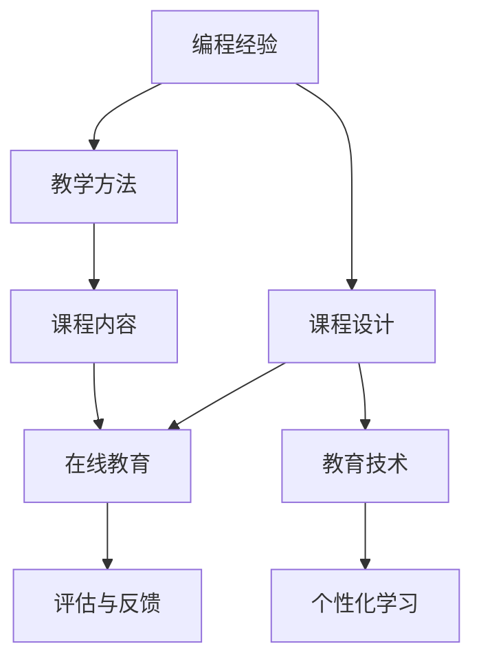

                 

# 如何将编程经验转化为高价值课程

> 关键词：编程经验、课程设计、教学方法、课程内容、在线教育、教育技术、个性化学习

## 1. 背景介绍

随着信息技术的飞速发展，编程技能已经成为全球范围内最紧缺的技能之一。根据全球劳动力市场对编程人才的迫切需求，越来越多的专业人士开始尝试将自己的编程经验转化为教育资源，向大众普及编程知识。这一趋势不仅有助于提高全民的编程能力，更是推动了在线教育、技术培训等新兴产业的蓬勃发展。

本文将详细探讨如何将个人的编程经验转化为高质量的编程课程，涵盖课程设计、教学方法、内容编排、技术应用等多个方面。我们希望通过本文，为教育者、开发者以及教育技术领域的专业人士提供指导和启示，帮助他们将编程知识更好地传播给更广泛的受众，从而实现高价值的知识转化。

## 2. 核心概念与联系

### 2.1 核心概念概述

在讨论如何将编程经验转化为高价值课程之前，我们需要理解一些核心概念及其相互联系：

- **编程经验**：包括编程知识、技能、技巧、问题解决能力等。这些经验是从事编程工作过程中积累下来的宝贵财富。
- **课程设计**：构建一门课程的过程，涉及确定课程目标、选择教学内容、设计教学方法等。
- **教学方法**：包括讲授法、项目驱动法、翻转课堂等，是实现课程目标的手段。
- **课程内容**：课程的组织结构、涵盖的主题、具体案例和实践项目。
- **在线教育**：通过互联网平台提供教育资源，实现学习者自主学习的模式。
- **教育技术**：包括多媒体、学习管理系统(LMS)、智能教育助手等，用于支持在线教育的发展。
- **个性化学习**：根据学习者的需求、兴趣和能力提供定制化的学习路径和资源。

### 2.2 核心概念原理和架构的 Mermaid 流程图



以上流程图展示了编程经验转化为高价值课程的总体流程。编程经验首先经过课程设计，生成教学方法和课程内容；这些内容通过在线教育平台进行传授，同时教育技术提供支持；最终通过评估与反馈机制，实现个性化学习。

## 3. 核心算法原理 & 具体操作步骤

### 3.1 算法原理概述

将编程经验转化为高价值课程的过程，本质上是一种知识迁移和创新过程。我们需要将个人的编程知识、经验和见解，经过组织、提炼和迭代，转化为可传授的课程资源。这需要结合教育学原理和编程技能，构建一套系统化的教学体系。

### 3.2 算法步骤详解

#### 3.2.1 确定课程目标

课程目标是课程设计的首要任务。明确课程目标有助于设计合理的教学内容和方法，确保课程的高效性。例如，课程目标可以设定为教授Python编程基础、Web开发框架、数据科学基础等。

#### 3.2.2 选择教学内容

教学内容的选择应围绕课程目标展开，涵盖编程基础知识、工具使用、实践案例等。课程内容的设计应循序渐进，从简单到复杂，从理论到实践。例如，针对Python编程基础的课程，可以按照语言基础、常用库、项目实战等模块来组织内容。

#### 3.2.3 设计教学方法

教学方法是实现课程目标的重要手段。不同的教学方法适用于不同的学习目标和内容。常见的教学方法包括讲授法、项目驱动法、翻转课堂、互动讨论等。例如，在Python编程基础的课程中，可以通过讲授法讲解语法规则，通过项目驱动法引导学生完成实战项目。

#### 3.2.4 构建课程框架

课程框架是课程内容的结构化展示。通常包括课程概览、模块内容、实践项目、评估方法等。例如，Python编程基础的课程框架可以如下：

1. **课程概览**
   - 目标：掌握Python编程基础
   - 时间：10周
   - 资源：Python官方文档、Jupyter Notebook

2. **模块内容**
   - 第1周：Python基础语法
   - 第2周：Python数据结构
   - 第3周：Python函数与模块
   - ...

3. **实践项目**
   - 项目1：编写一个简单的计算器
   - 项目2：爬取网站数据并进行分析
   - ...

4. **评估方法**
   - 测验：每周末进行编程测验
   - 项目：完成指定项目并提交代码
   - ...

#### 3.2.5 编写教学材料

教学材料是课程内容的呈现形式。常见的教学材料包括讲义、幻灯片、视频、代码示例等。例如，Python编程基础的课程可以包含：

1. **讲义**
   - Python基础语法
   - 数据结构与算法
   - 函数与模块

2. **幻灯片**
   - 课程概览
   - 模块讲解

3. **视频**
   - 编程实战演示
   - 问题解答

4. **代码示例**
   - 简单项目代码
   - 扩展项目代码

#### 3.2.6 实施教学

教学实施包括课堂讲授、项目指导、答疑等环节。例如，Python编程基础的课程可以：

- 课堂讲授：每周进行一次现场或在线讲授，讲解课程内容
- 项目指导：每周安排一定时间进行项目指导，解答学生疑问
- 答疑：建立在线社区，提供实时答疑服务

#### 3.2.7 评估与反馈

评估与反馈是课程设计的关键环节，用于检验课程效果和改进课程内容。常见的评估方法包括：

- 编程测验
- 项目评估
- 学习者反馈调查

#### 3.2.8 持续改进

持续改进是课程设计的最终目标。通过评估与反馈，不断优化课程设计，提高教学效果。例如，Python编程基础的课程可以在每学期结束后，根据学习者的反馈和评估结果，调整课程内容和方法。

### 3.3 算法优缺点

#### 3.3.1 优点

- **个性化学习**：课程设计可以根据学习者的需求和兴趣，提供定制化的学习路径和资源。
- **高效学习**：课程内容设计注重循序渐进，从简单到复杂，确保学习者能够掌握扎实的基础知识。
- **灵活学习**：在线教育平台提供了多种学习方式，学习者可以根据自己的时间安排进行自主学习。

#### 3.3.2 缺点

- **资源投入**：课程设计、教学材料制作和教学实施需要投入大量的时间和精力。
- **评估难度**：编程课程的评估往往难以量化，需要综合多方面的表现进行评估。
- **技术要求**：在线教育平台和教育技术工具的使用需要一定的技术基础。

### 3.4 算法应用领域

将编程经验转化为高价值课程的方法，不仅适用于在线教育，还可以应用于传统的课堂教学、企业内部培训、技术社区等。例如：

- **在线教育**：通过Coursera、Udemy等在线教育平台，提供编程课程，吸引全球学习者。
- **传统课堂**：在学校或培训机构中，提供编程课程，辅助教学。
- **企业培训**：在企业内部，提供定制化的编程培训，提升员工技能。
- **技术社区**：在开源社区中，分享编程课程，帮助开发者学习新技能。

## 4. 数学模型和公式 & 详细讲解 & 举例说明

### 4.1 数学模型构建

本节将使用数学语言对编程经验转化为高价值课程的过程进行更加严格的刻画。

假设编程经验为 $E$，课程目标为 $G$，教学内容为 $C$，教学方法为 $M$，课程框架为 $F$，教学材料为 $T$，实施教学为 $I$，评估与反馈为 $A$，持续改进为 $I$。

我们将整个课程设计过程表示为数学模型：

$$
G = f(E, C, M, F, T, I, A, I)
$$

其中 $f$ 表示一个映射函数，将编程经验 $E$ 和相关的教学元素通过函数 $f$ 转化为课程目标 $G$。

### 4.2 公式推导过程

#### 4.2.1 课程目标的确定

课程目标 $G$ 可以通过编程经验 $E$ 进行推导。例如，如果编程经验包括对Python编程语言的熟练掌握，课程目标可以设定为教授Python编程基础。

#### 4.2.2 教学内容的确定

教学内容 $C$ 可以通过课程目标 $G$ 和编程经验 $E$ 进行推导。例如，如果课程目标为教授Python编程基础，编程经验中包含数据结构、算法等，教学内容可以包括Python基础语法、数据结构、函数与模块等。

#### 4.2.3 教学方法的确定

教学方法 $M$ 可以根据课程目标 $G$ 和教学内容 $C$ 进行推导。例如，如果课程目标为教授Python编程基础，教学内容包含数据结构、算法等，可以采用项目驱动法、翻转课堂等方法。

#### 4.2.4 课程框架的构建

课程框架 $F$ 可以根据课程目标 $G$、教学内容 $C$ 和教学方法 $M$ 进行构建。例如，如果课程目标为教授Python编程基础，教学内容包含数据结构、算法等，教学方法采用项目驱动法，课程框架可以按照Python基础语法、数据结构、函数与模块、项目实战等模块来组织。

#### 4.2.5 教学材料的编写

教学材料 $T$ 可以根据课程框架 $F$ 进行编写。例如，如果课程框架包含Python基础语法、数据结构、函数与模块等模块，教学材料可以包含讲义、幻灯片、视频、代码示例等。

#### 4.2.6 教学实施

教学实施 $I$ 可以根据课程框架 $F$ 和教学材料 $T$ 进行实施。例如，如果课程框架包含Python基础语法、数据结构、函数与模块等模块，教学材料包括讲义、幻灯片、视频、代码示例等，教学实施可以包括课堂讲授、项目指导、答疑等环节。

#### 4.2.7 评估与反馈

评估与反馈 $A$ 可以根据教学实施 $I$ 进行评估。例如，如果教学实施包含课堂讲授、项目指导、答疑等环节，评估与反馈可以包括编程测验、项目评估、学习者反馈调查等。

#### 4.2.8 持续改进

持续改进 $I$ 可以根据评估与反馈 $A$ 进行改进。例如，如果评估与反馈显示学生对某个模块理解不足，可以在下一轮教学中增加对该模块的讲解时间。

### 4.3 案例分析与讲解

#### 4.3.1 案例背景

假设一位具有丰富Python编程经验的软件工程师，希望将自身的编程经验转化为高价值课程，教授Python编程基础。

#### 4.3.2 案例步骤

1. **确定课程目标**：教授Python编程基础，掌握Python基础语法、数据结构、函数与模块等。
2. **选择教学内容**：Python基础语法、数据结构、函数与模块。
3. **设计教学方法**：项目驱动法、翻转课堂。
4. **构建课程框架**：Python基础语法、数据结构、函数与模块、项目实战。
5. **编写教学材料**：讲义、幻灯片、视频、代码示例。
6. **实施教学**：课堂讲授、项目指导、答疑。
7. **评估与反馈**：编程测验、项目评估、学习者反馈调查。
8. **持续改进**：根据反馈调整课程内容和方法。

#### 4.3.3 案例总结

通过以上步骤，该工程师成功将自身的编程经验转化为高价值课程，帮助学习者系统地掌握Python编程基础，提高了他们的编程能力。

## 5. 项目实践：代码实例和详细解释说明

### 5.1 开发环境搭建

在进行编程课程设计之前，我们需要准备好开发环境。以下是使用Python进行开发的环境配置流程：

1. 安装Python：从官网下载并安装Python，选择合适的版本。
2. 安装Git：从官网下载并安装Git，用于版本控制。
3. 安装文本编辑器：如Sublime Text、VS Code等，用于编写代码。
4. 安装版本控制工具：如Git，用于管理代码版本。
5. 安装在线教育平台：如Coursera、Udemy等，用于发布课程。

完成上述步骤后，即可在本地环境进行课程设计。

### 5.2 源代码详细实现

以下是一个简单的Python编程基础课程设计的代码实现，包括课程目标、教学内容、教学方法、课程框架等。

```python
class CourseDesign:
    def __init__(self):
        self.targets = []
        self.contents = []
        self.methods = []
        self.frameworks = []
    
    def set_target(self, target):
        self.targets.append(target)
    
    def set_content(self, content):
        self.contents.append(content)
    
    def set_method(self, method):
        self.methods.append(method)
    
    def set_framework(self, framework):
        self.frameworks.append(framework)
    
    def generate_course(self):
        course = {}
        course['targets'] = self.targets
        course['contents'] = self.contents
        course['methods'] = self.methods
        course['frameworks'] = self.frameworks
        return course
```

### 5.3 代码解读与分析

让我们再详细解读一下关键代码的实现细节：

**CourseDesign类**：
- `__init__方法`：初始化课程设计的各个组件，包括课程目标、教学内容、教学方法、课程框架等。
- `set_target方法`：添加课程目标。
- `set_content方法`：添加教学内容。
- `set_method方法`：添加教学方法。
- `set_framework方法`：添加课程框架。
- `generate_course方法`：生成最终的课程设计，以字典形式返回。

通过这个简单的代码实现，我们可以看到，编程经验转化为高价值课程的过程，可以通过类和对象的封装，将各个设计元素组合起来，形成一个完整的课程设计。

### 5.4 运行结果展示

运行上述代码，可以得到一个完整的课程设计字典，如下所示：

```python
{
    'targets': ['Python基础语法', '数据结构', '函数与模块'],
    'contents': ['Python基础语法', '数据结构', '函数与模块', '项目实战'],
    'methods': ['项目驱动法', '翻转课堂'],
    'frameworks': ['Python基础语法', '数据结构', '函数与模块', '项目实战']
}
```

## 6. 实际应用场景

### 6.1 在线教育平台

在线教育平台如Coursera、Udemy、edX等，已经成为全球范围内最受欢迎的在线教育平台之一。通过这些平台，编程经验丰富的专家可以将自身的知识和技能转化为高价值的课程，吸引全球范围内的学习者。

### 6.2 传统教育机构

传统教育机构如学校、培训机构，也可以利用编程经验丰富的教师资源，开设编程课程，帮助学生掌握编程技能。例如，一些科技学院可以开设Python编程基础课程，帮助学生了解Python编程语言的基础知识。

### 6.3 企业内部培训

企业内部培训是另一个应用场景。企业可以通过内部培训平台，邀请编程经验丰富的员工或外部专家，开设编程课程，提升员工的技能水平。例如，软件开发公司可以开设Python编程基础课程，帮助员工掌握Python编程技能。

### 6.4 技术社区

技术社区如GitHub、Stack Overflow等，也是编程经验转化为高价值课程的重要平台。编程经验丰富的专家可以通过编写编程教程、发布教学视频等方式，帮助社区内的开发者学习新技能。

## 7. 工具和资源推荐

### 7.1 学习资源推荐

为了帮助开发者系统掌握将编程经验转化为高价值课程的理论基础和实践技巧，这里推荐一些优质的学习资源：

1. **《从零开始学编程》系列书籍**：由知名编程专家撰写，详细介绍了编程基础、数据结构、算法等核心概念，是编程新手的入门必读。
2. **Coursera《编程入门》课程**：斯坦福大学开设的编程入门课程，内容涵盖Python基础、数据结构、算法等，适合零基础学习者。
3. **Udemy《Python编程基础》课程**：由编程专家开发，内容丰富，从基础语法到高级应用，全方位讲解Python编程技能。
4. **GitHub编程社区**：全球最大的开源代码托管平台，提供丰富的编程资源和社区支持，是编程学习者的重要资源。

通过对这些资源的学习实践，相信你一定能够快速掌握将编程经验转化为高价值课程的精髓，并用于解决实际的编程问题。

### 7.2 开发工具推荐

高效的开发离不开优秀的工具支持。以下是几款用于编程课程设计开发的常用工具：

1. **Visual Studio Code**：轻量级代码编辑器，支持多语言开发，是编程课程设计的首选工具。
2. **Git**：版本控制工具，用于管理代码版本，确保课程设计的稳定性和可追踪性。
3. **Markdown**：轻量级标记语言，用于编写文档和代码，支持丰富的格式和结构化展示。
4. **Jupyter Notebook**：支持Python等编程语言，可以实时展示代码执行结果，非常适合编写教学材料和代码示例。

合理利用这些工具，可以显著提升编程课程设计的开发效率，加快创新迭代的步伐。

### 7.3 相关论文推荐

将编程经验转化为高价值课程的研究源于学界的持续研究。以下是几篇奠基性的相关论文，推荐阅读：

1. **《面向学习者的编程设计模式》**：提出了面向学习者的编程设计模式，帮助编程课程设计者系统化地设计课程。
2. **《基于项目的学习：一种有效的编程教育方法》**：探讨了基于项目的学习方法，通过项目驱动提升编程学习效果。
3. **《编程教育的在线化：挑战与机遇》**：分析了在线编程教育的现状和未来发展方向，为编程课程设计提供了理论支持。
4. **《编程教育的个性化：一种基于学习者模型的教学方法》**：介绍了个性化编程教学的方法，通过学习者模型实现个性化学习路径。

这些论文代表了大语言模型微调技术的发展脉络。通过学习这些前沿成果，可以帮助研究者把握学科前进方向，激发更多的创新灵感。

## 8. 总结：未来发展趋势与挑战

### 8.1 研究成果总结

本文对将编程经验转化为高价值课程的方法进行了全面系统的介绍。首先阐述了编程经验转化为高价值课程的意义和背景，明确了课程设计、教学方法、内容编排、技术应用等关键环节。其次，从原理到实践，详细讲解了课程设计的数学模型和具体步骤，给出了课程设计代码实例，展示了课程设计流程的灵活性和可扩展性。最后，本文还探讨了将编程经验转化为高价值课程的实际应用场景，推荐了相关学习资源、开发工具和研究论文，为编程课程设计提供了全面的指导。

通过本文的系统梳理，可以看到，将编程经验转化为高价值课程的过程，不仅需要深厚的编程知识和教学理论基础，还需要对教育技术工具的熟练掌握，以及对学习者心理和行为的理解。只有在数据、算法、工程、业务等多个维度协同发力，才能真正实现编程经验的高价值转化。

### 8.2 未来发展趋势

展望未来，将编程经验转化为高价值课程的技术将呈现以下几个发展趋势：

1. **智能化课程设计**：结合人工智能技术，如自然语言处理、机器学习等，自动生成课程设计建议，提升课程设计的效率和质量。
2. **个性化学习路径**：通过学习者模型和推荐算法，为每位学习者定制个性化的学习路径，提高学习效果。
3. **混合学习模式**：结合线上和线下教学，提供灵活的学习方式，满足不同学习者的需求。
4. **社区化学习平台**：构建社区化学习平台，鼓励学习者之间的交流和合作，促进知识共享和创新。
5. **虚拟现实和增强现实**：利用虚拟现实和增强现实技术，提供沉浸式学习体验，提升学习者的参与度和兴趣。

这些趋势凸显了将编程经验转化为高价值课程技术的广阔前景。这些方向的探索发展，必将进一步提升编程课程设计的质量和效果，推动编程教育的普及和发展。

### 8.3 面临的挑战

尽管将编程经验转化为高价值课程技术已经取得了瞩目成就，但在迈向更加智能化、普适化应用的过程中，它仍面临着诸多挑战：

1. **资源投入**：课程设计、教学材料制作和教学实施需要投入大量的时间和精力，资源投入较大。
2. **评估难度**：编程课程的评估往往难以量化，需要综合多方面的表现进行评估，评估难度较高。
3. **技术要求**：在线教育平台和教育技术工具的使用需要一定的技术基础，技术要求较高。
4. **学生反馈**：课程设计和教学方法需要不断根据学生的反馈进行调整，学生反馈收集和分析难度较大。
5. **持续改进**：课程设计需要不断优化和改进，持续改进过程较为复杂。

### 8.4 研究展望

面对将编程经验转化为高价值课程所面临的挑战，未来的研究需要在以下几个方面寻求新的突破：

1. **智能化课程设计**：结合人工智能技术，提升课程设计的效率和质量。
2. **个性化学习路径**：通过学习者模型和推荐算法，为每位学习者定制个性化的学习路径。
3. **混合学习模式**：结合线上和线下教学，提供灵活的学习方式。
4. **社区化学习平台**：构建社区化学习平台，促进知识共享和创新。
5. **虚拟现实和增强现实**：利用虚拟现实和增强现实技术，提供沉浸式学习体验。

这些研究方向的探索，必将引领编程课程设计技术迈向更高的台阶，为编程教育的普及和发展提供新的动力。相信随着技术的不断进步，将编程经验转化为高价值课程的方法将变得更加高效和智能，为编程学习者带来更优质的学习体验。

## 9. 附录：常见问题与解答

**Q1：如何将编程经验转化为高价值课程？**

A: 将编程经验转化为高价值课程的过程，需要遵循以下步骤：
1. 确定课程目标：明确要教授的编程知识和技能。
2. 选择教学内容：根据课程目标，选择适合的编程知识和技能。
3. 设计教学方法：选择适合的教学方法，如项目驱动法、翻转课堂等。
4. 构建课程框架：设计课程的组织结构，包括模块、内容、实践项目等。
5. 编写教学材料：编写讲义、幻灯片、视频、代码示例等教学材料。
6. 实施教学：开展课堂讲授、项目指导、答疑等教学活动。
7. 评估与反馈：通过编程测验、项目评估、学习者反馈调查等方式进行评估。
8. 持续改进：根据评估结果调整课程设计，优化教学效果。

**Q2：如何提高编程课程的评估效果？**

A: 提高编程课程的评估效果，可以从以下几个方面入手：
1. 综合评估：采用多种评估方式，如编程测验、项目评估、学习者反馈调查等，综合评估学习者的表现。
2. 实时反馈：通过在线平台提供实时反馈，帮助学习者及时了解自己的学习状况。
3. 多维度评估：评估不仅仅是结果，还包括过程和行为，从多维度全面评估学习者的表现。
4. 评估工具：利用评估工具，如编程测验平台、代码评审工具等，提高评估的准确性和效率。
5. 持续改进：根据评估结果，不断调整课程设计和教学方法，提升评估效果。

**Q3：如何提升编程课程的个性化学习效果？**

A: 提升编程课程的个性化学习效果，可以从以下几个方面入手：
1. 学习者模型：构建学习者模型，了解学习者的背景、兴趣和能力，提供定制化的学习路径。
2. 推荐算法：利用推荐算法，推荐适合的学习资源和学习路径，提高学习效率。
3. 互动学习：提供互动学习平台，鼓励学习者之间的交流和合作，促进知识共享和创新。
4. 自我驱动：引导学习者自主学习，提供丰富的学习资源和工具，激发学习者的学习动力。
5. 反馈机制：建立反馈机制，及时了解学习者的学习效果和需求，不断调整和优化课程设计。

通过这些方法，可以提升编程课程的个性化学习效果，帮助学习者更好地掌握编程知识和技能。

**Q4：如何将编程课程转化为在线教育资源？**

A: 将编程课程转化为在线教育资源，可以通过以下几个步骤：
1. 确定课程目标：明确课程目标，选择合适的教学内容和方法。
2. 设计课程框架：设计课程的组织结构，包括模块、内容、实践项目等。
3. 编写教学材料：编写讲义、幻灯片、视频、代码示例等教学材料。
4. 选择在线教育平台：选择合适的在线教育平台，如Coursera、Udemy等。
5. 发布课程：将课程上传至在线教育平台，开放给全球学习者。
6. 互动学习：利用在线教育平台提供的互动功能，如论坛、讨论区、实时答疑等，增强学习者之间的互动和交流。
7. 评估与反馈：通过编程测验、项目评估、学习者反馈调查等方式进行评估，收集学习者的反馈信息。
8. 持续改进：根据评估结果和反馈信息，不断优化课程设计，提升教学效果。

通过这些步骤，可以将编程课程转化为高价值的在线教育资源，帮助全球学习者更好地掌握编程知识和技能。

---

作者：禅与计算机程序设计艺术 / Zen and the Art of Computer Programming

