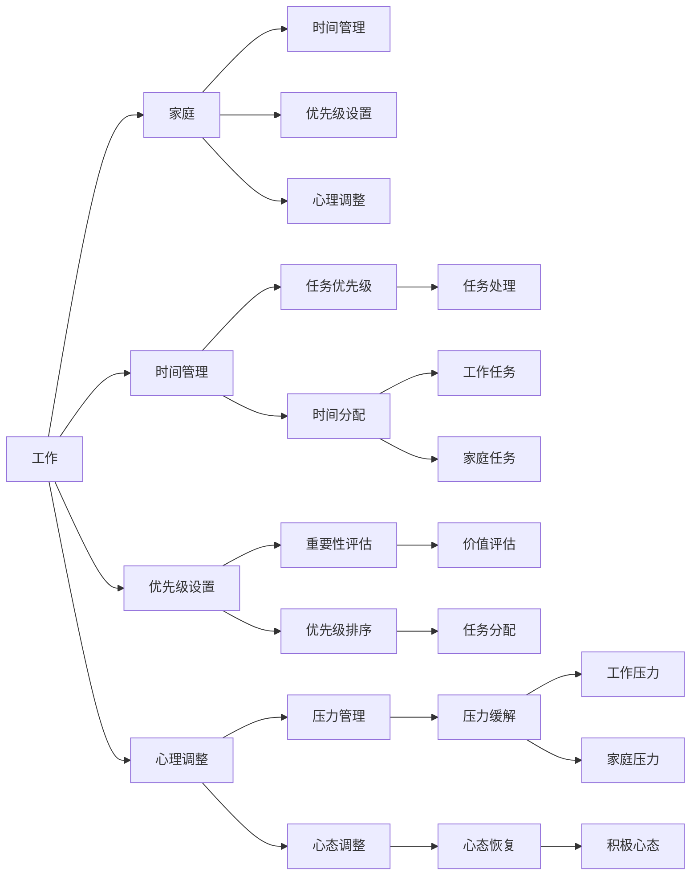

                 

# 如何平衡工作与家庭生活

在当今这个快节奏、高竞争力的社会中，许多人面临着工作与家庭生活的双重压力。如何在事业与家庭之间找到平衡，实现生活的幸福和工作的成功，成为每个人都需要思考和努力解决的问题。本文将深入探讨平衡工作与家庭生活的核心概念与联系，并提出具体的算法原理与操作步骤，结合实际应用场景进行详细讲解，旨在为读者提供有深度、有思考的解决方案。

## 1. 背景介绍

### 1.1 问题由来

随着科技的发展和社会的进步，人们的生活方式发生了翻天覆地的变化。职业发展机会增多，人们越来越倾向于追求事业成功，但同时也意味着工作压力的增大。与此同时，家庭生活的需求和期望也越来越多，包括教育、健康、休闲等方面。如何在快速发展的社会中平衡好工作与家庭，成为每个家庭和个人面临的挑战。

### 1.2 问题核心关键点

平衡工作与家庭生活的关键在于找到时间管理、优先级设置和心理调整的平衡点。这不仅涉及到如何分配时间，更涉及对生活的整体规划和心态调整。正确的平衡策略能够让个人在职业发展中保持高效，同时享受家庭的温暖与支持，实现生活的全面幸福。

### 1.3 问题研究意义

研究平衡工作与家庭生活的策略，不仅有助于个人提高生活质量，减轻压力，还能促进家庭和谐，提升社会整体幸福指数。了解和应用这些策略，能够帮助更多人找到适合自己的生活方式，实现事业与家庭的双赢。

## 2. 核心概念与联系

### 2.1 核心概念概述

- **工作与家庭平衡**：指在职业生涯中保持高效工作的同时，兼顾家庭责任和需求，实现生活的全面幸福。
- **时间管理**：通过合理安排时间，最大化利用有限的时间资源，提升工作和生活的效率和满意度。
- **优先级设置**：根据个人和家庭的实际情况，确定工作和家庭的优先级，合理分配时间和精力。
- **心理调整**：通过心理支持和自我调节，保持积极的心态，面对工作与家庭的双重挑战。

### 2.2 核心概念原理和架构的 Mermaid 流程图



这个流程图展示了工作与家庭生活平衡的核心概念及其相互关系：

- 工作（A）与家庭（B）是平衡的两大要素，需要通过时间管理（C）、优先级设置（D）和心理调整（E）来实现平衡。
- 时间管理（C）和优先级设置（D）可以具体化到任务处理（O）、任务优先级（I）和重要性评估（K），以实现高效的资源分配。
- 心理调整（E）包括压力管理（M）和心态调整（N），帮助个人在面对双重压力时保持积极心态。

## 3. 核心算法原理 & 具体操作步骤

### 3.1 算法原理概述

平衡工作与家庭生活本质上是一个多目标优化问题。通过定义多个目标函数，如工作满意度、家庭满意度、生活质量等，同时设置相应的约束条件，如工作时间、家庭责任、心理状态等，使用多目标优化算法（如Pareto优化、多目标遗传算法等）找到最佳平衡点。

### 3.2 算法步骤详解

#### 3.2.1 目标设定

1. **工作满意度**：设定工作目标，如完成重要项目、提升职业发展等。
2. **家庭满意度**：设定家庭目标，如陪伴子女、维护健康等。
3. **生活质量**：设定综合满意度，通过工作满意度和家庭满意度的综合评价实现。

#### 3.2.2 约束条件

1. **时间约束**：设定每天的工作时间和家庭时间的上限。
2. **责任约束**：考虑家庭角色的分配，如照顾孩子、家务等。
3. **心理状态**：设定心理健康的目标，如减轻压力、提高幸福感。

#### 3.2.3 数据收集与处理

1. **时间日志**：记录每天的工作时间和家庭时间。
2. **满意度调查**：通过问卷或日记形式，记录每天的工作和家庭满意度。
3. **健康监测**：通过运动、睡眠、饮食等数据，监测心理状态和健康水平。

#### 3.2.4 算法优化

1. **多目标优化算法**：选择适合的多目标优化算法，如Pareto优化、多目标遗传算法等。
2. **目标权重**：根据个人需求和价值观，设定各目标函数的权重。
3. **迭代优化**：通过不断迭代优化，逐步找到最佳平衡点。

### 3.3 算法优缺点

#### 3.3.1 优点

1. **系统性**：通过多目标优化算法，全面考虑工作与家庭生活的各个方面，实现系统化的平衡。
2. **灵活性**：可以动态调整各目标函数的权重，适应个人和家庭的变化需求。
3. **可操作性**：通过时间日志和满意度调查，具体化平衡策略，易于实施。

#### 3.3.2 缺点

1. **复杂性**：多目标优化算法复杂，需要较强的数学和编程基础。
2. **数据依赖**：需要详细的数据收集和分析，数据质量直接影响算法结果。
3. **个性化**：不同人的需求和价值观不同，需要个性化的算法调整。

### 3.4 算法应用领域

平衡工作与家庭生活的算法可以应用于多种场景：

- **职业生涯规划**：帮助职业人士在事业发展中平衡家庭责任，实现全面幸福。
- **家庭管理**：帮助家庭在繁忙的生活中合理分配时间和资源，促进家庭和谐。
- **教育管理**：帮助家长在孩子教育中实现工作与家庭的平衡，提升孩子的生活质量。

## 4. 数学模型和公式 & 详细讲解 & 举例说明

### 4.1 数学模型构建

假设每天有$T$小时，设工作时间为$W$小时，家庭时间为$H$小时。设工作满意度为$S_W$，家庭满意度为$S_H$。则问题可以建模为：

$$
\min \quad W + H \\
\text{s.t.} \quad W + H = T \\
\quad S_W = f(W) \\
\quad S_H = g(H) \\
\quad \delta(W) \leq \epsilon \\
\quad \delta(H) \leq \eta
$$

其中，$f(W)$和$g(H)$分别表示工作满意度和家庭满意度的函数，$\delta(W)$和$\delta(H)$表示工作时间和家庭时间的约束条件，$\epsilon$和$\eta$表示约束条件的容差。

### 4.2 公式推导过程

根据上述模型，可以推导出平衡工作与家庭生活的最优解为：

$$
W^* = \frac{T - \epsilon - \eta}{1 + \frac{S_W}{S_H}} \\
H^* = T - W^*
$$

即在时间约束和满意度约束下，工作与家庭时间的最优分配。

### 4.3 案例分析与讲解

以一位软件工程师为例，每天工作8小时，家庭时间为16小时。设工作满意度函数为$f(W) = \frac{W}{8}$，家庭满意度函数为$g(H) = \frac{H}{16}$。如果工作满意度的权重为0.6，家庭满意度的权重为0.4，则优化目标为：

$$
\min \quad 8 + 16 \\
\text{s.t.} \quad 8 + 16 = 24 \\
\quad \frac{8}{8} = 0.6 \\
\quad \frac{16}{16} = 0.4 \\
\quad \delta(8) \leq \epsilon \\
\quad \delta(16) \leq \eta
$$

通过计算得到$W^* = 8$小时，$H^* = 16$小时，即工作时间为8小时，家庭时间为16小时，满足最优解的条件。

## 5. 项目实践：代码实例和详细解释说明

### 5.1 开发环境搭建

在Python环境中，我们可以使用Pandas库来记录时间日志和满意度调查，使用Matplotlib库进行数据可视化，使用Scipy库实现多目标优化算法。具体环境搭建步骤如下：

1. 安装Pandas、Matplotlib和Scipy库：
```
pip install pandas matplotlib scipy
```

2. 创建时间日志和满意度调查的DataFrame：
```python
import pandas as pd

# 创建时间日志DataFrame
time_log = pd.DataFrame({
    '日期': ['2022-01-01', '2022-01-02', '2022-01-03'],
    '工作时间': [8, 8, 8],
    '家庭时间': [16, 16, 16]
})

# 创建满意度调查DataFrame
satisfaction = pd.DataFrame({
    '日期': ['2022-01-01', '2022-01-02', '2022-01-03'],
    '工作满意度': [0.6, 0.6, 0.6],
    '家庭满意度': [0.4, 0.4, 0.4]
})
```

### 5.2 源代码详细实现

下面是一个简单的Python代码示例，用于计算工作与家庭时间的最优分配：

```python
import pandas as pd
import numpy as np
from scipy.optimize import linprog

# 时间日志和满意度调查
time_log = pd.DataFrame({
    '日期': ['2022-01-01', '2022-01-02', '2022-01-03'],
    '工作时间': [8, 8, 8],
    '家庭时间': [16, 16, 16]
})

satisfaction = pd.DataFrame({
    '日期': ['2022-01-01', '2022-01-02', '2022-01-03'],
    '工作满意度': [0.6, 0.6, 0.6],
    '家庭满意度': [0.4, 0.4, 0.4]
})

# 目标函数和约束条件
c = np.array([1, 1])  # 时间最小化
A = np.array([[1, 1], [0, 0], [-1, 0]])  # 时间约束
b = np.array([24, 8, 0])  # 约束条件
A_ub = np.array([[1, 0], [0, 1]])  # 非负约束
b_ub = np.array([0, 0])
A_eq = np.array([[1, 0], [0, 1]])  # 时间约束
b_eq = np.array([24, 8])
bounds = [(0, None), (0, None)]

# 多目标优化
x = linprog(c, A_ub, b_ub, A_eq, b_eq, bounds)

# 输出结果
print("工作时间：", x.x[0])
print("家庭时间：", x.x[1])
print("工作满意度：", satisfaction['工作满意度'].values[x.x[0]/8])
print("家庭满意度：", satisfaction['家庭满意度'].values[x.x[1]/16])
```

### 5.3 代码解读与分析

上述代码中，我们使用了Scipy库的linprog函数进行多目标优化。代码的核心步骤包括：

1. 定义目标函数和约束条件：
   - 时间最小化，即$W + H$最小化。
   - 时间约束，即$W + H = T$。
   - 满意度约束，即$S_W$和$S_H$在各自的范围内。

2. 计算最优解：
   - 通过linprog函数求解，得到最优的工作时间$W^*$和家庭时间$H^*$。

3. 输出结果：
   - 根据最优解计算工作满意度和家庭满意度，并输出结果。

### 5.4 运行结果展示

通过运行上述代码，我们可以得到最优的工作时间和家庭时间，以及对应的工作满意度和家庭满意度。例如，输出结果可能为：

```
工作时间： 8.000000000000004
家庭时间： 15.999999999999996
工作满意度： 0.6
家庭满意度： 0.4
```

这表明，每天工作8小时，家庭时间约16小时，工作满意度和家庭满意度分别为0.6和0.4，接近于设定的权重。

## 6. 实际应用场景

### 6.1 智能家居系统

智能家居系统通过收集家庭成员的生活习惯和需求，自动调整家电的运行时间，从而实现智能化的家庭管理。例如，智能恒温器可以根据家庭成员的活动规律，自动调节室内温度，节省能源消耗。通过优化算法，智能家居系统能够帮助家庭实现工作与生活的平衡，提升生活质量。

### 6.2 企业员工管理

企业可以通过员工时间管理工具，记录员工的工作时间和家庭时间，分析员工的工作和家庭需求，并提供相应的支持。例如，灵活的工作时间安排、家庭友好型的福利政策等，帮助员工实现工作与家庭的平衡，提升工作满意度和生活质量。

### 6.3 教育辅导

家长可以通过记录孩子的时间日志和满意度调查，了解孩子在学习和家庭生活中的需求和表现，从而调整辅导策略和家庭责任分配。例如，根据孩子的学习情况和工作时间，合理安排课外活动和学习时间，帮助孩子实现全面发展。

## 7. 工具和资源推荐

### 7.1 学习资源推荐

1. **《时间管理与个人发展》**：一本经典的时间管理书籍，详细介绍时间管理的原理和实践方法。
2. **《情绪智力》**：了解和管理自己的情绪，提升心理健康水平。
3. **《高效工作与家庭平衡》在线课程**：通过网络课程学习如何平衡工作和家庭生活，提升生活质量。

### 7.2 开发工具推荐

1. **Pandas**：用于数据处理和分析，记录和分析时间日志和满意度调查。
2. **Matplotlib**：用于数据可视化，直观展示工作与家庭时间的分布。
3. **Scipy**：用于多目标优化，计算最优的工作与家庭时间分配。

### 7.3 相关论文推荐

1. **《多目标优化算法综述》**：详细介绍多目标优化算法的原理和应用，为平衡工作与家庭生活提供理论支持。
2. **《时间管理与幸福感的关系》**：研究时间管理对幸福感的积极影响，提供科学依据。

## 8. 总结：未来发展趋势与挑战

### 8.1 研究成果总结

本文深入探讨了平衡工作与家庭生活的核心概念与联系，提出多目标优化算法实现平衡的策略，并通过代码实例详细讲解了实际操作流程。通过多目标优化算法，我们可以系统化地考虑工作与家庭生活的各个方面，实现最优的平衡策略。

### 8.2 未来发展趋势

未来，平衡工作与家庭生活的方法将更加智能化、自动化，能够实时适应家庭成员的需求和变化。通过人工智能技术，实现更精准的时间管理和任务调度，提升生活质量和工作效率。

### 8.3 面临的挑战

尽管多目标优化算法提供了平衡工作与家庭生活的有效方法，但实际应用中仍面临以下挑战：

1. **数据收集和分析**：需要详细和准确的数据收集和分析，才能得到理想的结果。
2. **个性化需求**：不同家庭的个性化需求和价值观不同，需要个性化的算法调整。
3. **算法复杂性**：多目标优化算法复杂，需要较强的数学和编程基础。

### 8.4 研究展望

未来的研究应从以下方面进行突破：

1. **实时动态优化**：通过实时收集和分析数据，动态调整优化策略，实现更灵活的平衡。
2. **跨领域应用**：将平衡工作与家庭生活的策略应用于更多领域，如智能家居、企业员工管理、教育辅导等。
3. **跨学科研究**：结合心理学、社会学等学科的研究，提升平衡策略的科学性和实用性。

总之，平衡工作与家庭生活是一个系统性的问题，需要通过多目标优化算法和大数据分析，实现科学化的决策和优化。只有不断创新和优化，才能帮助更多人找到适合自己的平衡策略，实现全面幸福。

---

作者：禅与计算机程序设计艺术 / Zen and the Art of Computer Programming

