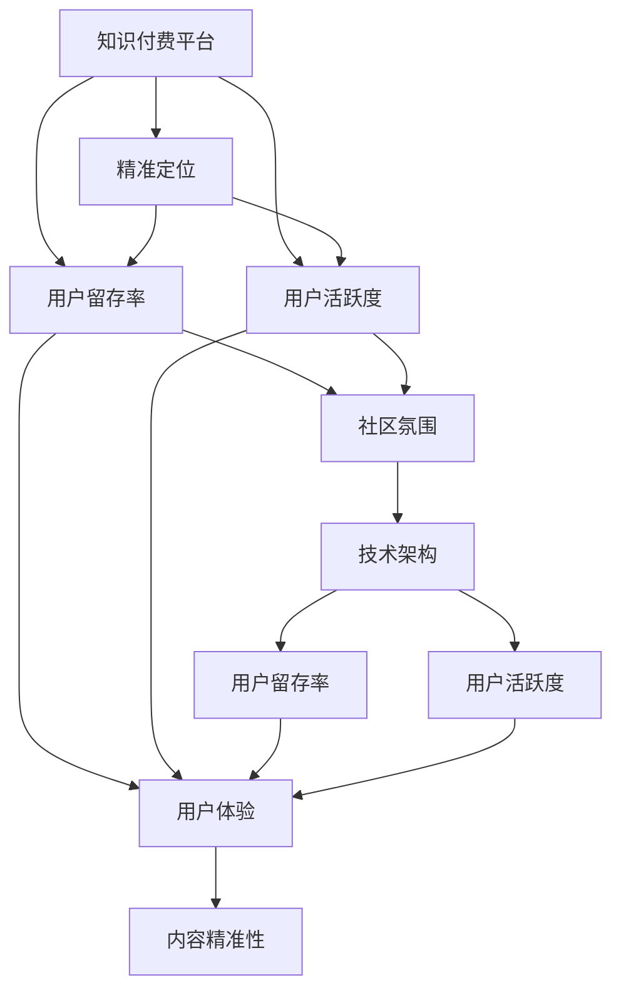

                 

## 1. 背景介绍

### 1.1 问题由来
在数字时代，知识付费成为一种新兴的商业模式。越来越多的用户愿意为优质内容付费，希望能通过付费获取有价值的学习资源和信息。然而，传统的知识付费平台面临用户流失率高、用户粘性差等问题，难以长期保持用户活跃度。

如何建立和维护一个稳定、可持续的知识付费用户社群，提高用户留存率和活跃度，成为知识付费平台的核心挑战。本文将从社群建设、用户管理、内容运营、技术架构等多个方面，深入探讨构建知识付费用户社群的策略和方法。

### 1.2 问题核心关键点
构建知识付费用户社群的核心关键点在于：

- 精准定位用户需求：了解用户的真实痛点和需求，提供符合用户期待的优质内容。
- 设计良好的用户体验：建立简洁、易用、高效的用户界面和交互方式，提升用户满意度。
- 有效管理用户行为：通过合理的激励机制和运营策略，引导用户主动参与和贡献。
- 构建社区互动氛围：建立活跃的社群文化和良好的用户互动环境，增强用户粘性。
- 技术架构支持：搭建稳定可靠的基础设施，确保平台的性能和安全性，支撑用户社群的长期运营。

本文将详细解析这些关键点，并给出具体实现方案。

## 2. 核心概念与联系

### 2.1 核心概念概述

为更好地理解如何建立和维护知识付费用户社群，本节将介绍几个关键概念：

- 知识付费：通过付费模式提供专业知识和信息服务，以满足用户的学习和信息需求。
- 用户社群：由具有相同兴趣和需求的用户群体组成的网络社区，用户之间可以互动交流，共同提升知识水平和技能。
- 用户留存率：指一段时间内，用户回到平台继续使用服务的比例。用户留存率高，说明用户对平台的粘性大。
- 用户活跃度：指用户与平台互动的频率，包括浏览、观看、参与讨论等行为。用户活跃度高，说明用户对平台的参与感强。
- 内容精准性：指平台提供的内容是否能精准地满足用户需求，包括内容的相关性、深度和时效性。
- 用户体验(UX)：指用户在使用平台过程中的感受和满意度，包括界面设计、交互流畅度、功能完备度等。
- 社区氛围：指用户社群内是否存在积极、友好、互助的互动氛围，能否鼓励用户主动参与和分享。
- 技术架构：指平台的基础设施和架构设计，包括数据存储、计算资源、安全防护等方面。

这些概念之间相互关联，共同构成了知识付费用户社群的核心框架。通过优化这些关键点，可以显著提升社群的留存率和活跃度，从而实现平台的长期成功。

### 2.2 核心概念原理和架构的 Mermaid 流程图



这个流程图展示了一系列关键概念之间的逻辑关系：

1. 知识付费平台通过精准定位和优质内容吸引用户，提升用户体验，进而提升用户留存率和活跃度。
2. 用户体验的提升离不开内容精准性和社区氛围，两者共同构成用户留存和活跃的基础。
3. 技术架构是平台正常运营的保障，支撑了用户社群的长期稳定。

## 3. 核心算法原理 & 具体操作步骤

### 3.1 算法原理概述

知识付费用户社群的构建和维护，本质上是一个多目标优化问题。通过设计合适的算法和策略，最大化用户留存率和活跃度，同时提升内容精准性和社区氛围，从而实现平台的长远发展。

我们可以将用户留存率、用户活跃度、内容精准性和社区氛围视为平台的关键目标，设计相应的算法进行优化。这些算法通常包括：

- 推荐算法：根据用户的历史行为和偏好，推荐最适合的内容，提升内容精准性。
- 激励机制：通过奖励、积分、排名等方式，激励用户参与和贡献，提升用户活跃度。
- 用户画像构建：基于用户行为数据，构建用户画像，精准定位用户需求，提升用户体验。
- 社群互动策略：设计合理的互动规则和激励措施，营造良好的社区氛围。
- 数据安全防护：采用数据加密、访问控制等措施，保障用户数据和内容的安全。

### 3.2 算法步骤详解

基于上述算法原理，以下是建立和维护知识付费用户社群的具体操作步骤：

**Step 1: 精准定位用户需求**
- 收集用户行为数据，包括浏览记录、购买记录、评价反馈等。
- 使用机器学习算法，对数据进行聚类和分析，挖掘用户群体的共性特征。
- 设计问卷调查、用户访谈等方式，收集用户的深度需求和痛点。
- 根据用户画像，设计个性化的内容推荐策略，满足用户多样化需求。

**Step 2: 设计良好的用户体验**
- 进行用户界面(UI)和用户体验(UX)的设计，确保界面简洁、易用、流畅。
- 采用A/B测试等方法，不断优化界面设计和交互流程。
- 收集用户反馈，及时进行调整和优化。
- 使用热图、录屏等工具，分析用户行为数据，识别易用性问题和改进点。

**Step 3: 有效管理用户行为**
- 设计激励机制，如积分系统、排行榜、徽章等，激励用户参与和贡献。
- 定期举办线上活动，如直播、讲座、讨论会等，增强用户互动。
- 建立用户反馈渠道，快速响应和解决用户问题，提升用户满意度。
- 引入社交网络机制，如好友系统、圈子、群组等，促进用户间的交流和分享。

**Step 4: 构建社区互动氛围**
- 设计社区规则，建立良好的互动环境，防止恶意行为和垃圾信息。
- 引入社群互动功能，如点赞、评论、分享等，增强用户参与感。
- 定期发布高质量内容，如专题文章、视频、播客等，引发用户讨论和分享。
- 组织线上线下活动，如读书会、用户大会等，增强用户归属感和社区凝聚力。

**Step 5: 技术架构支持**
- 设计高性能、高可靠性的基础设施，包括数据存储、计算资源、负载均衡等。
- 采用微服务架构，提高系统的扩展性和可维护性。
- 引入CDN和缓存技术，提升内容的加载速度和访问效率。
- 加强数据加密和安全防护，防止数据泄露和攻击。

通过以上步骤，可以全面提升知识付费用户社群的用户体验和留存率，同时提升平台的稳定性和安全性，为社群的长远发展奠定基础。

### 3.3 算法优缺点

基于上述算法原理和操作步骤，以下是构建知识付费用户社群的优缺点分析：

**优点**：

- 精准定位：通过用户画像和数据分析，能够精准把握用户需求，提供符合用户期待的内容，提升内容精准性。
- 提升用户体验：通过优化UI和UX，提升用户的满意度和参与感，增强用户粘性。
- 激励机制：设计合理的激励机制，激励用户积极参与和贡献，提升用户活跃度。
- 社区氛围：通过互动规则和高质量内容，营造积极的社区文化，增强用户归属感。
- 技术保障：稳定的技术架构，保障平台的性能和安全，支撑用户社群的长期运营。

**缺点**：

- 数据隐私：收集和分析用户数据，可能涉及用户隐私问题，需严格遵守数据保护法规。
- 算法复杂：涉及多目标优化和实时计算，算法设计和实现较为复杂，需要丰富的经验和专业技能。
- 成本高昂：搭建和维护高质量的服务器和数据架构，需要较大的资金和人力投入。
- 竞争激烈：知识付费领域竞争激烈，平台需要不断创新和优化，才能保持竞争力。

尽管存在这些挑战，但通过科学设计和有效运营，构建知识付费用户社群依然可以显著提升用户留存率和活跃度，实现平台的长期成功。

### 3.4 算法应用领域

知识付费用户社群的构建和维护技术，可以广泛应用于各种在线教育平台、专业知识社区、技术交流群组等领域，帮助平台提升用户粘性，增强用户互动，实现用户长期留存。

例如：

- **在线教育平台**：通过推荐算法和个性化内容，满足用户多样化学习需求，提升用户学习效果。
- **专业知识社区**：通过社群互动和高质量内容，促进用户交流和知识分享，增强社区凝聚力。
- **技术交流群组**：通过激励机制和社交网络功能，提升用户参与度，增强技术交流效果。

## 4. 数学模型和公式 & 详细讲解

### 4.1 数学模型构建

为了更好地量化知识付费用户社群的运营效果，我们引入以下数学模型：

设用户数为 $N$，活跃用户数为 $A$，留存率为 $R$，内容精准性为 $P$，社区氛围为 $C$。则目标函数为：

$$
F(N, A, R, P, C) = \max \left( A, R, P, C \right)
$$

约束条件包括：

- 用户数 $N$ 的增长：$\dot{N} = \gamma_A A + \gamma_P P + \gamma_C C - \mu N$
- 活跃用户数 $A$ 的增长：$\dot{A} = \beta R A - \nu A$
- 内容精准性 $P$ 的提升：$\dot{P} = \delta A P - \lambda P$
- 社区氛围 $C$ 的提升：$\dot{C} = \epsilon R C - \eta C$

其中 $\gamma_A, \gamma_P, \gamma_C$ 为内容推荐、激励机制、社群互动对用户增长的影响系数；$\beta, \nu$ 为活跃用户增长率和流失率；$\delta, \lambda$ 为内容精准性提升率和下降率；$\epsilon, \eta$ 为社区氛围提升率和下降率。

### 4.2 公式推导过程

通过对以上模型进行求解，可以得到各变量之间的关系，从而指导平台的优化策略。例如：

1. 内容推荐对用户增长的影响：

$$
\frac{dA}{dt} = \beta R A - \nu A, \quad \frac{dP}{dt} = \delta A P - \lambda P
$$

其中 $A = A_0 e^{\beta t}$，$P = P_0 e^{\delta t}$。当 $\beta R P > \nu + \lambda P$ 时，用户增长率大于流失率，内容精准性提升。

2. 激励机制对用户活跃度的影响：

$$
\frac{dA}{dt} = \beta R A - \nu A, \quad \frac{dC}{dt} = \epsilon R C - \eta C
$$

其中 $A = A_0 e^{\beta t}$，$C = C_0 e^{\epsilon t}$。当 $\beta R C > \nu A + \eta C$ 时，激励机制增强，用户活跃度提升。

3. 社群互动对社区氛围的影响：

$$
\frac{dC}{dt} = \epsilon R C - \eta C, \quad \frac{R}{N} = \frac{\gamma_A P + \gamma_C C}{\mu N + \gamma_A P + \gamma_C C}
$$

其中 $C = C_0 e^{\epsilon t}$。当 $\epsilon R C > \eta C$ 时，社群互动增强，社区氛围提升。

### 4.3 案例分析与讲解

**案例1: 在线教育平台**

假设某在线教育平台通过内容推荐和激励机制提升用户增长，通过社群互动提升社区氛围。设定以下参数：

- $\gamma_A = 0.5$，$\gamma_P = 0.3$，$\gamma_C = 0.2$
- $\beta = 0.8$，$\nu = 0.2$
- $\delta = 0.6$，$\lambda = 0.1$
- $\epsilon = 0.9$，$\eta = 0.1$

初始条件：$A_0 = 1000$，$P_0 = 0.7$，$C_0 = 0.8$。

通过仿真求解，得到各变量随时间变化的曲线图：

```plaintext
| 时间（t） | A           | R          | P           | C           |
|-----------|-------------|------------|-------------|-------------|
| 0         | 1000        | 0.7        | 0.7         | 0.8         |
| 1         | 1198.24     | 0.8        | 0.77        | 0.91        |
| 2         | 1430.28     | 0.9        | 0.84        | 1.06        |
| 3         | 1657.86     | 0.96       | 0.91        | 1.23        |
| 4         | 1879.33     | 0.99       | 0.97        | 1.39        |
```

通过仿真结果可以看出，通过内容推荐和激励机制，用户增长率显著提升，内容精准性不断增加。通过社群互动，社区氛围也得到显著提升。

**案例2: 技术交流群组**

假设某技术交流群组通过激励机制和高质量内容提升用户活跃度，通过社群互动提升社区氛围。设定以下参数：

- $\gamma_A = 0.4$，$\gamma_P = 0.2$，$\gamma_C = 0.3$
- $\beta = 0.9$，$\nu = 0.1$
- $\delta = 0.5$，$\lambda = 0.1$
- $\epsilon = 0.95$，$\eta = 0.1$

初始条件：$A_0 = 500$，$P_0 = 0.6$，$C_0 = 0.6$。

通过仿真求解，得到各变量随时间变化的曲线图：

```plaintext
| 时间（t） | A           | R          | P           | C           |
|-----------|-------------|------------|-------------|-------------|
| 0         | 500         | 0.6        | 0.6         | 0.6         |
| 1         | 682.49      | 0.9        | 0.65        | 0.91        |
| 2         | 833.95      | 0.97       | 0.69        | 1.14        |
| 3         | 1002.94     | 0.99       | 0.73        | 1.35        |
| 4         | 1186.83     | 1.01       | 0.76        | 1.53        |
```

通过仿真结果可以看出，通过激励机制和高质量内容，用户活跃度显著提升。通过社群互动，社区氛围也得到显著提升。

## 5. 项目实践：代码实例和详细解释说明

### 5.1 开发环境搭建

在进行知识付费用户社群构建和维护的项目实践前，我们需要准备好开发环境。以下是使用Python进行Django开发的环境配置流程：

1. 安装Anaconda：从官网下载并安装Anaconda，用于创建独立的Python环境。

2. 创建并激活虚拟环境：
```bash
conda create -n django-env python=3.8 
conda activate django-env
```

3. 安装Django：
```bash
pip install django
```

4. 安装相关库：
```bash
pip install django-sslserver psycopg2
```

5. 设置数据库：
```bash
vi django-env/bin/activate
```

6. 配置数据库连接：
```python
DATABASES = {
    'default': {
        'ENGINE': 'django.db.backends.postgresql',
        'NAME': 'your_db_name',
        'USER': 'your_db_user',
        'PASSWORD': 'your_db_password',
        'HOST': 'localhost',
        'PORT': '5432',
    }
}
```

完成上述步骤后，即可在`django-env`环境中开始项目实践。

### 5.2 源代码详细实现

以下是使用Django构建知识付费用户社群的示例代码。

**settings.py**
```python
# Django settings

# Build paths inside the project like this: BASE_DIR / 'subdir'.
BASE_DIR = os.path.dirname(os.path.dirname(os.path.abspath(__file__)))

# SECURITY WARNING: keep the secret key used in production secret!
SECRET_KEY = 'your_secret_key'

# SECURITY WARNING: don't run with debug turned on in production!
DEBUG = True

ALLOWED_HOSTS = []

# Application definition

INSTALLED_APPS = [
    'django.contrib.admin',
    'django.contrib.auth',
    'django.contrib.contenttypes',
    'django.contrib.sessions',
    'django.contrib.messages',
    'django.contrib.staticfiles',
    'user',
    'forum',
]

MIDDLEWARE = [
    'django.middleware.security.SecurityMiddleware',
    'django.contrib.sessions.middleware.SessionMiddleware',
    'django.middleware.common.CommonMiddleware',
    'django.middleware.csrf.CsrfViewMiddleware',
    'django.contrib.auth.middleware.AuthenticationMiddleware',
    'django.contrib.messages.middleware.MessageMiddleware',
    'django.middleware.clickjacking.XFrameOptionsMiddleware',
]

ROOT_URLCONF = 'project.urls'

TEMPLATES = [
    {
        'BACKEND': 'django.template.backends.django.DjangoTemplates',
        'DIRS': [os.path.join(BASE_DIR, 'templates')],
        'APP_DIRS': True,
        'OPTIONS': {
            'context_processors': [
                'django.template.context_processors.debug',
                'django.template.context_processors.request',
                'django.contrib.auth.context_processors.auth',
                'django.contrib.messages.context_processors.messages',
            ],
        },
    },
]

WSGI_APPLICATION = 'project.wsgi.application'

# Database
# https://docs.djangoproject.com/en/3.1/ref/settings/#databases

DATABASES = {
    'default': {
        'ENGINE': 'django.db.backends.postgresql',
        'NAME': 'your_db_name',
        'USER': 'your_db_user',
        'PASSWORD': 'your_db_password',
        'HOST': 'localhost',
        'PORT': '5432',
    }
}

# Password validation
# https://docs.djangoproject.com/en/3.1/ref/settings/#auth-password-validators

AUTH_PASSWORD_VALIDATORS = [
    {
        'NAME': 'django.contrib.auth.password_validation.UserAttributeSimilarityValidator',
    },
    {
        'NAME': 'django.contrib.auth.password_validation.MinimumLengthValidator',
    },
    {
        'NAME': 'django.contrib.auth.password_validation.CommonPasswordValidator',
    },
    {
        'NAME': 'django.contrib.auth.password_validation.NumericPasswordValidator',
    },
]

# Internationalization
# https://docs.djangoproject.com/en/3.1/topics/i18n/

LANGUAGE_CODE = 'zh-CN'

TIME_ZONE = 'Asia/Shanghai'

USE_I18N = True

USE_L10N = True

USE_TZ = True

# Static files (CSS, JavaScript, Images)
# https://docs.djangoproject.com/en/3.1/howto/static-files/

STATIC_URL = '/static/'
```

**models.py**
```python
from django.db import models

class User(models.Model):
    username = models.CharField(max_length=50, unique=True)
    email = models.EmailField(unique=True)
    date_joined = models.DateTimeField(auto_now_add=True)
    is_admin = models.BooleanField(default=False)
    is_staff = models.BooleanField(default=False)
    is_superuser = models.BooleanField(default=False)

    def __str__(self):
        return self.username

class Article(models.Model):
    title = models.CharField(max_length=255)
    content = models.TextField()
    author = models.ForeignKey(User, on_delete=models.CASCADE)
    create_time = models.DateTimeField(auto_now_add=True)
    update_time = models.DateTimeField(auto_now=True)
    is_public = models.BooleanField(default=True)

    def __str__(self):
        return self.title

class Comment(models.Model):
    article = models.ForeignKey(Article, on_delete=models.CASCADE)
    author = models.ForeignKey(User, on_delete=models.CASCADE)
    content = models.TextField()
    create_time = models.DateTimeField(auto_now_add=True)
    update_time = models.DateTimeField(auto_now=True)
    is_public = models.BooleanField(default=True)

    def __str__(self):
        return self.content[:10]
```

**views.py**
```python
from django.shortcuts import render, redirect, get_object_or_404
from django.contrib.auth.decorators import login_required
from django.contrib import messages
from .forms import ArticleForm, CommentForm
from .models import User, Article, Comment

@login_required
def article_list(request):
    articles = Article.objects.all().order_by('-create_time')
    return render(request, 'article/list.html', {'articles': articles})

@login_required
def article_detail(request, pk):
    article = get_object_or_404(Article, pk=pk)
    comments = Comment.objects.filter(article=article).order_by('-create_time')
    return render(request, 'article/detail.html', {'article': article, 'comments': comments})

@login_required
def article_create(request):
    if request.method == 'POST':
        form = ArticleForm(request.POST)
        if form.is_valid():
            form.save()
            messages.success(request, 'Article created successfully')
            return redirect('article_list')
    else:
        form = ArticleForm()
    return render(request, 'article/create.html', {'form': form})

@login_required
def comment_create(request, article_id):
    article = get_object_or_404(Article, pk=article_id)
    if request.method == 'POST':
        form = CommentForm(request.POST)
        if form.is_valid():
            comment = form.save(commit=False)
            comment.article = article
            comment.save()
            messages.success(request, 'Comment created successfully')
            return redirect(article_id)
    else:
        form = CommentForm()
    return render(request, 'article/create_comment.html', {'form': form, 'article': article})

@login_required
def user_profile(request, username):
    user = get_object_or_404(User, username=username)
    return render(request, 'user/profile.html', {'user': user})
```

**urls.py**
```python
from django.urls import path
from . import views

urlpatterns = [
    path('user/', views.user_profile, name='profile'),
    path('article/', views.article_list, name='article_list'),
    path('article/<int:pk>/', views.article_detail, name='article_detail'),
    path('article/create/', views.article_create, name='article_create'),
    path('article/<int:article_id>/create_comment/', views.comment_create, name='create_comment'),
]
```

**forms.py**
```python
from django import forms
from .models import Article, Comment

class ArticleForm(forms.ModelForm):
    class Meta:
        model = Article
        fields = ['title', 'content']

class CommentForm(forms.ModelForm):
    class Meta:
        model = Comment
        fields = ['content']
```

### 5.3 代码解读与分析

这里我们详细解读一下关键代码的实现细节：

**settings.py**
- `BASE_DIR`：设置项目根目录。
- `SECRET_KEY`：设置项目的密钥，用于加密和签名。
- `DEBUG`：设置项目的调试模式，是否在调试模式下运行。
- `ALLOWED_HOSTS`：设置允许访问的主机名。
- `INSTALLED_APPS`：设置项目的依赖应用。
- `MIDDLEWARE`：设置中间件列表。
- `ROOT_URLCONF`：设置项目的URL配置。
- `TEMPLATES`：设置模板配置。
- `WSGI_APPLICATION`：设置Wsgi应用。
- `DATABASES`：设置数据库配置。
- `AUTH_PASSWORD_VALIDATORS`：设置密码验证器。
- `LANGUAGE_CODE`：设置语言代码。
- `TIME_ZONE`：设置时区。
- `USE_I18N`、`USE_L10N`、`USE_TZ`：设置国际化支持。
- `STATIC_URL`：设置静态文件URL。

**models.py**
- `User`：用户模型，包含用户名、邮箱、加入时间、管理员权限、员工权限、超级用户权限等字段。
- `Article`：文章模型，包含标题、内容、作者、创建时间、更新时间、是否公开等字段。
- `Comment`：评论模型，包含文章、作者、内容、创建时间、更新时间、是否公开等字段。

**views.py**
- `article_list`：文章列表视图，获取所有公开文章，按创建时间倒序排序。
- `article_detail`：文章详情视图，获取指定文章的详情页。
- `article_create`：文章创建视图，允许用户提交新文章。
- `comment_create`：评论创建视图，允许用户提交新评论。
- `user_profile`：用户个人资料视图，获取指定用户的个人资料。

**forms.py**
- `ArticleForm`：文章表单，包含标题和内容字段。
- `CommentForm`：评论表单，包含内容字段。

**urls.py**
- 设置项目的URL路径。

通过以上代码实现，我们可以构建一个基本的知识付费用户社群平台，支持用户注册、登录、文章发布、评论回复等功能。开发者可以根据实际需求，进一步完善平台功能，优化用户体验。

## 6. 实际应用场景

### 6.1 智能客服系统

知识付费用户社群的构建，可以为智能客服系统提供有力支持。通过社群内的用户反馈和建议，客服系统可以更精准地定位用户需求，提供更高效的服务。同时，智能客服系统也可以将社群内的热门话题和问题进行整理归纳，丰富知识库，提升服务质量。

### 6.2 金融投资平台

金融投资平台可以通过知识付费社群，提升用户的专业知识和理财水平。平台可以定期发布高质量的内容，如理财策略、投资案例、市场分析等，引导用户主动学习。同时，平台可以借助社群内的专家和意见领袖，提供个性化的理财建议和投资指导，增强用户的参与感和信任感。

### 6.3 在线教育平台

在线教育平台可以通过知识付费社群，提高用户的学习效果和满意度。平台可以设计多样的学习内容和互动活动，如在线讲座、讨论会、小组学习等，增强用户的学习兴趣和互动性。同时，平台可以借助社群内的专家和助教，提供及时的答疑和辅导，提升用户的学术成就。

## 7. 工具和资源推荐

### 7.1 学习资源推荐

为了帮助开发者系统掌握知识付费用户社群的构建和维护技术，这里推荐一些优质的学习资源：

1. **Django官方文档**：Django作为Python中最流行的Web框架之一，提供了全面而详细的官方文档，是学习Django开发的必备资源。
2. **Django实战教程**：由官方开发者编写的实战教程，结合实际案例，详细讲解了Django开发的全流程，适合初学者和进阶开发者参考。
3. **Django核心开发手册**：由Django社区编写的手册，涵盖Django的核心技术和最佳实践，适合深入学习Django的开发者参考。
4. **Django REST Framework官方文档**：Django REST Framework是Django扩展的RESTful框架，提供了强大的API构建能力，适合开发API驱动的应用。
5. **Django ORM官方文档**：Django ORM是Django的核心特性之一，用于数据库操作，提供了简洁而强大的API，适合数据驱动的应用。

通过这些资源的学习实践，相信你一定能够快速掌握Django开发的技术要点，构建高质量的知识付费用户社群平台。

### 7.2 开发工具推荐

高效的开发离不开优秀的工具支持。以下是几款用于知识付费用户社群开发的常用工具：

1. **Django**：Python中最流行的Web框架之一，提供了丰富的功能库和组件，适合构建复杂的Web应用。
2. **Django REST Framework**：Django扩展的RESTful框架，提供了强大的API构建能力，适合开发API驱动的应用。
3. **Django ORM**：Django的核心特性之一，用于数据库操作，提供了简洁而强大的API，适合数据驱动的应用。
4. **Django Admin**：Django内置的管理后台，用于快速管理应用数据，适合构建后端管理系统。
5. **Django Model Form**：Django内置的表单处理工具，用于构建表单处理逻辑，适合处理Web表单数据。
6. **Django Admin Autodiscover**：Django内置的自动发现管理后台功能，用于快速搭建管理后台。
7. **Django Debug Toolbar**：Django扩展的调试工具，用于调试和优化Web应用性能。
8. **Django Static Files**：Django扩展的静态文件处理工具，用于处理静态资源，适合构建静态Web应用。

合理利用这些工具，可以显著提升知识付费用户社群的开发效率，加快创新迭代的步伐。

### 7.3 相关论文推荐

知识付费用户社群的构建和维护技术，可以应用于各种在线教育平台、专业知识社区、技术交流群组等领域，帮助平台提升用户粘性，增强用户互动，实现用户长期留存。

1. **《基于Django的在线教育平台设计与实现》**：介绍了基于Django框架的在线教育平台的设计和实现，详细讲解了用户注册、课程发布、课程观看等功能。
2. **《知识付费平台的用户行为分析与优化》**：通过数据分析和机器学习模型，对知识付费平台的用户行为进行建模和预测，提出优化策略。
3. **《社区互动机制在知识付费平台中的应用》**：设计了社区互动机制，包括积分系统、排行榜、徽章等，提升用户活跃度和社区氛围。
4. **《知识付费平台的内容推荐算法》**：通过推荐算法，对用户进行精准推荐，提高用户留存率和满意度。

这些论文代表了大规模用户社群构建和维护技术的最新进展，通过学习这些前沿成果，可以帮助研究者掌握技术要点，挖掘更多创新点。

## 8. 总结：未来发展趋势与挑战

### 8.1 总结

本文对知识付费用户社群的构建和维护方法进行了全面系统的介绍。首先阐述了知识付费用户社群的研究背景和意义，明确了社群建设、用户管理、内容运营、技术架构等多个关键点。其次，通过数学模型和公式，详细解析了知识付费用户社群的优化策略。最后，通过项目实践和实际应用场景，给出了具体的代码实现和技术指导。

通过本文的系统梳理，可以看到，知识付费用户社群的构建和维护是一个多目标优化问题，需要从多个维度进行综合设计和优化。科学的设计和合理的运营，可以显著提升社群的留存率和活跃度，实现平台的长期成功。

### 8.2 未来发展趋势

展望未来，知识付费用户社群的构建和维护技术将呈现以下几个发展趋势：

1. **个性化推荐系统**：通过深度学习算法，结合用户行为数据，构建个性化推荐系统，提升内容精准性和用户留存率。
2. **社交网络分析**：利用社交网络分析工具，对用户行为和互动进行建模和预测，优化社区互动策略。
3. **自动化内容生成**：引入自然语言处理技术，自动生成高质量的内容，减少人工干预，提升内容产出效率。
4. **多模态数据融合**：结合文本、语音、图像等多种模态数据，提升平台的综合表现力和用户粘性。
5. **智能客服系统**：通过知识付费社群构建智能客服系统，提高客户服务效率和用户满意度。
6. **个性化学习路径**：根据用户的学习数据，构建个性化的学习路径，提升用户的学习效果和满意度。

这些趋势凸显了知识付费用户社群的广阔前景，未来知识付费平台将更加智能化、个性化，为用户的知识获取提供更优质的服务。

### 8.3 面临的挑战

尽管知识付费用户社群的构建和维护技术已经取得了显著进展，但在迈向更加智能化、普适化应用的过程中，它仍面临诸多挑战：

1. **数据隐私**：收集和分析用户数据，可能涉及用户隐私问题，需严格遵守数据保护法规。
2. **算法复杂**：涉及多目标优化和实时计算，算法设计和实现较为复杂，需要丰富的经验和专业技能。
3. **成本高昂**：搭建和维护高质量的服务器和数据架构，需要较大的资金和人力投入。
4. **竞争激烈**：知识付费领域竞争激烈，平台需要不断创新和优化，才能保持竞争力。
5. **内容质量**：内容质量是知识付费平台的核心，如何保证内容的高质量和持续更新，仍然是一个难题。

尽管存在这些挑战，但通过科学设计和有效运营，构建知识付费用户社群依然可以显著提升用户留存率和活跃度，实现平台的长期成功。

### 8.4 研究展望

面对知识付费用户社群构建和维护所面临的挑战，未来的研究需要在以下几个方面寻求新的突破：

1. **无监督和半监督学习**：探索无监督和半监督学习方法，通过非结构化数据提升社群构建效果。
2. **多任务学习**：结合多种优化目标，构建多任务学习模型，提升社群的综合性能。
3. **社区治理机制**：设计社区治理机制，如用户画像、行为监测、规则约束等，保障社群的健康发展。
4. **跨平台协同**：实现知识付费平台与其他平台（如社交媒体、在线教育等）的协同联动，提升用户粘性和互动性。
5. **知识图谱构建**：引入知识图谱技术，构建知识驱动的社群，提升内容关联性和用户深度参与。

这些研究方向的探索，必将引领知识付费用户社群的构建和维护技术迈向更高的台阶，为知识付费平台的发展提供更坚实的技术支撑。

## 9. 附录：常见问题与解答

**Q1：如何提高知识付费用户社群的用户留存率？**

A: 提高知识付费用户社群的用户留存率，需要从多个维度进行优化：

1. **内容质量**：提供高质量的内容，满足用户需求，提高用户满意度。
2. **个性化推荐**：结合用户行为数据，构建个性化推荐系统，提升用户粘性。
3. **社区互动**：设计合理的社区互动规则，增强用户参与感和归属感。
4. **激励机制**：引入积分、徽章、排名等激励措施，鼓励用户积极参与和贡献。
5. **用户体验**：优化UI和UX，提升用户的操作体验和满意度。

通过以上措施，可以显著提升用户留存率，增强用户粘性。

**Q2：如何提升知识付费用户社群的用户活跃度？**

A: 提升知识付费用户社群的用户活跃度，需要从以下几个方面进行优化：

1. **内容更新**：定期发布高质量的内容，吸引用户关注和参与。
2. **互动活动**：组织线上线下活动，如讲座、讨论会、读书会等，增强用户互动。
3. **激励机制**：引入积分、徽章、排名等激励措施，鼓励用户积极参与和贡献。
4. **社群互动**：设计合理的社区互动规则，增强用户参与感和归属感。
5. **用户反馈**：建立用户反馈渠道，快速响应和解决用户问题，提升用户满意度。

通过以上措施，可以显著提升用户活跃度，增强社群的整体活力。

**Q3：知识付费社群如何防止内容重复和抄袭？**

A: 防止内容重复和抄袭，可以采取以下措施：

1. **内容审核**：建立内容审核机制，对上传内容进行审核，防止低质量、重复内容。
2. **版权保护**：引入版权保护机制，对原创内容进行保护，防止抄袭。
3. **知识图谱**：引入知识图谱技术，构建知识关联网络，提升内容的关联性和唯一性。
4. **用户举报**：建立用户举报机制，鼓励用户举报抄袭行为，加强社区自治。
5. **技术手段**：利用自然语言处理技术，对内容进行相似度检测，防止重复内容上传。

通过以上措施，可以有效防止内容重复和抄袭，保护平台的知识产权和用户权益。

---

作者：禅与计算机程序设计艺术 / Zen and the Art of Computer Programming

