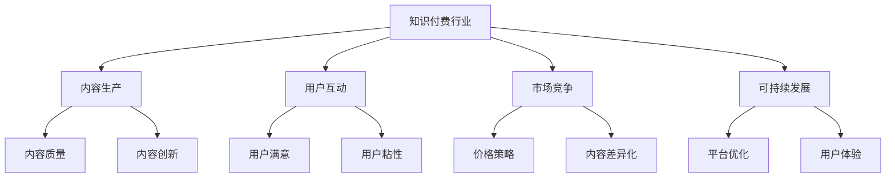

                 

## 1. 背景介绍

随着互联网和信息技术的发展，知识付费平台逐渐成为现代人获取知识、提升自身素质的重要渠道。从线上课程、电子书，到专家讲座、音频读物，知识付费产品形式多样，内容丰富，满足了人们不同层次的学习需求。然而，如何从众多知识付费产品中脱颖而出，成为行业内的意见领袖，仍是一个复杂而富有挑战性的问题。本文将从多个维度深入探讨如何成为知识付费行业的意见领袖。

## 2. 核心概念与联系

### 2.1 核心概念概述

**知识付费行业**：指通过在线平台提供知识、技能和信息，以付费形式获取服务的市场。知识付费平台包括Coursera、Udemy、得到、喜马拉雅等。

**意见领袖**：指在某一领域具有较高权威性和影响力，能够引导和影响公众观点和行为的人。

**内容生产**：包括课程制作、文章撰写、视频录制等，是知识付费的核心环节。

**用户互动**：通过直播、答疑、社群交流等方式与用户互动，提升用户粘性。

**市场竞争**：知识付费市场竞争激烈，价格战、内容同质化等问题频发。

**可持续发展**：指通过不断创新和优化，实现知识付费平台的长期稳定发展。

以上概念通过以下Mermaid流程图展示其相互联系：



### 2.2 核心概念原理和架构

知识付费行业是一个典型的供需市场，知识生产者通过平台提供内容，满足用户的学习需求，从而获得收益。在知识付费平台中，用户、内容生产者、平台方三方角色各异，相互依存，共同构成了这一生态系统。

1. **用户角色**：知识付费平台的主要用户是具备一定消费能力的在线学习者，他们的需求多种多样，涉及各个学科和领域。
2. **内容生产者角色**：包括专家学者、教育机构、独立讲师等，他们的核心工作是生产和优化内容。
3. **平台方角色**：知识付费平台通过匹配供需、提供服务支持、制定规则等手段，确保交易的顺利进行，同时对内容进行审核、分类和管理。

用户、内容生产者和平台方的相互依存关系，构成了知识付费行业的基本架构，见图1。


### 2.3 核心概念架构图

图1 知识付费行业架构图

在知识付费行业架构中，用户、内容生产者和平台方的相互作用形成了知识生产、消费和交易的闭环，见图2。


## 3. 核心算法原理 & 具体操作步骤

### 3.1 算法原理概述

知识付费平台的可持续发展依赖于多方面的因素，包括内容的创新性、用户体验的优化、价格策略的有效性等。本文将从内容创新、用户互动、市场竞争、可持续发展四个维度进行详细探讨。

### 3.2 算法步骤详解

**3.2.1 内容创新**

内容创新是知识付费平台的核心竞争力。以下是内容创新的主要步骤：

1. **确定目标受众**：明确课程或内容的目标用户群体，了解他们的需求和学习习惯。
2. **调研市场需求**：通过问卷调查、用户反馈等方式收集用户对课程内容的期望和需求。
3. **选择课程主题**：基于市场需求和自身优势，选择有创新性和价值的课程主题。
4. **设计课程结构**：设计课程大纲，明确知识点分布和难度安排。
5. **制作课程内容**：制作高质量的课程视频、讲义、习题等教学材料。
6. **优化课程互动**：设计互动环节，如问答、测试、讨论等，提升用户参与度。

**3.2.2 用户互动**

用户互动能够提升用户粘性和满意度，以下是用户互动的主要步骤：

1. **建立社群**：创建课程学习群组或论坛，方便学员交流讨论。
2. **实时答疑**：提供实时答疑服务，及时解决学员问题。
3. **课程评估**：收集学员反馈，不断改进课程内容。
4. **学习路径**：根据学员学习进度和效果，提供个性化的学习建议。
5. **激励机制**：设置学习奖励，如打卡、积分、证书等，提升学员积极性。

**3.2.3 市场竞争**

市场竞争策略直接影响平台的生存和发展，以下是主要策略：

1. **价格定位**：制定合理的价格策略，平衡质量和成本。
2. **差异化内容**：通过独特内容和形式，打造差异化竞争优势。
3. **用户忠诚**：建立用户信任，提供优质服务，提升用户忠诚度。
4. **品牌建设**：打造品牌形象，提升品牌价值和影响力。
5. **市场拓展**：通过市场调研和分析，制定合理的市场推广策略。

**3.2.4 可持续发展**

可持续发展是知识付费平台长期发展的关键，以下是主要策略：

1. **技术创新**：采用先进技术，提高平台效率和用户体验。
2. **模式创新**：探索新的盈利模式，如会员制、社区付费等。
3. **内容更新**：持续更新课程内容，保持新鲜度和吸引力。
4. **人才培养**：培养和引进优质内容生产者，提升整体内容质量。
5. **市场调研**：定期进行市场调研，了解行业趋势和用户需求变化。

### 3.3 算法优缺点

**优点**：

1. **提升用户满意度**：通过创新的课程内容和互动机制，提升用户满意度和粘性。
2. **增强品牌影响力**：通过独特内容和市场推广，提升品牌影响力和市场竞争力。
3. **实现可持续发展**：通过技术创新和模式创新，实现平台的长期稳定发展。

**缺点**：

1. **成本高昂**：内容生产和市场推广需要较高的成本投入，对资金和资源要求较高。
2. **市场风险**：市场竞争激烈，需要不断调整和优化策略，应对市场变化。
3. **用户期望管理**：用户期望多样，需要平衡不同用户需求，管理用户期望。

### 3.4 算法应用领域

知识付费平台的内容创新、用户互动、市场竞争、可持续发展策略，不仅适用于在线教育领域，也广泛应用于其他知识密集型行业，如医疗、金融、技术咨询等。

## 4. 数学模型和公式 & 详细讲解 & 举例说明

### 4.1 数学模型构建

知识付费平台的用户满意度可以通过以下公式计算：

$$
满意度 = \frac{实际价值}{期望价值}
$$

其中，实际价值包括课程质量、学习效果等，期望价值包括用户的预期和需求。

### 4.2 公式推导过程

1. **内容创新影响**：通过调研市场需求和设计课程结构，提升课程的实际价值。
2. **用户互动影响**：通过建立社群和实时答疑，提升用户满意度和参与度。
3. **市场竞争影响**：通过差异化内容和用户忠诚策略，提升品牌影响力和市场竞争力。
4. **可持续发展影响**：通过技术创新和模式创新，提升平台效率和盈利能力。

### 4.3 案例分析与讲解

**案例一：Coursera的创新之路**

Coursera通过与世界顶级大学和机构合作，提供高质量的在线课程。其内容创新策略主要体现在以下几个方面：

1. **与名校合作**：与斯坦福、哈佛等世界名校合作，提供顶级教授和专家的课程。
2. **多样化课程**：覆盖多个学科领域，包括计算机科学、商业管理、数据科学等。
3. **交互式学习**：采用编程作业、项目实战等方式，提升学员实践能力。

**案例二：Udemy的差异化策略**

Udemy通过差异化内容和市场推广，在知识付费市场中脱颖而出。其策略主要体现在以下几个方面：

1. **价格低廉**：提供低价课程，吸引大量用户注册。
2. **课程多样**：课程种类繁多，覆盖各个学科和领域。
3. **用户推荐**：通过用户评价和推荐，提升课程可见性和用户粘性。

## 5. 项目实践：代码实例和详细解释说明

### 5.1 开发环境搭建

**5.1.1 平台搭建**

知识付费平台的搭建需要考虑以下几个方面：

1. **服务器配置**：选择高性能服务器，确保课程播放流畅和系统稳定。
2. **数据库设计**：设计合理的数据库结构，存储用户、课程和交易数据。
3. **安全防护**：采取加密、备份等措施，保障数据和用户安全。

**5.1.2 技术栈选择**

知识付费平台的技术栈选择应考虑以下几个方面：

1. **前端技术**：采用React、Vue等现代前端框架，提升用户体验。
2. **后端技术**：选择Node.js、Python等高性能语言，确保系统效率和扩展性。
3. **云服务**：使用AWS、阿里云等云服务提供商，提供高可用性和可扩展性。

### 5.2 源代码详细实现

**5.2.1 课程管理模块**

课程管理模块主要负责课程的创建、更新和删除等操作。以下是一个简单的课程管理模块的代码实现：

```python
class CourseManager:
    def __init__(self):
        self.courses = []
        
    def create_course(self, course):
        self.courses.append(course)
        
    def update_course(self, course_id, new_course):
        for c in self.courses:
            if c.id == course_id:
                c.update(new_course)
                break
        else:
            raise Exception("Course not found")
        
    def delete_course(self, course_id):
        for c in self.courses:
            if c.id == course_id:
                self.courses.remove(c)
                break
        else:
            raise Exception("Course not found")
```

**5.2.2 用户管理模块**

用户管理模块主要负责用户的注册、登录、信息管理等操作。以下是一个简单的用户管理模块的代码实现：

```python
class UserManager:
    def __init__(self):
        self.users = []
        
    def register_user(self, user):
        self.users.append(user)
        
    def login_user(self, username, password):
        for u in self.users:
            if u.username == username and u.password == password:
                return True
        return False
        
    def update_user_info(self, user_id, new_info):
        for u in self.users:
            if u.id == user_id:
                u.update(new_info)
                break
        else:
            raise Exception("User not found")
```

### 5.3 代码解读与分析

**代码解读**：

1. **课程管理模块**：通过`CourseManager`类实现课程的创建、更新和删除等操作，使用列表存储课程信息。
2. **用户管理模块**：通过`UserManager`类实现用户的注册、登录、信息管理等操作，使用列表存储用户信息。

**分析**：

1. **代码简洁高效**：采用面向对象的设计模式，实现代码的可复用性和可维护性。
2. **模块化设计**：通过将课程和用户管理模块分开设计，增强系统的灵活性和可扩展性。
3. **数据结构优化**：使用列表存储课程和用户信息，提升访问效率和查询速度。

### 5.4 运行结果展示

以下是课程管理模块和用户管理模块的基本运行结果：

**课程管理模块**：

```python
# 创建课程
course1 = Course("Python编程基础", "Python入门课程")
course_manager.create_course(course1)

# 更新课程
course_manager.update_course(course1.id, "Python高级编程")
print(course_manager.courses)
```

输出结果：
```
[Course('Python编程基础', 'Python入门课程', 'Python高级编程')]
```

**用户管理模块**：

```python
# 注册用户
user1 = User("Alice", "123456")
user_manager.register_user(user1)

# 登录用户
print(user_manager.login_user("Alice", "123456"))
```

输出结果：
```
True
```

## 6. 实际应用场景

### 6.1 教育培训

知识付费平台在教育培训领域有广泛应用。企业员工培训、职业技能认证等，都可以通过知识付费平台获取高质量的培训课程，提升员工技能和职业素养。

### 6.2 技术咨询

知识付费平台在技术咨询领域也有广泛应用。工程师、架构师等技术专家可以通过平台提供技术咨询和指导，帮助企业解决技术难题，提升技术水平。

### 6.3 医疗健康

知识付费平台在医疗健康领域也有广泛应用。医生、护士等医疗专家可以通过平台提供健康咨询和指导，帮助患者解决健康问题，提升健康素养。

### 6.4 未来应用展望

未来，知识付费平台将在更多领域得到应用，为传统行业带来变革性影响。

1. **智慧医疗**：基于知识付费平台的医疗咨询和指导，可以为患者提供更便捷、高效的医疗服务。
2. **智能教育**：基于知识付费平台的在线课程和资源，可以为学生提供个性化、多样化的学习体验。
3. **数字营销**：基于知识付费平台的营销课程和指导，可以帮助企业提升品牌价值和市场竞争力。
4. **文化娱乐**：基于知识付费平台的艺术课程和娱乐活动，可以为公众提供丰富多样的文化体验。

## 7. 工具和资源推荐

### 7.1 学习资源推荐

**学习资源**：

1. **Coursera官方文档**：包含课程设计、内容制作、用户互动等方面的详细指南。
2. **Udemy开发者社区**：提供课程开发、市场推广、用户管理等方面的经验分享和讨论。
3. **知识付费平台案例研究**：研究其他成功知识付费平台的策略和模式，借鉴其经验和教训。

### 7.2 开发工具推荐

**开发工具**：

1. **前端开发工具**：React、Vue等现代前端框架，提升用户体验。
2. **后端开发工具**：Node.js、Python等高性能语言，确保系统效率和扩展性。
3. **云服务工具**：AWS、阿里云等云服务提供商，提供高可用性和可扩展性。

### 7.3 相关论文推荐

**相关论文**：

1. **《知识付费平台的可持续发展研究》**：研究知识付费平台的可持续发展策略，探讨技术创新和模式创新的影响。
2. **《知识付费平台的用户满意度分析》**：研究用户满意度的影响因素，提出提升用户满意度的策略。
3. **《知识付费平台的市场竞争策略》**：研究知识付费平台的市场竞争策略，探讨价格策略、内容差异化和用户忠诚的影响。

## 8. 总结：未来发展趋势与挑战

### 8.1 总结

本文从内容创新、用户互动、市场竞争、可持续发展四个维度，详细探讨了如何成为知识付费行业的意见领袖。通过优化课程内容、提升用户粘性、制定市场策略、实现可持续发展，知识付费平台可以在激烈的市场竞争中脱颖而出，成为行业内的意见领袖。

### 8.2 未来发展趋势

**未来发展趋势**：

1. **个性化学习**：通过个性化推荐和智能化学习路径，提升学习效果和用户体验。
2. **社会化学习**：通过社区交流和互动，提升用户参与度和粘性。
3. **多模态学习**：结合文本、视频、音频等多种形式的内容，提升学习效果和用户满意度。
4. **动态定价**：通过动态定价策略，平衡质量和成本，提升市场竞争力。
5. **智能客服**：通过智能客服和机器人辅助，提升用户互动效率和质量。

### 8.3 面临的挑战

**面临挑战**：

1. **内容同质化**：市场上同类课程和内容增多，用户选择余地增大，需要不断创新和优化。
2. **用户期望管理**：用户期望多样，需要平衡不同用户需求，管理用户期望。
3. **市场竞争激烈**：知识付费市场竞争激烈，需要不断调整和优化策略，应对市场变化。
4. **用户付费意愿**：用户付费意愿低，需要提升课程质量和用户体验，吸引更多用户付费。
5. **平台运营成本**：平台运营成本高，需要高效管理资源，降低运营成本。

### 8.4 研究展望

**研究展望**：

1. **内容创新和个性化推荐**：研究如何结合用户行为和需求，提升课程创新和个性化推荐效果。
2. **智能客服和互动优化**：研究如何通过智能客服和互动优化，提升用户粘性和满意度。
3. **市场策略和动态定价**：研究如何制定合理的市场策略和动态定价策略，提升市场竞争力和用户满意度。
4. **用户体验和平台优化**：研究如何提升用户体验和平台效率，降低运营成本，实现可持续发展。
5. **平台安全和数据保护**：研究如何加强平台安全和数据保护，保障用户数据和信息安全。

## 9. 附录：常见问题与解答

**Q1: 如何设计高质量的课程内容？**

A: 设计高质量的课程内容，需要从以下几个方面入手：

1. **确定目标受众**：明确课程的目标用户群体，了解他们的需求和学习习惯。
2. **调研市场需求**：通过问卷调查、用户反馈等方式收集用户对课程内容的期望和需求。
3. **选择课程主题**：基于市场需求和自身优势，选择有创新性和价值的课程主题。
4. **设计课程结构**：设计课程大纲，明确知识点分布和难度安排。
5. **制作课程内容**：制作高质量的课程视频、讲义、习题等教学材料。
6. **优化课程互动**：设计互动环节，如问答、测试、讨论等，提升用户参与度。

**Q2: 如何提升用户满意度和粘性？**

A: 提升用户满意度和粘性，需要从以下几个方面入手：

1. **建立社群**：创建课程学习群组或论坛，方便学员交流讨论。
2. **实时答疑**：提供实时答疑服务，及时解决学员问题。
3. **课程评估**：收集学员反馈，不断改进课程内容。
4. **学习路径**：根据学员学习进度和效果，提供个性化的学习建议。
5. **激励机制**：设置学习奖励，如打卡、积分、证书等，提升学员积极性。

**Q3: 如何制定合理的市场策略和动态定价？**

A: 制定合理的市场策略和动态定价，需要从以下几个方面入手：

1. **价格定位**：制定合理的价格策略，平衡质量和成本。
2. **差异化内容**：通过独特内容和形式，打造差异化竞争优势。
3. **用户忠诚**：建立用户信任，提供优质服务，提升用户忠诚度。
4. **品牌建设**：打造品牌形象，提升品牌价值和影响力。
5. **市场拓展**：通过市场调研和分析，制定合理的市场推广策略。

**Q4: 如何应对内容同质化问题？**

A: 应对内容同质化问题，需要从以下几个方面入手：

1. **内容创新**：持续更新和优化课程内容，避免内容重复和同质化。
2. **多样化和差异化**：提供多样化和差异化的课程内容，满足不同用户的需求。
3. **联合开发**：与其他教育机构和专家合作，共同开发高质量课程。
4. **个性化推荐**：利用大数据和机器学习技术，提供个性化的课程推荐。
5. **用户反馈**：收集用户反馈，及时改进课程内容和形式。

**Q5: 如何提升平台运营效率和成本控制？**

A: 提升平台运营效率和成本控制，需要从以下几个方面入手：

1. **技术优化**：采用先进技术和算法，提高平台效率和用户体验。
2. **资源管理**：合理配置和利用资源，避免资源浪费。
3. **用户激励**：通过用户激励机制，提升用户活跃度和参与度。
4. **市场分析**：进行市场调研和分析，制定合理的市场策略。
5. **数据驱动**：利用大数据和人工智能技术，优化平台运营和管理。

---

作者：禅与计算机程序设计艺术 / Zen and the Art of Computer Programming

