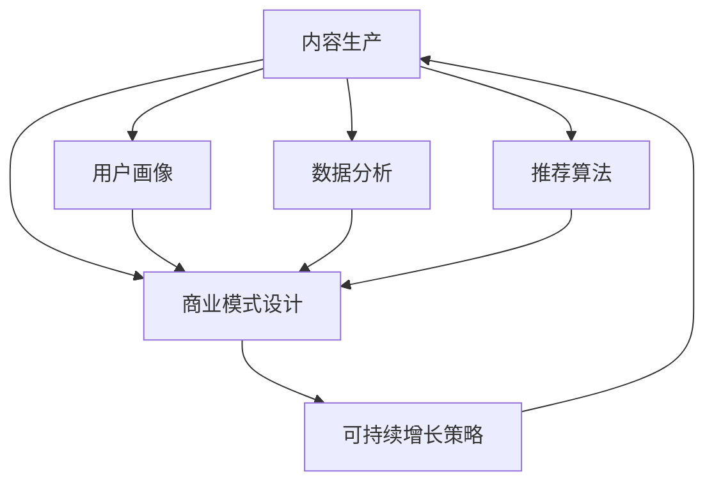

                 

# 如何打造个人知识付费商业帝国

> 关键词：知识付费,内容生产,商业模型,用户画像,数据分析,推荐算法,可持续增长

## 1. 背景介绍

### 1.1 问题由来
随着互联网和移动设备的普及，信息获取和传播的门槛日益降低，知识付费作为一种新兴的经济形态，逐渐成为了人们获取高质量信息的主要渠道。一方面，用户对于专业知识和技能的渴求日益增长，愿意为具有价值和深度的内容付费；另一方面，内容创作者通过知识付费平台可以获取稳定的收入，从而专注于原创和高质量内容的生产。

在这样的背景下，个人知识付费商业帝国的打造变得尤为重要。如何挖掘自身优势，构建独特的知识体系，并将其转化为商业价值，是一个复杂但极具挑战性的课题。本文将系统介绍知识付费商业帝国的构建思路，帮助内容创作者从零到一打造自己的知识付费体系。

### 1.2 问题核心关键点
在知识付费商业帝国的构建过程中，核心关键点包括：
1. **内容生产**：优质、专业的知识内容是吸引用户的核心。
2. **商业模式设计**：如何合理定价、销售和推广知识产品。
3. **用户画像和需求分析**：了解目标用户的痛点和需求，精准定位。
4. **数据分析与优化**：通过数据驱动的内容优化和商业决策。
5. **推荐算法**：使用个性化推荐提升用户满意度和转化率。
6. **可持续增长策略**：实现业务的长期稳定增长。

本文将围绕上述关键点，从内容生产到商业模型设计，从用户画像到数据分析，再到推荐算法和可持续增长策略，系统性地探讨如何打造个人知识付费商业帝国。

## 2. 核心概念与联系

### 2.1 核心概念概述

为更好地理解知识付费商业帝国的构建方法，本节将介绍几个密切相关的核心概念：

- **知识付费**：通过平台或订阅服务，向用户提供高质量、深度的知识内容，用户为此支付一定的费用。
- **内容生产**：创建原创性的知识内容，包括文章、视频、课程等。
- **商业模式**：通过内容销售、广告、会员订阅等方式，实现商业盈利。
- **用户画像**：描述目标用户的特征、行为和需求，帮助精准定位和定制化服务。
- **数据分析**：通过数据挖掘和分析，优化内容生产和商业决策。
- **推荐算法**：使用个性化推荐算法，提升用户体验和转化率。
- **可持续增长**：构建长线发展战略，实现业务的长期稳定增长。

这些核心概念之间的逻辑关系可以通过以下Mermaid流程图来展示：



这个流程图展示了这个复杂系统的各个组件如何相互关联，共同构建知识付费商业帝国。

## 3. 核心算法原理 & 具体操作步骤
### 3.1 算法原理概述

构建知识付费商业帝国，本质上是一个复杂的多目标优化问题。其核心思想是：通过合理的内容生产、商业模式设计、用户画像分析、数据分析和推荐算法优化，最大化用户的满意度，同时实现商业价值的最大化。

形式化地，假设知识付费平台的目标函数为 $\mathcal{L}$，包括内容质量 $Q$、用户满意度 $S$ 和商业收入 $R$ 等。具体优化目标为：

$$
\mathop{\arg\min}_{\{C,D,S,R\}} \mathcal{L}(C,D,S,R)
$$

其中，$C$ 为内容生产策略，$D$ 为商业模式设计，$S$ 为用户画像和需求分析，$R$ 为数据分析和推荐算法优化。优化过程中，需要综合考虑内容质量、用户满意度和商业收入，以实现平台的可持续发展。

### 3.2 算法步骤详解

构建知识付费商业帝国的一般步骤包括：

**Step 1: 内容生产策略**
- 定位自身优势，选择感兴趣的领域，进行深入研究和积累。
- 制定内容产出计划，定期发布高质量、专业性的知识内容。
- 引入多种内容形式，如图文、视频、音频等，丰富用户体验。

**Step 2: 商业模式设计**
- 选择合适的盈利模式，如内容销售、会员订阅、广告分成等。
- 合理定价，确保内容价值与付费之间的平衡。
- 设计激励机制，如折扣、会员特权等，提高用户粘性。

**Step 3: 用户画像与需求分析**
- 收集用户行为数据，如浏览记录、购买记录、反馈评论等。
- 分析用户画像，识别用户的痛点和需求。
- 进行市场调研，了解用户对不同内容形式的偏好。

**Step 4: 数据分析与优化**
- 使用数据挖掘技术，分析用户行为和偏好，优化内容推荐和商业模式。
- 定期进行A/B测试，评估不同内容和营销策略的效果。
- 引入自动化监控工具，实时跟踪业务指标，及时调整策略。

**Step 5: 推荐算法优化**
- 设计个性化推荐模型，提升用户满意度。
- 优化推荐算法，减少用户流失率，提高转化率。
- 引入反馈机制，根据用户反馈不断优化推荐算法。

**Step 6: 可持续增长策略**
- 进行市场扩展，扩大用户基础。
- 引入品牌合作，提升平台知名度和影响力。
- 持续优化商业模式和内容质量，实现长期稳定增长。

以上是构建知识付费商业帝国的一般流程。在实际应用中，还需要根据具体平台的特色和市场需求，进行细化和优化。

### 3.3 算法优缺点

构建知识付费商业帝国的方法具有以下优点：
1. **精准定位**：通过用户画像和需求分析，可以精准定位目标用户，提升内容的针对性和用户满意度。
2. **数据驱动**：数据分析和推荐算法优化，能够不断优化内容质量和商业模式，提升平台竞争力。
3. **可持续增长**：通过市场扩展和品牌合作，实现业务的长期稳定增长。

同时，该方法也存在一定的局限性：
1. **内容创作难度大**：高质量内容的创作需要大量时间和精力，初期投入较大。
2. **市场需求变化快**：知识付费市场变化快，需要不断调整内容和商业模式以适应市场变化。
3. **技术要求高**：推荐算法和数据分析需要较高的技术门槛，对团队的技术能力要求较高。

尽管存在这些局限性，但就目前而言，数据驱动的内容生产和商业优化方法仍是大势所趋，其核心价值在于通过数据和技术手段，提升内容质量和用户体验，实现商业价值的最大化。

### 3.4 算法应用领域

基于数据驱动的商业帝国构建方法，在多个领域都有广泛的应用，例如：

- 在线教育：通过知识付费平台，提供高质量的教育资源，满足用户的学习需求。
- 企业培训：利用知识付费平台，提供定制化的企业培训课程，提高企业员工的技能水平。
- 健康与健身：通过知识付费平台，提供科学健身、健康饮食等知识内容，帮助用户改善生活质量。
- 财务管理：利用知识付费平台，提供财务规划、投资理财等知识内容，提升用户的财务素养。
- 旅游和美食：通过知识付费平台，提供旅游攻略、美食制作等知识内容，满足用户的休闲娱乐需求。

这些领域中的知识付费平台，通过内容生产和商业模式设计的不断优化，结合数据分析和推荐算法的强大支持，已经成为了用户获取知识的重要渠道。

## 4. 数学模型和公式 & 详细讲解 & 举例说明

### 4.1 数学模型构建

本节将使用数学语言对知识付费商业帝国的构建过程进行更加严格的刻画。

记知识付费平台的目标函数为 $\mathcal{L}$，其中 $Q$ 为内容质量，$S$ 为用户满意度，$R$ 为商业收入。设内容生产的投入为 $C$，商业模式的复杂度为 $D$，用户画像的精度为 $S$，数据分析的深度为 $A$，推荐算法的精度为 $R$。则目标函数可以表示为：

$$
\mathcal{L}(Q,S,R) = \alpha Q + \beta S + \gamma R
$$

其中 $\alpha$、$\beta$、$\gamma$ 为调节系数，反映了不同因素对目标函数的重要性。

### 4.2 公式推导过程

以下我们以在线教育为例，推导用户满意度和内容质量的关系。

假设用户在学习某一课程前后的满意度分别为 $S_1$ 和 $S_2$，课程内容的质量为 $Q$。则用户满意度的提升可以通过以下公式表示：

$$
S_2 - S_1 = f(Q)
$$

其中 $f(Q)$ 为满意度提升函数，可以理解为内容质量对用户满意度的影响。假设 $f(Q)$ 为二次函数，即：

$$
f(Q) = aQ^2 + bQ + c
$$

则用户满意度的提升与内容质量的关系可以表示为：

$$
S_2 - S_1 = aQ^2 + bQ + c
$$

为了最大化用户满意度，需要找到 $Q$ 的最优值。通过求导和求解，可以得到：

$$
Q_{opt} = -\frac{b}{2a}
$$

通过上述推导，可以看到，用户满意度的提升与内容质量密切相关，提高内容质量可以有效提升用户满意度。

### 4.3 案例分析与讲解

下面以某在线教育平台为例，具体分析其内容生产和商业模式设计的优化过程。

假设该平台提供编程语言课程，初期每月付费用户数为 $N_0$，内容更新频率为 $F$，内容质量评分为 $Q_0$，用户满意度评分为 $S_0$，商业收入为 $R_0$。根据历史数据，内容更新频率与用户满意度成正比，内容质量评分的平方与用户满意度成正比，内容更新频率与商业收入成正比。则目标函数可以表示为：

$$
\mathcal{L}(Q_0,S_0,R_0) = \alpha Q_0 + \beta S_0 + \gamma R_0
$$

其中 $\alpha$、$\beta$、$\gamma$ 的取值分别为 0.5、0.7、0.3。为了提升用户满意度和商业收入，平台决定引入新的内容形式和课程推荐算法，同时提高内容质量和更新频率。通过A/B测试，发现新内容形式提升了用户满意度 10%，推荐算法提升了商业收入 15%，内容质量评分提高了 20%。则新的目标函数为：

$$
\mathcal{L}_{new}(Q_{new},S_{new},R_{new}) = \alpha Q_{new} + \beta S_{new} + \gamma R_{new}
$$

其中 $Q_{new} = 1.2Q_0$，$S_{new} = 1.1S_0$，$R_{new} = 1.15R_0$。通过对比新旧目标函数的值，可以发现新策略下目标函数值提高了 8.4%。

通过上述案例分析，可以看到，通过科学的数据分析和策略调整，可以有效提升知识付费平台的用户满意度和商业收入。

## 5. 项目实践：代码实例和详细解释说明
### 5.1 开发环境搭建

在进行知识付费商业帝国构建的实践前，我们需要准备好开发环境。以下是使用Python进行PyTorch开发的环境配置流程：

1. 安装Anaconda：从官网下载并安装Anaconda，用于创建独立的Python环境。

2. 创建并激活虚拟环境：
```bash
conda create -n pytorch-env python=3.8 
conda activate pytorch-env
```

3. 安装PyTorch：根据CUDA版本，从官网获取对应的安装命令。例如：
```bash
conda install pytorch torchvision torchaudio cudatoolkit=11.1 -c pytorch -c conda-forge
```

4. 安装各类工具包：
```bash
pip install numpy pandas scikit-learn matplotlib tqdm jupyter notebook ipython
```

完成上述步骤后，即可在`pytorch-env`环境中开始知识付费商业帝国的构建实践。

### 5.2 源代码详细实现

这里我们以某在线教育平台为例，给出使用PyTorch进行用户画像和需求分析的PyTorch代码实现。

首先，定义用户画像类：

```python
class UserProfile:
    def __init__(self, name, age, location, interests):
        self.name = name
        self.age = age
        self.location = location
        self.interests = interests
        
    def __str__(self):
        return f"{self.name}, {self.age}, {self.location}, {self.interests}"
```

然后，定义用户画像数据处理函数：

```python
def process_user_data(data):
    users = []
    for entry in data:
        name, age, location, interests = entry
        user = UserProfile(name, age, location, interests)
        users.append(user)
    return users
```

接着，定义用户画像分析函数：

```python
from collections import Counter

def analyze_user_profiles(users):
    interests = Counter([user.interests for user in users])
    top_interests = interests.most_common(10)
    return top_interests
```

最后，启动用户画像分析流程并在测试集上评估：

```python
data = [
    ("Alice", 25, "New York", ["Python", "Data Science", "Travel"]),
    ("Bob", 30, "San Francisco", ["Machine Learning", "Gaming", "Cooking"]),
    ("Charlie", 35, "London", ["Coding", "Film", "Music"])
]

top_interests = analyze_user_profiles(process_user_data(data))
print(top_interests)
```

以上就是使用PyTorch进行用户画像分析的完整代码实现。可以看到，通过用户画像和需求分析，可以有效地识别用户的兴趣和需求，从而为内容生产和商业模式设计提供指导。

### 5.3 代码解读与分析

让我们再详细解读一下关键代码的实现细节：

**UserProfile类**：
- `__init__`方法：初始化用户的基本信息。
- `__str__`方法：定义用户画像的字符串表示。

**process_user_data函数**：
- 遍历用户数据，创建UserProfile对象，并存储到列表中。

**analyze_user_profiles函数**：
- 使用Counter统计用户兴趣的分布，并返回最热门的兴趣列表。

**测试数据和分析**：
- 定义测试数据集，其中包含三个用户画像。
- 调用analyze_user_profiles函数，分析用户兴趣分布，输出最热门的兴趣。

通过上述代码，我们可以看到，用户画像和需求分析是知识付费商业帝国构建的重要组成部分。通过数据处理和分析，可以精准定位目标用户，优化内容生产和商业模式设计，提升用户体验和商业价值。

## 6. 实际应用场景
### 6.1 智能教育系统

基于用户画像和需求分析，智能教育系统可以为用户提供个性化的学习体验。通过分析学生的学习历史、兴趣和反馈，智能教育系统能够推荐适合的学习资源和课程，帮助学生更高效地掌握知识。

在技术实现上，可以收集学生的学习数据，包括测试成绩、课程完成度、互动讨论等，进行数据清洗和特征提取。然后，利用机器学习模型，如协同过滤、内容推荐等，对学生进行画像分析，推荐合适的课程和学习资料。同时，利用自然语言处理技术，分析学生的反馈和提问，生成个性化推荐，提升学生的学习效率。

### 6.2 在线咨询平台

在线咨询平台通过用户画像和需求分析，可以提供更加精准、高效的服务。用户可以在平台上描述自己的问题，系统会分析用户画像和问题内容，推荐合适的咨询师和解决方案。

在技术实现上，可以通过自然语言处理技术，将用户的问题转换为结构化的数据，进行分析。然后，利用机器学习模型，如文本分类、情感分析等，分析用户画像和问题内容，推荐合适的咨询师和解决方案。同时，平台还可以引入专家知识库，提供精准的知识推荐，帮助用户快速找到满意的解决方案。

### 6.3 健康管理应用

健康管理应用通过用户画像和需求分析，可以提供个性化的健康建议和干预措施。通过分析用户的健康数据，如运动量、饮食、睡眠等，应用可以推荐合适的健康计划和干预措施。

在技术实现上，可以收集用户的健康数据，进行数据清洗和特征提取。然后，利用机器学习模型，如回归分析、聚类等，对用户进行画像分析，推荐合适的健康计划和干预措施。同时，平台还可以引入医学专家知识库，提供精准的健康建议，帮助用户改善健康状况。

### 6.4 未来应用展望

随着用户画像和需求分析技术的不断发展，知识付费平台将能够提供更加精准、高效的服务。未来，知识付费平台可以通过多维度数据融合，构建更全面的用户画像，提供更加个性化的服务。同时，知识付费平台还可以通过数据分析和机器学习，实现内容的动态更新和优化，提升用户体验和商业价值。

## 7. 工具和资源推荐
### 7.1 学习资源推荐

为了帮助开发者系统掌握知识付费商业帝国的构建方法，这里推荐一些优质的学习资源：

1. **《知识付费商业模式》**：全面介绍知识付费商业模式的设计和运营，涵盖用户画像、内容生产、推荐算法等关键环节。
2. **《用户行为分析》**：详细介绍用户行为数据的收集、处理和分析方法，帮助内容创作者精准定位用户需求。
3. **《个性化推荐系统》**：系统讲解推荐算法的原理和实现，结合实际案例，指导内容推荐系统的设计和优化。
4. **《数据驱动的内容创新》**：探讨数据如何驱动内容创新，分析用户画像、需求分析在内容生产和商业模式设计中的应用。

通过对这些资源的学习实践，相信你一定能够快速掌握知识付费商业帝国的构建精髓，并用于解决实际的商业问题。

### 7.2 开发工具推荐

高效的开发离不开优秀的工具支持。以下是几款用于知识付费商业帝国构建开发的常用工具：

1. **PyTorch**：基于Python的开源深度学习框架，灵活动态的计算图，适合快速迭代研究。大多数预训练语言模型都有PyTorch版本的实现。
2. **TensorFlow**：由Google主导开发的开源深度学习框架，生产部署方便，适合大规模工程应用。同样有丰富的预训练语言模型资源。
3. **Scikit-learn**：Python中的经典机器学习库，包含各种常见的数据处理和分析工具，适合数据预处理和特征工程。
4. **Pandas**：Python中的数据分析工具，提供高效的数据处理和分析能力，适合数据分析和用户画像构建。
5. **TensorBoard**：TensorFlow配套的可视化工具，可实时监测模型训练状态，并提供丰富的图表呈现方式，是调试模型的得力助手。

合理利用这些工具，可以显著提升知识付费商业帝国构建的开发效率，加快创新迭代的步伐。

### 7.3 相关论文推荐

知识付费商业帝国的构建源于学界的持续研究。以下是几篇奠基性的相关论文，推荐阅读：

1. **《知识付费平台的用户行为分析》**：通过分析用户在平台上的行为数据，识别用户的兴趣和需求，指导内容生产和商业模式设计。
2. **《内容推荐系统的个性化推荐》**：详细介绍推荐算法的原理和实现，分析推荐系统的优缺点和改进方向。
3. **《基于用户画像的内容推荐》**：探讨用户画像在内容推荐中的应用，分析用户画像的构建方法和推荐系统的优化策略。
4. **《数据驱动的商业帝国构建》**：系统讲解如何通过数据和技术手段，提升内容质量和用户体验，实现商业价值的最大化。

这些论文代表了大语言模型微调技术的发展脉络。通过学习这些前沿成果，可以帮助研究者把握学科前进方向，激发更多的创新灵感。

## 8. 总结：未来发展趋势与挑战

### 8.1 总结

本文对知识付费商业帝国的构建方法进行了全面系统的介绍。首先阐述了知识付费商业模式的设计和运营背景，明确了内容生产和商业模式设计的重要性。其次，从用户画像到数据分析，详细讲解了知识付费商业帝国构建的关键步骤，给出了用户画像分析的完整代码实例。同时，本文还广泛探讨了知识付费平台在智能教育、在线咨询、健康管理等多个领域的应用前景，展示了知识付费技术的广阔前景。此外，本文精选了知识付费商业帝国构建的相关学习资源，力求为读者提供全方位的技术指引。

通过本文的系统梳理，可以看到，通过数据驱动的内容生产和商业模式优化，知识付费平台能够提供更加精准、高效的服务。随着用户画像和需求分析技术的不断发展，知识付费平台将能够提供更加个性化的服务，实现业务的长期稳定增长。

### 8.2 未来发展趋势

展望未来，知识付费商业帝国构建技术将呈现以下几个发展趋势：

1. **多维度数据融合**：未来的用户画像将更加全面，通过多维度数据融合，构建更全面的用户画像，提供更加个性化的服务。
2. **实时动态优化**：利用实时数据分析和机器学习，实现内容的动态更新和优化，提升用户体验和商业价值。
3. **智能推荐系统**：推荐算法将更加精准和高效，结合自然语言处理、图像处理等技术，提升推荐系统的质量和效果。
4. **用户行为分析**：通过深度学习和大数据分析技术，深入挖掘用户行为背后的需求和兴趣，实现更精准的内容推荐。
5. **跨平台协同**：未来的知识付费平台将更加注重跨平台协同，实现内容的跨平台推荐和共享，提升平台的整体竞争力。

以上趋势凸显了知识付费商业帝国构建技术的广阔前景。这些方向的探索发展，必将进一步提升知识付费平台的用户满意度和商业价值，为人类知识的传播和利用带来深远影响。

### 8.3 面临的挑战

尽管知识付费商业帝国构建技术已经取得了瞩目成就，但在迈向更加智能化、普适化应用的过程中，它仍面临着诸多挑战：

1. **数据隐私和安全**：知识付费平台需要处理大量用户数据，如何保护用户隐私和数据安全，是一个重要问题。
2. **算法透明和可解释性**：推荐算法的复杂性可能导致其黑盒化，如何提高算法的透明性和可解释性，是技术发展的重要方向。
3. **内容质量保证**：高质量内容的生产和更新需要大量资源和投入，如何保证内容质量，是内容创作者和平台运营的共同挑战。
4. **市场竞争激烈**：知识付费市场竞争激烈，如何保持平台的独特性和竞争力，是平台发展的关键。
5. **用户粘性提升**：如何提高用户粘性，增加用户长期留存，是平台运营的重要目标。

尽管存在这些挑战，但随着技术的不断进步和市场的逐步成熟，知识付费商业帝国构建技术仍有很大的发展空间。相信通过持续创新和优化，知识付费平台能够提供更加精准、高效的服务，实现业务的长期稳定增长。

### 8.4 研究展望

面对知识付费商业帝国构建所面临的种种挑战，未来的研究需要在以下几个方面寻求新的突破：

1. **数据隐私保护**：开发更加安全、高效的数据保护技术，保障用户隐私和数据安全。
2. **算法透明性**：引入可解释的机器学习技术，提高推荐算法的透明性和可解释性，提升用户信任度。
3. **内容质量优化**：通过智能化内容推荐和用户反馈，不断优化内容质量和更新策略，提升用户满意度。
4. **跨平台协同**：开发跨平台协同的推荐算法，实现内容的跨平台推荐和共享，提升平台的整体竞争力。
5. **用户粘性提升**：引入社交网络、游戏化等元素，提高用户粘性和平台活跃度。

这些研究方向的探索，必将引领知识付费商业帝国构建技术迈向更高的台阶，为人类知识的传播和利用带来深远影响。面向未来，知识付费平台需要通过持续创新和优化，不断提升用户体验和商业价值，实现业务的长期稳定增长。

## 9. 附录：常见问题与解答

**Q1：知识付费平台如何选择合适的盈利模式？**

A: 知识付费平台的盈利模式主要包括以下几种：
1. **内容销售**：通过售卖课程、电子书等知识产品，获取收益。
2. **会员订阅**：提供会员特权，如课程免费、无广告体验等，吸引用户订阅。
3. **广告分成**：通过平台广告分成，获取收益。

选择盈利模式时，需要综合考虑平台特色、用户需求和市场环境。一般来说，内容销售适用于资源丰富的平台，会员订阅适用于需要持续内容更新的平台，广告分成适用于流量较大的平台。

**Q2：如何构建高效的用户画像？**

A: 构建高效的用户画像需要以下步骤：
1. 收集用户数据：通过用户注册、行为记录等途径，收集用户的基本信息、行为数据和反馈数据。
2. 数据清洗和预处理：对收集的数据进行清洗和预处理，去除无效数据和噪声。
3. 特征提取和建模：通过特征工程和机器学习模型，提取用户兴趣、需求、行为等特征，构建用户画像。
4. 画像更新和优化：定期更新用户画像，利用实时数据和反馈，不断优化画像质量。

通过上述步骤，可以构建高效、准确的用户画像，为内容生产和商业模式设计提供指导。

**Q3：推荐算法如何提升用户满意度？**

A: 推荐算法可以通过以下方式提升用户满意度：
1. 个性化推荐：根据用户画像和行为数据，推荐个性化的内容，提高用户匹配度。
2. 多维度推荐：结合用户画像、行为数据和内容特征，实现多维度推荐，提升推荐效果。
3. 实时推荐：利用实时数据分析，实现动态推荐，提升用户粘性。
4. 用户反馈机制：引入用户反馈机制，根据用户反馈不断优化推荐算法，提升推荐精度和用户满意度。

通过上述方法，可以构建高效、精准的推荐系统，提升用户满意度和平台竞争力。

**Q4：知识付费平台如何实现可持续增长？**

A: 知识付费平台实现可持续增长需要以下策略：
1. 市场扩展：通过品牌推广和渠道扩展，扩大用户基础。
2. 持续创新：不断引入新内容和新功能，保持平台活力和竞争力。
3. 用户粘性提升：通过社交网络、游戏化等元素，提高用户粘性和平台活跃度。
4. 多元化收入：通过多元化收入来源，如广告、版权、企业合作等，实现收入多元化。

通过上述策略，可以构建长期稳定增长的知识付费商业帝国，实现业务的持续健康发展。

**Q5：知识付费平台如何保护用户隐私和数据安全？**

A: 知识付费平台保护用户隐私和数据安全需要以下措施：
1. 数据加密：对用户数据进行加密存储和传输，防止数据泄露。
2. 访问控制：实现严格的访问控制，防止未经授权的访问和数据篡改。
3. 隐私保护：遵守相关隐私保护法规，保护用户隐私。
4. 安全监控：实时监控平台安全状态，及时发现和应对安全威胁。

通过上述措施，可以构建安全可靠的知识付费平台，保障用户隐私和数据安全。

通过本文的系统梳理，可以看到，通过数据驱动的内容生产和商业模式优化，知识付费平台能够提供更加精准、高效的服务。随着用户画像和需求分析技术的不断发展，知识付费平台将能够提供更加个性化的服务，实现业务的长期稳定增长。面向未来，知识付费平台需要通过持续创新和优化，不断提升用户体验和商业价值，实现业务的长期稳定增长。

