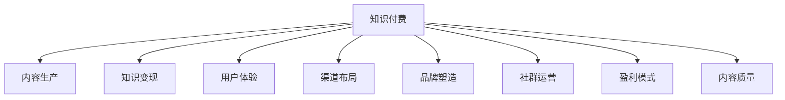

                 

# 如何打造个人知识付费商业帝国

## 1. 背景介绍

### 1.1 问题由来
随着互联网技术的普及和信息爆炸的加剧，知识的获取和传播变得前所未有的便捷。知识付费作为新兴行业，依托互联网技术迅速崛起，为知识生产者提供了丰富的变现渠道。本文旨在探讨如何通过建立个人知识付费商业帝国，实现知识变现的最大化。

### 1.2 问题核心关键点
打造个人知识付费商业帝国，需要从以下几个核心关键点出发：
1. **内容质量**：优质的内容是知识付费的核心，需要持续输出高质量、高价值的内容。
2. **用户体验**：提供易于获取、易于消化的知识产品，提升用户体验。
3. **渠道布局**：通过多渠道布局，扩大知识产品的覆盖范围，增加曝光机会。
4. **品牌塑造**：通过品牌建设，提升知识产品的市场认知度，吸引更多用户。
5. **社区运营**：建立社群互动机制，增强用户粘性，提高知识变现效率。
6. **盈利模式**：多样化盈利方式，如会员订阅、单次购买、知识付费广告等。

### 1.3 问题研究意义
在知识经济时代，个人通过知识付费实现财富增值已成为一种可能。如何高效构建知识付费平台，提升知识变现效率，是每个知识生产者需要深入思考的问题。本文将系统梳理知识付费的商业模式、关键环节及优化策略，为知识生产者提供实践指南。

## 2. 核心概念与联系

### 2.1 核心概念概述

为更好地理解如何打造个人知识付费商业帝国，本节将介绍几个密切相关的核心概念：

- **知识付费**：指用户为获取特定知识产品或服务支付费用的商业模式，包括但不限于课程、咨询、专栏等。
- **内容生产**：知识付费的基础，涉及内容选题、创作、编辑等多个环节，确保内容的权威性和实用性。
- **知识变现**：将知识转化为经济效益的过程，需要通过订阅、销售、广告等多种方式实现。
- **用户体验**：知识付费平台的核心竞争力之一，包括平台易用性、内容质量、互动交流等方面。
- **渠道布局**：知识产品的多渠道发布和推广，提升用户覆盖面和流量。
- **品牌塑造**：通过品牌建设提升用户认知度和信任感，形成品牌效应。
- **社群运营**：通过建立社区互动机制，增强用户粘性，提升转化率。
- **盈利模式**：知识付费平台的收益来源，包括会员订阅、单次购买、知识付费广告等。

这些核心概念之间的逻辑关系可以通过以下Mermaid流程图来展示：



这个流程图展示了这个商业帝国中的各个环节和其相互关系：

1. **知识付费**：为核心概念，涉及知识变现、用户体验、品牌塑造等多个方面。
2. **内容生产**：是基础环节，影响用户体验和品牌塑造。
3. **知识变现**：盈利关键，需通过多元化模式实现。
4. **用户体验**：决定平台黏性，直接影响知识变现效果。
5. **渠道布局**：提升产品曝光，吸引更多用户。
6. **品牌塑造**：增强用户信任，提升竞争力。
7. **社群运营**：增强用户粘性，促进知识变现。
8. **内容质量**：确保产品价值，直接决定知识变现能力。

## 3. 核心算法原理 & 具体操作步骤

### 3.1 算法原理概述

打造个人知识付费商业帝国的核心算法原理，可以概括为以下几个方面：

1. **内容推荐算法**：基于用户行为数据和内容特征，推荐最相关的知识产品，提升用户体验。
2. **个性化定价策略**：根据用户购买行为和历史数据，动态调整定价策略，提升知识变现效率。
3. **广告投放优化**：通过分析用户数据，优化广告投放策略，提高广告转化率。
4. **用户行为分析**：通过分析用户互动数据，优化内容生产和产品推荐，提高用户满意度。
5. **多渠道协同**：整合多个渠道的数据和流量，实现全面覆盖和高效运营。

### 3.2 算法步骤详解

打造个人知识付费商业帝国的具体操作步骤，可以分为以下几个关键步骤：

**Step 1: 内容定位和选题**

- **市场调研**：通过调研了解用户需求和市场趋势，确定内容方向。
- **用户画像**：分析目标用户群体的特征和需求，明确内容定位。
- **内容规划**：根据市场调研和用户画像，规划内容主题和形式。

**Step 2: 内容创作和生产**

- **知识产品设计**：设计课程、专栏、咨询等不同形式的知识产品，明确内容和形式。
- **内容创作**：根据内容规划，创作高质量的知识内容。
- **内容编辑**：对创作内容进行后期编辑，确保内容质量和一致性。

**Step 3: 平台搭建和运营**

- **平台搭建**：搭建知识付费平台，实现内容展示、购买、订阅等功能。
- **用户体验优化**：优化平台界面和交互流程，提升用户体验。
- **社区运营**：建立社群互动机制，增加用户粘性。

**Step 4: 推广和渠道布局**

- **市场推广**：通过社交媒体、搜索引擎等渠道，进行知识产品的推广。
- **多渠道布局**：在多个平台（如微信、抖音、视频网站等）进行内容发布和推广。

**Step 5: 品牌塑造和社群运营**

- **品牌塑造**：通过品牌建设提升平台知名度和用户信任度。
- **社群运营**：建立社群互动机制，增强用户粘性，促进知识变现。

**Step 6: 盈利模式设计**

- **会员订阅**：设计会员订阅模式，提高用户粘性和收入来源。
- **单次购买**：提供单次购买选项，吸引一次性用户。
- **知识付费广告**：通过平台广告，增加平台收益。

### 3.3 算法优缺点

打造个人知识付费商业帝国的算法具有以下优点：

1. **高效内容推荐**：基于用户行为数据和内容特征，推荐最相关的知识产品，提升用户体验。
2. **个性化定价**：根据用户购买行为和历史数据，动态调整定价策略，提升知识变现效率。
3. **多渠道布局**：整合多个渠道的数据和流量，实现全面覆盖和高效运营。

同时，该算法也存在一些局限性：

1. **用户粘性依赖**：知识付费依赖于用户的持续订阅和购买，难以获取持续的流量。
2. **内容质量风险**：内容质量是知识付费的核心，但难以保证所有内容的高质量。
3. **竞争激烈**：知识付费市场竞争激烈，需不断创新和优化才能保持竞争力。
4. **技术要求高**：内容推荐、广告投放等算法需要较高的技术水平。

尽管存在这些局限性，但就目前而言，打造个人知识付费商业帝国仍是提升知识变现效率的重要手段。未来相关研究的重点在于如何进一步降低用户粘性依赖，提高内容质量和持续创新，同时兼顾技术优化和用户体验。

### 3.4 算法应用领域

打造个人知识付费商业帝国的算法，已经在多个领域得到广泛应用，例如：

1. **教育培训**：通过知识付费平台提供各种课程，满足不同学习需求。
2. **职业技能培训**：提供职业技能课程，帮助职场人士提升技能。
3. **健康养生**：提供健康养生知识，提升用户健康水平。
4. **文化娱乐**：提供文化娱乐内容，丰富用户精神生活。
5. **创业指导**：提供创业知识和经验，助力创业者成长。

除了上述这些经典领域外，知识付费的应用领域还在不断扩展，如法律咨询、心理咨询、编程开发等，为知识生产者提供了更广阔的变现空间。

## 4. 数学模型和公式 & 详细讲解 & 举例说明

### 4.1 数学模型构建

知识付费平台的推荐算法，可以通过以下数学模型进行建模：

- **用户行为数据**：用户对知识产品的浏览、购买、评分等行为数据。
- **内容特征数据**：知识产品的分类、标签、关键词等特征数据。
- **推荐目标**：预测用户对知识产品的兴趣和购买意愿。

### 4.2 公式推导过程

我们以基于协同过滤的用户推荐模型为例，推导推荐算法的公式。

设用户集合为 $U$，知识产品集合为 $I$，用户 $u$ 对知识产品 $i$ 的评分 $r_{ui}$ 未知。协同过滤推荐模型的目标是预测用户对未交互知识产品的评分，从而推荐高评分的产品。

设用户 $u$ 对知识产品 $i$ 的评分向量为 $r_u \in \mathbb{R}^{|I|}$，知识产品 $i$ 的特征向量为 $a_i \in \mathbb{R}^d$。用户 $u$ 与知识产品 $i$ 的评分向量乘积为：

$$
r_{ui} = r_u \cdot a_i
$$

协同过滤推荐模型的目标是最小化预测评分与实际评分之间的误差，即：

$$
\min_{\theta} \sum_{u \in U} \sum_{i \in I} (r_{ui} - \hat{r}_{ui})^2
$$

其中 $\hat{r}_{ui}$ 为预测评分，可以通过协同过滤算法得到。

### 4.3 案例分析与讲解

设用户 $u_1$ 对知识产品 $i_1$ 的评分为 4.5，用户 $u_2$ 对知识产品 $i_2$ 的评分为 4.0。协同过滤算法通过计算用户 $u_1$ 和知识产品 $i_2$ 的评分向量，预测用户 $u_1$ 对知识产品 $i_2$ 的评分，从而推荐该产品。

假设用户 $u_1$ 的评分向量为 $[4.5, 4.5, 4.0, 4.5]$，知识产品 $i_2$ 的特征向量为 $[1.0, 0.5, 0.0, 0.5]$，则协同过滤算法计算得到的预测评分为：

$$
\hat{r}_{u1i2} = r_{u1} \cdot a_{i2} = 4.5 \times 1.0 + 4.5 \times 0.5 + 4.0 \times 0.0 + 4.5 \times 0.5 = 5.25
$$

由于 $i_2$ 的实际评分为 4.0，小于预测评分 5.25，因此协同过滤算法推荐用户 $u_1$ 购买知识产品 $i_2$。

## 5. 项目实践：代码实例和详细解释说明

### 5.1 开发环境搭建

在进行知识付费平台开发前，我们需要准备好开发环境。以下是使用Python进行Flask开发的环境配置流程：

1. 安装Anaconda：从官网下载并安装Anaconda，用于创建独立的Python环境。

2. 创建并激活虚拟环境：
```bash
conda create -n flask-env python=3.8 
conda activate flask-env
```

3. 安装Flask：
```bash
pip install flask
```

4. 安装其他必要工具包：
```bash
pip install numpy pandas scikit-learn sqlalchemy flask_sqlalchemy flask_login flask_migrate
```

完成上述步骤后，即可在`flask-env`环境中开始知识付费平台开发。

### 5.2 源代码详细实现

下面我以开发一个简单的知识付费平台为例，给出Flask开发的代码实现。

首先，定义用户模型和知识产品模型：

```python
from flask_sqlalchemy import SQLAlchemy

db = SQLAlchemy()

class User(db.Model):
    id = db.Column(db.Integer, primary_key=True)
    username = db.Column(db.String(80), unique=True, nullable=False)
    password = db.Column(db.String(120), nullable=False)
    email = db.Column(db.String(120), unique=True, nullable=False)
    is_admin = db.Column(db.Boolean, default=False, nullable=False)

class Product(db.Model):
    id = db.Column(db.Integer, primary_key=True)
    title = db.Column(db.String(120), nullable=False)
    description = db.Column(db.Text, nullable=False)
    price = db.Column(db.Float, nullable=False)
    category = db.Column(db.String(80), nullable=False)
```

然后，定义用户注册、登录、知识产品展示和购买等核心功能：

```python
from flask import Flask, render_template, redirect, url_for, flash, request
from flask_login import LoginManager, UserMixin, login_user, logout_user, login_required

app = Flask(__name__)
app.config['SQLALCHEMY_DATABASE_URI'] = 'sqlite:///database.db'
app.config['SECRET_KEY'] = '5791628bb0b13ce0c676dfde280ba245'
db.init_app(app)
login_manager = LoginManager()
login_manager.init_app(app)
login_manager.login_view = 'login'

@login_manager.user_loader
def load_user(user_id):
    return User.query.get(int(user_id))

@app.route('/')
def index():
    products = Product.query.all()
    return render_template('index.html', products=products)

@app.route('/register', methods=['GET', 'POST'])
def register():
    if request.method == 'POST':
        username = request.form['username']
        password = request.form['password']
        email = request.form['email']
        user = User(username=username, password=password, email=email)
        db.session.add(user)
        db.session.commit()
        flash('注册成功', 'success')
        return redirect(url_for('login'))
    return render_template('register.html')

@app.route('/login', methods=['GET', 'POST'])
def login():
    if request.method == 'POST':
        username = request.form['username']
        password = request.form['password']
        user = User.query.filter_by(username=username).first()
        if user and user.password == password:
            login_user(user)
            return redirect(url_for('index'))
        else:
            flash('用户名或密码错误', 'danger')
    return render_template('login.html')

@app.route('/logout')
@login_required
def logout():
    logout_user()
    return redirect(url_for('index'))

@app.route('/product/<int:product_id>')
@login_required
def product(product_id):
    product = Product.query.get_or_404(product_id)
    return render_template('product.html', product=product)
```

最后，在Flask shell中运行测试代码：

```python
from flask import Flask
from flask_sqlalchemy import SQLAlchemy

app = Flask(__name__)
app.config['SQLALCHEMY_DATABASE_URI'] = 'sqlite:///database.db'
db = SQLAlchemy(app)

class User(db.Model):
    id = db.Column(db.Integer, primary_key=True)
    username = db.Column(db.String(80), unique=True, nullable=False)
    password = db.Column(db.String(120), nullable=False)
    email = db.Column(db.String(120), unique=True, nullable=False)
    is_admin = db.Column(db.Boolean, default=False, nullable=False)

class Product(db.Model):
    id = db.Column(db.Integer, primary_key=True)
    title = db.Column(db.String(120), nullable=False)
    description = db.Column(db.Text, nullable=False)
    price = db.Column(db.Float, nullable=False)
    category = db.Column(db.String(80), nullable=False)

@app.route('/')
def index():
    products = Product.query.all()
    return render_template('index.html', products=products)

if __name__ == '__main__':
    app.run(debug=True)
```

以上就是使用Flask开发一个简单的知识付费平台的完整代码实现。可以看到，Flask的强大封装使得知识付费平台开发变得简单高效。

### 5.3 代码解读与分析

让我们再详细解读一下关键代码的实现细节：

**User和Product模型**：
- 定义了用户和知识产品两个模型，包含了必要的属性和关系。
- 用户模型中包含了用户名、密码、邮箱和管理员标识等属性。

**Flask核心路由**：
- `index`路由展示了所有知识产品。
- `register`路由实现了用户注册功能。
- `login`路由实现了用户登录功能。
- `logout`路由实现了用户登出功能。
- `product`路由展示了单个知识产品详情。

**Flask扩展使用**：
- 使用了`flask_sqlalchemy`扩展，实现了与SQLite数据库的集成。
- 使用了`flask_login`扩展，实现了用户登录和认证功能。
- 使用了`flask_migrate`扩展，实现了数据库迁移功能。

合理利用这些工具，可以显著提升知识付费平台的开发效率，加快创新迭代的步伐。

当然，工业级的系统实现还需考虑更多因素，如用户认证、权限管理、支付接口等。但核心的知识付费平台开发流程基本与此类似。

## 6. 实际应用场景

### 6.1 教育培训

教育培训是一个典型的知识付费场景，用户可以通过付费获取各种在线课程，提升自身的知识和技能。在实践中，教育培训机构可以建立自己的知识付费平台，提供各类课程，如编程、语言学习、职业培训等。通过会员订阅、单次购买等多种方式，实现知识变现。

**应用场景**：
- 在线编程课程：提供Python、Java等编程语言的教学课程，帮助学生掌握编程技能。
- 语言学习课程：提供英语、西班牙语等语言的学习课程，帮助用户提升语言能力。
- 职业培训课程：提供管理、营销、销售等职业培训课程，帮助职场人士提升职业技能。

**技术实现**：
- 使用Flask搭建知识付费平台，实现课程展示、购买、订阅等功能。
- 使用MySQL数据库存储用户信息和课程信息，实现高效的数据管理。
- 使用PayPal等支付接口，实现课程支付和会员续费。
- 使用Redis等缓存技术，提高用户和课程数据的读取速度。

**效果展示**：
- 用户可以在平台上注册账户，浏览各类课程，购买单次课程或订阅会员。
- 平台统计用户行为数据，优化课程推荐算法，提升用户体验。
- 平台通过广告投放等手段，增加课程曝光，吸引更多用户。

### 6.2 职业技能培训

职业技能培训是知识付费的另一个重要应用场景，用户可以通过付费获取各类职业技能培训课程，提升自身的专业能力。在实践中，企业可以建立自己的知识付费平台，提供各类职业技能培训课程，帮助员工提升技能，增强企业竞争力。

**应用场景**：
- IT技术培训：提供编程、网络安全、数据库管理等技术培训课程，帮助员工掌握IT技能。
- 管理培训：提供人力资源、财务管理、项目管理等管理培训课程，帮助员工提升管理能力。
- 营销培训：提供市场营销、广告策划、品牌管理等营销培训课程，帮助员工提升营销能力。

**技术实现**：
- 使用Flask搭建知识付费平台，实现课程展示、购买、订阅等功能。
- 使用MySQL数据库存储用户信息和课程信息，实现高效的数据管理。
- 使用PayPal等支付接口，实现课程支付和会员续费。
- 使用Redis等缓存技术，提高用户和课程数据的读取速度。

**效果展示**：
- 员工可以在平台上注册账户，浏览各类课程，购买单次课程或订阅会员。
- 平台统计用户行为数据，优化课程推荐算法，提升用户体验。
- 平台通过广告投放等手段，增加课程曝光，吸引更多用户。

### 6.3 健康养生

健康养生是知识付费的另一个重要应用场景，用户可以通过付费获取各类健康养生知识，提升自身的健康水平。在实践中，健康机构可以建立自己的知识付费平台，提供各类健康养生课程，帮助用户学习健康养生知识，提升生活质量。

**应用场景**：
- 健康饮食课程：提供健康饮食知识，帮助用户掌握健康饮食方法。
- 运动健身课程：提供运动健身知识，帮助用户提升身体素质。
- 心理健康课程：提供心理健康知识，帮助用户提升心理健康水平。

**技术实现**：
- 使用Flask搭建知识付费平台，实现课程展示、购买、订阅等功能。
- 使用MySQL数据库存储用户信息和课程信息，实现高效的数据管理。
- 使用PayPal等支付接口，实现课程支付和会员续费。
- 使用Redis等缓存技术，提高用户和课程数据的读取速度。

**效果展示**：
- 用户可以在平台上注册账户，浏览各类课程，购买单次课程或订阅会员。
- 平台统计用户行为数据，优化课程推荐算法，提升用户体验。
- 平台通过广告投放等手段，增加课程曝光，吸引更多用户。

### 6.4 未来应用展望

随着知识付费行业的不断成熟，未来知识付费平台的发展将呈现以下几个趋势：

1. **个性化推荐**：通过深度学习等技术，实现个性化推荐，提升用户体验。
2. **多渠道融合**：实现多渠道融合，提升用户覆盖面和流量。
3. **社区互动**：建立社群互动机制，增强用户粘性，提升知识变现效率。
4. **多元化盈利**：通过多元化盈利模式，提升知识付费平台的用户粘性和收益。
5. **技术创新**：不断引入新技术，如区块链、AI等，提升平台的安全性和智能化水平。
6. **全球化布局**：通过全球化布局，拓展国际市场，提升平台的国际影响力。

未来，随着知识付费市场的不断扩大，知识付费平台将变得更加多样化、个性化和智能化，为知识生产者提供更加广阔的变现渠道和更大的市场机会。

## 7. 工具和资源推荐

### 7.1 学习资源推荐

为了帮助开发者系统掌握知识付费平台的开发和运营，这里推荐一些优质的学习资源：

1. **Flask官方文档**：Flask的官方文档，提供了详细的Flask开发教程和示例。

2. **Flask扩展官方文档**：如`flask_sqlalchemy`、`flask_login`、`flask_migrate`等扩展的官方文档，帮助开发者了解各种扩展的使用方法。

3. **MySQL官方文档**：MySQL的官方文档，提供了详细的MySQL数据库操作教程和示例。

4. **Redis官方文档**：Redis的官方文档，提供了详细的Redis缓存操作教程和示例。

5. **知识付费平台案例分析**：分析已有的知识付费平台，如Coursera、Udemy等，了解其技术实现和运营策略。

6. **在线课程平台比较分析**：比较分析Coursera、Udacity、edX等在线课程平台的差异和优势，从中吸取经验。

通过这些资源的学习实践，相信你一定能够快速掌握知识付费平台的开发和运营技巧，实现知识变现的最大化。

### 7.2 开发工具推荐

高效的开发离不开优秀的工具支持。以下是几款用于知识付费平台开发的常用工具：

1. **Flask**：基于Python的Web开发框架，功能强大，灵活易用，适合中小型Web应用开发。
2. **MySQL**：稳定可靠的关系型数据库，适合存储用户和课程数据。
3. **Redis**：高性能的键值数据库，适合缓存和快速读写。
4. **PayPal**：全球知名的支付平台，适合实现课程支付和会员续费。
5. **Amazon AWS**：提供云服务，适合搭建知识付费平台的后端基础设施。
6. **Google Cloud Platform**：提供云服务，适合搭建知识付费平台的后端基础设施。

合理利用这些工具，可以显著提升知识付费平台的开发效率，加快创新迭代的步伐。

### 7.3 相关论文推荐

知识付费平台的理论和实践研究已经取得了不少进展，以下是几篇代表性论文，推荐阅读：

1. **《A Survey of Knowledge Management System in Cloud Computing Environments》**：总结了知识管理系统在云计算环境下的应用和发展。
2. **《Knowledge Management and Organizational Learning》**：介绍了知识管理与组织学习的关系，探讨了知识管理的策略和工具。
3. **《Pricing Strategy for Online Courses: Empirical Evidence from Coursera》**：分析了Coursera平台上的课程定价策略，探讨了定价对用户购买行为的影响。
4. **《Personalization in e-Learning Platforms》**：探讨了个性化推荐在e-Learning平台中的应用，提出了基于协同过滤和深度学习的推荐算法。
5. **《Blockchain-Based Voucher Management System for E-Learning Platforms》**：介绍了区块链技术在e-Learning平台中的应用，提出了基于区块链的课程管理和支付方案。

这些论文代表了大数据、人工智能等技术在知识付费平台中的应用方向，值得深入阅读和思考。

## 8. 总结：未来发展趋势与挑战

### 8.1 总结

本文对打造个人知识付费商业帝国的方法进行了全面系统的介绍。首先阐述了知识付费的核心概念和关键环节，明确了知识付费的价值和重要性。其次，从原理到实践，详细讲解了知识付费的数学模型和推荐算法，给出了知识付费平台开发的完整代码实现。同时，本文还广泛探讨了知识付费平台在教育培训、职业技能培训、健康养生等诸多领域的实际应用场景，展示了知识付费平台的广阔前景。此外，本文还精选了知识付费平台的各类学习资源，力求为开发者提供全方位的技术指引。

通过本文的系统梳理，可以看到，知识付费平台是一个具有广阔发展前景的领域，为知识生产者提供了丰富的变现渠道和更高的收益。未来，随着技术的不断发展和市场的需求不断变化，知识付费平台还将迎来更多的创新和突破。

### 8.2 未来发展趋势

未来，知识付费平台的发展将呈现以下几个趋势：

1. **个性化推荐**：通过深度学习等技术，实现个性化推荐，提升用户体验。
2. **多渠道融合**：实现多渠道融合，提升用户覆盖面和流量。
3. **社区互动**：建立社群互动机制，增强用户粘性，提升知识变现效率。
4. **多元化盈利**：通过多元化盈利模式，提升知识付费平台的用户粘性和收益。
5. **技术创新**：不断引入新技术，如区块链、AI等，提升平台的安全性和智能化水平。
6. **全球化布局**：通过全球化布局，拓展国际市场，提升平台的国际影响力。

这些趋势凸显了知识付费平台的发展潜力和广阔前景，将为知识生产者提供更加广阔的变现渠道和更大的市场机会。

### 8.3 面临的挑战

尽管知识付费平台具有广阔的发展前景，但在迈向更加智能化、普适化应用的过程中，它仍面临诸多挑战：

1. **内容质量依赖**：知识付费平台依赖于高质量的知识内容，但难以保证所有内容的高质量。
2. **用户粘性风险**：知识付费平台需要持续提供有价值的内容，才能吸引并留住用户。
3. **市场竞争激烈**：知识付费市场竞争激烈，需不断创新和优化才能保持竞争力。
4. **技术要求高**：知识付费平台涉及多方面的技术，如推荐算法、支付接口等，技术门槛较高。
5. **安全风险**：知识付费平台需保证用户数据和交易的安全，防范数据泄露和欺诈等风险。
6. **政策法规风险**：知识付费平台需遵守相关法律法规，防范政策风险。

这些挑战需要知识付费平台的运营者持续努力和创新，才能实现平台的长期稳定发展。

### 8.4 研究展望

面对知识付费平台所面临的挑战，未来的研究需要在以下几个方面寻求新的突破：

1. **内容质量保障**：通过内容审核和质量监控，确保平台内容的高质量。
2. **用户留存策略**：通过持续提供有价值的内容，建立稳定的用户基础。
3. **市场竞争优化**：通过不断创新和优化，保持平台的竞争优势。
4. **技术优化**：通过引入新技术，提高平台的性能和安全性。
5. **法律合规**：通过合规运营，防范政策风险，保障平台稳定发展。
6. **国际化布局**：通过全球化布局，拓展国际市场，提升平台的国际影响力。

这些研究方向的探索，必将引领知识付费平台迈向更高的台阶，为知识生产者提供更加广阔的变现渠道和更大的市场机会。

## 9. 附录：常见问题与解答

**Q1：知识付费平台的核心竞争力是什么？**

A: 知识付费平台的核心竞争力在于提供高质量、高价值的知识内容，并通过个性化推荐、多元化盈利等手段，提升用户体验和知识变现效率。同时，平台的稳定性和安全性也是关键因素。

**Q2：知识付费平台如何选择合适的推荐算法？**

A: 选择合适的推荐算法，需考虑以下几个因素：
1. 用户行为数据的多样性：如点击、购买、评分等。
2. 内容特征的多样性：如分类、标签、关键词等。
3. 推荐的实时性：如协同过滤、深度学习等。
4. 算法的复杂度：如简单的协同过滤、复杂的深度学习等。
5. 数据量和计算资源：如数据量大时，使用深度学习算法。

**Q3：知识付费平台的盈利模式有哪些？**

A: 知识付费平台的盈利模式包括：
1. 会员订阅：用户付费订阅，享受平台内所有课程。
2. 单次购买：用户购买单次课程，支付一次费用。
3. 广告投放：平台通过广告投放，增加平台收益。
4. 推荐系统：通过推荐系统，推广优质课程。
5. 增值服务：提供额外服务，如课程辅导、答疑等，增加收入。

**Q4：知识付费平台如何提升用户粘性？**

A: 提升用户粘性需要多方面的努力，如：
1. 提供高质量、高价值的内容，满足用户需求。
2. 优化平台用户体验，提升用户满意度。
3. 建立社群互动机制，增强用户粘性。
4. 提供个性化推荐，提升用户购买意愿。
5. 提供优惠和奖励机制，鼓励用户持续购买。

**Q5：知识付费平台如何防范安全风险？**

A: 防范安全风险需要从多个方面入手，如：
1. 数据加密：对用户数据进行加密，防止数据泄露。
2. 支付安全：使用安全的支付接口，防止支付欺诈。
3. 安全监控：实时监控平台安全，防范异常行为。
4. 安全审计：定期进行安全审计，发现并修复安全漏洞。
5. 用户教育：提高用户安全意识，防范用户账号被盗用。

通过不断优化和加强安全措施，知识付费平台可以有效防范安全风险，保障用户和平台的安全。

---

作者：禅与计算机程序设计艺术 / Zen and the Art of Computer Programming

