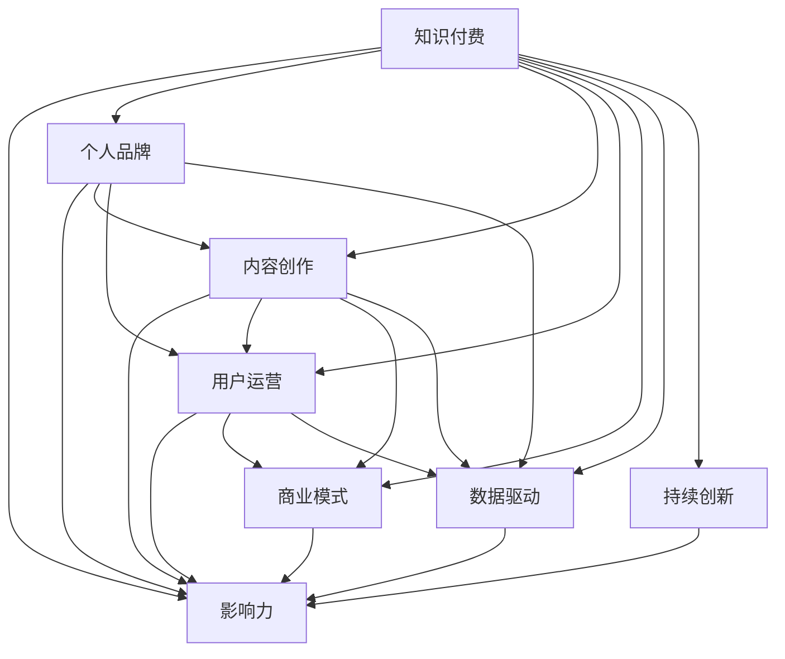

                 

# 如何打造个人知识付费影响力圈

> 关键词：知识付费, 影响力, 个人品牌, 内容创作, 用户运营, 商业模式, 数据驱动, 持续创新

## 1. 背景介绍

### 1.1 问题由来
在信息技术迅猛发展的今天，知识付费作为一种新兴的商业模式，正迅速崛起。与此同时，个人的知识影响力也得到了前所未有的重视。如何通过知识付费，将个人积累的专业知识和经验变现，成为越来越多专业人士的共同诉求。然而，伴随着知识付费市场的日益成熟，内容同质化、竞争激烈等问题也逐步显现。面对这一挑战，如何打造个人知识付费影响力圈，成为亟待探讨的课题。

### 1.2 问题核心关键点
打造个人知识付费影响力圈，需要从内容质量、用户运营、商业模式等多个维度进行全面优化，以实现影响力的最大化。具体而言：

1. **内容质量**：高质量的内容是吸引用户、形成影响力的基础。
2. **用户运营**：通过精准的用户画像、用户行为分析，实现精准营销。
3. **商业模式**：探索多种盈利模式，如订阅、打赏、付费课程等，提高收益。
4. **数据驱动**：利用数据分析，不断优化内容、提升用户体验。
5. **持续创新**：不断推出创新内容，满足用户多元化需求。

### 1.3 问题研究意义
打造个人知识付费影响力圈，对于提升个人品牌价值、实现知识变现、拓展职业发展空间具有重要意义：

1. 将专业知识转化为经济收入，实现知识变现。
2. 借助知识付费平台，提升个人知名度和行业影响力。
3. 通过与用户互动，构建信任关系，拓展职业发展机会。
4. 借助数据分析，精准把握用户需求，提升内容价值。
5. 在竞争中保持优势，构建个人独特的知识体系和品牌形象。

## 2. 核心概念与联系

### 2.1 核心概念概述

为更好地理解如何打造个人知识付费影响力圈，本节将介绍几个密切相关的核心概念：

- **知识付费**：指消费者为获得专业、高质量的知识内容而支付费用的商业模式。知识付费平台如得到、喜马拉雅、付费专栏等，提供了丰富多样的知识内容。
- **影响力**：指个体通过特定的行为、输出等，对他人的行为、态度、信念等产生显著影响的能力。在知识付费领域，影响力主要体现在用户获取、转化和粘性上。
- **个人品牌**：指个人在特定领域内建立的品牌形象和品牌价值，通常通过高质量的内容和独特的声音来体现。
- **内容创作**：指创作高质量、有价值的知识内容，包括文章、视频、音频等多种形式。内容创作是知识付费的核心环节。
- **用户运营**：指通过精准的用户画像、行为分析、营销策略等手段，实现用户获取、留存和转化的过程。
- **商业模式**：指知识付费平台和创作者之间的收益分配机制，包括订阅、打赏、付费课程等多种盈利方式。
- **数据驱动**：指利用数据分析，指导内容创作和用户运营的决策过程，提升运营效率和效果。
- **持续创新**：指不断推出创新内容、形式和互动方式，满足用户多样化的需求，保持竞争优势。

这些核心概念之间的逻辑关系可以通过以下Mermaid流程图来展示：



这个流程图展示了个体知识付费影响力圈的核心概念及其之间的关系：

1. 知识付费作为基础，通过内容创作形成个人品牌。
2. 个人品牌提升影响力，吸引用户并促成内容变现。
3. 用户运营帮助获取和留存用户，优化商业模式。
4. 数据驱动提升运营效率，持续创新吸引用户。

## 3. 核心算法原理 & 具体操作步骤
### 3.1 算法原理概述

打造个人知识付费影响力圈，本质上是一个内容创作、用户运营、数据分析、持续创新的综合性过程。其核心思想是：利用高质量的内容创作吸引用户，通过精准的用户运营提升用户粘性和转化率，运用数据驱动和持续创新保持竞争力，最终形成良性循环，构建个人知识付费影响力圈。

形式化地，假设知识付费平台的运营目标为最大化用户总价值。则可构建如下目标函数：

$$
Maximize \sum_{i=1}^N u_i(v_i)
$$

其中 $u_i$ 为用户 $i$，$v_i$ 为第 $i$ 个用户对平台的总价值。$u_i(v_i)$ 可以表示为：

$$
u_i(v_i) = c_i + b_i + r_i
$$

其中 $c_i$ 为用户的生命周期价值（CLV），$b_i$ 为用户的品牌价值，$r_i$ 为用户的推荐价值。

通过优化该目标函数，可以最大化平台的总用户价值。具体步骤如下：

### 3.2 算法步骤详解

**Step 1: 内容创作与个人品牌建设**
- **内容创作**：选择感兴趣的领域，深入研究，创作高质量的内容。内容可以是文章、视频、音频等，形式不限。
- **个人品牌建设**：建立个人品牌形象，明确个人定位，形成独特的声音和风格。例如通过社交媒体、博客等方式展示个人专业能力，提升知名度。

**Step 2: 用户画像与行为分析**
- **用户画像**：分析目标用户群体的特点，包括兴趣、年龄、职业等，以精准定位内容。
- **行为分析**：收集用户的行为数据，分析用户的活跃度、消费偏好等，以优化内容和运营策略。

**Step 3: 精准营销与用户体验优化**
- **精准营销**：基于用户画像和行为数据，设计精准的广告和推广策略，提高营销效果。
- **用户体验优化**：优化内容展现形式，提升用户体验，增加用户粘性。

**Step 4: 数据驱动与持续创新**
- **数据驱动**：定期收集和分析数据，包括用户行为、内容互动、收益情况等，优化内容和运营策略。
- **持续创新**：不断推出创新内容、形式和互动方式，满足用户多样化需求。

**Step 5: 盈利模式探索与优化**
- **盈利模式探索**：探索多种盈利模式，如订阅、打赏、付费课程等，根据用户需求和市场情况进行优化。
- **优化收益分配**：根据用户价值和内容价值，合理分配收益，提高平台和创作者的积极性。

### 3.3 算法优缺点

打造个人知识付费影响力圈，具备以下优点：
1. 利用高质量内容吸引用户，提高用户粘性和转化率。
2. 通过精准的用户运营策略，最大化用户总价值。
3. 数据驱动和持续创新，保持竞争力。
4. 多种盈利模式探索，提高收益。

同时，该方法也存在一定的局限性：
1. 对内容创作质量要求高，需持续投入时间和精力。
2. 用户画像和行为分析需大数据支持，对平台数据资源要求较高。
3. 持续创新需要团队协作和资源投入。
4. 盈利模式选择需结合市场和用户需求，需不断调整。

尽管存在这些局限性，但就目前而言，内容创作、用户运营、数据驱动和持续创新相结合的方法，仍是打造个人知识付费影响力圈的主流范式。未来相关研究的重点在于如何进一步优化运营效率，提高内容创作质量，探索更多盈利模式，同时兼顾数据安全和用户隐私保护等因素。

### 3.4 算法应用领域

个人知识付费影响力圈的构建，在知识付费、教育培训、医疗健康、法律咨询等多个领域都有广泛应用：

- **知识付费**：通过高质量内容吸引用户，构建个人品牌影响力，实现内容变现。
- **教育培训**：利用丰富的知识资源，提供专业培训课程，满足不同人群的个性化学习需求。
- **医疗健康**：提供健康咨询、疾病预防、用药指导等内容，提升健康水平。
- **法律咨询**：提供法律知识普及、案件分析等内容，帮助用户解决法律问题。
- **金融理财**：提供投资理财、财富管理等内容，帮助用户做出更好的财务决策。
- **职场发展**：提供职业规划、面试技巧、技能提升等内容，助力职业发展。

除了这些领域外，个人知识付费影响力圈的应用还将进一步拓展，为各行各业带来新的发展机遇。

## 4. 数学模型和公式 & 详细讲解 & 举例说明

### 4.1 数学模型构建

假设知识付费平台的运营目标为最大化用户总价值。则可构建如下目标函数：

$$
Maximize \sum_{i=1}^N u_i(v_i)
$$

其中 $u_i$ 为用户 $i$，$v_i$ 为第 $i$ 个用户对平台的总价值。$u_i(v_i)$ 可以表示为：

$$
u_i(v_i) = c_i + b_i + r_i
$$

其中 $c_i$ 为用户的生命周期价值（CLV），$b_i$ 为用户的品牌价值，$r_i$ 为用户的推荐价值。

### 4.2 公式推导过程

以CLV的计算为例，推导生命周期价值的公式。

假设用户 $i$ 在平台上的消费次数为 $n_i$，每次消费金额为 $p_i$，平台对用户 $i$ 的终身价值为 $c_i$。则有：

$$
c_i = \sum_{t=1}^T p_i(t) \cdot P_i(t)
$$

其中 $p_i(t)$ 为第 $t$ 次的消费金额，$P_i(t)$ 为第 $t$ 次消费的消费概率。

根据离散马尔可夫链的原理，可得：

$$
c_i = \frac{\sum_{t=1}^T p_i(t) \cdot P_i(t)}{\sum_{t=1}^T P_i(t)}
$$

### 4.3 案例分析与讲解

假设某知识付费平台，有用户 $A$、$B$、$C$ 分别在平台上购买内容。$A$ 购买次数为3次，每次消费100元；$B$ 购买2次，每次消费50元；$C$ 购买1次，消费200元。平台对 $A$、$B$、$C$ 的消费概率分别为 $P_A = 0.3$、$P_B = 0.2$、$P_C = 0.5$。

则 $A$、$B$、$C$ 的CLV分别为：

$$
c_A = \frac{3 \cdot 100 + 0 \cdot 0.7 + 0 \cdot 0.5}{0.3 + 0.7 + 0.5} = 400
$$

$$
c_B = \frac{2 \cdot 50 + 0 \cdot 0.7 + 0 \cdot 0.5}{0.3 + 0.7 + 0.5} = 100
$$

$$
c_C = \frac{200 + 0 \cdot 0.7 + 0 \cdot 0.5}{0.3 + 0.7 + 0.5} = 500
$$

平台的总CLV为：

$$
c_{total} = c_A + c_B + c_C = 400 + 100 + 500 = 1000
$$

## 5. 项目实践：代码实例和详细解释说明

### 5.1 开发环境搭建

在进行知识付费影响力圈构建的实践前，我们需要准备好开发环境。以下是使用Python进行Web开发的开发环境配置流程：

1. 安装Anaconda：从官网下载并安装Anaconda，用于创建独立的Python环境。

2. 创建并激活虚拟环境：
```bash
conda create -n web-env python=3.8 
conda activate web-env
```

3. 安装Flask：
```bash
pip install flask
```

4. 安装必要的第三方库：
```bash
pip install mysql-connector-python pandas sklearn
```

完成上述步骤后，即可在`web-env`环境中开始Web应用开发。

### 5.2 源代码详细实现

下面我们以在线课程推荐系统为例，给出使用Flask和MySQL进行用户画像与行为分析的Web应用代码实现。

首先，定义用户画像数据表：

```python
CREATE TABLE user_profile (
    user_id INT PRIMARY KEY AUTO_INCREMENT,
    age INT,
    gender VARCHAR(10),
    education VARCHAR(50),
    interests TEXT
)
```

然后，定义用户行为数据表：

```python
CREATE TABLE user_behavior (
    user_id INT PRIMARY KEY AUTO_INCREMENT,
    course_id INT,
    purchase_date DATE,
    purchase_amount DECIMAL(10, 2)
)
```

接着，定义用户画像查询和行为分析查询函数：

```python
import mysql.connector

def get_user_profile(user_id):
    conn = mysql.connector.connect(host='localhost', user='root', password='password', database='your_database')
    cursor = conn.cursor()
    query = "SELECT age, gender, education, interests FROM user_profile WHERE user_id = %s"
    cursor.execute(query, (user_id,))
    profile = cursor.fetchone()
    cursor.close()
    return profile

def get_user_behavior(user_id):
    conn = mysql.connector.connect(host='localhost', user='root', password='password', database='your_database')
    cursor = conn.cursor()
    query = "SELECT course_id, purchase_date, purchase_amount FROM user_behavior WHERE user_id = %s"
    cursor.execute(query, (user_id,))
    behavior = cursor.fetchall()
    cursor.close()
    return behavior
```

最后，定义课程推荐接口：

```python
from flask import Flask, request, jsonify

app = Flask(__name__)

@app.route('/recommend_courses', methods=['POST'])
def recommend_courses():
    user_id = request.json['user_id']
    profile = get_user_profile(user_id)
    behavior = get_user_behavior(user_id)
    
    # 根据用户画像和行为数据，推荐课程
    courses = recommend_courses(user_id, profile, behavior)
    
    return jsonify(courses)

if __name__ == '__main__':
    app.run(host='0.0.0.0', port=5000)
```

以上就是使用Flask和MySQL进行用户画像与行为分析的Web应用代码实现。可以看到，通过与MySQL数据库的集成，可以高效地获取和分析用户数据，支持内容的推荐和优化。

### 5.3 代码解读与分析

让我们再详细解读一下关键代码的实现细节：

**用户画像数据表定义**：
- 定义了用户的基本信息和兴趣，这些信息将用于精准定位内容。

**用户行为数据表定义**：
- 记录了用户在平台上的购买行为，包括课程ID、购买日期、购买金额等，用于计算生命周期价值。

**用户画像查询函数**：
- 从用户画像数据表中获取指定用户的基本信息和兴趣。

**用户行为分析查询函数**：
- 从用户行为数据表中获取指定用户的购买行为数据。

**课程推荐接口**：
- 接收用户ID，通过调用用户画像查询和行为分析函数，获取用户基本信息和购买行为数据。
- 根据用户画像和行为数据，推荐合适的课程。
- 返回推荐课程的列表。

可以看到，通过Flask和MySQL的整合，可以高效地实现用户画像与行为分析，为课程推荐提供了数据支持。

## 6. 实际应用场景

### 6.1 智能课程推荐

基于用户画像与行为分析的课程推荐系统，可以广泛应用于知识付费平台。通过精准定位用户兴趣和消费行为，推荐合适的课程，提升用户购买率和满意度。

在技术实现上，可以结合用户画像和行为数据，设计多维度的课程推荐策略，如协同过滤、基于内容的推荐、混合推荐等，实现更加精准和多样化的课程推荐。

### 6.2 个性化学习平台

智能学习平台可以利用用户画像和行为数据，提供个性化学习方案，提升学习效果。例如根据用户的学习进度、偏好等，推荐合适的学习资源，调整学习计划。

在技术实现上，可以通过机器学习算法，预测用户的学习需求和行为，实现个性化的学习推荐和智能辅导。

### 6.3 智能搜索与内容分发

知识付费平台的智能搜索和内容分发系统，可以利用用户画像和行为数据，提升搜索结果的相关性和精准度，优化内容展示效果。例如根据用户的历史浏览和购买记录，推荐相关的课程和文章。

在技术实现上，可以通过自然语言处理、推荐算法等技术，提升搜索和内容分发的智能化水平。

### 6.4 未来应用展望

随着知识付费市场的不断成熟，基于用户画像与行为分析的应用将更加广泛。未来，基于大数据和人工智能技术，将出现更多的应用场景，如智能健康顾问、个性化医疗推荐等，为各行各业带来新的发展机遇。

在医疗健康领域，智能健康顾问可以利用用户画像和行为数据，提供个性化的健康建议和咨询，提升用户的健康水平。在金融理财领域，个性化理财顾问可以利用用户画像和行为数据，提供个性化的理财建议，帮助用户做出更好的财务决策。

## 7. 工具和资源推荐

### 7.1 学习资源推荐

为了帮助开发者系统掌握知识付费影响力圈的理论基础和实践技巧，这里推荐一些优质的学习资源：

1. **《知识付费商业化手册》**：深入解析知识付费的商业模式、用户运营策略等，提供实战案例和经验分享。

2. **《影响力：引爆增长的底层逻辑》**：系统讲解如何通过影响力策略，构建个人品牌和商业价值。

3. **《内容创作心理学》**：从心理学角度分析内容创作的心理动机和用户偏好，提升内容创作质量。

4. **《用户行为分析》**：讲解用户行为分析的理论基础和方法，提升数据驱动运营的效率。

5. **《Flask Web开发实战》**：全面介绍Flask框架的使用，提供丰富的代码实例和实战项目。

6. **《MySQL数据库基础教程》**：系统讲解MySQL数据库的基础知识、操作技巧和优化方法。

通过对这些资源的学习实践，相信你一定能够快速掌握知识付费影响力圈的核心技能，并用于解决实际的运营问题。

### 7.2 开发工具推荐

高效的开发离不开优秀的工具支持。以下是几款用于知识付费影响力圈开发的常用工具：

1. **Flask**：轻量级的Web开发框架，易于上手，适合快速开发原型。
2. **MySQL**：稳定可靠的关系型数据库，适合存储和查询用户数据。
3. **Pandas**：强大的数据处理和分析库，适合进行数据清洗和可视化。
4. **Scikit-learn**：常用的机器学习库，适合进行用户画像和行为分析。
5. **TensorFlow**：深度学习框架，适合进行用户行为预测和推荐系统设计。
6. **Jupyter Notebook**：交互式编程环境，适合进行数据探索和算法验证。

合理利用这些工具，可以显著提升知识付费影响力圈开发的效率，加快创新迭代的步伐。

### 7.3 相关论文推荐

知识付费和用户画像研究领域的研究成果众多，以下是几篇奠基性的相关论文，推荐阅读：

1. **《知识付费的市场机制研究》**：系统研究知识付费的市场机制、用户行为等，提出相关策略和建议。
2. **《基于用户画像的个性化推荐系统研究》**：详细分析用户画像和个性化推荐系统的原理，提供算法和实现方法。
3. **《知识付费用户留存率研究》**：研究知识付费用户的留存率影响因素，提出优化策略。
4. **《知识付费平台的商业模式创新研究》**：探索知识付费平台的多种盈利模式，提供创新思路。
5. **《基于大数据的用户画像研究》**：系统分析大数据技术在用户画像中的应用，提供数据驱动的运营方法。

这些论文代表了大数据和知识付费领域的最新进展，通过学习这些前沿成果，可以帮助研究者把握学科前进方向，激发更多的创新灵感。

## 8. 总结：未来发展趋势与挑战

### 8.1 总结

本文对如何打造个人知识付费影响力圈进行了全面系统的介绍。首先阐述了知识付费和用户运营的重要性，明确了内容创作、用户画像、行为分析、用户运营、商业模式、数据驱动和持续创新等多个关键环节。通过构建用户画像与行为分析的数学模型，详细讲解了用户画像与行为分析的算法原理和具体操作步骤，并提供了代码实现和分析。同时，本文还广泛探讨了知识付费影响力圈在多个行业领域的应用前景，展示了其广阔的发展空间。

通过本文的系统梳理，可以看到，知识付费和用户运营技术的不断发展，为打造个人知识付费影响力圈提供了强有力的支持。高效的内容创作、精准的用户运营和持续的创新，将成为构建个人知识付费影响力圈的重要驱动力。未来，伴随大数据和人工智能技术的进步，知识付费和用户运营技术必将迎来新的突破，为构建更加智能化、普适化的知识付费平台铺平道路。

### 8.2 未来发展趋势

展望未来，知识付费和用户运营技术将呈现以下几个发展趋势：

1. **内容创作智能化**：基于自然语言处理和大数据技术，内容创作将更加智能化，满足用户多样化的需求。例如自动生成文章、视频脚本等。
2. **用户画像精准化**：通过深度学习和数据挖掘技术，用户画像将更加精准，实现个性化的内容推荐。例如利用用户的行为数据、社交网络等构建多维度的用户画像。
3. **用户行为预测化**：通过机器学习和大数据分析，用户行为预测将更加准确，实现个性化的用户运营。例如利用时间序列分析、关联规则挖掘等技术预测用户行为。
4. **知识付费多样化**：知识付费模式将更加多样化，涵盖订阅、打赏、付费课程、知识服务等多种形式。例如利用区块链技术进行知识版权保护和收益分配。
5. **平台智能化**：知识付费平台将更加智能化，利用人工智能技术提升用户体验。例如基于自然语言处理技术的智能客服、基于机器学习技术的推荐系统等。
6. **数据安全保障**：随着知识付费平台的发展，数据安全和隐私保护将成为重要课题。例如利用数据加密、匿名化等技术保障用户数据安全。

以上趋势凸显了知识付费和用户运营技术的广阔前景。这些方向的探索发展，必将进一步提升知识付费平台的运营效率，增强用户粘性，提高内容质量和用户体验。

### 8.3 面临的挑战

尽管知识付费和用户运营技术已经取得了显著进展，但在迈向更加智能化、普适化应用的过程中，仍面临诸多挑战：

1. **数据隐私和安全**：用户数据的隐私和安全问题依然严峻，如何保障用户数据的安全，避免数据泄露和滥用，是一个重大挑战。
2. **内容质量控制**：高质量的内容创作仍需大量时间和资源投入，如何提升内容创作效率，保障内容质量，是一个重要课题。
3. **用户行为预测的准确性**：用户行为预测的准确性受多种因素影响，如何提升预测的准确性和鲁棒性，是一个关键问题。
4. **多模态数据融合**：利用文本、语音、图像等多模态数据提升用户画像和行为分析的效果，是一个有待解决的问题。
5. **知识付费平台的盈利模式**：如何在知识付费市场激烈竞争的情况下，探索可持续的盈利模式，是一个需要深入研究的课题。
6. **平台的用户体验**：如何提升知识付费平台的用户体验，提升用户满意度和忠诚度，是一个长期的任务。

这些挑战需要各方面的协同努力，通过技术创新和管理优化，才能实现知识付费平台的持续发展。

### 8.4 研究展望

面对知识付费和用户运营技术的挑战，未来的研究需要在以下几个方面寻求新的突破：

1. **多模态数据融合**：探索利用多模态数据提升用户画像和行为分析的效果，提升预测的准确性和鲁棒性。
2. **智能内容创作**：利用自然语言处理和生成技术，提升内容创作效率和质量。例如利用预训练模型进行文章生成、视频脚本创作等。
3. **数据隐私和安全**：研究数据隐私保护和数据安全技术，保障用户数据的安全和隐私。例如利用数据加密、匿名化等技术，保障用户数据的安全。
4. **知识付费平台的多元化**：探索多种知识付费模式，结合区块链、去中心化等技术，提升平台的盈利能力和用户粘性。
5. **用户体验优化**：通过界面设计、交互设计等手段，提升知识付费平台的用户体验，提升用户满意度和忠诚度。

这些研究方向将推动知识付费和用户运营技术的不断进步，为知识付费平台的智能化、普适化发展提供强有力的支持。

## 9. 附录：常见问题与解答

**Q1：如何构建高效的用户画像？**

A: 构建高效的用户画像需要考虑多维度的信息，包括用户的兴趣、年龄、性别、职业等。可以通过数据分析、问卷调查、行为分析等多种方式，获取和处理用户数据。例如利用自然语言处理技术分析用户的文本数据，获取兴趣和偏好信息。利用机器学习算法预测用户的行为和需求，实现个性化的内容推荐。

**Q2：如何提高知识付费内容的点击率和转化率？**

A: 提高知识付费内容的点击率和转化率，需要从多个方面入手：
1. 内容质量：创作高质量、有价值的内容，满足用户需求。
2. 用户画像：精准定位用户需求，设计有针对性的内容。
3. 精准营销：利用数据分析，设计精准的广告和推广策略。
4. 用户体验：优化内容展示和交互设计，提升用户满意度。
5. 持续优化：根据用户反馈和行为数据，不断优化内容策略，提高效果。

**Q3：如何利用数据驱动进行用户运营？**

A: 利用数据驱动进行用户运营，需要收集和分析用户的行为数据，包括浏览记录、购买行为、反馈等。通过数据分析，识别用户的兴趣和需求，设计个性化的内容推荐和运营策略。例如利用用户行为数据进行精准推荐，利用用户反馈进行内容优化。同时，利用数据监测平台，实时监控运营效果，及时调整策略，实现运营效率的提升。

**Q4：知识付费影响力圈面临的主要挑战是什么？**

A: 知识付费影响力圈面临的主要挑战包括：
1. 数据隐私和安全问题。用户数据的隐私和安全需要得到充分的保障，避免数据泄露和滥用。
2. 内容创作质量控制。高质量的内容创作仍需大量时间和资源投入，如何提升内容创作效率和质量是一个重要课题。
3. 用户行为预测的准确性。用户行为预测的准确性受多种因素影响，如何提升预测的准确性和鲁棒性是一个关键问题。
4. 多模态数据融合。利用文本、语音、图像等多模态数据提升用户画像和行为分析的效果，是一个有待解决的问题。
5. 平台盈利模式的多样化。如何在知识付费市场激烈竞争的情况下，探索可持续的盈利模式是一个需要深入研究的课题。
6. 用户体验优化。如何提升知识付费平台的用户体验，提升用户满意度和忠诚度是一个长期的任务。

通过这些回答，可以看到，构建知识付费影响力圈需要综合考虑内容创作、用户画像、行为分析、用户运营、商业模式、数据驱动和持续创新等多个环节，同时需要面对数据隐私、内容质量、用户预测、多模态融合、盈利模式、用户体验等多个挑战，需要各方面的协同努力，才能实现知识付费平台的持续发展。

---

作者：禅与计算机程序设计艺术 / Zen and the Art of Computer Programming

