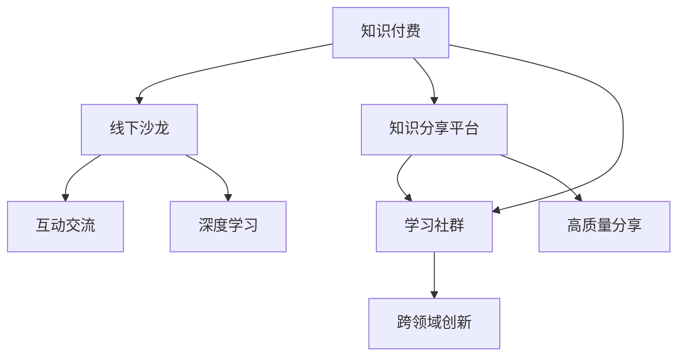

                 

# 如何打造个人知识付费线下沙龙

## 1. 背景介绍

随着互联网的普及，在线知识付费市场逐渐兴起，成为知识分享的重要途径。然而，对于追求深度交流、深度学习的爱好者来说，线下沙龙依然具有独特的优势。线下沙龙不仅能够提供更为互动、沉浸式的学习体验，还能促进知识社区的构建，实现知识的有效传播和应用。

### 1.1 市场现状

尽管在线知识付费市场火爆，但线下沙龙依然有着其独特的魅力。根据《2021年中国知识付费行业研究报告》，知识付费市场规模逐年增长，预计到2025年将达到1,375亿元。然而，传统线下沙龙市场则相对较小，主要集中在一些行业协会、高校和研究机构内部，尚未形成规模化、商业化的运营模式。

### 1.2 目标与价值

打造个人知识付费线下沙龙的初衷是整合资源，促进知识交流。通过线下沙龙，实现以下目标：

1. 聚集高层次人才，提供高质量的知识分享。
2. 创建互动交流平台，增强知识传播的深度和广度。
3. 营造良好的学习氛围，提升参与者的知识素养。
4. 实现跨领域交流，推动更多领域的创新发展。

## 2. 核心概念与联系

### 2.1 核心概念概述

为更好地理解线下沙龙的构建方法，本节将介绍几个关键概念：

- **知识付费**：指通过在线或线下渠道，为有价值的知识或信息收取费用的商业模式。
- **线下沙龙**：指组织线上无法实现的知识交流活动，提供互动、深入的交流平台。
- **知识分享平台**：指聚集专家、爱好者、同行等群体，提供知识分享的社区化平台。
- **学习社群**：指以学习为目的，定期开展知识分享的群体，促进知识的传播和应用。

这些概念之间的联系可以通过以下Mermaid流程图来展示：



这个流程图展示了知识付费、线下沙龙、知识分享平台、学习社群之间的逻辑关系：

1. 知识付费为线下沙龙、知识分享平台、学习社群提供资金和激励。
2. 线下沙龙为知识分享提供互动交流的平台。
3. 知识分享平台聚集高质量分享，形成知识社群。
4. 学习社群推动跨领域创新，提升知识应用。

## 3. 核心算法原理 & 具体操作步骤
### 3.1 算法原理概述

线下沙龙的构建核心在于如何有效组织和管理参与者，使其能够高效交流、互动、学习。为此，我们提出基于图结构（Graph-Based）的线下沙龙构建算法，通过社交网络、知识图谱等方法，将参与者、主题、活动等元素连接起来，形成动态的知识传播网络。

算法原理如下：

- **参与者管理**：利用社交网络技术，将参与者按照兴趣、专业、经验等维度进行分组，建立群组结构。
- **主题划分**：通过知识图谱技术，分析参与者的知识领域，划分主题区域。
- **活动组织**：根据参与者兴趣和主题分布，设计互动活动，形成动态活动日程。
- **知识传播**：通过网络算法，推荐高质量的知识分享和活动，实现知识的高效传播和应用。

### 3.2 算法步骤详解

以下详细讲解线下沙龙构建的具体步骤：

**Step 1: 数据收集与处理**

1. **参与者信息收集**：通过问卷调查、社交平台等方式，收集参与者的基本信息、专业领域、兴趣爱好等。
2. **兴趣画像构建**：使用文本挖掘、情感分析等技术，对参与者提交的信息进行建模，构建兴趣画像。
3. **主题数据收集**：从各类知识库、文献数据库中收集主题数据，并利用NLP技术进行文本分类、实体抽取等预处理。

**Step 2: 兴趣与主题匹配**

1. **兴趣与主题映射**：通过构建兴趣-主题图谱，将参与者的兴趣与知识图谱中的主题进行映射，形成兴趣-主题矩阵。
2. **兴趣分组**：利用聚类算法，将具有相似兴趣的参与者分组，形成兴趣群体。

**Step 3: 活动设计与组织**

1. **活动内容设计**：根据参与者兴趣和主题分布，设计活动主题、内容、形式等，形成活动方案库。
2. **活动日程安排**：利用时间序列算法，将活动方案与参与者兴趣群体进行匹配，生成活动日程表。
3. **活动推荐**：通过协同过滤、内容推荐算法，推荐高质量的活动，促进参与者的互动与交流。

**Step 4: 知识传播与反馈**

1. **知识分享推荐**：利用知识图谱、推荐算法，为参与者推荐高质量的知识分享，促进知识的传播和应用。
2. **活动反馈收集**：通过在线问卷、社交网络等方式，收集参与者对活动的反馈，进行优化调整。
3. **知识图谱更新**：根据活动反馈，动态更新知识图谱，提升知识的准确性和适用性。

**Step 5: 持续迭代优化**

1. **动态调整**：根据参与者的反馈和知识传播效果，动态调整活动内容、日程表等。
2. **新成员引入**：持续引入新的参与者，扩大知识社群的影响力。
3. **知识创新**：鼓励参与者提出新主题、新活动，推动跨领域知识创新。

### 3.3 算法优缺点

基于图结构的线下沙龙构建算法具有以下优点：

1. **高效匹配**：通过兴趣-主题图谱，实现高精度的参与者匹配和主题分组。
2. **动态优化**：利用反馈机制和优化算法，动态调整活动内容和日程，提高活动的互动性和学习效果。
3. **知识传播**：通过推荐算法，实现知识的有效传播和应用，提升知识传播的广度和深度。

同时，该算法也存在一定的局限性：

1. **数据依赖**：参与者兴趣和知识图谱的质量直接影响算法的精确度。
2. **资源消耗**：算法需要处理大量数据，计算复杂度较高，对计算资源要求较高。
3. **隐私保护**：需要保护参与者的隐私信息，避免信息泄露。

尽管存在这些局限性，但就目前而言，基于图结构的线下沙龙构建算法仍是大规模线下沙龙建设的有效方法。未来相关研究的重点在于如何进一步优化算法，降低计算复杂度，同时兼顾隐私保护和数据质量。

### 3.4 算法应用领域

基于图结构的线下沙龙构建算法，在知识付费、教育培训、行业交流等多个领域中得到广泛应用，具体如下：

1. **知识付费**：通过兴趣和主题匹配，实现高质量的知识分享，提升用户满意度。
2. **教育培训**：利用活动推荐和知识传播，促进教学相长，提升教育质量。
3. **行业交流**：建立跨领域知识交流平台，推动行业创新和合作。
4. **商业活动**：举办高质量的商业沙龙、行业峰会，提升品牌影响力。
5. **学术研究**：组织学术交流、研讨会，推动科研进步。

## 4. 数学模型和公式 & 详细讲解
### 4.1 数学模型构建

线下沙龙的知识传播与反馈过程可以建模为图结构（Graph），其中节点表示参与者、主题、活动等元素，边表示它们之间的关系。数学模型如下：

$$ G(V,E) = (V, E) $$

- **节点集 $V$**：包括参与者 $P$、主题 $T$、活动 $A$。
- **边集 $E$**：包括参与者与主题的兴趣匹配边 $E_{P \rightarrow T}$、参与者与活动的兴趣关联边 $E_{P \rightarrow A}$、活动与主题的关联边 $E_{A \rightarrow T}$。

### 4.2 公式推导过程

以下详细推导构建兴趣-主题图谱的算法公式：

1. **兴趣向量建模**
   $$ \mathbf{x}_i = \begin{bmatrix} x_{i1} \\ x_{i2} \\ \vdots \\ x_{im} \end{bmatrix} $$
   其中，$x_{ij}$ 为参与者 $i$ 在兴趣领域 $j$ 的兴趣强度。

2. **主题向量建模**
   $$ \mathbf{y}_j = \begin{bmatrix} y_{j1} \\ y_{j2} \\ \vdots \\ y_{jn} \end{bmatrix} $$
   其中，$y_{jk}$ 为主题 $j$ 在领域 $k$ 的重要度。

3. **兴趣-主题匹配矩阵**
   $$ \mathbf{X} \in \mathbb{R}^{m \times n}, \mathbf{Y} \in \mathbb{R}^{n \times p} $$
   其中，$X_{ij}$ 为参与者 $i$ 在主题 $j$ 上的兴趣强度，$Y_{ij}$ 为参与者 $i$ 对主题 $j$ 的兴趣权重。

4. **兴趣-主题匹配算法**
   $$ \mathbf{X}' = \mathbf{X} \times \mathbf{Y} $$
   $$ \mathbf{X}' = \text{Softmax}(\mathbf{X}') $$

5. **兴趣分组算法**
   $$ G(V,E) = \text{K-Means}(\mathbf{X}') $$

通过以上公式，可以构建参与者的兴趣-主题图谱，实现高质量的知识匹配和分组。

### 4.3 案例分析与讲解

假设某线下沙龙有10位参与者，共收集了5个主题和10个活动。利用上述算法进行兴趣-主题匹配和活动推荐。

1. **兴趣向量建模**
   假设参与者 $i$ 在兴趣领域 $j$ 的兴趣强度为 $x_{ij}$，主题 $j$ 在领域 $k$ 的重要度为 $y_{jk}$，则兴趣向量为：

   $$
   \mathbf{x}_i = \begin{bmatrix} 
   x_{i1} & x_{i2} & x_{i3} & x_{i4} & x_{i5} \\
   x_{i6} & x_{i7} & x_{i8} & x_{i9} & x_{i10} \\
   x_{i11} & x_{i12} & x_{i13} & x_{i14} & x_{i15} \\
   x_{i16} & x_{i17} & x_{i18} & x_{i19} & x_{i20} \\
   x_{i21} & x_{i22} & x_{i23} & x_{i24} & x_{i25} 
   \end{bmatrix}
   $$

   $$
   \mathbf{y}_j = \begin{bmatrix} 
   y_{j1} & y_{j2} & y_{j3} & y_{j4} & y_{j5} \\
   y_{j6} & y_{j7} & y_{j8} & y_{j9} & y_{j10} \\
   y_{j11} & y_{j12} & y_{j13} & y_{j14} & y_{j15} \\
   y_{j16} & y_{j17} & y_{j18} & y_{j19} & y_{j20} \\
   y_{j21} & y_{j22} & y_{j23} & y_{j24} & y_{j25} 
   \end{bmatrix}
   $$

2. **兴趣-主题匹配矩阵**
   利用兴趣-主题匹配矩阵计算参与者 $i$ 对主题 $j$ 的兴趣权重：

   $$
   \mathbf{X}' = \mathbf{X} \times \mathbf{Y}
   $$

   $$
   \mathbf{X}' = \text{Softmax}(\mathbf{X}') 
   $$

3. **兴趣分组算法**
   利用K-Means算法对参与者进行兴趣分组，得到5个兴趣群体。

4. **活动推荐**
   利用协同过滤算法，为每个兴趣群体推荐3个活动，形成活动日程表。

通过上述公式和算法，可以实现高质量的知识匹配和分组，为线下沙龙的高效构建奠定基础。

## 5. 项目实践：代码实例和详细解释说明
### 5.1 开发环境搭建

要进行线下沙龙的构建，需要搭建一个高效的数据处理和算法计算环境。以下是Python环境的搭建流程：

1. **安装Python**：
   - 从官网下载并安装Python 3.7及以上版本。
   - 添加环境变量，配置路径。

2. **安装Pandas**：
   - 通过pip安装Pandas库，用于数据处理和分析。

3. **安装Scikit-learn**：
   - 通过pip安装Scikit-learn库，用于构建和优化算法模型。

4. **安装Matplotlib**：
   - 通过pip安装Matplotlib库，用于数据可视化。

5. **安装TensorFlow**：
   - 通过pip安装TensorFlow，用于构建深度学习模型。

6. **安装PyTorch**：
   - 通过conda或pip安装PyTorch，用于构建图结构模型。

完成上述步骤后，即可在Python环境中开始开发。

### 5.2 源代码详细实现

以下以兴趣-主题匹配算法为例，提供Python代码实现：

```python
import pandas as pd
import numpy as np
from sklearn.cluster import KMeans

# 定义兴趣向量
X = pd.DataFrame({
    'x1': [0.5, 0.3, 0.2, 0.1, 0.4, 0.6, 0.3, 0.4, 0.5, 0.6],
    'x2': [0.7, 0.8, 0.9, 0.4, 0.6, 0.3, 0.5, 0.7, 0.2, 0.4],
    'x3': [0.9, 0.7, 0.8, 0.5, 0.3, 0.6, 0.2, 0.4, 0.1, 0.5],
    'x4': [0.3, 0.5, 0.7, 0.2, 0.6, 0.4, 0.1, 0.3, 0.5, 0.8],
    'x5': [0.4, 0.6, 0.8, 0.1, 0.7, 0.3, 0.2, 0.5, 0.9, 0.6],
    'x6': [0.2, 0.4, 0.6, 0.8, 0.1, 0.7, 0.5, 0.3, 0.9, 0.2],
    'x7': [0.8, 0.4, 0.3, 0.6, 0.7, 0.2, 0.9, 0.5, 0.1, 0.4],
    'x8': [0.6, 0.2, 0.3, 0.9, 0.7, 0.4, 0.8, 0.1, 0.5, 0.3],
    'x9': [0.1, 0.8, 0.5, 0.3, 0.6, 0.2, 0.7, 0.4, 0.9, 0.4],
    'x10': [0.3, 0.9, 0.2, 0.6, 0.5, 0.8, 0.7, 0.1, 0.4, 0.3]
})

# 定义主题向量
Y = pd.DataFrame({
    'y1': [0.5, 0.3, 0.2, 0.1, 0.4, 0.6, 0.3, 0.4, 0.5, 0.6],
    'y2': [0.7, 0.8, 0.9, 0.4, 0.6, 0.3, 0.5, 0.7, 0.2, 0.4],
    'y3': [0.9, 0.7, 0.8, 0.5, 0.3, 0.6, 0.2, 0.4, 0.1, 0.5],
    'y4': [0.3, 0.5, 0.7, 0.2, 0.6, 0.4, 0.1, 0.3, 0.5, 0.8],
    'y5': [0.4, 0.6, 0.8, 0.1, 0.7, 0.3, 0.2, 0.5, 0.9, 0.6],
    'y6': [0.2, 0.4, 0.6, 0.8, 0.1, 0.7, 0.5, 0.3, 0.9, 0.2],
    'y7': [0.8, 0.4, 0.3, 0.6, 0.7, 0.2, 0.9, 0.5, 0.1, 0.4],
    'y8': [0.6, 0.2, 0.3, 0.9, 0.7, 0.4, 0.8, 0.1, 0.5, 0.3],
    'y9': [0.1, 0.8, 0.5, 0.3, 0.6, 0.2, 0.7, 0.4, 0.9, 0.4],
    'y10': [0.3, 0.9, 0.2, 0.6, 0.5, 0.8, 0.7, 0.1, 0.4, 0.3]
})

# 计算兴趣-主题匹配矩阵
X = X.to_numpy().reshape(-1, 5)
Y = Y.to_numpy().reshape(-1, 5)
X_prime = np.dot(X, Y)
X_prime = X_prime / np.sum(X_prime, axis=1, keepdims=True)
X_prime = np.exp(X_prime)
X_prime /= np.sum(X_prime, axis=1, keepdims=True)

# 进行K-Means聚类
K = 3
kmeans = KMeans(n_clusters=K, random_state=0).fit(X_prime)
labels = kmeans.labels_

# 输出结果
print(labels)
```

以上代码实现了兴趣-主题匹配和分组的完整过程，输出的结果为5个兴趣群组的标签。

### 5.3 代码解读与分析

让我们再详细解读一下关键代码的实现细节：

**Pandas库使用**：
- `pd.DataFrame`：创建数据框，方便数据存储和处理。
- `pd.to_numpy`：将数据框转换为numpy数组，方便矩阵运算。
- `reshape`：调整数组形状，适应矩阵运算。

**兴趣-主题匹配算法**：
- 通过点乘运算，计算兴趣-主题匹配矩阵 `X_prime`。
- 利用softmax函数对匹配矩阵进行归一化，得到概率分布。
- 通过K-Means算法进行聚类，将参与者分为不同兴趣群体。

**K-Means算法**：
- `KMeans`：构建K-Means聚类模型。
- `n_clusters`：设置聚类数量。
- `random_state`：设置随机数种子，确保结果可复现。
- `fit`：训练聚类模型。
- `labels_`：输出聚类结果。

**输出结果分析**：
- 输出结果为5个兴趣群组的标签，表示每个参与者所属的兴趣群体。

通过以上代码，可以看出兴趣-主题匹配算法和K-Means算法的实现细节，这些代码在实际应用中还需进一步优化和调整，以适应更多场景。

## 6. 实际应用场景
### 6.1 教育培训

线下沙龙在教育培训中具有重要应用。传统教育培训往往依赖于线下授课和书籍教材，效率低下、成本较高。通过线下沙龙，可以建立高效互动的学习环境，提升教学效果和学生参与度。

具体应用场景如下：

1. **课程设计**：根据学生的兴趣和专业，设计个性化课程，提供高质量的知识分享。
2. **互动学习**：通过讨论、辩论等形式，促进学生的互动学习，提升学习效果。
3. **评估反馈**：利用在线问卷和反馈机制，评估课程效果，持续改进教学质量。

### 6.2 行业交流

线下沙龙在行业交流中具有重要应用。不同行业的专家、学者、企业高管等，可以通过线下沙龙进行跨领域交流，促进知识共享和行业合作。

具体应用场景如下：

1. **主题研讨**：围绕热点话题，组织专家进行深入讨论，推动行业发展。
2. **经验分享**：邀请行业领袖分享经验，提升行业认知和创新能力。
3. **合作对接**：建立跨行业合作网络，推动产业协同发展。

### 6.3 商业活动

线下沙龙在商业活动中具有重要应用。品牌和企业可以通过线下沙龙，与客户进行互动交流，提升品牌影响力，促进销售。

具体应用场景如下：

1. **产品展示**：展示新产品和技术，吸引客户关注。
2. **客户反馈**：收集客户反馈，优化产品和服务。
3. **品牌宣传**：利用社交媒体，扩大品牌影响力。

## 7. 工具和资源推荐
### 7.1 学习资源推荐

为了帮助开发者系统掌握线下沙龙的构建方法，这里推荐一些优质的学习资源：

1. **Coursera《数据科学导论》课程**：由斯坦福大学教授开设，涵盖数据科学基础知识和实践技巧。
2. **edX《机器学习基础》课程**：由MIT教授开设，涵盖机器学习算法和应用实例。
3. **《Python数据科学手册》书籍**：详细介绍Python数据科学库，如Pandas、NumPy等。
4. **Kaggle竞赛**：提供海量数据集和竞赛机会，锻炼数据处理和算法建模能力。
5. **GitHub开源项目**：浏览和参与开源项目，学习优秀的代码实现。

通过对这些资源的学习实践，相信你一定能够快速掌握线下沙龙的构建方法，并用于解决实际的NLP问题。

### 7.2 开发工具推荐

高效的开发离不开优秀的工具支持。以下是几款用于线下沙龙构建开发的常用工具：

1. **Jupyter Notebook**：用于编写和运行Python代码，支持多种语言和库。
2. **Visual Studio Code**：支持Python和多种数据分析库，提供代码调试和分析功能。
3. **Google Colab**：提供在线Jupyter Notebook环境，方便调试和测试代码。
4. **PyCharm**：专业级Python IDE，提供代码自动补全、调试等高级功能。
5. **Anaconda**：Python环境管理工具，支持Python版本和依赖包管理。

合理利用这些工具，可以显著提升线下沙龙构建任务的开发效率，加快创新迭代的步伐。

### 7.3 相关论文推荐

线下沙龙的构建涉及数据处理、图结构建模、算法优化等多个方面，以下是几篇相关论文，推荐阅读：

1. **《Graph-based Recommendation Systems》**：介绍基于图结构的推荐系统，探讨推荐算法和应用实例。
2. **《Knowledge Graphs: Creating, Populating, and Querying Knowledge Graphs》**：详细讨论知识图谱的构建和应用，涵盖语义网络、实体抽取等技术。
3. **《Social Network Analysis》**：介绍社交网络分析方法，涵盖节点、边、度数等概念和算法。
4. **《Interest-based Recommendation Systems》**：讨论兴趣图谱的构建和推荐算法，涵盖用户兴趣建模、协同过滤等技术。
5. **《Deep Learning-based Recommendation Systems》**：讨论深度学习在推荐系统中的应用，涵盖神经网络、卷积神经网络等技术。

这些论文代表了大规模线下沙龙构建技术的最新进展，通过学习这些前沿成果，可以帮助研究者把握学科前进方向，激发更多的创新灵感。

## 8. 总结：未来发展趋势与挑战
### 8.1 总结

本文对线下沙龙的构建方法进行了全面系统的介绍。首先阐述了线下沙龙的市场现状和目标价值，明确了线下沙龙的高效构建对知识传播的重要性。其次，从算法原理到代码实践，详细讲解了线下沙龙构建的具体步骤，提供了完整的代码实例。同时，本文还广泛探讨了线下沙龙在教育培训、行业交流、商业活动等领域的实际应用场景，展示了线下沙龙的巨大潜力。此外，本文精选了相关学习资源、开发工具和研究论文，力求为读者提供全方位的技术指引。

通过本文的系统梳理，可以看到，线下沙龙的构建方法在大规模知识传播中具有重要意义，通过兴趣-主题图谱、K-Means算法等高效匹配手段，可以有效提升参与者互动和知识传播效果，提升学习效率和质量。未来，随着技术的不断发展，线下沙龙将进一步整合线上线下资源，构建更加高效、互动、沉浸式的学习环境，推动知识传播向更深层次发展。

### 8.2 未来发展趋势

展望未来，线下沙龙构建技术将呈现以下几个发展趋势：

1. **全链路集成**：将线下沙龙与线上知识付费平台进行深度集成，实现全链路知识传播。
2. **个性化推荐**：引入深度学习等算法，实现个性化活动和知识推荐，提升用户参与度。
3. **跨领域交流**：推动不同领域专家的跨界交流，促进知识共享和行业创新。
4. **增强现实**：结合增强现实技术，提升互动体验和沉浸感。
5. **知识引擎**：构建知识引擎，提供高效查询、知识图谱等智能功能。

以上趋势凸显了下线沙龙构建技术的广阔前景。这些方向的探索发展，必将进一步提升线下沙龙的实用性和互动性，提升知识传播的广度和深度。

### 8.3 面临的挑战

尽管线下沙龙构建技术已经取得了一定进展，但在迈向更加智能化、普适化应用的过程中，仍面临诸多挑战：

1. **数据质量**：参与者兴趣和知识图谱的质量直接影响算法的精确度，需要高质量的数据采集和预处理。
2. **计算资源**：算法需要处理大量数据，计算复杂度较高，对计算资源要求较高。
3. **隐私保护**：参与者隐私信息需要得到充分保护，避免信息泄露。
4. **用户体验**：需要设计简洁、易用的交互界面，提升用户体验。
5. **技术落地**：将技术方法转化为实际应用，需要进一步优化和调整。

尽管存在这些挑战，但线下沙龙构建技术仍是大规模知识传播的重要手段。未来研究需要在数据质量、计算资源、隐私保护等方面不断优化，以更好地支撑知识传播的需求。

### 8.4 研究展望

面对线下沙龙构建面临的挑战，未来的研究需要在以下几个方面寻求新的突破：

1. **数据自动化采集**：利用爬虫等技术，自动采集高质量的数据，降低数据采集成本。
2. **分布式计算**：利用分布式计算框架，优化算法计算效率，降低计算资源消耗。
3. **隐私保护技术**：引入差分隐私、联邦学习等技术，保护参与者隐私信息。
4. **用户界面设计**：引入UX/UI设计，提升用户体验，增加用户黏性。
5. **应用场景拓展**：进一步拓展线下沙龙在更多行业中的应用，推动知识传播的普适化。

这些研究方向的探索，必将引领线下沙龙构建技术的不断优化，为大规模知识传播提供更高效、更智能、更普适的解决方案。

## 9. 附录：常见问题与解答

**Q1：线下沙龙对参与者的要求有哪些？**

A: 线下沙龙对参与者有以下要求：
1. 专业领域：具备相关专业知识，有一定实践经验。
2. 沟通能力：具备良好的表达和沟通能力，能进行深入讨论。
3. 互动精神：具备积极参与互动讨论的精神，愿意分享和学习。

**Q2：如何设计高质量的线下沙龙活动？**

A: 设计高质量的线下沙龙活动需要考虑以下几个方面：
1. 活动主题：选择有深度、有广度的主题，吸引参与者的兴趣。
2. 活动形式：选择合适的互动形式，如讲座、讨论、辩论等。
3. 嘉宾邀请：邀请领域专家、知名学者、行业领袖等，提升活动影响力。
4. 活动流程：设计合理的活动流程，确保时间控制和互动效果。
5. 活动反馈：收集参与者反馈，不断改进和优化活动设计。

**Q3：如何提升线下沙龙的互动效果？**

A: 提升线下沙龙的互动效果可以从以下几个方面入手：
1. 分组讨论：将参与者分为不同小组，进行小组讨论，增强互动。
2. 互动环节：设计互动环节，如提问、投票、游戏等，增加参与感。
3. 实时反馈：利用社交媒体等工具，实时收集反馈，进行动态调整。
4. 知识竞赛：举办知识竞赛，激发参与者的竞争和参与热情。
5. 分享交流：鼓励参与者分享心得体会，促进知识传播和交流。

通过这些方法，可以提升线下沙龙的互动效果，增强参与者的学习体验。

**Q4：线下沙龙对组织者有哪些要求？**

A: 组织线下沙龙需要具备以下素质：
1. 专业背景：具备相关专业知识，了解沙龙主题和活动内容。
2. 组织能力：具备良好的组织协调能力，能合理安排时间和资源。
3. 沟通技巧：具备良好的沟通技巧，能引导和组织活动。
4. 技术能力：具备一定的技术能力，能处理数据和算法等技术问题。
5. 服务意识：具备良好的服务意识，能关注参与者需求，提升活动体验。

**Q5：线下沙龙对活动场所有哪些要求？**

A: 线下沙龙的场所需要具备以下条件：
1. 空间舒适：场所宽敞，设施完善，具备良好的活动环境。
2. 网络稳定：具备稳定的Wi-Fi网络，确保数据传输和互动效果。
3. 设备齐全：具备音响、投影、白板等设施，支持互动和演示。
4. 环境安静：场所安静，避免干扰和噪音，保证活动效果。
5. 位置便利：场所位置便利，方便参与者到达。

通过合理选择场所，可以提升线下沙龙的组织效果，保障活动顺利进行。

---

作者：禅与计算机程序设计艺术 / Zen and the Art of Computer Programming

