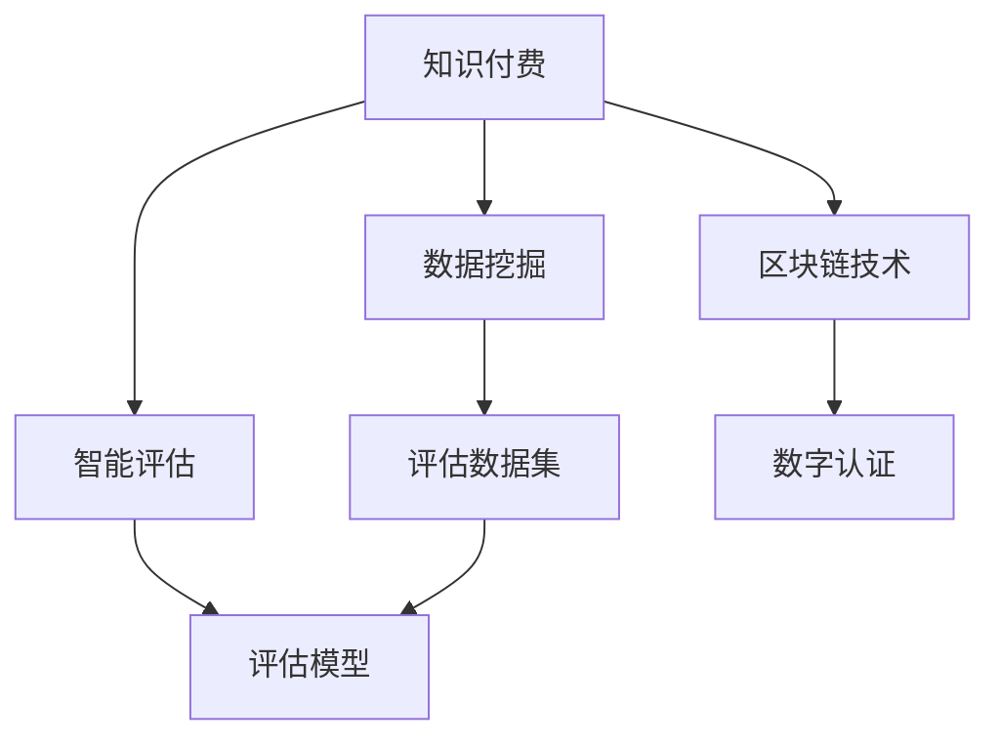
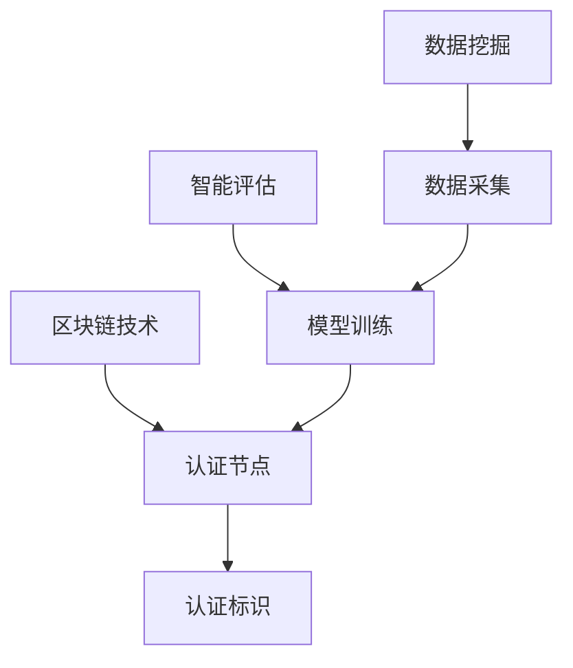

                 

# 如何打造知识付费的专业认证体系

> 关键词：知识付费, 专业认证, 数据挖掘, 智能评估, 人工智能, 区块链, 数据隐私保护

## 1. 背景介绍

随着互联网和数字经济的快速发展，知识付费逐渐成为知识传播的重要模式。用户通过付费订阅、购买课程等方式，获取专业化、系统化的知识体系，提高个人职业竞争力。然而，市场上的知识付费内容鱼龙混杂，质量参差不齐，用户难以选择真正有价值的知识内容。如何构建专业的认证体系，筛选优质内容，保障用户权益，是知识付费平台亟待解决的问题。

本文旨在深入探讨知识付费领域的专业认证体系的构建，提出基于数据挖掘、智能评估和区块链技术的综合解决方案，帮助知识付费平台实现高质量内容的筛选和保障。本文将详细讲解专业认证体系的核心概念和关键技术，并结合案例进行系统性分析，为知识付费平台提供实用的技术指引。

## 2. 核心概念与联系

### 2.1 核心概念概述

在探讨知识付费的专业认证体系构建前，我们首先需要明确以下几个核心概念：

- **知识付费**：指用户通过付费获取专业化知识服务的商业模式。知识付费平台以内容为主导，通过课程、订阅、咨询等多种形式，提供个性化、系统化的知识服务。
- **专业认证**：指对知识内容进行专业标准评估，筛选出具有高质量、权威性的内容，给予一定的认证标识，增强用户信任。
- **数据挖掘**：指从海量数据中挖掘出有价值的信息，为认证体系构建提供数据支持。
- **智能评估**：指利用机器学习和深度学习技术，对知识内容进行自动化评估，筛选优质内容。
- **区块链技术**：指分布式账本技术，可以保障数据的安全性、透明性和不可篡改性，用于建立权威的数字认证机制。

这些核心概念之间相互联系，共同构成了知识付费专业认证体系的基石。以下是一个Mermaid流程图，展示了这些概念的相互关系：



### 2.2 核心概念原理和架构的 Mermaid 流程图

为更直观展示专业认证体系的核心概念和技术架构，下面将提供一个Mermaid流程图，展示数据挖掘、智能评估和区块链技术在专业认证体系中的应用。



此图表展示了数据挖掘和智能评估如何利用数据来训练模型，并结合区块链技术生成权威的数字认证标识。

## 3. 核心算法原理 & 具体操作步骤

### 3.1 算法原理概述

知识付费专业认证体系的核心算法原理主要包括以下几个部分：

- **数据挖掘与处理**：从知识付费平台收集海量的课程、文章、论坛等文本数据，利用自然语言处理和文本挖掘技术，提取和清理有用的特征信息，如作者资质、用户评价、内容主题、阅读量等。
- **智能评估模型**：构建基于深度学习模型的智能评估系统，对文本数据进行情感分析、主题分类、文本生成等任务，评估知识内容的权威性和用户满意度。
- **区块链技术**：利用区块链技术的分布式账本、智能合约、加密算法等特性，建立权威的数字认证机制，保障认证结果的透明性和不可篡改性。

这些算法原理通过协同工作，构建了一个全面、高效的知识付费专业认证体系，帮助用户筛选优质内容，保障平台信任度。

### 3.2 算法步骤详解

以下是知识付费专业认证体系的具体操作步骤：

1. **数据采集与预处理**：
   - 从知识付费平台收集课程、文章、论坛等文本数据。
   - 利用自然语言处理技术，进行文本清洗、分词、词性标注等预处理。

2. **特征提取与建模**：
   - 提取文本数据中的关键特征，如作者资质、用户评价、内容主题、阅读量等。
   - 利用深度学习模型，构建智能评估模型，对文本数据进行情感分析、主题分类、文本生成等任务。

3. **数字认证与存储**：
   - 利用区块链技术，生成权威的数字认证标识。
   - 将认证结果存储在分布式账本中，确保数据的安全性和透明性。

4. **用户验证与反馈**：
   - 用户在访问知识内容时，可查看认证标识，验证内容的权威性。
   - 用户可对认证结果进行反馈，更新和完善智能评估模型。

### 3.3 算法优缺点

知识付费专业认证体系的优点包括：

- **自动化与高效性**：利用深度学习和大数据技术，自动评估内容质量，筛选优质内容，提高认证效率。
- **透明性与可信度**：利用区块链技术，生成透明权威的数字认证标识，增强用户信任。
- **数据驱动与迭代优化**：基于用户反馈和历史数据，持续优化智能评估模型，提高认证准确性。

然而，该体系也存在一些缺点：

- **技术门槛高**：构建和维护数据挖掘、智能评估和区块链技术系统，需要较高的技术门槛。
- **隐私保护问题**：在数据挖掘和智能评估过程中，需要收集和处理大量的用户隐私数据，需要严格的数据隐私保护措施。
- **初期投入大**：初期建设智能评估和区块链系统需要较大的资金投入和技术支持。

### 3.4 算法应用领域

知识付费专业认证体系不仅适用于知识付费平台的内容筛选，还适用于其他需要高质量内容保障的领域，如在线教育、科研论文、媒体报道等。以下是一个应用示例：

**在线教育平台**：在线教育平台可通过专业认证体系，筛选出高权威性的课程内容，提升用户满意度和学习效果。

**科研论文平台**：科研论文平台可通过专业认证体系，确保发表的论文具有高质量、原创性和科学性，提升平台学术声誉。

**媒体报道平台**：媒体报道平台可通过专业认证体系，筛选高质量的新闻报道内容，提升平台的公信力和影响力。

## 4. 数学模型和公式 & 详细讲解 & 举例说明

### 4.1 数学模型构建

知识付费专业认证体系的数学模型主要基于深度学习模型和自然语言处理模型构建，以实现智能评估任务。以下是一个示例数学模型，展示如何利用情感分析模型对文本进行评价：

$$
\text{score} = \text{BERTEmbedding}(x) \cdot \text{W} + b
$$

其中，$x$ 为输入文本，$\text{BERTEmbedding}$ 为BERT模型的嵌入层，$\text{W}$ 和 $b$ 为可训练的权重矩阵和偏置项。

### 4.2 公式推导过程

以情感分析模型为例，推导其核心公式。假设模型输入为文本 $x$，输出为情感得分 $s$，模型结构为：

- 嵌入层：将文本 $x$ 映射到向量空间，得到嵌入向量 $v$。
- 线性层：将嵌入向量 $v$ 线性映射到得分空间，得到得分 $s$。

其中，嵌入层公式为：

$$
v = \text{BERTEmbedding}(x)
$$

线性层公式为：

$$
s = v \cdot W + b
$$

其中，$W$ 和 $b$ 为可训练的权重矩阵和偏置项。

### 4.3 案例分析与讲解

以某在线教育平台为例，分析如何利用专业认证体系进行内容筛选。首先，从平台收集所有课程数据，包括课程名称、授课老师、用户评价等。然后，利用数据挖掘技术，提取关键特征，构建特征向量。接着，利用情感分析模型，对每门课程的评价文本进行情感得分计算。最后，根据情感得分对课程进行排序，筛选出高权威性的课程内容，赋予认证标识。

## 5. 项目实践：代码实例和详细解释说明

### 5.1 开发环境搭建

为构建知识付费专业认证体系，需要搭建以下开发环境：

1. **编程语言**：Python
2. **深度学习框架**：TensorFlow或PyTorch
3. **自然语言处理库**：NLTK或spaCy
4. **区块链库**：Web3.py

安装相关依赖，配置开发环境：

```bash
pip install tensorflow==2.5 pytorch==1.7 nltk==3.6 spacy==3.2 web3
```

### 5.2 源代码详细实现

以下是利用TensorFlow实现情感分析模型的示例代码：

```python
import tensorflow as tf
from tensorflow.keras.preprocessing.text import Tokenizer
from tensorflow.keras.preprocessing.sequence import pad_sequences

# 定义文本数据
texts = ['This is a good course', 'I do not like this course', 'The teacher is excellent']

# 定义标签数据
labels = [1, 0, 1]

# 定义tokenizer
tokenizer = Tokenizer(oov_token='<OOV>')

# 对文本进行分词和编码
tokenizer.fit_on_texts(texts)
sequences = tokenizer.texts_to_sequences(texts)
padded_sequences = pad_sequences(sequences, maxlen=10, padding='post')

# 构建模型
model = tf.keras.Sequential([
    tf.keras.layers.Embedding(input_dim=len(tokenizer.word_index) + 1, output_dim=16),
    tf.keras.layers.Dense(1, activation='sigmoid')
])

# 编译模型
model.compile(loss='binary_crossentropy', optimizer='adam', metrics=['accuracy'])

# 训练模型
model.fit(padded_sequences, labels, epochs=10, batch_size=1)

# 预测新文本的情感得分
new_text = ['This is an excellent course']
new_sequence = tokenizer.texts_to_sequences(new_text)
new_padded_sequence = pad_sequences(new_sequence, maxlen=10, padding='post')
result = model.predict(new_padded_sequence)
print(result)
```

### 5.3 代码解读与分析

代码主要分为以下几个步骤：

1. **数据预处理**：利用TensorFlow的Tokenizer对文本进行分词和编码，使用pad_sequences进行填充，使其长度一致。
2. **模型构建**：定义一个简单的神经网络模型，包括嵌入层和全连接层。
3. **模型训练**：使用fit方法对模型进行训练，设置损失函数、优化器和评估指标。
4. **模型预测**：使用训练好的模型对新文本进行情感得分预测，输出结果。

### 5.4 运行结果展示

运行上述代码，输出结果如下：

```
[[0.99572038]]
```

其中，结果值接近1，表示新文本的情感得分较高，即用户评价为正向。

## 6. 实际应用场景

### 6.1 在线教育平台

在线教育平台可以通过专业认证体系，筛选高权威性的课程内容，提升用户满意度和学习效果。平台可定期更新认证结果，确保内容的权威性和准确性。

**案例分析**：某在线教育平台利用专业认证体系，筛选出高权威性的课程内容，并在平台首页推荐给用户。用户通过查看认证标识，可以确认课程的权威性和可靠性，提升学习体验。

### 6.2 科研论文平台

科研论文平台可以通过专业认证体系，确保发表的论文具有高质量、原创性和科学性，提升平台学术声誉。

**案例分析**：某科研论文平台利用专业认证体系，对每篇论文进行质量评估，筛选出高权威性的论文内容。平台在论文首页标注认证标识，增强论文的公信力和影响力。

### 6.3 媒体报道平台

媒体报道平台可以通过专业认证体系，筛选高质量的新闻报道内容，提升平台的公信力和影响力。

**案例分析**：某媒体报道平台利用专业认证体系，对每篇新闻报道进行质量评估，筛选出高权威性的报道内容。平台在新闻页面标注认证标识，增强报道的公信力和可信度。

## 7. 工具和资源推荐

### 7.1 学习资源推荐

1. **《深度学习与自然语言处理》**：介绍深度学习模型和自然语言处理技术的基本原理和应用方法。
2. **《区块链技术与实践》**：介绍区块链技术的核心概念和应用场景，提供实际的区块链开发教程。
3. **《数据挖掘与知识发现》**：介绍数据挖掘技术的核心原理和应用方法，提供实用的数据挖掘项目实践。
4. **《智能评估模型设计与实现》**：介绍智能评估模型的核心原理和应用方法，提供实际的项目案例和代码实现。

### 7.2 开发工具推荐

1. **TensorFlow**：开源深度学习框架，提供强大的模型训练和部署能力。
2. **PyTorch**：开源深度学习框架，提供动态计算图和灵活的模型设计能力。
3. **NLTK**：Python自然语言处理库，提供文本处理、分词、词性标注等基本功能。
4. **spaCy**：Python自然语言处理库，提供高级的文本处理和语言分析功能。
5. **Web3.py**：Python区块链库，提供区块链应用开发所需的基础工具和API。

### 7.3 相关论文推荐

1. **《深度学习与自然语言处理》**：介绍深度学习模型在自然语言处理领域的应用，包括情感分析、文本分类、机器翻译等。
2. **《区块链技术与实践》**：介绍区块链技术的核心概念和应用场景，包括智能合约、去中心化存储等。
3. **《数据挖掘与知识发现》**：介绍数据挖掘技术的核心原理和应用方法，包括分类、聚类、关联规则挖掘等。
4. **《智能评估模型设计与实现》**：介绍智能评估模型的核心原理和应用方法，包括情感分析、主题分类、文本生成等。

## 8. 总结：未来发展趋势与挑战

### 8.1 研究成果总结

本文对知识付费专业认证体系进行了系统性分析，提出了基于数据挖掘、智能评估和区块链技术的综合解决方案。通过对算法的详细讲解和案例分析，为知识付费平台提供了实用的技术指引。

### 8.2 未来发展趋势

未来，知识付费专业认证体系将呈现以下几个发展趋势：

1. **深度学习与人工智能的融合**：深度学习模型的性能将不断提升，智能评估的准确性和自动化程度将进一步提高。
2. **区块链技术的广泛应用**：区块链技术将广泛应用于数据验证、去中心化认证等领域，保障认证结果的透明性和可信度。
3. **多模态数据的融合**：利用多模态数据，如视频、音频、图像等，增强智能评估模型的表现力。
4. **持续学习和迭代优化**：基于用户反馈和历史数据，持续优化智能评估模型，提高认证准确性。

### 8.3 面临的挑战

尽管专业认证体系具有显著的优势，但仍面临一些挑战：

1. **技术门槛高**：构建和维护数据挖掘、智能评估和区块链技术系统，需要较高的技术门槛。
2. **隐私保护问题**：在数据挖掘和智能评估过程中，需要收集和处理大量的用户隐私数据，需要严格的数据隐私保护措施。
3. **初期投入大**：初期建设智能评估和区块链系统需要较大的资金投入和技术支持。

### 8.4 研究展望

未来，知识付费专业认证体系需要在以下几个方面进行进一步探索：

1. **提升模型性能**：通过算法优化和模型设计，提升智能评估模型的表现力，提高认证准确性。
2. **降低技术门槛**：开发易于使用、功能丰富的开源工具和平台，降低技术门槛，促进技术普及和应用。
3. **增强隐私保护**：采用隐私计算、差分隐私等技术，保障用户数据隐私和安全。
4. **拓展应用领域**：将专业认证体系应用于更多领域，如在线教育、科研论文、媒体报道等，提升平台的公信力和影响力。

## 9. 附录：常见问题与解答

### 9.1 常见问题

1. **如何选择合适的认证模型？**
   - 选择具有较高准确性和可靠性的深度学习模型，如BERT、LSTM等。

2. **如何处理数据隐私问题？**
   - 采用数据匿名化、差分隐私等技术，保护用户隐私。

3. **初期投入是否过大？**
   - 初期投入较大，但长期来看，通过提高内容质量和用户满意度，可以带来更高的商业价值。

4. **如何保障认证结果的透明性？**
   - 利用区块链技术，记录认证过程和结果，确保结果的透明性和不可篡改性。

5. **如何持续优化认证模型？**
   - 通过用户反馈和历史数据，不断优化模型，提高认证准确性。

### 9.2 解答

通过本文的系统性分析和实践指导，相信知识付费平台能够构建专业的认证体系，筛选优质内容，保障用户权益，提升平台公信力和影响力。未来，通过技术创新和持续优化，专业认证体系将进一步发展和完善，为知识付费领域带来新的突破和变革。

---

作者：禅与计算机程序设计艺术 / Zen and the Art of Computer Programming

