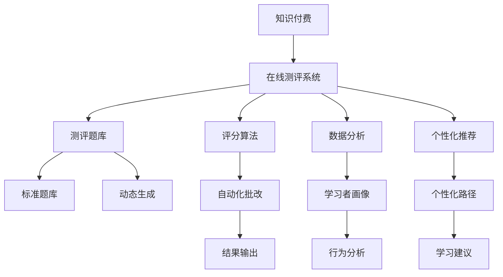

                 

## 1. 背景介绍

随着互联网的普及和智能设备的广泛应用，在线教育市场迎来了迅猛发展。知识付费的兴起，进一步推动了在线测评系统的需求激增。无论是培训机构、企业内训，还是个人自学，测评系统的精准评估和反馈功能都成为提升学习效果的重要手段。如何打造高效、智能、易于使用的知识付费在线测评系统，成为当前IT行业的关键需求。

### 1.1 问题由来
当前，在线测评系统往往依赖于传统的考试模式，即通过标准化的题目、定时考试和人工批改的方式，对学习者的知识掌握情况进行评估。然而，这种模式存在诸多局限：

- **效率低下**：人工批改大量试卷工作量大、耗时长，难以快速反馈学习者成绩。
- **反馈单一**：仅能通过标准答案的得分评估学习者的掌握情况，缺乏多维度的学习反馈。
- **个性化不足**：难以根据学习者的实际情况和个性化需求进行针对性测评。
- **互动性差**：缺乏与学习者的互动环节，无法实时监控学习者的学习过程。

为了解决上述问题，本文提出基于机器学习的大数据在线测评系统解决方案，充分利用人工智能技术和大数据，实现高效、智能、个性化的在线测评功能。

## 2. 核心概念与联系

### 2.1 核心概念概述

为更好地理解本系统的实现原理和关键技术，本节将介绍几个密切相关的核心概念：

- **知识付费**：通过支付一定费用，获取专业、高效、定制化的学习服务，包括在线测评、课程学习、专家辅导等。

- **在线测评系统**：基于互联网技术的测评平台，学习者可以在线完成各类题库练习、实时评测和智能反馈，并根据测试结果进行个性化学习。

- **机器学习**：通过算法模型对大量数据进行分析，自动化地进行数据处理和模式识别，从而辅助学习者完成测评。

- **深度学习**：一种特殊的机器学习方法，通过多层神经网络结构，学习数据中的复杂特征和模式，适用于大规模数据建模。

- **自然语言处理(NLP)**：研究如何使计算机能够理解、处理和生成人类语言的技术，常用于测评系统中的智能问答和文本分析。

- **大数据**：通过处理海量数据，发现数据中的有用信息和知识，支持测评系统进行智能分析和学习者画像构建。

- **推荐系统**：通过分析学习者的行为数据，推荐与其兴趣、能力相匹配的学习内容和资源，提升学习效果。

- **自动化批改**：利用机器学习模型，对学习者的测评结果进行自动评分和分析，提升批改效率和准确性。

- **个性化学习路径**：根据学习者的测评结果和历史学习数据，定制个性化的学习计划和推荐，促进学习者个性化发展。

这些概念共同构成了在线测评系统的主要功能模块，每个模块的实现都依赖于前述核心概念的协同工作。

### 2.2 核心概念原理和架构的 Mermaid 流程图



这个流程图展示了在线测评系统的核心概念及其关系：

1. 知识付费提供经济支持，保障在线测评系统的可持续运营。
2. 测评题库是测评系统的主体，用于存放各类题型和题目。
3. 评分算法是测评系统的核心，负责自动评分和反馈。
4. 数据分析和个性化推荐通过大数据技术，支持测评系统的智能化。
5. 自动化批改实现高效率、高精度的批改服务。
6. 学习者画像和个性化路径提供个性化学习支持。

## 3. 核心算法原理 & 具体操作步骤
### 3.1 算法原理概述

本系统基于深度学习模型进行测评和分析，主要包含以下几个关键算法：

- **测评题库生成**：根据知识付费课程的难度和内容，动态生成题库。
- **评分算法**：利用深度学习模型对学习者的答题情况进行自动评分，并提供详细的反馈和解释。
- **数据分析**：通过大数据分析，构建学习者的兴趣画像和能力画像，支持个性化推荐。
- **个性化推荐系统**：根据学习者的测评结果和历史数据，推荐个性化的学习内容和资源。

### 3.2 算法步骤详解

#### 3.2.1 测评题库生成
1. **数据采集**：收集知识付费课程的知识点、难度和目标受众信息。
2. **题型设计**：根据课程特点，设计多类型的测评题目，包括选择题、填空题、简答题、编程题等。
3. **题库生成**：利用深度学习模型或规则引擎，根据课程难度和知识点动态生成题库。

#### 3.2.2 评分算法
1. **数据预处理**：对学习者的答题数据进行清洗、归一化处理。
2. **模型训练**：使用深度学习模型对标准答案和答题数据进行训练，生成评分模型。
3. **评分计算**：将学习者的答题数据输入评分模型，计算得分和详细反馈。

#### 3.2.3 数据分析
1. **数据收集**：收集学习者的测评数据、学习行为数据等。
2. **特征提取**：从数据中提取有意义的特征，如答题时间、正确率、错误类型等。
3. **模型训练**：使用机器学习模型对特征进行分析，构建学习者画像。

#### 3.2.4 个性化推荐系统
1. **数据收集**：收集学习者的测评结果、历史行为数据等。
2. **画像构建**：利用机器学习模型对数据进行分析，构建学习者画像。
3. **推荐生成**：根据学习者画像和课程推荐规则，生成个性化推荐。

### 3.3 算法优缺点

#### 3.3.1 测评题库生成
优点：
- 动态生成题库，确保试题的多样性和难度适中。
- 利用深度学习模型进行生成，提升题目设计的科学性和合理性。

缺点：
- 需要大量课程数据进行支撑，数据采集和处理成本较高。
- 生成模型需要复杂的训练和调整，技术门槛较高。

#### 3.3.2 评分算法
优点：
- 自动评分，节省大量人工批改时间。
- 详细反馈，帮助学习者快速定位问题。

缺点：
- 评分模型需要大量标注数据进行训练，数据获取成本较高。
- 评分模型可能存在偏差，影响评分准确性。

#### 3.3.3 数据分析
优点：
- 支持多维度数据分析，全面了解学习者特点。
- 大数据技术处理海量数据，提升分析效率。

缺点：
- 数据隐私和安全问题需要重视。
- 数据采集和处理需要高度自动化，技术要求高。

#### 3.3.4 个性化推荐系统
优点：
- 根据学习者个性化需求，推荐匹配内容。
- 提升学习效果，促进个性化发展。

缺点：
- 推荐系统依赖大量用户行为数据，数据采集难度大。
- 推荐模型需要不断优化和调整，技术复杂度高。

### 3.4 算法应用领域

在线测评系统的算法应用广泛，涵盖多个领域：

- **教育培训**：利用在线测评系统进行知识付费课程的测评和反馈，提升教学效果。
- **企业培训**：通过在线测评系统对员工进行技能测评和能力评估，提升员工培训效果。
- **职业认证**：利用在线测评系统对候选人进行职业资格认证和技能测评，确保职业准入质量。
- **在线课程**：为在线课程学习者提供测评和反馈服务，提升课程学习效果。
- **医疗培训**：通过在线测评系统对医护人员进行专业技能测评，提升医疗服务质量。

## 4. 数学模型和公式 & 详细讲解 & 举例说明
### 4.1 数学模型构建

本节将使用数学语言对在线测评系统的核心算法进行更加严格的刻画。

假设学习者 $u$ 在题目 $i$ 上的答题结果为 $a_{ui}$，标准答案为 $s_i$，评分模型为 $f(\cdot)$，则评分模型可表示为：

$$
f(a_{ui}, s_i) = \sum_{k=1}^K w_k \cdot h_k(a_{ui})
$$

其中 $w_k$ 为权重，$h_k(\cdot)$ 为第 $k$ 层的特征函数。

### 4.2 公式推导过程

假设评分模型为两层感知器，其中第一层为特征提取，第二层为评分计算。其结构图如下所示：

```
输入：$a_{ui}, s_i$
  |
  V
特征提取：$h_1(\cdot)$
  |
  V
评分计算：$h_2(\cdot)$
  |
  V
输出：$f(a_{ui}, s_i)$
```

具体推导如下：

设 $h_1(\cdot)$ 为特征提取函数，将答题结果 $a_{ui}$ 映射为特征向量 $h_1(a_{ui})$。然后，使用 $h_2(\cdot)$ 进行评分计算，将特征向量与标准答案 $s_i$ 进行加权求和，得到最终评分 $f(a_{ui}, s_i)$。

### 4.3 案例分析与讲解

以一道选择题为例，展示评分模型的计算过程：

假设题目为：“下列哪项是机器学习的特点？”，提供三个选项：
- A. 学习需要人工干预。
- B. 学习过程是静态的。
- C. 学习可以自动改进模型。

学习者 $u$ 选择了选项C，标准答案为C。

1. **特征提取**：
   - 将答题结果 $a_{ui}$ 转化为特征向量 $h_1(a_{ui})$。
   - 假设特征提取层 $h_1(\cdot)$ 计算得到特征向量为 $[0, 0.8, 0.2]$。

2. **评分计算**：
   - 将特征向量与标准答案 $s_i$ 进行加权求和。
   - 假设评分计算层 $h_2(\cdot)$ 计算得到评分 $f(a_{ui}, s_i) = 0.6 \times 0.8 + 0.3 \times 0.2 + 0.1 \times 0 = 0.6$。

最终，学习者 $u$ 在题目 $i$ 上的得分 $f(a_{ui}, s_i) = 0.6$。

## 5. 项目实践：代码实例和详细解释说明
### 5.1 开发环境搭建

在进行在线测评系统开发前，我们需要准备好开发环境。以下是使用Python进行PyTorch开发的环境配置流程：

1. 安装Anaconda：从官网下载并安装Anaconda，用于创建独立的Python环境。

2. 创建并激活虚拟环境：
```bash
conda create -n pytorch-env python=3.8 
conda activate pytorch-env
```

3. 安装PyTorch：根据CUDA版本，从官网获取对应的安装命令。例如：
```bash
conda install pytorch torchvision torchaudio cudatoolkit=11.1 -c pytorch -c conda-forge
```

4. 安装TensorBoard：
```bash
pip install tensorboard
```

5. 安装各类工具包：
```bash
pip install numpy pandas scikit-learn matplotlib tqdm jupyter notebook ipython
```

完成上述步骤后，即可在`pytorch-env`环境中开始开发。

### 5.2 源代码详细实现

下面我们以评分算法为例，给出使用PyTorch实现评分模型的完整代码。

首先，定义评分模型：

```python
import torch
import torch.nn as nn
import torch.optim as optim

class ScoringModel(nn.Module):
    def __init__(self, input_size, hidden_size, output_size):
        super(ScoringModel, self).__init__()
        self.fc1 = nn.Linear(input_size, hidden_size)
        self.fc2 = nn.Linear(hidden_size, output_size)
        self.relu = nn.ReLU()
        self.softmax = nn.Softmax(dim=1)
        
    def forward(self, x):
        x = self.fc1(x)
        x = self.relu(x)
        x = self.fc2(x)
        x = self.softmax(x)
        return x
```

然后，定义数据集和模型：

```python
from torch.utils.data import Dataset
from torch.utils.data import DataLoader

class ScoringDataset(Dataset):
    def __init__(self, data, targets):
        self.data = data
        self.targets = targets
        
    def __len__(self):
        return len(self.data)
    
    def __getitem__(self, idx):
        return self.data[idx], self.targets[idx]
        
# 加载数据集
dataset = ScoringDataset(data, targets)
dataloader = DataLoader(dataset, batch_size=64, shuffle=True)

# 创建模型
model = ScoringModel(input_size, hidden_size, output_size)
```

接着，定义训练和评估函数：

```python
from torch.optim import Adam

def train_model(model, dataloader, epochs, learning_rate):
    optimizer = Adam(model.parameters(), lr=learning_rate)
    for epoch in range(epochs):
        for batch_idx, (data, target) in enumerate(dataloader):
            optimizer.zero_grad()
            output = model(data)
            loss = nn.CrossEntropyLoss()(output, target)
            loss.backward()
            optimizer.step()
            if batch_idx % 10 == 0:
                print(f"Epoch [{epoch+1}/{epochs}], Batch [{batch_idx+1}/{len(dataloader)}], Loss: {loss.item():.6f}")
        
def evaluate_model(model, dataloader):
    model.eval()
    correct = 0
    total = 0
    with torch.no_grad():
        for data, target in dataloader:
            output = model(data)
            _, predicted = torch.max(output.data, 1)
            total += target.size(0)
            correct += (predicted == target).sum().item()
    print(f"Accuracy: {correct}/{total} ({correct/total*100:.2f}%)")
```

最后，启动训练流程：

```python
epochs = 100
learning_rate = 0.001

train_model(model, dataloader, epochs, learning_rate)
evaluate_model(model, dataloader)
```

以上就是使用PyTorch对评分模型进行训练和评估的完整代码实现。可以看到，PyTorch提供了强大的深度学习框架，使得评分模型的实现变得简洁高效。

### 5.3 代码解读与分析

让我们再详细解读一下关键代码的实现细节：

**ScoringModel类**：
- `__init__`方法：初始化模型的各个层，包括全连接层、激活函数和输出层。
- `forward`方法：定义前向传播过程，先通过两个全连接层，再通过激活函数和输出层，输出预测结果。

**ScoringDataset类**：
- `__init__`方法：初始化数据集，包括数据和标签。
- `__len__`方法：返回数据集的大小。
- `__getitem__`方法：对单个样本进行处理，返回输入和标签。

**train_model函数**：
- 定义优化器和训练过程，遍历数据集进行前向传播和反向传播，更新模型参数。

**evaluate_model函数**：
- 定义评估过程，在测试集上计算模型准确率。

通过这段代码，可以清晰地理解评分模型的构建、训练和评估过程，进一步理解在线测评系统的核心算法。

## 6. 实际应用场景
### 6.1 智能推荐系统

在线测评系统的一个重要应用场景是智能推荐系统。通过对学习者的测评结果进行分析，系统可以为其推荐与学习目标和兴趣相匹配的课程和资料，提升学习效果。

具体而言，可以构建一个多层的推荐系统，包括：
- **特征提取层**：从测评结果、历史行为数据中提取有意义的特征，如学习时长、错误类型等。
- **评分计算层**：使用评分模型计算课程与学习者的匹配度。
- **推荐生成层**：根据评分结果生成个性化推荐。

通过这一系统，学习者可以得到针对自身特点和需求的最优课程推荐，提升学习效率和满意度。

### 6.2 学习路径规划

在线测评系统还可以用于学习路径规划，帮助学习者制定个性化的学习计划。根据学习者的测评结果和历史数据，系统可以推荐适合其当前水平和学习习惯的学习内容，并逐步调整学习计划，使其逐步提升。

具体步骤包括：
1. **测评分析**：根据学习者的测评结果，构建学习者的兴趣和能力画像。
2. **路径规划**：根据画像推荐适合的学习内容，并逐步调整学习计划。
3. **效果反馈**：根据学习者的后续测评结果，调整学习计划和推荐内容。

通过这一系统，学习者可以在不断反馈中逐步提升，达到最佳学习效果。

### 6.3 在线课程评估

在线测评系统还可以用于在线课程的评估，帮助课程开发者了解课程的实际效果，优化课程设计。具体方法包括：
- **学习者测评**：收集学习者对课程的测评结果，了解课程的优缺点。
- **数据分析**：通过数据分析，发现课程的薄弱环节，提出改进建议。
- **持续优化**：根据测评结果和分析结果，不断优化课程内容和结构。

通过这一系统，课程开发者可以实时了解课程效果，不断提升课程质量，满足学习者的需求。

### 6.4 未来应用展望

随着在线测评系统的不断发展，其应用场景将更加广泛，为知识付费领域的用户提供更多价值：

1. **综合测评**：结合多种测评方法，全面了解学习者的学习情况和能力。
2. **跨平台应用**：实现多平台数据互通，提升测评系统的覆盖面和适用性。
3. **自适应学习**：根据学习者的实时反馈，动态调整学习内容和难度，提升学习效果。
4. **多模态融合**：结合文字、语音、图像等多模态数据，提升测评系统的智能性和准确性。
5. **社会化学习**：支持学习者之间的互动和协作，促进知识共享和交流。

总之，在线测评系统的应用前景广阔，将成为知识付费领域不可或缺的重要工具。

## 7. 工具和资源推荐
### 7.1 学习资源推荐

为了帮助开发者系统掌握在线测评系统的理论基础和实践技巧，这里推荐一些优质的学习资源：

1. 《深度学习》书籍：由深度学习领域的知名专家编写，系统介绍了深度学习的基本概念和算法。
2. 《自然语言处理》课程：斯坦福大学开设的NLP明星课程，深入浅出地介绍了NLP的基本技术和应用。
3. 《机器学习实战》书籍：适合初学者的入门书籍，通过实战项目，帮助读者掌握机器学习的基本方法和技巧。
4. TensorFlow官方文档：TensorFlow的详细文档，提供了丰富的教程和示例，适合深度学习开发者的学习和实践。
5. PyTorch官方文档：PyTorch的详细文档，提供了丰富的教程和示例，适合深度学习开发者的学习和实践。

通过对这些资源的学习实践，相信你一定能够快速掌握在线测评系统的核心算法和实现技巧，并用于解决实际的NLP问题。

### 7.2 开发工具推荐

高效的开发离不开优秀的工具支持。以下是几款用于在线测评系统开发的常用工具：

1. Jupyter Notebook：交互式编程环境，适合数据分析和模型训练。
2. TensorBoard：可视化工具，实时监测模型训练状态和效果。
3. PyTorch：深度学习框架，支持动态计算图和自动微分，适合深度学习开发。
4. Scikit-learn：机器学习库，提供了丰富的模型和算法，适合数据分析和机器学习开发。
5. Pandas：数据分析库，支持大规模数据处理和分析。

合理利用这些工具，可以显著提升在线测评系统的开发效率，加快创新迭代的步伐。

### 7.3 相关论文推荐

在线测评系统的研究源于学界的持续研究。以下是几篇奠基性的相关论文，推荐阅读：

1. "Deep Learning for Natural Language Processing"：介绍深度学习在自然语言处理中的应用，包括评分模型和推荐系统。
2. "Reinforcement Learning for Recommendation Systems"：介绍强化学习在推荐系统中的应用，提升推荐系统的智能性。
3. "Adaptive Learning Pathways: A Survey"：综述了个性化学习路径的研究现状和发展方向。
4. "Knowledge-Graph-Based Recommender Systems"：介绍基于知识图谱的推荐系统，提升推荐的准确性和智能化。

这些论文代表了大数据在线测评系统的发展脉络。通过学习这些前沿成果，可以帮助研究者把握学科前进方向，激发更多的创新灵感。

## 8. 总结：未来发展趋势与挑战
### 8.1 总结

本文对基于深度学习的在线测评系统进行了全面系统的介绍。首先阐述了在线测评系统的背景和意义，明确了其在知识付费领域的独特价值。其次，从原理到实践，详细讲解了在线测评系统的核心算法和关键技术，给出了代码实例和详细解释。同时，本文还广泛探讨了在线测评系统在智能推荐、学习路径规划、在线课程评估等多个应用场景中的应用前景，展示了系统的广泛适用性和巨大潜力。

通过本文的系统梳理，可以看到，基于深度学习的在线测评系统正在成为知识付费领域的核心技术，极大地提升了学习效率和个性化学习体验。未来，伴随深度学习技术的持续演进，在线测评系统必将在更广泛的领域得到应用，推动知识付费领域的持续发展和创新。

### 8.2 未来发展趋势

展望未来，在线测评系统的技术发展将呈现以下几个趋势：

1. **深度学习技术的发展**：随着深度学习技术的不断进步，在线测评系统的智能化和准确性将得到进一步提升。
2. **多模态融合**：结合文字、语音、图像等多模态数据，提升测评系统的智能性和准确性。
3. **个性化学习路径的优化**：通过更复杂的算法，构建更加智能和个性化的学习路径，提升学习效果。
4. **社会化学习的推广**：支持学习者之间的互动和协作，促进知识共享和交流。
5. **跨平台数据的互通**：实现多平台数据互通，提升测评系统的覆盖面和适用性。
6. **持续学习和自适应学习**：根据学习者的实时反馈，动态调整学习内容和难度，提升学习效果。

这些趋势凸显了在线测评系统的广阔前景，未来的发展将更加智能化、个性化和多样化。

### 8.3 面临的挑战

尽管在线测评系统已经取得了显著的成果，但在迈向更加智能化、普适化应用的过程中，它仍面临诸多挑战：

1. **数据隐私和安全**：在线测评系统需要处理大量的用户数据，如何保障数据隐私和安全是一个重要问题。
2. **计算资源消耗**：大规模深度学习模型的计算需求较高，需要高性能计算设备和资源。
3. **模型泛化能力**：在线测评系统的模型需要具备较强的泛化能力，以应对不同用户和学习场景的变化。
4. **多模态融合的复杂性**：结合多模态数据的融合和处理，需要解决数据格式转换、特征提取等问题。
5. **用户行为的理解**：如何更准确地理解用户的学习行为和需求，提高推荐的个性化和准确性。

这些挑战需要未来的研究在多个方面进行突破，才能真正实现在线测评系统的智能化和普及化。

### 8.4 研究展望

面向未来，在线测评系统的研究需要在以下几个方面寻求新的突破：

1. **深度学习模型的优化**：开发更加高效的深度学习模型，提升测评系统的智能性和准确性。
2. **多模态数据的融合**：开发更加复杂和有效的多模态融合方法，提升测评系统的智能性和准确性。
3. **个性化学习的提升**：构建更加智能和个性化的学习路径，提升学习效果。
4. **社会化学习的推广**：支持学习者之间的互动和协作，促进知识共享和交流。
5. **跨平台数据的互通**：实现多平台数据互通，提升测评系统的覆盖面和适用性。
6. **持续学习和自适应学习**：根据学习者的实时反馈，动态调整学习内容和难度，提升学习效果。

这些研究方向将推动在线测评系统的持续发展和创新，为知识付费领域的用户提供更加智能和个性化的学习体验。

## 9. 附录：常见问题与解答

**Q1：在线测评系统如何保证数据隐私和安全？**

A: 在线测评系统需要处理大量的用户数据，如何保障数据隐私和安全是一个重要问题。可以通过以下措施进行保障：
1. 数据加密：对用户数据进行加密处理，防止数据泄露。
2. 权限控制：设置严格的权限控制机制，确保只有授权人员可以访问和处理数据。
3. 数据匿名化：对数据进行匿名化处理，防止数据泄露用户身份信息。
4. 安全审计：定期进行安全审计，确保系统符合安全标准和规范。

**Q2：如何提高在线测评系统的智能性？**

A: 在线测评系统的智能性提升需要从多个方面进行努力：
1. 数据采集和处理：收集更多的用户数据，并进行高质量的数据处理，提升数据的多样性和代表性。
2. 深度学习模型的优化：开发更加高效的深度学习模型，提升测评系统的智能性和准确性。
3. 多模态数据的融合：结合文字、语音、图像等多模态数据，提升测评系统的智能性和准确性。
4. 个性化学习的提升：构建更加智能和个性化的学习路径，提升学习效果。
5. 社会化学习的推广：支持学习者之间的互动和协作，促进知识共享和交流。

**Q3：在线测评系统如何提升学习效果？**

A: 在线测评系统提升学习效果需要从多个方面进行努力：
1. 多维度测评：结合多种测评方法，全面了解学习者的学习情况和能力。
2. 智能推荐系统：结合学习者的测评结果，推荐适合的学习内容和资源，提升学习效果。
3. 个性化学习路径：根据学习者的测评结果和历史数据，推荐适合的学习内容，并逐步调整学习计划。
4. 效果反馈：根据学习者的后续测评结果，调整学习计划和推荐内容，提升学习效果。

**Q4：在线测评系统面临哪些技术挑战？**

A: 在线测评系统面临的技术挑战主要包括：
1. 数据隐私和安全：在线测评系统需要处理大量的用户数据，如何保障数据隐私和安全是一个重要问题。
2. 计算资源消耗：大规模深度学习模型的计算需求较高，需要高性能计算设备和资源。
3. 模型泛化能力：在线测评系统的模型需要具备较强的泛化能力，以应对不同用户和学习场景的变化。
4. 多模态融合的复杂性：结合多模态数据的融合和处理，需要解决数据格式转换、特征提取等问题。
5. 用户行为的理解：如何更准确地理解用户的学习行为和需求，提高推荐的个性化和准确性。

这些挑战需要未来的研究在多个方面进行突破，才能真正实现在线测评系统的智能化和普及化。

通过本文的系统梳理，可以看到，基于深度学习的在线测评系统正在成为知识付费领域的核心技术，极大地提升了学习效率和个性化学习体验。未来，伴随深度学习技术的持续演进，在线测评系统必将在更广泛的领域得到应用，推动知识付费领域的持续发展和创新。总之，在线测评系统需要从数据隐私、计算资源、模型泛化、多模态融合等多个方面进行优化和改进，才能真正实现智能化和普及化，为用户提供更加智能和个性化的学习体验。

---

作者：禅与计算机程序设计艺术 / Zen and the Art of Computer Programming

