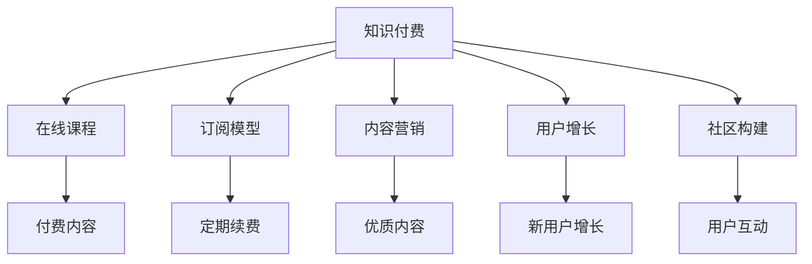

                 

# 如何打造高成交量的程序员知识付费产品

> 关键词：知识付费, 程序员社区, 在线课程, 知识变现, 订阅模型, 内容营销, 用户增长

## 1. 背景介绍

### 1.1 问题由来

在数字化和信息化的时代浪潮下，互联网和新媒体正快速改变着传统的知识传播和消费模式。随着知识付费理念的兴起，越来越多的人开始接受并认可以付费形式获取高质内容的方式，以满足知识增长和技能提升的需求。尤其是在程序员领域，知识付费产品以其便捷性、高效性和内容专业性，成为程序员获取新知识、新技术的重要渠道。然而，知识付费市场竞争激烈，优质的产品脱颖而出并不容易。本文旨在探讨如何打造高成交量的程序员知识付费产品，助力开发者实现知识变现。

### 1.2 问题核心关键点

在知识付费产品的设计与运营过程中，成功与否取决于多个因素。核心关键点包括：
1. 确定目标用户群体：了解目标用户的痛点和需求，并针对性地提供解决方案。
2. 内容质量与多样化：确保内容的专业性和实用性，同时提供丰富多样的内容形式。
3. 订阅模型设计：采用合理的订阅收费策略，吸引用户长期订阅。
4. 用户互动与社群构建：通过互动机制增强用户粘性，构建社区氛围。
5. 市场推广与营销策略：精准投放，提高产品曝光度和吸引力。
6. 数据分析与持续优化：通过数据分析指导产品迭代与运营优化。

## 2. 核心概念与联系

### 2.1 核心概念概述

为更好地理解如何打造高成交量的程序员知识付费产品，本节将介绍几个密切相关的核心概念：

- **知识付费(Knowledge Pay):** 以付费形式获取知识和技能的经济模式，通过互联网和新媒体实现知识与用户之间的价值交换。
- **在线课程(Online Courses):** 通过网络平台提供的交互式学习资源，包括视频、文本、练习等。
- **订阅模型(Subscription Model):** 用户按固定周期支付费用，获得持续访问产品内容和服务的模式。
- **内容营销(Content Marketing):** 利用高质量内容吸引用户关注和转化，建立品牌信任。
- **用户增长(User Growth):** 通过有效的市场推广和运营策略，实现用户数量的增长和留存率的提升。
- **社区构建(Community Building):** 通过互动机制和社群活动，建立用户之间的联系，增强用户粘性。

这些核心概念之间的逻辑关系可以通过以下Mermaid流程图来展示：



这个流程图展示了我们构建知识付费产品的各个环节及其相互关联：

1. 知识付费平台提供多样化的在线课程。
2. 通过订阅模型，用户可以按周期付费，持续享受内容。
3. 高质量的内容营销策略可以吸引更多用户，提升品牌影响力。
4. 用户增长的策略确保新用户不断加入，并提升留存率。
5. 社区构建增强用户互动，形成良性循环。

## 3. 核心算法原理 & 具体操作步骤

### 3.1 算法原理概述

打造高成交量的程序员知识付费产品，核心在于内容的价值呈现和用户的持续转化。具体算法原理如下：

- **内容价值评估与推荐**：通过用户行为数据（如浏览时间、互动次数等）评估内容对用户的价值，并根据价值进行排序，推荐高价值内容给用户。
- **订阅策略设计**：设计合理的订阅包（如基础版、专业版、定制版等），并采用免费试用、优惠折扣等策略，降低用户进入门槛。
- **用户行为分析**：通过数据分析了解用户的学习行为和转化路径，优化产品体验，提高转化率。
- **激励机制设计**：通过积分、徽章、排行榜等激励机制，提升用户参与度和忠诚度。
- **市场推广与渠道优化**：通过多渠道投放广告和优化营销策略，提升产品曝光度和用户转化率。

### 3.2 算法步骤详解

以下是打造知识付费产品的详细步骤：

**Step 1: 用户需求调研**
- 进行目标用户群体调研，了解他们的技术背景、痛点和需求。
- 收集用户反馈，形成初步的产品规划。

**Step 2: 内容质量提升**
- 邀请行业专家和经验丰富的开发者贡献内容。
- 严格审核内容质量，确保内容的实用性和专业性。
- 提供多样化的内容形式，如视频、文章、直播等。

**Step 3: 订阅模型设计**
- 设计不同版本订阅包，覆盖不同用户需求。
- 提供免费试用期，降低用户进入门槛。
- 实施合理的折扣策略，吸引新用户订阅。

**Step 4: 用户增长策略**
- 通过SEO、社交媒体、邮件营销等多渠道推广产品。
- 优化产品界面和用户体验，提升用户满意度。
- 定期举办活动和优惠，保持用户活跃度。

**Step 5: 社区建设与互动**
- 建立用户社区，定期组织线上线下活动。
- 设立专业群组，促进用户间交流与合作。
- 提供专业答疑服务，增强用户粘性。

**Step 6: 数据分析与产品优化**
- 实时监控用户行为数据，分析用户转化路径。
- 根据数据反馈持续优化产品功能和用户体验。
- 定期更新内容，保持产品新鲜度。

### 3.3 算法优缺点

打造知识付费产品的算法具有以下优点：
1. 针对性强：通过需求调研和用户行为分析，可以提供更具针对性的内容和服务。
2. 提升转化率：通过合理的订阅策略和激励机制，提升用户转化率。
3. 增强用户粘性：通过社区建设与互动，增强用户粘性，形成品牌忠诚度。

同时，该算法也存在一定的局限性：
1. 成本较高：邀请专家和高质量内容，以及持续的内容生产，需要较高的投入。
2. 市场风险：市场需求和用户行为的变化可能带来一定的市场风险。
3. 竞争激烈：知识付费市场竞争激烈，新入者可能难以获得足够的市场份额。
4. 用户留存：如何提高用户留存率，防止用户流失，仍然是一个挑战。

### 3.4 算法应用领域

知识付费产品的算法主要应用于以下领域：
- 在线教育平台：如Coursera、Udemy、edX等。
- 编程语言学习：如CSDN学院、慕课网等。
- 软件开发工具：如Codecademy、Pluralsight等。
- 软件开发实战：如LeetCode、HackerRank等。

## 4. 数学模型和公式 & 详细讲解 & 举例说明

### 4.1 数学模型构建

假设知识付费平台有 $N$ 个用户，每个用户有 $K$ 个订阅包可选。设每个用户选择订阅包的集合为 $\{1, 2, ..., K\}$，记 $x_i = (x_{i1}, x_{i2}, ..., x_{ik})$ 为第 $i$ 个用户的订阅包集合，其中 $x_{ik}$ 表示用户 $i$ 是否选择订阅第 $k$ 个包，值为 $0$ 或 $1$。

平台收益 $R$ 为所有订阅费用之和：

$$
R = \sum_{i=1}^N \sum_{k=1}^K p_k x_{ik}
$$

其中 $p_k$ 表示第 $k$ 个订阅包的价格。

用户流失率 $\lambda_i$ 定义为在一定时间周期内，用户从平台流失的概率。若用户未选择某个订阅包，则其流失率可能增加，即：

$$
\lambda_i = \alpha + \beta \sum_{k=1}^K (1 - x_{ik}) c_{ik}
$$

其中 $\alpha$ 为基本流失率，$\beta$ 为订阅包流失系数，$c_{ik}$ 为订阅包 $k$ 对流失率的影响。

平台用户总数 $U$ 和活跃用户数 $A$ 的变化遵循以下方程：

$$
\frac{dU}{dt} = -\lambda \sum_{i=1}^N \lambda_i
$$

$$
\frac{dA}{dt} = \lambda \sum_{i=1}^N (1 - \lambda_i)
$$

### 4.2 公式推导过程

通过上述数学模型，可以推导出以下关键结果：

**流失率影响因子**：

$$
\lambda_i = \alpha + \beta \sum_{k=1}^K (1 - x_{ik}) c_{ik}
$$

**用户总数变化率**：

$$
\frac{dU}{dt} = -\lambda \sum_{i=1}^N \lambda_i
$$

**活跃用户数变化率**：

$$
\frac{dA}{dt} = \lambda \sum_{i=1}^N (1 - \lambda_i)
$$

**收益最大化策略**：

$$
\max_{x_{ik}} R
$$

### 4.3 案例分析与讲解

以Coursera平台为例，分析其如何通过订阅模型和用户行为分析实现收益最大化。Coursera提供月度订阅和单门课程购买两种模式，并设置免费试用期以吸引新用户。通过数据分析，Coursera了解用户最常订阅的课程类别，并优化推荐算法，提升课程购买率。此外，Coursera还通过社区互动和专业答疑，增强用户粘性，提升平台活跃度。

## 5. 项目实践：代码实例和详细解释说明

### 5.1 开发环境搭建

为了进行知识付费产品的开发和测试，首先需要搭建好开发环境。以下是详细的配置步骤：

1. 安装Python环境：
   ```bash
   conda create --name python3k python=3.8
   conda activate python3k
   ```

2. 安装相关依赖：
   ```bash
   pip install flask flask-migrate flask-wtf sqlalchemy sqlalchemy-migrate requests
   ```

3. 搭建开发服务器：
   ```bash
   export FLASK_APP=app.py
   flask run
   ```

### 5.2 源代码详细实现

下面以一个简单的知识付费平台为例，介绍如何通过Flask框架实现用户注册、订阅、内容推荐等功能。

**用户注册模块:**

```python
from flask import Flask, render_template, request, redirect, url_for
from flask_sqlalchemy import SQLAlchemy

app = Flask(__name__)
app.config['SQLALCHEMY_DATABASE_URI'] = 'sqlite:////tmp/test.db'
db = SQLAlchemy(app)

class User(db.Model):
    id = db.Column(db.Integer, primary_key=True)
    username = db.Column(db.String(50), unique=True, nullable=False)
    email = db.Column(db.String(120), unique=True, nullable=False)

@app.route('/register', methods=['GET', 'POST'])
def register():
    if request.method == 'POST':
        username = request.form['username']
        email = request.form['email']
        user = User(username=username, email=email)
        db.session.add(user)
        db.session.commit()
        return redirect(url_for('index'))
    return render_template('register.html')

@app.route('/')
def index():
    users = User.query.all()
    return render_template('index.html', users=users)
```

**订阅模块:**

```python
class Subscription(db.Model):
    id = db.Column(db.Integer, primary_key=True)
    user_id = db.Column(db.Integer, db.ForeignKey('user.id'), nullable=False)
    package_id = db.Column(db.Integer, nullable=False)

class Package(db.Model):
    id = db.Column(db.Integer, primary_key=True)
    name = db.Column(db.String(50), unique=True, nullable=False)
    price = db.Column(db.Float, nullable=False)

@app.route('/subscribe', methods=['GET', 'POST'])
def subscribe():
    if request.method == 'POST':
        package_name = request.form['package_name']
        user_id = request.form['user_id']
        package = Package.query.filter_by(name=package_name).first()
        subscription = Subscription(user_id=user_id, package_id=package.id)
        db.session.add(subscription)
        db.session.commit()
        return redirect(url_for('profile'))
    return render_template('subscribe.html')
```

**内容推荐模块:**

```python
class Content(db.Model):
    id = db.Column(db.Integer, primary_key=True)
    name = db.Column(db.String(100), nullable=False)
    category = db.Column(db.String(50), nullable=False)
    user_id = db.Column(db.Integer, db.ForeignKey('user.id'), nullable=False)

@app.route('/recommend', methods=['GET', 'POST'])
def recommend():
    if request.method == 'POST':
        user_id = request.form['user_id']
        contents = Content.query.filter_by(user_id=user_id).all()
        return render_template('recommend.html', contents=contents)
    return render_template('recommend.html')
```

### 5.3 代码解读与分析

**用户注册模块**：
- 用户通过表单提交用户名和邮箱，发送到数据库保存。
- 注册成功后，用户可以跳转到首页。

**订阅模块**：
- 用户选择要订阅的包，并填写用户ID。
- 系统查询并选择对应的包，将其与用户ID关联，保存至数据库。
- 订阅成功后，用户可以跳转到用户中心。

**内容推荐模块**：
- 用户可以查询自己订阅的所有内容。
- 系统根据用户ID从数据库查询相关内容，并展示在页面中。

### 5.4 运行结果展示

```html
<!-- 注册页面 -->
<form method="POST">
    <label for="username">用户名:</label>
    <input type="text" id="username" name="username" required>
    <label for="email">邮箱:</label>
    <input type="email" id="email" name="email" required>
    <button type="submit">注册</button>
</form>

<!-- 订阅页面 -->
<form method="POST">
    <label for="package_name">订阅包:</label>
    <select id="package_name" name="package_name" required>
        <option value="Python">Python</option>
        <option value="Java">Java</option>
        <option value="C++">C++</option>
    </select>
    <label for="user_id">用户ID:</label>
    <input type="text" id="user_id" name="user_id" required>
    <button type="submit">订阅</button>
</form>

<!-- 内容推荐页面 -->
<form method="POST">
    <label for="user_id">用户ID:</label>
    <input type="text" id="user_id" name="user_id" required>
    <button type="submit">查询</button>
</form>
```

## 6. 实际应用场景

### 6.1 智能教育

在智能教育领域，知识付费产品可以提供丰富多样的在线课程和互动活动，满足学生的多样化学习需求。例如，Udacity平台提供了大量高质量的计算机科学课程，涵盖编程语言、算法、数据结构等多个方面。学生可以通过订阅获取完整课程学习权限，并在社区内交流学习经验。

### 6.2 软件开发

软件开发领域需要持续学习新技术和新方法，知识付费产品可以有效提升开发者的技能水平。如Codecademy和Pluralsight等平台，提供大量的实战课程和项目实战练习，帮助开发者通过实践掌握新技能。

### 6.3 在线培训

在线培训平台如慕课网、CSDN学院等，为IT从业人员提供系统化的课程学习资源，覆盖软件开发、系统架构、项目管理等多个领域。通过订阅模式，学员可以获得持续的技术更新和课程支持。

### 6.4 未来应用展望

随着AI技术的不断进步，知识付费产品将迎来更多创新和突破。例如，通过自然语言处理技术，平台可以自动分析用户的学习行为和偏好，推荐个性化课程和学习路径。同时，利用区块链技术，平台可以实现内容版权保护和交易，提升内容质量和可信度。

## 7. 工具和资源推荐

### 7.1 学习资源推荐

- **Udemy:** 提供丰富的在线课程，覆盖各种编程语言和技术栈。
- **Coursera:** 与世界顶尖大学和机构合作，提供高质量的学术课程。
- **慕课网:** 国内知名的在线教育平台，提供系统的IT课程和项目实战练习。
- **CSDN学院:** 专注于软件开发和技术分享，提供大量的编程实战课程。

### 7.2 开发工具推荐

- **Flask:** 简单易用的Python Web框架，适合快速搭建知识付费平台。
- **SQLAlchemy:** 强大的Python ORM框架，支持多种数据库操作。
- **SQLAlchemy-Migrate:** 数据库迁移工具，方便进行数据模型更新。
- **Flask-WTF:** 表单处理框架，支持用户输入数据的验证。

### 7.3 相关论文推荐

- **《在线学习中的推荐算法研究》**: 研究在线教育平台的内容推荐算法，提升用户体验和满意度。
- **《知识付费平台的用户行为分析与预测》**: 通过数据分析和机器学习模型，预测用户行为和订阅倾向。
- **《知识付费产品的内容生产与版权保护》**: 探讨知识付费产品的内容生产和版权保护机制，保障用户权益。

## 8. 总结：未来发展趋势与挑战

### 8.1 总结

本文详细介绍了如何打造高成交量的程序员知识付费产品。从用户需求调研、内容质量提升、订阅模型设计、用户增长策略、社区建设与互动等方面，探讨了知识付费产品的设计与运营策略。通过具体案例和代码实例，展示了知识付费产品在实际应用中的实现和效果。

通过本文的系统梳理，可以看出，知识付费产品具有强大的市场潜力，能够为程序员提供持续的学习资源和技能提升机会。未来，随着技术的不断进步和市场的进一步成熟，知识付费产品将迎来更多的创新和突破，为程序员提供更加丰富、高效、优质的学习体验。

### 8.2 未来发展趋势

展望未来，知识付费产品的趋势将包括以下几个方面：
- **内容多样化**：提供更加多样化的内容形式，如视频、直播、互动讨论等。
- **技术迭代**：引入AI、大数据等前沿技术，提升推荐算法和用户体验。
- **社区文化**：构建更具凝聚力的社区文化，增强用户粘性和参与度。
- **社交电商**：探索知识付费与电商结合的创新模式，如内容带货、社区电商等。
- **个性化服务**：利用AI技术进行个性化推荐和内容定制，提升用户体验。

### 8.3 面临的挑战

尽管知识付费产品前景广阔，但仍然面临诸多挑战：
- **内容质量**：高质量内容的制作和更新需要大量的时间和资源投入。
- **用户流失**：如何提高用户留存率，防止用户流失，仍然是一个长期挑战。
- **市场竞争**：知识付费市场竞争激烈，新入者可能难以获得足够的市场份额。
- **价格敏感**：用户对价格的敏感度较高，如何制定合理的收费策略，吸引用户长期订阅。

### 8.4 研究展望

未来知识付费产品需要在内容质量、用户增长、市场推广、用户粘性等多个方面持续优化。通过持续的技术创新和运营优化，知识付费产品将为程序员提供更优质、高效、个性化的学习资源，助力开发者实现知识变现和职业发展。

## 9. 附录：常见问题与解答

**Q1: 知识付费产品的核心竞争力是什么？**

A: 知识付费产品的核心竞争力在于其内容的价值和服务的质量。高质量的内容和优秀的用户体验可以吸引用户持续订阅，从而实现长期收益。

**Q2: 如何提高知识付费产品的用户留存率？**

A: 通过定期更新内容、举办互动活动、提供专业答疑服务等方式，提升用户满意度和粘性。建立社区文化，鼓励用户分享和交流，形成良性循环。

**Q3: 如何制定合理的订阅收费策略？**

A: 设计多样化的订阅包，覆盖不同用户的需求。提供免费试用期和优惠折扣，降低用户进入门槛。通过数据分析，了解用户行为和偏好，优化定价策略。

**Q4: 如何利用AI技术提升知识付费产品的推荐效果？**

A: 利用AI技术分析用户行为和偏好，推荐个性化内容。引入自然语言处理技术，提升内容搜索结果的准确性。

**Q5: 知识付费产品如何进行市场推广？**

A: 多渠道投放广告，利用社交媒体和SEO提高产品曝光度。与知名开发者和机构合作，提升品牌影响力。通过内容营销，吸引目标用户关注和转化。

---

作者：禅与计算机程序设计艺术 / Zen and the Art of Computer Programming

