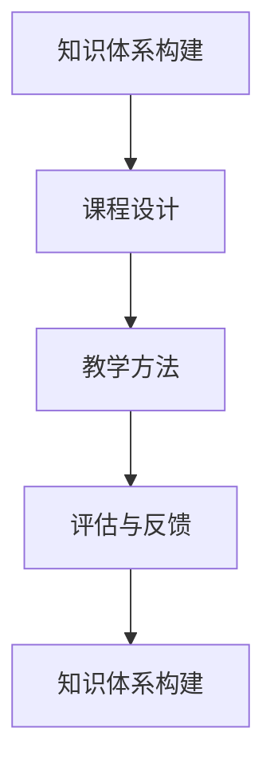

                 

# 如何打造高质量的程序员知识课程

> 关键词：程序员培训, 知识体系构建, 课程设计, 教学方法, 评估与反馈

## 1. 背景介绍

在当今快速发展的科技环境中，技术的更新迭代速度惊人。对于程序员而言，终身学习已经成为了必要的生存技能。高质量的程序员知识课程不仅能够提升个人的编程能力，还能帮助其在职业生涯中脱颖而出。然而，一个成功的程序员知识课程需要更多，它需要精心设计、持续优化，并不断适应新技术的发展。

### 1.1 问题由来
随着技术的不断进步，新的编程语言、框架和技术栈层出不穷。许多传统的高质量课程已经无法满足现代程序员的需求。如何构建既适应当前技术发展，又能为未来发展打下坚实基础的高质量课程，成为了当前教育者和行业从业者的重要课题。

### 1.2 问题核心关键点
高质量程序员知识课程的核心在于：

- **知识体系构建**：构建系统性的知识体系，帮助学员全面掌握编程基础和进阶技能。
- **课程设计**：设计符合学习规律和心理预期的课程内容，提升学习效率和质量。
- **教学方法**：采用多样化、互动式的教学方法，激发学员的学习兴趣。
- **评估与反馈**：通过科学的评估体系和持续的反馈机制，确保学习效果。

## 2. 核心概念与联系

### 2.1 核心概念概述

构建高质量的程序员知识课程，涉及多个关键概念，包括：

- **知识体系构建**：从基础知识到高级技能，构建全面的编程知识体系。
- **课程设计**：课程内容的组织和编排，确保逻辑连贯、难度适中。
- **教学方法**：互动式教学、项目驱动学习、在线讨论等方法。
- **评估与反馈**：定期测试、项目评审、同伴互评等评估手段，及时反馈学习效果。

这些核心概念之间的联系可以通过以下Mermaid流程图来展示：



这个流程图展示了知识体系构建与课程设计、教学方法和评估与反馈之间的联系。通过不断优化这些环节，可以逐步提升课程的整体质量。

## 3. 核心算法原理 & 具体操作步骤

### 3.1 算法原理概述

打造高质量的程序员知识课程，需要遵循一定的教育学和心理学原理，包括但不限于：

- **认知负荷理论**：在课程设计中平衡信息的复杂性和学员的认知能力。
- **动机理论**：通过设置适当的目标和挑战，激发学员的内在学习动机。
- **迁移理论**：将课程中学习到的技能和知识迁移到实际项目中。

### 3.2 算法步骤详解

以下是构建高质量程序员知识课程的详细步骤：

**Step 1: 确定课程目标**

- **目标设定**：明确课程的目标和预期成果，如掌握特定技术栈、完成特定项目等。
- **需求分析**：调研学员的背景和需求，确保课程内容符合实际需求。

**Step 2: 设计课程内容**

- **模块划分**：将课程内容划分为基础知识、进阶技术和实践项目等模块。
- **内容选择**：基于最新的技术趋势和学员需求，选择核心内容。
- **逻辑连贯**：确保模块之间的逻辑连贯，避免内容跳跃。

**Step 3: 选择教学方法**

- **互动式学习**：通过编程挑战、项目驱动、在线讨论等方式，提高学员的参与度。
- **在线学习**：利用在线平台和资源，灵活适应不同时间和地点。
- **实际项目**：通过实际项目，巩固学员所学知识和技能。

**Step 4: 实施教学**

- **教学材料**：准备高质量的教学材料，如视频、文档、代码等。
- **教师角色**：教师应充当指导者、激励者和解惑者的角色，帮助学员解决学习过程中遇到的问题。
- **学习支持**：提供学习支持，如常见问题解答、学习资料等。

**Step 5: 评估与反馈**

- **定期测试**：通过测试评估学员的学习成果。
- **项目评审**：对学员的项目进行评审，提供具体的反馈和建议。
- **同伴互评**：通过同伴互评，提升学员的自我评估能力和批判性思维。

**Step 6: 持续优化**

- **反馈收集**：定期收集学员和教师的反馈，了解课程的优缺点。
- **课程更新**：根据反馈和新技术的发展，定期更新课程内容。
- **教师培训**：定期对教师进行培训，提升其教学能力。

### 3.3 算法优缺点

高质量程序员知识课程的优点包括：

- **系统性**：通过全面、系统的课程内容，帮助学员掌握全面的编程技能。
- **实用性**：通过实际项目和互动式学习，提升学员的实战能力。
- **灵活性**：通过在线学习平台，适应不同时间和地点的需求。

但同时也存在一些挑战：

- **投入大**：高质量课程的建设需要大量的时间和资源投入。
- **更新快**：需要不断更新课程内容，以适应新技术的发展。
- **师资要求高**：需要具备高水平教学能力的教师。

## 4. 数学模型和公式 & 详细讲解

### 4.1 数学模型构建

在课程设计中，可以利用数学模型来描述学员的学习过程和效果。例如，可以使用Karpman模型来描述学习过程的动力学：

$$
\dot{x} = f(x) + g(x)u
$$

其中，$x$ 表示学员的知识水平，$f(x)$ 和 $g(x)$ 分别表示学员内部动力和外部动力，$u$ 表示教学干预。

### 4.2 公式推导过程

以学习效率的计算公式为例，可以基于信息加工理论建立如下公式：

$$
E = \frac{1}{\sum_{i=1}^{n} t_i}
$$

其中，$E$ 表示学习效率，$n$ 表示总的学习时间，$t_i$ 表示每个学习阶段的时间。

### 4.3 案例分析与讲解

例如，在课程设计中，可以通过以下步骤进行分析和讲解：

- **案例选择**：选择具有代表性且能反映课程核心内容的案例。
- **案例分析**：对案例进行详细分析，讲解其中的技术点和知识难点。
- **应用拓展**：通过拓展案例，帮助学员理解相关知识和技能的应用。

## 5. 项目实践：代码实例和详细解释说明

### 5.1 开发环境搭建

为进行课程项目实践，需要搭建合适的开发环境。以下是使用Python和Jupyter Notebook进行开发的步骤：

1. 安装Python 3.x和Jupyter Notebook。
2. 安装相关依赖包，如NumPy、Pandas、matplotlib等。
3. 创建虚拟环境，以避免依赖冲突。

### 5.2 源代码详细实现

以下是一个简单的课程评估系统的代码实现：

```python
import pandas as pd
from sklearn.metrics import accuracy_score

# 读取学员学习数据
data = pd.read_csv('student_data.csv')

# 计算学习效率
E = 1 / sum(data['time'])

# 计算评估成绩
score = accuracy_score(data['correct'], data['predicted'])

# 输出评估结果
print(f"学习效率: {E:.2f}")
print(f"评估成绩: {score:.2f}")
```

### 5.3 代码解读与分析

- **数据处理**：使用Pandas库处理学员的学习数据。
- **学习效率计算**：计算学员的学习效率。
- **评估成绩计算**：计算学员在评估中的准确率。

## 6. 实际应用场景

### 6.1 在线教育平台

高质量程序员知识课程可以应用于在线教育平台，如Coursera、Udacity等。这些平台通过视频讲解、在线练习、讨论区等多种方式，帮助学员系统学习编程知识。

### 6.2 企业培训

企业可以针对员工的特定需求，定制高质量的编程课程。通过线上和线下结合的方式，提升员工的技术能力和项目实战能力。

### 6.3 开源社区

开源社区可以利用高质量课程，提升社区成员的技术水平和贡献能力。通过提供丰富的学习资源和项目支持，帮助社区成员实现自我提升。

### 6.4 未来应用展望

未来，随着技术的进一步发展，高质量程序员知识课程将在以下几个方面取得新的突破：

- **个性化学习**：利用人工智能技术，为每位学员提供个性化的学习路径和资源。
- **混合学习**：结合在线学习和线下培训，提供更灵活、多样化的学习方式。
- **虚拟现实技术**：通过虚拟现实技术，提供沉浸式的学习体验。
- **微课程**：开发短小精悍的微课程，满足快速学习和知识更新需求。

## 7. 工具和资源推荐

### 7.1 学习资源推荐

- **Coursera**：提供大量高质量的计算机科学课程，覆盖从基础到进阶的内容。
- **Udacity**：通过项目驱动学习，提升学员的实战能力。
- **Khan Academy**：提供免费的编程课程，适合初学者学习。

### 7.2 开发工具推荐

- **Jupyter Notebook**：支持Python等多种编程语言，方便进行数据处理和代码调试。
- **GitHub**：提供代码托管和项目管理功能，适合团队协作开发。
- **JIRA**：项目管理工具，帮助团队跟踪任务进度和问题解决。

### 7.3 相关论文推荐

- **“A Survey of Techniques for Adaptive Learning Systems”**：总结了适应性学习系统的各种技术和方法。
- **“Project-Based Learning: An Evaluation of Methods and Resources”**：分析了基于项目的教学方法及其效果。
- **“The Effect of Knowledge Level on Learning Outcomes”**：探讨了学习者知识水平对其学习效果的影响。

## 8. 总结：未来发展趋势与挑战

### 8.1 总结

本文从多个维度全面系统地介绍了如何打造高质量的程序员知识课程。通过构建系统性的知识体系、设计科学的课程内容、采用多样化的教学方法，以及建立有效的评估与反馈机制，可以确保课程的质量和学员的学习效果。

### 8.2 未来发展趋势

未来，高质量程序员知识课程将朝以下几个方向发展：

- **数据驱动**：利用大数据和人工智能技术，优化课程设计和学习路径。
- **社会化学习**：通过社交网络和社区互动，提升学员的学习效果。
- **跨学科融合**：将编程与其他学科知识融合，提升学员的综合能力。
- **终身学习**：提供终身学习支持，满足学员的长期学习需求。

### 8.3 面临的挑战

高质量程序员知识课程的建设也面临诸多挑战：

- **资源投入**：高质量课程的建设需要大量的人力、物力和财力投入。
- **技术迭代**：需要不断更新课程内容，以适应新技术的发展。
- **师资培养**：需要培养具备高水平教学能力的教师。

### 8.4 研究展望

未来研究需要进一步探索以下几个方面：

- **学习科学**：深入研究学习心理学和教育学原理，优化课程设计和学习方法。
- **人工智能**：利用人工智能技术，提升课程的个性化和自动化水平。
- **跨学科合作**：与其他学科领域合作，拓展课程内容和应用场景。

## 9. 附录：常见问题与解答

**Q1: 高质量课程如何确保学习效果？**

A: 高质量课程通过系统化的课程设计、多样化的教学方法和科学的评估与反馈机制，确保学员的学习效果。定期测试和项目评审可以帮助学员了解自己的学习进展，教师和同伴的反馈可以提供具体的改进建议。

**Q2: 高质量课程如何适应新技术的发展？**

A: 高质量课程需要不断更新内容，以适应新技术的发展。可以利用大数据和人工智能技术，分析和预测技术趋势，提前更新课程内容。同时，通过开放的学习平台和社区，及时获取最新技术和应用案例。

**Q3: 高质量课程如何培养学员的实际项目能力？**

A: 高质量课程应通过实际项目驱动学习，如编程挑战、项目开发等。教师应鼓励学员参与开源项目，提供项目支持和技术指导。此外，定期项目评审和同伴互评，可以帮助学员提高项目实战能力。

**Q4: 高质量课程如何提升学员的自我评估能力？**

A: 高质量课程应设计科学的评估体系，包括定期测试、项目评审、同伴互评等。通过同伴互评，学员可以了解自己的优势和不足，增强自我评估能力和批判性思维。教师应及时提供反馈，帮助学员改进学习方法和提升技能。

**Q5: 高质量课程如何激发学员的学习兴趣？**

A: 高质量课程应采用互动式教学、项目驱动学习等多种方法，提升学员的参与度和兴趣。通过案例分析、项目实战等方式，帮助学员理解知识和技能的应用，增强学习动力。此外，课程设计应关注学员的学习需求和兴趣点，提供个性化的学习路径和资源。

---

作者：禅与计算机程序设计艺术 / Zen and the Art of Computer Programming

