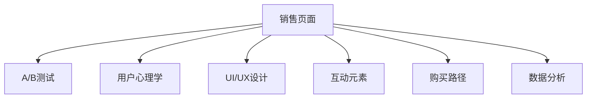

                 

# 如何打造高转化率的销售页面

> 关键词：转化率优化(A/B测试)，页面设计(用户心理学)，行为分析，用户界面(UI/UX)，互动元素，购买路径，数据分析

## 1. 背景介绍

在数字营销的世界里，销售页面扮演着至关重要的角色。它们是品牌和用户之间的桥梁，不仅承载着展示产品信息的任务，还要通过视觉和交互设计激发用户的购买欲望。然而，许多营销人员常常忽视了销售页面设计的科学性，导致转化率低、流失率高。因此，本文将探讨如何运用数据驱动的方法，打造一个既美观又高效的销售页面，从而大幅提升转化率。

## 2. 核心概念与联系

### 2.1 核心概念概述

销售页面（Conversion Page）：用户首次接触到品牌信息的初次触点，目标是引导用户完成购买动作，提升转化率。

转化率（Conversion Rate）：访问销售页面的用户中，最终完成购买行为的比例。

A/B测试（A/B Testing）：通过对比两种或多种页面设计版本，选择转化率最高的版本进行推广，持续优化用户体验。

用户心理学（User Psychology）：理解用户在购买决策过程中的心理活动和行为模式，以优化页面设计和交互流程。

用户界面(UI/UX)：设计直观、易用的界面，以提升用户的操作体验，从而影响购买决策。

互动元素（Interactive Elements）：如动态按钮、轮播图等，通过用户互动提高页面吸引力，引导用户进行购买。

购买路径（Purchase Path）：用户在浏览销售页面时的行为轨迹，优化路径可提升转化率。

数据分析（Data Analytics）：收集、分析页面上的数据，了解用户行为，指导页面优化方向。

以上概念之间的关系可以通过以下Mermaid流程图来展示：



该流程图展示了销售页面设计的各个要素，以及它们之间的关系和影响路径。理解这些核心概念及其联系，是优化销售页面设计的关键。

## 3. 核心算法原理 & 具体操作步骤

### 3.1 算法原理概述

销售页面设计的核心在于通过用户心理学和行为分析，构建用户从接触到转化之间的路径。该路径优化需结合用户行为数据和页面分析工具，以实时调整页面元素和布局，提升用户体验和转化率。

该过程可以概括为以下五个步骤：

1. 收集数据：通过A/B测试和数据分析工具，获取用户在页面上的行为数据。
2. 分析数据：通过分析用户行为和页面互动，了解用户的偏好和痛点。
3. 优化设计：根据分析结果，调整页面元素和布局，提高页面吸引力和易用性。
4. 测试验证：通过A/B测试对比不同设计版本的转化率，选择最优方案。
5. 迭代优化：基于新数据和测试结果，持续迭代优化页面设计。

### 3.2 算法步骤详解

#### 3.2.1 数据收集

使用A/B测试平台，如Optimizely或Google Optimize，设置多个页面版本，并随机分配用户到不同的版本中。确保每个版本在设计和内容上有所不同，以便比较效果。

#### 3.2.2 数据分析

使用Google Analytics等分析工具，收集用户在各个页面上的行为数据，包括页面停留时间、点击率、转化率等关键指标。分析这些数据，识别用户互动的瓶颈和改进点。

#### 3.2.3 设计优化

根据数据分析结果，调整页面布局、文案、颜色、图片等元素，使其更加吸引用户。同时，优化页面结构和导航，确保用户能够顺畅地从接触页面到完成购买。

#### 3.2.4 测试验证

运行A/B测试，持续监控不同版本之间的转化率差异。选择转化率最高的版本，并将其作为标准版本推广。

#### 3.2.5 迭代优化

定期重复以上步骤，根据最新的数据和测试结果，持续优化页面设计。在每次迭代中，应关注数据变化，评估优化效果，并不断调整策略。

### 3.3 算法优缺点

#### 优点：

- 科学性：基于数据驱动的方法，可避免主观臆断，提高优化效果。
- 灵活性：可实时调整页面设计，适应不同用户需求和市场变化。
- 可测量性：通过A/B测试，量化优化效果，便于评估和比较。

#### 缺点：

- 数据依赖：需要大量用户数据，特别是在初期阶段，可能面临数据不足的问题。
- 周期长：从数据分析到优化再到测试验证，整个流程可能需要较长时间。
- 成本高：特别是在大规模企业中，A/B测试和数据分析工具的成本较高。

### 3.4 算法应用领域

基于上述原理，销售页面优化方法广泛适用于以下场景：

- 电商网站：优化产品展示页、结算页、购物车页等关键页面。
- 在线服务：优化注册页、登陆页、客服页等用户触点。
- 内容平台：优化文章页、课程页、会员订阅页等用户行为路径。
- 移动应用：优化应用内购买、支付、信息检索等交互体验。

## 4. 数学模型和公式 & 详细讲解 & 举例说明

### 4.1 数学模型构建

转化率优化的数学模型可以表示为：

$$ C = \frac{C_{total}}{T_{total}} $$

其中，$C$ 表示转化率，$C_{total}$ 表示完成购买的用户数量，$T_{total}$ 表示访问销售页面的用户数量。

### 4.2 公式推导过程

对于任意页面版本 $i$，转化率计算公式为：

$$ C_i = \frac{C_{i_{total}}}{T_{i_{total}}} $$

通过对比不同版本 $i$ 和 $j$ 的转化率 $C_i$ 和 $C_j$，可以计算它们之间的提升率：

$$ \Delta C = \frac{C_i - C_j}{C_j} $$

若 $\Delta C > 0$，则说明版本 $i$ 比版本 $j$ 有更好的转化效果。

### 4.3 案例分析与讲解

假设我们有两组销售页面版本 $A$ 和 $B$，通过A/B测试得到以下数据：

- 版本 $A$：点击率10%，转化率5%
- 版本 $B$：点击率8%，转化率6%

首先，计算每个版本的转化率：

- 版本 $A$：$C_A = \frac{5\%}{10\%} = 0.5$
- 版本 $B$：$C_B = \frac{6\%}{8\%} = 0.75$

然后计算提升率：

- $\Delta C = \frac{C_B - C_A}{C_A} = \frac{0.75 - 0.5}{0.5} = 0.5$

这意味着版本 $B$ 比版本 $A$ 的转化率提高了50%。因此，我们应选择版本 $B$ 作为最佳实践。

## 5. 项目实践：代码实例和详细解释说明

### 5.1 开发环境搭建

为了进行销售页面优化，我们需要搭建一个测试环境，并进行数据收集和分析。具体步骤如下：

1. 安装A/B测试平台：如Optimizely或Google Optimize。
2. 创建测试版本：设计多个页面版本，并上传到A/B测试平台。
3. 配置数据收集：在各版本页面上配置Google Analytics代码，用于收集用户行为数据。
4. 启动测试：将用户随机分配到不同版本中，开始测试。

### 5.2 源代码详细实现

以下是一个使用Optimizely进行A/B测试的Python示例代码：

```python
from optimizely import Optimizely

# 初始化Optimizely
optimizely = Optimizely('project-id', 'api-key')

# 定义页面版本
version_a = optimizely.create_version('Version A')
version_b = optimizely.create_version('Version B')

# 配置A/B测试
ab_test = optimizely.create_a_b_test('Test', version_a, version_b)

# 定义测试规则
rule = optimizely.create_rule('Test Rule', 'ALL')

# 将用户分配到不同版本
optimizely.split_user(rule, ab_test, 'Split Key')

# 启动测试
optimizely.start_test(ab_test, 'Split Rule')
```

### 5.3 代码解读与分析

- 使用Optimizely库，创建多个版本并配置A/B测试。
- 定义测试规则，将所有用户分配到不同版本中。
- 启动测试后，系统会根据规则将用户随机分配到指定版本，并持续监测数据变化。

### 5.4 运行结果展示

A/B测试运行一段时间后，可以导出数据，使用Excel或Tableau进行可视化分析。例如，在Optimizely平台上，可以生成以下图表：


该图表展示了不同版本之间的点击率、转化率等指标，以及它们的差异。通过分析这些数据，可以发现哪个版本的转化效果更好，并据此优化销售页面设计。

## 6. 实际应用场景

### 6.1 电商网站的销售页面优化

电商网站销售页面的优化可以显著提升用户购买体验和转化率。例如，Amazon和淘宝等平台经常使用A/B测试来优化产品展示页、结算页和购物车页，提升用户购买率。

### 6.2 在线服务的注册页优化

在线服务的注册页是用户首次触点的关键页面，通过优化可提高注册转化率。例如，Stripe和PayPal等支付平台经常使用A/B测试来优化注册流程和提示信息，提升用户注册体验。

### 6.3 内容平台的文章页优化

内容平台的文章页需要吸引用户，并引导用户进行订阅或购买。例如，Medium和Coursera等平台经常使用A/B测试来优化文章页的布局和交互元素，提升用户订阅率。

### 6.4 移动应用的支付路径优化

移动应用的支付路径设计直接影响用户支付体验。例如，Airbnb和Uber等平台经常使用A/B测试来优化支付路径和提示信息，提升用户支付转化率。

## 7. 工具和资源推荐

### 7.1 学习资源推荐

为了掌握销售页面优化的核心技术，以下是几个推荐的资源：

1. 《网页设计与用户体验》：这本书详细介绍了网页设计和用户体验的基本原理，适合初学者学习。
2. 《UX设计全攻略》：这本书提供了从用户研究到设计实践的全面指南，适合中级和高级用户学习。
3. 《A/B测试之道》：这本书深入介绍了A/B测试的理论和方法，适合数据驱动的营销人员阅读。
4. Google Analytics官方文档：Google提供的详细数据分析工具文档，适合了解基本数据收集和分析方法。
5. Optimizely官方文档：Optimizely的官方文档，提供了A/B测试平台的详细操作指南和API接口。

### 7.2 开发工具推荐

以下是几个常用的销售页面优化开发工具：

1. Optimizely：A/B测试平台，提供全面的测试和分析功能。
2. Google Analytics：数据分析工具，支持网页行为数据的收集和分析。
3. Adobe Experience Cloud：综合性数据分析和优化平台，支持多渠道的A/B测试和用户分析。
4. Tableau：数据可视化工具，支持复杂的数据分析和报告生成。
5. JIRA：项目管理工具，支持任务管理和团队协作。

### 7.3 相关论文推荐

以下是几篇关于销售页面优化和A/B测试的重要论文，推荐阅读：

1. "A/B Testing Best Practices" by John Bennett：介绍了A/B测试的基本原理和最佳实践。
2. "User Experience in the Age of Mobile" by Nielsen Norman Group：探讨了移动端用户体验的优化方法。
3. "The Science of Customer Experience" by Forrester Research：分析了用户体验的科学原理和提升策略。

## 8. 总结：未来发展趋势与挑战

### 8.1 研究成果总结

本文详细介绍了如何通过数据驱动的方法，优化销售页面设计，提升转化率。主要内容包括：

- 销售页面设计的核心概念和联系。
- 转化率优化的算法原理和操作步骤。
- A/B测试的科学性、灵活性和可测量性。
- 数据驱动的优化方法在电商、在线服务、内容平台和移动应用中的应用。

### 8.2 未来发展趋势

未来，销售页面优化将面临以下几个发展趋势：

1. 个性化：根据用户行为数据，提供个性化的内容和推荐，提升用户体验和转化率。
2. 动态优化：使用机器学习和算法实时调整页面元素，适应不同的用户需求和市场变化。
3. 多渠道融合：整合社交媒体、移动应用和网站等多渠道的用户行为数据，提供统一的优化策略。
4. 数据隐私：随着数据隐私法规的不断完善，优化方法需要更加注重用户数据保护。
5. 自动化：通过自动化工具和流程，减少人工干预，提高优化效率。

### 8.3 面临的挑战

尽管销售页面优化技术日趋成熟，但仍面临以下挑战：

1. 数据质量：数据不准确或不完整，会影响优化效果。
2. 数据隐私：用户数据保护法规对数据收集和使用提出了更高的要求。
3. 技术复杂性：需要多种工具和平台的集成，技术门槛较高。
4. 成本投入：特别是大企业，A/B测试和数据分析的成本较高。
5. 用户体验：过度优化的页面可能反而降低用户体验，影响转化率。

### 8.4 研究展望

未来的研究将聚焦于以下几个方向：

1. 自动化优化算法：开发更加智能和自适应的优化算法，减少人工干预。
2. 多模态数据融合：整合文本、图像、音频等多模态数据，提升页面优化效果。
3. 跨平台优化：优化不同平台（网站、移动应用、社交媒体等）的用户体验。
4. 深度学习应用：利用深度学习模型进行页面设计和优化，提升数据驱动的决策能力。
5. 用户参与：通过用户反馈和参与，优化页面设计，提升用户体验。

## 9. 附录：常见问题与解答

**Q1：销售页面优化是否需要反复测试？**

A: 是的，销售页面优化是一个迭代的过程，需要反复测试以找到最优的方案。每次迭代应关注新数据，评估优化效果，并根据结果调整策略。

**Q2：A/B测试中的用户分配比例如何确定？**

A: 用户分配比例应根据测试目的和预期效果确定。通常采用50/50或70/30的比例，确保测试的统计显著性。具体分配比例应结合实际业务需求和数据特点进行灵活调整。

**Q3：销售页面优化对用户行为有何影响？**

A: 优化后的销售页面通常会提升用户体验和转化率，但也可能对用户行为产生一定的影响。例如，通过调整按钮位置和大小，可能会影响用户的点击行为。应通过数据分析和测试，了解用户行为的变化，并在优化过程中加以考虑。

**Q4：如何处理用户反馈？**

A: 用户反馈是优化销售页面的重要信息来源。应通过用户调查、问卷、评论等方式收集用户反馈，并进行整理和分析。根据反馈结果，调整页面设计和优化策略，不断提升用户体验。

**Q5：优化过程中如何保证数据安全？**

A: 数据安全和用户隐私保护是优化过程中必须重视的问题。应遵循相关法律法规，确保用户数据的匿名化和加密存储，防止数据泄露和滥用。同时，应建立数据使用和访问的严格控制机制，确保数据安全和用户隐私。

---

作者：禅与计算机程序设计艺术 / Zen and the Art of Computer Programming

