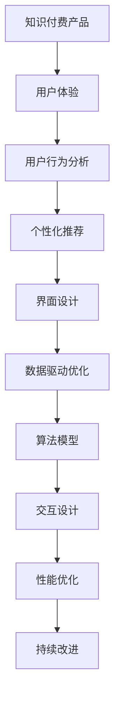

                 

# 如何提高知识付费产品的用户体验

> 关键词：知识付费, 用户体验, 用户行为分析, 个性化推荐, 界面设计, 数据驱动优化, 算法模型, 交互设计, 性能优化

## 1. 背景介绍

随着互联网的普及和信息爆炸，人们对于知识的渴求日益增长。知识付费产品应运而生，利用用户碎片化的时间提供系统性、高效的知识学习服务。然而，用户需求复杂多样，知识付费产品面临着如何在海量信息中筛选优质内容、提高用户粘性、增加用户转化率等诸多挑战。提高用户体验成为知识付费平台生存和发展的关键。本文将系统地探讨如何通过技术手段提升知识付费产品的用户体验。

## 2. 核心概念与联系

### 2.1 核心概念概述

- **知识付费产品**：基于订阅制或单次购买模式，为用户提供系统性、高质量的知识内容，包括音频、视频、文章等多种形式。
- **用户体验(UX)**：指用户在使用产品时产生的情感和行为反应，包括界面设计、交互流畅度、内容呈现等各个方面。
- **用户行为分析**：通过收集用户的行为数据，分析用户的使用习惯和需求，以指导产品优化和个性化推荐。
- **个性化推荐**：利用算法模型，根据用户历史行为和偏好，推荐可能感兴趣的内容。
- **界面设计**：指通过视觉和交互设计提升产品的易用性和吸引力。
- **数据驱动优化**：通过数据分析和统计，指导产品的功能优化和用户体验改进。
- **算法模型**：包括推荐系统、搜索算法、用户画像建模等，用于提升产品和服务的精准度。
- **交互设计**：设计用户与产品的交互方式，提升用户满意度。
- **性能优化**：针对产品功能进行性能调优，提升响应速度和稳定性。

这些概念之间存在紧密联系，共同构建了一个完整的产品用户体验优化框架。通过了解并应用这些概念，可以有效提升知识付费产品的用户体验。

### 2.2 核心概念原理和架构的 Mermaid 流程图(Mermaid 流程节点中不要有括号、逗号等特殊字符)


## 3. 核心算法原理 & 具体操作步骤

### 3.1 算法原理概述

提高知识付费产品的用户体验，涉及到多个维度的技术优化。核心在于通过数据驱动的方式，深入了解用户需求，提供个性化的内容和交互方式，同时不断迭代优化产品的功能和界面。

### 3.2 算法步骤详解

**Step 1: 数据收集与处理**
- 收集用户的行为数据，包括浏览历史、观看时长、购买记录等。
- 数据预处理，去除噪音数据和异常值。
- 数据归一化，便于后续分析和建模。

**Step 2: 用户画像建模**
- 通过机器学习算法，构建用户画像，包括兴趣、偏好、行为特征等。
- 利用聚类、降维等技术，提取关键特征。
- 存储用户画像数据，供后续推荐和个性化定制使用。

**Step 3: 个性化推荐**
- 设计推荐算法模型，如协同过滤、深度学习推荐系统等。
- 模型训练，利用用户历史行为数据进行训练。
- 推荐结果排序，结合用户画像和内容特征，推荐可能感兴趣的内容。
- 实时更新推荐列表，提升用户满意度。

**Step 4: 界面设计与交互优化**
- 界面设计，通过视觉元素和布局提升用户体验。
- 交互优化，减少用户操作步骤，提升操作效率。
- 用户反馈收集，通过问卷、评价等方式了解用户意见。
- 持续迭代改进，根据用户反馈优化产品界面和功能。

**Step 5: 性能优化**
- 性能瓶颈分析，识别影响用户体验的关键点。
- 算法优化，提升模型训练和推理效率。
- 资源优化，合理分配服务器资源，提升响应速度。
- 界面加载优化，减少加载时间和带宽消耗。

### 3.3 算法优缺点

个性化推荐和界面设计的算法具有以下优点：
1. 提升用户粘性和满意度，增加用户转化率。
2. 利用用户数据，提供更加精准的服务。
3. 界面设计美化，提升产品吸引力。

同时，这些算法也存在一些局限：
1. 数据隐私问题，需要严格遵守用户隐私保护规定。
2. 模型复杂度增加，可能导致计算成本上升。
3. 用户画像建模难度大，需要多维度数据支持。

### 3.4 算法应用领域

个性化推荐和界面设计在多个领域得到应用：
- **电商推荐**：通过用户购买历史和行为数据，推荐相关商品。
- **视频平台**：根据用户观看记录，推荐可能喜欢的视频内容。
- **音乐平台**：利用用户听歌习惯，推荐相似歌曲和歌手。
- **社交网络**：根据用户互动行为，推荐可能感兴趣的朋友和内容。

## 4. 数学模型和公式 & 详细讲解 & 举例说明

### 4.1 数学模型构建

个性化推荐系统主要基于协同过滤和深度学习推荐算法，以下将以协同过滤为例构建推荐模型。

协同过滤推荐系统基于用户之间的相似度，推荐与用户历史行为相似的其他用户喜欢的物品。推荐模型可以表示为：

$$
\hat{y}_{ui} = \theta_{i}^T \alpha_{ui}
$$

其中，$y_{ui}$ 表示用户 $u$ 对物品 $i$ 的评分，$\alpha_{ui}$ 为物品 $i$ 的特征向量，$\theta_{i}$ 为用户的偏好向量。

### 4.2 公式推导过程

协同过滤算法可以分为基于用户的协同过滤和基于物品的协同过滤。以基于用户的协同过滤为例，公式推导如下：

$$
\hat{y}_{ui} = \theta_{i}^T \alpha_{ui} = \sum_{v \in N(u)} \frac{\sum_{i' \in I} x_{i'v} y_{i'u}}{\sum_{i'' \in I} x_{i''v}}
$$

其中，$N(u)$ 为与用户 $u$ 相似的用户集合，$I$ 为物品集合，$x_{i'v}$ 为物品 $i'$ 在用户 $v$ 中的评分，$y_{i'u}$ 为用户 $u$ 对物品 $i'$ 的评分。

### 4.3 案例分析与讲解

假设某知识付费平台有用户 $u$ 浏览了多个视频课程，平台记录了用户对每个课程的评分 $y_{ui}$ 和观看时长。通过协同过滤算法，平台可以推荐与用户相似的其他用户喜欢的课程。例如，如果用户 $u$ 对课程 $i$ 的评分较高，并且与用户 $v$ 相似，那么用户 $u$ 对课程 $i$ 的评分预测 $\hat{y}_{ui}$ 可以通过以下公式计算：

$$
\hat{y}_{ui} = \sum_{v \in N(u)} \frac{\sum_{i' \in I} x_{i'v} y_{i'u}}{\sum_{i'' \in I} x_{i''v}}
$$

其中，$N(u)$ 为与用户 $u$ 相似的用户集合，$I$ 为课程集合，$x_{i'v}$ 为课程 $i'$ 在用户 $v$ 中的评分，$y_{i'u}$ 为用户 $u$ 对课程 $i'$ 的评分。

## 5. 项目实践：代码实例和详细解释说明

### 5.1 开发环境搭建

知识付费产品的开发环境搭建通常包括以下步骤：

1. 选择合适的编程语言：Python、Java 等。
2. 安装相关依赖：MySQL、Redis、Flask 等。
3. 搭建开发环境：Docker、Kubernetes 等。
4. 数据库和缓存系统：MySQL、Redis 等。
5. 云服务：AWS、阿里云等。

### 5.2 源代码详细实现

以下以基于协同过滤的推荐系统为例，给出 Python 代码实现：

```python
import pandas as pd
import numpy as np
from sklearn.metrics.pairwise import cosine_similarity

# 读取用户评分数据
data = pd.read_csv('user_ratings.csv')

# 计算用户之间的相似度
similarity_matrix = cosine_similarity(data.drop('rating', axis=1))

# 为用户推荐热门课程
top_n_courses = data['course'].value_counts().head(5).index.tolist()

# 计算推荐分数
recommendations = np.dot(similarity_matrix, top_n_courses)

# 排序推荐列表
sorted_recommendations = np.argsort(recommendations)[::-1]

# 输出推荐结果
for course in sorted_recommendations:
    print(course)
```

### 5.3 代码解读与分析

以上代码展示了如何利用协同过滤算法为用户推荐热门课程。首先，计算用户之间的相似度矩阵，然后计算热门课程的评分向量，最后通过相似度矩阵乘以评分向量，得到每个课程的推荐分数，并按分数排序，输出推荐结果。

### 5.4 运行结果展示

运行以上代码，输出结果将列出热门课程的推荐列表，如：

```
课程A
课程B
课程C
课程D
课程E
```

## 6. 实际应用场景

### 6.1 提升课程购买转化率

通过个性化推荐，知识付费平台可以根据用户的历史行为和兴趣，推荐可能感兴趣的课程。这不仅可以提升用户体验，还可以增加课程的购买转化率。例如，某用户在浏览了多个计算机编程课程后，平台推荐了深度学习课程，用户发现该课程正好符合自己的需求，从而购买了该课程。

### 6.2 增强用户粘性

个性化推荐系统可以持续为用户提供感兴趣的课程，增加用户在该平台停留的时间，提升用户粘性。例如，某用户学习了数据分析课程后，平台根据其行为数据推荐了相关的机器学习课程，用户继续在该平台学习，形成了良好的学习习惯。

### 6.3 优化课程内容推荐

界面设计和交互优化可以提升用户体验。例如，平台可以通过瀑布流式界面展示推荐课程，用户可以方便地浏览和选择课程。同时，通过优化搜索和排序算法，提升搜索结果的相关性和准确性，帮助用户快速找到感兴趣的课程。

## 7. 工具和资源推荐

### 7.1 学习资源推荐

1. **Coursera**：提供大量在线课程，涵盖计算机科学、数据科学等多个领域。
2. **edX**：提供全球知名大学和机构的在线课程，包括计算机科学、人工智能等。
3. **Udacity**：提供编程和人工智能课程，包括深度学习、自然语言处理等。
4. **Kaggle**：提供数据科学竞赛和社区交流平台，提升数据科学和机器学习技能。

### 7.2 开发工具推荐

1. **Python**：功能强大且社区活跃的编程语言，支持大量数据科学和机器学习库。
2. **R**：统计分析和数据科学领域的主流语言，易于进行数据分析和建模。
3. **Jupyter Notebook**：交互式编程环境，支持Python、R等多种语言。
4. **TensorFlow**：开源机器学习框架，支持深度学习和推荐系统等。
5. **Scikit-learn**：Python机器学习库，提供多种经典算法和工具。

### 7.3 相关论文推荐

1. **Apache Spark**：分布式计算框架，支持大规模数据处理和机器学习任务。
2. **Hadoop**：大数据处理框架，支持海量数据存储和计算。
3. **K-means**：经典聚类算法，用于用户画像建模。
4. **协同过滤**：推荐系统基础算法，支持用户行为分析和个性化推荐。

## 8. 总结：未来发展趋势与挑战

### 8.1 研究成果总结

个性化推荐和界面设计的技术在知识付费产品中的应用，显著提升了用户体验和用户粘性，增加了课程购买转化率。然而，数据隐私和算法复杂度等问题仍需进一步解决。

### 8.2 未来发展趋势

未来，个性化推荐和界面设计将更加智能和精准，通过更多维度数据的融合，提供更加个性化的服务。同时，云计算和分布式计算技术的发展，将进一步提升产品的可扩展性和性能。

### 8.3 面临的挑战

数据隐私和安全是知识付费平台面临的主要挑战。平台需要在保护用户隐私的同时，提供个性化服务。此外，算法模型的复杂度和计算成本也需要考虑。

### 8.4 研究展望

未来，个性化推荐和界面设计的研究将更加注重数据隐私和计算效率的平衡，同时引入更多创新算法和技术，提升用户体验。

## 9. 附录：常见问题与解答

**Q1: 如何衡量个性化推荐系统的效果？**

A: 个性化推荐系统的效果可以通过以下几个指标进行衡量：
1. 准确率（Accuracy）：推荐系统推荐的课程是否符合用户兴趣。
2. 召回率（Recall）：相关课程被推荐出来的比例。
3. F1 分数（F1 Score）：准确率和召回率的综合评估。
4. NDCG（Normalized Discounted Cumulative Gain）：推荐系统排名与用户实际选择的课程之间的相关性。

**Q2: 如何在推荐系统中避免冷启动问题？**

A: 冷启动问题指的是新用户或新物品没有足够的历史行为数据，导致推荐系统无法提供有效的推荐。解决冷启动问题的方法包括：
1. 利用用户画像和物品特征进行推荐。
2. 使用协同过滤算法，基于用户或物品的相似性进行推荐。
3. 引入启发式推荐算法，如基于热门课程的推荐。
4. 利用外部数据进行推荐，如利用新闻、社交媒体等。

**Q3: 如何优化推荐系统的实时性？**

A: 推荐系统的实时性可以通过以下方法优化：
1. 使用缓存机制，减少查询数据库的次数。
2. 利用内存计算，提升计算效率。
3. 采用分布式计算框架，提升系统可扩展性。
4. 使用预计算和预测模型，提升推荐速度。

**Q4: 如何优化推荐系统的扩展性？**

A: 推荐系统的扩展性可以通过以下方法优化：
1. 使用分布式计算框架，如Hadoop、Spark等，提升系统可扩展性。
2. 利用云服务，提供按需扩展的能力。
3. 优化算法，减少计算复杂度和内存消耗。
4. 设计合理的缓存和查询策略，提升响应速度。

作者：禅与计算机程序设计艺术 / Zen and the Art of Computer Programming

