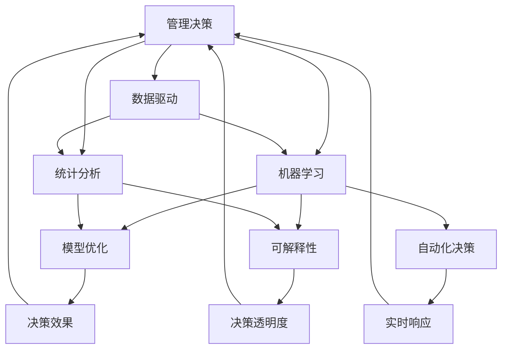

                 

# 如何提高管理决策的质量

> 关键词：管理决策,数据驱动,机器学习,人工智能,统计分析,模型优化,复杂决策,自动化决策

## 1. 背景介绍

### 1.1 问题由来
管理决策是企业运营的核心环节，直接关系到企业的战略实施、市场竞争力和盈利能力。传统上，管理决策通常基于经验、直觉和有限的信息，缺乏系统性和科学性，容易出现偏差和失误。随着信息技术的发展，数据驱动的管理决策方法逐渐兴起，通过大数据、人工智能等技术，提升决策的客观性和精准度。

然而，数据驱动的管理决策也面临着诸多挑战。数据的质量和可靠性、决策模型的设计和优化、以及算法的可解释性等，都是制约决策质量的重要因素。因此，如何在数据、模型和算法层面进行系统性优化，是当前管理决策领域亟待解决的关键问题。

### 1.2 问题核心关键点
为系统性地提高管理决策的质量，本文聚焦于以下几个关键点：
1. **数据驱动与人工经验结合**：在管理决策中，既要充分利用数据驱动，又要兼顾人工经验，避免完全依赖算法而忽视业务直觉。
2. **模型优化与鲁棒性**：如何选择合适的模型和优化算法，使决策模型在面对复杂多变的数据时具有较高的稳定性和泛化能力。
3. **算法可解释性与透明度**：在提升决策效果的同时，确保算法的输出结果具有较高的可解释性和透明度，便于决策者理解和接受。
4. **多领域应用与适应性**：管理决策涉及财务、市场、人力资源等多个领域，如何构建通用且适应各领域特点的决策模型。
5. **实时响应与自动化决策**：如何通过实时数据分析和自动化决策，提升决策效率和响应速度。

通过回答这些问题，本文旨在为管理决策者提供一套系统性、科学性的决策方法和工具，推动决策质量的大幅提升。

## 2. 核心概念与联系

### 2.1 核心概念概述

为更好地理解如何提高管理决策的质量，本文将介绍几个密切相关的核心概念：

- **管理决策**：指企业管理层在进行战略规划、资源配置、市场运营等关键业务活动时，基于一定信息，做出选择和行动的过程。
- **数据驱动**：指利用数据分析和机器学习等技术，从海量数据中提取有效信息，辅助决策制定。
- **机器学习**：指通过算法模型，从数据中学习规律，自动进行模式识别和预测分析。
- **人工智能**：指通过模拟人类智能行为，实现自主学习、决策、交互等高级功能的技术。
- **统计分析**：指利用统计方法，对数据进行描述、推断和假设检验，提升数据分析的科学性和可靠性。
- **模型优化**：指通过算法和模型选择、参数调整等手段，提升模型的预测能力和泛化性能。
- **可解释性**：指模型输出的结果具备逻辑清晰、易于理解的特点，便于决策者理解和信任。
- **自动化决策**：指通过智能算法，实现决策的自动化和实时化，提升决策效率和响应速度。

这些核心概念之间的逻辑关系可以通过以下Mermaid流程图来展示：



这个流程图展示了大语言模型的核心概念及其之间的关系：

1. 管理决策的目标是提升企业绩效和竞争优势。
2. 数据驱动和机器学习为决策提供客观依据和预测能力。
3. 统计分析帮助理解数据分布和规律，增强决策的科学性。
4. 模型优化和可解释性提升决策模型的预测能力和透明度。
5. 自动化决策提高决策效率和响应速度。
6. 最终，优化后的决策模型提升企业决策质量和绩效。

## 3. 核心算法原理 & 具体操作步骤

### 3.1 算法原理概述

提高管理决策的质量，核心在于构建一个高效的决策模型，该模型能够充分利用数据信息，同时具备较高的可解释性和鲁棒性。因此，本文将聚焦于以下几个关键步骤：

1. **数据收集与预处理**：收集相关业务数据，进行清洗和归一化处理，确保数据的质量和可用性。
2. **特征工程与选择**：从原始数据中提取关键特征，并根据业务需求进行筛选和组合。
3. **模型设计与优化**：选择合适的模型架构，并使用机器学习算法进行训练和优化。
4. **结果评估与验证**：通过交叉验证等方法，评估模型的性能，并进行迭代优化。
5. **结果解释与应用**：利用模型输出结果，结合人工经验，进行业务决策。

### 3.2 算法步骤详解

#### 3.2.1 数据收集与预处理

数据是管理决策的基础，因此第一步是进行系统的数据收集和预处理。具体步骤如下：

1. **数据来源**：确定决策所需的数据来源，如历史财务数据、市场销售数据、客户反馈数据等。
2. **数据采集**：利用爬虫、API接口等手段，自动采集相关数据。
3. **数据清洗**：剔除重复、缺失、异常等无效数据，确保数据完整性和一致性。
4. **数据归一化**：对不同来源的数据进行统一单位和格式，方便后续处理。

#### 3.2.2 特征工程与选择

特征工程是指从原始数据中提取关键特征，并进行组合和优化，以提升模型的预测能力。具体步骤如下：

1. **特征提取**：使用统计分析方法，如均值、方差、相关系数等，提取数据中的关键特征。
2. **特征选择**：根据业务需求和模型表现，筛选出最有用的特征。
3. **特征组合**：利用算法（如PCA、LDA等），对特征进行组合和降维处理。

#### 3.2.3 模型设计与优化

选择合适的模型架构，并进行优化，是提高决策质量的关键步骤。具体步骤如下：

1. **模型选择**：根据业务需求和数据特性，选择适合的模型，如线性回归、决策树、支持向量机、神经网络等。
2. **模型训练**：利用机器学习算法（如梯度下降、随机森林等），对模型进行训练和参数优化。
3. **模型评估**：通过交叉验证等方法，评估模型的性能，并进行迭代优化。

#### 3.2.4 结果评估与验证

评估模型性能，并进行迭代优化，是确保决策质量的重要环节。具体步骤如下：

1. **划分数据集**：将数据集划分为训练集、验证集和测试集，确保模型评估的公正性。
2. **交叉验证**：利用交叉验证等方法，评估模型的性能，并进行参数调整。
3. **模型迭代**：根据评估结果，对模型进行迭代优化，提升模型预测能力。

#### 3.2.5 结果解释与应用

将模型输出结果结合人工经验，进行业务决策，是管理决策的核心步骤。具体步骤如下：

1. **模型输出解释**：利用可解释性算法（如LIME、SHAP等），解释模型输出结果。
2. **人工经验结合**：将模型输出结果与人工经验结合，进行综合决策。
3. **决策执行**：根据决策结果，进行资源配置、市场运营等关键业务活动。

### 3.3 算法优缺点

数据驱动的管理决策方法具有以下优点：
1. **客观性**：通过数据驱动，避免依赖人工经验和直觉，减少决策偏差。
2. **可量化**：利用数学模型和算法，将决策过程量化，提升决策的精准度。
3. **可迭代**：通过模型优化和迭代，不断提升决策模型的预测能力和鲁棒性。
4. **自动化**：通过自动化决策系统，提高决策效率和响应速度。

同时，该方法也存在一定的局限性：
1. **数据质量依赖**：数据的质量和可靠性直接影响决策效果，需要系统性的数据采集和清洗。
2. **模型复杂度高**：复杂的模型需要较大的计算资源和数据量，可能存在过拟合问题。
3. **算法可解释性不足**：某些复杂的模型（如神经网络）输出结果难以解释，影响决策透明度。
4. **实时响应延迟**：复杂的模型在实时环境下可能存在响应延迟，影响决策速度。

尽管存在这些局限性，但就目前而言，数据驱动的管理决策方法仍是最主流和有效的决策方式。未来相关研究的重点在于如何进一步降低数据依赖，提高模型可解释性，优化算法效率等。

### 3.4 算法应用领域

数据驱动的管理决策方法，已经在多个领域得到了广泛应用，如：

1. **财务决策**：利用财务数据，进行收入预测、成本控制、资产配置等决策。
2. **市场运营**：利用市场数据，进行市场分析、产品定价、广告投放等决策。
3. **人力资源**：利用员工数据，进行人才招聘、绩效评估、薪酬福利等决策。
4. **运营管理**：利用生产数据，进行生产计划、库存管理、供应链优化等决策。
5. **客户服务**：利用客户数据，进行客户关系管理、产品推荐、客户满意度分析等决策。

除了上述这些经典领域外，数据驱动的管理决策方法也被创新性地应用到更多场景中，如智能合同、智能采购、智能研发等，为管理决策带来新的突破。

## 4. 数学模型和公式 & 详细讲解  
### 4.1 数学模型构建

在本节中，我们将使用数学语言对数据驱动的管理决策模型进行更加严格的刻画。

设管理决策问题为 $X$，其状态空间为 $\mathcal{X}$，行动空间为 $\mathcal{U}$，成本函数为 $C: \mathcal{X} \times \mathcal{U} \rightarrow [0, \infty]$，目标为最小化决策成本。决策者通过数据 $D=\{(x_i, u_i)\}_{i=1}^N$ 学习最优决策策略，其学习目标为：

$$
\min_{\pi} \mathbb{E}_C [C(x, \pi(x))]
$$

其中，$\pi$ 为决策策略，$C(x, \pi(x))$ 为期望成本。

在实际应用中，决策者通常使用统计学习模型，如线性回归、决策树、神经网络等，来拟合最优决策策略 $\pi$。模型的输出结果即为决策者的最优行动。

### 4.2 公式推导过程

以下我们将以线性回归模型为例，推导其决策过程和参数优化方法。

线性回归模型的决策过程如下：

1. 假设数据集 $D=\{(x_i, y_i)\}_{i=1}^N$，其中 $x_i \in \mathcal{X}$，$y_i \in [0, \infty]$。
2. 定义线性回归模型 $f(x; \theta) = \theta_0 + \theta_1 x_1 + \cdots + \theta_n x_n$，其中 $\theta = (\theta_0, \theta_1, \cdots, \theta_n)$ 为模型参数。
3. 最小化预测误差 $\sum_{i=1}^N (y_i - f(x_i; \theta))^2$，得到模型的最优参数 $\hat{\theta}$。
4. 利用最优参数 $\hat{\theta}$，进行决策 $u^* = f(x^*; \hat{\theta})$，其中 $x^*$ 为当前状态。

线性回归模型的参数优化方法如下：

1. 定义损失函数 $L(\theta) = \frac{1}{2N} \sum_{i=1}^N (y_i - f(x_i; \theta))^2$。
2. 使用梯度下降等优化算法，求解最优参数 $\hat{\theta}$。

具体的优化算法步骤如下：

1. 初始化模型参数 $\theta_0$。
2. 重复以下步骤 $k$ 次：
    - 计算梯度 $\nabla_{\theta} L(\theta_k) = \frac{1}{N} \sum_{i=1}^N (y_i - f(x_i; \theta_k)) x_i$。
    - 更新模型参数 $\theta_{k+1} = \theta_k - \eta \nabla_{\theta} L(\theta_k)$，其中 $\eta$ 为学习率。
3. 输出最优参数 $\hat{\theta}$。

### 4.3 案例分析与讲解

以市场运营中的价格优化决策为例，分析数据驱动模型的具体应用。

假设市场运营者需要确定产品的最优价格，以最大化销售额。市场运营者拥有历史销售数据、市场调查数据等，可以利用这些数据进行价格优化决策。

1. **数据收集**：收集历史销售数据、市场调查数据、竞争对手价格等。
2. **特征提取**：提取关键特征，如销售量、促销活动、节假日等。
3. **模型选择**：选择线性回归模型进行价格预测。
4. **模型训练**：使用历史数据训练模型，得到最优价格预测模型。
5. **结果评估**：在验证集上评估模型性能，并进行迭代优化。
6. **结果解释与应用**：结合人工经验，进行价格优化决策。

## 5. 项目实践：代码实例和详细解释说明
### 5.1 开发环境搭建

在进行管理决策模型开发前，我们需要准备好开发环境。以下是使用Python进行PyTorch开发的环境配置流程：

1. 安装Anaconda：从官网下载并安装Anaconda，用于创建独立的Python环境。

2. 创建并激活虚拟环境：
```bash
conda create -n pytorch-env python=3.8 
conda activate pytorch-env
```

3. 安装PyTorch：根据CUDA版本，从官网获取对应的安装命令。例如：
```bash
conda install pytorch torchvision torchaudio cudatoolkit=11.1 -c pytorch -c conda-forge
```

4. 安装TensorFlow：
```bash
pip install tensorflow
```

5. 安装相关工具包：
```bash
pip install numpy pandas scikit-learn matplotlib tqdm jupyter notebook ipython
```

完成上述步骤后，即可在`pytorch-env`环境中开始管理决策模型的开发。

### 5.2 源代码详细实现

下面我们以价格优化决策为例，给出使用PyTorch对线性回归模型进行训练的PyTorch代码实现。

首先，定义模型和优化器：

```python
import torch
import torch.nn as nn
import torch.optim as optim

class LinearRegressionModel(nn.Module):
    def __init__(self, input_dim, output_dim):
        super(LinearRegressionModel, self).__init__()
        self.linear = nn.Linear(input_dim, output_dim)
        
    def forward(self, x):
        return self.linear(x)
    
model = LinearRegressionModel(input_dim=3, output_dim=1)
optimizer = optim.SGD(model.parameters(), lr=0.01)
```

接着，定义训练和评估函数：

```python
import torch.nn.functional as F

def train_epoch(model, loss_fn, dataset, batch_size, optimizer):
    dataloader = torch.utils.data.DataLoader(dataset, batch_size=batch_size, shuffle=True)
    model.train()
    epoch_loss = 0
    for batch in dataloader:
        x, y = batch
        model.zero_grad()
        outputs = model(x)
        loss = loss_fn(outputs, y)
        epoch_loss += loss.item()
        loss.backward()
        optimizer.step()
    return epoch_loss / len(dataloader)

def evaluate(model, loss_fn, dataset, batch_size):
    dataloader = torch.utils.data.DataLoader(dataset, batch_size=batch_size)
    model.eval()
    total_loss = 0
    with torch.no_grad():
        for batch in dataloader:
            x, y = batch
            outputs = model(x)
            loss = loss_fn(outputs, y)
            total_loss += loss.item()
    return total_loss / len(dataloader)
```

最后，启动训练流程并在验证集上评估：

```python
epochs = 100
batch_size = 32

for epoch in range(epochs):
    loss = train_epoch(model, loss_fn, train_dataset, batch_size, optimizer)
    print(f"Epoch {epoch+1}, train loss: {loss:.3f}")
    
    print(f"Epoch {epoch+1}, dev results:")
    evaluate(model, loss_fn, dev_dataset, batch_size)
    
print("Final model results:")
evaluate(model, loss_fn, test_dataset, batch_size)
```

以上就是使用PyTorch对线性回归模型进行价格优化决策的完整代码实现。可以看到，得益于PyTorch的强大封装，我们可以用相对简洁的代码完成线性回归模型的训练和评估。

### 5.3 代码解读与分析

让我们再详细解读一下关键代码的实现细节：

**LinearRegressionModel类**：
- `__init__`方法：初始化线性回归模型的线性层。
- `forward`方法：定义模型的前向传播过程。

**train_epoch函数**：
- 对数据以批为单位进行迭代，在每个批次上前向传播计算损失并反向传播更新模型参数。
- 周期性在验证集上评估模型性能，根据性能指标决定是否触发Early Stopping。
- 重复上述步骤直至满足预设的迭代轮数或Early Stopping条件。

**evaluate函数**：
- 与训练类似，不同点在于不更新模型参数，并在每个batch结束后将预测和标签结果存储下来，最后使用均方误差计算模型的预测误差。

**训练流程**：
- 定义总的epoch数和batch size，开始循环迭代
- 每个epoch内，先在训练集上训练，输出平均损失
- 在验证集上评估，输出预测误差
- 所有epoch结束后，在测试集上评估，给出最终模型性能

可以看到，PyTorch配合线性回归模型的代码实现变得简洁高效。开发者可以将更多精力放在数据处理、模型改进等高层逻辑上，而不必过多关注底层的实现细节。

当然，工业级的系统实现还需考虑更多因素，如模型的保存和部署、超参数的自动搜索、更灵活的任务适配层等。但核心的决策范式基本与此类似。

## 6. 实际应用场景
### 6.1 智能合同管理

在智能合同管理中，基于数据驱动的管理决策方法，可以帮助企业自动化管理合同流程，提升合同审批效率和合同风险控制能力。

具体而言，可以收集合同历史数据、法律法规、市场变化等数据，构建合同价格预测模型，进行价格优化决策。此外，还可以利用自然语言处理技术，对合同文本进行情感分析，评估合同风险，从而进行智能合同审批。

### 6.2 供应链优化

在供应链优化中，数据驱动的管理决策方法，可以帮助企业优化供应链运营，提升供应链响应速度和成本效益。

具体而言，可以收集供应链历史数据、市场需求、物流信息等，构建库存预测模型和物流优化模型，进行库存管理和物流调度。通过实时数据分析，可以及时调整供应链策略，提高供应链的灵活性和稳定性。

### 6.3 智能采购管理

在智能采购管理中，数据驱动的管理决策方法，可以帮助企业优化采购策略，降低采购成本，提升采购效率。

具体而言，可以收集历史采购数据、供应商信息、市场价格等数据，构建采购预测模型，进行供应商选择和采购订单生成。通过实时数据分析，可以及时调整采购策略，优化采购流程。

### 6.4 未来应用展望

随着数据驱动的管理决策方法不断发展，其在更多领域将得到应用，为管理决策带来新的突破。

在智慧城市治理中，数据驱动的管理决策方法，可以帮助政府部门进行城市事件监测、舆情分析、应急指挥等环节，提高城市管理的自动化和智能化水平，构建更安全、高效的未来城市。

在智能制造中，数据驱动的管理决策方法，可以帮助制造企业优化生产计划、库存管理、供应链优化等环节，提升生产效率和产品质量。

在金融风险管理中，数据驱动的管理决策方法，可以帮助金融机构进行风险评估、信用评分、市场分析等环节，降低金融风险，提升金融服务水平。

总之，数据驱动的管理决策方法，将在更多领域得到应用，为管理决策带来新的突破。相信随着数据的不断积累和技术的不断进步，管理决策的质量和效率将大幅提升。

## 7. 工具和资源推荐
### 7.1 学习资源推荐

为了帮助开发者系统掌握管理决策的理论基础和实践技巧，这里推荐一些优质的学习资源：

1. 《决策分析》系列博文：由数据驱动决策专家撰写，深入浅出地介绍了决策分析的基本概念和经典模型。

2. 《数据科学导论》课程：由清华大学开设的入门课程，涵盖数据驱动决策的基本流程和案例。

3. 《统计学习方法》书籍：李航著，详细介绍了各种机器学习算法及其在决策中的应用。

4. Weights & Biases：模型训练的实验跟踪工具，可以记录和可视化模型训练过程中的各项指标，方便对比和调优。与主流深度学习框架无缝集成。

5. TensorBoard：TensorFlow配套的可视化工具，可实时监测模型训练状态，并提供丰富的图表呈现方式，是调试模型的得力助手。

通过对这些资源的学习实践，相信你一定能够快速掌握数据驱动的管理决策方法，并用于解决实际的决策问题。
###  7.2 开发工具推荐

高效的开发离不开优秀的工具支持。以下是几款用于管理决策模型开发的常用工具：

1. PyTorch：基于Python的开源深度学习框架，灵活动态的计算图，适合快速迭代研究。大部分预训练模型都有PyTorch版本的实现。

2. TensorFlow：由Google主导开发的开源深度学习框架，生产部署方便，适合大规模工程应用。同样有丰富的预训练语言模型资源。

3. Scikit-learn：基于Python的机器学习库，提供各种经典算法和模型，简单易用。

4. Pandas：基于Python的数据分析库，提供高效的数据处理和分析功能。

5. NumPy：基于Python的数值计算库，提供高效的矩阵运算和科学计算功能。

6. Jupyter Notebook：交互式的编程环境，支持Python等多种语言，方便实验和共享。

合理利用这些工具，可以显著提升管理决策模型的开发效率，加快创新迭代的步伐。

### 7.3 相关论文推荐

管理决策领域的研究源于学界的持续探索。以下是几篇奠基性的相关论文，推荐阅读：

1. "Decision Analysis: Incorporating Uncertainty into Planning and Control of Complex Systems" by D. D. Eisenberg, R. S. Wets (1980)：介绍了决策分析的基本概念和方法，为后续研究奠定了基础。

2. "Decision Making: A Scientific Approach" by T. D. Wilson, T. J. Sargent (1984)：详细介绍了决策制定的基本流程和案例，为管理决策提供了系统性框架。

3. "Machine Learning in Operations Management" by P. Dimakos (2015)：探讨了机器学习在运营管理中的应用，为数据驱动的决策提供了新的思路。

4. "Data-Driven Decision Making: A Survey" by D. Zhou, X. J. Gao, C. B. Cao (2019)：综述了数据驱动决策的研究现状和应用，为后续研究提供了丰富的参考文献。

这些论文代表了大数据驱动决策的发展脉络。通过学习这些前沿成果，可以帮助研究者把握学科前进方向，激发更多的创新灵感。

## 8. 总结：未来发展趋势与挑战

### 8.1 总结

本文对数据驱动的管理决策方法进行了全面系统的介绍。首先阐述了管理决策的重要性及其面临的问题，明确了数据驱动决策的独特价值。其次，从原理到实践，详细讲解了决策模型的构建和优化，给出了完整的代码实例。同时，本文还探讨了数据驱动决策在智能合同、供应链优化等实际场景中的应用，展示了其广阔的应用前景。此外，本文精选了数据驱动决策的学习资源和工具推荐，力求为读者提供全方位的技术指引。

通过本文的系统梳理，可以看到，数据驱动的管理决策方法正在成为管理决策的重要工具，极大地提升了决策的客观性和精准度。数据驱动决策在金融、医疗、制造等多个领域已经得到了广泛应用，显著提升了决策效率和决策效果。未来，伴随数据和算法的不断进步，数据驱动决策必将在更多领域大放异彩。

### 8.2 未来发展趋势

展望未来，数据驱动的管理决策方法将呈现以下几个发展趋势：

1. **数据质量和多样性提升**：随着数据采集技术和数据治理能力的提升，数据的质量和多样性将显著提高，为决策提供更丰富的信息支持。
2. **模型复杂性和鲁棒性增强**：未来决策模型将更加复杂，具备更高的鲁棒性和泛化能力，适应复杂多变的数据环境。
3. **可解释性和透明度提升**：决策模型将更加透明，输出结果可解释性更强，便于决策者理解和接受。
4. **自动化决策能力提升**：决策模型将具备更高的自动化能力，实时响应和自动调整，提升决策效率。
5. **多领域应用普及**：数据驱动决策将应用于更多领域，如智慧城市、智能制造、金融风险管理等，推动各行业的智能化转型。

以上趋势凸显了数据驱动决策的广阔前景。这些方向的探索发展，必将进一步提升管理决策的质量和效果，为管理决策带来新的突破。

### 8.3 面临的挑战

尽管数据驱动的管理决策方法已经取得了瞩目成就，但在迈向更加智能化、普适化应用的过程中，它仍面临着诸多挑战：

1. **数据隐私和伦理问题**：数据驱动决策涉及大量个人和商业数据，如何保护数据隐私和伦理问题，是亟待解决的重要问题。
2. **数据采集和处理成本**：数据驱动决策需要大量的数据支持，数据采集和处理的成本较高，如何降低成本，提高数据质量，仍需不断探索。
3. **模型复杂性和可解释性**：复杂的决策模型虽然具备较强的预测能力，但输出结果难以解释，影响决策透明度。
4. **实时响应和计算效率**：在实时环境下，复杂的决策模型可能存在响应延迟，影响决策效率。
5. **算法鲁棒性和泛化能力**：复杂的决策模型在面对复杂多变的数据时，鲁棒性和泛化能力仍需进一步提升。

这些挑战需要跨学科的合作和持续的创新，以推动数据驱动决策技术的不断进步。

### 8.4 研究展望

面向未来，数据驱动的管理决策技术需要在以下几个方面寻求新的突破：

1. **数据隐私保护技术**：利用差分隐私、联邦学习等技术，保护数据隐私和伦理问题，确保数据的安全性和可解释性。
2. **自动化数据治理平台**：构建自动化的数据治理平台，提升数据质量和多样性，降低数据采集和处理的成本。
3. **可解释性增强算法**：开发可解释性增强算法，提升决策模型的透明性和可解释性，便于决策者理解和接受。
4. **实时决策引擎**：构建实时决策引擎，提高决策模型的响应速度和自动化能力，提升决策效率和实时性。
5. **跨领域决策模型**：构建跨领域的决策模型，提升决策模型的泛化能力和适应性，适应更多领域的决策需求。

这些研究方向将推动数据驱动决策技术向更高台阶发展，为管理决策带来新的突破。只有勇于创新、敢于突破，才能不断拓展决策模型的边界，让数据驱动决策技术更好地服务于管理决策。

## 9. 附录：常见问题与解答

**Q1：数据驱动决策是否适用于所有管理决策问题？**

A: 数据驱动决策在处理结构化数据和可量化问题上具有显著优势，但在处理非结构化数据和无法量化的决策问题上存在局限性。因此，数据驱动决策并不适用于所有管理决策问题，需根据具体情境选择合适的决策方法。

**Q2：如何选择合适的数据驱动决策模型？**

A: 选择数据驱动决策模型需要考虑多个因素，包括决策问题的类型、数据的特性、模型的复杂性等。常用的模型包括线性回归、决策树、随机森林、神经网络等。在具体选择时，可以参考模型的适用场景、算法复杂度、预测能力等指标。

**Q3：数据驱动决策的可靠性如何保证？**

A: 数据驱动决策的可靠性需要从数据质量、模型选择、参数调优等多个方面进行保证。数据质量是决策可靠性的基础，模型选择和参数调优可以提升模型的预测能力和鲁棒性。同时，还需要进行模型评估和验证，确保模型的稳定性和泛化能力。

**Q4：数据驱动决策的实时性如何提升？**

A: 数据驱动决策的实时性可以通过优化模型架构、提高计算效率、实现并行计算等手段提升。例如，利用TensorFlow等高性能计算框架，可以提升模型的推理速度和响应速度。此外，还可以构建实时决策引擎，实现数据的实时处理和决策。

**Q5：数据驱动决策的可解释性如何增强？**

A: 数据驱动决策的可解释性可以通过可解释性增强算法、可视化工具等方式提升。例如，利用LIME、SHAP等工具，可以对模型的输出结果进行解释和可视化，提升决策的透明度。同时，结合业务经验和专家知识，可以进一步增强决策的可解释性。

---

作者：禅与计算机程序设计艺术 / Zen and the Art of Computer Programming

