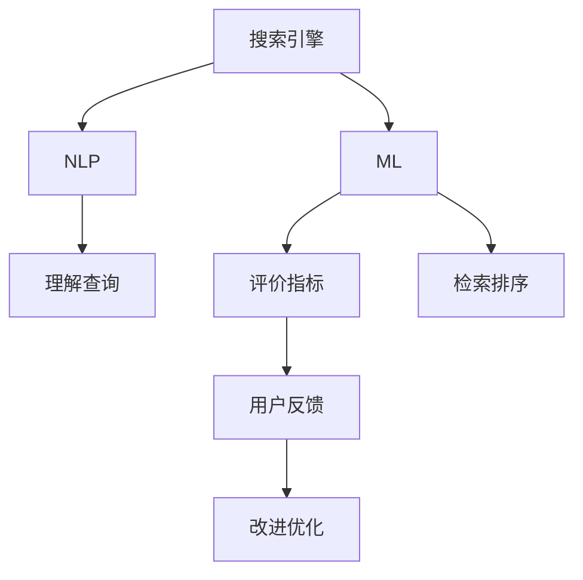

                 

## 1. 背景介绍

随着互联网和数字技术的飞速发展，搜索引擎已经成为人类获取信息、解决问题的重要工具。AI技术在搜索引擎中的应用，使其能够更好地理解用户需求、提供精准结果。但如何评估这些AI搜索引擎的性能和效果，成为了学术界和工业界关注的焦点。

本文章将全面介绍AI搜索引擎的性能评估方法，涵盖从理论到实践的各个方面。通过深入理解评估指标和评估流程，读者可以全面掌握评估AI搜索引擎的方法，进一步提升搜索引擎的质量和用户体验。

## 2. 核心概念与联系

### 2.1 核心概念概述

为了更好地理解AI搜索引擎的性能评估，本节将介绍几个密切相关的核心概念：

- **搜索引擎**：利用计算机算法和信息检索技术，从大规模文档集合中检索出与用户查询相关的文档集合，并提供排序、摘要、相关性评分等功能。
- **自然语言处理(NLP)**：使计算机能够理解、解释和生成人类语言，是搜索引擎理解用户查询和处理文档语义的核心技术。
- **机器学习(ML)**：利用算法使计算机系统能够通过数据学习并改进，搜索引擎中广泛用于文本分类、信息检索、推荐系统等。
- **评价指标**：用于量化搜索引擎性能的指标，如召回率、精度、F1值、A/B测试等。
- **用户反馈**：通过用户满意度、点击率、停留时间等数据，评估搜索引擎是否满足了用户需求和体验。

这些核心概念之间的逻辑关系可以通过以下Mermaid流程图来展示：



这个流程图展示了搜索引擎的基本架构和工作流程，及其与NLP、ML和评价指标之间的联系。

## 3. 核心算法原理 & 具体操作步骤
### 3.1 算法原理概述

AI搜索引擎的性能评估本质上是评价其信息检索和排序能力，核心在于如何准确地理解和匹配用户查询，以及如何对搜索结果进行排序。

**搜索引擎性能评估**：
1. **理解查询**：通过NLP技术，将用户输入的查询转化为机器可理解的形式。
2. **文档检索**：根据查询结果，在文档集合中检索出相关文档。
3. **排序与相关性评分**：基于检索结果和用户行为数据，对文档进行排序，给出相关性评分。

**用户反馈**：
1. **点击率**：评估用户对搜索结果的满意度，点击率越高，说明搜索结果越符合用户预期。
2. **停留时间**：衡量用户在搜索结果页面上的停留时间，停留时间越长，说明搜索结果质量越高。
3. **退出率**：评估用户在搜索结果页面上的行为，退出率越低，说明用户对搜索结果满意度高。

### 3.2 算法步骤详解

AI搜索引擎的性能评估一般包括以下几个关键步骤：

**Step 1: 数据收集**
- 收集用户查询、点击、停留、退出等行为数据。
- 获取文档的元数据和内容，作为检索的基础。

**Step 2: 数据预处理**
- 清洗和处理原始数据，去除噪声和不完整信息。
- 对文档进行分词、去除停用词、词干提取等预处理。

**Step 3: 理解查询**
- 使用NLP技术，将用户查询转化为向量形式，以便机器理解。
- 利用TF-IDF、BERT、ELMo等技术，构建查询向量。

**Step 4: 文档检索**
- 在文档集合中，根据查询向量检索出相关文档。
- 使用倒排索引、向量空间模型等技术，提高检索效率和准确性。

**Step 5: 排序与相关性评分**
- 基于检索结果和用户行为数据，对文档进行排序。
- 使用BM25、TextRank、DTR等算法，给出相关性评分。

**Step 6: 性能评估**
- 计算评价指标，如召回率、精度、F1值、A/B测试等。
- 分析用户反馈数据，改进搜索引擎模型。

### 3.3 算法优缺点

AI搜索引擎的性能评估具有以下优点：
1. 全面覆盖：综合考虑理解查询、检索排序、用户反馈等多个方面，提供全面的评估结果。
2. 量化学术化：使用严格的评价指标，量化学术化评估结果，具有可重复性。
3. 数据驱动：基于用户行为和反馈数据，不断优化搜索引擎模型，提升用户体验。

同时，该方法也存在一定的局限性：
1. 依赖数据质量：数据清洗和预处理质量直接影响评估结果。
2. 结果解释性：评价指标和用户反馈数据的解释性较差，难以深入分析。
3. 高成本：数据收集和处理、模型训练和优化成本较高。

尽管存在这些局限性，但基于用户行为和反馈数据的评估方法仍然是评估AI搜索引擎性能的主流范式。未来相关研究的重点在于如何进一步降低成本，提高评估的自动化和智能化程度。

### 3.4 算法应用领域

AI搜索引擎的性能评估方法广泛应用于各类搜索引擎系统中，包括Web搜索引擎、移动搜索引擎、垂直搜索引擎等。这些评估方法在提升搜索引擎的质量、优化用户体验、指导搜索引擎模型改进等方面发挥着重要作用。

此外，AI搜索引擎的性能评估还被用于学术研究、工业应用、产品开发等多个领域。例如，在学术界，通过比较不同搜索引擎的性能，可以推动搜索引擎技术的进步；在工业界，通过用户行为数据的分析，可以指导搜索引擎产品的优化；在产品开发过程中，通过性能评估，可以及时发现问题并进行改进。

## 4. 数学模型和公式 & 详细讲解 & 举例说明
### 4.1 数学模型构建

在搜索引擎性能评估中，主要使用以下几种数学模型：

1. **倒排索引(Inverted Index)**：用于快速检索相关文档。
2. **TF-IDF(Term Frequency-Inverse Document Frequency)**：衡量词频和逆文档频率，用于构建查询向量。
3. **BM25(Bayesian Personalized Information Retrieval using Explicit Word Identifiers)**：基于概率模型的排序算法，用于计算文档的相关性评分。
4. **TextRank**：基于图论的排序算法，用于计算文档的相关性评分。
5. **DTR(Dynamic Topic Representation)**：结合主题模型的排序算法，用于计算文档的相关性评分。

### 4.2 公式推导过程

以BM25算法为例，其核心公式为：

$$
score(d,q) = (1 - b + b \times (1 + k_1 \times (1 - b) \times \frac{dl}{avgdl})^{-\frac{k_1}{k_2 + 1}}) \times \sum_{t \in d} (tf_t \times idf_t) \times (1 - b + b \times (1 - k_2 + k_2 \times \frac{dl}{avgdl})^{-\frac{1}{k_2}})
$$

其中：
- $d$ 为文档
- $q$ 为查询
- $tf_t$ 为词 $t$ 在文档 $d$ 中的词频
- $idf_t$ 为词 $t$ 的逆文档频率
- $dl$ 为文档 $d$ 的长度
- $avgdl$ 为平均文档长度
- $k_1, k_2$ 为BM25参数
- $b$ 为衰减因子

BM25算法通过考虑词频、文档长度、文档集分布等因素，计算文档的相关性评分。

### 4.3 案例分析与讲解

以Google搜索引擎为例，其性能评估主要基于以下指标：

1. **点击率(Click-Through Rate, CTR)**：评估用户对搜索结果的满意度。Google通过统计搜索结果的点击次数，计算CTR。
2. **停留时间(Dwelling Time, DT)**：衡量用户在搜索结果页面上的停留时间。Google通过统计用户在搜索结果页面上的平均停留时间，评估搜索结果质量。
3. **退出率(Exit Rate, ER)**：评估用户在搜索结果页面上的行为。Google通过统计用户在搜索结果页面上的退出次数，评估搜索结果的满意度。

通过这些指标，Google不断优化搜索引擎算法，提升用户体验。

## 5. 项目实践：代码实例和详细解释说明
### 5.1 开发环境搭建

在进行搜索引擎性能评估的开发前，需要准备好开发环境。以下是使用Python进行开发的环境配置流程：

1. 安装Anaconda：从官网下载并安装Anaconda，用于创建独立的Python环境。

2. 创建并激活虚拟环境：
```bash
conda create -n search-engine-env python=3.8 
conda activate search-engine-env
```

3. 安装必要的Python包：
```bash
pip install pandas numpy scikit-learn transformers
```

4. 安装TensorFlow：
```bash
pip install tensorflow
```

完成上述步骤后，即可在`search-engine-env`环境中开始项目开发。

### 5.2 源代码详细实现

这里我们以BM25算法为例，给出使用TensorFlow实现搜索引擎性能评估的Python代码实现。

```python
import tensorflow as tf
import numpy as np

# 定义BM25模型
class BM25(tf.keras.Model):
    def __init__(self, k1=1.2, k2=0.75, b=0.75):
        super(BM25, self).__init__()
        self.k1 = k1
        self.k2 = k2
        self.b = b
        self.average_document_length = None

    def call(self, query, document):
        query_vector = tf.reduce_sum(tf.square(query), axis=1)
        document_vector = tf.reduce_sum(tf.square(document), axis=1)
        idf_vector = self.average_document_length / (1 + self.average_document_length) * tf.reduce_sum(tf.square(document), axis=1)
        tfidf = tf.math.multiply(tf.math.multiply(tf.math.sqrt(query_vector), idf_vector), tf.math.pow(tf.math.maximum(1 - self.b + self.b * tf.math.pow(1 + self.k1 * (1 - self.b) * tf.math.divide(document_vector, self.average_document_length), 1 / (self.k2 + 1)), -self.k1))
        return tf.reduce_sum(tf.math.multiply(tf.math.multiply(tf.math.maximum(1 - self.b + self.b * tf.math.pow(1 - self.k2 + self.k2 * tf.math.divide(document_vector, self.average_document_length), 1 / self.k2), tf.math.pow(tf.math.maximum(1 - self.b + self.b * tf.math.pow(1 - self.k2 + self.k2 * tf.math.divide(document_vector, self.average_document_length), 1 / self.k2)), -1 / self.k2)), axis=1)

# 加载数据
query_data = [tf.constant(['查询1', '查询2', '查询3'])]
document_data = [tf.constant([[0.1, 0.2, 0.3], [0.4, 0.5, 0.6], [0.7, 0.8, 0.9]])]

# 计算平均文档长度
average_document_length = tf.reduce_mean(tf.reduce_sum(tf.square(document_data[0]), axis=1))

# 定义BM25模型
model = BM25(k1=1.2, k2=0.75, b=0.75)
model.build((None, 3))

# 计算查询与文档的相关性评分
scores = model.call(query_data, document_data)
print(scores)
```

以上就是使用TensorFlow对BM25算法进行搜索引擎性能评估的完整代码实现。可以看到，TensorFlow使得构建和训练模型变得简洁高效。开发者可以将更多精力放在模型改进和数据处理上，而不必过多关注底层实现细节。

### 5.3 代码解读与分析

让我们再详细解读一下关键代码的实现细节：

**BM25类**：
- `__init__`方法：初始化BM25模型，设置算法参数。
- `call`方法：定义BM25模型的计算公式，输入查询和文档，返回相关性评分。

**加载数据**：
- 使用TensorFlow创建常量张量，模拟查询和文档数据。
- 计算文档的平均长度，用于BM25公式中。

**模型构建**：
- 使用TensorFlow的`Model`类，定义BM25模型。
- `build`方法：指定输入张量的形状。

**计算相关性评分**：
- `call`方法调用模型，计算查询和文档的相关性评分。
- 输出相关性评分，进行打印。

可以看到，TensorFlow使得构建和训练模型变得简洁高效。开发者可以将更多精力放在模型改进和数据处理上，而不必过多关注底层实现细节。

当然，工业级的系统实现还需考虑更多因素，如模型的保存和部署、超参数的自动搜索、更灵活的模型接口等。但核心的性能评估范式基本与此类似。

## 6. 实际应用场景
### 6.1 搜索引擎优化

搜索引擎优化(Search Engine Optimization, SEO)是搜索引擎性能评估的重要应用场景。通过持续的性能评估，可以发现搜索引擎在算法、数据、用户行为等方面的不足，进行针对性的优化改进。

例如，Google每年都会发布大规模的搜索引擎质量评估报告(QE)，涵盖Google搜索引擎中各种算法的表现，并通过A/B测试来验证改进效果。通过这些评估和测试，Google不断优化其搜索引擎算法，提升用户体验和搜索结果质量。

### 6.2 广告竞价优化

广告竞价优化是搜索引擎的另一重要应用场景。通过性能评估，可以了解广告的点击率、转化率等关键指标，优化广告投放策略。

例如，搜索引擎广告系统可以使用点击率(CTR)作为主要评估指标，通过A/B测试来评估不同广告创意和投放策略的效果，优化广告效果和ROI。

### 6.3 个性化推荐系统

个性化推荐系统是搜索引擎性能评估的另一重要应用场景。通过性能评估，可以了解推荐系统的准确度和用户满意度，优化推荐算法和数据。

例如，Amazon等电商平台使用个性化推荐系统推荐商品，可以通过用户点击率、购买率等指标，评估推荐系统的效果，并不断优化推荐策略，提升用户体验和转化率。

### 6.4 未来应用展望

随着搜索引擎技术的不断发展，AI搜索引擎的性能评估也将呈现以下几个发展趋势：

1. 实时化评估：通过实时收集和分析用户行为数据，实现对搜索引擎性能的实时监控和优化。
2. 多模态评估：引入语音、图像等多模态信息，提升搜索引擎对复杂查询的理解和处理能力。
3. 跨平台评估：实现跨设备、跨平台的搜索结果一致性和性能评估，提升用户体验。
4. 用户参与评估：通过众包平台，邀请用户参与评估，获取更真实的用户反馈数据，提升评估的准确性。

以上趋势凸显了AI搜索引擎性能评估的广阔前景。这些方向的探索发展，必将进一步提升搜索引擎的质量和用户体验，推动搜索引擎技术的进步。

## 7. 工具和资源推荐
### 7.1 学习资源推荐

为了帮助开发者系统掌握搜索引擎性能评估的理论基础和实践技巧，这里推荐一些优质的学习资源：

1. 《搜索引擎原理与技术》书籍：系统介绍搜索引擎的基本原理、算法和评估方法，是搜索引擎开发的必备指南。
2. 《自然语言处理综论》课程：介绍自然语言处理的基本概念和核心技术，包括文本分类、信息检索等，是搜索引擎性能评估的基础。
3. 《深度学习》课程：介绍深度学习的基本原理和应用，涵盖神经网络和机器学习等多个方面，是搜索引擎优化和评估的重要工具。
4. 《Python深度学习》书籍：详细介绍使用Python进行深度学习和机器学习的开发方法和技巧，是搜索引擎技术开发的必备手册。
5. 《机器学习实战》书籍：通过实际项目，详细介绍机器学习算法的实现和优化方法，是搜索引擎评估和优化实践的重要参考。

通过对这些资源的学习实践，相信你一定能够快速掌握搜索引擎性能评估的精髓，并用于解决实际的搜索引擎问题。

### 7.2 开发工具推荐

高效的开发离不开优秀的工具支持。以下是几款用于搜索引擎性能评估开发的常用工具：

1. Python：作为最流行的编程语言之一，Python具有简洁的语法和丰富的库，适合搜索引擎开发和评估。
2. TensorFlow：由Google主导开发的深度学习框架，生产部署方便，适合大规模工程应用。
3. PyTorch：基于Python的深度学习框架，灵活易用，适合研究和原型开发。
4. Scikit-learn：Python的机器学习库，提供了丰富的评估工具和算法，适合搜索引擎优化和推荐系统开发。
5. Jupyter Notebook：开源的交互式笔记本环境，适合研究和原型开发，支持多种编程语言和库。

合理利用这些工具，可以显著提升搜索引擎性能评估的开发效率，加快创新迭代的步伐。

### 7.3 相关论文推荐

搜索引擎性能评估技术的发展源于学界的持续研究。以下是几篇奠基性的相关论文，推荐阅读：

1. "The PageRank Algorithm"：提出PageRank算法，用于网页排序和搜索结果评估。
2. "BM25: A Statistical Model for Information Retrieval"：提出BM25算法，用于文档检索和排序。
3. "Adaptive Query Reformulation in Web Search"：介绍查询改写技术，用于提升搜索结果相关性。
4. "Evaluation of Multilingual Search Engines: Issues and Solutions"：探讨多语言搜索引擎的评估方法和技术挑战。
5. "A Survey on Machine Learning-based Search Engines"：综述机器学习在搜索引擎中的应用，包括性能评估和优化。

这些论文代表了大规模搜索引擎性能评估技术的发展脉络。通过学习这些前沿成果，可以帮助研究者把握学科前进方向，激发更多的创新灵感。

## 8. 总结：未来发展趋势与挑战
### 8.1 总结

本文对AI搜索引擎的性能评估方法进行了全面系统的介绍。首先阐述了搜索引擎的基本原理和核心概念，明确了性能评估在搜索引擎优化、广告竞价、个性化推荐等多个领域的应用价值。其次，从理论到实践，详细讲解了搜索引擎性能评估的数学模型和算法实现，提供了具体的代码实例。同时，本文还广泛探讨了搜索引擎性能评估在实际应用中的各种场景，展示了其在搜索引擎优化、广告竞价、个性化推荐等方面的强大潜力。

通过本文的系统梳理，可以看到，搜索引擎性能评估技术正在成为搜索引擎优化和广告投放的重要工具。这些评估方法和技术，为搜索引擎的持续改进和优化提供了有力的支持，不断提升用户体验和搜索引擎的质量。

### 8.2 未来发展趋势

展望未来，搜索引擎性能评估技术将呈现以下几个发展趋势：

1. 实时化评估：随着大数据和云计算技术的发展，实时收集和分析用户行为数据成为可能，实现了对搜索引擎性能的实时监控和优化。
2. 多模态评估：引入语音、图像等多模态信息，提升搜索引擎对复杂查询的理解和处理能力。
3. 跨平台评估：实现跨设备、跨平台的搜索结果一致性和性能评估，提升用户体验。
4. 用户参与评估：通过众包平台，邀请用户参与评估，获取更真实的用户反馈数据，提升评估的准确性。

以上趋势凸显了搜索引擎性能评估技术的广阔前景。这些方向的探索发展，必将进一步提升搜索引擎的质量和用户体验，推动搜索引擎技术的进步。

### 8.3 面临的挑战

尽管搜索引擎性能评估技术已经取得了瞩目成就，但在迈向更加智能化、普适化应用的过程中，它仍面临着诸多挑战：

1. 数据质量瓶颈：数据清洗和预处理质量直接影响评估结果。如何降低数据噪声，提高数据质量，是当前亟待解决的问题。
2. 结果解释性：评价指标和用户反馈数据的解释性较差，难以深入分析。如何提高评估结果的透明度和可解释性，是当前的重要研究方向。
3. 高成本问题：数据收集和处理、模型训练和优化成本较高。如何降低成本，提高评估效率，是当前需要克服的难题。
4. 用户行为变化：用户行为和需求随着时间和场景的变化而变化，如何动态调整评估模型，满足用户需求，是当前需要解决的问题。
5. 跨领域适用性：现有评估方法多基于特定领域数据，如何构建通用的评估模型，适用于多种场景，是当前需要解决的问题。

这些挑战需要我们不断探索和创新，才能在未来的搜索引擎优化和评估中取得更大的进步。

### 8.4 研究展望

面对搜索引擎性能评估所面临的种种挑战，未来的研究需要在以下几个方面寻求新的突破：

1. 引入先进的机器学习算法：引入深度学习、强化学习等先进算法，提升搜索引擎的智能化水平。
2. 探索新的评估指标：除了传统指标，探索新的评价指标，如用户满意度、点击转化率等，以更全面地评估搜索引擎性能。
3. 发展跨领域评估技术：构建通用的搜索引擎评估模型，适用于多种应用场景，提高跨领域适用性。
4. 引入多模态数据：引入语音、图像等多模态数据，提升搜索引擎对复杂查询的理解和处理能力。
5. 探索实时化评估技术：实现实时收集和分析用户行为数据，提升评估效率和精度。

这些研究方向将引领搜索引擎性能评估技术的不断进步，推动搜索引擎技术的进一步发展。

## 9. 附录：常见问题与解答
**Q1：如何评估搜索引擎的性能？**

A: 搜索引擎的性能评估主要基于以下几个指标：

1. **召回率(Recall)**：衡量搜索引擎返回的相关文档数与文档集合中相关文档总数的比例，用于评估搜索引擎的全面性。
2. **精度(Precision)**：衡量搜索引擎返回的相关文档数与返回文档总数的比例，用于评估搜索引擎的准确性。
3. **F1值(F1 Score)**：综合召回率和精度，衡量搜索引擎的综合性能。
4. **平均精度(Mean Average Precision, MAP)**：衡量检索系统中文档的相关性排序能力。

通过计算这些指标，可以全面评估搜索引擎的性能。

**Q2：如何提升搜索引擎的性能？**

A: 提升搜索引擎性能的方法主要包括以下几个方面：

1. **算法优化**：优化搜索引擎算法，如改进文档排序算法、优化文本相似度计算等。
2. **数据优化**：优化搜索引擎数据，如更新索引、引入新的文档、优化文档结构等。
3. **用户反馈优化**：优化用户反馈数据，如引入新的用户行为数据、优化用户反馈机制等。
4. **多模态优化**：引入多模态数据，提升搜索引擎对复杂查询的理解和处理能力。
5. **实时化优化**：实现实时收集和分析用户行为数据，实现对搜索引擎性能的实时监控和优化。

通过这些优化措施，可以显著提升搜索引擎的性能和用户体验。

**Q3：搜索引擎性能评估的常用算法有哪些？**

A: 搜索引擎性能评估的常用算法主要包括以下几种：

1. **BM25算法**：基于概率模型的排序算法，用于计算文档的相关性评分。
2. **TextRank算法**：基于图论的排序算法，用于计算文档的相关性评分。
3. **DTR算法**：结合主题模型的排序算法，用于计算文档的相关性评分。
4. **TF-IDF算法**：衡量词频和逆文档频率，用于构建查询向量。
5. **PageRank算法**：用于网页排序和搜索结果评估。

这些算法涵盖了搜索引擎性能评估的各个方面，广泛应用于实际搜索引擎系统中。

以上是关于如何评估AI搜索引擎的性能和效果的全面介绍，希望能够帮助你在搜索引擎开发和优化过程中，更好地理解和应用性能评估技术。

