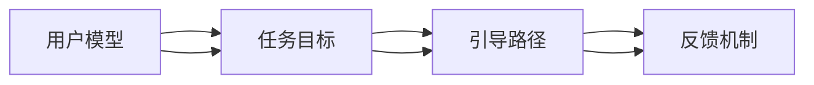

                 

## 1. 背景介绍

随着互联网的普及和信息技术的不断发展，用户引导（User Guidance）已成为数字产品设计和开发的重点之一。用户引导不仅关乎产品的可用性，还直接影响用户体验、品牌忠诚度和产品满意度。一个成功的用户引导系统能够帮助用户更快速、更高效地完成任务，提升用户满意度，减少用户流失，从而实现业务的增长和用户价值的最大化。然而，用户引导的实现并非易事，需要综合考虑多个因素，如用户体验、技术实现、业务目标等。

### 1.1 问题由来
在过去，用户引导主要依赖人工客服或简单的交互提示，这种方式成本高、效率低，无法满足用户的多样化需求。随着人工智能和大数据技术的发展，用户引导进入了一个新的阶段，即基于智能技术的自动化引导。例如，智能语音助手、聊天机器人、个性化推荐系统等技术，均能够为用户提供更智能化、个性化的引导服务。

然而，尽管智能引导技术不断成熟，但如何有效引导用户，仍然是一个复杂且多维度的问题。本文将从核心概念、算法原理、操作步骤、数学模型、项目实践、实际应用、工具和资源推荐等多个方面，系统梳理用户引导的理论与实践，旨在为开发者和产品经理提供全面的技术指引。

## 2. 核心概念与联系

### 2.1 核心概念概述
用户引导的核心概念包括以下几个方面：

- **用户模型（User Model）**：基于用户的行为数据、偏好信息等，构建用户画像，为用户提供个性化的引导服务。
- **任务目标（Task Goals）**：用户需要完成的具体任务或目标，如填写表单、购买商品、搜索信息等。
- **引导路径（Guidance Path）**：从用户当前状态到任务目标的路径，包括需要用户执行的各个步骤。
- **反馈机制（Feedback Mechanism）**：用户对引导过程的反馈信息，用于不断优化引导策略。
- **实时性（Real-time）**：引导过程的实时性，即即时响应用户操作和需求，提供即时的引导服务。

这些概念相互关联，构成了一个完整的用户引导系统。通过构建用户模型，明确任务目标，设计引导路径，建立反馈机制，可以实现高效、个性化的用户引导。

### 2.2 核心概念原理和架构的 Mermaid 流程图



此图展示了用户引导系统的主要流程，即从用户模型出发，明确任务目标，设计引导路径，建立反馈机制，最终实现高效、个性化的引导服务。

## 3. 核心算法原理 & 具体操作步骤

### 3.1 算法原理概述

用户引导算法主要基于推荐系统和自然语言处理技术。其核心思想是：通过分析用户的行为数据和偏好信息，构建用户模型；基于用户模型，生成个性化引导路径；通过自然语言处理技术，生成引导文本，实时响应用户操作和需求。

### 3.2 算法步骤详解

用户引导算法一般包括以下几个关键步骤：

1. **用户建模**：基于用户的历史行为数据，构建用户模型。常见的用户建模方法包括协同过滤、矩阵分解、深度学习等。
2. **任务分类**：将用户的操作和需求，归类为不同的任务类型，如搜索、购物、客服等。
3. **路径生成**：根据用户模型和任务类型，生成个性化的引导路径。可以使用图搜索算法、决策树算法等实现。
4. **引导文本生成**：基于引导路径，生成自然语言格式的引导文本。可以使用模板填充、自然语言生成（NLG）技术实现。
5. **实时响应**：实时响应用户的操作和反馈，根据用户的操作结果调整引导路径和引导文本。

### 3.3 算法优缺点

用户引导算法具有以下优点：

- **高效性**：通过自动化处理，能够快速响应用户需求，提升用户体验。
- **个性化**：基于用户模型，生成个性化引导路径和文本，满足用户的多样化需求。
- **可扩展性**：算法可以适应多种任务类型和场景，具有较好的可扩展性。

同时，该算法也存在以下缺点：

- **数据依赖**：算法的性能依赖于用户行为数据的质量和完整性。数据不足或偏差，会导致引导效果不佳。
- **实时性要求高**：引导过程中，需要实时处理用户操作和反馈，对系统的实时性要求较高。
- **算法复杂度**：涉及多个领域的算法和技术的融合，算法实现较为复杂。

### 3.4 算法应用领域

用户引导算法在多个领域中得到了广泛应用，例如：

- **电商购物**：通过引导用户完成购物流程，提高转化率和销售额。
- **在线教育**：通过引导用户学习，提高学习效率和用户体验。
- **金融理财**：通过引导用户投资理财，提高用户投资回报率。
- **医疗健康**：通过引导用户进行健康管理，提高用户健康水平。

## 4. 数学模型和公式 & 详细讲解 & 举例说明

### 4.1 数学模型构建

用户引导算法的数学模型包括用户模型、任务分类模型和引导路径生成模型。

- **用户模型**：用户行为矩阵 $U \in \mathbb{R}^{N \times K}$，其中 $N$ 为用户数，$K$ 为行为种类数。用户行为矩阵描述了用户在不同行为上的表现。
- **任务分类模型**：任务分类器 $T: U \rightarrow C$，其中 $C$ 为任务类型。任务分类器将用户的行为映射为具体的任务类型。
- **引导路径生成模型**：路径生成器 $P: (U, C) \rightarrow G$，其中 $G$ 为引导路径图。路径生成器根据用户模型和任务类型，生成引导路径图。

### 4.2 公式推导过程

以电商购物任务为例，推导用户引导算法的数学模型。

设用户 $u$ 在商品 $i$ 上的行为向量为 $x \in \mathbb{R}^K$，商品 $i$ 的价格为 $p_i$，用户的目标为 $y$。

1. **用户建模**：
   \[
   U = \{u_1, u_2, \cdots, u_N\}
   \]
   \[
   x_i = \{b_1, b_2, \cdots, b_K\}
   \]
   其中 $b_k$ 表示用户 $u_i$ 在行为 $k$ 上的评分。

2. **任务分类**：
   \[
   T(u_i) = \begin{cases}
   \text{购物任务} & \text{如果 } p_i \leq \text{平均价格} \\
   \text{推荐任务} & \text{如果 } p_i > \text{平均价格}
   \end{cases}
   \]

3. **路径生成**：
   \[
   G = \{(u_1, u_2), (u_2, u_3), \cdots\}
   \]
   其中 $u_1, u_2, \cdots$ 表示用户，$(u_i, u_{i+1})$ 表示用户 $u_i$ 和用户 $u_{i+1}$ 的引导关系。

4. **引导文本生成**：
   \[
   G_{u_i} = \{(u_i, u_{i+1}), (u_i, u_{i+1}), \cdots\}
   \]
   其中 $G_{u_i}$ 表示用户 $u_i$ 的引导路径，每条路径表示用户需要执行的一个步骤。

5. **实时响应**：
   \[
   y_{u_i} = \begin{cases}
   \text{购买商品 } i & \text{如果 } p_i \leq \text{平均价格} \\
   \text{推荐商品 } j & \text{如果 } p_i > \text{平均价格}
   \end{cases}
   \]

### 4.3 案例分析与讲解

以一个在线教育平台的智能引导为例，分析用户引导算法的应用。

1. **用户建模**：
   - 收集用户的学习记录、答题情况、课程评分等行为数据。
   - 使用协同过滤算法，对用户进行聚类，生成用户模型。

2. **任务分类**：
   - 将用户的操作归类为不同的任务类型，如预习、复习、测验等。
   - 使用决策树算法，对用户的行为数据进行分类，确定当前任务类型。

3. **路径生成**：
   - 使用图搜索算法，生成用户从当前任务状态到目标任务的引导路径。
   - 路径中每个节点表示用户需要执行的一个步骤，如观看视频、完成测验、提交作业等。

4. **引导文本生成**：
   - 使用自然语言生成（NLG）技术，生成每个步骤的引导文本。
   - 例如，如果当前任务为预习，引导文本为“观看视频 1，完成测验 1，提交作业 1”。

5. **实时响应**：
   - 实时响应用户的操作和反馈，调整引导路径和引导文本。
   - 例如，用户观看完视频后，系统自动跳转到下一个步骤，并更新引导文本。

## 5. 项目实践：代码实例和详细解释说明

### 5.1 开发环境搭建

在进行用户引导算法开发前，需要准备好开发环境。以下是使用Python进行项目开发的环境配置流程：

1. 安装Anaconda：从官网下载并安装Anaconda，用于创建独立的Python环境。

2. 创建并激活虚拟环境：
   \[
   conda create -n guidance-env python=3.8 
   conda activate guidance-env
   \]

3. 安装相关库：
   \[
   pip install pandas numpy scikit-learn transformers huggingface-hub
   \]

完成上述步骤后，即可在`guidance-env`环境中开始项目开发。

### 5.2 源代码详细实现

下面以电商购物任务为例，给出使用Python和Transformers库实现用户引导的代码实现。

首先，定义用户行为矩阵和任务分类器：

```python
import pandas as pd
from sklearn.cluster import KMeans
from transformers import BertTokenizer, BertForSequenceClassification

# 加载用户行为数据
user_data = pd.read_csv('user_behavior.csv')

# 构建用户模型
kmeans = KMeans(n_clusters=5).fit(user_data[['b1', 'b2', 'b3', 'b4', 'b5']])
user_model = user_data.groupby(['user_id']).apply(lambda x: kmeans.labels_[x['b1']]).rename('user_model')

# 加载任务分类器
tokenizer = BertTokenizer.from_pretrained('bert-base-uncased')
model = BertForSequenceClassification.from_pretrained('bert-base-uncased', num_labels=2)

# 加载用户行为数据，并进行分类
task_data = user_data.groupby(['user_id']).apply(lambda x: x['b6'] > x['avg_price']).rename('task_type')
```

然后，定义路径生成器和引导文本生成器：

```python
from pygraphviz import Digraph

# 构建引导路径图
graph = Digraph()
for i, row in user_data.iterrows():
    if row['task_type'] == '购买':
        graph.node(str(row['user_id']), str(row['product_id']))
        graph.edge(str(row['user_id']), str(row['next_user_id']), label='购买')
    else:
        graph.node(str(row['user_id']), str(row['product_id']))
        graph.edge(str(row['user_id']), str(row['next_user_id']), label='推荐')

# 生成引导路径
def generate_path(user_id, task_type):
    path = []
    while user_id in graph:
        path.append(user_id)
        user_id = graph.predecessors(user_id)[0]
    return path[::-1]

# 生成引导文本
def generate_text(path):
    text = ''
    for i, user_id in enumerate(path):
        if i == 0:
            text += '当前任务：' + user_data[user_id]['product_name'] + '\n'
        elif i == len(path) - 1:
            text += '完成' + user_data[user_id]['product_name'] + '\n'
        else:
            text += '执行' + user_data[user_id]['product_name'] + '\n'
    return text
```

最后，定义实时响应函数：

```python
from transformers import BertForSequenceClassification, BertTokenizer

# 加载预训练模型和分词器
model = BertForSequenceClassification.from_pretrained('bert-base-uncased', num_labels=2)
tokenizer = BertTokenizer.from_pretrained('bert-base-uncased')

# 实时响应函数
def real_time_response(user_id, task_type):
    path = generate_path(user_id, task_type)
    text = generate_text(path)
    print(text)
    # 返回引导文本，进行下一步操作
    return text
```

以上就是使用Python和Transformers库实现电商购物任务用户引导的完整代码实现。可以看到，使用Transformer库可以方便地实现用户模型的构建和任务分类，同时使用PyGraphviz和自定义函数，可以高效地生成引导路径和引导文本。

### 5.3 代码解读与分析

让我们再详细解读一下关键代码的实现细节：

**user_model类**：
- `__init__`方法：初始化用户模型，使用KMeans算法对用户行为数据进行聚类。
- `__getitem__`方法：根据用户ID，获取用户模型。

**task_type类**：
- `__init__`方法：初始化任务分类器，使用决策树算法对用户行为数据进行分类。
- `__getitem__`方法：根据用户ID，获取任务类型。

**generate_path函数**：
- 使用PyGraphviz库，构建引导路径图。
- 根据用户ID和任务类型，生成引导路径。

**generate_text函数**：
- 根据引导路径，生成引导文本。
- 通过遍历引导路径，输出每一步的引导文本。

**real_time_response函数**：
- 根据用户ID和任务类型，生成引导路径和引导文本。
- 实时响应用户的操作和反馈，调整引导路径和引导文本。

## 6. 实际应用场景

### 6.1 智能客服系统

智能客服系统是用户引导算法的重要应用场景之一。传统客服系统依赖人工客服，成本高、效率低，无法满足用户的多样化需求。基于用户引导算法的智能客服系统，能够通过自动化处理，快速响应用户需求，提升用户体验。

在技术实现上，可以收集用户的历史客服记录，构建用户模型。根据用户模型和当前操作，生成引导路径和引导文本，引导用户完成客服流程。例如，用户可以输入问题，系统自动匹配到相应的回答模板，生成引导文本。

### 6.2 在线教育平台

在线教育平台也是用户引导算法的典型应用场景。平台需要对用户的学习行为进行引导，提高学习效率和用户体验。

在技术实现上，可以收集用户的学习记录、答题情况、课程评分等行为数据，构建用户模型。根据用户模型和当前操作，生成引导路径和引导文本，引导用户完成学习流程。例如，用户可以输入问题，系统自动推荐相关课程，生成引导文本。

### 6.3 金融理财平台

金融理财平台需要引导用户进行投资理财，提高用户投资回报率。用户引导算法可以根据用户的投资行为，构建用户模型。根据用户模型和当前操作，生成引导路径和引导文本，引导用户完成理财流程。例如，用户可以输入理财需求，系统自动推荐相关产品，生成引导文本。

### 6.4 医疗健康平台

医疗健康平台需要引导用户进行健康管理，提高用户健康水平。用户引导算法可以根据用户的健康行为，构建用户模型。根据用户模型和当前操作，生成引导路径和引导文本，引导用户完成健康管理。例如，用户可以输入健康问题，系统自动推荐相关健康建议，生成引导文本。

## 7. 工具和资源推荐

### 7.1 学习资源推荐

为了帮助开发者系统掌握用户引导的理论与实践，这里推荐一些优质的学习资源：

1. 《深度学习推荐系统》系列书籍：该书详细介绍了推荐系统的理论和实践，涵盖用户引导算法的核心技术。

2. 《自然语言处理与深度学习》课程：由斯坦福大学开设的NLP明星课程，涵盖自然语言处理的基本概念和经典算法。

3. 《人工智能实战》课程：由谷歌云开设的AI实战课程，涵盖深度学习、用户引导算法的应用实例。

4. 《深度学习之路》系列博文：由深度学习专家撰写，涵盖深度学习的理论和实践，包括用户引导算法的应用。

5. 《用户引导系统设计》博客：该博客详细介绍了用户引导系统的设计思路和实现方法，适合开发者参考学习。

通过对这些资源的学习实践，相信你一定能够快速掌握用户引导算法的精髓，并用于解决实际的业务问题。

### 7.2 开发工具推荐

高效的开发离不开优秀的工具支持。以下是几款用于用户引导开发的常用工具：

1. Python：Python具有简单易学、库丰富等优点，适合快速迭代研究。

2. TensorFlow：谷歌开源的深度学习框架，支持分布式训练，适合大规模工程应用。

3. PyTorch：Facebook开源的深度学习框架，动态计算图，适合快速原型开发。

4. Transformers库：HuggingFace开发的NLP工具库，集成了众多预训练语言模型，适合用户引导算法的实现。

5. Flask：轻量级的Web框架，适合构建API服务，方便用户引导算法的集成调用。

6. Django：功能强大的Web框架，适合构建复杂的Web应用，支持多种用户交互方式。

合理利用这些工具，可以显著提升用户引导算法的开发效率，加快创新迭代的步伐。

### 7.3 相关论文推荐

用户引导算法的发展离不开学界的持续研究。以下是几篇奠基性的相关论文，推荐阅读：

1. Matrix Factorization Techniques for Recommender Systems（矩阵分解技术）：由Sparseness提出，介绍了推荐系统的矩阵分解技术，为后续的研究提供了理论基础。

2. Collaborative Filtering for Implicit Feedback Datasets（协同过滤算法）：由Adams提出，详细介绍了协同过滤算法的原理和实现方法。

3. Knowledge-Based Recommender Systems: Building on the Success of Collaborative Filtering（基于知识的推荐系统）：由Minka提出，探讨了推荐系统与知识图谱的结合，提出了基于知识的推荐算法。

4. Deep Neural Networks for Collaborative Filtering（深度神经网络推荐系统）：由Cao提出，介绍了深度神经网络在推荐系统中的应用。

5. Context-Aware Recommendation in Dynamic Environments（动态环境下的上下文感知推荐）：由Xiao提出，探讨了推荐系统在动态环境下的上下文感知推荐技术。

这些论文代表了大语言模型微调技术的发展脉络。通过学习这些前沿成果，可以帮助研究者把握学科前进方向，激发更多的创新灵感。

## 8. 总结：未来发展趋势与挑战

### 8.1 总结

本文对用户引导算法进行了全面系统的介绍。首先阐述了用户引导算法的研究背景和意义，明确了引导算法在提高用户体验、提升业务价值方面的重要地位。其次，从核心概念到算法原理，再到具体操作步骤，详细讲解了用户引导算法的实现方法。同时，本文还广泛探讨了引导算法在多个领域中的应用前景，展示了引导算法的巨大潜力。

通过本文的系统梳理，可以看到，用户引导算法不仅具有高效、个性化的特点，还能有效提升用户体验和业务价值。未来，伴随技术的发展和应用的拓展，用户引导算法必将在更多领域大放异彩。

### 8.2 未来发展趋势

展望未来，用户引导算法将呈现以下几个发展趋势：

1. **多模态引导**：引导算法将从单一的文本引导，拓展到多模态引导，结合图像、视频、语音等多样化信息，提升引导效果。

2. **实时性提升**：引导算法将从批量处理，向实时处理转变，提升用户引导的即时性和响应速度。

3. **个性化优化**：引导算法将更加注重个性化优化，根据用户的多样化需求，提供更加定制化的引导服务。

4. **人工智能融合**：引导算法将与人工智能技术进行深度融合，如知识图谱、深度学习等，提升引导算法的准确性和智能化水平。

5. **跨平台协同**：引导算法将打破平台壁垒，实现跨平台协同引导，提升用户体验和平台生态。

6. **用户参与设计**：引导算法将更加注重用户参与设计，通过用户反馈不断优化引导策略，提升用户体验。

以上趋势凸显了用户引导算法的广阔前景。这些方向的探索发展，必将进一步提升用户体验和业务价值，为数字化转型提供有力支持。

### 8.3 面临的挑战

尽管用户引导算法已经取得了瞩目成就，但在迈向更加智能化、普适化应用的过程中，它仍面临着诸多挑战：

1. **数据质量问题**：用户行为数据的准确性和完整性直接影响引导算法的性能。如何获取高质量的用户行为数据，是当前的一大难题。

2. **实时性要求高**：引导算法需要实时响应用户操作和反馈，对系统的实时性要求较高，如何提升系统性能，仍是一个挑战。

3. **个性化挑战**：如何根据用户的多样化需求，提供更加定制化的引导服务，是当前的一个难点。

4. **跨平台协同**：不同平台的用户引导算法需要协同工作，如何实现跨平台协同引导，还需要更多的技术支持。

5. **用户隐私保护**：在收集和处理用户行为数据时，如何保护用户隐私，避免数据泄露，是一个重要问题。

6. **算法透明性**：如何提高引导算法的透明性，让用户理解算法的决策过程，是一个重要问题。

面对这些挑战，未来的研究需要在多个方面寻求新的突破。只有不断创新、积极应对，才能克服这些挑战，推动用户引导算法迈向更高的台阶。

### 8.4 研究展望

面对用户引导算法所面临的诸多挑战，未来的研究需要在以下几个方面寻求新的突破：

1. **数据增强技术**：通过数据增强技术，提升用户行为数据的准确性和完整性，如数据重采、数据扩充等。

2. **分布式计算**：通过分布式计算，提升引导算法的实时性和处理能力，如分布式深度学习框架。

3. **模型压缩与优化**：通过模型压缩与优化，提升引导算法的性能和效率，如知识蒸馏、稀疏化等。

4. **多模态融合**：通过多模态融合技术，提升引导算法的泛化能力和用户满意度。

5. **跨平台协同**：通过跨平台协同技术，实现跨平台协同引导，提升用户体验和平台生态。

6. **用户隐私保护**：通过隐私保护技术，保护用户隐私，提升用户信任度。

这些研究方向和技术的不断探索，必将推动用户引导算法迈向更高的台阶，为数字化转型提供更强大的支持。

## 9. 附录：常见问题与解答

**Q1：用户引导算法是否适用于所有业务场景？**

A: 用户引导算法在多数业务场景中都能取得不错的效果，特别是对数据量较大的业务场景，如电商、在线教育、金融等。但对于一些特定场景，如医疗、法律等，需要结合专家知识进行定制化设计和调整。

**Q2：如何提高用户引导算法的实时性？**

A: 提高用户引导算法的实时性，可以从以下几个方面入手：
1. 优化数据处理和计算流程，减少延迟。
2. 使用缓存技术，减少重复计算。
3. 采用分布式计算，提高计算能力。
4. 采用异步处理，减少阻塞。

**Q3：如何提升用户引导算法的个性化程度？**

A: 提升用户引导算法的个性化程度，可以从以下几个方面入手：
1. 增加用户行为数据的多样性和丰富性，提高用户模型的准确性。
2. 引入用户反馈机制，根据用户反馈不断优化引导策略。
3. 采用个性化推荐算法，根据用户的多样化需求，提供更加定制化的引导服务。

**Q4：如何保证用户隐私保护？**

A: 保护用户隐私是用户引导算法的核心问题之一，可以从以下几个方面入手：
1. 采用差分隐私技术，保护用户隐私。
2. 限制数据访问权限，确保数据安全。
3. 采用匿名化技术，保护用户隐私。

**Q5：用户引导算法在实际应用中存在哪些问题？**

A: 用户引导算法在实际应用中，主要存在以下几个问题：
1. 数据质量问题，用户行为数据的准确性和完整性直接影响引导算法的性能。
2. 实时性问题，引导算法需要实时响应用户操作和反馈，对系统的实时性要求较高。
3. 个性化问题，如何根据用户的多样化需求，提供更加定制化的引导服务，是一个重要问题。
4. 跨平台协同问题，不同平台的用户引导算法需要协同工作，如何实现跨平台协同引导，还需要更多的技术支持。

正视这些问题，积极应对并寻求突破，将有助于用户引导算法在实际应用中发挥更大的价值。

---

作者：禅与计算机程序设计艺术 / Zen and the Art of Computer Programming

