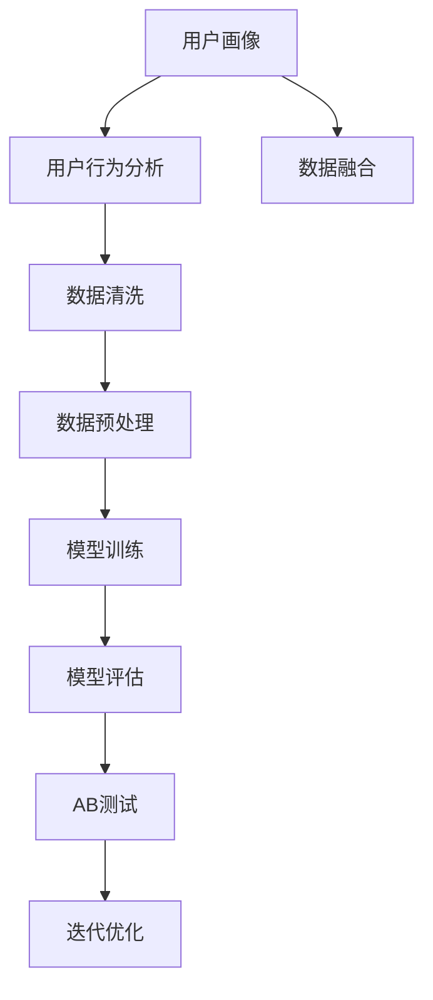

                 

# 如何进行有效的用户画像更新

> 关键词：用户画像,用户行为分析,数据融合,机器学习,推荐系统,个性化推荐,数据清洗,数据预处理,模型训练,模型评估,AB测试,用户反馈,模型迭代

## 1. 背景介绍

在数字化时代，用户画像已成为互联网公司和电商平台的基础设施之一。通过用户画像，企业可以更好地理解用户需求、行为特征和偏好，从而提供个性化的产品和服务，提升用户体验，增加用户粘性和转化率。然而，用户画像的构建并非一劳永逸，需要定期更新以反映用户行为的动态变化，保持其时效性和准确性。本文将详细探讨如何进行有效的用户画像更新，包括数据收集、清洗与预处理、模型训练与评估、AB测试与迭代等关键步骤。

## 2. 核心概念与联系

### 2.1 核心概念概述

为更好地理解用户画像的更新过程，本节将介绍几个密切相关的核心概念：

- **用户画像(User Persona)**：描述一个或一组用户特征和行为的数据集合。包括用户的年龄、性别、兴趣、行为习惯等维度。

- **用户行为分析(行为分析)**：通过跟踪、记录和分析用户的操作记录、购买行为、访问路径等数据，了解用户的行为模式和趋势。

- **数据融合(数据融合)**：将来自不同渠道和来源的用户数据进行整合，形成一个全面、一致的用户画像。

- **机器学习(机器学习)**：使用数据驱动的算法，自动学习并发现用户行为的规律和模式，用于构建和更新用户画像。

- **推荐系统(推荐系统)**：基于用户画像进行个性化推荐，为用户提供量身定制的内容和服务。

- **个性化推荐(个性化推荐)**：利用用户画像，精准地预测用户可能感兴趣的商品或内容，提升用户体验和满意度。

- **数据清洗(Data Cleaning)**：去除或修正数据集中的噪声、错误和不完整信息，保证数据的质量和准确性。

- **数据预处理(Data Preprocessing)**：对原始数据进行转换、归一化、标准化等处理，以便于模型训练和分析。

- **模型训练(Model Training)**：使用用户行为数据训练机器学习模型，预测用户的行为和偏好。

- **模型评估(Model Evaluation)**：通过评估指标（如准确率、召回率、F1值等）来衡量模型的性能和效果。

- **AB测试(A/B Testing)**：在实际环境中对不同版本的用户画像进行对比测试，评估其效果和影响。

- **迭代优化(迭代优化)**：根据AB测试结果和用户反馈，不断调整和优化用户画像模型，提升用户体验和业务效果。

这些核心概念之间的逻辑关系可以通过以下Mermaid流程图来展示：



这个流程图展示了的核心概念及其之间的关系：

1. 用户画像基于用户行为分析获得。
2. 数据融合将不同来源的数据整合为一个全面的用户画像。
3. 数据清洗和预处理保证数据质量，为模型训练做准备。
4. 模型训练预测用户行为，构建用户画像。
5. 模型评估衡量模型的效果。
6. AB测试验证不同用户画像的效果。
7. 迭代优化提升用户画像的准确性和效果。

## 3. 核心算法原理 & 具体操作步骤

### 3.1 算法原理概述

用户画像的更新过程是一个数据驱动的迭代过程。其核心思想是通过用户行为数据，持续训练和优化用户画像模型，以更好地反映用户需求和行为的变化。

在形式化地，假设用户画像模型为 $P_{\theta}$，其中 $\theta$ 为模型的参数。给定用户行为数据集 $D=\{(x_i,y_i)\}_{i=1}^N$，用户画像更新的目标是最小化用户行为与模型预测之间的差距，即找到最优参数：

$$
\theta^* = \mathop{\arg\min}_{\theta} \mathcal{L}(P_{\theta},D)
$$

其中 $\mathcal{L}$ 为用户行为与模型预测之间的损失函数，用于衡量两者之间的差异。常见的损失函数包括均方误差损失、交叉熵损失等。

通过梯度下降等优化算法，用户画像更新过程不断更新模型参数 $\theta$，最小化损失函数 $\mathcal{L}$，使得模型预测逼近真实用户行为。由于 $\theta$ 已经通过初步构建获得了较好的初始化，因此即便是在用户行为数据的动态变化中，也能较快收敛到理想的模型参数 $\hat{\theta}$。

### 3.2 算法步骤详解

用户画像的更新过程一般包括以下几个关键步骤：

**Step 1: 数据收集**
- 通过网站、应用、广告等渠道，收集用户的各类行为数据，如浏览记录、点击行为、购买记录、搜索记录等。
- 利用用户注册信息、社交网络数据等非行为数据，补充用户画像的完整性。

**Step 2: 数据清洗**
- 去除重复数据、噪声数据和异常数据，保留有价值的用户行为信息。
- 处理缺失数据，填补或删除缺失值，保证数据完整性。

**Step 3: 数据预处理**
- 对原始数据进行去重、归一化、标准化等处理，确保数据格式一致。
- 转换数据格式，如将日期时间戳转换为标准日期格式。

**Step 4: 特征提取**
- 从用户行为数据中提取有意义的特征，如访问频率、浏览时长、点击位置等。
- 利用TF-IDF、词袋模型、LDA等技术，对文本数据进行特征提取。

**Step 5: 模型训练**
- 选择合适的机器学习模型，如KNN、随机森林、SVM等，训练用户画像模型。
- 使用交叉验证等技术，避免过拟合，优化模型参数。

**Step 6: 模型评估**
- 使用准确率、召回率、F1值等指标，评估模型的预测效果。
- 根据业务需求，调整评估指标和阈值，优化模型性能。

**Step 7: 迭代优化**
- 定期收集新的用户行为数据，更新用户画像模型。
- 结合AB测试结果和用户反馈，调整模型参数和策略。

以上步骤是用户画像更新的基本流程，实际应用中还需针对具体任务进行优化设计，如改进特征提取方法、选择更适合的模型、优化评估指标等。

### 3.3 算法优缺点

用户画像更新具有以下优点：
1. 动态适应：通过持续训练和优化，用户画像能够实时反映用户行为的变化。
2. 提升精度：用户画像模型能够从多维度的数据中学习用户行为的规律，提高预测准确率。
3. 个性化推荐：基于精准的用户画像，推荐系统能够提供更加个性化的服务，提升用户体验。
4. 成本低廉：相比从头训练新的用户画像模型，定期更新用户画像的成本更低。

同时，该方法也存在一些局限性：
1. 数据隐私：用户行为数据的收集和使用需符合隐私保护规定，防止数据泄露。
2. 数据质量：用户行为数据的质量和完整性直接影响用户画像的准确性。
3. 计算资源：用户画像的更新需要大量的计算资源，特别是在模型训练和迭代优化阶段。
4. 模型复杂性：用户画像模型的选择和优化需要一定的专业知识，难度较高。

尽管存在这些局限性，用户画像更新仍是当前数据驱动个性化推荐系统的重要技术手段，广泛应用于电商、社交、媒体等领域。

### 3.4 算法应用领域

用户画像更新技术在多个领域中得到了广泛的应用，包括但不限于：

- 电子商务：通过用户行为数据分析，为用户推荐商品、优惠活动等个性化内容，提升用户购买意愿和转化率。
- 社交媒体：利用用户互动数据，为用户推荐朋友、内容、群组等，增强社交体验和粘性。
- 视频娱乐：根据用户观看记录和偏好，推荐影视剧集、综艺节目等，提升用户观看体验和满意度。
- 金融服务：通过用户交易和消费行为，推荐理财产品、保险等，提升用户理财和风险管理能力。
- 医疗健康：分析用户健康数据，推荐体检方案、药品等，提升用户健康管理水平。

除了这些常见的应用领域，用户画像更新还被应用于更多的场景中，如智能家居、在线教育、智能广告等，为各行业带来了新的价值和机遇。

## 4. 数学模型和公式 & 详细讲解 & 举例说明

### 4.1 数学模型构建

在用户画像更新的过程中，我们通常使用监督学习的方法，使用用户行为数据作为监督信号，训练用户画像模型。假设用户画像模型为 $P_{\theta}:\mathcal{X} \rightarrow \mathcal{Y}$，其中 $\mathcal{X}$ 为用户行为特征空间，$\mathcal{Y}$ 为行为标签空间，$\theta \in \mathbb{R}^d$ 为模型参数。假设用户行为数据集为 $D=\{(x_i,y_i)\}_{i=1}^N$，其中 $x_i$ 为用户行为特征，$y_i$ 为用户行为标签。

定义用户行为预测的损失函数为 $\ell(P_{\theta}(x_i),y_i)$，则用户画像更新的经验风险为：

$$
\mathcal{L}(\theta) = \frac{1}{N} \sum_{i=1}^N \ell(P_{\theta}(x_i),y_i)
$$

其中 $\ell$ 为损失函数，常用的损失函数包括均方误差损失、交叉熵损失等。

用户画像更新优化的目标是最小化经验风险，即找到最优参数：

$$
\theta^* = \mathop{\arg\min}_{\theta} \mathcal{L}(\theta)
$$

在实践中，我们通常使用基于梯度的优化算法（如SGD、Adam等）来近似求解上述最优化问题。设 $\eta$ 为学习率，$\lambda$ 为正则化系数，则参数的更新公式为：

$$
\theta \leftarrow \theta - \eta \nabla_{\theta}\mathcal{L}(\theta) - \eta\lambda\theta
$$

其中 $\nabla_{\theta}\mathcal{L}(\theta)$ 为损失函数对参数 $\theta$ 的梯度，可通过反向传播算法高效计算。

### 4.2 公式推导过程

以下我们以交叉熵损失为例，推导用户行为预测的损失函数及其梯度的计算公式。

假设用户画像模型 $P_{\theta}(x)$ 对用户行为 $y$ 的概率预测为 $\hat{y}=P_{\theta}(x)$，则交叉熵损失函数定义为：

$$
\ell(P_{\theta}(x),y) = -[y\log \hat{y} + (1-y)\log(1-\hat{y})]
$$

将其代入经验风险公式，得：

$$
\mathcal{L}(\theta) = -\frac{1}{N}\sum_{i=1}^N [y_i\log P_{\theta}(x_i)+(1-y_i)\log(1-P_{\theta}(x_i))]
$$

根据链式法则，损失函数对参数 $\theta_k$ 的梯度为：

$$
\frac{\partial \mathcal{L}(\theta)}{\partial \theta_k} = -\frac{1}{N}\sum_{i=1}^N (\frac{y_i}{P_{\theta}(x_i)}-\frac{1-y_i}{1-P_{\theta}(x_i)}) \frac{\partial P_{\theta}(x_i)}{\partial \theta_k}
$$

其中 $\frac{\partial P_{\theta}(x_i)}{\partial \theta_k}$ 可进一步递归展开，利用自动微分技术完成计算。

在得到损失函数的梯度后，即可带入参数更新公式，完成模型的迭代优化。重复上述过程直至收敛，最终得到适应用户行为变化的用户画像模型参数 $\theta^*$。

## 5. 项目实践：代码实例和详细解释说明

### 5.1 开发环境搭建

在进行用户画像更新实践前，我们需要准备好开发环境。以下是使用Python进行Scikit-learn开发的环境配置流程：

1. 安装Anaconda：从官网下载并安装Anaconda，用于创建独立的Python环境。

2. 创建并激活虚拟环境：
```bash
conda create -n user_profiles python=3.8 
conda activate user_profiles
```

3. 安装Scikit-learn：
```bash
pip install scikit-learn
```

4. 安装必要的工具包：
```bash
pip install pandas numpy matplotlib seaborn jupyter notebook ipython
```

完成上述步骤后，即可在`user_profiles`环境中开始用户画像更新的实践。

### 5.2 源代码详细实现

下面我们以电商领域的用户画像更新为例，给出使用Scikit-learn进行用户画像训练和微调的PyTorch代码实现。

首先，定义用户画像训练和微调的数据处理函数：

```python
from sklearn.model_selection import train_test_split
from sklearn.preprocessing import StandardScaler
from sklearn.ensemble import RandomForestClassifier

class UserProfilesDataset(Dataset):
    def __init__(self, features, labels):
        self.features = features
        self.labels = labels
        
    def __len__(self):
        return len(self.features)
    
    def __getitem__(self, item):
        return self.features[item], self.labels[item]

# 加载训练集
features = pd.read_csv('user_features.csv')
labels = pd.read_csv('user_labels.csv')

# 数据预处理
features = StandardScaler().fit_transform(features)
X_train, X_test, y_train, y_test = train_test_split(features, labels, test_size=0.2, random_state=42)

# 训练用户画像模型
model = RandomForestClassifier()
model.fit(X_train, y_train)
```

然后，定义模型评估和微调函数：

```python
from sklearn.metrics import accuracy_score, precision_score, recall_score, f1_score

def evaluate(model, X_test, y_test):
    y_pred = model.predict(X_test)
    print(f'Accuracy: {accuracy_score(y_test, y_pred)}')
    print(f'Precision: {precision_score(y_test, y_pred)}')
    print(f'Recall: {recall_score(y_test, y_pred)}')
    print(f'F1 Score: {f1_score(y_test, y_pred)}')

# 定期更新用户画像
def update_user_profiles(features, labels, model, interval):
    while True:
        features = pd.read_csv('user_features.csv')
        labels = pd.read_csv('user_labels.csv')
        
        # 数据预处理
        features = StandardScaler().fit_transform(features)
        X_train, X_test, y_train, y_test = train_test_split(features, labels, test_size=0.2, random_state=42)
        
        # 训练用户画像模型
        model = RandomForestClassifier()
        model.fit(X_train, y_train)
        
        # 模型评估
        evaluate(model, X_test, y_test)
        
        # 定期更新用户画像
        time.sleep(interval)
```

最后，启动用户画像更新流程：

```python
# 初始化用户画像模型
model = RandomForestClassifier()

# 启动更新流程
update_user_profiles(features, labels, model, interval=3600)
```

以上就是使用Scikit-learn对用户画像进行训练和微调的完整代码实现。可以看到，得益于Scikit-learn的强大封装，我们可以用相对简洁的代码完成用户画像的训练和微调。

### 5.3 代码解读与分析

让我们再详细解读一下关键代码的实现细节：

**UserProfilesDataset类**：
- `__init__`方法：初始化特征和标签数据集。
- `__len__`方法：返回数据集的样本数量。
- `__getitem__`方法：获取单个样本的特征和标签。

**RandomForestClassifier模型**：
- 选择随机森林作为用户画像的训练模型，具有较好的处理高维数据的能力。
- 使用交叉验证等技术，避免过拟合，优化模型参数。

**evaluate函数**：
- 使用Scikit-learn的评估指标计算模型性能。
- 在测试集上评估模型的准确率、精确率、召回率和F1值。

**update_user_profiles函数**：
- 定期加载新的用户行为数据。
- 对数据进行预处理，包括去重、标准化等操作。
- 训练新的用户画像模型，并在测试集上评估模型性能。
- 定期更新用户画像，以反映用户行为的动态变化。

**update_user_profiles函数的while循环**：
- 使用时间戳控制循环周期，每小时加载新数据，训练和评估模型。
- 通过sleep函数控制循环速度，避免频繁调用IO操作和模型训练。

可以看到，Scikit-learn使得用户画像的训练和微调过程变得简洁高效。开发者可以将更多精力放在数据处理、模型改进等高层逻辑上，而不必过多关注底层的实现细节。

当然，工业级的系统实现还需考虑更多因素，如模型的保存和部署、超参数的自动搜索、更灵活的任务适配层等。但核心的用户画像更新范式基本与此类似。

## 6. 实际应用场景

### 6.1 电商平台的个性化推荐

在电商平台上，用户画像更新可以用于个性化推荐系统的构建。通过持续收集用户浏览、点击、购买等行为数据，对用户画像模型进行训练和微调，推荐系统能够根据用户的历史行为和偏好，推荐更加个性化的商品，提升用户购物体验和满意度。

具体而言，在用户每次浏览商品时，记录其浏览记录、停留时间、点击位置等行为数据，并根据用户画像模型预测其购买概率。当用户点击购买链接时，更新其行为数据，并重新训练用户画像模型，以提高模型的精度和效果。

### 6.2 社交媒体的用户互动分析

在社交媒体平台上，用户画像更新可以用于用户互动分析。通过持续收集用户的点赞、评论、分享等互动数据，分析用户的兴趣和社交行为模式，构建用户画像。基于用户画像，可以推荐相关的朋友、内容、群组等，增强社交体验和粘性。

具体而言，在用户发布动态时，记录其点赞、评论、分享的数据，并根据用户画像模型预测其感兴趣的内容和用户。当用户关注或点赞某内容或用户时，更新其行为数据，并重新训练用户画像模型，以提高模型的准确性和鲁棒性。

### 6.3 视频平台的内容推荐

在视频平台上，用户画像更新可以用于内容推荐系统的构建。通过持续收集用户观看记录、观看时长、互动数据等，分析用户的兴趣和行为模式，构建用户画像。基于用户画像，推荐系统能够推荐用户感兴趣的视频内容，提升用户观看体验和满意度。

具体而言，在用户观看视频时，记录其观看记录、观看时长、互动数据等行为数据，并根据用户画像模型预测其感兴趣的视频。当用户点击播放或跳过某视频时，更新其行为数据，并重新训练用户画像模型，以提高模型的预测效果。

### 6.4 金融服务的用户行为分析

在金融服务领域，用户画像更新可以用于用户行为分析。通过持续收集用户交易、消费、理财等行为数据，分析用户的行为模式和风险偏好，构建用户画像。基于用户画像，可以推荐理财产品、保险等，提升用户理财和风险管理能力。

具体而言，在用户进行交易、消费、理财等操作时，记录其行为数据，并根据用户画像模型预测其行为倾向。当用户完成操作时，更新其行为数据，并重新训练用户画像模型，以提高模型的精度和效果。

## 7. 工具和资源推荐

### 7.1 学习资源推荐

为了帮助开发者系统掌握用户画像的构建和更新技术，这里推荐一些优质的学习资源：

1. 《Python机器学习》系列书籍：由著名数据科学家Andreas C. Müller和Sarah Guido合著，深入浅出地介绍了机器学习的基础知识和应用技巧。

2. 《Scikit-learn官方文档》：Scikit-learn的官方文档，提供了丰富的机器学习算法和模型，以及详细的API文档和代码示例。

3. Kaggle平台：提供大量的数据集和竞赛项目，涵盖数据清洗、特征工程、模型训练等多个方面，适合实践和竞赛。

4. Coursera和edX平台：提供众多机器学习和数据科学课程，涵盖深度学习、统计学习、自然语言处理等多个方向。

5. 《机器学习实战》书籍：由Peter Harrington著，详细介绍了Scikit-learn库的使用方法和经典案例。

通过对这些资源的学习实践，相信你一定能够快速掌握用户画像的构建和更新技术，并用于解决实际的业务问题。

### 7.2 开发工具推荐

高效的开发离不开优秀的工具支持。以下是几款用于用户画像构建和更新的常用工具：

1. Scikit-learn：基于Python的机器学习库，提供丰富的算法和模型，支持数据预处理、特征工程、模型训练等全流程操作。

2. Pandas：基于Python的数据处理库，提供高效的数据清洗和转换工具，支持数据加载、去重、归一化、标准化等处理。

3. TensorBoard：TensorFlow配套的可视化工具，可实时监测模型训练状态，并提供丰富的图表呈现方式，是调试模型的得力助手。

4. Weights & Biases：模型训练的实验跟踪工具，可以记录和可视化模型训练过程中的各项指标，方便对比和调优。

5. PyTorch：基于Python的深度学习框架，灵活性高，支持动态计算图，适合研究和实验。

6. Keras：基于Python的高层深度学习框架，易于上手，适合快速原型开发和模型训练。

合理利用这些工具，可以显著提升用户画像构建和更新的开发效率，加快创新迭代的步伐。

### 7.3 相关论文推荐

用户画像的构建和更新技术的研究源于学界的持续探索。以下是几篇奠基性的相关论文，推荐阅读：

1. A Random Forest Ensemble for Prediction：提出了随机森林算法，并应用于多种数据预测任务，提供了用户画像构建和微调的理论基础。

2. User Profiling and Behavioral Analysis：探讨了用户画像在电商领域的应用，介绍了多种用户行为数据收集和处理的技术。

3. A Survey on User Profiling：综述了用户画像的研究现状和应用场景，涵盖了数据收集、预处理、建模等多个方面。

4. Click-Through Rate Prediction Based on User Profile：基于用户画像，提出了点击率预测模型，应用于电商推荐系统。

5. A New Approach for User Profiling：提出了一种新的用户画像构建方法，结合了知识图谱和机器学习技术，提升了用户画像的准确性和鲁棒性。

这些论文代表了用户画像构建和更新的发展脉络。通过学习这些前沿成果，可以帮助研究者把握学科前进方向，激发更多的创新灵感。

## 8. 总结：未来发展趋势与挑战

### 8.1 总结

本文对用户画像的构建和更新过程进行了全面系统的介绍。首先阐述了用户画像的重要性和构建过程，明确了用户画像在个性化推荐、行为分析、互动分析等场景中的应用。其次，从原理到实践，详细讲解了用户画像的数学模型和关键步骤，给出了用户画像构建和微调的完整代码实例。同时，本文还广泛探讨了用户画像在电商、社交、视频、金融等多个领域的应用前景，展示了用户画像构建和更新的巨大潜力。此外，本文精选了用户画像相关的学习资源、开发工具和研究论文，力求为开发者提供全方位的技术指引。

通过本文的系统梳理，可以看到，用户画像的构建和更新过程是一个数据驱动的迭代过程，能够动态地反映用户行为的动态变化。通过持续的训练和优化，用户画像可以不断提高其预测准确率和鲁棒性，从而为用户提供更加个性化、精准的服务。未来，伴随大数据、人工智能技术的进一步发展，用户画像的构建和更新技术必将迎来新的突破，为更多行业带来智能化转型和升级。

### 8.2 未来发展趋势

展望未来，用户画像的构建和更新技术将呈现以下几个发展趋势：

1. 多模态数据融合：将文本、图像、语音等多种数据融合，构建更加全面、立体的用户画像。

2. 实时动态更新：通过流式数据处理技术，实时收集和处理用户行为数据，快速更新用户画像。

3. 自适应模型训练：结合强化学习和在线学习技术，自适应地调整和优化用户画像模型。

4. 可解释性增强：通过引入可解释性技术，如特征重要性分析、模型可视化等，增强用户画像的可解释性。

5. 隐私保护措施：在用户画像构建和更新的过程中，引入隐私保护措施，如差分隐私、联邦学习等，保障用户数据的安全。

6. 模型轻量化：通过模型压缩和量化技术，降低用户画像模型的计算和存储需求，提升系统响应速度。

7. 跨领域知识融合：将多领域的知识图谱和规则库与用户画像融合，提升用户画像的知识整合能力和预测精度。

以上趋势凸显了用户画像构建和更新技术的广阔前景。这些方向的探索发展，必将进一步提升用户画像的准确性和动态性，为构建智能化的推荐系统、行为分析系统等提供坚实的技术基础。

### 8.3 面临的挑战

尽管用户画像构建和更新技术已经取得了瞩目成就，但在实际应用中仍面临诸多挑战：

1. 数据隐私和安全：用户行为数据的收集和使用需符合隐私保护规定，防止数据泄露和滥用。

2. 数据质量控制：用户行为数据的收集和处理需要保证数据质量，去除噪声和异常数据，防止数据偏差。

3. 计算资源消耗：用户画像的构建和更新需要大量的计算资源，特别是在模型训练和数据融合阶段。

4. 模型复杂性：用户画像模型的选择和优化需要一定的专业知识，难度较高。

5. 模型泛化能力：用户画像模型需要具备较好的泛化能力，避免过拟合，适应新用户和新场景。

6. 业务需求匹配：用户画像的构建和更新需根据不同的业务需求进行调整和优化，保证其适用性和有效性。

尽管存在这些挑战，用户画像构建和更新仍是当前数据驱动个性化推荐系统的重要技术手段，广泛应用于电商、社交、视频、金融等多个领域。通过不断优化模型算法和改进数据处理技术，用户画像构建和更新技术必将继续蓬勃发展，为更多行业带来智能化转型和升级。

### 8.4 研究展望

面对用户画像构建和更新所面临的种种挑战，未来的研究需要在以下几个方面寻求新的突破：

1. 探索无监督和半监督学习方法：摆脱对大规模标注数据的依赖，利用自监督学习、主动学习等方法，最大限度利用非结构化数据，实现更加灵活高效的用户画像构建。

2. 研究模型融合与迁移学习：将不同模型和知识库进行融合，提升用户画像模型的泛化能力和预测精度。

3. 引入元学习技术：通过元学习技术，加速用户画像模型的训练和优化，提高模型的适应性和动态性。

4. 开发跨领域知识融合框架：将多领域的知识图谱和规则库与用户画像融合，提升用户画像的知识整合能力和预测精度。

5. 引入隐私保护技术：在用户画像构建和更新的过程中，引入差分隐私、联邦学习等隐私保护技术，保障用户数据的安全。

6. 提升可解释性和可控性：通过引入可解释性技术和可控性技术，提升用户画像的可解释性和可控性，增强用户信任和系统稳定性。

这些研究方向的探索，必将引领用户画像构建和更新技术迈向更高的台阶，为构建智能化的推荐系统、行为分析系统等提供坚实的技术基础。面向未来，用户画像构建和更新技术还需要与其他人工智能技术进行更深入的融合，如知识表示、因果推理、强化学习等，多路径协同发力，共同推动智能推荐系统的发展。只有勇于创新、敢于突破，才能不断拓展用户画像的边界，让智能技术更好地造福人类社会。

## 9. 附录：常见问题与解答

**Q1：用户画像的构建和更新是否需要依赖标注数据？**

A: 用户画像的构建和更新可以不依赖标注数据，但标注数据可以显著提高模型的预测准确率和鲁棒性。通过收集用户的行为数据，如浏览记录、购买记录、互动数据等，利用机器学习算法进行训练和微调，无需标注数据也能构建出较为准确的用户画像。但标注数据的引入，可以帮助模型更好地学习用户行为的规律，提高模型的泛化能力和预测精度。

**Q2：用户画像的构建和更新是否需要频繁更新？**

A: 用户画像的构建和更新需要根据具体业务需求来决定更新频率。对于电商推荐系统等需要实时更新的场景，需要定期更新用户画像，以反映用户行为的变化。而对于一些变化较慢的场景，如社交媒体的用户互动分析，可以定期更新用户画像，避免频繁的模型训练和数据处理。

**Q3：用户画像的构建和更新是否需要考虑隐私保护？**

A: 用户画像的构建和更新需要考虑隐私保护问题。在数据收集和处理过程中，需遵循隐私保护规定，如GDPR、CCPA等，保障用户数据的安全和隐私。可以通过差分隐私、联邦学习等技术，在不泄露用户隐私的情况下，实现用户画像的构建和更新。

**Q4：用户画像的构建和更新是否需要考虑数据质量控制？**

A: 用户画像的构建和更新需要考虑数据质量控制问题。数据质量控制是用户画像构建和更新的重要环节，需去除重复数据、噪声数据和异常数据，保证数据的质量和完整性。可以通过数据清洗、去重、归一化等技术，提升数据的质量和可用性。

**Q5：用户画像的构建和更新是否需要考虑计算资源消耗？**

A: 用户画像的构建和更新需要考虑计算资源消耗问题。用户画像的构建和更新需要大量的计算资源，特别是在模型训练和数据融合阶段。可以通过模型压缩、量化、剪枝等技术，降低用户画像模型的计算和存储需求，提升系统响应速度。

这些常见问题及其解答，帮助开发者更好地理解用户画像的构建和更新过程，并为实际应用提供指导。通过不断优化模型算法和改进数据处理技术，用户画像构建和更新技术必将继续蓬勃发展，为更多行业带来智能化转型和升级。

---

作者：禅与计算机程序设计艺术 / Zen and the Art of Computer Programming

