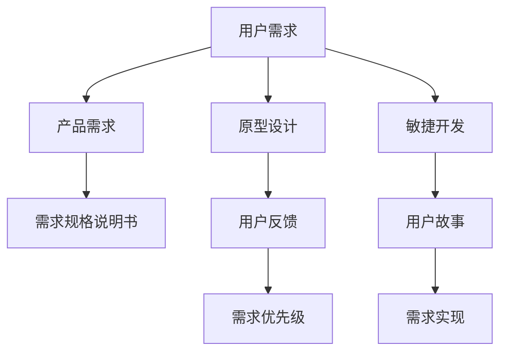

                 

# 如何进行有效的用户需求分析

## 1. 背景介绍

在信息技术飞速发展的今天，用户需求分析已经成为产品设计和开发过程中不可或缺的一环。一个准确、全面的用户需求分析，不仅能够帮助企业更精准地把握市场需求，避免在产品开发中走弯路，还能够提高产品的市场竞争力，实现用户的满意度。然而，现实中的用户需求分析往往存在许多问题，如需求不明确、需求收集难度大、需求难以量化等。因此，如何有效进行用户需求分析，成为每个产品经理、项目经理以及开发者必须掌握的一项技能。本文将从背景介绍、核心概念与联系、核心算法原理与具体操作步骤、数学模型与详细讲解、项目实践与代码实例、实际应用场景与未来展望、工具和资源推荐、总结与未来发展趋势与挑战以及附录常见问题与解答等方面，全面系统地介绍如何进行有效的用户需求分析。

## 2. 核心概念与联系

在进行用户需求分析的过程中，我们需要掌握以下几个核心概念：

1. **用户需求(User Requirements)**：用户在实际使用产品过程中所提出的需求，包括功能需求、性能需求、用户体验需求等。
2. **产品需求(Product Requirements)**：根据用户需求设计的可实现的功能模块或性能指标，是开发者进行产品设计和开发的具体指导。
3. **需求规格说明书(RS)**：一种用于记录和传达产品需求的文档，一般包括用户需求、产品需求、系统架构、数据结构、接口规范等。
4. **原型设计(Prototyping)**：在实际开发之前，通过创建模拟产品界面的方式，让用户参与到产品设计和开发中，以收集用户的反馈和建议，优化产品功能。
5. **需求优先级(Priority)**：根据用户需求的重要性和紧急性，对需求进行排序，以便在资源有限的情况下，优先满足最关键的用户的需求。
6. **敏捷开发(Agile Development)**：一种迭代、增量式的开发方式，强调团队协作和用户参与，通过多次迭代不断优化产品需求和功能。
7. **用户故事(User Story)**：一种以用户行为为中心的需求描述方式，通过用户故事描述用户在使用产品时的场景和期望，帮助团队理解和实现用户需求。

这些概念之间的联系通过以下Mermaid流程图展示：



这个流程图展示了用户需求从收集到实现的全过程，强调了各个环节的相互作用和重要性。

## 3. 核心算法原理 & 具体操作步骤

### 3.1 算法原理概述

用户需求分析的算法原理主要基于系统工程学和心理学。通过对用户行为和心理特征的深入分析，以及产品需求与用户需求的映射，我们可以构建一个系统化的需求分析框架，从而实现有效的需求收集和实现。

用户需求分析的基本流程如下：

1. 用户调研：通过问卷调查、访谈、用户观察等方式，收集用户的基本需求和行为数据。
2. 数据分析：对用户调研数据进行统计分析和情感分析，以了解用户的关键痛点和需求。
3. 需求定义：根据用户调研结果，明确产品的功能需求、性能需求和用户体验需求。
4. 需求文档：编写需求规格说明书，详细描述产品需求、系统架构、接口规范等。
5. 原型设计：创建产品原型，让用户参与到产品设计和开发中，收集用户反馈。
6. 需求验证：通过A/B测试等方式，验证需求实现的可行性和用户满意度。
7. 需求优先级：根据需求的重要性和紧急性，对需求进行排序和优化。
8. 需求实现：根据需求文档和原型设计，实现产品功能。

### 3.2 算法步骤详解

用户需求分析的算法步骤可以分为以下几个阶段：

1. **用户调研阶段**：
   - 定义调研目标和问题：明确调研的具体目的和需要解决的问题。
   - 选择合适的调研方法：如问卷调查、深度访谈、用户观察等。
   - 设计调研问卷或访谈提纲：根据调研目标设计相应的调研问卷或访谈提纲。
   - 实施调研活动：对目标用户进行问卷调查或访谈，收集数据。
   - 数据分析：对收集到的数据进行统计分析和情感分析，以发现用户需求的关键点。

2. **需求定义阶段**：
   - 整理调研数据：对调研数据进行整理和分类，形成用户需求文档。
   - 定义产品需求：根据用户需求，定义产品的功能需求、性能需求和用户体验需求。
   - 编写需求规格说明书：编写需求规格说明书，详细描述产品需求、系统架构、接口规范等。

3. **原型设计阶段**：
   - 创建产品原型：根据需求文档，创建产品原型，并进行初步的用户测试。
   - 收集用户反馈：对产品原型进行用户测试，收集用户的反馈和建议。
   - 优化产品原型：根据用户反馈，对产品原型进行优化和改进。
   - 重复迭代：不断迭代产品原型，直至满足用户需求。

4. **需求验证阶段**：
   - 设计验证实验：根据需求文档和产品原型，设计验证实验。
   - 实施验证实验：在实际环境中实施验证实验，收集数据。
   - 分析验证结果：对验证实验结果进行分析，评估需求实现的可行性和用户满意度。

5. **需求优先级阶段**：
   - 定义需求优先级：根据需求的重要性和紧急性，对需求进行排序和优化。
   - 制定需求计划：制定需求实现计划，安排开发资源和进度。
   - 实现需求：根据需求文档和优先级，实现产品的功能需求。

### 3.3 算法优缺点

用户需求分析的算法优点包括：

1. **全面性**：通过用户调研和数据分析，能够全面了解用户需求，避免在产品设计中遗漏关键功能。
2. **科学性**：采用数据驱动的方式，对用户需求进行科学分析，避免主观臆断。
3. **灵活性**：根据用户反馈和需求变化，灵活调整产品设计和实现方案。
4. **用户参与度**：通过原型设计和用户测试，提高用户参与度，提升产品满意度。

用户需求分析的算法缺点包括：

1. **时间和成本**：用户调研和需求定义需要耗费大量时间和资源。
2. **需求波动**：用户需求可能会随着时间、市场变化而变化，需要持续跟踪和调整。
3. **数据分析难度**：对用户调研数据进行情感分析和数据挖掘，需要一定的技术和工具支持。

### 3.4 算法应用领域

用户需求分析的应用领域非常广泛，包括但不限于以下几方面：

1. **软件开发**：在软件开发过程中，通过用户需求分析，明确产品的功能需求和性能需求，提高产品的市场竞争力。
2. **产品设计**：在产品设计阶段，通过用户调研和需求定义，优化产品功能和用户体验。
3. **市场营销**：在市场营销过程中，通过用户调研和需求分析，了解用户需求和行为，制定更有效的市场策略。
4. **客户服务**：在客户服务过程中，通过用户调研和需求分析，提升客户满意度和忠诚度。
5. **运营管理**：在运营管理过程中，通过用户需求分析，优化产品功能和流程，提高运营效率。

## 4. 数学模型和公式 & 详细讲解 & 举例说明

### 4.1 数学模型构建

用户需求分析的数学模型主要基于数据挖掘和机器学习。通过对用户行为数据的分析，可以构建用户需求分析的数学模型，从而更科学地理解和满足用户需求。

用户需求分析的数学模型包括：

1. **用户行为模型**：描述用户在使用产品过程中行为的数据模型。
2. **需求关系模型**：描述用户需求与产品功能之间的关系的数据模型。
3. **情感分析模型**：描述用户对产品功能满意度的情感分析模型。
4. **需求优先级模型**：描述用户需求优先级的数学模型。

### 4.2 公式推导过程

以用户行为模型为例，假设用户行为数据为一个时间序列 $X = \{X_1, X_2, ..., X_t\}$，其中 $X_t$ 表示用户在第 $t$ 时刻的行为数据。

用户行为模型的推导过程如下：

1. **时间序列分析**：对用户行为数据进行时间序列分析，识别出用户行为规律。
2. **相关性分析**：对用户行为数据进行相关性分析，识别出用户行为的关键特征。
3. **聚类分析**：对用户行为数据进行聚类分析，识别出不同用户群体的行为特征。
4. **回归分析**：对用户行为数据进行回归分析，建立用户行为预测模型。
5. **预测验证**：对建立的预测模型进行验证，评估其预测精度。

用户行为模型的一般公式为：

$$
\hat{X}_t = \beta_0 + \beta_1 X_{t-1} + \epsilon_t
$$

其中，$\hat{X}_t$ 为预测用户在第 $t$ 时刻的行为数据，$\beta_0$ 为截距，$\beta_1$ 为回归系数，$\epsilon_t$ 为随机误差项。

### 4.3 案例分析与讲解

以电商平台的用户行为分析为例，我们可以使用用户行为模型来预测用户的购买行为。具体步骤如下：

1. **数据收集**：收集用户在电商平台上的浏览、点击、购买等行为数据。
2. **数据预处理**：对收集到的数据进行清洗和归一化，去除异常值和噪声。
3. **时间序列分析**：对用户行为数据进行时间序列分析，识别出用户行为规律。
4. **相关性分析**：对用户行为数据进行相关性分析，识别出用户行为的关键特征，如浏览时间、点击频率等。
5. **聚类分析**：对用户行为数据进行聚类分析，识别出不同用户群体的行为特征，如新用户和老用户、高价值用户和低价值用户等。
6. **回归分析**：对用户行为数据进行回归分析，建立用户行为预测模型，预测用户的购买行为。
7. **预测验证**：对建立的预测模型进行验证，评估其预测精度，优化模型参数。
8. **产品推荐**：根据预测结果，推荐用户感兴趣的商品，提升用户购买率。

## 5. 项目实践：代码实例和详细解释说明

### 5.1 开发环境搭建

用户需求分析的开发环境需要具备以下几个条件：

1. **编程语言**：Python、Java、C++等。
2. **数据处理工具**：Pandas、NumPy等。
3. **数据分析工具**：Matplotlib、Scikit-learn等。
4. **机器学习框架**：TensorFlow、Keras、PyTorch等。
5. **数据可视化工具**：Tableau、PowerBI等。
6. **用户调研工具**：SurveyMonkey、Google Forms等。

开发环境搭建的步骤如下：

1. **安装编程语言和工具**：在计算机上安装Python、Java、C++等编程语言，以及Pandas、NumPy、Matplotlib、Scikit-learn、TensorFlow、Keras、PyTorch、Tableau、PowerBI、SurveyMonkey、Google Forms等数据处理、数据分析、机器学习、数据可视化、用户调研工具。
2. **配置环境变量**：配置编程语言和工具的环境变量，确保能够在开发环境中运行程序。
3. **安装依赖包**：安装用户需求分析所需的依赖包，如TensorFlow、Keras、PyTorch等。

### 5.2 源代码详细实现

以用户行为分析为例，使用Python和Scikit-learn库进行用户行为预测模型的实现：

```python
import pandas as pd
from sklearn.linear_model import LinearRegression
from sklearn.model_selection import train_test_split
from sklearn.metrics import mean_squared_error

# 数据读取和预处理
data = pd.read_csv('user_behavior.csv')
data = data.dropna()

# 数据拆分
X = data[['浏览时间', '点击频率']]
y = data['购买行为']
X_train, X_test, y_train, y_test = train_test_split(X, y, test_size=0.2)

# 模型训练
model = LinearRegression()
model.fit(X_train, y_train)

# 模型验证
y_pred = model.predict(X_test)
mse = mean_squared_error(y_test, y_pred)
print('MSE:', mse)

# 预测用户行为
user_data = pd.read_csv('user_data.csv')
user_data['预测购买行为'] = model.predict(user_data[['浏览时间', '点击频率']])
```

### 5.3 代码解读与分析

在上述代码中，我们使用了Python和Scikit-learn库进行用户行为预测模型的实现。具体步骤如下：

1. **数据读取和预处理**：使用Pandas库读取用户行为数据，并进行数据清洗和归一化。
2. **数据拆分**：将用户行为数据拆分为特征数据X和标签数据y，并划分为训练集和测试集。
3. **模型训练**：使用LinearRegression模型对训练集进行训练。
4. **模型验证**：使用测试集对训练好的模型进行验证，计算模型预测误差。
5. **预测用户行为**：对用户行为数据进行预测，并输出预测结果。

## 6. 实际应用场景

### 6.1 电子商务

在电子商务领域，用户需求分析可以帮助电商平台了解用户购买行为，提升用户购物体验和满意度。具体应用场景包括：

1. **个性化推荐**：通过分析用户行为数据，推荐用户感兴趣的商品，提升用户购买率。
2. **用户画像构建**：通过聚类分析，构建用户画像，提升用户服务质量。
3. **流量优化**：通过时间序列分析，优化网站流量，提高网站转化率。

### 6.2 金融行业

在金融行业，用户需求分析可以帮助金融机构了解客户需求，提升客户满意度和忠诚度。具体应用场景包括：

1. **理财建议**：通过分析用户理财行为，提供个性化的理财建议，提升客户理财体验。
2. **风险评估**：通过情感分析，评估用户对金融产品的满意度，及时调整产品策略。
3. **用户画像构建**：通过聚类分析，构建客户画像，提升客户服务质量。

### 6.3 医疗行业

在医疗行业，用户需求分析可以帮助医疗机构了解患者需求，提升医疗服务质量和满意度。具体应用场景包括：

1. **健康管理**：通过分析患者健康行为数据，提供个性化的健康管理建议，提升患者健康管理体验。
2. **诊疗优化**：通过情感分析，评估患者对诊疗过程的满意度，及时调整诊疗策略。
3. **用户画像构建**：通过聚类分析，构建患者画像，提升患者服务质量。

### 6.4 未来应用展望

未来，用户需求分析将向着更加智能化、自动化和个性化方向发展。具体应用展望包括：

1. **智能用户画像**：通过大数据分析和机器学习，构建智能用户画像，实现用户需求的精准预测和匹配。
2. **自动化需求分析**：通过自然语言处理和语音识别技术，实现自动化的用户需求分析，提升效率和准确性。
3. **个性化推荐系统**：通过深度学习和人工智能技术，实现个性化的用户需求推荐，提升用户满意度和忠诚度。
4. **情感分析技术**：通过情感分析技术，实时监控用户需求和反馈，及时调整产品策略和用户体验。

## 7. 工具和资源推荐

### 7.1 学习资源推荐

为了帮助开发者系统掌握用户需求分析的理论基础和实践技巧，这里推荐一些优质的学习资源：

1. **《用户需求分析与实践》**：介绍用户需求分析的基本概念、方法和实践技巧的书籍。
2. **《用户体验设计》**：介绍用户体验设计的基本概念、方法和实践技巧的书籍。
3. **《需求分析与需求工程》**：介绍需求分析的基本概念、方法和实践技巧的书籍。
4. **Coursera《用户研究与设计》课程**：斯坦福大学开设的课程，涵盖用户研究、用户测试和用户设计等方面的内容。
5. **Udemy《产品管理》课程**：介绍产品管理的理论和实践的课程。

通过这些资源的学习实践，相信你一定能够快速掌握用户需求分析的精髓，并用于解决实际的业务问题。

### 7.2 开发工具推荐

以下是几款用于用户需求分析开发的常用工具：

1. **JIRA**：项目管理工具，支持敏捷开发和需求管理，可与其他开发工具集成。
2. **Confluence**：文档协作工具，支持需求文档的编写、分享和协作。
3. **Trello**：任务管理工具，支持敏捷开发和需求跟踪。
4. **Mockito**：Java测试框架，支持测试驱动开发和需求验证。
5. **TestNG**：Java测试框架，支持自动化测试和需求验证。
6. **Selenium**：Web自动化测试工具，支持需求验证和用户测试。
7. **Tableau**：数据可视化工具，支持数据分析和需求可视化。
8. **PowerBI**：数据可视化工具，支持数据分析和需求可视化。

合理利用这些工具，可以显著提升用户需求分析的开发效率，加快创新迭代的步伐。

### 7.3 相关论文推荐

用户需求分析的研究源于学界的持续研究。以下是几篇奠基性的相关论文，推荐阅读：

1. **《需求分析与系统工程》**：介绍了需求分析的基本概念、方法和实践技巧的书籍。
2. **《需求分析与模型驱动的开发》**：介绍了需求分析和模型驱动开发的基本概念、方法和实践技巧的书籍。
3. **《用户体验设计》**：介绍了用户体验设计的基本概念、方法和实践技巧的书籍。
4. **《敏捷开发与用户需求分析》**：介绍了敏捷开发和用户需求分析的基本概念、方法和实践技巧的书籍。

这些论文代表了大用户需求分析的发展脉络。通过学习这些前沿成果，可以帮助研究者把握学科前进方向，激发更多的创新灵感。

## 8. 总结：未来发展趋势与挑战

### 8.1 总结

本文对用户需求分析的方法进行了全面系统的介绍。首先阐述了用户需求分析的背景和意义，明确了用户需求分析在产品设计和开发中的重要性。其次，从核心概念、算法原理和具体操作步骤、数学模型与详细讲解、项目实践与代码实例、实际应用场景与未来展望、工具和资源推荐等方面，全面系统地介绍了如何进行有效的用户需求分析。

通过本文的系统梳理，可以看到，用户需求分析是产品设计和开发中不可或缺的一环，能够帮助企业更好地理解用户需求，提升产品竞争力和用户体验。然而，用户需求分析也面临诸多挑战，如数据收集难度大、需求波动性强、数据分析复杂等。只有不断优化用户需求分析的方法，才能更好地适应变化多端的市场需求，实现产品的持续创新和优化。

### 8.2 未来发展趋势

展望未来，用户需求分析将呈现以下几个发展趋势：

1. **数据驱动**：随着大数据技术的普及，用户需求分析将更多地依赖于数据驱动，提高分析的准确性和可靠性。
2. **自动化和智能化**：通过人工智能和机器学习技术，实现自动化和智能化的用户需求分析，提高效率和准确性。
3. **个性化**：基于用户画像和行为数据，实现个性化的用户需求分析和推荐，提升用户满意度和忠诚度。
4. **跨领域融合**：将用户需求分析与其他领域技术进行融合，如自然语言处理、情感分析、知识图谱等，提升用户需求分析的全面性和准确性。
5. **实时化**：通过实时数据采集和分析，实现用户需求分析的实时化，提高反应速度和灵活性。

### 8.3 面临的挑战

尽管用户需求分析技术已经取得了显著进展，但在实际应用中也面临诸多挑战：

1. **数据获取难度**：用户需求分析需要大量数据支持，但数据获取难度大，成本高。
2. **需求波动性**：用户需求和市场环境不断变化，需求分析模型需要不断更新和调整。
3. **数据隐私保护**：用户行为数据的收集和分析需要遵守数据隐私保护法规，避免侵犯用户隐私。
4. **需求量化难度**：用户需求难以量化，需要开发合适的评估指标和方法。
5. **需求多样性**：用户需求多样化，需要开发多种需求分析方法和工具。

### 8.4 研究展望

面对用户需求分析所面临的诸多挑战，未来的研究需要在以下几个方面寻求新的突破：

1. **数据采集和处理**：开发高效的数据采集和处理技术，降低数据获取难度和成本。
2. **需求模型优化**：开发更智能化的需求分析模型，提高分析的准确性和可靠性。
3. **需求量化评估**：开发合理的需求量化评估方法，提高需求分析的可操作性和可衡量性。
4. **用户画像构建**：开发更全面、精准的用户画像构建技术，提升用户需求分析的个性化和精准性。
5. **跨领域融合**：将用户需求分析与其他领域技术进行融合，提升需求分析的全面性和准确性。

这些研究方向的探索，必将引领用户需求分析技术迈向更高的台阶，为构建安全、可靠、可解释、可控的智能系统铺平道路。面向未来，用户需求分析技术还需要与其他人工智能技术进行更深入的融合，如自然语言处理、情感分析、知识图谱等，多路径协同发力，共同推动自然语言理解和智能交互系统的进步。只有勇于创新、敢于突破，才能不断拓展需求分析的边界，让智能技术更好地造福人类社会。

## 9. 附录：常见问题与解答

**Q1：用户需求分析的主要步骤是什么？**

A: 用户需求分析的主要步骤包括：

1. 用户调研：通过问卷调查、访谈、用户观察等方式，收集用户的基本需求和行为数据。
2. 数据分析：对用户调研数据进行统计分析和情感分析，以发现用户需求的关键点。
3. 需求定义：根据用户调研结果，明确产品的功能需求、性能需求和用户体验需求。
4. 原型设计：创建产品原型，并进行初步的用户测试。
5. 需求验证：通过A/B测试等方式，验证需求实现的可行性和用户满意度。
6. 需求优先级：根据需求的重要性和紧急性，对需求进行排序和优化。
7. 需求实现：根据需求文档和优先级，实现产品的功能需求。

**Q2：用户需求分析的核心概念有哪些？**

A: 用户需求分析的核心概念包括：

1. 用户需求：用户在实际使用产品过程中所提出的需求，包括功能需求、性能需求、用户体验需求等。
2. 产品需求：根据用户需求设计的可实现的功能模块或性能指标。
3. 需求规格说明书：一种用于记录和传达产品需求的文档。
4. 原型设计：在实际开发之前，通过创建模拟产品界面的方式，让用户参与到产品设计和开发中，以收集用户的反馈和建议。
5. 需求优先级：根据需求的重要性和紧急性，对需求进行排序，以便在资源有限的情况下，优先满足最关键的用户的需求。
6. 敏捷开发：一种迭代、增量式的开发方式，强调团队协作和用户参与。
7. 用户故事：一种以用户行为为中心的需求描述方式。

**Q3：用户需求分析的算法优缺点是什么？**

A: 用户需求分析的算法优点包括：

1. 全面性：通过用户调研和数据分析，能够全面了解用户需求，避免在产品设计中遗漏关键功能。
2. 科学性：采用数据驱动的方式，对用户需求进行科学分析，避免主观臆断。
3. 灵活性：根据用户反馈和需求变化，灵活调整产品设计和实现方案。
4. 用户参与度：通过原型设计和用户测试，提高用户参与度，提升产品满意度。

用户需求分析的算法缺点包括：

1. 时间和成本：用户调研和需求定义需要耗费大量时间和资源。
2. 需求波动：用户需求可能会随着时间、市场变化而变化，需要持续跟踪和调整。
3. 数据分析难度：对用户调研数据进行情感分析和数据挖掘，需要一定的技术和工具支持。

**Q4：如何进行用户行为数据的采集和预处理？**

A: 用户行为数据的采集和预处理可以通过以下步骤实现：

1. 数据收集：使用数据采集工具，如SurveyMonkey、Google Forms等，收集用户行为数据。
2. 数据清洗：对采集到的数据进行清洗和去重，去除异常值和噪声。
3. 数据归一化：对数据进行归一化和标准化处理，以提高数据分析的准确性。
4. 数据编码：将用户行为数据转换为数字编码，方便后续的数据分析和建模。
5. 数据存储：将处理后的数据存储到数据库中，方便后续的数据分析和建模。

**Q5：如何选择合适的用户需求分析方法？**

A: 选择合适的用户需求分析方法需要考虑以下几个因素：

1. 用户需求的特点：根据用户需求的复杂度和多样性，选择合适的用户调研方法和数据分析方法。
2. 产品的特点：根据产品的功能和性能要求，选择合适的需求定义方法和原型设计方法。
3. 团队的资源：根据团队的技术和人力资源，选择合适的需求优先级方法和需求实现方法。
4. 时间成本：根据项目的预算和时间限制，选择合适的方法和工具。

选择合适的用户需求分析方法，需要综合考虑上述因素，以实现最优的效果。

---

作者：禅与计算机程序设计艺术 / Zen and the Art of Computer Programming

