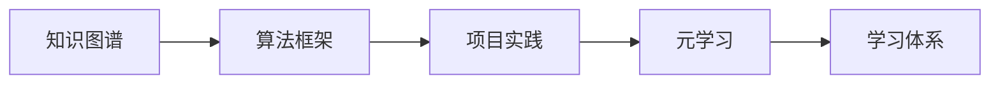

                 

# 学习体系:持续进化的不竭动力

在当今高速发展的信息时代，知识的更新和技术的迭代已成为常态。作为一名IT专家，如何在瞬息万变的技术环境中保持持续学习的能力，不断提升自己的技术深度和广度，成为一项至关重要的任务。本文将围绕构建可持续发展的学习体系，从核心概念、算法原理、项目实践、实际应用场景、工具和资源推荐、未来发展趋势与挑战等多个维度展开探讨，旨在为IT领域从业者提供一份全面的技术指南，帮助他们在知识与技术的长河中不断前行。

## 1. 背景介绍

在信息技术迅猛发展的今天，新概念、新技术和新工具层出不穷，这对IT从业者来说既是挑战也是机遇。想要在职场中保持竞争力，持续学习成为了一项不可或缺的能力。技术的快速迭代要求从业者不仅需要掌握最新的理论知识，还要具备实际操作和解决实际问题的能力。同时，信息技术的广泛应用也带来了学习方式的革新，从传统的线下课堂到在线学习平台，从单点学习到跨领域知识的融合，学习的渠道和方式都在不断拓展和丰富。

## 2. 核心概念与联系

### 2.1 核心概念概述

为更好地理解构建学习体系的重要性，我们需要首先明确几个核心概念：

- **学习体系（Learning System）**：旨在通过系统化的课程和实践，帮助学习者掌握相关领域的基础知识和技能，并通过持续的实践和反思，提升解决复杂问题的能力。

- **知识图谱（Knowledge Graph）**：一种用于表示实体、属性和关系的图形化结构，用于构建知识间的关联网络，帮助学习者更直观地理解和应用知识。

- **算法框架（Algorithm Framework）**：一套用于实现特定功能的算法模块和编程框架，便于学习者快速构建和实现算法原型。

- **项目实践（Project-Based Learning）**：通过具体项目的应用和实践，将理论知识转化为实际操作能力，提高学习者的项目管理和团队协作能力。

- **元学习（Meta-Learning）**：一种学习如何学习（Learning How to Learn）的能力，旨在通过优化学习策略和自我反思，提升学习效率和效果。

这些核心概念之间存在紧密的联系。构建学习体系需要融合知识图谱和算法框架，帮助学习者系统化地掌握知识，并通过项目实践和元学习提升学习效果。通过这种系统化的学习方式，学习者可以更高效地掌握新技术，适应技术发展的潮流。

### 2.2 核心概念原理和架构的 Mermaid 流程图



## 3. 核心算法原理 & 具体操作步骤

### 3.1 算法原理概述

构建学习体系的核心算法原理主要包括知识表示、学习策略优化和实践反馈三个方面。知识图谱作为知识表示的工具，通过构建实体、属性和关系的图形化结构，帮助学习者系统化地理解和应用知识。学习策略优化利用元学习框架，通过不断调整学习参数和策略，提升学习效率和效果。实践反馈则通过项目实践和项目评估，提供实际的反馈信息，帮助学习者及时调整学习策略，优化学习效果。

### 3.2 算法步骤详解

构建学习体系的步骤主要包括以下几个方面：

1. **知识图谱构建**：选择合适的方法和技术，如本体构建、实体关系抽取等，将知识转化为图形化结构，构建知识图谱。

2. **算法框架选择**：根据学习目标选择合适的算法框架，如TensorFlow、PyTorch等深度学习框架，或Scikit-Learn等传统机器学习框架。

3. **项目实践规划**：根据学习目标和知识图谱，规划具体的项目实践，包括项目的选择、目标设定、进度安排等。

4. **元学习策略设计**：设计元学习策略，包括学习参数的调整、学习进度的优化、学习资源的分配等，提升学习效率。

5. **学习效果评估**：通过项目实践和项目评估，收集反馈信息，评估学习效果，调整学习策略，持续改进学习体系。

### 3.3 算法优缺点

构建学习体系的优势主要体现在系统化和结构化上，通过知识图谱和算法框架的系统化构建，学习者可以更高效地掌握知识，并通过项目实践和元学习不断提升学习效果。同时，构建学习体系也有助于学习者形成良好的学习习惯，培养自我反思和自我调整的能力。

然而，构建学习体系也面临一些挑战。首先，知识图谱的构建需要大量的先验知识和专业技能，对于初学者来说可能存在一定的难度。其次，算法框架的选择和优化也需要一定的技术积累，对学习者的技术水平提出了较高的要求。此外，学习效果的评估和反馈获取也需要在实践中不断优化，需要花费一定的时间和精力。

### 3.4 算法应用领域

构建学习体系不仅适用于IT领域，也广泛应用于教育、医疗、金融等多个领域。在教育领域，通过构建知识图谱和算法框架，可以系统化地培养学生的知识和技能，提升教学效果。在医疗领域，构建学习体系可以帮助医疗工作者掌握最新的医疗技术和知识，提高诊断和治疗的准确性。在金融领域，通过构建知识图谱和算法框架，可以提升金融分析师的分析能力和决策水平，降低金融风险。

## 4. 数学模型和公式 & 详细讲解 & 举例说明

### 4.1 数学模型构建

构建学习体系的数学模型主要涉及知识表示、学习策略优化和实践反馈三个方面。知识图谱的构建可以通过关系抽取和实体链接等方法，将知识转化为图形化结构。学习策略的优化可以通过元学习框架，调整学习参数和策略，提升学习效果。实践反馈的获取可以通过项目评估和项目结果分析等方法，收集实际反馈信息。

### 4.2 公式推导过程

知识图谱构建的公式推导包括实体抽取和关系抽取。实体抽取的公式为：

$$
E = \{e_1, e_2, ..., e_n\}
$$

其中 $e_i$ 表示第 $i$ 个实体。关系抽取的公式为：

$$
R = \{r_1, r_2, ..., r_m\}
$$

其中 $r_j$ 表示第 $j$ 个关系。学习策略优化的公式为：

$$
\theta = \mathop{\arg\min}_{\theta} \mathcal{L}(\theta)
$$

其中 $\theta$ 为学习参数，$\mathcal{L}$ 为学习损失函数，表示优化目标。实践反馈的获取可以通过项目评估公式：

$$
\mathcal{F} = \{f_1, f_2, ..., f_k\}
$$

其中 $f_i$ 表示第 $i$ 个项目评估指标，如准确率、召回率、F1值等。

### 4.3 案例分析与讲解

以构建数据科学领域的学习体系为例，可以通过以下步骤来实现：

1. **知识图谱构建**：构建数据科学的知识图谱，包括数据预处理、特征工程、模型选择和评估等节点，通过关系抽取和实体链接，将知识转化为图形化结构。

2. **算法框架选择**：选择TensorFlow、PyTorch等深度学习框架，或Scikit-Learn等传统机器学习框架，作为算法框架。

3. **项目实践规划**：设计多个数据科学项目，包括数据预处理、特征工程、模型训练和评估等，制定详细的项目计划和进度安排。

4. **元学习策略设计**：设计元学习策略，包括学习参数的调整、学习进度的优化、学习资源的分配等，提升学习效率。

5. **学习效果评估**：通过项目实践和项目评估，收集反馈信息，评估学习效果，调整学习策略，持续改进学习体系。

## 5. 项目实践：代码实例和详细解释说明

### 5.1 开发环境搭建

构建学习体系需要进行大量的算法实现和项目实践，因此需要选择一个合适的开发环境。以下是使用Python进行TensorFlow开发的环境配置流程：

1. 安装Anaconda：从官网下载并安装Anaconda，用于创建独立的Python环境。

2. 创建并激活虚拟环境：
```bash
conda create -n tf-env python=3.7
conda activate tf-env
```

3. 安装TensorFlow：根据CUDA版本，从官网获取对应的安装命令。例如：
```bash
conda install tensorflow tensorflow-gpu=2.6 -c conda-forge
```

4. 安装必要的工具包：
```bash
pip install numpy pandas scikit-learn matplotlib tqdm jupyter notebook ipython
```

完成上述步骤后，即可在`tf-env`环境中开始构建学习体系的实践。

### 5.2 源代码详细实现

以下是一个简单的数据科学学习体系构建示例，具体实现如下：

```python
import tensorflow as tf
import numpy as np
from sklearn.datasets import load_iris
from sklearn.model_selection import train_test_split
from sklearn.preprocessing import StandardScaler

# 加载数据集
iris = load_iris()
X = iris.data
y = iris.target

# 划分训练集和测试集
X_train, X_test, y_train, y_test = train_test_split(X, y, test_size=0.2, random_state=42)

# 标准化数据
scaler = StandardScaler()
X_train = scaler.fit_transform(X_train)
X_test = scaler.transform(X_test)

# 定义模型
model = tf.keras.Sequential([
    tf.keras.layers.Dense(10, activation='relu'),
    tf.keras.layers.Dense(1, activation='sigmoid')
])

# 编译模型
model.compile(optimizer=tf.keras.optimizers.Adam(0.001), loss='binary_crossentropy', metrics=['accuracy'])

# 训练模型
model.fit(X_train, y_train, epochs=10, batch_size=32, validation_data=(X_test, y_test))

# 评估模型
loss, accuracy = model.evaluate(X_test, y_test)
print('Test loss:', loss)
print('Test accuracy:', accuracy)
```

### 5.3 代码解读与分析

上述代码展示了从数据预处理到模型训练和评估的完整流程，包括数据标准化、模型定义、模型编译、模型训练和模型评估等步骤。其中，数据标准化是数据预处理的关键步骤，通过标准化处理，可以消除特征之间的量纲差异，提升模型的训练效果。模型定义和编译则根据具体问题选择合适的神经网络结构和优化器。模型训练过程中，通过设定合适的批次大小和迭代轮数，进行多轮训练，并在每个epoch后评估模型性能。最终，通过模型评估函数，计算测试集上的损失和准确率，输出评估结果。

## 6. 实际应用场景

### 6.1 数据科学教育

构建学习体系在数据科学教育中具有重要应用价值。通过知识图谱和算法框架的系统化构建，可以系统地教授数据科学的基础知识和技能，提升学生的实际应用能力。

### 6.2 金融数据分析

构建学习体系可以提升金融分析师的数据分析和预测能力。通过系统化的学习，金融分析师可以掌握最新的数据分析技术和工具，提升对金融市场和资产价格的预测准确性。

### 6.3 医疗诊断

构建学习体系可以帮助医疗工作者掌握最新的医疗技术和知识，提高诊断和治疗的准确性，提升医疗服务的质量和效率。

## 7. 工具和资源推荐

### 7.1 学习资源推荐

为了帮助学习者高效构建学习体系，以下是一些优质的学习资源：

1. Coursera、edX等在线教育平台：提供大量的在线课程和资源，涵盖数据科学、机器学习、深度学习等多个领域。

2. Kaggle数据科学竞赛：通过实际的数据科学项目，锻炼学习者的数据分析和模型构建能力。

3. GitHub开源项目：查找和研究优秀的开源项目，学习先进的算法和技术实现。

4. 数据科学社区：如Data Science Central、KDnuggets等，提供丰富的学习资源和交流平台。

5. 专业书籍：如《深度学习》（Ian Goodfellow）、《Python机器学习》（Sebastian Raschka）等，深入浅出地介绍数据科学和机器学习的理论和实践。

### 7.2 开发工具推荐

构建学习体系需要选择合适的开发工具和平台，以下是一些常用的工具：

1. Jupyter Notebook：免费的开源笔记本工具，支持多种编程语言，适合数据科学项目开发。

2. VS Code：轻量级的代码编辑器，支持多种编程语言和扩展，便于学习和开发。

3. Git和GitHub：版本控制工具和代码托管平台，便于团队协作和代码管理。

4. Google Colab：谷歌提供的免费Jupyter Notebook服务，支持GPU和TPU算力，适合大规模计算任务。

### 7.3 相关论文推荐

构建学习体系的学术研究涉及多个领域，以下是几篇经典论文推荐：

1. "Knowledge-Graph-Based Recommendation System: A Survey"（《基于知识图谱的推荐系统综述》）：介绍了知识图谱在推荐系统中的应用，探讨了知识图谱构建和推荐算法的设计。

2. "Meta-Learning: A Survey of Recent Advances and Future Directions"（《元学习：近期进展和未来方向综述》）：综述了元学习的最新研究进展和未来发展方向，提供了系统化的学习框架和方法。

3. "Learning How to Learn: An Iceberg with a Mount Everest on Top"（《学习如何学习：冰山与珠峰之巅》）：探讨了元学习的核心思想和实践技巧，提供了实用的学习策略和工具。

## 8. 总结：未来发展趋势与挑战

### 8.1 总结

构建学习体系是IT从业者不断提升技术能力和知识水平的重要途径。通过系统化的知识图谱和算法框架，结合项目实践和元学习，学习者可以高效掌握相关领域的知识和技能，提升解决复杂问题的能力。本文通过系统化的分析和案例讲解，为构建学习体系提供了详细的指导。

### 8.2 未来发展趋势

展望未来，构建学习体系将呈现以下几个发展趋势：

1. **知识图谱的应用将更加广泛**：知识图谱在各行各业的应用将不断拓展，通过知识图谱构建知识网络，提升学习效率和效果。

2. **学习策略的优化将更加智能化**：随着元学习技术的发展，学习策略的优化将更加智能化，通过自适应调整学习参数和策略，提升学习效果。

3. **项目实践的多样化**：随着技术的不断进步，项目实践的形式将更加多样化，通过跨领域的项目实践，提升学习者的综合能力。

4. **学习工具和平台将更加丰富**：在线教育平台、开源社区和专业书籍等学习资源将更加丰富，为学习者提供更高效、更便捷的学习工具。

### 8.3 面临的挑战

尽管构建学习体系在提升学习效率和效果方面具有重要价值，但也面临一些挑战：

1. **知识图谱构建的难度**：知识图谱的构建需要大量的先验知识和专业技能，对学习者提出了较高的要求。

2. **学习策略优化的复杂性**：学习策略的优化需要一定的技术积累和实践经验，对学习者的技术水平提出了挑战。

3. **项目实践的灵活性**：项目实践的形式和内容需要不断调整和优化，以适应技术发展的趋势。

### 8.4 研究展望

未来，构建学习体系的研究方向将包括：

1. **知识图谱的自动化构建**：通过自动化技术，降低知识图谱构建的难度和成本，提高知识图谱的构建效率。

2. **学习策略的自动化优化**：通过自动化优化技术，提升学习策略的智能性和效果，降低学习者的技术门槛。

3. **跨领域的学习实践**：通过跨领域的项目实践，提升学习者的综合能力，适应技术发展的趋势。

4. **学习工具的智能化**：通过智能化学习工具，提升学习效率和效果，支持学习者的个性化学习需求。

这些研究方向将推动构建学习体系的技术进步，为学习者提供更高效、更便捷的学习方式，提升他们在技术领域的竞争力。

## 9. 附录：常见问题与解答

**Q1: 构建学习体系需要哪些必备条件？**

A: 构建学习体系需要以下必备条件：
1. 基础知识：掌握相关领域的基础知识，如编程语言、数学基础、统计学等。
2. 学习资源：获取丰富的学习资源，如在线课程、书籍、论文等。
3. 实践机会：通过实际项目实践，将理论知识转化为实际操作能力。
4. 反馈机制：通过项目评估和反思，获取反馈信息，不断改进学习策略。

**Q2: 构建学习体系的核心步骤是什么？**

A: 构建学习体系的核心步骤包括：
1. 知识图谱构建：将知识转化为图形化结构，构建知识网络。
2. 算法框架选择：选择合适的算法框架，实现具体功能。
3. 项目实践规划：设计具体的项目实践，制定详细的项目计划。
4. 元学习策略设计：调整学习参数和策略，提升学习效率和效果。
5. 学习效果评估：收集反馈信息，评估学习效果，调整学习策略。

**Q3: 如何选择合适的学习资源？**

A: 选择合适的学习资源需要考虑以下几个方面：
1. 学习目标：根据学习目标选择适合的学习资源，如深度学习、机器学习、数据科学等。
2. 学习难度：选择适合自己当前水平的学习资源，避免选择过于复杂或过于简单的资源。
3. 学习方式：选择适合的学习方式，如在线课程、书籍、视频等。
4. 学习工具：选择适合的学习工具，如Jupyter Notebook、VS Code等。

**Q4: 如何进行有效的项目实践？**

A: 进行有效的项目实践需要考虑以下几个方面：
1. 项目选择：选择与自己学习目标相关的项目，提高学习效果。
2. 项目规划：制定详细的项目计划和进度安排，确保项目顺利进行。
3. 项目实施：按计划进行项目实践，注意代码规范和项目管理。
4. 项目评估：通过项目评估获取反馈信息，调整学习策略。

---

作者：禅与计算机程序设计艺术 / Zen and the Art of Computer Programming

