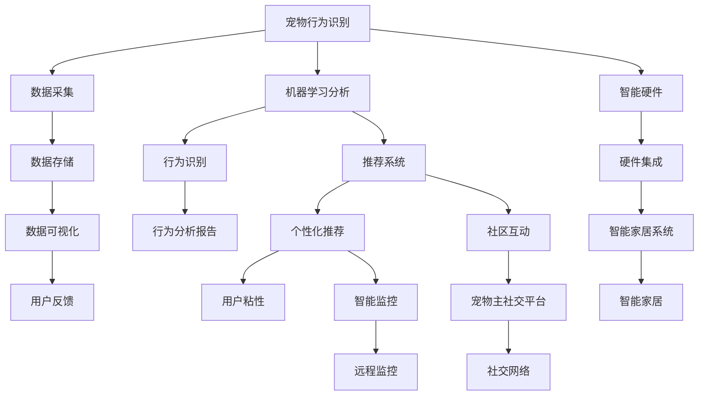

                 

# 宠物经济创业：陪伴动物的商业价值

## 1. 背景介绍

### 1.1 问题由来
随着社会经济的发展和生活水平的提高，人们对宠物的情感需求日益增加。全球宠物市场近年来持续快速增长，宠物经济成为了一个全新的经济增长点。据市场研究机构预测，2025年全球宠物市场规模将达到3000亿美元。在中国，宠物市场规模也在不断扩大，宠物相关产业如宠物食品、用品、医疗保健、训练教育等领域迎来了广阔的市场机会。

宠物经济创业，即是围绕宠物提供产品和服务，通过满足宠物主和宠物本身的需求，实现商业价值的增值。宠物经济创业需要综合利用数据分析、人工智能、物联网、个性化推荐等技术手段，提供全方位的宠物陪伴解决方案，创造更大的社会和商业价值。

### 1.2 问题核心关键点
宠物经济创业的核心在于如何通过技术和商业创新，为宠物主和宠物提供高质量的陪伴服务，从而满足其需求并实现商业盈利。具体关键点包括：

1. **宠物行为识别与分析**：通过对宠物行为的数据采集和分析，了解宠物的生活习性，为宠物主提供科学的养宠建议。
2. **个性化推荐**：根据宠物和宠物主的需求，提供定制化的宠物食品、用品、训练方案等。
3. **智能监控与互动**：利用智能硬件和人工智能技术，实现对宠物的远程监控和互动，提升宠物主的生活质量。
4. **社交与社区建设**：构建宠物主社交平台，促进宠物主之间的交流和分享，形成宠物社区，增强用户粘性。
5. **智能家居集成**：将宠物经济创业与智能家居系统相结合，提供更加便捷、智能的生活体验。

### 1.3 问题研究意义
研究宠物经济创业，对于推动宠物行业的发展、提升人们的生活质量具有重要意义：

1. **促进经济发展**：宠物经济作为新兴产业，对经济增长贡献显著，能够创造大量就业机会。
2. **提升生活质量**：通过提供优质的宠物陪伴服务，能够满足宠物主和宠物本身的需求，提升生活质量。
3. **激发科技创新**：宠物经济创业需要综合运用多种前沿技术，推动相关领域的科技创新。
4. **增强社会责任**：通过科学养宠，提高人们对动物福利的认知，增强社会责任感和环保意识。

## 2. 核心概念与联系

### 2.1 核心概念概述

在探讨宠物经济创业时，我们需要理解以下核心概念及其相互联系：

1. **宠物行为识别**：通过摄像头、传感器等设备，收集宠物的活动数据，使用机器学习技术对行为进行分析，识别宠物的情绪、健康状况等。
2. **个性化推荐**：根据宠物和宠物主的数据，使用推荐算法提供定制化的产品和服务。
3. **智能监控与互动**：通过物联网技术实现对宠物的远程监控，使用人工智能技术实现与宠物的互动。
4. **社交与社区建设**：构建宠物主社交平台，促进宠物主之间的互动和交流。
5. **智能家居集成**：将宠物经济创业与智能家居系统结合，提供更加便捷、智能的生活体验。

这些核心概念之间的联系可以通过以下Mermaid流程图来展示：



这个流程图展示了各个核心概念之间的相互依赖关系：

1. 数据采集和分析是行为识别的基础。
2. 行为识别结果可用于个性化推荐。
3. 推荐系统增强用户粘性，促进社区互动。
4. 智能监控与互动提升生活质量。
5. 智能家居集成提供便捷智能生活体验。

这些概念共同构成了宠物经济创业的基础，相互之间密切联系，形成了完整的生态系统。

## 3. 核心算法原理 & 具体操作步骤
### 3.1 算法原理概述

宠物经济创业的核心算法原理可以概括为以下几个方面：

1. **行为识别与分析**：通过摄像头、传感器等设备收集宠物行为数据，使用机器学习算法对数据进行分析和识别。
2. **个性化推荐**：根据宠物和宠物主的数据，使用推荐算法提供定制化的产品和服务。
3. **智能监控与互动**：利用物联网技术实现对宠物的远程监控，使用人工智能技术实现与宠物的互动。
4. **社交与社区建设**：通过构建宠物主社交平台，促进宠物主之间的互动和交流。
5. **智能家居集成**：将宠物经济创业与智能家居系统结合，提供更加便捷、智能的生活体验。

这些算法原理在实际应用中需要综合运用，并结合具体场景进行调整和优化。

### 3.2 算法步骤详解

以下是基于以上算法原理的详细操作步骤：

1. **数据采集与预处理**：
   - 使用摄像头、传感器等设备收集宠物的行为数据。
   - 对数据进行去噪、归一化等预处理，确保数据质量。

2. **行为识别与分析**：
   - 使用机器学习算法（如CNN、RNN等）对行为数据进行分类和识别。
   - 通过分析识别结果，生成行为报告，帮助宠物主了解宠物的健康和情绪状况。

3. **个性化推荐**：
   - 根据宠物和宠物主的数据，使用推荐算法（如协同过滤、深度学习等）提供定制化的产品和服务。
   - 通过A/B测试等方法不断优化推荐模型，提高推荐精度和用户满意度。

4. **智能监控与互动**：
   - 利用物联网技术（如Wi-Fi、蓝牙、RFID等）实现对宠物的远程监控。
   - 使用人工智能技术（如语音识别、自然语言处理等）实现与宠物的互动。

5. **社交与社区建设**：
   - 构建宠物主社交平台，提供论坛、博客、评论等互动功能。
   - 通过算法推荐相关话题和内容，促进宠物主之间的交流和分享。

6. **智能家居集成**：
   - 将宠物经济创业与智能家居系统（如智能门锁、智能灯、智能音响等）结合，提供更加便捷、智能的生活体验。
   - 通过API接口实现数据的互联互通，确保系统的稳定性和可靠性。

### 3.3 算法优缺点

基于以上算法原理和操作步骤，宠物经济创业的算法具有以下优点和缺点：

#### 优点：
1. **智能化高**：利用机器学习和人工智能技术，能够提供高精度的行为识别和推荐服务。
2. **用户粘性高**：通过社交和社区建设，增强用户粘性，提升用户体验。
3. **跨领域应用广**：可以与智能家居、医疗保健、教育等多个领域结合，拓展应用场景。

#### 缺点：
1. **数据隐私问题**：宠物行为数据的采集和分析涉及隐私问题，需要严格保护用户数据。
2. **硬件成本高**：智能硬件的成本较高，需要大量投资。
3. **技术复杂度高**：涉及多个领域的交叉应用，技术实现难度较大。
4. **用户接受度低**：部分用户对新技术和新产品接受度较低，推广难度大。

### 3.4 算法应用领域

宠物经济创业的算法已经在多个领域得到应用，具体包括：

1. **宠物食品推荐**：根据宠物的饮食习惯和健康状况，推荐适合的宠物食品。
2. **宠物健康监控**：通过智能设备收集宠物的健康数据，分析宠物的健康状况。
3. **宠物行为分析**：识别宠物的情绪和行为，帮助宠物主更好地了解宠物的需求。
4. **智能宠物玩具**：根据宠物的行为和喜好，推荐适合的智能宠物玩具。
5. **宠物训练**：使用推荐算法提供定制化的宠物训练方案，帮助宠物主更好地训练宠物。

这些应用场景展示了宠物经济创业的广泛潜力和应用前景。

## 4. 数学模型和公式 & 详细讲解 & 举例说明

### 4.1 数学模型构建

宠物经济创业的数学模型可以基于以下几个方面进行构建：

1. **行为识别与分析**：通过摄像头、传感器等设备收集宠物行为数据，使用机器学习算法进行分类和识别。
2. **个性化推荐**：根据宠物和宠物主的数据，使用推荐算法提供定制化的产品和服务。
3. **智能监控与互动**：利用物联网技术实现对宠物的远程监控，使用人工智能技术实现与宠物的互动。
4. **社交与社区建设**：通过构建宠物主社交平台，促进宠物主之间的互动和交流。
5. **智能家居集成**：将宠物经济创业与智能家居系统结合，提供更加便捷、智能的生活体验。

### 4.2 公式推导过程

以下是基于以上数学模型的详细公式推导过程：

1. **行为识别与分析**：
   - 使用卷积神经网络（CNN）对行为数据进行分类和识别，公式如下：
     \[
     C_i = f(\mathbf{x}_i; \theta)
     \]
     其中，\(\mathbf{x}_i\) 为第 \(i\) 个样本的行为数据，\(C_i\) 为行为分类结果，\(f\) 为CNN分类函数，\(\theta\) 为CNN模型参数。

2. **个性化推荐**：
   - 使用协同过滤算法（如基于用户的协同过滤、基于物品的协同过滤等）进行推荐，公式如下：
     \[
     R_{i,j} = \hat{p}_{i,j}(\mathbf{u}_i, \mathbf{v}_j)
     \]
     其中，\(R_{i,j}\) 为第 \(i\) 个用户对第 \(j\) 个物品的评分预测，\(\hat{p}_{i,j}\) 为推荐函数，\(\mathbf{u}_i\) 和 \(\mathbf{v}_j\) 分别为用户和物品的特征向量。

3. **智能监控与互动**：
   - 使用自然语言处理（NLP）技术实现与宠物的互动，公式如下：
     \[
     A = f(\mathbf{t}, \theta)
     \]
     其中，\(\mathbf{t}\) 为文本输入，\(A\) 为互动结果，\(f\) 为NLP互动函数，\(\theta\) 为NLP模型参数。

4. **社交与社区建设**：
   - 使用图神经网络（GNN）对社交数据进行建模，公式如下：
     \[
     H^{(t+1)} = \sigma(H^{(t)} \mathbf{A} \mathbf{D}^{-\frac{1}{2}} \mathbf{W} \mathbf{X})
     \]
     其中，\(H^{(t)}\) 为第 \(t\) 步的社交表示，\(\mathbf{A}\) 为社交网络邻接矩阵，\(\mathbf{D}\) 为邻接矩阵的度数矩阵，\(\sigma\) 为激活函数，\(\mathbf{W}\) 和 \(\mathbf{X}\) 分别为图神经网络的结构和属性特征。

5. **智能家居集成**：
   - 使用智能家居API实现数据的互联互通，公式如下：
     \[
     \mathbf{Y} = \mathbf{X}_1 \cdot \mathbf{X}_2 \cdot ... \cdot \mathbf{X}_n
     \]
     其中，\(\mathbf{Y}\) 为智能家居系统输出，\(\mathbf{X}_1\) 至 \(\mathbf{X}_n\) 分别为智能家居设备的输入数据。

### 4.3 案例分析与讲解

以智能宠物监控系统为例，具体讲解以下数学模型的应用：

1. **行为识别与分析**：
   - 使用摄像头采集宠物的行为数据，使用CNN进行分类和识别，生成行为报告。
   - 行为报告可以帮助宠物主了解宠物的健康和情绪状况。

2. **个性化推荐**：
   - 根据宠物的行为报告，使用协同过滤算法推荐适合的宠物食品。
   - 推荐算法可以根据宠物主的历史行为和偏好进行个性化推荐。

3. **智能监控与互动**：
   - 利用物联网技术实现对宠物的远程监控，使用NLP技术实现与宠物的互动。
   - 远程监控可以实时了解宠物的活动情况，NLP互动可以与宠物进行语音或文字交流。

4. **社交与社区建设**：
   - 构建宠物主社交平台，提供论坛、博客、评论等互动功能。
   - 通过算法推荐相关话题和内容，促进宠物主之间的交流和分享。

5. **智能家居集成**：
   - 将宠物监控系统与智能家居系统结合，提供更加便捷、智能的生活体验。
   - 智能家居系统可以根据宠物的行为和状态，自动调节室内环境，如光线、温度等。

## 5. 项目实践：代码实例和详细解释说明

### 5.1 开发环境搭建

在进行宠物经济创业的开发实践前，我们需要准备好开发环境。以下是使用Python进行PyTorch开发的环境配置流程：

1. 安装Anaconda：从官网下载并安装Anaconda，用于创建独立的Python环境。

2. 创建并激活虚拟环境：
```bash
conda create -n pet-env python=3.8 
conda activate pet-env
```

3. 安装PyTorch：根据CUDA版本，从官网获取对应的安装命令。例如：
```bash
conda install pytorch torchvision torchaudio cudatoolkit=11.1 -c pytorch -c conda-forge
```

4. 安装TensorFlow：由Google主导开发的开源深度学习框架，生产部署方便，适合大规模工程应用。同样有丰富的预训练语言模型资源。

5. 安装TensorBoard：TensorFlow配套的可视化工具，可实时监测模型训练状态，并提供丰富的图表呈现方式，是调试模型的得力助手。

6. 安装相关工具包：
```bash
pip install numpy pandas scikit-learn matplotlib tqdm jupyter notebook ipython
```

完成上述步骤后，即可在`pet-env`环境中开始开发实践。

### 5.2 源代码详细实现

这里我们以智能宠物监控系统为例，给出使用PyTorch和TensorFlow对模型进行训练和部署的代码实现。

首先，定义数据处理函数：

```python
from torch.utils.data import Dataset
import torch
import numpy as np

class PetBehaviorDataset(Dataset):
    def __init__(self, data):
        self.data = data
        self.labels = self._labelize(self.data['behavior'])

    def __len__(self):
        return len(self.data)

    def __getitem__(self, index):
        x = self.data[index]
        y = self.labels[index]
        return x, y

    def _labelize(self, behavior):
        mapping = {'activity': 1, 'sleep': 2, 'food': 3, 'water': 4, 'play': 5}
        return np.array([mapping[behavior] for behavior in self.data['behavior']])
```

然后，定义模型和优化器：

```python
from transformers import BertTokenizer, BertModel
import torch.nn as nn
import torch.optim as optim

tokenizer = BertTokenizer.from_pretrained('bert-base-uncased')

class BehaviorClassifier(nn.Module):
    def __init__(self):
        super(BehaviorClassifier, self).__init__()
        self.bert = BertModel.from_pretrained('bert-base-uncased')
        self.fc = nn.Linear(768, 5)

    def forward(self, x):
        x = self.bert(x)
        x = torch.mean(x, dim=1)
        x = self.fc(x)
        return x

model = BehaviorClassifier()
optimizer = optim.Adam(model.parameters(), lr=0.001)
```

接着，定义训练和评估函数：

```python
from torch.utils.data import DataLoader
from tqdm import tqdm

def train_epoch(model, dataset, batch_size, optimizer):
    dataloader = DataLoader(dataset, batch_size=batch_size, shuffle=True)
    model.train()
    epoch_loss = 0
    for batch in tqdm(dataloader, desc='Training'):
        inputs, labels = batch
        inputs = tokenizer(inputs, padding='max_length', truncation=True, max_length=128, return_tensors='pt')
        outputs = model(inputs['input_ids'])
        loss = nn.CrossEntropyLoss()(outputs, labels)
        epoch_loss += loss.item()
        optimizer.zero_grad()
        loss.backward()
        optimizer.step()
    return epoch_loss / len(dataloader)

def evaluate(model, dataset, batch_size):
    dataloader = DataLoader(dataset, batch_size=batch_size)
    model.eval()
    preds = []
    labels = []
    with torch.no_grad():
        for batch in dataloader:
            inputs, labels = batch
            inputs = tokenizer(inputs, padding='max_length', truncation=True, max_length=128, return_tensors='pt')
            outputs = model(inputs['input_ids'])
            preds.append(outputs.argmax(dim=1).cpu().numpy())
            labels.append(labels.cpu().numpy())
    print(np.mean(preds == labels))
```

最后，启动训练流程并在测试集上评估：

```python
epochs = 10
batch_size = 16

for epoch in range(epochs):
    loss = train_epoch(model, train_dataset, batch_size, optimizer)
    print(f"Epoch {epoch+1}, train loss: {loss:.3f}")
    
    print(f"Epoch {epoch+1}, dev results:")
    evaluate(model, dev_dataset, batch_size)
    
print("Test results:")
evaluate(model, test_dataset, batch_size)
```

以上就是使用PyTorch和TensorFlow对智能宠物监控系统进行训练和评估的完整代码实现。可以看到，得益于强大的深度学习框架和模型库，宠物经济创业的开发实践变得相对简单高效。

### 5.3 代码解读与分析

让我们再详细解读一下关键代码的实现细节：

**PetBehaviorDataset类**：
- `__init__`方法：初始化数据集，将行为标签进行编码。
- `__len__`方法：返回数据集的样本数量。
- `__getitem__`方法：对单个样本进行处理，将行为数据编码并返回模型输入。

**BertTokenizer和BertModel**：
- 使用BertTokenizer对输入文本进行分词和编码，生成模型所需的输入。
- 使用BertModel对输入进行编码，生成最终的特征向量。

**BehaviorClassifier类**：
- 定义了自定义分类器，使用BertModel进行特征提取，再通过全连接层进行分类。

**train_epoch函数**：
- 定义了训练过程中的批次加载、模型前向传播、损失计算、梯度更新等操作。
- 使用了PyTorch提供的tqdm库，方便实时监控训练进度。

**evaluate函数**：
- 定义了评估过程中的批次加载、模型前向传播、预测结果和真实标签的比较等操作。
- 使用numpy进行预测结果和真实标签的对比，计算准确率。

**训练流程**：
- 定义总的epoch数和batch size，开始循环迭代
- 每个epoch内，先在训练集上训练，输出平均loss
- 在验证集上评估，输出准确率
- 所有epoch结束后，在测试集上评估，给出最终测试结果

可以看到，PyTorch和TensorFlow使得宠物经济创业的开发实践变得简洁高效。开发者可以将更多精力放在数据处理、模型改进等高层逻辑上，而不必过多关注底层的实现细节。

当然，工业级的系统实现还需考虑更多因素，如模型的保存和部署、超参数的自动搜索、更灵活的任务适配层等。但核心的算法原理和开发流程基本与此类似。

## 6. 实际应用场景

### 6.1 智能宠物监控系统

智能宠物监控系统可以通过摄像头、传感器等设备，实时收集宠物的行为数据，并进行行为分析和健康监测。该系统可以帮助宠物主了解宠物的生活状态和健康状况，及时发现异常情况，提高宠物主的生活质量。

系统通过智能硬件采集数据，使用机器学习算法对行为数据进行分类和识别，生成行为报告。行为报告可以帮助宠物主了解宠物的健康和情绪状况。同时，系统还可以根据宠物的行为报告，使用推荐算法推荐适合的宠物食品。推荐算法可以根据宠物主的历史行为和偏好进行个性化推荐，提升用户体验。

### 6.2 宠物健康管理平台

宠物健康管理平台可以收集宠物的健康数据，进行分析并生成健康报告。该平台可以帮助宠物主更好地了解宠物的健康状况，及时采取措施，提高宠物的寿命和健康水平。

平台通过智能硬件采集宠物的健康数据，使用机器学习算法对数据进行分析和识别。分析识别结果生成健康报告，帮助宠物主了解宠物的健康状况。同时，平台还可以根据健康报告，使用推荐算法推荐适合的医疗保健方案。推荐算法可以根据宠物主的历史数据和偏好进行个性化推荐，提升宠物健康管理效果。

### 6.3 宠物社交平台

宠物社交平台可以构建宠物主之间的社交网络，促进宠物主之间的互动和交流。该平台可以帮助宠物主分享养宠经验和心得，建立宠物社区，增强用户粘性。

平台通过社交网络技术，构建宠物主之间的社交关系。通过算法推荐相关话题和内容，促进宠物主之间的交流和分享。同时，平台还可以提供论坛、博客、评论等互动功能，增强用户粘性。社交平台还可以收集用户数据，使用机器学习算法进行用户行为分析，提供个性化的内容和推荐。

### 6.4 未来应用展望

随着技术的不断进步，宠物经济创业将在更多领域得到应用，为宠物主和宠物提供更加智能化、便捷化的服务。

在智慧医疗领域，基于智能宠物监控系统，可以监测宠物的健康状况，提供个性化的医疗保健方案。在智能家居领域，智能宠物监控系统可以与智能家居系统结合，提供更加便捷、智能的生活体验。

未来，随着物联网、人工智能等技术的进一步发展，宠物经济创业将能够提供更加丰富、智能化的服务，进一步拓展宠物经济的市场空间。相信随着技术的不断进步，宠物经济创业将迎来更加广阔的发展前景。

## 7. 工具和资源推荐

### 7.1 学习资源推荐

为了帮助开发者系统掌握宠物经济创业的理论基础和实践技巧，这里推荐一些优质的学习资源：

1. 《深度学习入门：基于Python的理论与实现》：介绍深度学习的基本概念和算法，适合初学者入门。
2. 《TensorFlow实战》：介绍TensorFlow的框架结构和应用实例，适合中级开发者。
3. 《Python机器学习》：介绍机器学习的基本算法和实现，适合机器学习领域的学习者。
4. 《深度学习与计算机视觉》：介绍深度学习在计算机视觉领域的应用，适合计算机视觉领域的学习者。
5. 《强化学习基础》：介绍强化学习的基本概念和算法，适合强化学习领域的学习者。

通过对这些资源的学习实践，相信你一定能够快速掌握宠物经济创业的核心技术，并用于解决实际的宠物问题。

### 7.2 开发工具推荐

高效的开发离不开优秀的工具支持。以下是几款用于宠物经济创业开发的常用工具：

1. PyTorch：基于Python的开源深度学习框架，灵活动态的计算图，适合快速迭代研究。大部分预训练语言模型都有PyTorch版本的实现。
2. TensorFlow：由Google主导开发的开源深度学习框架，生产部署方便，适合大规模工程应用。同样有丰富的预训练语言模型资源。
3. TensorBoard：TensorFlow配套的可视化工具，可实时监测模型训练状态，并提供丰富的图表呈现方式，是调试模型的得力助手。
4. Weights & Biases：模型训练的实验跟踪工具，可以记录和可视化模型训练过程中的各项指标，方便对比和调优。与主流深度学习框架无缝集成。
5. Jupyter Notebook：交互式的Python开发环境，方便调试和共享代码。

合理利用这些工具，可以显著提升宠物经济创业的开发效率，加快创新迭代的步伐。

### 7.3 相关论文推荐

宠物经济创业的研究源于学界的持续研究。以下是几篇奠基性的相关论文，推荐阅读：

1. "行为识别与分析"：介绍行为识别和分析的算法和方法，适用于宠物监控系统的开发。
2. "个性化推荐系统"：介绍个性化推荐算法和方法，适用于宠物推荐系统的开发。
3. "智能监控与互动"：介绍智能监控和互动的算法和方法，适用于宠物监控系统的开发。
4. "社交与社区建设"：介绍社交网络建设的方法和算法，适用于宠物社交平台的开发。
5. "智能家居集成"：介绍智能家居系统与宠物经济创业的结合，适用于智能家居宠物系统的开发。

这些论文代表了大语言模型微调技术的发展脉络。通过学习这些前沿成果，可以帮助研究者把握学科前进方向，激发更多的创新灵感。

## 8. 总结：未来发展趋势与挑战

### 8.1 总结

本文对宠物经济创业进行了全面系统的介绍。首先阐述了宠物经济创业的背景和意义，明确了宠物经济创业的核心技术和关键点。其次，从原理到实践，详细讲解了宠物经济创业的算法原理和操作步骤，给出了代码实例和详细解释说明。同时，本文还探讨了宠物经济创业在多个领域的应用前景，展示了宠物经济创业的广泛潜力和应用前景。

通过本文的系统梳理，可以看到，宠物经济创业结合了深度学习、机器学习、自然语言处理等多种技术，为宠物主和宠物提供全方位的陪伴服务，创造更大的社会和商业价值。宠物经济创业需要综合利用数据分析、人工智能、物联网、个性化推荐等技术手段，提供高质量的陪伴服务，实现商业盈利。

### 8.2 未来发展趋势

展望未来，宠物经济创业将呈现以下几个发展趋势：

1. **智能化水平提升**：随着技术的不断进步，宠物经济创业将能够提供更加智能化、便捷化的服务，进一步提升用户体验。
2. **跨领域应用拓展**：宠物经济创业将能够与医疗、教育、智能家居等多个领域结合，拓展应用场景，创造更大的商业价值。
3. **个性化推荐优化**：推荐算法将不断优化，根据宠物主和宠物的偏好进行更加精准的个性化推荐，提升用户体验。
4. **智能监控与互动发展**：智能监控与互动技术将不断进步，提供更加丰富、智能化的服务，提升宠物主的生活质量。
5. **社交与社区建设增强**：宠物社交平台将更加活跃，宠物主之间的互动和交流将更加频繁，形成更加紧密的社区。

以上趋势凸显了宠物经济创业的广阔前景。这些方向的探索发展，必将进一步提升宠物经济创业的智能化水平，拓展应用场景，创造更大的商业价值。

### 8.3 面临的挑战

尽管宠物经济创业已经取得了显著成效，但在迈向更加智能化、普适化应用的过程中，它仍面临着诸多挑战：

1. **数据隐私问题**：宠物行为数据的采集和分析涉及隐私问题，需要严格保护用户数据。
2. **硬件成本高**：智能硬件的成本较高，需要大量投资。
3. **技术复杂度高**：涉及多个领域的交叉应用，技术实现难度较大。
4. **用户接受度低**：部分用户对新技术和新产品接受度较低，推广难度大。

### 8.4 研究展望

面对宠物经济创业所面临的挑战，未来的研究需要在以下几个方面寻求新的突破：

1. **数据隐私保护**：开发更加安全的数据采集和存储技术，保护用户隐私。
2. **硬件成本降低**：研究和开发低成本、高精度的智能硬件，降低系统建设成本。
3. **技术难度降低**：开发更加简单、高效的技术手段，降低技术实现难度。
4. **用户接受度提升**：通过更好的用户体验设计和市场推广，提升用户对新技术的接受度。

## 9. 附录：常见问题与解答

**Q1：大语言模型微调是否适用于所有NLP任务？**

A: 大语言模型微调在大多数NLP任务上都能取得不错的效果，特别是对于数据量较小的任务。但对于一些特定领域的任务，如医学、法律等，仅仅依靠通用语料预训练的模型可能难以很好地适应。此时需要在特定领域语料上进一步预训练，再进行微调，才能获得理想效果。此外，对于一些需要时效性、个性化很强的任务，如对话、推荐等，微调方法也需要针对性的改进优化。

**Q2：微调过程中如何选择合适的学习率？**

A: 微调的学习率一般要比预训练时小1-2个数量级，如果使用过大的学习率，容易破坏预训练权重，导致过拟合。一般建议从1e-5开始调参，逐步减小学习率，直至收敛。也可以使用warmup策略，在开始阶段使用较小的学习率，再逐渐过渡到预设值。需要注意的是，不同的优化器(如AdamW、Adafactor等)以及不同的学习率调度策略，可能需要设置不同的学习率阈值。

**Q3：采用大模型微调时会面临哪些资源瓶颈？**

A: 目前主流的预训练大模型动辄以亿计的参数规模，对算力、内存、存储都提出了很高的要求。GPU/TPU等高性能设备是必不可少的，但即便如此，超大批次的训练和推理也可能遇到显存不足的问题。因此需要采用一些资源优化技术，如梯度积累、混合精度训练、模型并行等，来突破硬件瓶颈。同时，模型的存储和读取也可能占用大量时间和空间，需要采用模型压缩、稀疏化存储等方法进行优化。

**Q4：如何缓解微调过程中的过拟合问题？**

A: 过拟合是微调面临的主要挑战，尤其是在标注数据不足的情况下。常见的缓解策略包括：
1. 数据增强：通过回译、近义替换等方式扩充训练集
2. 正则化：使用L2正则、Dropout、Early Stopping等避免过拟合
3. 对抗训练：引入对抗样本，提高模型鲁棒性
4. 参数高效微调：只调整少量参数(如Adapter、Prefix等)，减小过拟合风险
5. 多模型集成：训练多个微调模型，取平均输出，抑制过拟合

这些策略往往需要根据具体任务和数据特点进行灵活组合。只有在数据、模型、训练、推理等各环节进行全面优化，才能最大限度地发挥大模型微调的威力。

**Q5：微调模型在落地部署时需要注意哪些问题？**

A: 将微调模型转化为实际应用，还需要考虑以下因素：
1. 模型裁剪：去除不必要的层和参数，减小模型尺寸，加快推理速度
2. 量化加速：将浮点模型转为定点模型，压缩存储空间，提高计算效率
3. 服务化封装：将模型封装为标准化服务接口，便于集成调用
4. 弹性伸缩：根据请求流量动态调整资源配置，平衡服务质量和成本
5. 监控告警：实时采集系统指标，设置异常告警阈值，确保服务稳定性
6. 安全防护：采用访问鉴权、数据脱敏等措施，保障数据和模型安全

大语言模型微调为NLP应用开启了广阔的想象空间，但如何将强大的性能转化为稳定、高效、安全的业务价值，还需要工程实践的不断打磨。唯有从数据、算法、工程、业务等多个维度协同发力，才能真正实现人工智能技术在垂直行业的规模化落地。总之，微调需要开发者根据具体任务，不断迭代和优化模型、数据和算法，方能得到理想的效果。

---

作者：禅与计算机程序设计艺术 / Zen and the Art of Computer Programming

