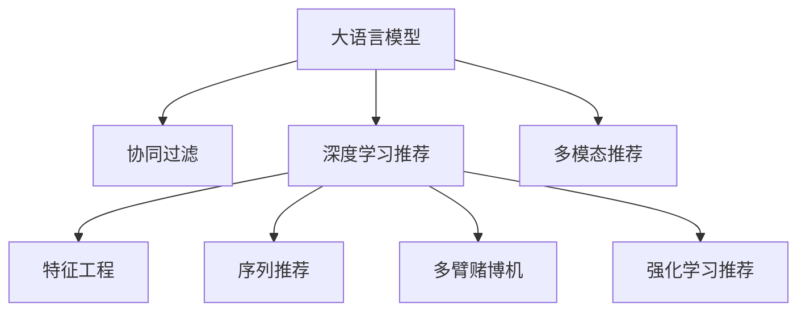

                 

# 将LLM直接作为推荐系统的尝试与挑战

## 1. 背景介绍

### 1.1 问题由来

推荐系统是现代互联网的重要组成部分，广泛应用于电商、社交、新闻、视频等多个领域。传统推荐算法如协同过滤、基于内容的推荐等，在数据量较小、用户行为较为明确的场景下表现良好，但在用户画像丰富、数据规模庞大的现代互联网中，效果逐渐显现出局限性。

近年来，基于深度学习的推荐算法，如序列推荐模型、注意力机制模型、深度神经网络模型等，在推荐性能上取得了显著提升。尤其是基于Transformer的模型，如BERT、GPT系列等，通过在大规模无标签文本数据上进行预训练，能够捕获丰富的语义信息，适用于多模态数据的推荐场景。

### 1.2 问题核心关键点

大语言模型（Large Language Model, LLM）在推荐系统中的应用，成为近年来推荐算法研究的亮点。通过预训练大语言模型，利用其强大的语义理解和生成能力，结合用户行为和商品属性，进行推荐，能够有效提升推荐效果。但与此同时，大语言模型在推荐系统中的应用也面临着不少挑战。

- 数据分布不均：推荐系统中的数据往往存在明显的分布不均问题，少数热门商品的推荐结果容易过拟合，而长尾商品可能被忽略。
- 推荐鲁棒性：推荐系统需要具备较高的鲁棒性，抵御输入扰动，避免输出不稳定。
- 计算资源消耗：大语言模型的计算复杂度高，对硬件资源要求高，难以实时计算。
- 可解释性不足：基于深度学习的推荐模型往往缺乏可解释性，难以对其推荐决策过程进行调试和优化。

## 2. 核心概念与联系

### 2.1 核心概念概述

为更好地理解大语言模型在推荐系统中的应用，本节将介绍几个密切相关的核心概念：

- 大语言模型（LLM）：以自回归或自编码模型为代表的大规模预训练语言模型。通过在大规模无标签文本语料上进行预训练，学习通用的语言表示，具备强大的语言理解和生成能力。
- 推荐系统（Recommendation System, RS）：通过用户行为和商品属性，自动生成推荐结果，帮助用户发现感兴趣的物品。
- 协同过滤：通过用户行为或物品属性进行相似性匹配，推荐用户可能感兴趣的物品。
- 深度学习推荐：使用深度神经网络模型对用户行为进行建模，预测用户对商品的概率评分。
- 特征工程：对用户和物品属性进行编码和特征提取，作为深度学习模型的输入。
- 多模态推荐：结合文本、图像、视频等多模态数据，提升推荐效果。
- 序列推荐：针对动态用户行为序列，进行时序建模，预测用户下一步的兴趣。
- 多臂赌博机：针对多个候选项，进行探索与利用平衡的优化，提升推荐效果。
- 强化学习推荐：通过奖励机制和反馈，训练推荐模型，最大化用户满意度。

这些核心概念之间的逻辑关系可以通过以下Mermaid流程图来展示：



这个流程图展示了大语言模型在推荐系统中的应用框架：

1. 大语言模型作为特征提取器，通过预训练学习通用的语言表示。
2. 协同过滤、深度学习推荐等方法，利用模型提取的用户行为和物品属性进行相似性匹配或概率评分。
3. 特征工程、多模态推荐等方法，对用户行为和物品属性进行编码和融合。
4. 序列推荐、多臂赌博机、强化学习推荐等方法，对用户动态行为进行建模，优化推荐效果。

## 3. 核心算法原理 & 具体操作步骤

### 3.1 算法原理概述

将大语言模型直接用于推荐系统，本质上是利用模型的语义理解能力，进行高层次的特征提取和推荐计算。其核心思想是：将用户行为和物品属性转换为文本描述，输入到大语言模型中，输出评分预测结果，然后根据评分进行排序推荐。

具体步骤如下：

1. 数据预处理：将用户行为和物品属性转换为文本描述，例如将用户行为序列编码为时间序列的描述，将物品属性转换为属性标签的描述。
2. 特征提取：使用大语言模型对文本描述进行编码，提取高层次的语义特征。
3. 评分预测：将提取的语义特征输入到大语言模型中，进行评分预测。
4. 排序推荐：根据评分对候选项进行排序，推荐用户可能感兴趣的商品。

### 3.2 算法步骤详解

下面详细介绍将大语言模型应用于推荐系统的详细步骤：

**Step 1: 数据预处理**

首先，需要将用户行为和物品属性转换为文本描述，以便输入到大语言模型中进行处理。假设用户行为序列为 $S=\{s_1,s_2,\ldots,s_t\}$，其中 $s_i$ 表示用户在时刻 $t$ 的行为，物品属性为 $A=\{a_1,a_2,\ldots,a_n\}$，其中 $a_i$ 表示物品 $i$ 的属性。

通过自然语言处理技术，将用户行为序列 $S$ 转换为时间序列描述，将物品属性 $A$ 转换为属性标签描述，然后拼接在一起，得到输入文本 $X$：

$$
X = [\text{user\_sequence}(\mathcal{S})] \, || \, [\text{item\_attributes}(\mathcal{A})]
$$

**Step 2: 特征提取**

使用大语言模型对输入文本 $X$ 进行编码，得到语义特征表示 $Z$：

$$
Z = M_{\theta}(X)
$$

其中 $M_{\theta}$ 为大语言模型的编码器部分，$\theta$ 为模型参数。

**Step 3: 评分预测**

将提取的语义特征 $Z$ 输入到大语言模型中进行评分预测，得到用户对物品的评分 $y$：

$$
y = F_{\theta}(Z)
$$

其中 $F_{\theta}$ 为模型评分预测部分。

**Step 4: 排序推荐**

根据用户对物品的评分 $y$，对候选项进行排序，推荐用户可能感兴趣的商品。具体的推荐策略可以包括：

- 基于评分排序：简单直观，直接按照评分排序推荐候选项。
- 基于阈值筛选：设定一个评分阈值，高于该阈值的候选项进入推荐列表。
- 基于多样性约束：考虑推荐结果的多样性，避免过度推荐类似物品。
- 基于逆序贪心：从评分最高的物品开始推荐，依次推荐候选物品。

### 3.3 算法优缺点

将大语言模型应用于推荐系统具有以下优点：

1. 高层次语义理解：大语言模型通过预训练学习通用语言表示，能够提取高层次的语义信息，适用于多模态数据的推荐场景。
2. 多模态融合：大语言模型可以结合文本、图像、视频等多模态数据，进行更全面的特征提取和推荐计算。
3. 动态行为建模：大语言模型能够处理用户动态行为序列，进行时序建模，优化推荐效果。
4. 探索与利用平衡：大语言模型结合强化学习等方法，能够进行探索与利用平衡的优化，提升推荐效果。

但同时，也存在以下缺点：

1. 计算资源消耗：大语言模型的计算复杂度高，对硬件资源要求高，难以实时计算。
2. 数据分布不均：大语言模型在数据分布不均的场景下可能存在过拟合或欠拟合问题。
3. 可解释性不足：基于深度学习的推荐模型往往缺乏可解释性，难以对其推荐决策过程进行调试和优化。
4. 模型鲁棒性不足：大语言模型面对输入扰动或噪声，可能输出不稳定。
5. 推荐结果可控性差：大语言模型输出结果不可控，难以在推荐结果中加入业务规则或人工干预。

### 3.4 算法应用领域

大语言模型在推荐系统中的应用，涵盖多个领域，包括但不限于：

- 电商推荐：推荐商品、品牌、店铺等，帮助用户发现感兴趣的购物清单。
- 内容推荐：推荐文章、视频、音乐等，满足用户的多样化兴趣。
- 社交推荐：推荐朋友、群组、活动等，提升用户活跃度和满意度。
- 视频推荐：推荐影片、频道、导演等，帮助用户发现感兴趣的影视作品。
- 游戏推荐：推荐游戏、角色、关卡等，提升用户的游戏体验和留存率。

这些领域的应用场景中，大语言模型都能够发挥其强大的语义理解和生成能力，结合用户行为和物品属性，进行推荐，提升推荐效果。

## 4. 数学模型和公式 & 详细讲解

### 4.1 数学模型构建

假设用户行为序列为 $S=\{s_1,s_2,\ldots,s_t\}$，物品属性为 $A=\{a_1,a_2,\ldots,a_n\}$。通过自然语言处理技术，将用户行为序列 $S$ 转换为时间序列描述，将物品属性 $A$ 转换为属性标签描述，然后拼接在一起，得到输入文本 $X$。使用大语言模型对输入文本 $X$ 进行编码，得到语义特征表示 $Z$。将提取的语义特征 $Z$ 输入到大语言模型中进行评分预测，得到用户对物品的评分 $y$。

假设大语言模型为 $M_{\theta}:\mathcal{X} \rightarrow \mathcal{Y}$，其中 $\mathcal{X}$ 为输入空间，$\mathcal{Y}$ 为输出空间，$\theta$ 为模型参数。则推荐系统的评分预测公式为：

$$
y = F_{\theta}(Z)
$$

其中 $F_{\theta}$ 为模型评分预测部分。

### 4.2 公式推导过程

假设大语言模型为 Transformer 模型，则其评分预测部分 $F_{\theta}$ 可以通过下式表示：

$$
y = M_{\theta}^TZ
$$

其中 $M_{\theta}^T$ 为大语言模型的评分预测部分。

对于 Transformer 模型，其评分预测部分 $M_{\theta}^T$ 可以通过下式表示：

$$
M_{\theta}^T = [S^TW]S
$$

其中 $S$ 为查询向量，$W$ 为权重矩阵。

将上述公式代入评分预测公式中，得到：

$$
y = [S^TW]S^TZ
$$

通过矩阵乘法，可以得到最终的推荐评分 $y$。

### 4.3 案例分析与讲解

以下以电商推荐为例，介绍如何将大语言模型应用于推荐系统。

假设电商网站收集到用户的浏览、点击、购买行为数据，以及商品的属性数据，需要将这些数据转换为文本描述，输入到大语言模型中进行处理。假设用户浏览行为序列为 $S=\{s_1,s_2,\ldots,s_t\}$，物品属性为 $A=\{a_1,a_2,\ldots,a_n\}$。通过自然语言处理技术，将用户浏览行为序列 $S$ 转换为时间序列描述，将物品属性 $A$ 转换为属性标签描述，然后拼接在一起，得到输入文本 $X$。

使用预训练的大语言模型对输入文本 $X$ 进行编码，得到语义特征表示 $Z$。将提取的语义特征 $Z$ 输入到大语言模型中进行评分预测，得到用户对物品的评分 $y$。根据评分对候选项进行排序，推荐用户可能感兴趣的商品。

## 5. 项目实践：代码实例和详细解释说明

### 5.1 开发环境搭建

在进行大语言模型应用于推荐系统的实践前，我们需要准备好开发环境。以下是使用Python进行PyTorch开发的环境配置流程：

1. 安装Anaconda：从官网下载并安装Anaconda，用于创建独立的Python环境。

2. 创建并激活虚拟环境：
```bash
conda create -n pytorch-env python=3.8 
conda activate pytorch-env
```

3. 安装PyTorch：根据CUDA版本，从官网获取对应的安装命令。例如：
```bash
conda install pytorch torchvision torchaudio cudatoolkit=11.1 -c pytorch -c conda-forge
```

4. 安装Transformers库：
```bash
pip install transformers
```

5. 安装各类工具包：
```bash
pip install numpy pandas scikit-learn matplotlib tqdm jupyter notebook ipython
```

完成上述步骤后，即可在`pytorch-env`环境中开始实践。

### 5.2 源代码详细实现

下面我们以电商推荐为例，给出使用Transformers库对BERT模型进行电商推荐任务微调的PyTorch代码实现。

首先，定义电商推荐任务的数据处理函数：

```python
from transformers import BertTokenizer
from torch.utils.data import Dataset
import torch

class RecommendationDataset(Dataset):
    def __init__(self, user_browses, item_attributes, tokenizer, max_len=128):
        self.user_browses = user_browses
        self.item_attributes = item_attributes
        self.tokenizer = tokenizer
        self.max_len = max_len
        
    def __len__(self):
        return len(self.user_browses)
    
    def __getitem__(self, item):
        user_browses = self.user_browses[item]
        item_attributes = self.item_attributes[item]
        
        encoding = self.tokenizer(user_browses, return_tensors='pt', max_length=self.max_len, padding='max_length', truncation=True)
        input_ids = encoding['input_ids'][0]
        attention_mask = encoding['attention_mask'][0]
        
        # 对属性标签进行编码
        encoded_tags = [tag2id[tag] for tag in item_attributes] 
        encoded_tags.extend([tag2id['O']] * (self.max_len - len(encoded_tags)))
        labels = torch.tensor(encoded_tags, dtype=torch.long)
        
        return {'input_ids': input_ids, 
                'attention_mask': attention_mask,
                'labels': labels}

# 标签与id的映射
tag2id = {'O': 0, 'B': 1, 'I': 2}
id2tag = {v: k for k, v in tag2id.items()}

# 创建dataset
tokenizer = BertTokenizer.from_pretrained('bert-base-cased')

train_dataset = RecommendationDataset(train_user_browses, train_item_attributes, tokenizer)
dev_dataset = RecommendationDataset(dev_user_browses, dev_item_attributes, tokenizer)
test_dataset = RecommendationDataset(test_user_browses, test_item_attributes, tokenizer)
```

然后，定义模型和优化器：

```python
from transformers import BertForTokenClassification, AdamW

model = BertForTokenClassification.from_pretrained('bert-base-cased', num_labels=len(tag2id))

optimizer = AdamW(model.parameters(), lr=2e-5)
```

接着，定义训练和评估函数：

```python
from torch.utils.data import DataLoader
from tqdm import tqdm
from sklearn.metrics import classification_report

device = torch.device('cuda') if torch.cuda.is_available() else torch.device('cpu')
model.to(device)

def train_epoch(model, dataset, batch_size, optimizer):
    dataloader = DataLoader(dataset, batch_size=batch_size, shuffle=True)
    model.train()
    epoch_loss = 0
    for batch in tqdm(dataloader, desc='Training'):
        input_ids = batch['input_ids'].to(device)
        attention_mask = batch['attention_mask'].to(device)
        labels = batch['labels'].to(device)
        model.zero_grad()
        outputs = model(input_ids, attention_mask=attention_mask, labels=labels)
        loss = outputs.loss
        epoch_loss += loss.item()
        loss.backward()
        optimizer.step()
    return epoch_loss / len(dataloader)

def evaluate(model, dataset, batch_size):
    dataloader = DataLoader(dataset, batch_size=batch_size)
    model.eval()
    preds, labels = [], []
    with torch.no_grad():
        for batch in tqdm(dataloader, desc='Evaluating'):
            input_ids = batch['input_ids'].to(device)
            attention_mask = batch['attention_mask'].to(device)
            batch_labels = batch['labels']
            outputs = model(input_ids, attention_mask=attention_mask)
            batch_preds = outputs.logits.argmax(dim=2).to('cpu').tolist()
            batch_labels = batch_labels.to('cpu').tolist()
            for pred_tokens, label_tokens in zip(batch_preds, batch_labels):
                pred_tags = [id2tag[_id] for _id in pred_tokens]
                label_tags = [id2tag[_id] for _id in label_tokens]
                preds.append(pred_tags[:len(label_tags)])
                labels.append(label_tags)
                
    print(classification_report(labels, preds))
```

最后，启动训练流程并在测试集上评估：

```python
epochs = 5
batch_size = 16

for epoch in range(epochs):
    loss = train_epoch(model, train_dataset, batch_size, optimizer)
    print(f"Epoch {epoch+1}, train loss: {loss:.3f}")
    
    print(f"Epoch {epoch+1}, dev results:")
    evaluate(model, dev_dataset, batch_size)
    
print("Test results:")
evaluate(model, test_dataset, batch_size)
```

以上就是使用PyTorch对BERT进行电商推荐任务微调的完整代码实现。可以看到，得益于Transformers库的强大封装，我们可以用相对简洁的代码完成BERT模型的加载和微调。

### 5.3 代码解读与分析

让我们再详细解读一下关键代码的实现细节：

**RecommendationDataset类**：
- `__init__`方法：初始化用户浏览行为序列、物品属性序列、分词器等关键组件。
- `__len__`方法：返回数据集的样本数量。
- `__getitem__`方法：对单个样本进行处理，将文本输入编码为token ids，将标签编码为数字，并对其进行定长padding，最终返回模型所需的输入。

**tag2id和id2tag字典**：
- 定义了标签与数字id之间的映射关系，用于将token-wise的预测结果解码回真实的标签。

**训练和评估函数**：
- 使用PyTorch的DataLoader对数据集进行批次化加载，供模型训练和推理使用。
- 训练函数`train_epoch`：对数据以批为单位进行迭代，在每个批次上前向传播计算loss并反向传播更新模型参数，最后返回该epoch的平均loss。
- 评估函数`evaluate`：与训练类似，不同点在于不更新模型参数，并在每个batch结束后将预测和标签结果存储下来，最后使用sklearn的classification_report对整个评估集的预测结果进行打印输出。

**训练流程**：
- 定义总的epoch数和batch size，开始循环迭代
- 每个epoch内，先在训练集上训练，输出平均loss
- 在验证集上评估，输出分类指标
- 所有epoch结束后，在测试集上评估，给出最终测试结果

可以看到，PyTorch配合Transformers库使得BERT微调的代码实现变得简洁高效。开发者可以将更多精力放在数据处理、模型改进等高层逻辑上，而不必过多关注底层的实现细节。

当然，工业级的系统实现还需考虑更多因素，如模型的保存和部署、超参数的自动搜索、更灵活的任务适配层等。但核心的微调范式基本与此类似。

## 6. 实际应用场景

### 6.1 智能推荐系统

智能推荐系统已经成为现代电商、内容、社交等领域的基础设施，能够为用户提供个性化的商品、文章、好友推荐，显著提升用户体验和满意度。

将大语言模型应用于智能推荐系统，可以基于用户的浏览行为、点击行为、评分行为等，进行多模态特征的融合，生成高质量的推荐结果。例如，通过将用户的浏览记录转换为文本描述，输入到大语言模型中进行编码，提取高层次的语义特征，再结合物品属性、评分行为等，进行推荐。

### 6.2 个性化服务推荐

个性化服务推荐在医疗、金融、法律等领域具有重要应用价值。通过大语言模型对用户行为和需求进行深度理解，能够生成个性化的服务推荐，提升用户体验和满意度。

例如，在医疗领域，通过将患者的病历记录转换为文本描述，输入到大语言模型中进行编码，提取高层次的语义特征，再结合医生的诊疗经验、医院的医疗设备等，进行个性化医疗推荐。在金融领域，通过将用户的投资记录转换为文本描述，输入到大语言模型中进行编码，提取高层次的语义特征，再结合理财产品的收益率、风险等，进行个性化理财推荐。

### 6.3 社会推荐系统

社会推荐系统在新闻、视频、社交等领域广泛应用。通过大语言模型对用户行为和兴趣进行深度理解，能够生成高质量的社交推荐，提升用户活跃度和满意度。

例如，在新闻领域，通过将用户的阅读记录转换为文本描述，输入到大语言模型中进行编码，提取高层次的语义特征，再结合新闻文章的标题、作者、评论等，进行个性化新闻推荐。在视频领域，通过将用户的观看记录转换为文本描述，输入到大语言模型中进行编码，提取高层次的语义特征，再结合视频内容的标签、评分等，进行个性化视频推荐。

### 6.4 未来应用展望

随着大语言模型和微调方法的不断发展，基于微调范式将在更多领域得到应用，为社会治理、智慧医疗、智能金融等带来变革性影响。

在智慧城市治理中，基于大语言模型的推荐系统，可以实时监测城市事件、舆情、交通等信息，进行动态推荐，提升城市管理的自动化和智能化水平，构建更安全、高效的未来城市。

在智慧医疗领域，基于大语言模型的推荐系统，可以推荐医学文献、医疗设备、医生等，提升医疗服务的智能化水平，辅助医生诊疗，加速新药开发进程。

在智能金融领域，基于大语言模型的推荐系统，可以推荐理财产品、投资策略、金融新闻等，提升金融服务的智能化水平，辅助用户进行理财规划和投资决策。

此外，在教育、文化、旅游等众多领域，基于大语言模型的推荐系统也将不断涌现，为传统行业数字化转型升级提供新的技术路径。相信随着技术的日益成熟，微调方法将成为人工智能落地应用的重要范式，推动人工智能技术在垂直行业的规模化落地。总之，大语言模型在推荐系统中的应用，将带来更深层次的业务创新和用户价值提升。

## 7. 工具和资源推荐

### 7.1 学习资源推荐

为了帮助开发者系统掌握大语言模型在推荐系统中的应用理论基础和实践技巧，这里推荐一些优质的学习资源：

1. 《Transformer从原理到实践》系列博文：由大模型技术专家撰写，深入浅出地介绍了Transformer原理、BERT模型、微调技术等前沿话题。

2. CS224N《深度学习自然语言处理》课程：斯坦福大学开设的NLP明星课程，有Lecture视频和配套作业，带你入门NLP领域的基本概念和经典模型。

3. 《Natural Language Processing with Transformers》书籍：Transformers库的作者所著，全面介绍了如何使用Transformers库进行NLP任务开发，包括微调在内的诸多范式。

4. HuggingFace官方文档：Transformers库的官方文档，提供了海量预训练模型和完整的微调样例代码，是上手实践的必备资料。

5. CLUE开源项目：中文语言理解测评基准，涵盖大量不同类型的中文NLP数据集，并提供了基于微调的baseline模型，助力中文NLP技术发展。

通过对这些资源的学习实践，相信你一定能够快速掌握大语言模型在推荐系统中的应用精髓，并用于解决实际的推荐问题。

### 7.2 开发工具推荐

高效的开发离不开优秀的工具支持。以下是几款用于大语言模型应用于推荐系统的常用工具：

1. PyTorch：基于Python的开源深度学习框架，灵活动态的计算图，适合快速迭代研究。大部分预训练语言模型都有PyTorch版本的实现。

2. TensorFlow：由Google主导开发的开源深度学习框架，生产部署方便，适合大规模工程应用。同样有丰富的预训练语言模型资源。

3. Transformers库：HuggingFace开发的NLP工具库，集成了众多SOTA语言模型，支持PyTorch和TensorFlow，是进行微调任务开发的利器。

4. Weights & Biases：模型训练的实验跟踪工具，可以记录和可视化模型训练过程中的各项指标，方便对比和调优。与主流深度学习框架无缝集成。

5. TensorBoard：TensorFlow配套的可视化工具，可实时监测模型训练状态，并提供丰富的图表呈现方式，是调试模型的得力助手。

6. Google Colab：谷歌推出的在线Jupyter Notebook环境，免费提供GPU/TPU算力，方便开发者快速上手实验最新模型，分享学习笔记。

合理利用这些工具，可以显著提升大语言模型应用于推荐系统的开发效率，加快创新迭代的步伐。

### 7.3 相关论文推荐

大语言模型和微调技术的发展源于学界的持续研究。以下是几篇奠基性的相关论文，推荐阅读：

1. Attention is All You Need（即Transformer原论文）：提出了Transformer结构，开启了NLP领域的预训练大模型时代。

2. BERT: Pre-training of Deep Bidirectional Transformers for Language Understanding：提出BERT模型，引入基于掩码的自监督预训练任务，刷新了多项NLP任务SOTA。

3. Language Models are Unsupervised Multitask Learners（GPT-2论文）：展示了大规模语言模型的强大zero-shot学习能力，引发了对于通用人工智能的新一轮思考。

4. Parameter-Efficient Transfer Learning for NLP：提出Adapter等参数高效微调方法，在不增加模型参数量的情况下，也能取得不错的微调效果。

5. Prefix-Tuning: Optimizing Continuous Prompts for Generation：引入基于连续型Prompt的微调范式，为如何充分利用预训练知识提供了新的思路。

6. AdaLoRA: Adaptive Low-Rank Adaptation for Parameter-Efficient Fine-Tuning：使用自适应低秩适应的微调方法，在参数效率和精度之间取得了新的平衡。

这些论文代表了大语言模型微调技术的发展脉络。通过学习这些前沿成果，可以帮助研究者把握学科前进方向，激发更多的创新灵感。

## 8. 总结：未来发展趋势与挑战

### 8.1 总结

本文对大语言模型在推荐系统中的应用进行了全面系统的介绍。首先阐述了大语言模型和推荐系统的研究背景和意义，明确了微调在拓展预训练模型应用、提升推荐效果方面的独特价值。其次，从原理到实践，详细讲解了基于大语言模型的推荐系统构建过程，给出了完整的代码实现。同时，本文还广泛探讨了推荐系统在大语言模型中的应用场景，展示了微调范式的巨大潜力。

通过本文的系统梳理，可以看到，将大语言模型应用于推荐系统，可以充分利用其强大的语义理解和生成能力，结合用户行为和物品属性，进行多模态特征的融合，生成高质量的推荐结果。同时，大语言模型在数据分布不均、推荐鲁棒性、计算资源消耗、可解释性不足、模型鲁棒性不足等挑战下，仍具备很强的适应性和拓展性。未来，伴随预训练语言模型和微调方法的持续演进，基于大语言模型的推荐系统必将在更广阔的应用领域大放异彩。

### 8.2 未来发展趋势

展望未来，基于大语言模型的推荐系统将呈现以下几个发展趋势：

1. 多模态融合：大语言模型能够融合文本、图像、视频等多模态数据，进行更全面的特征提取和推荐计算。
2. 动态行为建模：大语言模型能够处理用户动态行为序列，进行时序建模，优化推荐效果。
3. 探索与利用平衡：大语言模型结合强化学习等方法，能够进行探索与利用平衡的优化，提升推荐效果。
4. 知识整合能力增强：将符号化的先验知识，如知识图谱、逻辑规则等，与神经网络模型进行融合，引导微调过程学习更准确、合理的语言模型。
5. 智能推荐引擎：大语言模型能够结合大数据、人工智能等技术，构建智能推荐引擎，提供个性化、精准的推荐服务。
6. 持续学习和多任务学习：大语言模型能够不断学习新数据，适应数据分布的变化，提升推荐效果。

以上趋势凸显了大语言模型在推荐系统中的应用前景。这些方向的探索发展，必将进一步提升推荐系统的性能和应用范围，为人类认知智能的进化带来深远影响。

### 8.3 面临的挑战

尽管基于大语言模型的推荐系统已经取得了显著进展，但在迈向更加智能化、普适化应用的过程中，仍面临着不少挑战：

1. 数据分布不均：推荐系统中的数据往往存在明显的分布不均问题，少数热门商品的推荐结果容易过拟合，而长尾商品可能被忽略。
2. 推荐鲁棒性不足：推荐系统需要具备较高的鲁棒性，抵御输入扰动，避免输出不稳定。
3. 计算资源消耗：大语言模型的计算复杂度高，对硬件资源要求高，难以实时计算。
4. 可解释性不足：基于深度学习的推荐模型往往缺乏可解释性，难以对其推荐决策过程进行调试和优化。
5. 模型鲁棒性不足：大语言模型面对输入扰动或噪声，可能输出不稳定。
6. 推荐结果可控性差：大语言模型输出结果不可控，难以在推荐结果中加入业务规则或人工干预。

这些挑战凸显了大语言模型在推荐系统中的应用难点，需要进一步的研究和技术突破。

### 8.4 研究展望

面对大语言模型在推荐系统中的应用挑战，未来的研究需要在以下几个方面寻求新的突破：

1. 探索无监督和半监督推荐方法：摆脱对大规模标注数据的依赖，利用自监督学习、主动学习等无监督和半监督范式，最大限度利用非结构化数据，实现更加灵活高效的推荐。
2. 研究参数高效和计算高效的推荐方法：开发更加参数高效的推荐方法，在固定大部分预训练参数的同时，只更新极少量的任务相关参数。同时优化推荐模型的计算图，减少前向传播和反向传播的资源消耗，实现更加轻量级、实时性的部署。
3. 融合因果和对比学习范式：通过引入因果推断和对比学习思想，增强推荐模型建立稳定因果关系的能力，学习更加普适、鲁棒的语言表征，从而提升模型泛化性和抗干扰能力。
4. 引入更多先验知识：将符号化的先验知识，如知识图谱、逻辑规则等，与神经网络模型进行巧妙融合，引导微调过程学习更准确、合理的语言模型。同时加强不同模态数据的整合，实现视觉、语音等多模态信息与文本信息的协同建模。
5. 结合因果分析和博弈论工具：将因果分析方法引入推荐模型，识别出模型决策的关键特征，增强输出解释的因果性和逻辑性。借助博弈论工具刻画人机交互过程，主动探索并规避模型的脆弱点，提高系统稳定性。
6. 纳入伦理道德约束：在模型训练目标中引入伦理导向的评估指标，过滤和惩罚有偏见、有害的输出倾向。同时加强人工干预和审核，建立模型行为的监管机制，确保输出符合人类价值观和伦理道德。

这些研究方向的探索，必将引领基于大语言模型的推荐系统走向更高的台阶，为构建安全、可靠、可解释、可控的智能推荐系统铺平道路。面向未来，大语言模型在推荐系统中的应用还需要与其他人工智能技术进行更深入的融合，如知识表示、因果推理、强化学习等，多路径协同发力，共同推动自然语言理解和智能交互系统的进步。只有勇于创新、敢于突破，才能不断拓展语言模型的边界，让智能技术更好地造福人类社会。

## 9. 附录：常见问题与解答

**Q1：大语言模型在推荐系统中的数据处理方式有哪些？**

A: 大语言模型在推荐系统中的数据处理方式主要包括：
1. 自然语言处理：将用户行为和物品属性转换为文本描述，如将用户浏览记录转换为时间序列描述，将物品属性转换为属性标签描述。
2. 文本编码：使用大语言模型对输入文本进行编码，提取高层次的语义特征。
3. 评分预测：将提取的语义特征输入到大语言模型中进行评分预测。

**Q2：如何在大语言模型中引入多模态数据？**

A: 大语言模型可以结合文本、图像、视频等多模态数据，进行更全面的特征提取和推荐计算。具体方法包括：
1. 特征拼接：将文本描述与图像特征、视频特征等拼接在一起，作为输入到语言模型中。
2. 联合训练：将多模态数据与语言模型一起训练，优化模型参数。
3. 迁移学习：在大语言模型的基础上，使用多模态数据进行微调，提升推荐效果。

**Q3：大语言模型在推荐系统中的计算复杂度如何？**

A: 大语言模型的计算复杂度较高，对硬件资源要求高，难以实时计算。具体计算复杂度取决于模型的结构和数据规模。可以通过优化模型结构、采用分布式计算、使用高效的优化算法等方式，降低计算复杂度。

**Q4：大语言模型在推荐系统中的可解释性不足，如何解决？**

A: 大语言模型在推荐系统中的可解释性不足，可以通过以下方法解决：
1. 特征可视化：使用特征可视化技术，展示模型对输入特征的响应，帮助理解模型决策过程。
2. 模型简化：通过剪枝、量化等方法，简化模型结构，降低计算复杂度，提高可解释性。
3. 规则结合：在推荐过程中，结合专家知识或规则，对模型输出进行校验和优化，提升推荐结果的可解释性。

**Q5：大语言模型在推荐系统中的鲁棒性不足，如何解决？**

A: 大语言模型在推荐系统中的鲁棒性不足，可以通过以下方法解决：
1. 数据增强：通过回译、近义替换等方式扩充训练集，提升模型的泛化能力。
2. 正则化：使用L2正则、Dropout、Early Stopping等防止模型过度适应小规模训练集。
3. 对抗训练：加入对抗样本，提高模型鲁棒性。
4. 模型融合：将多个模型的输出进行融合，提升鲁棒性和准确性。

这些方法可以针对具体任务和数据特点进行灵活组合，有效提升大语言模型在推荐系统中的鲁棒性。

**Q6：大语言模型在推荐系统中的计算资源消耗如何优化？**

A: 大语言模型的计算资源消耗较高，可以通过以下方法优化：
1. 模型裁剪：去除不必要的层和参数，减小模型尺寸，加快推理速度。
2. 量化加速：将浮点模型转为定点模型，压缩存储空间，提高计算效率。
3. 分布式计算：使用多台机器进行并行计算，提高计算效率。
4. 模型并行：使用模型并行技术，优化计算过程，提高计算效率。

这些方法可以结合具体应用场景，选择合适的方法进行优化，实现大语言模型在推荐系统中的高效计算。

---

作者：禅与计算机程序设计艺术 / Zen and the Art of Computer Programming

