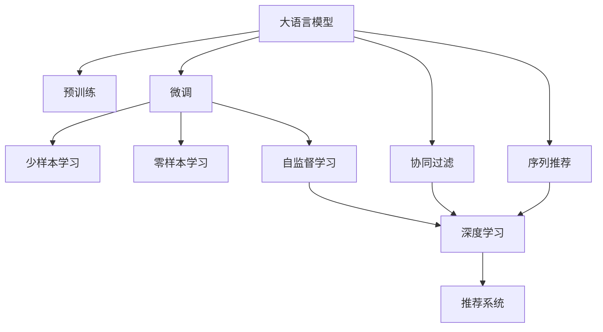

                 

# 将推荐问题转化为大模型的语言理解任务

## 1. 背景介绍

推荐系统是当前互联网技术中不可或缺的一部分，广泛应用于电商、新闻、社交、视频等多个领域。其核心任务是通过对用户行为数据和物品特征的建模，预测用户对某物品的兴趣和评分，从而为用户推荐合适的物品。然而，随着用户数据量激增和用户兴趣动态变化，推荐系统也面临着数据稀疏、计算复杂、冷启动等问题。

近年来，基于深度学习的大规模推荐模型，如基于深度神经网络的协同过滤模型、基于深度学习的序列推荐模型等，已经取得了显著的进步。但这些模型大多依赖于手工设计的特征和复杂的超参数优化，模型的解释性和可解释性难以保障。

在当前的技术发展趋势下，利用大语言模型进行推荐任务的语言理解，可以显著提升模型的泛化能力和灵活性，使得推荐系统在应对数据复杂性、提升用户体验方面具备更大的潜力。本文将系统阐述将推荐问题转化为大模型的语言理解任务，并给出具体的方法和实现细节。

## 2. 核心概念与联系

### 2.1 核心概念概述

本节将介绍几个与推荐系统和大语言模型相关的核心概念：

- **推荐系统(Recommendation System)**：通过分析和理解用户的历史行为和偏好，为其推荐合适的物品的系统。
- **深度学习(DL)**：利用深度神经网络模型对数据进行高效建模和分析，广泛应用于计算机视觉、自然语言处理等领域。
- **大语言模型(Large Language Model, LLM)**：以Transformer模型为代表，通过大规模无标签文本数据进行预训练，具备强大语言理解和生成能力的模型。
- **预训练(Pre-training)**：通过在大规模无标签文本数据上预训练语言模型，学习通用语言表示的过程。
- **微调(Fine-tuning)**：在预训练模型的基础上，利用少量标注数据进行有监督训练，优化模型在特定任务上的性能。
- **自监督学习(Self-Supervised Learning)**：通过使用数据自身的特性（如掩码语言模型、next-token prediction等）进行预训练，无需标注数据。
- **少样本学习(Few-shot Learning)**：利用少量标注样本进行学习，避免对大量标注数据的依赖。
- **零样本学习(Zero-shot Learning)**：仅通过任务描述，无需任何训练样本即可进行预测。

这些概念之间存在紧密联系，共同构成了推荐系统和大语言模型的知识体系。大语言模型通过预训练学习到丰富的语言知识，并在微调过程中吸收下游任务的特定知识，从而提升了推荐系统对用户行为的理解和预测能力。

### 2.2 核心概念原理和架构的 Mermaid 流程图



此流程图展示了核心概念之间的联系和转化过程。大语言模型通过预训练学习语言知识，然后通过微调吸收推荐任务的特定知识，最终转化为深度学习模型，应用于推荐系统。

## 3. 核心算法原理 & 具体操作步骤

### 3.1 算法原理概述

将推荐问题转化为大模型的语言理解任务，主要依赖于大语言模型的自监督学习能力。大语言模型通常通过大规模无标签文本数据进行预训练，学习到丰富的语言知识，具备强大的语言理解和生成能力。在微调过程中，可以巧妙地利用这些语言知识，将其转化为推荐系统的特定知识，从而提升模型的推荐效果。

具体而言，可以将推荐问题转化为一个大语言模型的语言理解任务，如句子分类、文本生成等。通过设计精巧的输入文本格式，引导大语言模型输出推荐结果。这样，大语言模型可以在不增加参数的情况下，吸收推荐任务的特定知识，实现推荐系统的智能推荐。

### 3.2 算法步骤详解

以下是将推荐问题转化为大模型语言理解任务的具体操作步骤：

**Step 1: 构建输入格式**
- 设计一种能够反映推荐任务信息的输入文本格式。通常包括用户ID、物品ID、用户行为、物品特征等，可以按照一定的结构进行拼接。例如，对于电商推荐，输入格式可以是：
  ```
  user_id: 100001, item_id: 1001, clicked: 1, item_desc: "一双经典款某品牌运动鞋"
  ```

**Step 2: 预训练模型选择**
- 选择合适的预训练语言模型作为初始化参数。当前常用的预训练模型包括BERT、GPT、RoBERTa等，这些模型都具备强大的语言理解和生成能力。

**Step 3: 微调设置**
- 确定微调所需的超参数，如学习率、批大小、迭代轮数等。设置正则化技术，如L2正则、Dropout、Early Stopping等。
- 选择合适的优化器，如Adam、SGD等，以及损失函数，如交叉熵损失等。

**Step 4: 执行微调**
- 使用构建的输入文本，作为大模型的输入，进行微调训练。训练过程中，大模型学习输入文本中的特定知识，并将其转化为推荐系统所需的输出。

**Step 5: 测试和部署**
- 在测试集上评估微调后的模型性能，对比微调前后的推荐效果。
- 使用微调后的模型进行实际推荐，集成到推荐系统中。

### 3.3 算法优缺点

将推荐问题转化为大模型的语言理解任务，具有以下优点：
1. 模型效果好。大模型通常具备强大的语言理解能力，通过微调可以学习到推荐任务所需的特定知识，从而提升推荐效果。
2. 模型可解释性强。大模型的训练过程和内部机制相对透明，便于理解其决策逻辑，提高推荐系统的可解释性。
3. 开发成本低。相比于手工特征工程和复杂的超参数优化，利用大模型的语言理解能力进行推荐，可以显著降低推荐系统的开发和维护成本。

同时，该方法也存在一些局限性：
1. 数据量要求高。大模型的预训练需要大量的无标签文本数据，这对于部分小型推荐系统可能是一大挑战。
2. 计算资源需求大。大模型的参数规模通常较大，需要高性能的计算资源进行训练和推理。
3. 模型泛化能力差。对于特定领域的推荐任务，大模型可能无法很好地泛化到新领域的数据。
4. 学习效率低。大模型的微调过程通常需要较长时间，且对数据质量和标注样本的依赖较高。

尽管存在这些局限性，但通过合理的设计和使用，将推荐问题转化为大模型的语言理解任务，仍然可以显著提升推荐系统的性能和用户体验。

### 3.4 算法应用领域

将推荐问题转化为大模型的语言理解任务，在以下领域有广泛的应用：

- **电商推荐**：通过用户搜索、浏览、点击等行为，生成个性化的商品推荐。
- **视频推荐**：利用用户观看历史、评分等数据，生成相关的视频推荐。
- **新闻推荐**：分析用户阅读历史和行为，推荐相关的文章或视频。
- **社交网络**：根据用户互动记录，推荐相关的朋友或群组。
- **广告投放**：根据用户行为数据，推荐合适的广告内容。

这些领域的推荐系统都涉及复杂的用户行为分析，大语言模型通过微调可以学习这些行为的特定模式，从而提供更精准、个性化的推荐服务。

## 4. 数学模型和公式 & 详细讲解 & 举例说明

### 4.1 数学模型构建

设推荐系统中的推荐任务为 $T$，用户行为为 $x$，物品特征为 $y$，推荐结果为 $r$。则推荐任务可以表示为 $x \rightarrow r$。

使用大语言模型进行推荐任务的语言理解任务可以表示为 $x \rightarrow h$，其中 $h$ 表示模型的中间隐藏表示，即大语言模型的输出。

### 4.2 公式推导过程

假设大语言模型的输入格式为 $x=x_1, x_2, \cdots, x_n$，其中 $x_i$ 表示用户行为或物品特征。微调的损失函数为 $\mathcal{L}(h, r)$，例如交叉熵损失。微调过程的优化目标为：

$$
\hat{h} = \mathop{\arg\min}_{h} \mathcal{L}(h, r)
$$

其中 $\hat{h}$ 表示微调后的隐藏表示，$r$ 表示推荐结果。

### 4.3 案例分析与讲解

以电商推荐为例，假设用户的行为数据为：
```
user_id: 100001, item_id: 1001, clicked: 1, item_desc: "一双经典款某品牌运动鞋"
```

可以将该行为数据编码为文本输入，作为大语言模型的输入。使用预训练的BERT模型进行微调，其输出为 $h$。然后，通过 $h$ 和推荐结果 $r$ 计算损失函数 $\mathcal{L}(h, r)$。优化目标为最小化损失函数，得到最优的 $h$。

在实际应用中，可以通过设定不同的输入格式，引导大模型输出不同的推荐结果。例如，将输入格式设计为：
```
user_id: 100001, item_id: 1001, clicked: 1, item_desc: "一双经典款某品牌运动鞋"
```

其中 $clicked$ 表示用户是否点击了该商品，$item_desc$ 表示物品描述。通过微调，大模型可以学习到点击行为和物品描述的关联性，从而生成基于用户行为的商品推荐。

## 5. 项目实践：代码实例和详细解释说明

### 5.1 开发环境搭建

在进行推荐系统开发时，需要准备以下开发环境：

1. 安装Python：建议使用Python 3.7及以上版本，并确保pip能够正常工作。

2. 安装PyTorch：使用以下命令进行安装：
```bash
pip install torch torchtext transformers
```

3. 安装相关依赖：
```bash
pip install pandas numpy sklearn
```

### 5.2 源代码详细实现

以下是一个简单的电商推荐系统微调代码实现：

```python
import torch
import torch.nn as nn
import torch.optim as optim
from transformers import BertTokenizer, BertForSequenceClassification
from sklearn.model_selection import train_test_split
from torch.utils.data import DataLoader
from sklearn.metrics import precision_recall_fscore_support

# 加载预训练模型和分词器
model = BertForSequenceClassification.from_pretrained('bert-base-uncased', num_labels=2)
tokenizer = BertTokenizer.from_pretrained('bert-base-uncased')

# 准备数据集
def prepare_dataset():
    # 假设已获取用户行为数据
    user_behaviors = [
        {'user_id': 100001, 'item_id': 1001, 'clicked': 1, 'item_desc': '一双经典款某品牌运动鞋'},
        # ...
    ]
    
    # 将行为数据转换为可处理格式
    texts = []
    labels = []
    for behavior in user_behaviors:
        text = f"{behavior['user_id']}:{behavior['item_id']}:{behavior['clicked']}:{behavior['item_desc']}"
        texts.append(text)
        labels.append(behavior['clicked'])
    
    # 划分训练集和验证集
    train_texts, dev_texts, train_labels, dev_labels = train_test_split(texts, labels, test_size=0.2)
    
    return train_texts, dev_texts, train_labels, dev_labels

# 定义模型
class RecommendationModel(nn.Module):
    def __init__(self, num_labels):
        super(RecommendationModel, self).__init__()
        self.bert = BertForSequenceClassification.from_pretrained('bert-base-uncased', num_labels=num_labels)
    
    def forward(self, input_ids, attention_mask, labels=None):
        outputs = self.bert(input_ids=input_ids, attention_mask=attention_mask)
        return outputs

# 构建输入格式
def build_input_format(texts, labels):
    inputs = []
    attention_masks = []
    for text, label in zip(texts, labels):
        inputs.append(tokenizer.encode(text, add_special_tokens=True, max_length=512))
        attention_masks.append([1 if token_id < len(inputs[-1]) else 0 for token_id in inputs[-1]])
    return inputs, attention_masks

# 训练和评估
def train_and_evaluate(model, train_texts, dev_texts, train_labels, dev_labels, batch_size, num_epochs, learning_rate):
    # 构建数据集
    train_dataset = torch.utils.data.TensorDataset(torch.tensor(train_texts), torch.tensor(train_labels))
    dev_dataset = torch.utils.data.TensorDataset(torch.tensor(dev_texts), torch.tensor(dev_labels))
    
    # 构建数据加载器
    train_loader = DataLoader(train_dataset, batch_size=batch_size, shuffle=True)
    dev_loader = DataLoader(dev_dataset, batch_size=batch_size, shuffle=False)
    
    # 定义优化器和损失函数
    optimizer = optim.Adam(model.parameters(), lr=learning_rate)
    loss_fn = nn.BCEWithLogitsLoss()
    
    # 训练和评估
    for epoch in range(num_epochs):
        model.train()
        train_loss = 0
        train_correct = 0
        for input_ids, attention_mask, labels in train_loader:
            optimizer.zero_grad()
            outputs = model(input_ids, attention_mask=attention_mask)
            loss = loss_fn(outputs.logits, labels)
            loss.backward()
            optimizer.step()
            train_loss += loss.item()
            train_correct += (torch.argmax(outputs.logits, dim=1) == labels).sum().item()
        
        train_loss /= len(train_loader)
        train_acc = train_correct / len(train_loader.dataset)
        
        model.eval()
        eval_loss = 0
        eval_correct = 0
        with torch.no_grad():
            for input_ids, attention_mask, labels in dev_loader:
                outputs = model(input_ids, attention_mask=attention_mask)
                loss = loss_fn(outputs.logits, labels)
                eval_loss += loss.item()
                eval_correct += (torch.argmax(outputs.logits, dim=1) == labels).sum().item()
        
        dev_loss = eval_loss / len(dev_loader)
        dev_acc = eval_correct / len(dev_loader.dataset)
        print(f"Epoch {epoch+1}, train loss: {train_loss:.4f}, train acc: {train_acc:.4f}, dev loss: {dev_loss:.4f}, dev acc: {dev_acc:.4f}")
    
    return train_loss, train_acc, dev_loss, dev_acc

# 主程序
if __name__ == '__main__':
    # 准备数据集
    train_texts, dev_texts, train_labels, dev_labels = prepare_dataset()
    
    # 构建输入格式
    train_inputs, train_attention_masks = build_input_format(train_texts, train_labels)
    dev_inputs, dev_attention_masks = build_input_format(dev_texts, dev_labels)
    
    # 训练和评估
    train_loss, train_acc, dev_loss, dev_acc = train_and_evaluate(model, train_inputs, dev_inputs, train_labels, dev_labels, batch_size=16, num_epochs=5, learning_rate=2e-5)
    
    print(f"Final train loss: {train_loss:.4f}, train acc: {train_acc:.4f}, dev loss: {dev_loss:.4f}, dev acc: {dev_acc:.4f}")
```

### 5.3 代码解读与分析

这段代码实现了基于BERT的电商推荐系统微调过程，具体步骤如下：

1. 加载预训练BERT模型和分词器。
2. 准备用户行为数据，并将其转换为可处理格式。
3. 定义模型结构和训练过程。
4. 定义输入格式和数据集构建函数。
5. 进行训练和评估，输出最终结果。

在实际应用中，可以通过扩展输入格式，涵盖更多用户行为特征，如物品评分、购物车信息等，进一步提升推荐系统的效果。

## 6. 实际应用场景

### 6.1 电商推荐

基于大语言模型的电商推荐系统，可以根据用户浏览、点击、收藏等行为数据，生成个性化的商品推荐。用户行为数据包括但不限于：

- **浏览记录**：用户浏览了哪些商品页面。
- **点击记录**：用户点击了哪些商品页面。
- **收藏记录**：用户收藏了哪些商品页面。
- **评论记录**：用户对商品的评价。
- **购买记录**：用户购买的商品。

通过将用户行为数据转换为大语言模型的输入格式，可以引导模型输出推荐结果。例如，使用以下输入格式：
```
user_id: 100001, item_id: 1001, clicked: 1, item_desc: "一双经典款某品牌运动鞋"
```

其中，`clicked` 表示用户是否点击了该商品，`item_desc` 表示物品描述。通过微调，模型可以学习到点击行为和物品描述的关联性，从而生成基于用户行为的个性化推荐。

### 6.2 视频推荐

视频推荐系统可以分析用户观看历史、评分等数据，推荐相关的视频内容。用户行为数据包括但不限于：

- **观看记录**：用户观看了哪些视频。
- **评分记录**：用户对视频的评分。
- **评论记录**：用户对视频的评价。
- **点赞记录**：用户点赞了哪些视频。

通过将用户行为数据转换为大语言模型的输入格式，可以引导模型输出推荐结果。例如，使用以下输入格式：
```
user_id: 100001, video_id: 1001, watched: 1, video_title: "一段优美的古典音乐演奏"
```

其中，`watched` 表示用户是否观看了该视频，`video_title` 表示视频标题。通过微调，模型可以学习到观看行为和视频标题的关联性，从而生成基于用户行为的视频推荐。

### 6.3 新闻推荐

新闻推荐系统可以分析用户阅读历史和行为，推荐相关的新闻文章或视频。用户行为数据包括但不限于：

- **阅读记录**：用户阅读了哪些新闻。
- **点赞记录**：用户点赞了哪些新闻。
- **评论记录**：用户对新闻的评论。
- **分享记录**：用户分享了哪些新闻。

通过将用户行为数据转换为大语言模型的输入格式，可以引导模型输出推荐结果。例如，使用以下输入格式：
```
user_id: 100001, article_id: 1001, liked: 1, article_title: "人工智能领域的最新进展"
```

其中，`liked` 表示用户是否点赞了该新闻，`article_title` 表示新闻标题。通过微调，模型可以学习到点赞行为和新闻标题的关联性，从而生成基于用户行为的新闻推荐。

### 6.4 未来应用展望

随着大语言模型的不断发展，基于语言理解任务的推荐系统将在更多领域得到应用。未来的研究方向包括：

- **多模态推荐**：将文本、图像、音频等多模态信息进行融合，提升推荐系统的性能。
- **实时推荐**：利用在线学习技术，实时更新模型，提升推荐系统的时效性。
- **个性化推荐**：通过增强用户画像，实现更加精准、个性化的推荐。
- **联邦推荐**：在保护用户隐私的前提下，通过联邦学习等技术，实现跨平台、跨机构的推荐协作。

通过将推荐问题转化为大模型的语言理解任务，推荐系统将具备更强大的泛化能力和灵活性，为各类应用场景提供精准、个性化的推荐服务。

## 7. 工具和资源推荐

### 7.1 学习资源推荐

1. **《Deep Learning》书籍**：Ian Goodfellow、Yoshua Bengio、Aaron Courville合著，全面介绍了深度学习的理论基础和算法实现。
2. **《Natural Language Processing with Transformers》书籍**：Jacob Devlin等著，详细讲解了Transformer模型及其在大语言模型中的应用。
3. **《Reinforcement Learning: An Introduction》书籍**：Richard S. Sutton、Andrew G. Barto合著，介绍了强化学习的理论基础和应用。
4. **Google AI博客**：定期发布人工智能领域的最新研究进展和技术动态。
5. **Kaggle竞赛**：参加机器学习和推荐系统相关的竞赛，提升实战能力。

### 7.2 开发工具推荐

1. **PyTorch**：开源深度学习框架，灵活便捷，支持动态计算图。
2. **TensorFlow**：Google开源的深度学习框架，支持分布式训练和生产部署。
3. **Weights & Biases**：用于实验跟踪和模型比较的工具。
4. **TensorBoard**：TensorFlow的可视化工具，用于监控模型训练和推理。
5. **Jupyter Notebook**：用于编写和运行Python代码，支持代码块、注释、图表等。

### 7.3 相关论文推荐

1. **"Attention is All You Need"**：Vaswani等，介绍Transformer模型的原理和实现。
2. **"BERT: Pre-training of Deep Bidirectional Transformers for Language Understanding"**：Devlin等，介绍BERT模型的预训练和微调方法。
3. **"Parameter-Efficient Transfer Learning for NLP"**：Howard等，介绍 Adapter等参数高效微调方法。
4. **"Few-Shot Text Generation with Pre-Trained Language Models"**：Li等，介绍基于大语言模型的少样本学习。
5. **"AdaLoRA: Adaptive Low-Rank Adaptation for Parameter-Efficient Fine-Tuning"**：Ding等，介绍低秩适应的微调方法。

这些资源和工具将有助于开发者系统掌握大语言模型的语言理解任务，并在实际推荐系统中进行高效应用。

## 8. 总结：未来发展趋势与挑战

### 8.1 总结

本文系统阐述了将推荐问题转化为大模型的语言理解任务，并给出了具体的方法和实现细节。通过大语言模型微调，推荐系统可以更好地理解用户行为和物品特征，从而生成个性化的推荐结果。这一方法在大规模推荐系统中具有广泛的应用前景，能够显著提升推荐系统的性能和用户体验。

### 8.2 未来发展趋势

未来，基于大语言模型的推荐系统将呈现以下几个发展趋势：

1. **多模态融合**：将文本、图像、音频等多模态信息进行融合，提升推荐系统的性能。
2. **实时推荐**：利用在线学习技术，实时更新模型，提升推荐系统的时效性。
3. **个性化推荐**：通过增强用户画像，实现更加精准、个性化的推荐。
4. **联邦推荐**：在保护用户隐私的前提下，通过联邦学习等技术，实现跨平台、跨机构的推荐协作。
5. **自监督学习**：利用数据自身的特性进行预训练，无需标注数据，提升模型的泛化能力。

这些趋势将进一步推动推荐系统的发展，提升其在各个领域的应用价值。

### 8.3 面临的挑战

尽管大语言模型微调方法在推荐系统中有广泛应用，但仍面临诸多挑战：

1. **数据量要求高**：大模型的预训练需要大量的无标签文本数据，对于部分小型推荐系统可能是一大挑战。
2. **计算资源需求大**：大模型的参数规模通常较大，需要高性能的计算资源进行训练和推理。
3. **模型泛化能力差**：对于特定领域的推荐任务，大模型可能无法很好地泛化到新领域的数据。
4. **学习效率低**：大模型的微调过程通常需要较长时间，且对数据质量和标注样本的依赖较高。

这些挑战需要通过技术创新和优化，逐步克服，以实现大语言模型在推荐系统中的更广泛应用。

### 8.4 研究展望

未来的研究方向包括：

1. **自监督学习**：利用数据自身的特性进行预训练，无需标注数据，提升模型的泛化能力。
2. **实时推荐**：利用在线学习技术，实时更新模型，提升推荐系统的时效性。
3. **多模态融合**：将文本、图像、音频等多模态信息进行融合，提升推荐系统的性能。
4. **个性化推荐**：通过增强用户画像，实现更加精准、个性化的推荐。
5. **联邦推荐**：在保护用户隐私的前提下，通过联邦学习等技术，实现跨平台、跨机构的推荐协作。

这些方向的研究将推动大语言模型微调技术的进一步发展，为推荐系统提供更强大的支撑。

## 9. 附录：常见问题与解答

**Q1：如何将推荐问题转化为大语言模型的语言理解任务？**

A: 可以通过设计精巧的输入格式，引导大语言模型输出推荐结果。例如，对于电商推荐，可以将用户ID、物品ID、点击行为等拼接为一段文本，作为大模型的输入。

**Q2：大语言模型微调的过程需要大量标注数据吗？**

A: 大语言模型微调通常需要大量的无标签数据进行预训练，但推荐任务的微调过程可以在特定任务上使用少量的标注数据，甚至可以使用少样本学习和零样本学习。

**Q3：大语言模型的推荐精度和效率如何？**

A: 大语言模型的推荐精度通常较高，特别是在大样本和高质量标注数据的情况下。但在大规模推荐系统中，大模型的推荐效率通常较低，需要优化模型结构和计算图，提高推理速度。

**Q4：推荐系统中的隐私保护问题如何解决？**

A: 推荐系统中的隐私保护问题可以通过数据匿名化、差分隐私、联邦学习等技术进行解决。这些技术可以确保用户数据的隐私性，同时不损害推荐系统的性能。

**Q5：推荐系统的冷启动问题如何解决？**

A: 推荐系统的冷启动问题可以通过用户画像构建、物品特征学习、零样本学习等方法解决。这些方法可以提升新用户和新物品的推荐效果，减少冷启动的影响。

通过这些研究和探索，我们相信基于大语言模型的推荐系统将具备更强大的泛化能力和灵活性，为各类应用场景提供精准、个性化的推荐服务。

---

作者：禅与计算机程序设计艺术 / Zen and the Art of Computer Programming

