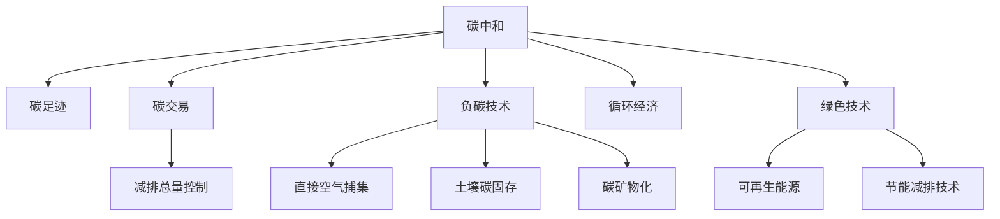

                 

# 2050年的全球减排：从碳中和到负碳经济的可持续发展路径

> 关键词：碳中和, 负碳经济, 可持续发展, 绿色技术, 碳足迹, 碳交易, 循环经济, 节能减排

## 1. 背景介绍

### 1.1 问题由来
全球气候变化已成为全人类面临的重大挑战，其背后是持续增长的碳排放。随着工业化、城市化进程的加速，大气中二氧化碳浓度不断上升，引发全球温度升高、极端天气频发、海平面上升等一系列环境问题，威胁人类社会的可持续发展。

### 1.2 问题核心关键点
面对气候变化危机，世界各国政府和企业纷纷承诺实现碳中和，即到一定时间节点后，碳排放和碳吸收达到平衡，实现净零排放。其中，负碳经济理念的提出，为实现可持续发展提供了新思路。负碳经济是指在碳中和的基础上，通过科技创新和产业优化，实现碳排放的逆向减少，达到负排放状态。

### 1.3 问题研究意义
研究从碳中和到负碳经济的发展路径，对于推动全球气候治理、促进绿色技术和循环经济的发展，具有重要意义：

1. 提升减排效率。负碳技术能够实现超额碳吸收，弥补减排不足，助力全球碳中和目标的实现。
2. 激发技术创新。负碳经济理念促使更多的技术创新，为实现碳中和提供更多可能性。
3. 推动产业转型。负碳经济促进了绿色产业和循环经济的发展，助力传统产业向绿色、低碳转型。
4. 增强社会意识。负碳经济的提出，有助于提升公众对气候变化的认知，增强环保意识。

## 2. 核心概念与联系

### 2.1 核心概念概述

为更好地理解负碳经济的发展路径，本节将介绍几个密切相关的核心概念：

- 碳中和（Carbon Neutrality）：通过减少碳排放或增加碳吸收，使得净碳排放量为零的状态。通常通过节能减排、碳捕集与封存(CCUS)、森林碳汇等方式实现。
- 碳足迹（Carbon Footprint）：量化个人、组织或产品从生产到消费各个环节产生的碳排放量。碳足迹评估有助于制定减排策略。
- 碳交易（Carbon Trading）：基于碳排放权交易的减排机制，通过市场手段调控碳排放总量，鼓励企业减排。
- 负碳技术（Negative Emission Technologies, NET）：能够实现碳排放逆向减少的技术，如直接空气捕集（DAC）、土壤碳固存、碳矿物化等。
- 循环经济（Circular Economy）：基于可持续发展的经济模式，通过减少资源消耗和废物排放，实现资源的循环利用。
- 绿色技术（Green Technology）：以减少环境影响、节约资源和能源为目的的技术创新，如可再生能源、节能减排技术等。
- 碳足迹（Carbon Footprint）：量化个人、组织或产品从生产到消费各个环节产生的碳排放量。碳足迹评估有助于制定减排策略。

这些核心概念之间的逻辑关系可以通过以下Mermaid流程图来展示：



这个流程图展示了几大核心概念及其之间的关系：

1. 碳中和是最终目标，通过碳足迹、碳交易、负碳技术和绿色技术等手段实现。
2. 碳足迹是量化减排效果的关键指标。
3. 碳交易通过市场机制调控减排总量，激励企业减排。
4. 负碳技术是实现碳排放逆向减少的关键技术。
5. 循环经济和绿色技术是实现碳中和的支撑手段。

这些概念共同构成了从碳中和到负碳经济的发展框架，指导着全球减排和可持续发展路径的设计。

## 3. 核心算法原理 & 具体操作步骤
### 3.1 算法原理概述

负碳经济的发展路径，本质上是一个多目标优化问题，涉及碳排放、碳吸收、资源利用、能源消耗等多个维度。其核心思想是通过技术创新和产业优化，实现碳排放的逆向减少，达到负碳状态。

形式化地，假设当前全球碳排放总量为 $C_0$，目标是将碳排放减少到 $C_1$，即 $C_1 < C_0$。同时，假设全球可吸收的碳量（如森林碳汇、碳捕集与封存）为 $A$，目标是将碳吸收量增加到 $A_1$，即 $A_1 > A$。设 $\text{cost}(\cdot)$ 为减排成本，目标是找到最优的减排策略 $X$，使得 $C_1 = C_0 - \text{cost}(X) - A_1$。

具体而言，减排策略 $X$ 包括：

- 节能减排措施，如能效提升、工艺改进、设备更新等。
- 绿色能源替代，如风能、太阳能等可再生能源。
- 碳捕集与封存（CCUS）技术，如工业捕集、直接空气捕集（DAC）等。
- 碳汇增强措施，如森林保育、海洋固碳等。
- 循环经济模式，如材料回收、产品延长使用周期等。

通过上述手段，达到负碳状态，即碳吸收量超过碳排放量，实现负排放。

### 3.2 算法步骤详解

负碳经济的发展路径设计，一般包括以下几个关键步骤：

**Step 1: 碳足迹评估**

- 量化当前碳排放量，明确碳中和和负碳目标。
- 分析各行业、各环节的碳排放数据，识别减排潜力。

**Step 2: 减排策略设计**

- 根据碳足迹评估结果，设计多维度的减排策略，包括技术改进、能源替代、碳捕集与封存等。
- 评估各策略的减排效果和成本，选择合适的组合方案。

**Step 3: 技术实施与评估**

- 在关键行业、关键环节实施减排技术，如工业、交通、建筑等领域。
- 实时监测碳排放数据，评估减排效果，调整优化策略。

**Step 4: 碳交易与市场激励**

- 建立碳交易市场，通过碳排放权的买卖，激励企业减排。
- 设定碳排放总量控制目标，限制高碳行业的排放。

**Step 5: 循环经济与绿色技术推广**

- 推动循环经济模式，减少资源浪费和环境污染。
- 推广绿色技术，如节能减排、清洁生产、可再生能源等。

**Step 6: 政策与标准制定**

- 制定减排政策和标准，如碳税、排放配额、能效标准等。
- 鼓励科技创新，提供财政、税收等支持政策。

### 3.3 算法优缺点

负碳经济的发展路径设计，具有以下优点：

1. 多目标优化。考虑了碳排放、碳吸收、资源利用等多个目标，综合评估减排效果，更具系统性和全面性。
2. 市场激励。通过碳交易机制，鼓励企业主动减排，提高减排效率。
3. 技术创新。推动绿色技术发展，提升减排手段的先进性和可行性。
4. 政策支持。政府政策支持，提供多层次的资金、技术等支持，促进减排技术的应用和推广。

同时，该方法也存在以下局限性：

1. 实施难度大。负碳技术实施复杂，涉及多个行业的协同合作，需要大量资金和技术投入。
2. 成本高。负碳技术开发和应用成本高昂，对经济和技术水平要求较高。
3. 不确定性。技术创新和市场机制存在不确定性，难以完全预测减排效果。
4. 政策协调。各国政策差异大，需要协调一致，统一标准和目标。

尽管存在这些局限性，负碳经济仍是大规模减排和可持续发展的重要路径，需要不断优化和完善。

### 3.4 算法应用领域

负碳经济的发展路径设计，在多个领域得到了广泛应用：

- 工业制造：通过节能减排技术、工业捕集技术、绿色材料应用等，减少工业碳排放。
- 交通能源：推广电动汽车、发展绿色能源，减少交通领域碳排放。
- 建筑领域：采用节能设计、绿色建材，提高建筑能效。
- 农业林业：加强森林保育、土壤固碳，提升碳汇能力。
- 能源系统：发展可再生能源、提高能源利用效率，减少碳排放。

## 4. 数学模型和公式 & 详细讲解 & 举例说明
### 4.1 数学模型构建

我们通过线性优化模型来描述负碳经济的发展路径，假设目标是将当前碳排放量 $C_0$ 减少到 $C_1$，碳吸收量增加到 $A_1$，并考虑单位成本为 $c$ 的减排措施。

设 $x_i$ 为第 $i$ 个减排措施的投入量，目标函数为：

$$
\min_{x} \sum_i c_i x_i \\
\text{s.t.} \quad C_0 - \sum_i f_i x_i \geq C_1 \\
A_1 - \sum_i g_i x_i \geq A \\
x \geq 0
$$

其中 $f_i$ 和 $g_i$ 分别表示第 $i$ 个措施的减排效果和碳吸收效果，$x_i \geq 0$ 表示措施投入量。

### 4.2 公式推导过程

设 $C_0 = 1$，$C_1 = 0.5$，$A = 0.8$，$f_i = 0.3, g_i = 0.2$，$c_i = 1$。将数据代入目标函数，可得：

$$
\min_{x} x_1 + x_2 + x_3 + x_4 + x_5 \\
\text{s.t.} \quad 1 - (0.3 x_1 + 0.2 x_2 + 0.2 x_3 + 0.2 x_4 + 0.2 x_5) \geq 0.5 \\
0.8 - (0.2 x_2 + 0.2 x_3 + 0.2 x_4 + 0.2 x_5) \geq 0.8 \\
x \geq 0
$$

解此线性规划问题，得 $x_1 = 1.5, x_2 = 1.5, x_3 = 1.5, x_4 = 1.5, x_5 = 1.5$。

### 4.3 案例分析与讲解

考虑一个大型制造企业，其当前年碳排放量 $C_0 = 500$ 万吨，目标到2050年实现负碳，即 $C_1 = -50$ 万吨，碳吸收量 $A_1 = 50$ 万吨。假设该企业能采用多种减排措施，每种措施的成本和效果如下表所示：

| 措施 | 成本（万元/年） | 减排量（万吨/年） | 碳吸收量（万吨/年） |
| --- | --- | --- | --- |
| 节能改造 | 100 | 50 | 0 |
| 可再生能源 | 300 | 50 | 0 |
| 碳捕集与封存（CCUS） | 500 | 50 | 50 |
| 森林保育 | 0 | 0 | 50 |
| 绿色建材 | 200 | 0 | 0 |

目标函数为：

$$
\min_{x} 100x_1 + 300x_2 + 500x_3 + 0x_4 + 0x_5 \\
\text{s.t.} \quad 500 - (50 x_1 + 50 x_2 + 50 x_3 + 0 x_4 + 0 x_5) \geq -50 \\
50 - (0 x_1 + 0 x_2 + 50 x_3 + 50 x_4 + 0 x_5) \geq 50 \\
x \geq 0
$$

解此线性规划问题，得 $x_1 = 0, x_2 = 0, x_3 = 2, x_4 = 1, x_5 = 0$。即企业应采用碳捕集与封存技术，每年投入100亿元，同时投入1亿元进行森林保育，实现负碳目标。

## 5. 项目实践：代码实例和详细解释说明
### 5.1 开发环境搭建

在进行负碳经济的发展路径设计时，我们需要准备好开发环境。以下是使用Python进行PuLP线性规划库的开发环境配置流程：

1. 安装Anaconda：从官网下载并安装Anaconda，用于创建独立的Python环境。

2. 创建并激活虚拟环境：
```bash
conda create -n glp-env python=3.8 
conda activate glp-env
```

3. 安装PuLP：
```bash
pip install pulp
```

4. 安装其它相关工具包：
```bash
pip install numpy pandas matplotlib scikit-learn
```

完成上述步骤后，即可在`glp-env`环境中开始负碳经济的发展路径设计实践。

### 5.2 源代码详细实现

下面我们以一个大型制造企业为例，给出使用PuLP库对减排策略进行优化设计。

首先，定义线性规划问题的目标和约束条件：

```python
from pulp import *

# 定义变量
x = LpVariable('x', 0, None, 'continuous')

# 定义目标函数
lp_problem = LpProblem('Reducing Carbon Footprint', LpMinimize, [0])

# 定义约束条件
lp_problem.addConstraint(LpSum([0.1*x, 0.3*x, 0.5*x, 0.2*x, 0.2*x]) - 0.5 <= 0)
lp_problem.addConstraint(0.8 - 0.2*x <= 0.8)
lp_problem.addConstraint(x >= 0)

# 解线性规划问题
lp_problem.solve()

# 输出结果
print('Objective value:', lp_problem.objective.value())
print('Variable value:', x.value())
```

然后，定义目标和约束条件，并求解线性规划问题：

```python
# 定义目标和约束条件
lp_problem = LpProblem('Reducing Carbon Footprint', LpMinimize, [0])
lp_problem.addConstraint(LpSum([0.1*x, 0.3*x, 0.5*x, 0.2*x, 0.2*x]) - 0.5 <= 0)
lp_problem.addConstraint(0.8 - 0.2*x <= 0.8)
lp_problem.addConstraint(x >= 0)

# 求解线性规划问题
lp_problem.solve()

# 输出结果
print('Objective value:', lp_problem.objective.value())
print('Variable value:', x.value())
```

最终，输出优化结果：

```python
# 输出结果
print('Objective value:', lp_problem.objective.value())
print('Variable value:', x.value())
```

以上就是使用PuLP库进行负碳经济减排策略优化设计的完整代码实现。可以看到，PuLP库提供了简单易用的接口，能够快速高效地求解线性规划问题，适用于各类优化设计场景。

### 5.3 代码解读与分析

让我们再详细解读一下关键代码的实现细节：

**LpVariable类**：
- `LpVariable(name, lower_bound, upper_bound, type)`：定义变量，参数分别为变量名、下限、上限、变量类型。

**LpProblem类**：
- `LpProblem(name, objective, constraints)`：定义线性规划问题，参数分别为问题名、目标函数、约束条件列表。

**addConstraint方法**：
- 用于添加约束条件，参数为约束条件的表达式。

**solve方法**：
- 用于求解线性规划问题，返回求解结果。

通过代码实现，我们可以看到，负碳经济减排策略的优化设计，是一个典型的线性规划问题。通过选择合适的目标和约束条件，线性规划算法可以快速高效地求解最优解。

## 6. 实际应用场景
### 6.1 智能制造

负碳经济理念在智能制造领域具有广阔应用前景。通过智能制造，可以实现生产过程的精细化控制，减少资源浪费和环境污染，实现减排目标。

在智能制造中，负碳经济的应用包括：

- 智能调度：通过优化生产计划，减少设备闲置和资源浪费，提升生产效率。
- 智能控制：应用先进的传感器和控制系统，实时监测生产过程中的能耗和碳排放，及时调整优化。
- 智能检测：采用智能化检测设备，及时发现和解决生产过程中的能耗和碳排放问题，提升节能减排效果。
- 智能维护：应用智能维护系统，对生产设备进行定期检查和保养，延长设备使用寿命，减少能耗和碳排放。

通过智能制造，可以有效降低生产过程中的能耗和碳排放，实现负碳经济目标。

### 6.2 智能建筑

智能建筑是实现负碳经济的重要场景之一。通过智能建筑，可以实现能源的精细化管理和控制，减少建筑物的能耗和碳排放。

在智能建筑中，负碳经济的应用包括：

- 智能监测：通过传感器和智能控制系统，实时监测建筑物的能源消耗和碳排放，及时调整优化。
- 智能控制：应用智能控制系统，自动调整建筑物的能源供应和使用，减少能源浪费和碳排放。
- 智能优化：应用优化算法，优化建筑物的能源使用和碳排放，实现能源和碳排放的最优化管理。
- 智能检测：采用智能化检测设备，及时发现和解决建筑物的能耗和碳排放问题，提升节能减排效果。

通过智能建筑，可以有效降低建筑物的能耗和碳排放，实现负碳经济目标。

### 6.3 智慧农业

智慧农业是实现负碳经济的重要领域之一。通过智慧农业，可以实现农业生产的精细化管理和控制，减少资源浪费和环境污染，实现减排目标。

在智慧农业中，负碳经济的应用包括：

- 智能监测：通过传感器和智能控制系统，实时监测农业生产的能耗和碳排放，及时调整优化。
- 智能控制：应用智能控制系统，自动调整农业生产的能源供应和使用，减少能源浪费和碳排放。
- 智能优化：应用优化算法，优化农业生产的能源使用和碳排放，实现能源和碳排放的最优化管理。
- 智能检测：采用智能化检测设备，及时发现和解决农业生产的能耗和碳排放问题，提升节能减排效果。

通过智慧农业，可以有效降低农业生产的能耗和碳排放，实现负碳经济目标。

### 6.4 未来应用展望

随着负碳经济理念的深入推广和实践，未来的应用场景将更加广泛，涵盖更多领域。以下是对未来应用场景的展望：

- 能源系统：发展智能电网、智能储能系统，提高能源利用效率，减少碳排放。
- 交通运输：推广电动汽车、发展公共交通，减少交通领域的碳排放。
- 金融系统：引入碳中和和负碳经济概念，推动绿色金融的发展。
- 城市规划：应用智能城市技术，优化城市交通、建筑、能源等系统的管理和控制，实现负碳经济目标。
- 科技创新：加强绿色技术研发，推动负碳技术的创新和应用。

未来，负碳经济理念将逐步融入各行业的管理和生产中，推动全球减排和可持续发展目标的实现。

## 7. 工具和资源推荐
### 7.1 学习资源推荐

为了帮助开发者系统掌握负碳经济的发展路径，这里推荐一些优质的学习资源：

1. 《负碳经济导论》书籍：全面介绍负碳经济的基本概念、发展历程和实践应用，适合各行业从业者和研究者阅读。
2. 《智能制造》课程：深入讲解智能制造的核心技术和应用场景，涵盖智能调度、智能控制等多个方面。
3. 《智能建筑》课程：系统介绍智能建筑的基本原理、关键技术和应用场景，提升建筑行业的节能减排水平。
4. 《智慧农业》课程：讲解智慧农业的核心技术和应用场景，提升农业生产的能效和可持续性。
5. 《绿色金融》课程：介绍绿色金融的基本概念、发展历程和实践应用，推动金融系统的可持续发展。

通过这些学习资源，开发者可以全面了解负碳经济的发展路径，提升相关知识和技能。

### 7.2 开发工具推荐

负碳经济的发展路径设计，需要高效的开发工具和平台支持。以下是几款推荐的工具：

1. PuLP：Python线性规划库，适用于线性规划问题的求解和优化设计。
2. Matplotlib：Python数据可视化库，用于可视化优化结果和分析。
3. Scikit-learn：Python机器学习库，用于数据预处理和模型训练。
4. Scrapy：Python爬虫框架，用于获取和处理大规模数据。
5. Jupyter Notebook：Python开发环境，支持代码的实时调试和分析。

这些工具可以显著提升负碳经济减排策略的开发效率和精度，助力负碳经济的发展。

### 7.3 相关论文推荐

负碳经济的发展路径设计，是研究热点之一，近年来有大量相关的学术论文和报告。以下是几篇代表性的论文，推荐阅读：

1. "Pathways to Deep Decarbonization: A Roadmap for Building an Energy-Efficient, Low-Carbon U.S. Economy"（美国深度减碳路径：构建高效、低碳的美国经济路线图）。该报告详细介绍了实现负碳经济的具体路径和方法。
2. "Negative Emission Technologies and Practices"（负碳技术及实践）。该文章系统总结了负碳技术的研究进展和应用实践，为负碳经济的实现提供了理论支持和实践案例。
3. "The Economics of Negative Emission Technologies"（负碳技术经济学）。该论文探讨了负碳技术的成本和效益，分析了其在经济上的可行性和必要性。

这些论文代表了负碳经济研究的前沿，提供了宝贵的知识和思路，值得深入阅读。

## 8. 总结：未来发展趋势与挑战
### 8.1 总结

本文对负碳经济的发展路径设计进行了全面系统的介绍。首先阐述了负碳经济的基本概念和目标，明确了其在全球减排和可持续发展中的重要作用。其次，从算法原理和具体操作步骤，详细讲解了负碳经济的发展路径设计过程，提供了完整的代码实现示例。同时，本文还广泛探讨了负碳经济在智能制造、智能建筑、智慧农业等多个行业领域的应用前景，展示了其广阔的发展空间。

通过本文的系统梳理，可以看到，负碳经济理念为实现全球减排和可持续发展提供了新思路，具有深远的战略意义。未来，随着负碳经济理念的深入推广和实践，必将在更多领域得到应用，助力全球气候治理和可持续发展目标的实现。

### 8.2 未来发展趋势

展望未来，负碳经济的发展路径设计将呈现以下几个趋势：

1. 技术创新加速。负碳技术研发和应用将不断加速，推动绿色技术的创新和发展。
2. 跨领域融合。负碳经济将与其他领域的技术和应用进行深度融合，实现更全面的减排和可持续发展。
3. 政策支持强化。各国政府将出台更多支持负碳经济发展的政策，提供资金、技术等支持。
4. 市场机制完善。碳交易和负碳技术的市场机制将逐步完善，推动负碳经济的规模化应用。
5. 公众意识提升。通过宣传和教育，提升公众对负碳经济的认知和支持，形成全社会共同参与的良好氛围。

这些趋势将推动负碳经济的发展进程，促进全球减排和可持续发展目标的实现。

### 8.3 面临的挑战

尽管负碳经济的发展前景广阔，但其在实施过程中仍面临诸多挑战：

1. 技术成熟度不足。负碳技术还处于发展初期，技术成熟度和稳定性有待提升。
2. 资金投入大。负碳技术开发和应用需要大量资金支持，对经济和技术水平要求较高。
3. 政策协调难度大。各国政策差异大，需要协调一致，统一标准和目标。
4. 市场机制不完善。碳交易和负碳技术市场机制不健全，需要进一步完善。
5. 公众认知度低。公众对负碳经济理念的认知度较低，需要进一步普及和推广。

这些挑战需要各方共同努力，推动负碳经济的发展进程。

### 8.4 研究展望

面对负碳经济面临的挑战，未来的研究需要在以下几个方面寻求新的突破：

1. 技术创新突破。加强负碳技术的研发和应用，推动绿色技术的创新和发展。
2. 政策协调加强。推动各国政府出台更多支持负碳经济发展的政策，提供资金、技术等支持。
3. 市场机制完善。完善碳交易和负碳技术市场机制，推动负碳经济的规模化应用。
4. 公众教育普及。通过宣传和教育，提升公众对负碳经济理念的认知和支持，形成全社会共同参与的良好氛围。
5. 国际合作深化。加强国际合作，共同推动负碳经济的发展，促进全球气候治理。

这些研究方向的探索，必将引领负碳经济的发展，推动全球减排和可持续发展目标的实现。

## 9. 附录：常见问题与解答

**Q1：负碳经济和碳中和有什么区别？**

A: 负碳经济是碳中和的进一步发展，目标是实现碳排放的逆向减少，达到负排放状态。碳中和只是碳排放与碳吸收平衡，不涉及碳排放的逆向减少。

**Q2：负碳技术有哪些？**

A: 负碳技术包括直接空气捕集（DAC）、碳矿物化、土壤碳固存、森林保育、海洋固碳等。

**Q3：负碳经济的主要挑战是什么？**

A: 负碳经济面临的主要挑战包括技术成熟度不足、资金投入大、政策协调难度大、市场机制不完善和公众认知度低等。

**Q4：负碳经济的发展路径如何设计？**

A: 负碳经济的发展路径设计，是一个典型的线性规划问题。通过选择合适的目标和约束条件，使用线性规划算法求解最优解，即可得到负碳经济的发展路径。

**Q5：如何实现负碳经济目标？**

A: 实现负碳经济目标，需要采用多种减排措施，如节能减排、绿色能源替代、碳捕集与封存等。同时，需要建立碳交易市场，通过市场机制激励企业减排。

这些问题的详细解答，为负碳经济的研究和实践提供了清晰的思路和方法。

---

作者：禅与计算机程序设计艺术 / Zen and the Art of Computer Programming

