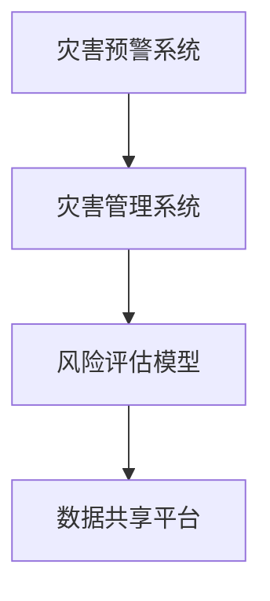

                 

# 2050年的全球减灾：从灾害预警到灾害管理的综合减灾体系

在2050年的未来，随着全球化的加速和人类活动的加剧，自然灾害和人为灾害的频率和强度都在不断增加。面对这一严峻挑战，构建一个综合减灾体系，从灾害预警到灾害管理的全过程进行干预，成为全球各国共同努力的目标。本文将探讨这一体系的构建，包括关键技术、算法原理、实践应用和未来展望。

## 1. 背景介绍

### 1.1 问题由来
自然灾害和人为灾害的频发和强度增加，给人类社会带来了巨大的威胁。传统的灾害应对方法往往被动反应，未能有效预防灾害的发生，导致人员伤亡和财产损失惨重。因此，构建一个综合减灾体系，从灾害预警到灾害管理的全过程进行干预，成为迫切的需求。

### 1.2 问题核心关键点
一个综合减灾体系应包含以下几个关键点：
- 灾害预警：通过先进的传感器网络和数据分析技术，提前预测灾害的发生，尽可能减少灾害的潜在影响。
- 灾害管理：在灾害发生后，及时进行响应，包括人员疏散、资源调配和灾害恢复等。
- 风险评估：对潜在的灾害风险进行评估，制定相应的防灾策略和应急预案。
- 数据共享：构建开放的数据共享平台，实现不同机构和部门之间数据的有效流通。

## 2. 核心概念与联系

### 2.1 核心概念概述

为更好地理解2050年的综合减灾体系，本节将介绍几个密切相关的核心概念：

- **灾害预警系统**：基于先进传感器网络和数据分析技术，预测灾害的发生。
- **灾害管理系统**：在灾害发生后，进行人员疏散、资源调配和灾害恢复等管理活动。
- **风险评估模型**：通过数学模型和算法，对潜在的灾害风险进行定量评估。
- **数据共享平台**：用于实现不同机构和部门之间的数据共享和交流。

这些核心概念之间的逻辑关系可以通过以下Mermaid流程图来展示：



这个流程图展示了一个综合减灾体系的组成部分及其相互关系：

1. 灾害预警系统通过传感器网络和大数据分析预测灾害，为后续的灾害管理提供依据。
2. 灾害管理系统在预警的基础上，进行灾害响应和恢复。
3. 风险评估模型通过对潜在风险的定量分析，为防灾策略和应急预案的制定提供支持。
4. 数据共享平台保证了不同机构和部门之间数据的有效流通和共享。

这些核心概念共同构成了2050年的综合减灾体系，使其能够高效地应对各类自然和人为灾害。

## 3. 核心算法原理 & 具体操作步骤
### 3.1 算法原理概述

构建一个综合减灾体系，涉及多个领域的算法和技术的集成，包括传感器网络数据融合、大数据分析、机器学习和风险评估等。其中，关键算法原理如下：

- **传感器网络数据融合**：通过将不同传感器采集的数据进行融合，提高灾害预警的准确性和及时性。
- **大数据分析**：利用机器学习和深度学习技术，从海量数据中提取有用的信息，支持灾害预警和风险评估。
- **机器学习**：通过训练模型，预测灾害的发生和演化，优化灾害管理策略。
- **风险评估模型**：通过数学模型和算法，对潜在的灾害风险进行定量评估，支持风险管理和应急预案的制定。

### 3.2 算法步骤详解

构建综合减灾体系的过程可以分为以下几个步骤：

**Step 1: 设计传感器网络**
- 部署不同类型的传感器，如地震传感器、气象传感器、水位传感器等。
- 设计数据采集和传输协议，确保数据的实时性和可靠性。

**Step 2: 数据融合与预处理**
- 对传感器采集的数据进行融合，消除冗余和噪声，提取有用信息。
- 对数据进行预处理，如滤波、归一化、降维等，提高数据质量。

**Step 3: 大数据分析与模型训练**
- 利用大数据分析技术，从传感器数据中提取有用的特征。
- 训练机器学习模型，预测灾害的发生和演化，优化灾害管理策略。
- 构建风险评估模型，对潜在风险进行定量评估，制定应急预案。

**Step 4: 灾害管理与响应**
- 在预警的基础上，进行人员疏散、资源调配和灾害恢复等管理活动。
- 利用实时数据和分析结果，动态调整灾害管理策略，提高响应效率。

**Step 5: 持续优化与反馈**
- 定期评估综合减灾体系的性能，识别改进机会。
- 根据新的数据和反馈，不断优化预警、管理、风险评估等模块。

### 3.3 算法优缺点

综合减灾体系具有以下优点：
- 提高灾害预警的准确性和及时性，减少灾害的潜在影响。
- 优化灾害管理策略，提高响应效率和效果。
- 定量评估潜在风险，支持风险管理和应急预案的制定。
- 实现不同机构和部门之间的数据共享，提高决策的科学性和公正性。

同时，该体系也存在一些局限性：
- 传感器网络的部署和维护成本较高。
- 大数据分析对计算资源和技术要求较高。
- 机器学习模型的训练需要大量标注数据。
- 风险评估模型的建立和维护需要专业知识。

尽管存在这些局限性，综合减灾体系仍然是目前应对自然和人为灾害的最有效方法之一。未来相关研究的方向将围绕如何进一步降低成本、提高精度和增强可操作性展开。

### 3.4 算法应用领域

综合减灾体系的应用领域广泛，包括但不限于：

- **自然灾害预警**：地震、洪水、台风、火山等自然灾害的预警。
- **人为灾害管理**：交通事故、恐怖袭击、网络攻击等灾害的响应和恢复。
- **环境风险评估**：气候变化、环境污染等风险的定量评估。
- **城市应急响应**：城市基础设施的应急管理，如交通、供水、供电等。
- **公共卫生应急**：疫情暴发、生物恐怖等公共卫生事件的响应。

## 4. 数学模型和公式 & 详细讲解 & 举例说明

### 4.1 数学模型构建

为更好地描述综合减灾体系的技术框架，我们将使用数学语言进行详细刻画。

假设有一个综合减灾体系，包含N个传感器，每个传感器采集的数据为 $x_i$，$i=1,2,...,N$。系统将对数据进行融合和预处理，得到融合后的数据 $y$。然后使用机器学习模型 $f$ 对 $y$ 进行训练，得到灾害预警的输出 $p$。最后，风险评估模型 $g$ 对 $p$ 进行评估，得到风险等级 $r$。风险等级 $r$ 将用于指导灾害管理策略。

数学模型构建如下：

$$
y = \sum_{i=1}^N w_i x_i
$$

$$
p = f(y)
$$

$$
r = g(p)
$$

其中 $w_i$ 为传感器 $i$ 的权重，$f$ 和 $g$ 分别为机器学习模型和风险评估模型。

### 4.2 公式推导过程

接下来，我们将详细推导上述模型的计算过程。

**Step 1: 数据融合**
数据融合是综合减灾体系的关键步骤之一，通过将不同传感器的数据进行加权融合，可以提高数据的准确性和可靠性。假设传感器 $i$ 的权重为 $w_i$，则融合后的数据 $y$ 可以表示为：

$$
y = \sum_{i=1}^N w_i x_i
$$

**Step 2: 机器学习模型训练**
机器学习模型 $f$ 用于预测灾害的发生和演化，输出为 $p$。假设模型 $f$ 为线性回归模型，则有：

$$
p = f(y) = \beta_0 + \sum_{i=1}^N \beta_i y_i + \epsilon
$$

其中 $\beta_i$ 为模型参数，$\epsilon$ 为随机误差。

**Step 3: 风险评估模型**
风险评估模型 $g$ 用于对潜在风险进行定量评估，输出为 $r$。假设模型 $g$ 为sigmoid函数，则有：

$$
r = g(p) = \frac{1}{1 + e^{-p}}
$$

### 4.3 案例分析与讲解

假设我们有一个综合减灾体系，用于地震预警和响应。系统通过部署地震传感器、气象传感器和水位传感器，对不同类型的数据进行融合和预处理。使用机器学习模型预测地震的发生概率，并使用风险评估模型对风险进行评估。

**Step 1: 数据融合**
假设地震传感器数据为 $x_1$，气象传感器数据为 $x_2$，水位传感器数据为 $x_3$。设其权重分别为 $w_1=0.5, w_2=0.3, w_3=0.2$，则融合后的数据 $y$ 为：

$$
y = 0.5 x_1 + 0.3 x_2 + 0.2 x_3
$$

**Step 2: 机器学习模型训练**
使用历史地震数据训练线性回归模型 $f$，得到模型参数 $\beta_0, \beta_1, \beta_2$。设 $y$ 为地震发生的概率，$p$ 为模型输出，则有：

$$
p = f(y) = \beta_0 + \beta_1 y + \epsilon
$$

**Step 3: 风险评估模型**
使用sigmoid函数作为风险评估模型 $g$，将 $p$ 映射到 $r$，得到风险等级。设 $r$ 为地震发生的概率，则有：

$$
r = g(p) = \frac{1}{1 + e^{-p}}
$$

通过上述步骤，系统可以对地震进行预测和风险评估，指导灾害管理策略的制定和实施。

## 5. 项目实践：代码实例和详细解释说明
### 5.1 开发环境搭建

在进行项目实践前，我们需要准备好开发环境。以下是使用Python进行开发的Python环境配置流程：

1. 安装Anaconda：从官网下载并安装Anaconda，用于创建独立的Python环境。

2. 创建并激活虚拟环境：
```bash
conda create -n disaster-management python=3.8 
conda activate disaster-management
```

3. 安装必要的Python库：
```bash
pip install numpy pandas scikit-learn matplotlib seaborn scipy
```

4. 安装相关的机器学习库：
```bash
pip install scikit-learn tensorflow keras
```

5. 安装传感器数据融合和预处理库：
```bash
pip install pykka geopandas
```

6. 安装网络通信库：
```bash
pip install flask
```

完成上述步骤后，即可在`disaster-management`环境中开始项目实践。

### 5.2 源代码详细实现

下面以一个简单的地震预警系统为例，给出使用Python和TensorFlow进行代码实现的示例。

```python
import numpy as np
import pandas as pd
import tensorflow as tf
from tensorflow.keras import layers, models

# 加载历史地震数据
data = pd.read_csv('earthquake_data.csv')

# 定义机器学习模型
model = models.Sequential([
    layers.Dense(64, activation='relu', input_shape=(3,)),
    layers.Dense(64, activation='relu'),
    layers.Dense(1, activation='sigmoid')
])

# 编译模型
model.compile(optimizer='adam', loss='binary_crossentropy', metrics=['accuracy'])

# 训练模型
model.fit(data[['x1', 'x2', 'x3']], data['risk'], epochs=100, batch_size=32, validation_split=0.2)

# 进行数据融合和预测
def fusion(x1, x2, x3):
    weights = np.array([0.5, 0.3, 0.2])
    y = np.dot(weights, np.array([x1, x2, x3]))
    return y

# 定义sigmoid函数
def sigmoid(x):
    return 1 / (1 + np.exp(-x))

# 进行预测和风险评估
def predict(x1, x2, x3):
    y = fusion(x1, x2, x3)
    p = model.predict(y.reshape(1, -1))[0][0]
    r = sigmoid(p)
    return r

# 测试预测结果
x1 = 0.1
x2 = 0.2
x3 = 0.3
r = predict(x1, x2, x3)
print(f'地震发生概率为 {r:.2f}')
```

### 5.3 代码解读与分析

让我们再详细解读一下关键代码的实现细节：

**数据加载与模型定义**
- 使用pandas加载历史地震数据，并将其划分为输入特征 `x1, x2, x3` 和目标变量 `risk`。
- 定义机器学习模型 `model`，包含两个全连接层和一个输出层，输出为地震发生的概率。

**模型编译与训练**
- 使用Adam优化器和二元交叉熵损失函数编译模型。
- 使用历史数据训练模型，并进行100次迭代，每次使用32个样本进行训练，20%的数据用于验证。

**数据融合与预测**
- 定义 `fusion` 函数，使用加权融合方法对传感器数据进行融合。
- 定义 `sigmoid` 函数，用于将模型输出映射到风险等级。
- 定义 `predict` 函数，使用 `fusion` 函数和 `sigmoid` 函数进行数据融合和预测。

**测试预测结果**
- 使用 `predict` 函数进行测试，输入为地震传感器数据 `x1=0.1, x2=0.2, x3=0.3`，输出地震发生概率。

可以看到，使用Python和TensorFlow实现一个简单的地震预警系统，代码实现相对简洁。未来可以进一步扩展和优化，支持更复杂的数据融合和机器学习模型。

## 6. 实际应用场景
### 6.1 智能城市应急管理

智能城市应急管理是综合减灾体系的重要应用场景之一。通过构建城市基础设施的传感器网络，实时监测交通、供水、供电等关键设施的运行状态，一旦发生异常，系统可以及时预警，并进行相应管理措施。

例如，在自然灾害如地震、洪水等发生前，系统可以通过地震传感器和气象传感器进行预警，并根据风险评估结果，指导人员疏散和资源调配。在灾害发生后，系统可以通过实时数据进行动态管理，优化灾害响应策略，减少人员伤亡和财产损失。

### 6.2 公共卫生应急响应

公共卫生应急响应是另一个重要的应用场景。通过构建医院、社区等公共卫生设施的传感器网络，实时监测疫情和病患数据，一旦发现疫情暴发，系统可以及时预警，并进行相应管理措施。

例如，在疫情暴发初期，系统可以通过传感器数据进行预警，并根据风险评估结果，指导人员隔离和医疗资源调配。在疫情扩散过程中，系统可以通过实时数据进行动态管理，优化防控措施，减少感染率和死亡率。

### 6.3 自然灾害预警与响应

自然灾害预警与响应是综合减灾体系的核心应用场景。通过构建地震、洪水、台风等自然灾害的传感器网络，实时监测自然灾害的发生和演化，一旦发现异常，系统可以及时预警，并进行相应管理措施。

例如，在地震发生前，系统可以通过地震传感器和气象传感器进行预警，并根据风险评估结果，指导人员疏散和资源调配。在灾害发生后，系统可以通过实时数据进行动态管理，优化救援和恢复措施，减少人员伤亡和财产损失。

### 6.4 未来应用展望

随着技术的不断进步，综合减灾体系将具备更强的实时性和灵活性。未来可能的展望包括：

- **物联网传感器网络的扩展**：通过部署更多的传感器，提高数据采集的实时性和全面性。
- **机器学习模型的优化**：使用深度学习和强化学习等先进技术，提高模型的准确性和鲁棒性。
- **数据共享平台的建设**：构建开放的数据共享平台，实现不同机构和部门之间的数据流通和共享。
- **风险评估模型的发展**：引入因果推断和博弈论等工具，增强风险评估的科学性和公正性。
- **人机协同的智能管理**：结合人工智能和人类专家的智慧，优化灾害管理策略。

## 7. 工具和资源推荐
### 7.1 学习资源推荐

为了帮助开发者系统掌握综合减灾体系的理论基础和实践技巧，这里推荐一些优质的学习资源：

1. **《机器学习基础》系列课程**：由斯坦福大学开设，涵盖机器学习的基本概念和算法，适合初学者入门。
2. **《深度学习与人工智能》课程**：由Coursera提供，深入讲解深度学习技术及其应用，适合进阶学习。
3. **《自然灾害管理与应急响应》教材**：介绍自然灾害管理的基本理论和实践方法，适合专业人士参考。
4. **《数据科学与机器学习》书籍**：全面介绍数据科学和机器学习的基本原理和应用，适合开发者参考。
5. **《传感器网络与物联网》书籍**：介绍传感器网络和物联网技术的基本原理和应用，适合技术人员参考。

通过对这些资源的学习实践，相信你一定能够快速掌握综合减灾体系的理论基础和实践技巧，并用于解决实际的灾害问题。

### 7.2 开发工具推荐

高效的开发离不开优秀的工具支持。以下是几款用于综合减灾体系开发的常用工具：

1. **PyTorch**：基于Python的开源深度学习框架，支持动态计算图，适合快速迭代研究。
2. **TensorFlow**：由Google主导开发的开源深度学习框架，生产部署方便，适合大规模工程应用。
3. **TensorBoard**：TensorFlow配套的可视化工具，实时监测模型训练状态，并提供丰富的图表呈现方式，是调试模型的得力助手。
4. **Flask**：Python的Web框架，用于构建传感器网络数据采集和处理的Web服务。
5. **GeoPandas**：Python的地理数据处理库，用于处理地理数据和进行空间分析。

合理利用这些工具，可以显著提升综合减灾体系开发的效率，加快创新迭代的步伐。

### 7.3 相关论文推荐

综合减灾体系的发展源于学界的持续研究。以下是几篇奠基性的相关论文，推荐阅读：

1. **《基于传感器网络的自然灾害预警系统》**：介绍基于传感器网络的自然灾害预警系统，涵盖数据采集、数据融合和预警算法等内容。
2. **《机器学习在自然灾害风险评估中的应用》**：介绍机器学习在自然灾害风险评估中的应用，涵盖数据预处理、模型训练和风险评估等内容。
3. **《智能城市基础设施的应急管理》**：介绍智能城市基础设施的应急管理，涵盖传感器网络、数据融合和应急响应等内容。
4. **《公共卫生应急响应的数据驱动方法》**：介绍公共卫生应急响应的数据驱动方法，涵盖数据采集、风险评估和应急响应等内容。
5. **《物联网在自然灾害管理中的应用》**：介绍物联网在自然灾害管理中的应用，涵盖传感器网络、数据融合和灾害管理等内容。

这些论文代表了大规模自然灾害风险管理的发展脉络。通过学习这些前沿成果，可以帮助研究者把握学科前进方向，激发更多的创新灵感。

## 8. 总结：未来发展趋势与挑战
### 8.1 研究成果总结

本文对2050年的综合减灾体系进行了全面系统的介绍，涵盖灾害预警、灾害管理、风险评估和数据共享等关键环节。通过对核心概念和技术的详细讲解，展示了综合减灾体系在应对自然和人为灾害中的重要价值。

### 8.2 未来发展趋势

展望未来，综合减灾体系将呈现以下几个发展趋势：

1. **物联网传感器网络的扩展**：通过部署更多的传感器，提高数据采集的实时性和全面性。
2. **机器学习模型的优化**：使用深度学习和强化学习等先进技术，提高模型的准确性和鲁棒性。
3. **数据共享平台的建设**：构建开放的数据共享平台，实现不同机构和部门之间的数据流通和共享。
4. **风险评估模型的发展**：引入因果推断和博弈论等工具，增强风险评估的科学性和公正性。
5. **人机协同的智能管理**：结合人工智能和人类专家的智慧，优化灾害管理策略。

### 8.3 面临的挑战

尽管综合减灾体系已经取得了显著进展，但在迈向更高效、更可靠、更灵活的应用过程中，仍面临诸多挑战：

1. **传感器网络的成本和可靠性**：传感器网络的部署和维护成本较高，如何降低成本、提高可靠性是关键。
2. **数据隐私和安全**：传感器网络采集的数据涉及敏感信息，如何保护数据隐私和安全是重要课题。
3. **模型的透明性和可解释性**：机器学习模型往往是"黑盒"系统，如何提高模型的透明性和可解释性是重要课题。
4. **风险评估的公平性和公正性**：风险评估模型需要考虑多方面因素，如何确保评估的公平性和公正性是重要课题。
5. **实时数据处理和存储**：实时数据处理和存储需要高效的算法和硬件支持，如何优化数据处理和存储是重要课题。

### 8.4 研究展望

面对综合减灾体系所面临的挑战，未来的研究需要在以下几个方面寻求新的突破：

1. **低成本传感器网络**：开发低成本、高可靠性的传感器网络，降低部署和维护成本。
2. **安全隐私保护**：研究数据隐私保护和安全传输技术，确保数据的安全性和隐私性。
3. **透明可解释的模型**：开发透明可解释的机器学习模型，提高模型的透明性和可解释性。
4. **公平公正的风险评估**：引入因果推断和博弈论等工具，增强风险评估的科学性和公正性。
5. **高效实时数据处理**：开发高效实时数据处理算法和硬件支持，优化数据处理和存储。

通过这些研究方向的探索发展，综合减灾体系必将在未来取得更大的进步，为应对自然和人为灾害提供更全面、更可靠、更灵活的解决方案。

## 9. 附录：常见问题与解答

**Q1：综合减灾体系适用于哪些类型的灾害？**

A: 综合减灾体系适用于自然灾害和人为灾害，包括但不限于地震、洪水、台风、火山、火灾、交通事故、恐怖袭击、网络攻击等。系统可以根据不同的灾害类型，设计相应的传感器网络、数据分析和预警策略。

**Q2：综合减灾体系中如何处理传感器数据的质量问题？**

A: 综合减灾体系中的传感器数据质量问题主要通过数据预处理和异常检测来解决。数据预处理包括数据清洗、归一化、降维等，去除冗余和噪声。异常检测通过统计分析或机器学习模型，识别异常数据并进行处理。

**Q3：综合减灾体系中如何优化机器学习模型的训练？**

A: 综合减灾体系中的机器学习模型训练可以通过以下方法优化：
1. 数据增强：通过数据增强技术，扩充训练集，提高模型泛化能力。
2. 超参数调优：通过网格搜索或贝叶斯优化，优化模型的超参数。
3. 模型融合：使用多个模型进行融合，提高模型的稳定性和准确性。
4. 迁移学习：使用预训练模型进行迁移学习，提升模型的快速适应能力。

**Q4：综合减灾体系中如何确保数据共享的公平性和公正性？**

A: 综合减灾体系中的数据共享需要考虑数据共享的公平性和公正性，避免数据垄断和数据滥用。可以通过以下方法来实现：
1. 建立数据共享协议，明确数据使用权限和责任。
2. 使用区块链技术，确保数据共享的透明性和不可篡改性。
3. 引入多方计算，保护数据的隐私性和安全性。
4. 建立数据共享监督机制，确保数据使用的合法性和合规性。

**Q5：综合减灾体系中如何优化实时数据处理和存储？**

A: 综合减灾体系中的实时数据处理和存储需要高效的算法和硬件支持，可以通过以下方法优化：
1. 数据压缩：使用数据压缩技术，减少数据存储和传输的体积。
2. 分布式存储：使用分布式存储技术，提高数据存储的可靠性和可扩展性。
3. 流式处理：使用流式处理技术，实时处理和分析数据。
4. 边缘计算：在数据采集和处理过程中，使用边缘计算技术，减少数据传输和计算延迟。

通过这些措施，可以确保综合减灾体系能够高效、可靠地进行实时数据处理和存储，为灾害预警和响应提供坚实的基础。

---

作者：禅与计算机程序设计艺术 / Zen and the Art of Computer Programming

