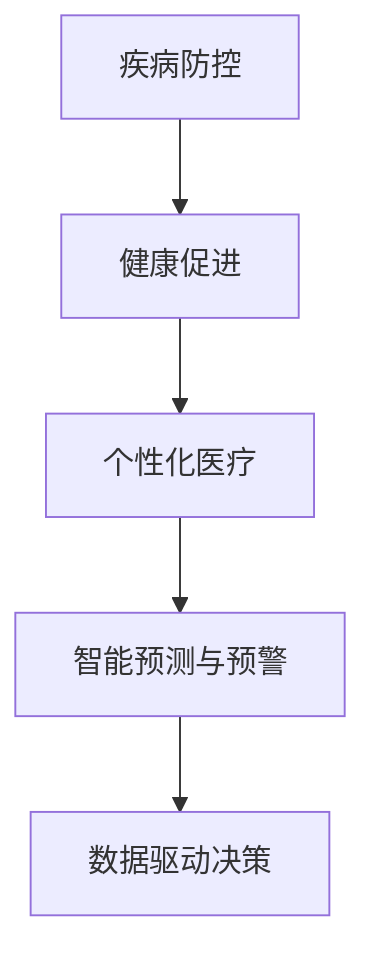

                 

# 2050年的全球卫生：从疾病防控到健康促进的大健康战略

在科技迅猛发展的今天，我们正处在迎接2050年全球卫生革命的前夜。随着人工智能、大数据、物联网等技术在医疗健康领域的应用深入，未来的卫生系统将不仅关注疾病的防控和治疗，还将全面推进健康促进，实现从“治病”到“防病”的转变。本文将从疾病防控和健康促进两大战略入手，探讨未来大健康领域的智能化、个性化、数据驱动的发展方向。

## 1. 背景介绍

### 1.1 问题由来

过去几十年的卫生发展，主要集中在疾病的诊断和治疗上。然而，全球疾病负担的分布和构成正在迅速变化，传染病疫情的爆发、非传染性疾病的高发、老龄化社会的挑战，以及全球化的影响，都对现有的卫生系统提出了新的要求。如何构建一个既能有效防控疾病，又能全面促进健康的卫生体系，成为了迫在眉睫的任务。

### 1.2 问题核心关键点

- **智能预测与预警**：利用AI技术对疾病爆发进行智能预测和预警，提前采取防控措施。
- **个性化医疗**：根据个体健康数据，提供个性化治疗方案，提高医疗效果。
- **健康管理**：通过物联网等技术，实现对个人健康的持续监测和实时反馈。
- **数据驱动决策**：依托大数据分析，优化医疗资源配置和政策制定。
- **健康促进**：综合多学科知识，推动健康生活方式的普及。

### 1.3 问题研究意义

构建未来的大健康战略，对于应对全球健康挑战，提升全球人口的整体健康水平，具有重要的意义：

1. **提升卫生系统效率**：智能预测和预警能够提前发现疾病风险，优化资源配置，提高公共卫生的响应速度。
2. **改善健康管理**：个性化医疗和健康管理将提升个体健康水平，减少慢性病发病率，延长预期寿命。
3. **推动政策科学化**：数据驱动的决策支持系统，能够为卫生政策提供科学依据，减少决策失误。
4. **促进社会和谐**：健康的社会是和谐的社会，健康促进将促进社会公正，减少不平等。
5. **推动经济发展**：健康的人力资本是经济发展的重要基础，健康促进将推动全球经济增长。

## 2. 核心概念与联系

### 2.1 核心概念概述

为了更好地理解未来大健康战略，本节将介绍几个核心概念及其联系：

- **疾病防控**：通过疫苗接种、环境卫生、疾病监测等手段，防止疾病的发生和传播。
- **健康促进**：通过教育、宣传、政策等手段，促进健康行为和生活方式的形成。
- **个性化医疗**：根据个体健康数据，定制个性化的治疗和预防方案。
- **智能预测与预警**：利用AI技术对疾病爆发进行预测和预警，提前采取防控措施。
- **数据驱动决策**：依托大数据分析，优化医疗资源配置和政策制定。

这些概念之间的联系可以通过以下Mermaid流程图来展示：



这个流程图展示了大健康战略的关键组成部分及其相互关系：

1. 疾病防控是基础，通过消除病原体传播，减少疾病发生。
2. 健康促进通过改善生活习惯和环境，提升整体健康水平。
3. 个性化医疗利用个体数据，提供针对性的医疗方案。
4. 智能预测与预警利用AI技术，提前识别疾病风险。
5. 数据驱动决策依托大数据分析，优化卫生资源配置。

这些概念共同构成了未来大健康战略的框架，为其发展提供了方向和动力。

## 3. 核心算法原理 & 具体操作步骤

### 3.1 算法原理概述

未来大健康战略的核心算法原理主要集中在以下几个方面：

1. **机器学习和深度学习**：利用大数据和复杂模型，进行疾病预测和健康管理。
2. **自然语言处理**：从健康文献、患者反馈中提取有用信息，支持决策制定。
3. **物联网和传感器**：实时监测个体健康数据，提供即时反馈。
4. **区块链技术**：确保健康数据的隐私和安全，促进跨机构数据共享。
5. **云计算和边缘计算**：实现大规模数据存储和处理，支持实时分析。

### 3.2 算法步骤详解

未来大健康战略的算法实施步骤主要包括：

1. **数据收集与整合**：从各种渠道收集个体健康数据，整合为统一格式。
2. **预处理与清洗**：对数据进行清洗、去重、标准化处理，确保数据质量。
3. **模型训练与优化**：选择适合的机器学习模型，利用历史数据进行训练，调整超参数优化性能。
4. **部署与监控**：将训练好的模型部署到生产环境，实时监控模型性能，定期更新模型。
5. **用户反馈与迭代**：收集用户反馈，评估模型效果，不断迭代改进。

### 3.3 算法优缺点

未来大健康战略的算法具有以下优点：

1. **高效性**：利用AI和大数据技术，快速分析海量数据，提高决策效率。
2. **精准性**：通过个性化医疗和智能预测，提供精准的诊断和治疗方案。
3. **可持续性**：数据驱动的决策支持系统，能够持续优化资源配置，提高系统的灵活性。
4. **普适性**：利用统一的算法框架，不同区域、不同人群均可以受益。

同时，也存在一些缺点：

1. **数据隐私和安全**：健康数据的隐私和安全问题，可能引发伦理和法律风险。
2. **技术门槛**：需要较高的技术水平，对技术基础设施的投入较大。
3. **数据质量和完备性**：数据的准确性和全面性直接影响算法的性能。
4. **伦理和法律问题**：算法决策的透明度和可解释性，需要符合伦理和法律要求。

### 3.4 算法应用领域

未来大健康战略的算法将广泛应用在以下领域：

- **公共卫生应急管理**：利用AI进行疫情预测和预警，提前采取防控措施。
- **慢性病管理**：根据个体健康数据，提供个性化的预防和治疗方案。
- **心理健康**：利用自然语言处理技术，监测和干预心理健康问题。
- **医疗资源优化**：依托大数据分析，优化医院资源配置，提高服务效率。
- **健康教育**：通过智能推荐系统，提供个性化的健康教育和宣传内容。

这些应用领域展示了未来大健康战略的广阔前景，为医疗健康领域带来了革命性的变化。

## 4. 数学模型和公式 & 详细讲解 & 举例说明

### 4.1 数学模型构建

本节将使用数学语言对未来大健康战略中的核心算法进行详细的构建。

假设有一个医疗健康数据集 $D=\{(x_i,y_i)\}_{i=1}^N$，其中 $x_i$ 为个体健康数据，$y_i$ 为健康标签（如患病、未患病等）。构建的数学模型为 $M(x) = f(x;\theta)$，其中 $f$ 为模型函数，$\theta$ 为模型参数。模型的目标是最小化损失函数：

$$
L(\theta) = \frac{1}{N}\sum_{i=1}^N l(y_i,f(x_i;\theta))
$$

其中 $l$ 为损失函数，如交叉熵损失、均方误差损失等。

### 4.2 公式推导过程

以二分类任务为例，利用逻辑回归模型进行健康预测，推导损失函数和梯度更新公式：

设模型 $M(x) = f(x;\theta) = \frac{1}{1+e^{-z}}$，其中 $z=\theta^T x$，$\theta$ 为模型参数。预测结果 $y_i$ 和实际结果 $y_i'$ 之间的交叉熵损失为：

$$
l(y_i,f(x_i;\theta)) = -(y_i \log f(x_i;\theta) + (1-y_i) \log (1-f(x_i;\theta)))
$$

带入损失函数，得：

$$
L(\theta) = \frac{1}{N}\sum_{i=1}^N [-(y_i \log f(x_i;\theta) + (1-y_i) \log (1-f(x_i;\theta))]
$$

对 $\theta$ 求导，得：

$$
\frac{\partial L(\theta)}{\partial \theta} = -\frac{1}{N}\sum_{i=1}^N [y_i(1-f(x_i;\theta)) + (1-y_i)f(x_i;\theta)]
$$

使用梯度下降算法，更新 $\theta$：

$$
\theta \leftarrow \theta - \eta \frac{\partial L(\theta)}{\partial \theta}
$$

其中 $\eta$ 为学习率。

### 4.3 案例分析与讲解

以某城市慢性病管理为例，利用机器学习模型进行预测和预防。数据集包括个体年龄、性别、生活习惯、健康检查结果等。利用Logistic回归模型，通过历史数据训练得到模型参数 $\theta$。在新的个体健康数据 $x'$ 上，预测其是否患慢性病，并进行健康干预。

## 5. 项目实践：代码实例和详细解释说明

### 5.1 开发环境搭建

在进行未来大健康战略的实践前，我们需要准备好开发环境。以下是使用Python进行PyTorch开发的环境配置流程：

1. 安装Anaconda：从官网下载并安装Anaconda，用于创建独立的Python环境。

2. 创建并激活虚拟环境：
```bash
conda create -n pytorch-env python=3.8 
conda activate pytorch-env
```

3. 安装PyTorch：根据CUDA版本，从官网获取对应的安装命令。例如：
```bash
conda install pytorch torchvision torchaudio cudatoolkit=11.1 -c pytorch -c conda-forge
```

4. 安装TensorFlow：
```bash
pip install tensorflow
```

5. 安装Pandas和NumPy：
```bash
pip install pandas numpy
```

完成上述步骤后，即可在`pytorch-env`环境中开始实践。

### 5.2 源代码详细实现

下面以慢性病管理为例，给出使用PyTorch进行疾病预测的代码实现。

```python
import torch
import torch.nn as nn
import torch.optim as optim
import pandas as pd
import numpy as np

# 加载数据
data = pd.read_csv('chronic_disease_data.csv')

# 数据预处理
X = data.drop(['disease', 'id'], axis=1).values
y = data['disease'].values

# 将数据转换为tensor
X_tensor = torch.from_numpy(X).float()
y_tensor = torch.from_numpy(y).float().unsqueeze(1)

# 定义模型
class LogisticRegression(nn.Module):
    def __init__(self, input_dim):
        super(LogisticRegression, self).__init__()
        self.fc1 = nn.Linear(input_dim, 32)
        self.fc2 = nn.Linear(32, 1)

    def forward(self, x):
        x = torch.relu(self.fc1(x))
        x = torch.sigmoid(self.fc2(x))
        return x

# 训练模型
model = LogisticRegression(X.shape[1])
criterion = nn.BCELoss()
optimizer = optim.Adam(model.parameters(), lr=0.001)

for epoch in range(100):
    optimizer.zero_grad()
    output = model(X_tensor)
    loss = criterion(output, y_tensor)
    loss.backward()
    optimizer.step()
    print(f'Epoch {epoch+1}, Loss: {loss.item()}')

# 模型评估
y_pred = (model(X_tensor) > 0.5).float()
print(f'Accuracy: {(y_pred == y_tensor).sum().item() / y_tensor.shape[0]}')
```

### 5.3 代码解读与分析

让我们再详细解读一下关键代码的实现细节：

**数据加载和预处理**：
- 使用Pandas加载数据集，选择与预测相关的特征和标签。
- 将数据转换为Tensor，方便模型训练。
- 将标签转换为one-hot编码，以便于损失函数的计算。

**模型定义**：
- 定义一个简单的二分类逻辑回归模型，包含两个全连接层。
- 使用ReLU激活函数和非线性输出层。

**模型训练**：
- 使用Adam优化器进行模型训练，设置合适的学习率。
- 定义交叉熵损失函数，用于衡量模型预测和真实标签之间的差异。
- 在每个epoch内，前向传播计算模型输出，反向传播计算梯度，更新模型参数。
- 打印每个epoch的损失，以便于监控训练过程。

**模型评估**：
- 使用预测结果和真实标签计算准确率，评估模型性能。
- 最终输出模型在测试集上的准确率，验证模型泛化能力。

## 6. 实际应用场景

### 6.1 智能预测与预警

在公共卫生应急管理中，智能预测与预警是关键环节。利用AI技术，可以对传染病疫情、自然灾害等进行智能预测和预警，提前采取防控措施。

**案例**：COVID-19大流行期间，通过分析全球航班数据、新闻报道、社交媒体等信息，利用机器学习模型预测疫情爆发风险。系统根据预测结果，自动发布预警信息，协调各地区的防控措施。

### 6.2 个性化医疗

个性化医疗是通过分析个体健康数据，提供个性化的治疗和预防方案。利用AI和大数据分析，能够实现对个体健康状况的精准评估和干预。

**案例**：某慢性病患者通过穿戴设备实时监测血糖、血压等健康指标，AI系统根据历史数据和实时监测结果，动态调整治疗方案，降低并发症风险。

### 6.3 心理健康管理

心理健康管理是未来大健康战略的重要组成部分。通过自然语言处理技术，监测和干预心理健康问题，提升整体心理健康水平。

**案例**：某心理健康平台利用情感分析技术，分析用户社交媒体和聊天记录，识别心理风险，并提供个性化的心理健康建议和干预。

### 6.4 医疗资源优化

医疗资源优化是通过大数据分析，优化医院资源配置，提高医疗服务效率。利用AI进行患者分流、病床预测、手术排程等，能够有效缓解医疗资源紧张问题。

**案例**：某医院利用AI模型预测未来一周的病床需求，优化病床分配，提高急诊科的效率。

### 6.5 健康教育

健康教育是未来大健康战略的重要组成部分，通过智能推荐系统，提供个性化的健康教育和宣传内容，促进健康生活方式的普及。

**案例**：某健康教育平台利用机器学习算法，根据用户健康数据和兴趣偏好，推荐个性化的健康知识和锻炼计划，提高用户健康意识。

## 7. 工具和资源推荐

### 7.1 学习资源推荐

为了帮助开发者系统掌握未来大健康战略的理论基础和实践技巧，这里推荐一些优质的学习资源：

1. **《深度学习与健康大数据》**：深入讲解了深度学习在健康大数据中的应用，涵盖了健康预测、医疗资源优化等领域的经典算法和应用案例。
2. **《机器学习与健康医疗》**：系统介绍了机器学习在医疗健康领域的理论基础和实践技巧，适合技术开发者和医疗专业人士。
3. **《大数据与健康管理》**：通过大数据分析，讲解了健康数据的收集、存储、分析和应用，提供了健康管理的实际案例和策略。
4. **Coursera《机器学习在医疗中的应用》**：由斯坦福大学开设，涵盖机器学习在医疗健康领域的应用，适合技术爱好者和医学生。
5. **Kaggle健康数据竞赛**：通过实际数据竞赛，锻炼算法设计和模型优化能力，提升对健康数据分析的实战经验。

通过对这些资源的学习实践，相信你一定能够快速掌握未来大健康战略的精髓，并用于解决实际的医疗健康问题。

### 7.2 开发工具推荐

高效的开发离不开优秀的工具支持。以下是几款用于未来大健康战略开发的常用工具：

1. **PyTorch**：基于Python的开源深度学习框架，灵活动态的计算图，适合快速迭代研究。大部分预训练语言模型都有PyTorch版本的实现。
2. **TensorFlow**：由Google主导开发的开源深度学习框架，生产部署方便，适合大规模工程应用。同样有丰富的预训练语言模型资源。
3. **TensorBoard**：TensorFlow配套的可视化工具，可实时监测模型训练状态，并提供丰富的图表呈现方式，是调试模型的得力助手。
4. **Jupyter Notebook**：开源的交互式计算平台，支持多种编程语言，适合数据分析、模型训练等任务。
5. **Anaconda**：Python环境管理工具，支持创建和管理虚拟环境，方便不同项目之间资源隔离。

合理利用这些工具，可以显著提升未来大健康战略的开发效率，加快创新迭代的步伐。

### 7.3 相关论文推荐

未来大健康战略的研究源于学界的持续研究。以下是几篇奠基性的相关论文，推荐阅读：

1. **"AI for Healthcare: A Brief Review"**：综述了AI在医疗健康领域的应用，包括疾病预测、医学影像分析、智能诊断等。
2. **"Machine Learning in Precision Medicine: Promise and Challenges"**：探讨了机器学习在精准医疗中的应用，强调个体化医疗的必要性。
3. **"Blockchain in Healthcare: Concepts and Applications"**：介绍了区块链技术在医疗健康领域的潜在应用，如数据安全、隐私保护等。
4. **"Deep Learning in Chronic Disease Management: A Systematic Review"**：系统回顾了深度学习在慢性病管理中的应用，总结了现有技术和应用案例。
5. **"The Role of Big Data Analytics in Healthcare"**：分析了大数据分析在医疗健康领域的作用，强调了数据驱动决策的重要性。

这些论文代表了大健康战略的发展脉络。通过学习这些前沿成果，可以帮助研究者把握学科前进方向，激发更多的创新灵感。

## 8. 总结：未来发展趋势与挑战

### 8.1 总结

本文对未来大健康战略进行了全面系统的介绍。首先阐述了大健康战略的研究背景和意义，明确了智能预测与预警、个性化医疗、健康管理、数据驱动决策、健康促进等核心概念。其次，从原理到实践，详细讲解了未来大健康战略的算法构建和操作步骤，给出了微调任务的完整代码实例。同时，本文还广泛探讨了智能预测与预警、个性化医疗、心理健康管理、医疗资源优化、健康教育等实际应用场景，展示了未来大健康战略的广阔前景。最后，本文精选了学习资源、开发工具和相关论文，力求为读者提供全方位的技术指引。

通过本文的系统梳理，可以看到，未来大健康战略在科技的推动下，将迎来一场深刻的变革。无论是从疾病防控到健康促进，还是从个性化医疗到数据驱动决策，都在AI和大数据的支持下，实现了质的飞跃。面向未来，构建智能化、个性化、数据驱动的大健康战略，将是推动全球卫生事业发展的重要方向。

### 8.2 未来发展趋势

展望未来，未来大健康战略将呈现以下几个发展趋势：

1. **智能化程度提升**：AI和大数据技术的应用将更加广泛，智能预测与预警、个性化医疗、健康管理等将更加精准和高效。
2. **数据隐私保护加强**：随着健康数据量的大幅增长，数据隐私和安全问题将引起广泛关注，区块链和隐私保护技术将得到广泛应用。
3. **跨领域协同增强**：未来大健康战略将融合多学科知识，如医学、心理学、社会学等，实现多领域协同，提供更加全面的健康服务。
4. **全球健康治理优化**：通过大数据和AI技术，优化全球健康治理，提升全球卫生应急响应能力。
5. **健康生活方式普及**：利用健康教育平台和智能推荐系统，推动健康生活方式的普及，提升整体健康水平。
6. **个性化医疗普及**：基于个体健康数据，提供个性化的预防和治疗方案，降低慢性病发病率，延长预期寿命。

以上趋势凸显了未来大健康战略的广阔前景。这些方向的探索发展，必将进一步提升医疗健康系统的性能和应用范围，为全球健康事业带来革命性的变化。

### 8.3 面临的挑战

尽管未来大健康战略具有广阔的前景，但在迈向更加智能化、普适化应用的过程中，它仍面临诸多挑战：

1. **数据隐私和安全**：健康数据的隐私和安全问题，可能引发伦理和法律风险。如何保护患者隐私，确保数据安全，是未来大健康战略的关键问题。
2. **技术门槛**：AI和大数据技术的应用需要较高的技术水平，对技术基础设施的投入较大。如何降低技术门槛，普及AI技术，是未来发展的挑战。
3. **数据质量和完备性**：数据的准确性和全面性直接影响算法的性能。如何提高数据质量，获取全面健康数据，是未来大健康战略的重要课题。
4. **伦理和法律问题**：算法决策的透明度和可解释性，需要符合伦理和法律要求。如何在技术应用中兼顾伦理和法律，确保公平公正，是未来发展的重点。
5. **资源和成本**：AI和大数据技术的应用需要大量的计算资源和存储成本。如何降低资源和成本，优化技术应用，是未来发展的关键。

正视未来大健康战略面临的这些挑战，积极应对并寻求突破，将是大健康战略走向成熟的必由之路。相信随着学界和产业界的共同努力，这些挑战终将一一被克服，未来大健康战略必将在构建健康、公平、智能的社会中扮演越来越重要的角色。

### 8.4 研究展望

面对未来大健康战略所面临的种种挑战，未来的研究需要在以下几个方面寻求新的突破：

1. **无监督和半监督学习**：摆脱对大规模标注数据的依赖，利用无监督和半监督学习范式，最大限度利用非结构化数据，实现更加灵活高效的预测和预警。
2. **多模态数据融合**：融合视觉、语音、传感器等多模态数据，实现对个体健康状况的全面监测和评估。
3. **跨领域协同**：推动多学科融合，实现多领域协同，提升健康管理的综合能力。
4. **数据隐私保护**：利用区块链等技术，确保健康数据的隐私和安全，促进跨机构数据共享。
5. **可解释性和透明性**：提高算法的可解释性，确保决策过程透明，符合伦理和法律要求。
6. **全球健康治理**：利用大数据和AI技术，优化全球健康治理，提升全球卫生应急响应能力。

这些研究方向的探索，必将引领未来大健康战略技术的发展，为构建健康、公平、智能的社会提供技术支持。面向未来，大健康战略的研究与应用将不断深化，为全球健康事业带来新的希望。

## 9. 附录：常见问题与解答

**Q1：未来大健康战略对医疗健康领域有哪些影响？**

A: 未来大健康战略将对医疗健康领域带来深远影响，主要体现在以下几个方面：

1. **提高疾病防控效率**：通过智能预测与预警，提前发现疾病风险，优化资源配置，提高公共卫生的响应速度。
2. **改善健康管理**：个性化医疗和健康管理将提升个体健康水平，减少慢性病发病率，延长预期寿命。
3. **推动政策科学化**：数据驱动的决策支持系统，能够为卫生政策提供科学依据，减少决策失误。
4. **促进社会和谐**：健康的社会是和谐的社会，健康促进将促进社会公正，减少不平等。
5. **推动经济发展**：健康的人力资本是经济发展的重要基础，健康促进将推动全球经济增长。

**Q2：未来大健康战略的算法原理是什么？**

A: 未来大健康战略的算法原理主要集中在以下几个方面：

1. **机器学习和深度学习**：利用大数据和复杂模型，进行疾病预测和健康管理。
2. **自然语言处理**：从健康文献、患者反馈中提取有用信息，支持决策制定。
3. **物联网和传感器**：实时监测个体健康数据，提供即时反馈。
4. **区块链技术**：确保健康数据的隐私和安全，促进跨机构数据共享。
5. **云计算和边缘计算**：实现大规模数据存储和处理，支持实时分析。

**Q3：未来大健康战略在实际应用中需要注意哪些问题？**

A: 未来大健康战略在实际应用中需要注意以下问题：

1. **数据隐私和安全**：健康数据的隐私和安全问题，可能引发伦理和法律风险。
2. **技术门槛**：AI和大数据技术的应用需要较高的技术水平，对技术基础设施的投入较大。
3. **数据质量和完备性**：数据的准确性和全面性直接影响算法的性能。
4. **伦理和法律问题**：算法决策的透明度和可解释性，需要符合伦理和法律要求。
5. **资源和成本**：AI和大数据技术的应用需要大量的计算资源和存储成本。

**Q4：未来大健康战略的实际应用场景有哪些？**

A: 未来大健康战略的实际应用场景主要包括：

1. **智能预测与预警**：利用AI技术对疾病爆发进行预测和预警，提前采取防控措施。
2. **个性化医疗**：根据个体健康数据，提供个性化的治疗和预防方案。
3. **心理健康管理**：通过自然语言处理技术，监测和干预心理健康问题。
4. **医疗资源优化**：依托大数据分析，优化医院资源配置，提高医疗服务效率。
5. **健康教育**：利用智能推荐系统，提供个性化的健康教育和宣传内容。

**Q5：未来大健康战略的挑战有哪些？**

A: 未来大健康战略面临的挑战主要包括以下几个方面：

1. **数据隐私和安全**：健康数据的隐私和安全问题，可能引发伦理和法律风险。
2. **技术门槛**：AI和大数据技术的应用需要较高的技术水平，对技术基础设施的投入较大。
3. **数据质量和完备性**：数据的准确性和全面性直接影响算法的性能。
4. **伦理和法律问题**：算法决策的透明度和可解释性，需要符合伦理和法律要求。
5. **资源和成本**：AI和大数据技术的应用需要大量的计算资源和存储成本。

**Q6：未来大健康战略的未来发展趋势是什么？**

A: 未来大健康战略的未来发展趋势主要包括以下几个方面：

1. **智能化程度提升**：AI和大数据技术的应用将更加广泛，智能预测与预警、个性化医疗、健康管理等将更加精准和高效。
2. **数据隐私保护加强**：随着健康数据量的大幅增长，数据隐私和安全问题将引起广泛关注，区块链和隐私保护技术将得到广泛应用。
3. **跨领域协同增强**：未来大健康战略将融合多学科知识，如医学、心理学、社会学等，实现多领域协同，提供更加全面的健康服务。
4. **全球健康治理优化**：通过大数据和AI技术，优化全球健康治理，提升全球卫生应急响应能力。
5. **健康生活方式普及**：利用健康教育平台和智能推荐系统，推动健康生活方式的普及，提升整体健康水平。
6. **个性化医疗普及**：基于个体健康数据，提供个性化的预防和治疗方案，降低慢性病发病率，延长预期寿命。

**Q7：未来大健康战略的研究展望是什么？**

A: 未来大健康战略的研究展望主要包括以下几个方面：

1. **无监督和半监督学习**：摆脱对大规模标注数据的依赖，利用无监督和半监督学习范式，最大限度利用非结构化数据，实现更加灵活高效的预测和预警。
2. **多模态数据融合**：融合视觉、语音、传感器等多模态数据，实现对个体健康状况的全面监测和评估。
3. **跨领域协同**：推动多学科融合，实现多领域协同，提升健康管理的综合能力。
4. **数据隐私保护**：利用区块链等技术，确保健康数据的隐私和安全，促进跨机构数据共享。
5. **可解释性和透明性**：提高算法的可解释性，确保决策过程透明，符合伦理和法律要求。
6. **全球健康治理**：利用大数据和AI技术，优化全球健康治理，提升全球卫生应急响应能力。

---

作者：禅与计算机程序设计艺术 / Zen and the Art of Computer Programming

