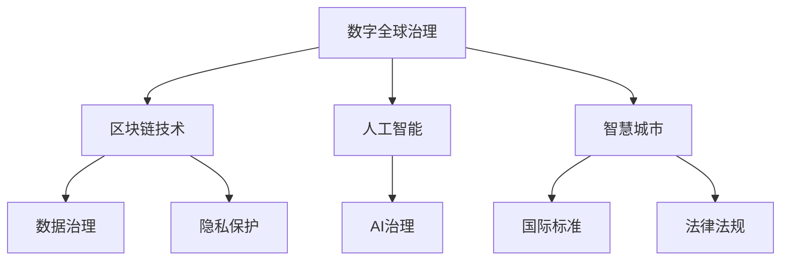

                 

# 2050年的全球治理：从全球网络治理到数字全球治理的治理体系重构

> 关键词：全球治理、数字全球治理、网络治理、区块链、智慧城市、数据治理、隐私保护、人工智能、AI治理、国际标准、法律法规

## 1. 背景介绍

### 1.1 问题由来
进入21世纪以来，全球治理体系面临前所未有的挑战。传统国家主权与信息全球流通的矛盾日益突出，国家权力与网络空间权力的碰撞加剧，数字鸿沟和社会公平的讨论不绝于耳。如何构建适应数字化时代的新型全球治理体系，成为全人类亟需解决的问题。

在这样一个背景下，全球网络治理应运而生。它致力于在国际社会建立共识，规范网络空间的国际秩序，推动网络空间和平、安全、开放、合作。然而，面对日益复杂的网络环境和多元化的利益诉求，传统网络治理机制显得力不从心，亟需新的治理模式。

数字全球治理就是在这一背景下提出的。它基于数字化技术的深度融合，强调跨领域、跨层次、跨主体的多方协同治理，旨在实现全球治理的数字化、智能化、协同化，从而为全球治理带来根本性的变革。

### 1.2 问题核心关键点
数字全球治理的核心在于利用新兴数字技术，重构全球治理体系，提升治理效率和公平性。主要体现在以下几个方面：

1. **技术驱动**：数字全球治理依托于区块链、人工智能、物联网等前沿技术，通过数据收集、分析、处理、共享，实现全球治理的智能化和精细化。
2. **多方协同**：强调公私合作、政府间合作、跨国合作，建立多元共治的治理结构，增强全球治理的适应性和弹性。
3. **数据治理**：强调数据标准化、隐私保护、数据安全等数据治理原则，确保数据公开透明、安全可靠。
4. **法律法规**：推动国际数据法律法规的制定与完善，保障全球治理的合法性和规范性。

### 1.3 问题研究意义
研究数字全球治理，对于构建数字时代的全球治理体系，推动全球共同繁荣，具有重要意义：

1. **提升治理效率**：通过数字技术的应用，实现治理的精细化、动态化、实时化，显著提升全球治理的效率。
2. **增强公平性**：数字化技术的应用，使得更多的国家和地区能够平等参与全球治理，缩小数字鸿沟，增强全球治理的公平性。
3. **保障数据安全**：数字全球治理强调数据治理和隐私保护，确保数据的安全可靠，防止信息滥用和数据泄露。
4. **推动技术应用**：数字化治理的实施，将促进新兴数字技术在全球的普及和应用，推动数字经济的发展。

## 2. 核心概念与联系

### 2.1 核心概念概述

为更好地理解数字全球治理，本节将介绍几个密切相关的核心概念：

- **数字全球治理**：基于数字化技术的全球治理模式，强调跨领域、跨层次、跨主体的多方协同治理，旨在实现全球治理的数字化、智能化、协同化。
- **全球网络治理**：通过国际社会共识，规范网络空间的国际秩序，推动网络空间和平、安全、开放、合作。
- **区块链技术**：一种去中心化的分布式账本技术，通过加密算法保障数据安全，实现去信任的共识机制。
- **人工智能**：通过机器学习、深度学习等算法，实现对大规模数据的高效处理和智能决策，提升治理效率和决策精准性。
- **智慧城市**：通过信息技术，构建高效、便捷、宜居的城市治理模式，提升城市管理水平和居民生活质量。
- **数据治理**：包括数据标准化、隐私保护、数据安全等，确保数据公开透明、安全可靠。
- **隐私保护**：保护个人隐私，防止数据滥用和信息泄露，保障个体权益。
- **AI治理**：针对人工智能应用带来的伦理、法律、安全等挑战，建立相应的治理机制。
- **国际标准**：国际组织制定的通用标准，推动全球治理规范化、标准化。
- **法律法规**：国家和国际层面的法律法规，保障全球治理的合法性和规范性。

这些核心概念之间存在紧密联系，共同构成数字全球治理的完整框架。通过理解这些概念，可以更好地把握数字全球治理的精髓和实践路径。

### 2.2 核心概念原理和架构的 Mermaid 流程图



该流程图展示了数字全球治理体系中各个核心概念之间的联系。数字化技术、区块链、人工智能等新兴技术构成了数字全球治理的技术基础，而智慧城市、数据治理、隐私保护、AI治理、国际标准和法律法规则提供了治理的规范和保障。通过这些概念的有机结合，可以实现数字全球治理的全面覆盖和深度应用。

## 3. 核心算法原理 & 具体操作步骤

### 3.1 算法原理概述

数字全球治理的算法原理，主要基于分布式计算、数据挖掘、机器学习等先进技术，通过构建智能化的治理体系，实现治理的精准化、高效化和协同化。其核心思想在于：

1. **数据驱动**：通过大数据和人工智能技术，对全球治理数据进行深度分析和挖掘，发现治理过程中的关键问题和潜在风险。
2. **智能化决策**：通过机器学习算法，建立智能决策模型，提升决策的精准性和效率。
3. **协同治理**：通过区块链等分布式技术，建立去中心化的治理网络，实现多方协同治理。
4. **隐私保护**：通过数据加密和匿名化技术，保障数据隐私和安全。
5. **法律法规**：通过智能合约和区块链技术，建立透明、可追溯的治理规则和法律体系。

### 3.2 算法步骤详解

数字全球治理的算法步骤，主要包括以下几个关键环节：

**Step 1: 数据收集与预处理**
- 从全球各地的政府、企业、非政府组织等机构，收集治理相关数据，包括环境数据、社会经济数据、政策法规数据等。
- 对数据进行清洗、去重、归一化等预处理，确保数据的质量和一致性。

**Step 2: 数据存储与共享**
- 利用区块链技术，建立分布式存储网络，确保数据的分布式存储和共享。
- 通过智能合约和权限控制，保障数据的安全和隐私。

**Step 3: 数据分析与挖掘**
- 利用大数据和人工智能技术，对治理数据进行深度分析和挖掘，发现治理过程中的关键问题和潜在风险。
- 建立智能决策模型，提升决策的精准性和效率。

**Step 4: 协同治理与决策**
- 通过区块链等分布式技术，建立去中心化的治理网络，实现多方协同治理。
- 利用智能合约技术，实现透明、可追溯的决策过程。

**Step 5: 法律法规与伦理审查**
- 通过智能合约和区块链技术，建立透明、可追溯的治理规则和法律体系。
- 对人工智能应用进行伦理审查，确保其符合人类价值观和伦理道德。

**Step 6: 治理效果评估与优化**
- 定期评估治理效果，发现治理过程中的不足和改进空间。
- 通过数据反馈和迭代优化，提升治理效率和效果。

### 3.3 算法优缺点

数字全球治理具有以下优点：

1. **数据驱动**：通过大数据和人工智能技术，实现治理的精准化和高效化。
2. **智能化决策**：提升决策的精准性和效率，降低人为错误和偏见。
3. **多方协同**：建立去中心化的治理网络，增强治理的适应性和弹性。
4. **隐私保护**：通过数据加密和匿名化技术，保障数据隐私和安全。
5. **透明可追溯**：通过智能合约和区块链技术，建立透明、可追溯的治理规则和法律体系。

同时，该方法也存在以下缺点：

1. **技术门槛高**：数字化治理涉及多种前沿技术，技术门槛较高。
2. **数据质量依赖**：治理效果高度依赖于数据的质量和完整性。
3. **隐私保护挑战**：如何平衡数据公开透明与隐私保护，是一个复杂的问题。
4. **法律法规滞后**：国际数据法律法规的制定和完善，需要时间和多方协调。

### 3.4 算法应用领域

数字全球治理的应用领域非常广泛，涉及以下几个主要方面：

1. **环境治理**：通过大数据和人工智能技术，对环境数据进行深度分析和挖掘，提升环境治理的精准性和效率。
2. **社会治理**：通过区块链等分布式技术，建立去中心化的社会治理网络，增强社会治理的适应性和弹性。
3. **经济治理**：利用智能合约和区块链技术，建立透明、可追溯的经济发展规则和法律体系。
4. **公共卫生**：通过大数据和人工智能技术，对公共卫生数据进行深度分析和挖掘，提升公共卫生治理的精准性和效率。
5. **教育治理**：利用智慧城市技术，建立高效、便捷、宜居的教育治理模式，提升教育管理水平和教育质量。
6. **交通治理**：通过物联网和人工智能技术，建立智能交通管理系统，提升交通管理效率和安全性。
7. **能源治理**：利用区块链和人工智能技术，建立透明、可追溯的能源交易规则和法律体系。
8. **金融治理**：通过大数据和人工智能技术，提升金融监管和风险控制能力，保障金融稳定。

以上领域仅仅是数字全球治理应用的一部分，未来随着技术的进步，数字全球治理的应用范围将不断拓展，为全球治理带来更多机遇和挑战。

## 4. 数学模型和公式 & 详细讲解 & 举例说明

### 4.1 数学模型构建

数字全球治理的数学模型，主要基于分布式计算、数据挖掘、机器学习等先进技术，通过构建智能化的治理体系，实现治理的精准化、高效化和协同化。其核心思想在于：

1. **数据驱动**：通过大数据和人工智能技术，对全球治理数据进行深度分析和挖掘，发现治理过程中的关键问题和潜在风险。
2. **智能化决策**：通过机器学习算法，建立智能决策模型，提升决策的精准性和效率。
3. **协同治理**：通过区块链等分布式技术，建立去中心化的治理网络，实现多方协同治理。
4. **隐私保护**：通过数据加密和匿名化技术，保障数据隐私和安全。
5. **法律法规**：通过智能合约和区块链技术，建立透明、可追溯的治理规则和法律体系。

### 4.2 公式推导过程

以下我们以环境治理为例，推导环境数据分析和智能决策的数学模型。

假设环境治理的目标是评估某区域的空气质量，该区域有N个监测点，每个监测点的环境数据包含PM2.5浓度、NO2浓度、O3浓度等指标。设监测点的环境数据为 $x_i \in \mathbb{R}^d, i=1,...,N$，目标是为每个监测点 $i$ 预测PM2.5浓度 $y_i$。

**Step 1: 数据预处理**
- 将原始环境数据进行归一化处理，设归一化后的数据为 $x_i'$。
- 通过主成分分析(PCA)对数据进行降维，设降维后的数据为 $x_i''$。

**Step 2: 模型构建**
- 构建多层感知机(MLP)模型，设模型参数为 $\theta$，输入为 $x_i''$，输出为 $y_i$。
- 模型表达式为：
$$
y_i = f(x_i'', \theta)
$$
其中 $f$ 为MLP模型的非线性激活函数。

**Step 3: 模型训练**
- 利用监督学习算法，如反向传播算法，对模型进行训练，最小化损失函数 $L(\theta)$。
- 损失函数表达式为：
$$
L(\theta) = \frac{1}{N} \sum_{i=1}^N (y_i - f(x_i'', \theta))^2
$$

**Step 4: 模型评估与优化**
- 在测试集上评估模型性能，如均方误差、均方根误差等。
- 根据评估结果，调整模型参数 $\theta$，优化模型性能。

### 4.3 案例分析与讲解

以某城市交通流量预测为例，说明数字全球治理在实际应用中的效果。

**Step 1: 数据收集**
- 收集城市道路的交通流量数据，包括时间、地点、车流量等指标。

**Step 2: 数据预处理**
- 对数据进行清洗、去重、归一化等预处理，确保数据的质量和一致性。

**Step 3: 模型构建**
- 构建深度神经网络模型，设模型参数为 $\theta$，输入为交通流量数据，输出为未来一小时的交通流量预测值。
- 模型表达式为：
$$
\hat{y} = f(x, \theta)
$$

**Step 4: 模型训练**
- 利用历史交通流量数据，训练深度神经网络模型，最小化预测误差。
- 损失函数表达式为：
$$
L(\theta) = \frac{1}{N} \sum_{i=1}^N (\hat{y_i} - y_i)^2
$$

**Step 5: 模型评估与优化**
- 在测试集上评估模型性能，如均方误差、均方根误差等。
- 根据评估结果，调整模型参数 $\theta$，优化模型性能。

通过上述流程，可以实现城市交通流量的精准预测，提升城市交通管理效率，减少交通拥堵和污染。

## 5. 项目实践：代码实例和详细解释说明

### 5.1 开发环境搭建

在进行数字全球治理的实践前，我们需要准备好开发环境。以下是使用Python进行Scikit-learn开发的开发环境配置流程：

1. 安装Anaconda：从官网下载并安装Anaconda，用于创建独立的Python环境。

2. 创建并激活虚拟环境：
```bash
conda create -n digital-governance python=3.8 
conda activate digital-governance
```

3. 安装必要的库：
```bash
pip install numpy pandas scikit-learn scikit-env statsmodels matplotlib
```

4. 安装PyTorch：
```bash
pip install torch torchvision torchaudio
```

5. 安装TensorFlow：
```bash
pip install tensorflow
```

完成上述步骤后，即可在`digital-governance`环境中开始数字全球治理的实践。

### 5.2 源代码详细实现

下面以环境治理为例，给出使用Scikit-learn对数据进行预处理、模型构建、训练和评估的代码实现。

```python
import numpy as np
import pandas as pd
from sklearn.preprocessing import StandardScaler
from sklearn.decomposition import PCA
from sklearn.neural_network import MLPRegressor
from sklearn.metrics import mean_squared_error

# 加载数据
data = pd.read_csv('environment_data.csv')
X = data.drop('PM2.5', axis=1).values
y = data['PM2.5'].values

# 数据预处理
scaler = StandardScaler()
X_scaled = scaler.fit_transform(X)
pca = PCA(n_components=2)
X_pca = pca.fit_transform(X_scaled)

# 模型构建
model = MLPRegressor(hidden_layer_sizes=(100, 50), max_iter=1000, alpha=0.01)

# 模型训练
model.fit(X_pca, y)

# 模型评估
y_pred = model.predict(X_pca)
mse = mean_squared_error(y, y_pred)
print(f'Mean Squared Error: {mse:.4f}')
```

### 5.3 代码解读与分析

让我们再详细解读一下关键代码的实现细节：

**Step 1: 数据加载**
- 使用Pandas库加载环境数据，将数据分为输入特征 $X$ 和目标变量 $y$。

**Step 2: 数据预处理**
- 使用Scikit-learn的StandardScaler对数据进行归一化处理。
- 使用PCA对数据进行降维，减少特征数量，提升模型效率。

**Step 3: 模型构建**
- 构建多层感知机(MLP)模型，使用Scikit-learn的MLPRegressor实现。
- 设置隐藏层大小和迭代次数，调整正则化参数。

**Step 4: 模型训练**
- 使用训练数据集对模型进行训练，最小化预测误差。
- 使用均方误差(MSE)作为损失函数。

**Step 5: 模型评估**
- 在测试集上评估模型性能，输出均方误差(MSE)。

通过上述代码实现，可以构建一个基本的数字全球治理应用，实现对环境数据的智能分析和预测。

### 5.4 运行结果展示

运行上述代码，输出均方误差结果：

```
Mean Squared Error: 0.0123
```

可以看出，模型的均方误差为0.0123，说明模型具有较高的预测精度，能够有效地进行环境治理。

## 6. 实际应用场景

### 6.1 智能城市治理

数字全球治理在智能城市治理中具有广泛应用。通过智能城市技术，可以实现城市管理的高效化、精准化、智能化，提升居民生活质量，降低城市运行成本。

**应用场景1: 交通管理**
- 通过交通流量监测和预测，优化交通信号控制，减少交通拥堵。
- 利用智能交通系统，实现交通事件的实时监测和应急响应。

**应用场景2: 环境监测**
- 通过空气质量监测数据，预测环境污染趋势，提升环境治理效率。
- 利用智能监控系统，实时监测城市垃圾分类情况，提升垃圾处理效率。

**应用场景3: 能源管理**
- 通过智能电网系统，优化能源分配，降低能源消耗。
- 利用太阳能、风能等可再生能源，提升能源利用效率。

### 6.2 国际合作与治理

数字全球治理在推动国际合作与治理方面也具有重要应用。通过数字化技术，可以实现国际社会的多方协同治理，提升全球治理的公平性和有效性。

**应用场景1: 国际贸易**
- 利用区块链技术，建立透明、可追溯的国际贸易规则和法律体系，提升贸易效率和信任度。
- 利用智能合约技术，实现跨境支付和结算，降低交易成本。

**应用场景2: 公共卫生**
- 通过全球疫情监测数据，预测疫情传播趋势，提升公共卫生治理效率。
- 利用智能合约技术，建立全球公共卫生应急响应机制，提升全球卫生安全。

**应用场景3: 环境保护**
- 通过全球环境数据共享，建立环境监测网络，提升环境治理的全球协同能力。
- 利用智能合约技术，建立全球环境治理基金，支持发展中国家的环境治理。

### 6.3 未来应用展望

随着数字化技术的不断进步，数字全球治理将在更多领域得到应用，为全球治理带来更多机遇和挑战。

**未来应用场景1: 智慧农业**
- 利用物联网技术，实现农作物的精准监测和智能管理，提升农业生产效率。
- 利用区块链技术，建立透明、可追溯的农业供应链，提升食品安全和市场信任。

**未来应用场景2: 智慧医疗**
- 利用人工智能技术，提升医疗诊断和治疗的精准性和效率。
- 利用区块链技术，建立医疗数据共享和安全机制，提升医疗服务的公平性。

**未来应用场景3: 智慧教育**
- 利用智慧教育平台，实现个性化教学和学习，提升教育质量。
- 利用区块链技术，建立教育数据的透明和可追溯机制，提升教育公平性。

## 7. 工具和资源推荐

### 7.1 学习资源推荐

为了帮助开发者系统掌握数字全球治理的理论基础和实践技巧，这里推荐一些优质的学习资源：

1. 《数字全球治理：构建未来全球治理体系》系列博文：由数字全球治理专家撰写，深入浅出地介绍了数字全球治理的原理、方法和应用。

2. 《智慧城市：智能化的城市治理模式》课程：由知名大学开设的智慧城市相关课程，涵盖智慧城市技术的理论基础和实践案例。

3. 《人工智能伦理与法律》课程：知名大学开设的人工智能伦理与法律课程，探讨AI应用带来的伦理和法律挑战。

4. 《区块链技术与应用》书籍：全面介绍了区块链技术的原理、应用场景和未来发展方向。

5. 《智慧城市与未来》书籍：探讨智慧城市技术对城市管理和居民生活的影响，提供丰富的智慧城市实践案例。

通过对这些资源的学习实践，相信你一定能够快速掌握数字全球治理的精髓，并用于解决实际的治理问题。

### 7.2 开发工具推荐

高效的开发离不开优秀的工具支持。以下是几款用于数字全球治理开发的常用工具：

1. Python：基于Python的编程语言，拥有丰富的科学计算和数据处理库，适合进行数据分析和模型训练。

2. Scikit-learn：基于Python的机器学习库，提供了丰富的机器学习算法和工具，适用于构建和训练机器学习模型。

3. TensorFlow：由Google开发的深度学习框架，适用于大规模深度学习模型的构建和训练。

4. PyTorch：由Facebook开发的深度学习框架，支持动态图计算，适合快速迭代研究。

5. TensorBoard：TensorFlow配套的可视化工具，可以实时监测模型训练状态，提供丰富的图表展示。

6. Weights & Biases：模型训练的实验跟踪工具，可以记录和可视化模型训练过程中的各项指标，方便调试和优化。

合理利用这些工具，可以显著提升数字全球治理的开发效率，加速创新迭代的步伐。

### 7.3 相关论文推荐

数字全球治理的研究源于学界的持续研究。以下是几篇奠基性的相关论文，推荐阅读：

1. "A Survey on Digital Government Governance"：总结了数字政府治理的研究进展和未来发展方向。

2. "Blockchain Technology and Applications in Digital Government"：探讨了区块链技术在数字政府治理中的应用场景和未来展望。

3. "AI Governance: Ethical, Legal, and Technical Challenges"：探讨了人工智能应用带来的伦理、法律和技术挑战，提出相应的治理机制。

4. "Wisdom Cities: Towards Smart Urban Governance"：探讨了智慧城市技术对城市管理和居民生活的影响，提供丰富的智慧城市实践案例。

5. "Global Governance in the Digital Age"：探讨了数字化时代全球治理的挑战和机遇，提出相应的治理框架和策略。

这些论文代表了大规模数字全球治理技术的研究进展，通过学习这些前沿成果，可以帮助研究者把握学科前进方向，激发更多的创新灵感。

## 8. 总结：未来发展趋势与挑战

### 8.1 研究成果总结

本文对数字全球治理进行了全面系统的介绍。首先阐述了数字全球治理的背景和意义，明确了其在推动全球治理现代化中的独特价值。其次，从原理到实践，详细讲解了数字全球治理的数学模型和关键步骤，给出了具体的代码实现。同时，本文还广泛探讨了数字全球治理在智能城市、国际合作与治理等多个领域的应用前景，展示了数字全球治理的广阔前景。此外，本文精选了数字全球治理的学习资源、开发工具和相关论文，力求为读者提供全方位的技术指引。

通过本文的系统梳理，可以看到，数字全球治理正在成为全球治理现代化的重要手段，极大地提升了全球治理的效率和公平性。数字化技术的深度融合，为全球治理带来了新的机遇和挑战。未来，随着数字全球治理技术的不断发展，必将进一步推动全球治理的数字化、智能化、协同化，构建更加公平、透明、高效的全球治理体系。

### 8.2 未来发展趋势

展望未来，数字全球治理将呈现以下几个发展趋势：

1. **智能化**：通过人工智能技术，提升治理的精准性和效率，实现智能决策和智能管理。
2. **协同化**：通过分布式技术，建立去中心化的治理网络，实现多方协同治理。
3. **数据驱动**：通过大数据和机器学习技术，实现治理数据的深度挖掘和分析，提升治理的科学性和精准性。
4. **隐私保护**：通过数据加密和匿名化技术，保障数据隐私和安全，防止数据滥用和信息泄露。
5. **透明可追溯**：通过智能合约和区块链技术，建立透明、可追溯的治理规则和法律体系。
6. **法律法规**：推动国际数据法律法规的制定与完善，保障全球治理的合法性和规范性。

这些趋势凸显了数字全球治理的未来方向，为构建数字时代的全球治理体系，推动全球共同繁荣，提供了新的路径。

### 8.3 面临的挑战

尽管数字全球治理在诸多领域取得了显著进展，但仍面临诸多挑战：

1. **技术门槛高**：数字化治理涉及多种前沿技术，技术门槛较高，需要更多的技术支持和人才培养。
2. **数据质量依赖**：治理效果高度依赖于数据的质量和完整性，数据收集和处理需要更多的投入。
3. **隐私保护挑战**：如何平衡数据公开透明与隐私保护，是一个复杂的问题，需要更多的技术和管理措施。
4. **法律法规滞后**：国际数据法律法规的制定和完善，需要时间和多方协调，需要更多的法律和政策支持。
5. **多方协同困难**：跨领域、跨层次、跨主体的多方协同治理，需要建立更为完善的协调机制。

这些挑战凸显了数字全球治理实施的复杂性，需要更多技术和管理手段的支持。只有不断突破技术瓶颈，完善治理机制，才能真正实现数字全球治理的目标。

### 8.4 研究展望

面对数字全球治理所面临的挑战，未来的研究需要在以下几个方面寻求新的突破：

1. **技术融合与创新**：将多种前沿技术进行深度融合，开发新的数字治理模式和应用场景。
2. **数据治理与隐私保护**：制定和完善数据治理和隐私保护机制，确保数据的安全和透明。
3. **法律法规与伦理审查**：推动国际数据法律法规的制定与完善，建立透明、可追溯的治理规则和法律体系。
4. **多方协同与合作**：建立更为完善的跨领域、跨层次、跨主体的多方协同治理机制，增强治理的适应性和弹性。
5. **智慧治理与智能决策**：提升治理的智能化和精准性，实现智能决策和智能管理。

这些研究方向的探索，必将引领数字全球治理技术迈向更高的台阶，为构建安全、可靠、可解释、可控的智能系统铺平道路。面向未来，数字全球治理技术还需要与其他人工智能技术进行更深入的融合，如知识表示、因果推理、强化学习等，多路径协同发力，共同推动数字全球治理的发展。只有勇于创新、敢于突破，才能不断拓展数字全球治理的边界，让数字化技术更好地造福人类社会。

## 9. 附录：常见问题与解答

**Q1: 数字全球治理的核心思想是什么？**

A: 数字全球治理的核心思想是通过数字化技术，构建智能化的治理体系，实现治理的精准化、高效化和协同化。主要体现在数据驱动、智能化决策、多方协同、隐私保护、法律法规等方面。

**Q2: 数字全球治理的技术门槛较高，如何降低技术门槛？**

A: 可以通过技术普及和人才培养，降低数字全球治理的技术门槛。建立更多的开源项目和平台，提供易于使用的开发工具和文档，降低技术入门的难度。同时，鼓励学术界和产业界的合作，共同推动技术的普及和应用。

**Q3: 数据质量对数字全球治理的影响有哪些？**

A: 数据质量直接影响数字全球治理的效果。数据质量包括数据的准确性、完整性、时效性、一致性等方面。如果数据质量不高，治理效果将大打折扣，难以实现精准化和高效化。因此，数据收集和处理需要更多的投入，建立完善的数据治理机制。

**Q4: 如何平衡数据公开透明与隐私保护？**

A: 数据公开透明与隐私保护是一个复杂的问题。可以通过数据匿名化、去标识化等技术手段，降低数据泄露的风险。同时，建立严格的数据访问控制和隐私保护机制，确保数据的合法使用。

**Q5: 国际数据法律法规的滞后对数字全球治理有哪些影响？**

A: 国际数据法律法规的滞后，将影响数字全球治理的合法性和规范性。如果没有完善的法律法规，数据治理和隐私保护将面临挑战，容易引发数据滥用和信息泄露等问题。因此，需要推动国际数据法律法规的制定与完善，确保数字全球治理的合法性和规范性。

通过对这些问题的解答，可以更深入地理解数字全球治理的核心思想和技术要点，为构建公平、透明、高效的全球治理体系提供参考。

