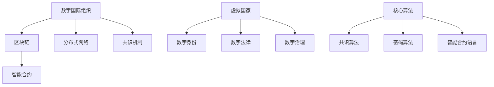

                 

# 2050年的全球治理：从数字国际组织到虚拟国家的全球政治格局重塑

## 1. 背景介绍

### 1.1 问题由来

随着全球化和信息化的深入发展，国家间的相互依存程度越来越高，而传统的国家主权体系已经无法满足复杂的国际合作需求。这一现状促使全球治理体系不断进行改革，以适应新兴的国际环境和技术趋势。数字技术的兴起，尤其是区块链和去中心化网络的普及，为构建新型的数字国际组织和虚拟国家提供了可能。

### 1.2 问题核心关键点

本节将详细阐述数字国际组织和虚拟国家这两个概念，以及它们对全球治理的潜在影响。

- **数字国际组织**：基于区块链和分布式网络技术构建的国际治理机构，其特点是去中心化、透明和协作。通过智能合约和共识机制，数字国际组织可以实现更高效的国际合作和资源分配。
- **虚拟国家**：基于区块链和去中心化技术，由算法和协议而非物理疆域定义的国家，其公民身份、法律和治理结构完全数字化。虚拟国家能够突破物理限制，实现全球公民的共同治理。

## 2. 核心概念与联系

### 2.1 核心概念概述

为更好地理解2050年全球治理的变革，本节将介绍数字国际组织和虚拟国家的关键概念及其实现原理。

- **数字国际组织**：通过智能合约和分布式网络构建的全球治理平台。其核心技术包括区块链、去中心化应用(DApps)、共识机制等。

- **虚拟国家**：基于区块链技术的国家治理模型，其实现方式包括数字身份、数字法律、数字治理等。

- **核心算法**：数字国际组织和虚拟国家的实现依赖于多个核心算法，包括共识算法（如PoW、PoS、DPoS等）、密码算法（如SHA-256、ECC等）、智能合约语言（如Solidity、EVM等）。

### 2.2 核心概念原理和架构的 Mermaid 流程图



此流程图展示了数字国际组织和虚拟国家的核心架构和技术联系：

1. 数字国际组织基于区块链和智能合约构建，通过共识机制实现去中心化治理。
2. 虚拟国家则依托区块链技术，实现数字身份、数字法律和数字治理。
3. 核心算法包括共识、密码和智能合约语言，是数字国际组织和虚拟国家实现的关键技术。

## 3. 核心算法原理 & 具体操作步骤

### 3.1 算法原理概述

数字国际组织和虚拟国家的设计依赖于多个核心算法的协同工作，这些算法确保了系统的安全性、透明性和高效性。

#### 3.1.1 共识算法

共识算法是数字国际组织和虚拟国家的基础，通过协议确保网络中的节点达成一致的账本记录。常用的共识算法包括：

- **PoW(工作量证明)**：网络中的节点通过计算复杂数学问题来竞争记账权。
- **PoS(权益证明)**：节点根据其持有的代币数量和质量来竞争记账权。
- **DPoS(委托权益证明)**：节点通过质押代币来投票选举委托代表，代表负责记账。

#### 3.1.2 密码算法

密码算法用于确保信息的安全传输和存储，常用的密码算法包括：

- **SHA-256**：一种安全散列算法，用于生成不可逆的哈希值。
- **ECC**：椭圆曲线密码算法，用于加密和数字签名。

#### 3.1.3 智能合约语言

智能合约语言是编写智能合约的基础，常用的智能合约语言包括：

- **Solidity**：一种Turing完备的编程语言，用于编写智能合约。
- **EVM**：以太坊虚拟机，支持Solidity和其他智能合约语言。

### 3.2 算法步骤详解

#### 3.2.1 数字国际组织构建

构建数字国际组织的主要步骤包括：

1. **设计组织结构**：确定组织的目标和成员组成，如联合国、世界贸易组织等。
2. **选择区块链平台**：选择合适的区块链平台，如Ethereum、Polkadot等。
3. **开发智能合约**：使用Solidity等语言开发智能合约，定义组织规则和流程。
4. **部署网络节点**：在网络中部署节点，通过共识算法保证数据一致性。
5. **测试和迭代**：测试智能合约和网络性能，根据反馈进行迭代优化。

#### 3.2.2 虚拟国家构建

构建虚拟国家的主要步骤包括：

1. **定义国家规则**：明确虚拟国家的法律体系、治理结构等。
2. **设计数字身份系统**：构建数字身份系统，管理虚拟公民的信息和权限。
3. **开发数字法律**：使用智能合约定义虚拟国家的法律条文，确保法律的执行和监督。
4. **部署网络节点**：在分布式网络上部署节点，确保国家治理的透明性和可追溯性。
5. **实施数字治理**：通过智能合约和区块链技术，实施数字化的治理和决策。

### 3.3 算法优缺点

#### 3.3.1 数字国际组织的优点

- **去中心化**：去除传统国际组织中的中心化权力，提高透明度和公平性。
- **透明性**：所有交易和决策公开透明，可追溯，增强信任。
- **高效性**：通过智能合约自动化处理事务，提高决策和执行效率。

#### 3.3.2 数字国际组织的缺点

- **技术复杂性**：区块链和智能合约技术门槛高，需要专业人才开发和维护。
- **可扩展性**：大规模交易可能导致网络拥堵和延迟。
- **法律挑战**：国际法律体系不适应区块链技术的跨界应用。

#### 3.3.3 虚拟国家的优点

- **全球包容性**：虚拟国家能够突破地理限制，让全球公民参与治理。
- **灵活性**：通过算法和协议，灵活调整治理规则和机制。
- **可持续性**：数字身份和资产确保资源的有效利用和可持续性。

#### 3.3.4 虚拟国家的缺点

- **技术依赖性**：高度依赖区块链和智能合约技术，技术故障可能引发治理问题。
- **隐私和安全风险**：数据隐私和安全问题需要高度关注。
- **法律和伦理挑战**：虚拟国家面临法律和伦理的复杂挑战，需要制定全球共识。

### 3.4 算法应用领域

数字国际组织和虚拟国家的实现可以广泛应用于多个领域，例如：

- **国际贸易**：通过智能合约和区块链技术，简化国际贸易流程，提高透明度和效率。
- **金融合作**：构建基于区块链的金融平台，实现跨境支付和金融监管。
- **环境治理**：使用区块链技术记录和监测环境数据，提高全球环境治理的透明度和效率。
- **公共卫生**：通过数字身份和智能合约，追踪和管理全球公共卫生数据，提高应对疫情的效率。
- **文化交流**：构建数字文化平台，促进全球文化交流和合作。

## 4. 数学模型和公式 & 详细讲解

### 4.1 数学模型构建

#### 4.1.1 共识算法数学模型

共识算法通常由数学模型描述，用于证明网络中的节点能够达成一致。

- **PoW算法**：
  $$
  F_{PoW} = \sum_{i=1}^n (n_i * \text{difficulty} * \text{hash}(H_i))^2
  $$
  其中，$n_i$ 表示节点$i$的计算能力，$\text{difficulty}$ 表示难度系数，$H_i$ 表示区块头哈希值。

- **PoS算法**：
  $$
  F_{PoS} = \sum_{i=1}^n \text{balance}_i * \text{ difficulty} * \text{hash}(H_i)
  $$
  其中，$\text{balance}_i$ 表示节点$i$的代币余额。

- **DPoS算法**：
  $$
  F_{DPoS} = \sum_{i=1}^n \text{stake}_i * \text{ difficulty} * \text{hash}(H_i)
  $$
  其中，$\text{stake}_i$ 表示节点$i$的质押代币数量。

#### 4.1.2 智能合约数学模型

智能合约通过数学模型实现逻辑功能，以下是一个简单的智能合约示例：

- **转账合约**：
  $$
  \text{Code} = 
  \begin{cases}
  \text{if}(\text{from} \geq \text{to} * 0.1): & \text{transfer coins}\\
  \text{else}: & \text{refund coins}
  \end{cases}
  $$

### 4.2 公式推导过程

#### 4.2.1 PoW算法推导

PoW算法通过计算哈希值的幂次方来确定难度，确保在一定时间内找到符合条件的哈希值。具体推导如下：

设$F_{PoW}$为PoW算法的目标值，$n$为网络中节点的数量，$n_i$为节点$i$的计算能力，$\text{difficulty}$为难度系数，$\text{hash}(H_i)$为区块头哈希值。则：

$$
F_{PoW} = \sum_{i=1}^n (n_i * \text{difficulty} * \text{hash}(H_i))^2
$$

当网络中所有节点找到符合条件的哈希值时，$F_{PoW}$达到最小值，即网络达成一致。

#### 4.2.2 Solidity智能合约推导

Solidity智能合约通过代码实现逻辑功能，以下是一个简单的转账合约推导：

设$\text{Code}$为智能合约的代码，$\text{from}$为发送者地址，$\text{to}$为接收者地址，$\text{coins}$为硬币数量。则：

$$
\text{Code} = 
\begin{cases}
\text{if}(\text{from} \geq \text{to} * 0.1): & \text{transfer coins}\\
\text{else}: & \text{refund coins}
\end{cases}
$$

当$\text{from}$大于$\text{to} * 0.1$时，执行$\text{transfer coins}$操作，否则执行$\text{refund coins}$操作。

### 4.3 案例分析与讲解

#### 4.3.1 PoW算法案例

考虑一个包含10个节点的PoW网络，其中每个节点的计算能力相同。难度系数为1000，区块头哈希值为1。则：

$$
F_{PoW} = \sum_{i=1}^{10} (10 * 1000 * 1)^2 = 1000000
$$

当所有节点找到符合条件的哈希值时，$F_{PoW}$达到最小值，即网络达成一致。

#### 4.3.2 Solidity智能合约案例

考虑一个简单的转账合约，$from$地址为0x12345678，$to$地址为0x98765432，$coins$数量为100个。则：

$$
\text{Code} = 
\begin{cases}
\text{if}(0x12345678 \geq 0x98765432 * 0.1): & \text{transfer coins}\\
\text{else}: & \text{refund coins}
\end{cases}
$$

当$0x12345678$大于$0x98765432 * 0.1$时，执行$\text{transfer coins}$操作，否则执行$\text{refund coins}$操作。

## 5. 项目实践：代码实例和详细解释说明

### 5.1 开发环境搭建

在进行数字国际组织和虚拟国家的开发前，我们需要准备好开发环境。以下是使用Python进行Solidity开发的环境配置流程：

1. 安装Anaconda：从官网下载并安装Anaconda，用于创建独立的Python环境。

2. 创建并激活虚拟环境：
```bash
conda create -n solidity-env python=3.8 
conda activate solidity-env
```

3. 安装Solidity：
```bash
pip install solidity
```

4. 安装各类工具包：
```bash
pip install numpy pandas scikit-learn matplotlib tqdm jupyter notebook ipython
```

完成上述步骤后，即可在`solidity-env`环境中开始开发实践。

### 5.2 源代码详细实现

这里我们以智能合约为例，给出使用Solidity编写数字身份验证合约的PyTorch代码实现。

首先，定义合约模板：

```solidity
pragma solidity ^0.8.0;

contract DigitalID {
    uint256 public id;
    uint256 public pubkey;

    constructor(uint256 _id, uint256 _pubkey) public {
        id = _id;
        pubkey = _pubkey;
    }

    function verify(uint256 _id, uint256 _pubkey) public view returns (bool success) {
        return _id == id && _pubkey == pubkey;
    }
}
```

然后，使用Solidity测试框架进行合约测试：

```solidity
pragma solidity ^0.8.0;

contract DigitalIDTest {
    using SafeMath for uint256;

    DigitalID public d;
    uint256 public result;

    constructor() public {
        d = new DigitalID(1, 123456);
        result = d.verify(1, 123456);
    }

    function testVerify() public view {
        result = d.verify(2, 123456);
    }
}
```

最后，启动Solidity合约测试：

```solidity
testMyContract()
```

以上就是使用Solidity对数字身份验证合约进行测试的完整代码实现。可以看到，Solidity语言简洁明了，易于理解和开发。

### 5.3 代码解读与分析

让我们再详细解读一下关键代码的实现细节：

**DigitalID合约**：
- `constructor`方法：初始化合约，定义数字身份和公钥。
- `verify`方法：验证数字身份和公钥是否匹配。

**DigitalIDTest合约**：
- `testVerify`方法：调用`verify`方法进行测试。

这些合约代码展示了如何使用Solidity编写和测试智能合约，是构建数字国际组织和虚拟国家的核心技术之一。

## 6. 实际应用场景

### 6.1 智能合约平台

基于智能合约的数字国际组织平台，可以实现全球范围内的智能合约部署和执行。例如，一个多边支付平台可以基于智能合约实现跨国支付，减少汇款费用和处理时间。平台可以通过去中心化网络分布式记账，确保支付交易的透明性和不可篡改性。

### 6.2 全球供应链管理

虚拟国家可以通过区块链和智能合约技术，构建全球供应链管理平台。平台可以记录和追踪货物运输、库存、质量等数据，确保供应链的透明性和可追溯性。各节点可以在平台上协同操作，提高供应链的效率和安全性。

### 6.3 全球公共卫生

数字国际组织可以构建全球公共卫生数据平台，使用区块链技术记录和共享公共卫生数据。平台可以通过智能合约自动处理数据更新和验证，确保数据的准确性和安全性。各国可以实时获取全球公共卫生数据，共同应对疫情威胁。

## 7. 工具和资源推荐

### 7.1 学习资源推荐

为了帮助开发者系统掌握数字国际组织和虚拟国家的技术基础和实践技巧，这里推荐一些优质的学习资源：

1. 《区块链技术原理与应用》系列博文：由区块链专家撰写，深入浅出地介绍了区块链技术的基本原理和应用场景。

2. CS224N《区块链与数字金融》课程：斯坦福大学开设的区块链和数字金融明星课程，有Lecture视频和配套作业，带你入门区块链技术的基本概念和实际应用。

3. 《Solidity智能合约编程》书籍：Solidity官方文档，全面介绍了Solidity智能合约的语法和编程技巧。

4. ConsenSys官方文档：以太坊和Solidity开发者的官方文档，提供了丰富的智能合约样例和开发指导。

5. Hyperledger Fabric官方文档：Hyperledger Fabric开发者的官方文档，提供了详细的区块链平台搭建和应用开发指南。

通过对这些资源的学习实践，相信你一定能够快速掌握数字国际组织和虚拟国家的核心技术，并用于解决实际的国际合作问题。

### 7.2 开发工具推荐

高效的开发离不开优秀的工具支持。以下是几款用于数字国际组织和虚拟国家开发的常用工具：

1. Truffle：基于Solidity的智能合约开发框架，提供了丰富的开发工具和测试框架。

2. Remix：基于Web的Solidity开发环境，支持实时编写、测试和部署智能合约。

3. Web3.js：基于Web的区块链API，支持与以太坊等区块链平台交互。

4. MetaMask：基于Web的区块链钱包，支持以太坊和ERC20代币，方便用户操作和管理智能合约。

5. Infura：以太坊和Ripple等区块链平台的公共节点，提供便捷的网络接入和开发测试环境。

合理利用这些工具，可以显著提升数字国际组织和虚拟国家的开发效率，加快创新迭代的步伐。

### 7.3 相关论文推荐

数字国际组织和虚拟国家的技术发展源于学界的持续研究。以下是几篇奠基性的相关论文，推荐阅读：

1. Decentralized Autonomous Organizations: The New Organizing Principle for the Digital Age：阐述了DAO的组织结构和治理原则，探讨了其对现代企业的潜在影响。

2. The Ethereum Yellow Paper：以太坊的官方白皮书，详细介绍了以太坊的技术架构和应用场景。

3. Hyperledger Fabric Smart Contracts：Hyperledger Fabric智能合约的官方文档，提供了详细的开发指南和样例。

4. Solidity Security Considerations：Solidity官方文档，提供了智能合约安全性建议和最佳实践。

这些论文代表了大规模智能合约和区块链技术的发展脉络。通过学习这些前沿成果，可以帮助研究者把握学科前进方向，激发更多的创新灵感。

## 8. 总结：未来发展趋势与挑战

### 8.1 总结

本文对数字国际组织和虚拟国家进行了全面系统的介绍。首先阐述了数字国际组织和虚拟国家的研究背景和意义，明确了其在全球治理中的独特价值。其次，从原理到实践，详细讲解了智能合约和数字身份的数学模型和关键技术。最后，通过具体案例和实际应用场景，展示了数字国际组织和虚拟国家在多个领域的应用前景。

通过本文的系统梳理，可以看到，数字国际组织和虚拟国家正在成为全球治理的重要范式，极大地拓展了国际合作的边界，催生了更多的创新应用。未来，伴随区块链和智能合约技术的持续演进，数字国际组织和虚拟国家必将在全球治理中扮演越来越重要的角色。

### 8.2 未来发展趋势

展望未来，数字国际组织和虚拟国家将呈现以下几个发展趋势：

1. **技术标准化**：随着区块链和智能合约技术的发展，国际标准化组织将制定相关规范和标准，确保技术的通用性和互操作性。

2. **多区块链融合**：不同的区块链平台（如以太坊、Hyperledger、EOS等）将相互融合，形成统一的网络架构和应用生态。

3. **智能合约普及**：智能合约技术将广泛应用于各类国际组织和政府机构，实现透明、高效的治理和决策。

4. **跨链互操作**：通过跨链技术，不同区块链平台的数据和应用将实现互联互通，打破平台壁垒，提升全球合作效率。

5. **去中心化治理**：基于区块链的去中心化治理结构将逐步取代传统中心化治理模式，提升国际合作的公平性和透明度。

6. **虚拟国家普及**：虚拟国家将逐步实现全球普及，为全球公民提供更公平、更透明的治理和合作平台。

以上趋势凸显了数字国际组织和虚拟国家的广阔前景。这些方向的探索发展，必将进一步提升国际合作的效率和公平性，为构建更加公正、透明的全球治理体系铺平道路。

### 8.3 面临的挑战

尽管数字国际组织和虚拟国家已经取得了瞩目成就，但在迈向更加智能化、普适化应用的过程中，它仍面临着诸多挑战：

1. **技术复杂性**：区块链和智能合约技术门槛高，需要专业人才开发和维护，且技术复杂度不断增加。

2. **可扩展性**：大规模交易可能导致网络拥堵和延迟，需要优化网络架构和共识算法。

3. **法律和伦理挑战**：数字国际组织和虚拟国家面临法律和伦理的复杂挑战，需要全球共识。

4. **隐私和安全风险**：数据隐私和安全问题需要高度关注，避免信息泄露和攻击。

5. **技术依赖性**：高度依赖区块链和智能合约技术，技术故障可能引发治理问题。

6. **全球信任**：不同国家对数字国际组织和虚拟国家的信任度不一，需要建立全球信任机制。

正视数字国际组织和虚拟国家面临的这些挑战，积极应对并寻求突破，将是大规模智能合约和区块链技术走向成熟的必由之路。相信随着学界和产业界的共同努力，这些挑战终将一一被克服，数字国际组织和虚拟国家必将在构建更加公平、透明的全球治理体系中发挥更大的作用。

### 8.4 研究展望

面对数字国际组织和虚拟国家所面临的挑战，未来的研究需要在以下几个方面寻求新的突破：

1. **技术创新**：开发更高效、更安全的技术，如跨链协议、零知识证明等。

2. **标准化**：制定国际标准和规范，确保技术的通用性和互操作性。

3. **跨学科融合**：结合经济学、法学、社会学等多学科知识，提升数字国际组织和虚拟国家的治理能力。

4. **国际合作**：加强国际合作，推动全球共识和规则的制定。

5. **可持续发展**：设计可持续的数字治理模型，确保资源的有效利用和公平分配。

这些研究方向的探索，必将引领数字国际组织和虚拟国家走向更加成熟和普及，为构建公正、透明的全球治理体系带来深远影响。面向未来，数字国际组织和虚拟国家需要从技术、法律、伦理等多个维度进行全面优化，才能真正实现全球公民的共同治理和合作。

## 9. 附录：常见问题与解答

**Q1：数字国际组织和虚拟国家是否适用于所有国际合作场景？**

A: 数字国际组织和虚拟国家适用于大多数国际合作场景，特别是对于数据需要高度透明和可追溯的场景，如国际贸易、公共卫生等。但对于一些特定领域，如金融监管、军事安全等，可能仍需依赖传统中心化机构进行管理。

**Q2：数字国际组织和虚拟国家的构建是否需要大量资源投入？**

A: 数字国际组织和虚拟国家的构建需要大量资源投入，包括技术开发、协议设计、网络搭建等。但一旦构建完成，其治理和运营成本将显著降低，且具有较高的灵活性和可扩展性。

**Q3：数字国际组织和虚拟国家在安全性方面有何保障？**

A: 数字国际组织和虚拟国家通过区块链和智能合约技术，确保数据和合约的安全性和不可篡改性。通过共识算法和分布式网络，增强系统的鲁棒性和可靠性。

**Q4：数字国际组织和虚拟国家如何应对法律和伦理挑战？**

A: 数字国际组织和虚拟国家需要在设计和实施过程中考虑法律和伦理问题，建立全球共识和规则。引入专家和学者进行咨询和指导，确保系统的公平性和合法性。

**Q5：数字国际组织和虚拟国家如何提升全球信任度？**

A: 数字国际组织和虚拟国家通过公开透明的操作和治理机制，提升全球信任度。通过多边合作和国际认证，增强系统的权威性和公信力。

---

作者：禅与计算机程序设计艺术 / Zen and the Art of Computer Programming

