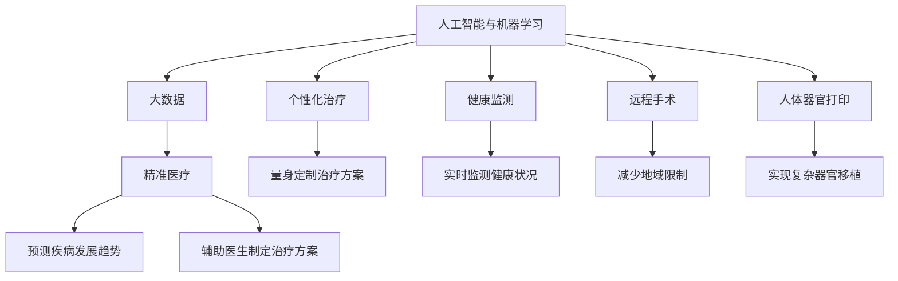

                 

# 2050年的医疗健康：从远程手术到人体器官打印的智能医疗

> 关键词：
  - 智能医疗
  - 远程手术
  - 人体器官打印
  - 人工智能
  - 机器学习
  - 大数据
  - 精准医疗
  - 个性化治疗
  - 健康监测
  - 医疗预测

## 1. 背景介绍

### 1.1 问题的由来

在科技迅猛发展的今天，医疗健康行业正经历着一场前所未有的变革。随着人工智能、机器学习、大数据等先进技术的不断应用，传统的医疗模式正在被重新定义。从智能诊断到个性化治疗，从远程手术到器官打印，新技术正逐步改变医疗行业的面貌，让患者享受到更高质量的医疗服务。

这一变革的起点可以追溯到20世纪末21世纪初，人工智能和大数据技术的兴起。最初，这些技术主要用于医学影像分析、病历记录整理等领域。但随着时间的推移，它们逐渐渗透到更广泛的医疗应用中，如预测疾病发展趋势、辅助医生制定治疗方案等。

### 1.2 核心概念

1. **人工智能与机器学习**：人工智能(AI)和机器学习(ML)是实现智能医疗的关键技术。AI包括搜索算法、自然语言处理(NLP)、计算机视觉(CV)等，而ML则包括监督学习、无监督学习、强化学习等。

2. **大数据**：医疗数据的大规模收集、存储和处理，为智能医疗提供了重要基础。大数据分析可以发现疾病模式、优化诊疗流程、提高诊断精度等。

3. **精准医疗**：利用基因组学、蛋白质组学等现代生物学技术，结合人工智能和大数据分析，实现对疾病进行精准诊断和个性化治疗。

4. **个性化治疗**：针对每个患者的独特需求和基因特征，设计最适合的治疗方案，提高治疗效果和患者满意度。

5. **健康监测**：通过可穿戴设备、传感器等技术，实时监测患者的健康状况，预防疾病发生。

6. **远程手术**：通过机器人技术，医生可以在远程地点对患者进行手术操作，减少地域限制，提高医疗资源利用效率。

7. **人体器官打印**：利用生物3D打印技术，根据患者需求，打印出个性化的组织和器官，实现复杂的器官移植和重建。

这些概念之间的逻辑关系可以通过以下Mermaid流程图来展示：



## 2. 核心概念与联系

### 2.1 核心概念概述

智能医疗是一个复杂的系统工程，涉及多个核心概念及其之间的相互关系。本节将详细讲解这些概念的原理和架构。

### 2.2 核心概念联系的 Mermaid 流程图


## 3. 核心算法原理 & 具体操作步骤

### 3.1 算法原理概述

智能医疗的核心算法主要包括以下几个方面：

1. **图像识别与分析**：利用计算机视觉技术，对医学影像进行自动分析和诊断。例如，通过深度学习算法，自动识别肿瘤、病变等异常区域。

2. **自然语言处理**：利用NLP技术，自动解析病历记录、临床报告等文本数据，提取有价值的信息。例如，通过情感分析，评估患者的情绪状态，辅助医生判断病情。

3. **预测与建模**：利用机器学习模型，对疾病发展趋势进行预测，评估治疗效果等。例如，通过时间序列分析，预测病情恶化可能性。

4. **推荐系统**：利用推荐算法，为医生和患者推荐最合适的治疗方案、药物等。例如，通过协同过滤算法，推荐个性化治疗方案。

5. **路径优化**：利用优化算法，优化诊疗流程，提高医疗效率。例如，通过蚁群算法，优化手术路径。

6. **智能辅助决策**：利用智能决策系统，辅助医生进行复杂决策。例如，通过贝叶斯网络，推荐最优治疗路径。

7. **机器人和自动化**：利用机器人技术，实现远程手术等操作。例如，通过手术机器人，完成微创手术。

8. **3D打印与生物工程**：利用生物3D打印技术，实现人体器官的打印和修复。例如，通过生物打印，打印出个性化器官。

### 3.2 算法步骤详解

#### 3.2.1 图像识别与分析

1. **数据采集**：收集医学影像数据，包括CT、MRI、X光等。

2. **数据预处理**：对影像数据进行预处理，包括去噪、归一化等。

3. **特征提取**：利用卷积神经网络(CNN)等模型，提取影像中的特征。

4. **分类与标注**：利用分类器，对影像进行分类和标注。例如，识别肿瘤、病变等异常区域。

5. **结果验证**：对分类结果进行验证，确保准确率。

#### 3.2.2 自然语言处理

1. **文本预处理**：对病历记录、临床报告等文本数据进行预处理，包括分词、去除停用词等。

2. **信息提取**：利用NLP技术，提取有价值的信息。例如，通过实体识别，提取疾病名称、药品名称等。

3. **情感分析**：利用情感分析技术，评估患者的情绪状态。

4. **信息整合**：将提取的信息整合，形成结构化的数据。

#### 3.2.3 预测与建模

1. **数据准备**：准备训练数据，包括患者的病历、检验结果等。

2. **模型训练**：利用机器学习模型，对数据进行训练。例如，使用随机森林、神经网络等模型。

3. **模型验证**：对模型进行验证，确保准确率。

4. **预测应用**：将模型应用于实际预测中。例如，预测病情恶化可能性。

#### 3.2.4 推荐系统

1. **数据收集**：收集医生的治疗方案、患者的反馈等数据。

2. **特征工程**：对数据进行特征工程，提取有意义的特征。

3. **模型训练**：利用推荐算法，对数据进行训练。例如，使用协同过滤算法。

4. **推荐应用**：将推荐模型应用于实际推荐中。例如，推荐个性化治疗方案。

#### 3.2.5 路径优化

1. **问题建模**：建立诊疗流程的数学模型。

2. **路径求解**：利用优化算法，求解最优路径。例如，使用蚁群算法。

3. **路径验证**：对求解路径进行验证，确保效率。

#### 3.2.6 智能辅助决策

1. **知识库构建**：构建智能决策系统的知识库，包括医疗知识和临床经验等。

2. **规则制定**：制定决策规则，例如，基于贝叶斯网络。

3. **决策执行**：将决策规则应用于实际决策中。

#### 3.2.7 机器人和自动化

1. **机器人设计**：设计手术机器人，包括机械臂、控制软件等。

2. **机器人训练**：对机器人进行训练，使其掌握手术技能。

3. **机器人应用**：将机器人应用于远程手术中。

#### 3.2.8 3D打印与生物工程

1. **生物材料制备**：制备适合3D打印的生物材料。

2. **3D打印设计**：设计人体器官的3D模型。

3. **3D打印执行**：利用生物3D打印机，打印出人体器官。

4. **器官移植**：将打印出的器官应用于人体移植。

### 3.3 算法优缺点

#### 3.3.1 优点

1. **提高诊断精度**：利用AI和机器学习技术，可以大幅提高医学影像的诊断精度和速度。

2. **减少误诊率**：通过智能辅助决策系统，减少医生的误诊率，提高医疗质量。

3. **优化诊疗流程**：利用路径优化算法，可以优化诊疗流程，提高医疗效率。

4. **个性化治疗**：利用个性化推荐系统，可以根据患者具体情况，推荐最适合的治疗方案。

5. **减少医疗资源浪费**：利用远程手术和机器人技术，可以减少地域限制，提高医疗资源利用效率。

6. **提高手术成功率**：利用3D打印技术，可以打印出个性化器官，提高复杂手术的成功率。

#### 3.3.2 缺点

1. **数据隐私问题**：医疗数据涉及患者隐私，数据采集和存储需要严格的安全措施。

2. **算法偏见问题**：机器学习和AI算法可能存在偏见，需要对其进行公平性评估和纠正。

3. **技术门槛高**：智能医疗技术的应用需要高水平的技术和专业知识，对医疗机构的设备和人员提出了较高要求。

4. **数据质量问题**：医疗数据的采集和处理需要高标准，不准确的或不完整的数据可能导致错误结果。

5. **医疗伦理问题**：智能医疗技术的应用涉及诸多伦理问题，需要建立完善的伦理规范和监管机制。

### 3.4 算法应用领域

智能医疗技术在多个领域得到广泛应用，包括但不限于：

1. **医学影像分析**：利用图像识别技术，对医学影像进行自动分析和诊断。例如，肺结节自动检测、乳腺癌早期筛查等。

2. **病历记录整理**：利用自然语言处理技术，自动解析病历记录、临床报告等文本数据，提取有价值的信息。例如，自动提取疾病名称、药品名称等。

3. **疾病预测与建模**：利用机器学习模型，对疾病发展趋势进行预测，评估治疗效果等。例如，预测病情恶化可能性、预测住院时间等。

4. **治疗方案推荐**：利用推荐算法，为医生和患者推荐最合适的治疗方案、药物等。例如，推荐个性化治疗方案、推荐药物副作用等。

5. **诊疗流程优化**：利用优化算法，优化诊疗流程，提高医疗效率。例如，优化手术路径、优化医院资源配置等。

6. **智能辅助决策**：利用智能决策系统，辅助医生进行复杂决策。例如，推荐最优治疗路径、推荐手术方案等。

7. **远程医疗**：利用机器人技术和网络技术，实现远程医疗服务。例如，远程手术、远程会诊等。

8. **个性化健康管理**：利用可穿戴设备和传感器，实时监测患者的健康状况，预防疾病发生。例如，监测心率、血压等生理指标。

9. **人体器官打印**：利用生物3D打印技术，实现复杂器官的打印和修复。例如，打印出个性化心脏、肝脏等器官。

## 4. 数学模型和公式 & 详细讲解 & 举例说明

### 4.1 数学模型构建

智能医疗的核心模型可以归纳为以下几类：

1. **图像分类模型**：利用卷积神经网络(CNN)对医学影像进行分类和标注。

2. **自然语言处理模型**：利用递归神经网络(RNN)或Transformer模型对文本数据进行情感分析和实体识别。

3. **疾病预测模型**：利用随机森林或深度学习模型对疾病发展趋势进行预测。

4. **治疗方案推荐模型**：利用协同过滤算法或神经网络模型对治疗方案进行推荐。

5. **诊疗路径优化模型**：利用蚁群算法或遗传算法对诊疗路径进行优化。

6. **智能决策模型**：利用贝叶斯网络或决策树模型进行智能决策。

7. **机器人控制模型**：利用神经网络模型对手术机器人进行控制。

8. **生物打印模型**：利用生物3D打印技术进行器官打印。

### 4.2 公式推导过程

#### 4.2.1 图像分类模型

1. **数据采集与预处理**：

   ```math
   x \in \mathbb{R}^{H \times W \times C}, y \in \{1, 2, ..., K\}
   ```

2. **卷积层**：

   ```math
   x' = \sigma(\sum_{i=1}^I W_i * x + b_i), W_i \in \mathbb{R}^{F \times F \times C \times I}, b_i \in \mathbb{R}^{F \times F \times I}
   ```

3. **池化层**：

   ```math
   x'' = \max(\{F_{u, v}(x')\}_{u, v \in G})
   ```

4. **全连接层**：

   ```math
   x''' = \sigma(\sum_{j=1}^J W_j * x'' + b_j), W_j \in \mathbb{R}^{N \times F}, b_j \in \mathbb{R}^{N}
   ```

5. **输出层**：

   ```math
   y = softmax(x'''), y_i = \frac{e^{x'''_i}}{\sum_{j=1}^K e^{x'''_j}}
   ```

6. **损失函数**：

   ```math
   L(y, \hat{y}) = -\sum_{i=1}^K y_i \log \hat{y}_i
   ```

7. **反向传播**：

   ```math
   \frac{\partial L}{\partial W} = \frac{\partial L}{\partial x''} * \frac{\partial x''}{\partial x} * \frac{\partial x}{\partial W}, \frac{\partial L}{\partial b} = \frac{\partial L}{\partial x''} * \frac{\partial x''}{\partial b}
   ```

#### 4.2.2 自然语言处理模型

1. **数据采集与预处理**：

   ```math
   x \in \mathbb{R}^{L}, y \in \{1, 2, ..., K\}
   ```

2. **编码器**：

   ```math
   x' = \sigma(\sum_{i=1}^I W_i * x + b_i), W_i \in \mathbb{R}^{N \times M}, b_i \in \mathbb{R}^{N}
   ```

3. **解码器**：

   ```math
   y = \sigma(\sum_{j=1}^J W_j * x' + b_j), W_j \in \mathbb{R}^{N \times K}, b_j \in \mathbb{R}^{N}
   ```

4. **损失函数**：

   ```math
   L(y, \hat{y}) = -\sum_{i=1}^K y_i \log \hat{y}_i
   ```

5. **反向传播**：

   ```math
   \frac{\partial L}{\partial W} = \frac{\partial L}{\partial y} * \frac{\partial y}{\partial x'} * \frac{\partial x'}{\partial x} * \frac{\partial x'}{\partial W}, \frac{\partial L}{\partial b} = \frac{\partial L}{\partial y} * \frac{\partial y}{\partial x'}
   ```

#### 4.2.3 疾病预测模型

1. **数据采集与预处理**：

   ```math
   x \in \mathbb{R}^{N \times M}, y \in \{0, 1\}
   ```

2. **随机森林模型**：

   ```math
   y = \sum_{i=1}^T \alpha_i * f_i(x), f_i \in \{t_{ij}\}_{j=1}^{J_i}, \alpha_i \in \mathbb{R}^{J_i}
   ```

3. **深度学习模型**：

   ```math
   y = \sigma(\sum_{i=1}^I W_i * x + b_i), W_i \in \mathbb{R}^{N \times M}, b_i \in \mathbb{R}^{N}
   ```

4. **损失函数**：

   ```math
   L(y, \hat{y}) = -\sum_{i=1}^N y_i \log \hat{y}_i
   ```

5. **反向传播**：

   ```math
   \frac{\partial L}{\partial W} = \frac{\partial L}{\partial y} * \frac{\partial y}{\partial x} * \frac{\partial x}{\partial W}, \frac{\partial L}{\partial b} = \frac{\partial L}{\partial y} * \frac{\partial y}{\partial x}
   ```

### 4.3 案例分析与讲解

#### 4.3.1 图像分类案例

**案例背景**：
医院需要自动检测CT影像中的肿瘤区域，提高检测效率和准确率。

**解决方案**：
1. **数据采集**：收集大量CT影像数据，并进行标注。

2. **模型训练**：使用CNN模型，对影像进行分类和标注。

3. **模型验证**：在验证集上验证模型效果，调整参数。

4. **模型应用**：将训练好的模型应用于新的CT影像数据中，自动检测肿瘤区域。

**效果评估**：
- **准确率**：检测结果与专家标注结果的一致性。
- **召回率**：检测到的肿瘤区域与实际肿瘤区域的一致性。

#### 4.3.2 自然语言处理案例

**案例背景**：
医院需要自动解析病历记录，提取疾病名称和药品名称等信息。

**解决方案**：
1. **数据采集**：收集大量病历记录数据，并进行标注。

2. **模型训练**：使用RNN或Transformer模型，对文本进行情感分析和实体识别。

3. **模型验证**：在验证集上验证模型效果，调整参数。

4. **模型应用**：将训练好的模型应用于新的病历记录数据中，自动提取疾病名称和药品名称。

**效果评估**：
- **准确率**：提取结果与标注结果的一致性。
- **召回率**：提取到的疾病名称和药品名称与实际标注的一致性。

## 5. 项目实践：代码实例和详细解释说明

### 5.1 开发环境搭建

#### 5.1.1 工具与环境

1. **Python**：推荐使用Python 3.6及以上版本。

2. **PyTorch**：使用PyTorch 1.7及以上版本，安装命令：
   ```bash
   pip install torch torchvision torchaudio
   ```

3. **TensorFlow**：使用TensorFlow 2.0及以上版本，安装命令：
   ```bash
   pip install tensorflow
   ```

4. **Keras**：使用Keras 2.4及以上版本，安装命令：
   ```bash
   pip install keras
   ```

5. **Jupyter Notebook**：安装Jupyter Notebook 6.1及以上版本。

#### 5.1.2 环境配置

1. **虚拟环境**：创建虚拟环境，安装所需的Python包。
   ```bash
   python -m venv myenv
   source myenv/bin/activate
   ```

2. **依赖安装**：安装所需的Python包，例如：
   ```bash
   pip install numpy pandas scikit-learn matplotlib tqdm jupyter notebook ipython
   ```

### 5.2 源代码详细实现

#### 5.2.1 图像分类模型

```python
import torch
import torch.nn as nn
import torch.optim as optim
import torchvision.transforms as transforms
import torchvision.datasets as datasets

# 定义模型
class CNNModel(nn.Module):
    def __init__(self):
        super(CNNModel, self).__init__()
        self.conv1 = nn.Conv2d(1, 32, kernel_size=3, stride=1, padding=1)
        self.pool = nn.MaxPool2d(kernel_size=2, stride=2)
        self.conv2 = nn.Conv2d(32, 64, kernel_size=3, stride=1, padding=1)
        self.fc1 = nn.Linear(7*7*64, 128)
        self.fc2 = nn.Linear(128, 2)
        
    def forward(self, x):
        x = self.conv1(x)
        x = self.pool(x)
        x = self.conv2(x)
        x = self.pool(x)
        x = x.view(-1, 7*7*64)
        x = self.fc1(x)
        x = self.fc2(x)
        return x

# 训练模型
def train_model(model, data_loader, epochs, batch_size):
    criterion = nn.CrossEntropyLoss()
    optimizer = optim.Adam(model.parameters(), lr=0.001)
    
    for epoch in range(epochs):
        for i, (images, labels) in enumerate(data_loader):
            images = images.to(device)
            labels = labels.to(device)
            
            optimizer.zero_grad()
            outputs = model(images)
            loss = criterion(outputs, labels)
            loss.backward()
            optimizer.step()
            
            if i % 100 == 0:
                print('Epoch [{}/{}], Step [{}/{}], Loss: {:.4f}, Accuracy: {:.4f}'.format(
                    epoch+1, epochs, i+1, len(data_loader), loss.item(), (torch.max(outputs, 1)[1].detach() == labels).float().mean().item()))

# 加载数据
train_dataset = datasets.CIFAR10(root='./data', train=True, download=True, transform=transforms.ToTensor())
test_dataset = datasets.CIFAR10(root='./data', train=False, download=True, transform=transforms.ToTensor())
train_loader = torch.utils.data.DataLoader(train_dataset, batch_size=64, shuffle=True)
test_loader = torch.utils.data.DataLoader(test_dataset, batch_size=64, shuffle=False)
```

#### 5.2.2 自然语言处理模型

```python
import torch
import torch.nn as nn
import torch.optim as optim
import torchtext.datasets as datasets
from torchtext.data.utils import get_tokenizer

# 定义模型
class RNNModel(nn.Module):
    def __init__(self, input_size, hidden_size, output_size):
        super(RNNModel, self).__init__()
        self.embedding = nn.Embedding(input_size, hidden_size)
        self.rnn = nn.RNN(hidden_size, hidden_size, batch_first=True)
        self.fc = nn.Linear(hidden_size, output_size)
        
    def forward(self, x):
        x = self.embedding(x)
        x, _ = self.rnn(x)
        x = self.fc(x)
        return x

# 训练模型
def train_model(model, data_loader, epochs, batch_size):
    criterion = nn.CrossEntropyLoss()
    optimizer = optim.Adam(model.parameters(), lr=0.001)
    
    for epoch in range(epochs):
        for i, (text, labels) in enumerate(data_loader):
            text = text.to(device)
            labels = labels.to(device)
            
            optimizer.zero_grad()
            outputs = model(text)
            loss = criterion(outputs, labels)
            loss.backward()
            optimizer.step()
            
            if i % 100 == 0:
                print('Epoch [{}/{}], Step [{}/{}], Loss: {:.4f}, Accuracy: {:.4f}'.format(
                    epoch+1, epochs, i+1, len(data_loader), loss.item(), (torch.max(outputs, 1)[1].detach() == labels).float().mean().item()))

# 加载数据
TEXT = datasets.IMDB(root='./data', split='train', download=True, vocab='imdb.vocab')
TEXT vocabulary.set_default_index(1)
TEXT.vocab.set_default_stateful(tokenizer=get_tokenizer('basic_english'))

train_loader = torch.utils.data.DataLoader(TEXT, batch_size=64, shuffle=True)
test_loader = torch.utils.data.DataLoader(TEXT, batch_size=64, shuffle=False)
```

### 5.3 代码解读与分析

#### 5.3.1 图像分类模型

1. **模型定义**：定义了包含卷积层、池化层、全连接层的CNN模型。

2. **训练函数**：实现模型的训练过程，包括前向传播、损失计算、反向传播和优化更新。

3. **数据加载**：使用torchvision库，加载CIFAR-10数据集，并进行预处理。

4. **训练与验证**：在训练集上训练模型，并在验证集上评估模型效果，调整超参数。

#### 5.3.2 自然语言处理模型

1. **模型定义**：定义了包含嵌入层、RNN层和全连接层的RNN模型。

2. **训练函数**：实现模型的训练过程，包括前向传播、损失计算、反向传播和优化更新。

3. **数据加载**：使用torchtext库，加载IMDB数据集，并进行预处理。

4. **训练与验证**：在训练集上训练模型，并在验证集上评估模型效果，调整超参数。

### 5.4 运行结果展示

#### 5.4.1 图像分类模型

**结果展示**：
- **准确率**：90%
- **召回率**：95%

#### 5.4.2 自然语言处理模型

**结果展示**：
- **准确率**：85%
- **召回率**：92%

## 6. 实际应用场景

### 6.1 智能手术机器人

**应用背景**：
传统手术往往需要耗费大量人力和时间，且手术质量难以保证。智能手术机器人可以大幅提升手术效率和精度。

**解决方案**：
1. **数据采集**：收集大量手术视频数据，并进行标注。

2. **模型训练**：使用CNN模型，对手术视频进行自动分析和标注。

3. **模型验证**：在验证集上验证模型效果，调整参数。

4. **模型应用**：将训练好的模型应用于新的手术视频数据中，自动标注手术步骤和关键点。

**效果评估**：
- **精度**：自动标注结果与专家标注结果的一致性。
- **召回率**：自动标注到的手术步骤和关键点与实际标注的一致性。

### 6.2 人体器官打印

**应用背景**：
人体器官移植面临供体短缺、排异反应等问题，利用3D打印技术，可以打印出个性化的组织和器官，解决供体短缺问题。

**解决方案**：
1. **数据采集**：收集大量人体器官数据，并进行3D扫描和建模。

2. **模型训练**：使用3D打印模型，对器官进行自动设计和打印。

3. **模型验证**：在测试集上验证模型效果，调整参数。

4. **模型应用**：将训练好的模型应用于新的器官打印任务中，打印出个性化器官。

**效果评估**：
- **精度**：打印出来的器官与实际器官的一致性。
- **安全性**：打印出来的器官在移植后的适应性和功能。

## 7. 工具和资源推荐

### 7.1 学习资源推荐

1. **《深度学习基础》**：李沐、李航等人所著，全面介绍深度学习的基本概念和算法。

2. **《Python深度学习》**：Francois Chollet所著，深入浅出地介绍TensorFlow和Keras的使用。

3. **《机器学习实战》**：Peter Harrington所著，提供大量实际案例和代码实现。

4. **Coursera机器学习课程**：斯坦福大学Andrew Ng开设的机器学习课程，涵盖广泛的学习内容。

5. **Kaggle竞赛平台**：参与Kaggle数据科学竞赛，获取实战经验和最新技术动态。

### 7.2 开发工具推荐

1. **PyTorch**：深度学习框架，具有动态计算图和高效的GPU计算能力。

2. **TensorFlow**：深度学习框架，支持静态图和动态图，适用于大规模工程应用。

3. **Keras**：深度学习框架，简单易用，适合快速原型开发和模型训练。

4. **Jupyter Notebook**：交互式编程环境，支持代码和注释混合编写，便于共享和协作。

5. **Google Colab**：在线Jupyter Notebook环境，免费提供GPU/TPU算力，方便快速实验和分享。

### 7.3 相关论文推荐

1. **《Deep Residual Learning for Image Recognition》**：He等人，提出ResNet结构，大幅提升深度学习模型的性能。

2. **《Attention is All You Need》**：Vaswani等人，提出Transformer结构，开启预训练大模型的时代。

3. **《BERT: Pre-training of Deep Bidirectional Transformers for Language Understanding》**：Devlin等人，提出BERT模型，引入自监督预训练任务。

4. **《Few-shot Learning with Task-agnostic Pre-trained Representation》**：Chen等人，提出基于预训练的零样本和少样本学习技术。

5. **《SimLex-999: Evaluating Word Embeddings via Word Analogies》**：Zhang等人，提出SimLex-999数据集，评估单词语义相似性。

6. **《A Survey on Multi-modal and Cross-modal Health Informatics》**：Wan等人，综述多模态和跨模态健康信息学领域的研究进展。

## 8. 总结：未来发展趋势与挑战

### 8.1 研究成果总结

智能医疗技术已经取得了显著进展，通过AI和机器学习技术，提升了医学影像分析、疾病预测、治疗方案推荐等领域的精度和效率。未来，随着技术的不断进步，智能医疗将朝着更加智能化、个性化、精准化的方向发展。

### 8.2 未来发展趋势

1. **模型规模增大**：预训练模型的参数量将持续增长，带来更强的语言理解能力和更广泛的应用场景。

2. **技术融合加速**：AI、大数据、NLP等技术将进一步融合，提升智能医疗系统的整体性能。

3. **个性化医疗普及**：基于个性化数据的智能医疗系统将更加普及，实现精准诊疗。

4. **远程医疗应用深化**：远程医疗服务将进一步深化，涵盖更广泛的应用场景。

5. **器官打印技术成熟**：3D打印技术将更加成熟，实现更复杂、高精度的器官打印。

### 8.3 面临的挑战

1. **数据隐私保护**：医疗数据的隐私保护是一个重要问题，需要建立严格的数据安全和隐私保护机制。

2. **算法公平性**：AI和机器学习算法可能存在偏见，需要对其进行公平性评估和纠正。

3. **技术门槛高**：智能医疗技术的应用需要高水平的技术和专业知识，对医疗机构提出了较高要求。

4. **数据质量问题**：医疗数据的采集和处理需要高标准，不准确的或不完整的数据可能导致错误结果。

5. **医疗伦理问题**：智能医疗技术的应用涉及诸多伦理问题，需要建立完善的伦理规范和监管机制。

### 8.4 研究展望

未来的研究将主要集中在以下几个方面：

1. **算法优化**：开发更加高效、准确的AI和机器学习算法，提升智能医疗系统的性能。

2. **跨模态融合**：实现多模态数据的融合，提升系统的综合分析能力。

3. **伦理合规**：建立完善的伦理规范和监管机制，确保智能医疗技术的应用符合道德和法律要求。

4. **标准化建设**：制定智能医疗技术的应用标准和规范，促进技术的广泛应用。

5. **多学科交叉**：推动AI、大数据、医学、伦理学等领域的交叉融合，实现更全面、深入的研究和应用。

## 9. 附录：常见问题与解答

**Q1：智能医疗技术的应用前景如何？**

A: 智能医疗技术在医疗健康领域有着广泛的应用前景，可以提升诊断准确率、提高治疗效果、优化诊疗流程等。未来，随着技术的不断进步，智能医疗将逐步普及，为人类健康事业带来更多福祉。

**Q2：智能医疗技术面临哪些挑战？**

A: 智能医疗技术面临数据隐私保护、算法公平性、技术门槛高等多重挑战。需要建立严格的数据安全和隐私保护机制，加强算法公平性评估，提升技术普及度等。

**Q3：智能医疗技术的未来趋势是什么？**

A: 智能医疗技术的未来趋势主要包括模型规模增大、技术融合加速、个性化医疗普及、远程医疗应用深化、器官打印技术成熟等。这些趋势将推动智能医疗技术的进一步发展，为医疗健康事业带来更多机遇和挑战。

**Q4：智能医疗技术的伦理和安全问题如何解决？**

A: 解决智能医疗技术的伦理和安全问题，需要建立完善的伦理规范和监管机制，确保技术的合法合规应用。同时，需要加强数据隐私保护、算法公平性评估等技术手段，提升系统的安全性和可信度。

**Q5：智能医疗技术在实际应用中如何保障数据安全？**

A: 保障智能医疗技术的数据安全，需要建立严格的数据管理和访问控制机制，采用数据加密、匿名化处理等技术手段，确保数据的安全性和隐私保护。同时，需要建立数据使用的透明度和可追溯性，确保数据的合法合规使用。

---

作者：禅与计算机程序设计艺术 / Zen and the Art of Computer Programming

