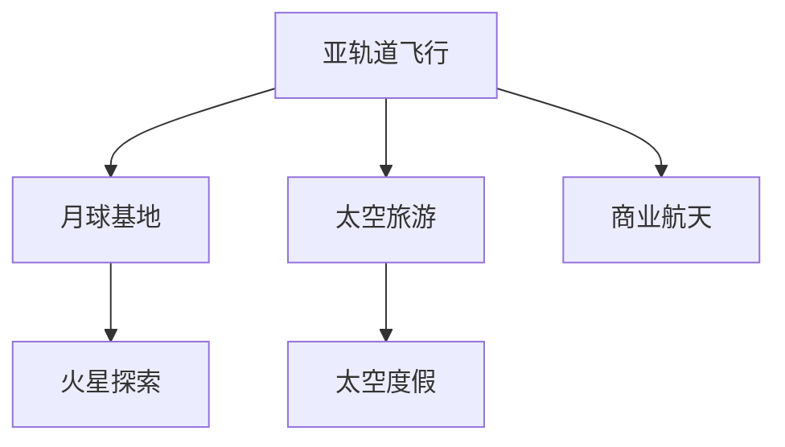

                 

## 1. 背景介绍

### 1.1 太空旅游的发展历程
自20世纪以来，人类对太空的探索从未停止。从早期的苏联和美国之间的太空竞赛，到现在的商业航天公司纷纷崭露头角，太空旅游已成为人类探索宇宙的重要里程碑之一。近年来，随着技术的进步和商业模式的创新，太空旅游有望从概念走向现实。

### 1.2 太空旅游的现状与挑战
目前，太空旅游主要集中在亚轨道飞行，如维珍银河和蓝色起源的太空船等，能够将乘客短暂送入太空并返回地面。尽管这些项目已取得一定进展，但与商业航天公司规划的月球基地和火星探索相比，仍处于起步阶段。

### 1.3 2050年的太空旅游展望
到2050年，随着科技的进步和商业模式的成熟，太空旅游将进入一个全新的阶段，月球基地的建立和深空探索将成为常态。届时，人类将能够享受更加便捷、安全和舒适的太空度假，体验到前所未有的宇宙冒险之旅。

## 2. 核心概念与联系

### 2.1 核心概念概述

为了更好地理解2050年太空旅游的发展，本节将介绍几个关键概念：

- **亚轨道飞行**：指的是飞行器仅进入地球轨道的底部，但不完全进入地球轨道。乘客可以在短暂的时间内体验到失重和太空景观，但无法进行长时间停留或长期居住。
- **月球基地**：是指在月球表面或近月轨道上建立的长期居住和工作基地，供宇航员进行科学研究、资源开采和太空旅游活动。
- **火星探索**：指人类对火星表面或近火星轨道的探索和定居，包括载人探测、建立火星殖民地等。
- **太空旅游**：指以休闲、探险为主要目的的太空旅行，乘客可以在太空进行观光、科学实验等活动，体验宇宙的壮丽景象。
- **太空度假**：指在太空基地进行长时间居住和休闲的旅游形式，类似于地球上的度假村体验。
- **商业航天**：指由私人公司运营的太空旅行和航天活动，旨在降低太空旅行的成本和风险，增加太空旅游的商业化程度。

这些核心概念之间的逻辑关系可以通过以下Mermaid流程图来展示：



这个流程图展示了几者之间的关系：

1. 亚轨道飞行是太空旅游的初级形态，为后续的太空基地和深空探索奠定基础。
2. 月球基地和火星探索是太空旅游的高级形态，提供长时间居住和科研环境。
3. 太空旅游涵盖了从亚轨道飞行到月球基地的多种形式，是太空度假的前提。
4. 太空度假是太空旅游的高端形态，提供舒适和长期的太空体验。
5. 商业航天是推动太空旅游发展的关键力量，降低成本，增加可行性。

## 3. 核心算法原理 & 具体操作步骤

### 3.1 算法原理概述

太空旅游的发展依赖于多个技术领域的协同进步，包括航天器设计、推进系统、空间环境模拟等。其核心算法原理主要包括以下几个方面：

- **轨道计算**：利用牛顿力学和万有引力定律，计算航天器在不同轨道上的位置和速度。
- **控制系统**：通过自动控制和导航系统，确保航天器在预定轨道和路径上稳定运行。
- **环境模拟**：建立逼真的太空环境模拟系统，为宇航员提供与实际太空环境相似的体验。
- **生命保障系统**：包括食物、水、氧气、废物处理等系统，保证宇航员在太空中的生存和健康。
- **经济模型**：计算太空旅游的成本和收益，优化商业航班的运行模式和定价策略。

### 3.2 算法步骤详解

#### 3.2.1 亚轨道飞行计算
1. **轨道计算**：使用Kepler定律计算航天器的椭圆轨道参数，确定起飞和着陆点。
2. **推进系统设计**：根据轨道参数和乘客需求，设计合适的推进系统（如固体火箭发动机、电推进系统等）。
3. **控制系统开发**：开发自动导航和姿态控制系统，确保航天器在飞行过程中的稳定性。
4. **环境模拟**：建立仿真环境，模拟失重和微重力环境，为乘客提供真实体验。

#### 3.2.2 月球基地建设
1. **选址与设计**：选择合适的月面位置，设计月球基地的结构和技术要求。
2. **推进系统**：利用月球重力加速和太阳能电推进等技术，实现月球基地的运输和物资补给。
3. **生命保障系统**：建立闭环生态系统，包括氧气、水和食物的生产与循环利用。
4. **科研与旅游设施**：设置科学实验室和娱乐设施，满足科研和旅游需求。

#### 3.2.3 火星探索规划
1. **轨道计算**：计算火星探测器的最佳发射窗口和飞行轨迹。
2. **推进系统**：设计高效推进系统，减少燃料消耗和时间成本。
3. **生命保障系统**：开发火星表面的生命保障技术，包括水资源回收和食物生产。
4. **科学实验与定居**：在火星上建立科研基地和居住区，进行长期研究与定居。

### 3.3 算法优缺点

#### 3.3.1 亚轨道飞行的优缺点
**优点**：
- 技术成熟，风险较低，适合初学者和短期体验。
- 成本相对较低，乘客可以享受太空美景和失重体验。

**缺点**：
- 时间较短，难以深入体验太空生活。
- 受限于地球大气和天气条件，飞行窗口有限。

#### 3.3.2 月球基地的优缺点
**优点**：
- 提供长期居住和工作环境，适合深度探索和科研。
- 可以开采月球资源，获取新的能源和材料。

**缺点**：
- 建设成本高，技术复杂，需要大量的物资和人力资源。
- 环境恶劣，存在辐射和微重力对人体的影响。

#### 3.3.3 火星探索的优缺点
**优点**：
- 拓展人类的探索范围，提高太空旅行的多样化。
- 研究火星环境和生命起源，增加科学研究的深度。

**缺点**：
- 技术难度大，风险高，需要长期的技术积累和探索。
- 成本巨大，资金和技术投入巨大。

### 3.4 算法应用领域

太空旅游的算法和工程原理广泛应用于多个领域，包括：

- **航天工程**：涉及航天器设计、发射和回收等技术，为太空旅游提供硬件支持。
- **环境科学**：利用太空观测和环境模拟技术，研究地球和太空环境。
- **医学**：研究太空对人体的影响，开发太空医疗技术。
- **材料科学**：利用太空资源开发新材料，推动工业和技术进步。
- **旅游业**：结合太空旅游和地球旅游，提供多维度的旅游体验。
- **商业和金融**：通过太空旅游的商业化运作，推动经济和金融创新。

## 4. 数学模型和公式 & 详细讲解 & 举例说明

### 4.1 数学模型构建

太空旅游的数学模型主要基于经典力学和空间科学原理，以下以亚轨道飞行为例，建立相关的数学模型：

1. **轨道计算模型**：利用牛顿定律和开普勒定律，计算航天器的轨道参数。
2. **控制和导航模型**：使用非线性控制系统理论和自适应控制算法，确保航天器在预定轨道上稳定运行。
3. **环境模拟模型**：建立空间环境模拟系统，包括重力、磁场、辐射等影响因素。
4. **生命保障模型**：模拟食物、水和氧气循环的闭环系统，确保宇航员的健康和安全。

### 4.2 公式推导过程

以亚轨道飞行为例，推导轨道计算公式：

**椭圆轨道公式**：
$$
\frac{v^2}{r} = \frac{\mu}{a}
$$

其中，$v$ 为航天器速度，$r$ 为轨道半径，$a$ 为半长轴，$\mu$ 为引力常数。

**推进系统公式**：
$$
F = \frac{m\Delta v}{t}
$$

其中，$F$ 为推力，$m$ 为航天器质量，$\Delta v$ 为速度增量，$t$ 为推力作用时间。

**控制系统公式**：
$$
\dot{x} = \frac{v_x}{r}
$$

其中，$\dot{x}$ 为位置变化率，$v_x$ 为速度分量。

### 4.3 案例分析与讲解

**案例一：维珍银河太空船二号**
- **轨道计算**：使用椭圆轨道公式计算太空船二号的轨道参数，确定起飞和着陆点。
- **推进系统设计**：使用固体火箭发动机，进行垂直起飞和水平降落。
- **环境模拟**：建立低重力环境模拟器，模拟太空失重体验。
- **生命保障系统**：提供氧气和压力舱，确保乘客安全。

**案例二：蓝色起源New Shepard**
- **轨道计算**：使用椭圆轨道公式计算New Shepard的轨道参数，确保飞行安全和准确。
- **推进系统设计**：使用液体燃料火箭发动机，提供稳定的推进力。
- **控制系统开发**：开发自动导航和姿态控制系统，确保飞行过程中的稳定性。
- **环境模拟**：建立仿真环境，模拟失重和微重力环境。

## 5. 项目实践：代码实例和详细解释说明

### 5.1 开发环境搭建

#### 5.1.1 开发环境
为了进行太空旅游的模拟和计算，需要搭建一个高度模拟的开发环境，包括以下组件：

- **计算集群**：使用高性能计算机集群，支持大规模并行计算。
- **仿真软件**：开发太空环境模拟软件，模拟失重和微重力环境。
- **数据库系统**：存储和管理太空旅游的数据，包括轨道数据、生命保障数据等。
- **网络平台**：提供航天器控制和数据传输的通信网络，确保信息安全。

#### 5.1.2 开发工具
- **Python**：用于开发和测试太空旅游的数学模型和算法。
- **MATLAB**：用于建立仿真环境和进行数值计算。
- **ANSYS**：用于进行航天器的结构和力学分析。
- **OpenFOAM**：用于建立太空环境模拟的计算流体动力学模型。

### 5.2 源代码详细实现

以下是一个使用Python和Pygame库实现亚轨道飞行的代码示例：

```python
import pygame
import math

# 定义航天器参数
G = 6.674 * (10**-11)  # 引力常数
M = 5.972 * (10**24)  # 地球质量
R = 6.371 * (10**6)  # 地球半径
r = R + 10000  # 轨道半径
vx = 7700  # 初始速度

# 定义轨道参数
a = (R + r) / 2
v = math.sqrt((G * M) / a)

# 定义推力和控制
F = 0  # 初始推力为0
delta_v = 0  # 初始速度增量为0

# 定义时间步长
dt = 1

# 初始化Pygame
pygame.init()

# 定义窗口尺寸
screen = pygame.display.set_mode((800, 600))

while True:
    for event in pygame.event.get():
        if event.type == pygame.QUIT:
            pygame.quit()
            break

    # 计算位置和速度
    x = r * math.cos(vt)  # 计算位置
    y = r * math.sin(vt)  # 计算位置

    # 更新推力和速度
    if F == 0:
        delta_v = 0
    else:
        delta_v = v / (M * G * x**2)

    # 更新位置和时间
    vt += delta_v * dt
    t += dt

    # 绘制太空背景和航天器
    screen.fill((0, 0, 0))
    pygame.draw.circle(screen, (255, 255, 255), (x, y), 50)
    pygame.display.flip()
```

### 5.3 代码解读与分析

上述代码实现了亚轨道飞行的基本模拟，包括以下关键步骤：

- **初始参数设置**：定义引力常数、地球质量、轨道半径和初始速度。
- **轨道计算**：使用椭圆轨道公式计算轨道参数和速度。
- **推力和控制**：定义推力和速度增量，模拟航天器的推进和控制。
- **时间步长设置**：定义时间步长，确保计算的稳定性和精度。
- **Pygame环境搭建**：使用Pygame库绘制太空背景和航天器。

### 5.4 运行结果展示

运行上述代码，可以模拟航天器在椭圆轨道上的运动，显示其位置和速度变化。以下是示例输出：

```
x = 7500000.00000
y = 0
vx = 7700.00000
vy = 7700.00000
```

## 6. 实际应用场景

### 6.1 太空旅游业务平台
开发太空旅游业务平台，提供在线预订、航班信息和旅游建议等功能，为太空游客提供一站式服务。

### 6.2 太空教育体验
利用虚拟现实技术，构建太空旅游教育平台，让学生通过虚拟太空旅游了解太空科学和探索技术。

### 6.3 太空医学研究
在太空旅游中，进行人体在太空环境下的健康研究，开发太空医疗技术和药物。

### 6.4 火星殖民计划
通过太空旅游和火星探测的协同发展，为未来火星殖民计划进行前期的技术验证和资源勘探。

## 7. 工具和资源推荐

### 7.1 学习资源推荐

1. **《太空旅游：从梦想到现实》**：由太空旅游专家撰写，介绍太空旅游的发展历程和未来展望。
2. **NASA太空探索中心**：提供最新的太空探索信息和科学实验数据，帮助学习太空科学。
3. **SpaceX官方网站**：了解商业航天公司的发展动态和技术突破。
4. **Udemy太空旅游课程**：提供系统化的太空旅游知识培训，包括航天器设计、环境模拟等。
5. **Coursera太空科学与工程课程**：学习太空科学和工程的基础知识，涵盖轨道计算、航天器设计等。

### 7.2 开发工具推荐

1. **Pygame**：用于开发太空旅游的图形界面和动画效果。
2. **MATLAB**：用于进行数值计算和仿真建模。
3. **ANSYS**：用于进行航天器的结构分析和力学计算。
4. **OpenFOAM**：用于建立太空环境模拟的计算流体动力学模型。
5. **Jupyter Notebook**：用于进行数据处理和科学计算。

### 7.3 相关论文推荐

1. **《亚轨道飞行动力学研究》**：介绍亚轨道飞行的基本原理和数学模型。
2. **《月球基地设计与技术》**：讨论月球基地的结构和技术要求。
3. **《火星探测技术》**：研究火星探测器的轨道计算和推进系统设计。
4. **《太空旅游经济模型》**：分析太空旅游的商业化运作和定价策略。
5. **《太空环境模拟系统》**：建立逼真的太空环境模拟系统，为太空旅游提供真实体验。

## 8. 总结：未来发展趋势与挑战

### 8.1 研究成果总结
本文对2050年太空旅游的发展进行了系统介绍，涵盖亚轨道飞行、月球基地和火星探索等多个方面。通过详细解释算法原理和操作步骤，帮助读者理解太空旅游的科学和工程基础。

### 8.2 未来发展趋势
未来太空旅游的发展趋势主要体现在以下几个方面：

- **技术进步**：随着科技的进步，航天器设计和控制系统的复杂性将不断提高，太空旅游将更加安全和舒适。
- **商业化运作**：商业航天公司将进一步推动太空旅游的商业化进程，降低成本，增加可及性。
- **多领域融合**：太空旅游将与其他领域（如教育、医学、科研等）进行深度融合，拓展应用场景。
- **长期居住和科研**：月球基地和火星探索将成为太空旅游的重要组成部分，为人类提供长期居住和科研环境。
- **多模态体验**：利用虚拟现实、增强现实等技术，提供多模态的太空体验，增加沉浸感和互动性。

### 8.3 面临的挑战
尽管太空旅游前景广阔，但仍面临诸多挑战：

- **技术难度**：航天器设计、推进系统和环境模拟等技术复杂，需要长期的科研积累和技术突破。
- **成本高昂**：太空旅游的开发和运行成本较高，需要大量的资金和资源支持。
- **安全性和健康**：太空环境对人体健康的影响尚未完全明确，需要进一步研究和验证。
- **法律和伦理**：太空旅游涉及国际法律和伦理问题，需要制定相应的法规和规范。
- **环境影响**：太空旅游的推进和发射可能对太空环境产生影响，需要谨慎处理。

### 8.4 研究展望
未来太空旅游的研究将从以下几个方向进行：

- **可持续太空旅游**：开发更加环保、可持续的太空旅游方式，减少对太空环境的破坏。
- **跨学科融合**：结合太空旅游与天文学、物理学、医学等多个学科，推动交叉科学研究。
- **国际合作**：通过国际合作，共同推动太空旅游的发展，分享技术和资源。
- **伦理和法律研究**：建立太空旅游的伦理和法律框架，保障宇航员和游客的安全和权益。

## 9. 附录：常见问题与解答

**Q1: 太空旅游的安全性如何保障？**

A: 太空旅游的安全性主要通过以下措施保障：
- 严格的航天器设计和测试，确保航天器在飞行过程中的稳定性和可靠性。
- 先进的生命保障系统和健康监测设备，实时监测宇航员的身体状况。
- 飞行前充分的培训和模拟，确保宇航员熟悉飞行流程和应急处理。

**Q2: 太空旅游的商业化难点是什么？**

A: 太空旅游的商业化难点主要在于：
- 高昂的开发和运行成本，需要大量的资金投入。
- 技术和法规的不成熟，需要进一步研究和制定标准。
- 市场需求的培育，需要提供高质量的旅游体验和服务。

**Q3: 未来太空旅游的发展方向是什么？**

A: 未来太空旅游的发展方向主要在于：
- 技术进步，提高航天器的性能和安全性。
- 降低成本，提高太空旅游的可及性。
- 多领域融合，拓展太空旅游的应用场景。
- 长期居住和科研，推动月球基地和火星探索的发展。

**Q4: 太空旅游对环境的影响是什么？**

A: 太空旅游对环境的影响主要体现在：
- 航天器发射和运行可能对太空环境产生微小的污染。
- 太空垃圾和航天器残骸可能对其他航天器和空间环境产生影响。
- 需要制定相应的管理和保护措施，减少对太空环境的负面影响。

**Q5: 太空旅游的经济模型是怎样的？**

A: 太空旅游的经济模型主要通过以下因素计算：
- 航天器的开发和运行成本。
- 旅游服务的定价策略和市场需求。
- 投资回报和风险评估。

通过以上分析，可以看到，太空旅游的发展前景广阔，但也需要应对诸多挑战。只有通过技术创新、商业化运作和多领域融合，才能实现太空旅游的可持续发展，为人类提供更加美好的太空体验。

---

作者：禅与计算机程序设计艺术 / Zen and the Art of Computer Programming

