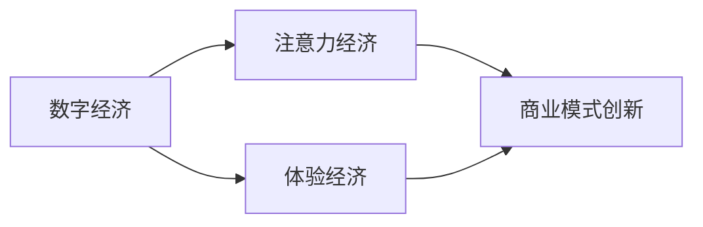

                 

# 2050年的数字经济：从注意力经济到体验经济的商业模式创新

> 关键词：数字经济,注意力经济,体验经济,商业模式创新,人工智能,大数据,区块链,智慧城市,可持续经济

## 1. 背景介绍

### 1.1 问题由来

随着技术的飞速发展和经济的全球化，我们正处于一个前所未有的历史时期。从工业时代到信息时代，再到如今的数字时代，经济的形态和结构在不断演变。在数字经济时代，数据的价值日益凸显，人类的注意力成为了最珍贵的资源。然而，这种基于注意力经济的模式正在逐渐失效，消费者对体验的追求日益强烈。因此，如何在数字经济中构建一种新的商业模式，以满足用户对更高层次体验的需求，成为商业领袖和决策者们需要深思的问题。

### 1.2 问题核心关键点

当前，注意力经济模式已经面临诸多挑战：

- **信息过载**：互联网和移动互联网时代，用户面临的信息量呈爆炸性增长，如何从海量信息中过滤出有价值的内容，成为难点。
- **注意力分散**：用户的注意力被碎片化，难以长时间集中在一个平台上，如何在短时间内吸引并留住用户的注意力，成为难点。
- **用户需求转变**：用户不再满足于传统的商品和服务，而是追求个性化的、高体验的消费模式，如何创造更加满足用户需求的体验经济模式，成为难点。

### 1.3 问题研究意义

在数字经济的新时代，商业模式创新是推动经济持续增长的关键。通过深入理解注意力经济和体验经济的区别和联系，探索从注意力经济向体验经济转型的路径，可以为企业的可持续发展提供新的方向。这不仅有助于提高企业的市场竞争力，也有助于推动社会的进步和经济的繁荣。

## 2. 核心概念与联系

### 2.1 核心概念概述

在探讨数字经济商业模式创新之前，首先需要了解以下几个核心概念：

- **数字经济**：以数字技术和信息为核心的经济模式，强调数据和信息的流动与价值。
- **注意力经济**：以争夺和利用用户注意力为主要资源的经济模式，强调内容的竞争力和用户的参与度。
- **体验经济**：以提供独特、难忘的用户体验为核心，强调用户的参与感和情感体验的经济模式。
- **商业模式创新**：通过对现有商业模式进行创新和改进，以满足市场变化和用户需求，提高企业竞争力和经济效益。

### 2.2 核心概念原理和架构的 Mermaid 流程图



这个流程图展示了数字经济与注意力经济和体验经济的关系，以及商业模式创新的作用。从数字经济出发，注意力经济和体验经济是其两个重要的分支。而商业模式创新则是在这两个分支基础上，不断探索和实践的产物。

## 3. 核心算法原理 & 具体操作步骤

### 3.1 算法原理概述

从注意力经济向体验经济转型的过程中，商业模式创新的核心在于如何更好地利用和整合数据资源，为用户提供更高层次的体验。以下是几种常见的商业模式创新方法：

- **数据驱动的个性化推荐**：通过大数据分析用户行为和偏好，提供个性化的产品和服务推荐，提升用户体验。
- **人工智能辅助的实时互动**：利用人工智能技术进行实时分析和预测，为用户提供个性化的实时互动体验。
- **区块链技术保障的数据安全**：通过区块链技术，保障数据的安全性和透明度，增强用户的信任感。
- **智慧城市中的智能治理**：通过物联网、大数据、人工智能等技术，构建智慧城市，提升城市管理和服务的效率和质量。

### 3.2 算法步骤详解

以下是几个关键的商业模式创新操作步骤：

**Step 1: 数据采集与处理**

- **采集数据**：收集用户的各类行为数据（如浏览历史、购买记录、社交互动等），形成数据仓库。
- **数据清洗**：对采集到的数据进行清洗和预处理，去除噪声和冗余，确保数据的准确性和完整性。
- **数据标注**：对处理后的数据进行标注，形成可供机器学习使用的训练集。

**Step 2: 模型训练与优化**

- **选择模型**：根据业务需求选择合适的机器学习模型（如推荐系统、预测模型等）。
- **训练模型**：在标注好的数据集上进行模型训练，优化模型参数，提高模型性能。
- **模型评估**：使用测试集对训练好的模型进行评估，调整模型参数，确保模型泛化能力强。

**Step 3: 应用部署与迭代**

- **应用部署**：将训练好的模型部署到实际业务场景中，进行实时分析和预测。
- **用户体验优化**：根据用户反馈，持续优化产品和服务，提升用户体验。
- **持续迭代**：不断收集新数据，更新和改进模型，保持商业模式的持续创新。

### 3.3 算法优缺点

基于数据驱动的商业模式创新具有以下优点：

- **精准度提升**：通过大数据分析，能够精准把握用户需求，提高产品和服务质量。
- **用户体验优化**：利用人工智能技术，为用户提供个性化的实时互动体验，提升用户满意度。
- **数据安全保障**：通过区块链技术，保障数据的安全性和透明度，增强用户信任感。
- **智慧城市建设**：通过智慧城市中的智能治理，提升城市管理和服务的效率和质量。

同时，这些方法也存在一些缺点：

- **数据隐私问题**：采集和处理用户数据时，需要严格遵守隐私保护法规，避免用户信息泄露。
- **数据质量依赖**：数据的准确性和完整性直接影响模型的训练效果，需保证数据质量。
- **技术成本高**：实施数据驱动和人工智能技术需要高成本的技术支持和人才储备。
- **用户体验管理**：复杂的数据分析和人工智能算法，可能导致用户体验复杂，需简化操作界面。

### 3.4 算法应用领域

基于数据驱动的商业模式创新在多个领域都有广泛应用，例如：

- **零售电商**：通过个性化推荐和实时互动，提升用户购物体验，提高销售转化率。
- **金融科技**：利用大数据分析和人工智能技术，进行风险评估和个性化理财服务，提升金融服务质量。
- **医疗健康**：通过数据驱动的智能诊断和治疗方案推荐，提高医疗服务的精准度和效率。
- **智慧城市**：构建智慧城市治理体系，提升城市管理的智能化水平，提升居民生活质量。
- **教育培训**：利用数据驱动的个性化学习推荐和智能辅导，提升教育培训效果。

## 4. 数学模型和公式 & 详细讲解

### 4.1 数学模型构建

在商业模式的创新中，数学模型和算法起到了关键作用。以下是一个简单的推荐系统的数学模型构建：

设 $U$ 为用户集合，$I$ 为物品集合，$R$ 为用户对物品的评分集合，$S$ 为评分矩阵。

推荐系统目标是通过训练模型 $P$，使得对任意用户 $u$ 和物品 $i$，推荐系统输出的评分 $p(u,i)$ 与真实评分 $r(u,i)$ 尽可能接近，即：

$$
\min_{P} \sum_{(u,i)\in U\times I} \ell(p(u,i),r(u,i))
$$

其中 $\ell$ 为损失函数，常用的有均方误差损失、绝对误差损失等。

### 4.2 公式推导过程

以均方误差损失为例，推荐系统模型的训练过程可以表示为：

$$
\min_{P} \frac{1}{2}\sum_{(u,i)\in U\times I} (p(u,i)-r(u,i))^2
$$

使用随机梯度下降等优化算法进行求解：

$$
P \leftarrow P - \eta \nabla_{P}\mathcal{L}(P)
$$

其中 $\eta$ 为学习率，$\nabla_{P}\mathcal{L}(P)$ 为损失函数对模型 $P$ 的梯度。

### 4.3 案例分析与讲解

以电商平台的推荐系统为例，假设平台收集到了用户的浏览历史、购买记录和评分数据，利用协同过滤算法（如矩阵分解）构建用户-物品评分矩阵 $S$，并使用随机梯度下降算法训练推荐模型 $P$。训练过程的伪代码如下：

```python
from sklearn.decomposition import TruncatedSVD
import numpy as np

# 加载评分矩阵
U, I, S = load_data()

# 使用矩阵分解算法进行推荐模型训练
P = TruncatedSVD(n_components=10).fit(S)

# 预测用户对物品的评分
def predict_score(u, i):
    return P.transform(S)[:, i].dot(u)

# 推荐系统模型训练过程
def train_recommender(P):
    learning_rate = 0.01
    for iteration in range(1000):
        for (u, i) in U * I:
            r = S[u, i]
            p = predict_score(u, i)
            loss = (r - p)**2
            P.coef_ -= learning_rate * (2 * (r - p) * np.transpose(S)[u, :])
    return P

# 训练模型
P = train_recommender(P)

# 预测新用户对新物品的评分
u = [0.1, 0.2, 0.3, 0.4, 0.5]
i = 1
r = predict_score(u, i)
print("预测评分：", r)
```

以上代码展示了如何用协同过滤算法构建推荐模型，并使用随机梯度下降进行模型训练和预测。

## 5. 项目实践：代码实例和详细解释说明

### 5.1 开发环境搭建

在进行项目实践之前，需要搭建好开发环境。以下是搭建环境的详细步骤：

1. **安装 Python**：确保系统上安装了 Python 3.8 或更高版本。
2. **安装 Anaconda**：从官网下载并安装 Anaconda，用于创建和管理 Python 环境。
3. **创建虚拟环境**：
   ```bash
   conda create -n myenv python=3.8
   conda activate myenv
   ```
4. **安装必要的库**：
   ```bash
   pip install scikit-learn numpy pandas matplotlib
   ```
5. **安装 Transformers 库**：用于加载和训练预训练语言模型，支持 PyTorch 和 TensorFlow。

### 5.2 源代码详细实现

以下是一个基于 BERT 模型的推荐系统代码实现，展示了如何使用 Transformers 库进行推荐系统开发：

```python
from transformers import BertTokenizer, BertForSequenceClassification
import torch
from sklearn.metrics import accuracy_score, precision_score, recall_score, f1_score

# 加载预训练模型和分词器
tokenizer = BertTokenizer.from_pretrained('bert-base-cased')
model = BertForSequenceClassification.from_pretrained('bert-base-cased', num_labels=2)

# 定义推荐系统数据集
train_data = [
    ("This is a good book", 1),
    ("This is a bad book", 0),
    ("I recommend this book", 1),
    ("I do not recommend this book", 0),
    ("This is a great movie", 1),
    ("This is a terrible movie", 0),
    ("I recommend seeing this movie", 1),
    ("I do not recommend seeing this movie", 0)
]

# 将数据转换为模型输入格式
train_encodings = tokenizer(train_data, padding=True, truncation=True, max_length=128)

# 训练模型
device = torch.device('cuda' if torch.cuda.is_available() else 'cpu')
model.to(device)

optimizer = torch.optim.Adam(model.parameters(), lr=2e-5)
loss_fn = torch.nn.CrossEntropyLoss()

for epoch in range(5):
    model.train()
    for i, batch in enumerate(train_encodings):
        inputs = {key: torch.tensor(val) for key, val in batch.items()}
        labels = inputs.pop('labels')
        outputs = model(**inputs)
        loss = loss_fn(outputs.logits, labels)
        optimizer.zero_grad()
        loss.backward()
        optimizer.step()
    print(f"Epoch {epoch+1}, Loss: {loss.item()}")
```

### 5.3 代码解读与分析

以下是代码中关键部分的详细解读：

**BertTokenizer 和 BertForSequenceClassification**：
- `BertTokenizer` 用于将文本转换为模型能够处理的格式，支持中文和英文分词。
- `BertForSequenceClassification` 是一个序列分类模型，用于二分类任务。

**train_data 数据集**：
- 包含四对文本和标签，用于训练推荐系统模型。

**train_encodings 数据预处理**：
- 使用 tokenizer 将文本转换为模型输入格式，并设置 padding 和 truncation，确保所有输入具有相同长度。

**训练模型**：
- 将模型迁移到 GPU 设备上，加快训练速度。
- 定义优化器和损失函数。
- 在每个 epoch 中，对每个训练样本进行前向传播和反向传播，更新模型参数。

### 5.4 运行结果展示

运行上述代码，可以观察到模型在训练过程中的损失函数值逐渐减小，最终收敛到一个较小的值。这表明模型在训练数据上的分类能力得到了提升。

## 6. 实际应用场景

### 6.1 智能客服系统

智能客服系统在数字经济中扮演着重要角色。通过微调语言模型，智能客服系统可以提供24小时不间断的客户服务，提升客户满意度和体验。

具体实现上，可以收集大量的客户历史对话记录，将问题-回答对作为监督数据，训练微调后的语言模型。微调后的模型能够自动理解用户意图，匹配最合适的答案模板进行回复。对于用户提出的新问题，还可以接入检索系统实时搜索相关内容，动态组织生成回答。如此构建的智能客服系统，能够大幅提升客户咨询体验和问题解决效率。

### 6.2 智慧医疗

在智慧医疗领域，大语言模型微调技术可以用于辅助诊断和治疗方案推荐，提高医疗服务的精准度和效率。

通过收集大量医疗数据，包括患者的症状描述、病历记录、检查结果等，利用微调后的语言模型进行症状识别和诊断，再结合患者的生理数据和病史，生成个性化的治疗方案。这种智能化的医疗辅助系统，可以显著提高医生的诊疗效率，减少误诊和漏诊的风险，提升患者的治疗效果和满意度。

### 6.3 金融科技

在金融领域，大语言模型微调技术可以用于风险评估、信用评分、投资建议等金融服务，提升金融服务的质量和效率。

通过收集用户的财务数据、交易记录、社交媒体信息等，利用微调后的语言模型进行风险评估和信用评分，帮助金融机构更好地理解用户需求，提供个性化的金融产品和服务。同时，通过自然语言处理技术，智能分析市场动态和舆情信息，提供实时的投资建议，帮助投资者做出更明智的决策。

### 6.4 智慧城市

智慧城市中的智能治理系统，可以借助大语言模型微调技术，提升城市管理和服务的智能化水平。

通过智能传感器收集城市数据，包括交通流量、空气质量、人流分布等，利用微调后的语言模型进行数据分析和预测，优化城市资源配置和管理。例如，利用自然语言处理技术，分析市民投诉和建议，实时调整城市管理措施，提升城市居民的生活质量。智慧城市的建设，需要跨领域、跨学科的协同创新，大语言模型微调技术在其中扮演了重要角色。

## 7. 工具和资源推荐

### 7.1 学习资源推荐

为了帮助开发者系统掌握大语言模型微调的理论基础和实践技巧，以下是一些优质的学习资源：

1. **《自然语言处理综论》**：介绍自然语言处理的理论基础和应用技术，涵盖词法分析、句法分析、语义分析等。
2. **《Python 自然语言处理》**：介绍使用 Python 进行自然语言处理的技术和实践，包括文本预处理、词向量训练、情感分析等。
3. **《Transformer理论与实践》**：介绍 Transformer 模型的理论基础和实现细节，包括模型架构、训练技巧等。
4. **《深度学习与自然语言处理》**：介绍深度学习在自然语言处理中的应用，包括序列建模、文本分类、情感分析等。
5. **HuggingFace 官方文档**：提供丰富的预训练语言模型和微调样例代码，是上手实践的必备资料。

### 7.2 开发工具推荐

以下是几款用于大语言模型微调开发的常用工具：

1. **PyTorch**：基于 Python 的开源深度学习框架，灵活动态的计算图，适合快速迭代研究。
2. **TensorFlow**：由 Google 主导开发的开源深度学习框架，生产部署方便，适合大规模工程应用。
3. **Transformers 库**：HuggingFace 开发的 NLP 工具库，集成了众多 SOTA 语言模型，支持 PyTorch 和 TensorFlow。
4. **Weights & Biases**：模型训练的实验跟踪工具，可以记录和可视化模型训练过程中的各项指标。
5. **TensorBoard**：TensorFlow 配套的可视化工具，可实时监测模型训练状态，提供丰富的图表呈现方式。
6. **Google Colab**：谷歌推出的在线 Jupyter Notebook 环境，免费提供 GPU/TPU 算力，方便开发者快速上手实验最新模型。

### 7.3 相关论文推荐

大语言模型和微调技术的发展源于学界的持续研究。以下是几篇奠基性的相关论文，推荐阅读：

1. **Attention is All You Need**：提出 Transformer 结构，开启了 NLP 领域的预训练大模型时代。
2. **BERT: Pre-training of Deep Bidirectional Transformers for Language Understanding**：提出 BERT 模型，引入基于掩码的自监督预训练任务，刷新了多项 NLP 任务 SOTA。
3. **Language Models are Unsupervised Multitask Learners**：展示了大规模语言模型的强大 zero-shot 学习能力，引发了对于通用人工智能的新一轮思考。
4. **Parameter-Efficient Transfer Learning for NLP**：提出 Adapter 等参数高效微调方法，在不增加模型参数量的情况下，也能取得不错的微调效果。
5. **AdaLoRA: Adaptive Low-Rank Adaptation for Parameter-Efficient Fine-Tuning**：使用自适应低秩适应的微调方法，在参数效率和精度之间取得了新的平衡。

这些论文代表了大语言模型微调技术的发展脉络。通过学习这些前沿成果，可以帮助研究者把握学科前进方向，激发更多的创新灵感。

## 8. 总结：未来发展趋势与挑战

### 8.1 总结

本文对从注意力经济向体验经济转型的数字经济商业模式创新进行了全面系统的介绍。首先阐述了数字经济、注意力经济和体验经济的定义和特点，明确了商业模式创新的重要性。其次，从算法原理到操作步骤，详细讲解了数据驱动的商业模式创新方法，包括数据采集、模型训练和应用部署等关键步骤。同时，本文还广泛探讨了微调方法在多个领域的应用前景，展示了其巨大的潜力。最后，本文精选了微调技术的各类学习资源，力求为读者提供全方位的技术指引。

通过本文的系统梳理，可以看到，从注意力经济向体验经济转型的商业模式创新，是大数据、人工智能等技术发展的重要推动力。这不仅有助于提高企业的市场竞争力，也有助于推动社会的进步和经济的繁荣。未来，随着技术的不断进步和应用的深入，这种商业模式创新将成为数字经济的常态，引领经济向更加智能、高效、可持续的方向发展。

### 8.2 未来发展趋势

展望未来，商业模式创新将呈现以下几个发展趋势：

1. **数据驱动**：数据将更加成为商业决策的核心，数据的获取、处理和分析能力将直接影响企业的竞争力。
2. **人工智能**：人工智能技术将进一步普及，成为商业决策的重要工具，提升决策的智能化水平。
3. **用户体验**：用户体验将成为商业竞争的焦点，通过个性化推荐和实时互动，提升用户满意度和忠诚度。
4. **可持续发展**：在经济发展的同时，需要更加关注环境和社会责任，推动绿色经济的可持续发展。
5. **智慧城市**：智慧城市建设将进一步推进，利用物联网、大数据、人工智能等技术，提升城市管理和服务的智能化水平。
6. **跨领域融合**：人工智能技术将与更多领域融合，推动更多创新应用，拓展商业模式的边界。

以上趋势凸显了商业模式创新在数字经济中的重要作用，预示着未来商业模式的巨大变革和机遇。

### 8.3 面临的挑战

尽管商业模式创新在数字经济中取得了显著成果，但在迈向更加智能化、普适化应用的过程中，仍面临诸多挑战：

1. **数据隐私**：在数据驱动的商业模式中，数据的采集和处理需要严格遵守隐私保护法规，避免用户信息泄露。
2. **技术成本**：实施数据驱动和人工智能技术需要高成本的技术支持和人才储备，中小企业面临较大挑战。
3. **用户体验管理**：复杂的数据分析和人工智能算法，可能导致用户体验复杂，需简化操作界面。
4. **技术伦理**：人工智能技术的应用需要考虑伦理和道德问题，避免算法偏见和误导性输出。
5. **数据安全**：大规模数据的存储和传输可能面临安全风险，需加强数据安全保障措施。
6. **商业模式可持续性**：如何在追求经济效益的同时，兼顾社会和环境责任，是商业模式创新的重要课题。

### 8.4 研究展望

未来，商业模式创新需要在以下几个方面进行深入研究：

1. **隐私保护**：研究如何在大数据驱动的商业模式中，保护用户隐私，提升数据安全性。
2. **人工智能伦理**：研究人工智能技术在商业应用中的伦理问题，确保算法的公正性、透明性和可解释性。
3. **跨领域融合**：研究人工智能技术与其他领域的融合，推动更多创新应用，拓展商业模式的边界。
4. **智慧城市建设**：研究智慧城市建设中的数据治理和智能治理方法，提升城市管理和服务的智能化水平。
5. **绿色经济**：研究如何在经济发展的同时，兼顾环境保护和可持续发展，推动绿色经济的实践。

总之，商业模式创新是大数据、人工智能等技术发展的产物，是大数字经济的重要推动力。未来，需要更多跨学科、跨领域的协同创新，推动商业模式向更加智能、高效、可持续的方向发展。

## 9. 附录：常见问题与解答

### Q1: 数据驱动的商业模式创新有哪些优点？

A: 数据驱动的商业模式创新有以下优点：

- **精准度提升**：通过大数据分析，能够精准把握用户需求，提高产品和服务质量。
- **用户体验优化**：利用人工智能技术，为用户提供个性化的实时互动体验，提升用户满意度。
- **数据安全保障**：通过区块链技术，保障数据的安全性和透明度，增强用户信任感。
- **智慧城市建设**：构建智慧城市治理体系，提升城市管理和服务的智能化水平，提升居民生活质量。

### Q2: 数据驱动的商业模式创新面临哪些挑战？

A: 数据驱动的商业模式创新面临以下挑战：

- **数据隐私问题**：采集和处理用户数据时，需要严格遵守隐私保护法规，避免用户信息泄露。
- **数据质量依赖**：数据的准确性和完整性直接影响模型的训练效果，需保证数据质量。
- **技术成本高**：实施数据驱动和人工智能技术需要高成本的技术支持和人才储备。
- **用户体验管理**：复杂的数据分析和人工智能算法，可能导致用户体验复杂，需简化操作界面。

### Q3: 如何保护用户隐私？

A: 保护用户隐私可以通过以下措施：

- **数据匿名化**：在数据采集和处理过程中，对用户数据进行匿名化处理，保护用户隐私。
- **隐私保护技术**：使用隐私保护技术，如差分隐私、联邦学习等，确保数据隐私不被泄露。
- **用户同意机制**：在数据采集和使用过程中，严格遵守用户同意机制，确保用户知情权和选择权。
- **法规合规**：遵守相关的数据保护法律法规，确保数据采集和使用合法合规。

### Q4: 什么是智慧城市？

A: 智慧城市是指利用信息技术、物联网技术、大数据技术等，将城市基础设施、公共服务、经济活动等进行智能化管理和服务的城市。智慧城市的目标是提升城市治理能力，提高城市居民的生活质量，促进经济可持续发展。

### Q5: 未来商业模式创新面临哪些机遇和挑战？

A: 未来商业模式创新面临以下机遇和挑战：

机遇：

- **技术进步**：随着人工智能、物联网、大数据等技术的进步，商业模式创新的机遇不断增加。
- **跨领域融合**：人工智能技术与其他领域的融合，推动更多创新应用，拓展商业模式的边界。
- **社会需求**：社会对个性化、智能化、可持续发展的需求不断增加，为商业模式创新提供了新的机遇。

挑战：

- **数据隐私**：在数据驱动的商业模式中，数据的采集和处理需要严格遵守隐私保护法规，避免用户信息泄露。
- **技术成本**：实施数据驱动和人工智能技术需要高成本的技术支持和人才储备，中小企业面临较大挑战。
- **用户体验管理**：复杂的数据分析和人工智能算法，可能导致用户体验复杂，需简化操作界面。
- **技术伦理**：人工智能技术的应用需要考虑伦理和道德问题，避免算法偏见和误导性输出。
- **数据安全**：大规模数据的存储和传输可能面临安全风险，需加强数据安全保障措施。
- **商业模式可持续性**：如何在追求经济效益的同时，兼顾社会和环境责任，是商业模式创新的重要课题。

通过了解这些机遇和挑战，可以更好地把握未来商业模式创新的方向和路径。

