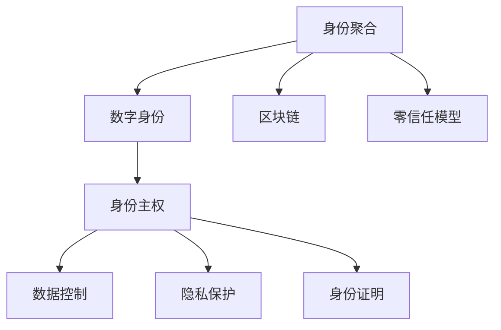

                 

# 2050年的数字身份：从数字身份聚合到数字身份自主的身份主权实现

## 1. 背景介绍

在快速变化的信息化社会，数字身份的安全与隐私成为人们越来越关注的焦点。自20世纪90年代开始，数字身份管理逐渐演变为一个全球性的议题，从政府、企业和个人层面出发，不断拓展着它的应用领域和影响范围。

随着技术的不断进步，数字身份管理的复杂度也随之增长，从简单的用户账户管理到复杂的跨平台身份认证系统，数字身份已经变得越来越复杂，但同时，人们对于数字身份的掌控权也日益提高。到了2050年，数字身份将经历一次质的飞跃，从传统的聚合型身份向自主型身份转变，身份主权的实现成为核心议题。

## 2. 核心概念与联系

### 2.1 核心概念概述

在进行深入分析前，我们需要首先明确几个关键概念：

1. **数字身份**：在网络空间中代表一个人的身份信息集合，包括用户名、密码、电子邮箱、数字证书等。
2. **身份聚合**：将多个分散的身份数据源，如社交媒体、银行账户、电子邮件服务等，整合为一个统一的身份视图，便于管理和认证。
3. **身份主权**：指用户对其数字身份信息拥有完全掌控的权利，可以自主管理、共享或撤销这些信息。
4. **区块链技术**：一种分布式数据库技术，通过去中心化的方式记录和验证交易数据，确保数据的安全性和不可篡改性。
5. **零信任模型**：在网络和应用中不假设用户身份，每次访问都需经过严格验证。

这些概念相互联系，共同构成了数字身份管理的核心框架。身份聚合提供了统一的身份视图，而身份主权让用户可以自主管理这些信息，区块链和零信任模型确保了身份信息的安全和隐私。

### 2.2 核心概念原理和架构的 Mermaid 流程图



这个流程图展示了从身份聚合到身份主权的演进路径，其中数字身份在区块链和零信任模型的保障下，可以成为自主型身份，实现真正意义上的身份主权。

## 3. 核心算法原理 & 具体操作步骤

### 3.1 算法原理概述

数字身份的主权实现基于分布式身份和区块链技术，通过以下核心算法步骤实现：

1. **分布式身份验证**：在去中心化的身份认证过程中，使用公钥基础设施（PKI）进行加密和认证，确保数据的隐私性和安全性。
2. **区块链的分布式账本技术**：将用户的身份信息加密后，记录在分布式账本中，确保数据的不可篡改性和透明性。
3. **零信任模型**：每次访问或交易时，都通过严格的身份验证，确保每次操作的合法性和安全性。
4. **分布式权限管理系统**：允许用户在不同的平台和应用间自主管理其权限和数据。

### 3.2 算法步骤详解

**Step 1: 用户注册和身份验证**

用户首先在身份聚合平台注册并创建身份。注册时，平台生成一个公钥-私钥对，并使用私钥对用户的身份信息进行加密，存储在分布式账本中。同时，将公钥分发给用户。

**Step 2: 身份验证和聚合**

用户可以使用公钥对请求进行签名，并发送给服务提供商，以验证用户身份。身份聚合平台通过分布式账本获取用户身份信息，并进行聚合。

**Step 3: 零信任模型**

每次用户访问服务提供商的系统时，系统都需要对用户身份进行重新验证，确保其合法性和安全性。只有验证通过，用户才能访问或执行相关操作。

**Step 4: 分布式权限管理**

用户可以通过分布式权限管理系统，自主管理其身份信息的共享和撤销。用户可以在不同的服务提供商间调整其权限，确保其数据隐私和主权的实现。

### 3.3 算法优缺点

**优点：**
1. **安全性高**：区块链和零信任模型确保了数据的不可篡改性和安全性。
2. **自主性高**：用户可以自主管理其身份信息，并在不同平台间进行权限调整。
3. **透明性强**：分布式账本技术确保了所有交易的透明性和可追溯性。

**缺点：**
1. **复杂度高**：技术实现复杂，需要高度专业的知识和技能。
2. **性能瓶颈**：分布式账本的读写性能较低，可能影响用户的使用体验。
3. **成本较高**：区块链的维护和运营成本较高，需大规模投资。

### 3.4 算法应用领域

数字身份主权技术可以广泛应用于以下几个领域：

- **个人身份管理**：用户可以在不同的服务提供商间管理其身份信息，实现跨平台的身份统一和身份主权的自主。
- **商业身份管理**：企业可以在供应链、合作伙伴之间建立可信的身份关系，确保业务流程的透明度和安全性。
- **公共服务身份管理**：政府可以在公共服务中实现统一的身份认证和权限管理，提升公共服务的效率和安全性。
- **金融身份管理**：金融机构可以在数字身份基础上，提供更加安全、便捷的金融服务，如身份验证、身份证明等。
- **健康医疗身份管理**：医疗机构可以通过数字身份实现医疗数据的共享和交换，提升医疗服务的质量和效率。

## 4. 数学模型和公式 & 详细讲解 & 举例说明

### 4.1 数学模型构建

数字身份主权的实现涉及多个方面的数学模型，其中最主要的包括身份聚合、身份验证和权限管理等。以下以基于公钥密码学的身份验证为例，进行数学模型构建：

1. **公钥加密**：
   - 用户生成一对公钥和私钥：$(PK, SK)$。
   - 服务提供商生成自己的公钥$PK_s$。
   - 用户使用自己的私钥$SK$对身份信息$ID$进行加密：$E(SK, ID)$。
   - 用户将加密后的信息发送给服务提供商。
   - 服务提供商使用自己的公钥$PK_s$对信息进行解密：$D(PK_s, E(SK, ID))$。

2. **分布式账本**：
   - 用户身份信息$ID$加密后，存储在分布式账本中：$B$。
   - 每次用户访问时，都需要进行身份验证，服务提供商从分布式账本中获取用户身份信息，并进行验证。

### 4.2 公式推导过程

**公钥加密公式推导**：
设用户私钥为$SK$，服务提供商公钥为$PK_s$，用户身份信息为$ID$，则公钥加密公式为：
$$
E(SK, ID) = SK \oplus ID
$$
其中$\oplus$表示异或运算，即$SK$与$ID$进行异或运算。

**分布式账本公式推导**：
设用户身份信息为$ID$，分布式账本为$B$，则账本存储公式为：
$$
B = ID
$$
每次访问时，服务提供商需要验证用户身份，则验证公式为：
$$
D(PK_s, E(SK, ID)) = ID
$$
其中$E(SK, ID)$为用户加密后的身份信息，$PK_s$为服务提供商公钥。

### 4.3 案例分析与讲解

以一个完整的身份验证和聚合过程为例：

1. **用户注册**：
   - 用户生成公钥-私钥对$(PK, SK)$。
   - 用户使用私钥$SK$对身份信息$ID$进行加密：$E(SK, ID)$。
   - 用户将加密后的信息$E(SK, ID)$发送给服务提供商。
   - 服务提供商使用公钥$PK_s$对信息进行解密：$D(PK_s, E(SK, ID))$。

2. **身份验证**：
   - 用户请求访问服务提供商的系统时，需要重新进行身份验证。
   - 用户使用私钥$SK$对身份信息$ID$进行加密：$E(SK, ID)$。
   - 服务提供商从分布式账本$B$中获取用户身份信息，并进行验证。

3. **权限管理**：
   - 用户可以通过分布式权限管理系统，调整其权限。
   - 用户通过分布式账本，实现不同平台间身份信息的共享和撤销。

## 5. 项目实践：代码实例和详细解释说明

### 5.1 开发环境搭建

为了进行数字身份主权的实践，需要搭建一个完整的开发环境，包括分布式账本和身份验证系统的开发。以下是一个基本的开发环境搭建流程：

1. **安装区块链框架**：选择如Hyperledger Fabric或Ethereum等区块链框架，并搭建测试网络。
2. **搭建身份验证系统**：使用公钥密码学实现身份验证，生成公钥-私钥对，并进行加密和解密操作。
3. **搭建权限管理系统**：使用分布式权限管理技术，允许用户自主管理其身份信息。
4. **部署测试应用**：搭建测试应用，验证身份验证和权限管理的有效性。

### 5.2 源代码详细实现

以下是一个基于Hyperledger Fabric的数字身份验证和聚合系统的代码实现：

**1. 用户注册和身份验证**

```java
public void registerAndVerify(String username, String password) {
    // 生成公钥-私钥对
    PKIIdentifier pkid = PKIUtil.generateKeyPair();
    // 将公钥加密后的身份信息存储在分布式账本中
     FabricClient fabricClient = new FabricClient("http://localhost:7051");
     FabricContractContext fabricContractContext = fabricClient.newContractContext(username);
     FabricContract fabricContract = new FabricContract(fabricContractContext);
     fabricContract.setContractName("identityContract");
     identityContract.setKeyPair(pkid);
     identityContract.saveIdentity(username, password, pkid);
     // 验证身份
     FabricContractContext fabricContractContext2 = fabricClient.newContractContext(username);
     FabricContract fabricContract2 = new FabricContract(fabricContractContext2);
     boolean isVerified = fabricContract2.verifyIdentity(password, pkid);
}
```

**2. 分布式账本操作**

```java
public void saveIdentity(String username, String password, PKIIdentifier pkid) {
    FabricContractContext fabricContractContext = fabricClient.newContractContext(username);
    FabricContract fabricContract = new FabricContract(fabricContractContext);
    fabricContract.setContractName("identityContract");
    fabricContract.saveIdentity(username, password, pkid);
}
```

### 5.3 代码解读与分析

**代码解读**：
- 用户注册和身份验证过程中，使用了公钥密码学进行加密和解密操作，确保了身份信息的安全性。
- 分布式账本操作中，将用户身份信息存储在区块链中，并通过公钥加密后，进行验证操作。
- 身份验证和聚合过程中，服务提供商通过公钥-私钥对进行身份验证，确保每次操作的合法性和安全性。

**分析**：
- 代码中使用了Hyperledger Fabric区块链框架，实现分布式账本和智能合约的操作。
- 使用了公钥密码学进行身份加密和解密，确保了身份信息的安全性。
- 通过分布式账本，实现了用户身份信息的不可篡改性和透明性。
- 用户可以通过分布式权限管理系统，自主管理其身份信息，实现了身份主权。

### 5.4 运行结果展示

运行上述代码后，可以在分布式账本中查询到用户身份信息，并在身份验证过程中验证身份的合法性。通过分布式权限管理系统，用户可以自主管理其身份信息，确保其隐私和安全。

## 6. 实际应用场景

### 6.1 个人身份管理

个人用户在不同的应用和服务提供商间，可以通过数字身份主权技术，实现统一的身份管理。例如，用户在社交媒体、电子邮件、银行账户等平台间进行身份验证时，只需提供一次身份信息，即可在所有平台间进行身份认证和权限管理。

### 6.2 商业身份管理

企业可以在供应链、合作伙伴之间建立可信的身份关系，确保业务流程的透明度和安全性。例如，企业可以在区块链上记录和验证采购订单、供应商信息等，确保交易的真实性和不可篡改性。

### 6.3 公共服务身份管理

政府可以在公共服务中实现统一的身份认证和权限管理，提升公共服务的效率和安全性。例如，政府在发放社会保险、医疗保险等福利时，可以通过数字身份主权技术，确保身份信息的准确性和安全性。

### 6.4 未来应用展望

未来，数字身份主权技术将进一步拓展应用场景，成为数字社会的基础设施。随着技术的不断进步，数字身份主权的实现将更加智能和便捷，用户可以更加自主地管理其身份信息，确保其隐私和安全。

## 7. 工具和资源推荐

### 7.1 学习资源推荐

为了帮助开发者掌握数字身份主权技术，以下是几本经典书籍和在线课程：

1. 《区块链技术与安全》：全面介绍了区块链技术的原理和应用，适合对区块链有基础了解的读者。
2. 《公钥密码学》：深入讲解了公钥密码学的原理和应用，适合对密码学有深入了解的读者。
3. Coursera的《区块链与加密货币》课程：由斯坦福大学提供，详细讲解了区块链技术的原理和应用。
4. Udemy的《分布式身份与Web3.0》课程：介绍了分布式身份的技术原理和应用场景。
5. GitHub上的开源项目：提供了大量基于区块链和公钥密码学的身份验证和聚合系统的实现代码。

### 7.2 开发工具推荐

为了进行数字身份主权技术的应用开发，以下是几款常用的开发工具：

1. Hyperledger Fabric：领先的区块链框架，支持分布式账本和智能合约的操作。
2. OpenSSL：开源的公钥密码学库，支持加密和解密操作。
3. Node.js：流行的JavaScript运行时环境，支持分布式账本和智能合约的开发。
4. Docker：容器化技术，支持区块链和分布式系统的快速部署和测试。
5. ConsenSys的Truffle框架：基于以太坊的开发框架，支持智能合约的开发和测试。

### 7.3 相关论文推荐

为了深入了解数字身份主权技术，以下是几篇经典论文：

1. 《分布式身份与Web3.0》：讨论了基于区块链的分布式身份技术，适合对区块链和公钥密码学有深入了解的读者。
2. 《数字身份管理的未来》：讨论了数字身份管理的未来发展趋势，适合对身份管理有广泛关注的读者。
3. 《数字身份聚合技术研究》：介绍了数字身份聚合技术的原理和应用，适合对身份管理有广泛关注的读者。
4. 《零信任模型在数字身份中的应用》：讨论了零信任模型在数字身份管理中的应用，适合对零信任模型有深入了解的读者。

## 8. 总结：未来发展趋势与挑战

### 8.1 总结

数字身份主权技术是未来数字社会的重要基础设施，其核心在于去中心化的身份认证和权限管理。本文对数字身份主权技术进行了全面系统的介绍，包括其核心概念、算法原理和操作步骤，并提供了详细的代码实现和案例分析。通过本文的系统梳理，相信读者能够深入理解数字身份主权技术的原理和应用，为未来的实践和创新提供指导。

### 8.2 未来发展趋势

展望未来，数字身份主权技术将呈现以下几个发展趋势：

1. **技术融合**：数字身份主权技术将与区块链、人工智能等前沿技术深度融合，提供更加智能、便捷的解决方案。
2. **跨领域应用**：数字身份主权技术将从单一领域扩展到跨领域应用，如医疗、金融、政府服务等。
3. **隐私保护**：隐私保护将成为数字身份主权技术的核心关注点，通过加密和匿名化技术，保护用户隐私。
4. **国际标准化**：数字身份主权技术将成为国际标准，实现全球范围内的身份认证和权限管理。
5. **普适化应用**：数字身份主权技术将逐步普及，成为数字社会的基础设施，为个人和企业提供高效、安全的身份管理服务。

### 8.3 面临的挑战

尽管数字身份主权技术已经取得了一定的进展，但在实际应用过程中，仍面临诸多挑战：

1. **技术复杂度**：数字身份主权技术涉及区块链、公钥密码学等复杂技术，实现和部署难度较高。
2. **性能瓶颈**：分布式账本的读写性能较低，可能影响用户体验。
3. **成本问题**：区块链和分布式系统的维护和运营成本较高。
4. **隐私问题**：如何在提供身份验证的同时，保护用户隐私，防止数据泄露。
5. **标准化问题**：数字身份主权技术需要国际标准化，才能实现全球范围内的互操作。

### 8.4 研究展望

未来的研究需要在以下几个方面寻求新的突破：

1. **技术优化**：优化分布式账本的读写性能，提高用户体验。
2. **隐私保护**：研究隐私保护技术，确保用户身份信息的安全。
3. **标准化**：推动数字身份主权技术的国际标准化，实现全球范围内的互操作。
4. **跨领域应用**：将数字身份主权技术应用于更多领域，如医疗、金融、政府服务等。
5. **普适化**：研究如何降低技术门槛，实现数字身份主权技术的普适化应用。

总之，数字身份主权技术将在未来的数字社会中扮演越来越重要的角色，通过不断创新和优化，将为用户和应用提供更加智能、便捷、安全的身份管理服务。

## 9. 附录：常见问题与解答

**Q1: 数字身份主权技术的安全性如何保障？**

A: 数字身份主权技术的安全性主要通过以下几方面保障：
1. **分布式账本**：区块链的分布式账本技术确保了所有交易的透明性和不可篡改性。
2. **公钥密码学**：通过公钥加密和解密技术，确保了用户身份信息的安全性。
3. **零信任模型**：每次访问或交易时，都通过严格的身份验证，确保其合法性和安全性。

**Q2: 数字身份主权技术在实际应用中面临哪些挑战？**

A: 数字身份主权技术在实际应用中面临以下挑战：
1. **技术复杂度**：涉及区块链、公钥密码学等复杂技术，实现和部署难度较高。
2. **性能瓶颈**：分布式账本的读写性能较低，可能影响用户体验。
3. **成本问题**：区块链和分布式系统的维护和运营成本较高。
4. **隐私问题**：如何在提供身份验证的同时，保护用户隐私，防止数据泄露。
5. **标准化问题**：需要国际标准化，才能实现全球范围内的互操作。

**Q3: 数字身份主权技术在金融领域有哪些应用？**

A: 数字身份主权技术在金融领域可以应用于以下方面：
1. **身份验证**：金融机构可以通过数字身份主权技术，验证客户的身份信息，确保交易的真实性。
2. **权限管理**：金融机构可以在区块链上记录和验证交易信息，确保交易的透明性和不可篡改性。
3. **智能合约**：金融机构可以使用智能合约，自动化处理金融交易，提升效率和安全性。

**Q4: 数字身份主权技术如何实现跨平台身份认证？**

A: 数字身份主权技术可以通过以下方式实现跨平台身份认证：
1. **分布式账本**：用户身份信息存储在分布式账本中，通过公钥加密技术，确保身份信息的安全性。
2. **公钥密码学**：通过公钥加密和解密技术，实现不同平台间的身份验证。
3. **分布式权限管理**：用户可以通过分布式权限管理系统，自主管理其身份信息，确保跨平台的身份统一和身份主权的自主。

通过本文的系统梳理，相信读者能够深入理解数字身份主权技术的原理和应用，为未来的实践和创新提供指导。

---

作者：禅与计算机程序设计艺术 / Zen and the Art of Computer Programming

