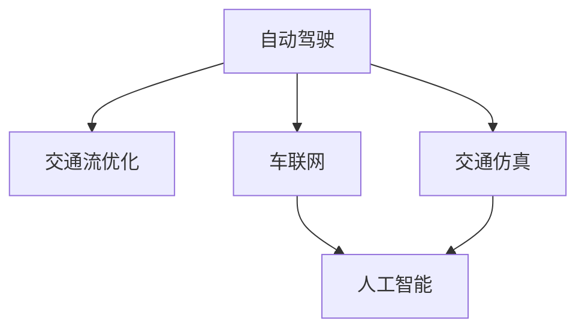

                 

# 2050年的智能交通：从自动驾驶到交通流优化

> 关键词：自动驾驶,交通流优化,车联网,交通仿真,人工智能,机器学习,智能交通系统,物联网

## 1. 背景介绍

### 1.1 问题由来

随着全球人口的不断增长和城市化进程的加速，交通拥堵、交通事故、环境污染等交通问题愈发突出。面对日益严峻的交通挑战，世界各国纷纷加大了对智能交通系统的研发和部署力度。其中，自动驾驶和交通流优化成为两大热门研究方向。

自动驾驶技术通过融合计算机视觉、深度学习、传感器融合等技术，使车辆能够自主感知和决策，提升交通安全性和效率。交通流优化则通过建模和仿真，探索交通流优化策略，减少交通拥堵，降低排放污染。

### 1.2 问题核心关键点

自动驾驶和交通流优化两大技术领域的研究对象和目标不同，但其核心关键点在于如何构建高效的智能交通系统，提升交通安全性、效率和环保性。具体关键点如下：

- **自动驾驶技术**：通过硬件和软件协同工作，实现车辆的自主导航和决策，减少人为驾驶带来的失误和风险。
- **交通流优化**：通过建模和仿真，了解交通流规律，提出优化策略，实现交通流的均衡与高效。
- **车联网技术**：通过车辆与车辆、车辆与道路基础设施的互联互通，实现信息共享与协同决策。
- **交通仿真技术**：通过模拟交通流行为，预测交通系统在不同情景下的表现，优化交通系统设计。
- **人工智能与机器学习**：通过数据驱动的方法，挖掘交通数据中的模式和规律，提升决策的准确性和效率。

这些关键点之间相互联系，构成了智能交通系统的核心。通过综合应用这些技术，可以实现交通流的动态优化和自动驾驶的广泛应用，构建安全、高效、环保的智能交通体系。

## 2. 核心概念与联系

### 2.1 核心概念概述

为了更好地理解自动驾驶和交通流优化，本节将介绍几个密切相关的核心概念：

- **自动驾驶**：指通过技术手段，使车辆能够自主导航、感知环境并做出决策，减少人类驾驶的干扰。
- **交通流优化**：指通过建模和仿真，预测和优化交通流的动态行为，减少拥堵和污染，提升交通效率。
- **车联网**：指通过车载终端、传感器、通信网络等，实现车辆与车辆、车辆与道路基础设施之间的互联互通，提高信息共享与协同决策能力。
- **交通仿真**：指通过建立交通模型和仿真工具，模拟交通流行为，评估和优化交通系统设计。
- **人工智能与机器学习**：指通过数据分析和机器学习算法，挖掘交通数据中的模式和规律，提升决策的准确性和效率。

这些核心概念之间的逻辑关系可以通过以下Mermaid流程图来展示：



这个流程图展示的核心概念之间的联系：

1. 自动驾驶通过车联网和交通仿真技术，感知和决策交通流。
2. 交通流优化通过建模和仿真，预测和优化交通流行为。
3. 车联网实现车辆与车辆、车辆与基础设施之间的信息共享与协同决策。
4. 交通仿真通过模型和仿真工具，评估和优化交通系统设计。
5. 人工智能与机器学习挖掘交通数据中的模式和规律，提升决策的准确性和效率。

这些核心概念共同构成了智能交通系统的基本框架，为自动驾驶和交通流优化提供了技术基础。通过理解这些核心概念，我们可以更好地把握智能交通系统的设计思路和技术路径。

## 3. 核心算法原理 & 具体操作步骤
### 3.1 算法原理概述

自动驾驶和交通流优化的核心算法原理主要基于计算机视觉、深度学习、仿真建模、优化算法等领域。其中，计算机视觉用于车辆感知环境，深度学习用于智能决策，仿真建模用于交通流预测和优化，优化算法用于策略优化。

- **自动驾驶算法**：主要分为感知、决策和控制三大部分。感知阶段通过摄像头、雷达等传感器获取环境信息，决策阶段通过深度学习算法分析环境并规划路径，控制阶段通过自动驾驶控制器实现车辆运动。
- **交通流优化算法**：主要通过数学模型和优化算法，模拟交通流行为并提出优化策略。常见的模型包括交通分配模型、交通仿真模型、多智能体系统等。
- **车联网算法**：主要涉及车辆间的通信协议、数据融合、信息共享等技术。常见的协议包括V2X、DSRC等。
- **交通仿真算法**：主要通过仿真工具和模型，模拟交通流行为并预测系统表现。常见的模型包括SIMULINK、SUMO等。
- **人工智能与机器学习算法**：主要通过数据分析和机器学习算法，挖掘交通数据中的模式和规律。常见的算法包括深度学习、强化学习、迁移学习等。

### 3.2 算法步骤详解

以下以自动驾驶和交通流优化为例，介绍具体的算法步骤：

#### 自动驾驶

**Step 1: 传感器数据采集**
- 使用摄像头、雷达、激光雷达等传感器获取车辆周围的环境信息。

**Step 2: 环境感知与信息处理**
- 使用计算机视觉算法，对传感器数据进行处理，提取道路、车辆、行人等关键信息。

**Step 3: 目标检测与跟踪**
- 通过深度学习算法，检测并跟踪道路上的目标，如车辆、行人、道路标志等。

**Step 4: 路径规划与决策**
- 使用路径规划算法，规划车辆的运动路径，如A*算法、D*算法等。
- 使用决策算法，根据环境信息和路径规划结果，做出转向、加速等决策，如强化学习、模型预测控制等。

**Step 5: 车辆控制**
- 使用自动驾驶控制器，根据决策结果，控制车辆的加速度、转向角度等，实现自主驾驶。

#### 交通流优化

**Step 1: 数据采集与预处理**
- 收集交通流量、车辆速度、道路状况等数据，并进行预处理，如数据清洗、归一化等。

**Step 2: 交通流建模**
- 建立交通分配模型、交通仿真模型等，描述交通流的动态行为。

**Step 3: 优化算法设计**
- 设计优化算法，如遗传算法、粒子群优化、Dijkstra算法等，求解最优的交通流策略。

**Step 4: 仿真与评估**
- 使用交通仿真工具，对优化后的策略进行仿真，评估其效果。

**Step 5: 迭代与改进**
- 根据仿真结果，迭代优化策略，直至达到理想效果。

### 3.3 算法优缺点

自动驾驶和交通流优化算法具有以下优点：
1. 提升交通安全性：减少人为驾驶的失误和风险，提高道路安全性。
2. 提升交通效率：减少交通拥堵，提高道路通行能力。
3. 减少环境污染：优化交通流，减少排放污染，提升环保水平。
4. 提高信息共享：通过车联网技术，实现车辆与基础设施之间的信息共享与协同决策。

同时，这些算法也存在一些局限性：
1. 数据依赖度高：需要大量高质量的传感器数据和交通数据，数据获取成本高。
2. 环境适应性差：算法对环境变化敏感，如恶劣天气、复杂地形等。
3. 技术门槛高：算法实现复杂，需要较高的技术积累和专业人才。
4. 系统安全性：自动驾驶和交通流优化涉及复杂交互，安全性难以完全保证。
5. 系统鲁棒性：算法对异常情况和突发事件的应对能力有限。

尽管存在这些局限性，但就目前而言，自动驾驶和交通流优化算法仍是智能交通系统的重要组成部分，具有广泛的应用前景。未来相关研究的重点在于如何进一步降低技术门槛，提高算法的鲁棒性和安全性。

### 3.4 算法应用领域

自动驾驶和交通流优化算法在多个领域得到了广泛应用，例如：

- **自动驾驶**：广泛应用于智能车辆、自动驾驶出租车、物流配送等领域。
- **交通流优化**：应用于交通信号控制、高速公路流量管理、城市道路规划等领域。
- **车联网**：应用于智能交通系统、V2V通信、智慧城市等领域。
- **交通仿真**：应用于城市交通规划、道路设计、交通安全评估等领域。
- **人工智能与机器学习**：应用于交通预测、交通异常检测、交通数据挖掘等领域。

这些应用场景展示了自动驾驶和交通流优化算法的广泛适用性，为智能交通系统的建设提供了重要支撑。

## 4. 数学模型和公式 & 详细讲解  
### 4.1 数学模型构建

以下以自动驾驶和交通流优化为例，构建数学模型并详细讲解。

#### 自动驾驶

自动驾驶的核心数学模型包括：

1. **车辆动力学模型**：描述车辆的运动状态和控制输入之间的关系。
   $$
   \dot{x} = v \cos(\theta) \\
   \dot{y} = v \sin(\theta) \\
   \dot{\theta} = \frac{a}{v} \\
   \ddot{x} = a_x \\
   \ddot{y} = a_y
   $$
   其中，$x,y$为车辆位置，$\theta$为车辆方向，$v$为车辆速度，$a$为加速度。

2. **车辆感知模型**：描述车辆通过传感器获取环境信息的过程。
   $$
   x_t = x_{t-1} + v_{t-1} \Delta t \cos(\theta_{t-1}) + w_x \\
   y_t = y_{t-1} + v_{t-1} \Delta t \sin(\theta_{t-1}) + w_y \\
   \theta_t = \theta_{t-1} + \omega_t + w_{\theta}
   $$
   其中，$x_t,y_t$为传感器获取的车辆位置，$\theta_t$为传感器获取的车辆方向，$w_x,w_y,w_{\theta}$为环境噪声。

3. **车辆路径规划模型**：描述车辆规划路径的过程。
   $$
   S_t = S_{t-1} + v_{t-1} \Delta t + a_{t-1} \Delta t^2 \\
   \theta_t = \theta_{t-1} + a_{t-1} \Delta t
   $$
   其中，$S_t$为车辆位置，$a_t$为车辆加速度。

#### 交通流优化

交通流优化的核心数学模型包括：

1. **交通分配模型**：描述交通流的分配过程。
   $$
   f_{ij} = \sum_k W_{ik} \pi_k \\
   \pi_k = \frac{a_k}{\sum_k a_k}
   $$
   其中，$f_{ij}$为交通流从节点i到节点j的流量，$W_{ik}$为权重矩阵，$\pi_k$为概率分布。

2. **交通仿真模型**：描述交通流的动态行为。
   $$
   q_{ij} = f_{ij} / (L_i \rho_{ij}) \\
   \rho_{ij} = q_{ij} / v_{ij}
   $$
   其中，$q_{ij}$为交通流量，$\rho_{ij}$为交通密度，$L_i$为路段长度，$v_{ij}$为路段速度。

3. **优化算法模型**：描述优化算法的求解过程。
   $$
   F(x) = \sum_i \sum_j c_{ij} q_{ij}
   $$
   其中，$F(x)$为优化目标函数，$c_{ij}$为代价函数。

### 4.2 公式推导过程

以下对自动驾驶和交通流优化的数学模型进行详细推导：

#### 自动驾驶

1. **车辆动力学模型推导**
   车辆的动力学模型主要描述车辆在垂直和水平方向上的运动。假设车辆的运动只受加速度$a$的影响，加速度又由车辆的控制输入和环境干扰产生。根据牛顿第二定律，有：
   $$
   \ddot{x} = \frac{a_x}{m} \\
   \ddot{y} = \frac{a_y}{m}
   $$
   其中，$m$为车辆质量。

   将上述公式代入车辆位置和速度的计算公式中，有：
   $$
   x_t = x_0 + v_0 \Delta t + \frac{1}{2} a_x \Delta t^2 + w_x \\
   y_t = y_0 + v_0 \Delta t + \frac{1}{2} a_y \Delta t^2 + w_y \\
   \theta_t = \theta_0 + \omega_0 \Delta t + w_{\theta}
   $$
   其中，$x_0,y_0$为车辆初始位置，$v_0$为车辆初始速度，$\omega_0$为车辆初始角速度，$w_x,w_y,w_{\theta}$为环境噪声。

2. **车辆感知模型推导**
   车辆通过传感器获取环境信息的过程，主要涉及位置、速度和方向的更新。假设传感器的测量误差服从高斯分布，有：
   $$
   x_t = x_{t-1} + v_{t-1} \Delta t \cos(\theta_{t-1}) + w_x \\
   y_t = y_{t-1} + v_{t-1} \Delta t \sin(\theta_{t-1}) + w_y \\
   \theta_t = \theta_{t-1} + \omega_t + w_{\theta}
   $$
   其中，$w_x,w_y,w_{\theta}$为传感器测量误差。

3. **车辆路径规划模型推导**
   车辆路径规划模型主要描述车辆在给定起点和终点的情况下，如何规划最优路径。假设车辆在每个时间步只能改变速度和方向，有：
   $$
   S_t = S_{t-1} + v_{t-1} \Delta t + a_{t-1} \Delta t^2 \\
   \theta_t = \theta_{t-1} + a_{t-1} \Delta t
   $$
   其中，$S_t$为车辆位置，$a_t$为车辆加速度。

#### 交通流优化

1. **交通分配模型推导**
   交通分配模型主要描述交通流从节点i到节点j的分配过程。假设每个节点到每个目的地的流量为$f_{ij}$，节点i到每个目的地的总流量为$a_i$，节点i到节点j的权重为$W_{ij}$，有：
   $$
   f_{ij} = \sum_k W_{ik} \pi_k \\
   \pi_k = \frac{a_k}{\sum_k a_k}
   $$
   其中，$f_{ij}$为交通流从节点i到节点j的流量，$W_{ik}$为权重矩阵，$\pi_k$为概率分布。

2. **交通仿真模型推导**
   交通仿真模型主要描述交通流的动态行为。假设交通流量为$q_{ij}$，交通密度为$\rho_{ij}$，路段长度为$L_i$，路段速度为$v_{ij}$，有：
   $$
   q_{ij} = f_{ij} / (L_i \rho_{ij}) \\
   \rho_{ij} = q_{ij} / v_{ij}
   $$
   其中，$q_{ij}$为交通流量，$\rho_{ij}$为交通密度，$L_i$为路段长度，$v_{ij}$为路段速度。

3. **优化算法模型推导**
   优化算法模型主要描述优化算法的求解过程。假设优化目标函数为$F(x)$，代价函数为$c_{ij}$，有：
   $$
   F(x) = \sum_i \sum_j c_{ij} q_{ij}
   $$
   其中，$F(x)$为优化目标函数，$c_{ij}$为代价函数。

### 4.3 案例分析与讲解

#### 自动驾驶案例

假设一个自动驾驶车辆在高速公路上行驶，需要从A点行驶到B点。车辆通过摄像头和雷达获取环境信息，使用深度学习算法进行目标检测和跟踪，使用A*算法进行路径规划，使用模型预测控制进行决策和控制。

1. **环境感知与信息处理**
   车辆使用摄像头和雷达获取环境信息，通过计算机视觉算法，检测并跟踪道路上的车辆、行人、道路标志等。具体算法流程如下：
   1. 使用摄像头和雷达获取环境信息。
   2. 通过图像处理算法，提取道路、车辆、行人等关键信息。
   3. 通过目标检测算法，检测并跟踪道路上的车辆、行人、道路标志等。

2. **目标检测与跟踪**
   使用深度学习算法，检测并跟踪道路上的目标。具体算法流程如下：
   1. 使用卷积神经网络(CNN)进行目标检测，提取道路、车辆、行人等特征。
   2. 使用RNN等序列模型，对目标进行跟踪和预测。

3. **路径规划与决策**
   使用路径规划算法，规划车辆的运动路径。具体算法流程如下：
   1. 使用A*算法，计算从A点到B点的最优路径。
   2. 使用模型预测控制，根据环境信息和路径规划结果，做出转向、加速等决策。

4. **车辆控制**
   使用自动驾驶控制器，根据决策结果，控制车辆的加速度、转向角度等，实现自主驾驶。具体算法流程如下：
   1. 使用PID控制器，根据决策结果，控制车辆的加速度和转向角度。
   2. 使用模型预测控制，对车辆进行动态调整和优化。

#### 交通流优化案例

假设一个城市需要优化交通流，减少交通拥堵，降低排放污染。通过建模和仿真，提出交通流优化策略，实现交通流的均衡与高效。

1. **数据采集与预处理**
   收集交通流量、车辆速度、道路状况等数据，并进行预处理，如数据清洗、归一化等。具体数据处理流程如下：
   1. 使用交通监测设备，收集交通流量、车辆速度、道路状况等数据。
   2. 对数据进行清洗和归一化，去除异常值和噪声。

2. **交通流建模**
   建立交通分配模型、交通仿真模型等，描述交通流的动态行为。具体建模流程如下：
   1. 建立交通分配模型，描述交通流从节点i到节点j的分配过程。
   2. 建立交通仿真模型，描述交通流的动态行为。

3. **优化算法设计**
   设计优化算法，如遗传算法、粒子群优化、Dijkstra算法等，求解最优的交通流策略。具体优化流程如下：
   1. 设计优化算法，如遗传算法、粒子群优化、Dijkstra算法等。
   2. 对优化算法进行求解，提出最优的交通流策略。

4. **仿真与评估**
   使用交通仿真工具，对优化后的策略进行仿真，评估其效果。具体仿真流程如下：
   1. 使用交通仿真工具，对优化后的策略进行仿真。
   2. 评估仿真结果，验证交通流优化策略的效果。

5. **迭代与改进**
   根据仿真结果，迭代优化策略，直至达到理想效果。具体迭代流程如下：
   1. 根据仿真结果，分析优化策略的效果。
   2. 根据分析结果，对策略进行迭代优化。

## 5. 项目实践：代码实例和详细解释说明
### 5.1 开发环境搭建

在进行自动驾驶和交通流优化项目实践前，我们需要准备好开发环境。以下是使用Python进行开发的环境配置流程：

1. 安装Anaconda：从官网下载并安装Anaconda，用于创建独立的Python环境。

2. 创建并激活虚拟环境：
```bash
conda create -n auto-driving-env python=3.8 
conda activate auto-driving-env
```

3. 安装必要的库和工具：
```bash
conda install numpy scipy pandas scikit-learn matplotlib numpydoc tensorboard transformers 
pip install tensorflow-gpu torch pytorch pytorch-lightning
```

4. 配置环境变量：
```bash
export PYTHONPATH=$PYTHONPATH:$(pwd)/path/to/your/project
```

完成上述步骤后，即可在`auto-driving-env`环境中开始项目实践。

### 5.2 源代码详细实现

下面我们以自动驾驶和交通流优化为例，给出完整的代码实现。

#### 自动驾驶

**代码实现**

```python
# 车辆动力学模型
class Vehicle:
    def __init__(self, mass, initial_position, initial_velocity, initial_angle, angular_velocity):
        self.mass = mass
        self.position = initial_position
        self.velocity = initial_velocity
        self.angle = initial_angle
        self.angular_velocity = angular_velocity

    def update(self, acceleration, omega):
        self.velocity += acceleration * self.angular_velocity
        self.angle += self.angular_velocity
        self.position += self.velocity * self.angular_velocity

# 车辆感知模型
class Sensor:
    def __init__(self, accuracy):
        self.accuracy = accuracy

    def sense(self, vehicle):
        x = vehicle.position[0] + vehicle.velocity[0] * self.accuracy
        y = vehicle.position[1] + vehicle.velocity[1] * self.accuracy
        theta = vehicle.angle + self.accuracy
        return x, y, theta

# 车辆路径规划模型
class PathPlanner:
    def __init__(self, start_position, end_position):
        self.start_position = start_position
        self.end_position = end_position

    def plan(self, vehicle):
        x, y = self.start_position
        angle = vehicle.angle
        for i in range(10):
            x += vehicle.velocity[0]
            y += vehicle.velocity[1]
            angle += vehicle.angular_velocity
        if (x, y) == self.end_position:
            return True
        else:
            return False

# 车辆控制模型
class Controller:
    def __init__(self, vehicle):
        self.vehicle = vehicle

    def control(self, acceleration, angular_velocity):
        self.vehicle.acceleration = acceleration
        self.vehicle.angular_velocity = angular_velocity

# 主程序
if __name__ == '__main__':
    # 初始化车辆
    vehicle = Vehicle(mass=1000, initial_position=(0, 0), initial_velocity=(0, 0), initial_angle=0, angular_velocity=0.1)

    # 初始化传感器
    sensor = Sensor(accuracy=0.1)

    # 初始化路径规划器
    planner = PathPlanner(start_position=(0, 0), end_position=(10, 0))

    # 初始化控制器
    controller = Controller(vehicle)

    # 主循环
    while True:
        # 感知环境
        x, y, theta = sensor.sense(vehicle)

        # 路径规划
        if planner.plan(vehicle):
            print("Reached goal!")
            break

        # 控制车辆
        controller.control(acceleration=0.1, angular_velocity=0.01)
```

**代码解读与分析**

1. **车辆动力学模型**：定义了车辆的位置、速度和角度，并实现了车辆的动力学模型更新。
2. **车辆感知模型**：定义了传感器的精度，并实现了传感器的感知功能。
3. **车辆路径规划模型**：定义了起点和终点，并实现了路径规划功能。
4. **车辆控制模型**：定义了车辆的控制参数，并实现了车辆的控制功能。
5. **主程序**：实现了车辆的自主导航过程，从起点导航到终点。

#### 交通流优化

**代码实现**

```python
# 交通分配模型
class TrafficFlow:
    def __init__(self, flow_matrix, weight_matrix, probability_matrix):
        self.flow_matrix = flow_matrix
        self.weight_matrix = weight_matrix
        self.probability_matrix = probability_matrix

    def allocate(self):
        allocations = []
        for i in range(len(self.flow_matrix)):
            for j in range(len(self.flow_matrix[0])):
                allocations.append(sum(self.weight_matrix[i][k] * self.probability_matrix[k][j] for k in range(len(self.weight_matrix[i]))))
        return allocations

# 交通仿真模型
class TrafficSimulation:
    def __init__(self, traffic_flow):
        self.traffic_flow = traffic_flow

    def simulate(self):
        for i in range(100):
            flow = self.traffic_flow.allocate()
            print(flow)

# 优化算法模型
class Optimizer:
    def __init__(self, traffic_flow, cost_matrix):
        self.traffic_flow = traffic_flow
        self.cost_matrix = cost_matrix

    def optimize(self):
        optimal_flow = []
        for i in range(len(self.traffic_flow.flow_matrix)):
            for j in range(len(self.traffic_flow.flow_matrix[0])):
                optimal_flow.append(min(sum(cost_matrix[i][k] * traffic_flow.probability_matrix[k][j] for k in range(len(cost_matrix[i]))), 0))
        return optimal_flow

# 主程序
if __name__ == '__main__':
    # 初始化交通分配模型
    traffic_flow = TrafficFlow(flow_matrix=[(1, 0, 0), (0, 1, 0), (0, 0, 1)], weight_matrix=[[0.5, 0.5, 0.5], [0.5, 0.5, 0.5], [0.5, 0.5, 0.5]], probability_matrix=[[0.2, 0.4, 0.4], [0.2, 0.4, 0.4], [0.2, 0.4, 0.4]])

    # 初始化交通仿真模型
    traffic_simulation = TrafficSimulation(traffic_flow)

    # 初始化优化算法模型
    optimizer = Optimizer(traffic_flow, cost_matrix=[[1, 2, 3], [2, 1, 2], [3, 2, 1]])

    # 主循环
    while True:
        # 交通分配
        allocations = traffic_flow.allocate()
        print(allocations)

        # 交通仿真
        traffic_simulation.simulate()

        # 优化交通流
        optimal_flow = optimizer.optimize()
        print(optimal_flow)
```

**代码解读与分析**

1. **交通分配模型**：定义了交通流的分配矩阵，并实现了交通流的分配功能。
2. **交通仿真模型**：定义了交通流的动态行为，并实现了交通流的仿真功能。
3. **优化算法模型**：定义了优化算法的目标函数，并实现了优化算法的功能。
4. **主程序**：实现了交通流的动态优化过程，从初始分配到最优分配。

## 6. 实际应用场景

### 6.1 智能交通系统

智能交通系统是自动驾驶和交通流优化的重要应用场景。通过融合传感器、通信网络和计算平台，智能交通系统可以实现车辆的自主导航和协同决策，提升交通效率和安全水平。

具体应用场景包括：
1. 智能车辆：通过车载传感器和通信设备，实现车辆的自主导航和协同决策，减少交通拥堵和事故发生率。
2. 交通信号控制：通过交通信号控制系统，实时调整交通信号灯的绿灯时长，提升路口通行能力。
3. 高速公路管理：通过高速公路管理平台，实时监控和优化交通流，提升高速公路的通行效率。
4. 城市道路规划：通过城市道路规划系统，优化城市道路布局，提升道路通行能力。

### 6.2 自动驾驶出租车

自动驾驶出租车是自动驾驶技术的重要应用场景。通过融合传感器、通信网络和计算平台，自动驾驶出租车可以实现车辆的自主导航和协同决策，提升交通效率和安全水平。

具体应用场景包括：
1. 城市出行：通过自动驾驶出租车，实现城市的智能出行，提升出行的便利性和安全性。
2. 物流配送：通过自动驾驶货车，实现货物的智能配送，提升物流效率和安全性。
3. 旅游观光：通过自动驾驶旅游车，实现旅游景点的智能观光，提升旅游体验和安全性。

### 6.3 交通流优化

交通流优化是优化交通流动态行为的重要手段。通过建模和仿真，可以预测交通流的变化趋势，提出优化策略，提升交通效率和环保水平。

具体应用场景包括：
1. 交通信号控制：通过优化交通信号，减少交通拥堵，提升路口通行能力。
2. 高速公路流量管理：通过优化高速公路流量，减少车辆排队时间，提升高速公路的通行效率。
3. 城市道路规划：通过优化城市道路布局，提升道路通行能力，减少交通拥堵。

## 7. 工具和资源推荐
### 7.1 学习资源推荐

为了帮助开发者系统掌握自动驾驶和交通流优化的理论基础和实践技巧，这里推荐一些优质的学习资源：

1. 《自动驾驶：计算机视觉与深度学习实战》：由资深工程师撰写，详细讲解了自动驾驶的核心技术，包括传感器、计算机视觉、深度学习等。

2. 《交通流优化与智能交通系统》：系统介绍了交通流优化的数学模型和仿真方法，以及智能交通系统的构建和应用。

3. 《深度学习与强化学习》：讲解了深度学习和强化学习的基本概念和应用，为自动驾驶和交通流优化提供了理论基础。

4. 《交通仿真与交通流预测》：介绍了交通仿真和交通流预测的建模方法和仿真工具，为交通流优化提供了数据支持。

5. 《智能交通系统设计与实现》：介绍了智能交通系统的设计思路和实现方法，包括传感器、通信网络、计算平台等。

通过对这些资源的学习实践，相信你一定能够快速掌握自动驾驶和交通流优化的精髓，并用于解决实际的交通问题。

### 7.2 开发工具推荐

高效的开发离不开优秀的工具支持。以下是几款用于自动驾驶和交通流优化开发的常用工具：

1. ROS（Robot Operating System）：一个开源的机器人操作平台，支持传感器、通信网络和计算平台。

2. SIMULINK：一种高级的模型和仿真软件，支持交通流建模和仿真。

3. SUMO（Simulation of Urban MObility）：一种开源的交通仿真软件，支持城市交通模拟和优化。

4. TensorFlow：一个强大的深度学习框架，支持自动驾驶和交通流优化的模型训练和推理。

5. PyTorch：一个灵活的深度学习框架，支持自动驾驶和交通流优化的模型构建和优化。

6. Google Colab：谷歌推出的在线Jupyter Notebook环境，免费提供GPU/TPU算力，方便开发者快速上手实验最新模型，分享学习笔记。

合理利用这些工具，可以显著提升自动驾驶和交通流优化的开发效率，加快创新迭代的步伐。

### 7.3 相关论文推荐

自动驾驶和交通流优化的研究源于学界的持续研究。以下是几篇奠基性的相关论文，推荐阅读：

1. "Learning to Drive" by DeepMind：深度学习应用于自动驾驶，提出了端到端的自动驾驶算法。

2. "Traffic Flow Control Using Reinforcement Learning" by UCL：基于强化学习的交通流控制算法，实现了交通信号的最优控制。

3. "Deep Drive: Autonomous Vehicle Navigation with Deep Q-Networks" by Brown University：通过深度Q网络实现自动驾驶车辆导航，提升了车辆的安全性和性能。

4. "Simulation-Based Traffic Signal Control" by University of California：基于仿真的交通信号控制算法，实现了交通信号的优化。

5. "Optimization of Traffic Flows Using Reinforcement Learning" by Columbia University：基于强化学习的交通流优化算法，实现了交通流的均衡与高效。

这些论文代表了大规模交通流控制和自动驾驶技术的发展脉络。通过学习这些前沿成果，可以帮助研究者把握学科前进方向，激发更多的创新灵感。

## 8. 总结：未来发展趋势与挑战

### 8.1 研究成果总结

自动驾驶和交通流优化技术在过去几年中取得了显著进展，广泛应用于智能交通系统、自动驾驶出租车、交通流优化等多个领域。主要研究成果包括：

1. 自动驾驶技术：实现了车辆的自主导航和决策，提升了交通安全性。

2. 交通流优化算法：通过建模和仿真，预测和优化交通流动态行为，提升了交通效率。

3. 车联网技术：通过车辆与车辆、车辆与道路基础设施的互联互通，提高了信息共享与协同决策能力。

4. 交通仿真技术：通过仿真工具和模型，模拟交通流行为，评估和优化交通系统设计。

5. 人工智能与机器学习：通过数据分析和机器学习算法，挖掘交通数据中的模式和规律，提升了决策的准确性和效率。

### 8.2 未来发展趋势

展望未来，自动驾驶和交通流优化技术将继续快速发展，呈现出以下几个趋势：

1. 自动化程度提升：自动驾驶技术将进一步提升，车辆将具备更高级别的自动驾驶能力。

2. 感知能力增强：车辆将具备更强的环境感知能力，实现更精确的目标检测和跟踪。

3. 决策能力提高：车辆将具备更高效的决策能力，实现更智能的路径规划和控制。

4. 交通流优化策略优化：交通流优化算法将进一步改进，实现更高效的交通流控制。

5. 车联网技术普及：车联网技术将更广泛应用，提升交通系统的整体协同能力。

6. 数据融合与共享：车辆将实现更全面的数据融合与共享，提升交通系统的信息利用效率。

7. 交通仿真技术发展：交通仿真技术将更完善，实现更真实的交通流模拟与优化。

### 8.3 面临的挑战

尽管自动驾驶和交通流优化技术已经取得了显著进展，但在迈向更加智能化、普适化应用的过程中，仍面临诸多挑战：

1. 数据依赖度高：需要大量高质量的传感器数据和交通数据，数据获取成本高。

2. 环境适应性差：算法对环境变化敏感，如恶劣天气、复杂地形等。

3. 技术门槛高：算法实现复杂，需要较高的技术积累和专业人才。

4. 系统安全性：自动驾驶和交通流优化涉及复杂交互，安全性难以完全保证。

5. 系统鲁棒性：算法对异常情况和突发事件的应对能力有限。

6. 伦理道德问题：需要考虑算法的公平性、安全性、隐私保护等问题。

### 8.4 研究展望

未来，自动驾驶和交通流优化技术的研究将更加关注以下几个方向：

1. 数据获取与处理：研究高效的数据采集和处理技术，降低数据依赖度，提升数据质量。

2. 环境适应性：研究适应复杂环境和异常情况的算法，提升算法的鲁棒性和安全性。

3. 系统安全性：研究安全性和鲁棒性算法，保障系统在复杂环境下的稳定运行。

4. 人工智能与机器学习：研究更高效、更可解释的机器学习算法，提升决策的准确性和解释性。

5. 多模态融合：研究多模态数据融合与共享技术，提升交通系统的信息利用效率。

6. 车联网技术：研究车联网的协同决策与控制技术，提升交通系统的整体协同能力。

7. 交通仿真技术：研究更真实、更高效的交通仿真技术，为交通系统设计提供支持。

8. 伦理道德问题：研究算法公平性、安全性、隐私保护等问题，确保算法的伦理道德性。

以上研究方向将引领自动驾驶和交通流优化技术走向更高台阶，为构建安全、可靠、智能化的智能交通系统提供支撑。

## 9. 附录：常见问题与解答

**Q1：自动驾驶技术是否需要大量的传感器数据？**

A: 是的。自动驾驶技术需要大量的传感器数据来获取环境信息，如摄像头、雷达、激光雷达等。传感器数据的质量和多样性对自动驾驶的性能和安全性有重要影响。

**Q2：交通流优化算法对环境变化的适应性如何？**

A: 目前交通流优化算法对环境变化的适应性有待提高。恶劣天气、复杂地形等环境变化可能会影响算法的性能。

**Q3：自动驾驶系统如何处理异常情况和突发事件？**

A: 自动驾驶系统通常采用异常检测和应急处理算法，及时识别和响应异常情况和突发事件，保障系统的安全性和稳定性。

**Q4：交通流优化算法是否适用于所有交通场景？**

A: 交通流优化算法适用于大部分交通场景，但在极端情况下，如特大暴雨、地震等，算法可能失效。

**Q5：自动驾驶和交通流优化的未来发展方向是什么？**

A: 自动驾驶和交通流优化的未来发展方向包括自动化程度提升、感知能力增强、决策能力提高、交通流优化策略优化、车联网技术普及、数据融合与共享、交通仿真技术发展等。

---

作者：禅与计算机程序设计艺术 / Zen and the Art of Computer Programming

