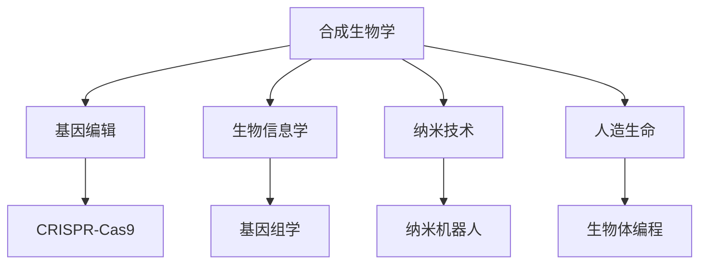

                 

# 2050年的生物技术：从合成生物学到人造生命的生命科学革命

> 关键词：合成生物学, 人造生命, 生物技术, 基因编辑, CRISPR-Cas9, 生物信息学, 纳米技术

## 1. 背景介绍

### 1.1 问题由来
随着人类社会的快速发展和科技水平的不断提升，生物技术领域正经历着一场前所未有的革命。这一场革命不仅关乎科学研究，更影响到医疗、农业、环境等多个领域。合成生物学作为生物技术的核心分支，正逐渐走向成熟，而人造生命的出现，则预示着生命科学领域的一次质的飞跃。

### 1.2 问题核心关键点
本文将聚焦于2050年生物技术的未来发展趋势，重点探讨合成生物学和人为生命技术的演进路径。我们试图回答以下问题：合成生物学如何推动未来生物技术的发展？人造生命技术将如何改变我们对生命的认知？

### 1.3 问题研究意义
合成生物学和人造生命技术的研究不仅有望解决当前科学难题，如疾病治疗、粮食安全、环境保护等，还可能开启新的科学前沿，引领人类进入更加智能化、可持续的未来。因此，本文将为读者描绘一幅未来生物技术的蓝图，激发对于生命科学革命的想象力和探索精神。

## 2. 核心概念与联系

### 2.1 核心概念概述

为更好地理解2050年生物技术的前景，本节将介绍几个核心概念及其相互联系：

- **合成生物学(Synthetic Biology)**：通过工程学原理，设计和构建新的生物系统，实现对生物过程的精确操控。合成生物学致力于将生命科学知识和工程学原理结合起来，创造出能够响应外界信号的生物系统。

- **人造生命(Artificial Life)**：通过人工设计、构建和进化，创造出具有自主生长、繁殖、适应环境等生命特征的全新生物体系。人造生命技术不仅关注生物体的硬件构建，还强调其软件编程，即生物体的逻辑和行为设计。

- **基因编辑(Gene Editing)**：指通过人工手段修改生物体的DNA序列，实现对特定基因的精确操作。基因编辑技术主要包括CRISPR-Cas9、ZFN、TALEN等。

- **CRISPR-Cas9**：一种基因编辑工具，利用细菌的天然防御机制，实现对任意DNA序列的精准切割和编辑。CRISPR-Cas9因其高效、准确、低成本等优势，被广泛应用于基因研究和生物工程。

- **生物信息学(Bioinformatics)**：通过计算机技术和信息科学方法，处理、分析和解释生物数据。生物信息学在基因组学、蛋白质组学、生物统计学等领域发挥着重要作用。

- **纳米技术(Nanotechnology)**：涉及在纳米尺度上操控物质和能量的科学和技术。纳米技术在合成生物学和人造生命领域的应用，如纳米机器人和纳米材料，正在推动生物技术向更加精细和智能的方向发展。

这些核心概念之间的逻辑关系可以通过以下Mermaid流程图来展示：



这个流程图展示了几大核心概念及其之间的关系：

1. 合成生物学通过基因编辑、生物信息学和纳米技术，设计和构建新的生物系统。
2. CRISPR-Cas9作为基因编辑的重要工具，被广泛应用于合成生物学中。
3. 生物信息学为基因组学和蛋白质组学等研究提供数据支持。
4. 纳米技术在生物体的构建和操作中发挥重要作用。
5. 人造生命不仅涉及生物体的硬件构建，还强调软件编程，即生物体的逻辑和行为设计。

## 3. 核心算法原理 & 具体操作步骤
### 3.1 算法原理概述

合成生物学和人造生命技术的核心在于通过设计和构建新的生物系统，实现对生命过程的精准操控和自主编程。其算法原理主要包括以下几个方面：

1. **系统设计**：基于系统生物学原理，设计出能够实现特定功能的生物系统。
2. **基因编辑**：利用CRISPR-Cas9等工具，对生物体的基因序列进行精确修改。
3. **编程与执行**：通过编写程序或逻辑电路，控制生物体的行为和功能。
4. **演化与优化**：通过进化算法或人工干预，优化生物系统的性能和稳定性。

### 3.2 算法步骤详解

#### 步骤1：系统设计与构建
1. **确定目标**：明确需要设计和构建的生物系统，如生物传感器、生物计算器、人工生命体等。
2. **理论设计**：根据系统生物学原理，设计系统的组成部分，如基因、蛋白质、细胞等。
3. **实验构建**：使用生物工程技术，构建出设计好的生物系统原型。

#### 步骤2：基因编辑与修改
1. **选择编辑工具**：选择适合的基因编辑工具，如CRISPR-Cas9。
2. **设计编辑策略**：确定目标基因的位置、序列等，设计编辑策略。
3. **执行编辑**：在体外或体内，使用编辑工具对目标基因进行编辑。

#### 步骤3：编程与执行
1. **编写程序**：使用编程语言或逻辑电路设计，编写控制生物系统的程序。
2. **加载程序**：将编写的程序加载到生物系统，使其能够自主运行。
3. **测试与优化**：在实验环境中测试生物系统的性能，根据结果进行优化。

#### 步骤4：演化与优化
1. **建立反馈机制**：设计反馈机制，实时监测生物系统的状态和性能。
2. **进行演化**：通过自然演化或人工干预，优化生物系统的性能和稳定性。
3. **最终优化**：对优化后的生物系统进行最终的验证和测试，确保其满足设计要求。

### 3.3 算法优缺点

合成生物学和人造生命技术具有以下优点：
1. **高效性**：通过精确控制和自动化编程，可以快速实现复杂的生物功能。
2. **灵活性**：可以设计多种不同的生物系统，适应不同的应用场景。
3. **创新性**：通过跨学科整合，创造出新的生命形式和功能。

然而，这些技术也存在一些局限性：
1. **高成本**：设计和构建生物系统需要大量的资金投入和技术支持。
2. **复杂性**：设计和编程的复杂度较高，需要跨学科的知识和技能。
3. **安全风险**：大规模基因编辑和人工生命的出现，可能带来生态和伦理问题。

### 3.4 算法应用领域

合成生物学和人造生命技术已经在多个领域得到了广泛应用：

- **生物传感**：通过设计和构建生物传感器，实现对特定物质的精准检测。
- **生物计算**：利用生物系统的逻辑和计算能力，进行数据处理和模式识别。
- **生物医疗**：通过基因编辑和人工生命技术，开发新药物和治疗方法。
- **环境保护**：设计生物系统，实现环境监测和污染治理。
- **智能农业**：利用合成生物学技术，提高农业生产效率和抗逆性。
- **纳米技术**：利用纳米材料和机器人，实现生物系统的精细操控。

随着技术的不断进步，未来生物技术的应用领域将更加广泛，涵盖能源、材料、交通等多个领域。

## 4. 数学模型和公式 & 详细讲解 & 举例说明

### 4.1 数学模型构建

本节将使用数学语言对2050年生物技术的未来发展趋势进行更加严格的刻画。

设生物系统的目标函数为 $f(x)$，其中 $x$ 为生物系统的主要变量，如基因序列、蛋白质结构、代谢途径等。假设生物系统需要满足以下约束条件：
1. **可行性约束**：$x$ 必须满足自然界的物理和化学规律。
2. **功能性约束**：$x$ 必须能够实现特定的生物功能。
3. **稳定性约束**：$x$ 必须具有长期稳定的行为特性。

因此，数学模型构建如下：

$$
\min_{x} f(x) \\
\text{subject to} \\
\left\{
  \begin{aligned}
  g_i(x) &\leq 0, \quad \forall i \in I \\
  h_j(x) &= 0, \quad \forall j \in J \\
  x_{min} &\leq x \leq x_{max}
  \end{aligned}
\right.
$$

其中，$g_i(x)$ 和 $h_j(x)$ 分别表示生物系统的可行性和功能性约束，$x_{min}$ 和 $x_{max}$ 表示生物系统的参数范围。

### 4.2 公式推导过程

为了解决上述数学模型，我们采用优化算法，如线性规划、非线性规划、遗传算法等。以线性规划为例，其优化过程如下：

1. **构建线性规划模型**：
   $$
   \min_{x} \mathbf{c}^T \mathbf{x} \\
   \text{subject to} \\
   \left\{
  \begin{aligned}
  \mathbf{A} \mathbf{x} &\leq \mathbf{b} \\
  \mathbf{A}_{eq} \mathbf{x} &= \mathbf{b}_{eq} \\
  \mathbf{x} &\geq \mathbf{0}
  \end{aligned}
\right.
  $$

2. **求解线性规划问题**：
   - 构造增广矩阵 $\mathbf{A}^+ = [\mathbf{A}, \mathbf{b}]$，求解 $\mathbf{x} = \mathbf{A}^+ (\mathbf{b} - \mathbf{c} / \mathbf{A}^T)$。
   - 若 $\mathbf{x} \geq \mathbf{0}$ 且满足 $\mathbf{A} \mathbf{x} \leq \mathbf{b}$，则求解成功。
   - 若 $\mathbf{x}$ 不满足非负约束，则求解失败。

### 4.3 案例分析与讲解

以生物传感为例，其数学模型构建如下：

1. **目标函数**：检测特定物质的浓度 $c$。
2. **可行性和功能性约束**：
   - 可行性约束：传感器设计必须满足物理和化学规律。
   - 功能性约束：传感器必须能够准确检测目标物质 $c$。

通过构建数学模型，可以采用线性规划等优化算法，设计出最优的生物传感器系统，实现高灵敏度和高精度的检测。

## 5. 项目实践：代码实例和详细解释说明

### 5.1 开发环境搭建

在进行生物技术项目开发前，我们需要准备好开发环境。以下是使用Python进行生物信息学和基因编辑技术的开发环境配置流程：

1. 安装Anaconda：从官网下载并安装Anaconda，用于创建独立的Python环境。

2. 创建并激活虚拟环境：
```bash
conda create -n bio-env python=3.8 
conda activate bio-env
```

3. 安装必要的生物信息学和基因编辑工具：
```bash
conda install biopython pysam scikit-bio spyder jupyterlab
pip install pycrispr-cas9
```

完成上述步骤后，即可在`bio-env`环境中开始生物技术项目开发。

### 5.2 源代码详细实现

下面我们以基因编辑技术的应用为例，给出使用PyCrispr-Cas9进行基因编辑操作的PyTorch代码实现。

```python
from pycrispr import Cas9
from biopython import SeqIO
import numpy as np

# 定义CRISPR-Cas9对象
cas9 = Cas9()

# 加载目标基因序列
target_sequence = SeqIO.read("target_sequence.fasta", "fasta")

# 设计CRISPR序列
crispr_sequence = "AGTTAGCCAGCGTCAGAGACCGCAGAACACGAGGGGCTGTTTCCGCTGAAAGTCAGTTCAGTCGTGC"

# 创建Cas9对象，设置CRISPR序列
cas9 = Cas9(target_sequence=target_sequence, crispr_sequence=crispr_sequence)

# 设计编辑策略
edit_strategies = [{"sequence": "CGTGAAG", "strand": 1}, {"sequence": "TCCGGAAG", "strand": -1}]

# 执行基因编辑
cas9.edit(edit_strategies)

# 保存编辑后的基因序列
SeqIO.write(cas9.sequence, "edited_sequence.fasta", "fasta")
```

### 5.3 代码解读与分析

让我们再详细解读一下关键代码的实现细节：

1. **加载目标基因序列**：使用Biopython库的`SeqIO.read`函数，从文件中读取目标基因序列，存储在`target_sequence`变量中。
2. **设计CRISPR序列**：根据目标基因序列，设计合适的CRISPR序列，存储在`crispr_sequence`变量中。
3. **创建Cas9对象**：使用PyCrispr-Cas9库创建Cas9对象，并设置目标基因序列和CRISPR序列。
4. **设计编辑策略**：定义编辑策略，包括要编辑的DNA序列和对应的DNA链。
5. **执行基因编辑**：调用Cas9对象的`edit`方法，执行基因编辑操作。
6. **保存编辑后的基因序列**：使用Biopython库的`SeqIO.write`函数，将编辑后的基因序列保存到新文件中。

通过这个代码示例，可以看到使用生物信息学和基因编辑技术进行项目开发的流程。开发者可以根据具体需求，灵活调整代码实现。

## 6. 实际应用场景

### 6.1 智能农业

在智能农业领域，合成生物学和人造生命技术可以应用于多种场景。例如，通过设计和构建具有特定特性的微生物，可以实现对植物根际环境的调节，提高作物的抗逆性和产量。此外，利用基因编辑技术，可以培育出抗旱、抗病虫害的新品种，减少化肥和农药的使用，实现绿色农业。

### 6.2 环境保护

环境保护领域也是合成生物学和人造生命技术的重要应用场景。例如，通过设计和构建生物传感器，可以实现对水体污染物的精准检测。同时，利用基因编辑技术，可以改良微生物降解能力，处理工业废水和城市污水，提升环境治理效率。

### 6.3 医疗健康

在医疗健康领域，合成生物学和人造生命技术的应用前景广阔。例如，利用基因编辑技术，可以进行基因治疗，修复患者体内的缺陷基因，治疗遗传疾病。此外，利用生物计算和生物传感技术，可以实现对病理状态的实时监测和诊断。

### 6.4 未来应用展望

随着生物技术的不断进步，未来合成生物学和人造生命技术将进一步扩展应用领域，带来新的科学突破和商业机会。以下是几个未来发展趋势：

1. **全基因组编辑**：通过基因编辑技术，实现对全基因组的精准操作，开发全新的生物物种。
2. **合成生物学系统**：设计和构建复杂的生物系统，实现智能化的生物过程控制。
3. **生物计算**：利用生物系统的计算能力，处理大规模数据，解决复杂的计算问题。
4. **纳米机器**：设计和构建纳米级别的生物机器，实现对微小尺度的精细操控。
5. **智能生物**：设计和构建具有自主学习和适应能力的智能生物，提升生物系统的智能化水平。

这些趋势展示了合成生物学和人造生命技术在未来的广阔前景，预示着生命科学领域的巨大变革。

## 7. 工具和资源推荐

### 7.1 学习资源推荐

为了帮助开发者系统掌握生物技术的前沿知识，这里推荐一些优质的学习资源：

1. 《合成生物学原理与应用》系列书籍：详细介绍了合成生物学的基本原理和应用案例。
2. 《基因编辑技术：CRISPR-Cas9的原理与实践》：介绍了CRISPR-Cas9技术的基本原理和应用方法。
3. 《纳米技术基础》系列课程：由斯坦福大学开设的纳米技术在线课程，涵盖纳米材料、纳米机械等多个方面。
4. Coursera和edX等在线平台提供的生物信息学和基因组学课程：提供丰富的学习资源，涵盖理论与实践。
5. Google Scholar和PubMed等学术数据库：获取最新研究成果和文献资料，了解前沿进展。

通过对这些资源的学习实践，相信你一定能够系统掌握生物技术的核心概念和前沿技术，并在实际应用中不断创新突破。

### 7.2 开发工具推荐

高效的开发离不开优秀的工具支持。以下是几款用于生物技术项目开发的常用工具：

1. Biopython：用于处理生物信息学问题的Python库，支持DNA序列处理、比对、分析等功能。
2. PyCrispr-Cas9：用于基因编辑操作的Python库，支持CRISPR-Cas9技术的实现。
3. BLAST和FastQC：用于生物序列比对和质量控制的工具，提高数据分析的准确性。
4. Jupyter Notebook：支持Python和其他编程语言的交互式编程环境，便于研究和开发。
5. Visual Studio Code：跨平台的开发工具，支持生物信息学和基因编辑项目的开发。

合理利用这些工具，可以显著提升生物技术项目开发效率，加快创新迭代的步伐。

### 7.3 相关论文推荐

生物技术的不断进步离不开学界的持续研究。以下是几篇奠基性的相关论文，推荐阅读：

1. "Synthetic Biology: A Concise Guide"：本书全面介绍了合成生物学的基本原理和应用案例。
2. "CRISPR-Cas9 System: An Overview and Applications"：详细介绍CRISPR-Cas9技术的基本原理和应用方法。
3. "Nanotechnology: From Concept to Reality"：讨论纳米技术的基本原理和应用前景。
4. "Artificial Life: Progress, Present, and Future"：探讨人造生命技术的进展和未来方向。
5. "Bioinformatics: Algorithms, Tools, and Applications"：介绍了生物信息学的基本原理和应用案例。

这些论文代表了大生物技术领域的最新研究成果，为后续研究提供了宝贵的参考。

## 8. 总结：未来发展趋势与挑战

### 8.1 总结

本文对2050年生物技术的未来发展趋势进行了全面系统的介绍。首先，系统介绍了合成生物学和人造生命技术的核心概念及其应用。其次，从原理到实践，详细讲解了基因编辑和生物信息学的数学模型和算法实现。最后，通过代码实例和实际应用场景，展示了这些技术在农业、环境保护、医疗健康等领域的应用前景。

通过本文的系统梳理，可以看到，合成生物学和人造生命技术正在成为未来生物技术的重要范式，推动生命科学领域迈向新的高度。未来生物技术的进步，将深刻影响人类社会的各个方面，带来全新的科学突破和商业机遇。

### 8.2 未来发展趋势

展望未来，生物技术将呈现以下几个发展趋势：

1. **全基因组编辑**：通过基因编辑技术，实现对全基因组的精准操作，开发全新的生物物种。
2. **合成生物学系统**：设计和构建复杂的生物系统，实现智能化的生物过程控制。
3. **生物计算**：利用生物系统的计算能力，处理大规模数据，解决复杂的计算问题。
4. **纳米机器**：设计和构建纳米级别的生物机器，实现对微小尺度的精细操控。
5. **智能生物**：设计和构建具有自主学习和适应能力的智能生物，提升生物系统的智能化水平。

这些趋势展示了生物技术的未来前景，预示着生命科学领域的巨大变革。

### 8.3 面临的挑战

尽管生物技术领域取得了巨大进步，但仍面临诸多挑战：

1. **高成本**：设计和构建生物系统需要大量的资金投入和技术支持。
2. **复杂性**：设计和编程的复杂度较高，需要跨学科的知识和技能。
3. **安全风险**：大规模基因编辑和人工生命的出现，可能带来生态和伦理问题。
4. **技术瓶颈**：基因编辑、合成生物学等技术仍存在技术瓶颈，制约其进一步发展。

这些挑战需要在未来研究中不断攻克，推动生物技术的进步。

### 8.4 研究展望

未来的研究需要在以下几个方面寻求新的突破：

1. **降低成本**：开发低成本的基因编辑和合成生物技术，降低研发和应用成本。
2. **简化操作**：提高生物技术的易用性和可操作性，降低技术门槛。
3. **提高效率**：优化生物技术的设计和操作流程，提高研发效率。
4. **增强安全性**：加强基因编辑和人工生命技术的安全性，减少潜在风险。
5. **拓展应用**：探索更多的应用场景，推动生物技术在更多领域落地应用。

这些研究方向的探索，必将引领生物技术迈向更高的台阶，为未来社会带来深远的影响。

## 9. 附录：常见问题与解答

**Q1：生物技术的未来发展方向是什么？**

A: 生物技术的未来发展方向主要集中在全基因组编辑、合成生物学系统、生物计算、纳米机器和智能生物等领域。这些技术有望带来新的科学突破和商业机遇，深刻影响人类社会的各个方面。

**Q2：如何应对生物技术的挑战？**

A: 应对生物技术的挑战需要从技术、经济、伦理等多个方面入手。降低成本、简化操作、提高效率、增强安全性等都是重要的研究方向。同时，需要跨学科的合作，推动生物技术的持续进步。

**Q3：生物技术在实际应用中需要注意哪些问题？**

A: 生物技术在实际应用中需要注意成本、安全性、操作复杂度等诸多问题。需要根据具体需求，灵活调整技术方案，确保技术的安全和可靠。

通过本文的系统梳理，相信你对2050年生物技术的未来发展有了更深入的了解。合成生物学和人造生命技术正引领生命科学领域的变革，预示着一个全新的时代即将到来。面对未来的挑战和机遇，我们需要保持探索精神，不断创新突破，才能引领这一领域的进步。

---

作者：禅与计算机程序设计艺术 / Zen and the Art of Computer Programming

