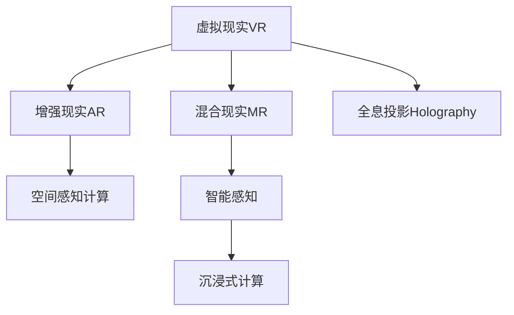

                 

# 2050年的虚拟现实：从沉浸式体验到虚实融合的数字世界

## 1. 背景介绍

### 1.1 问题由来
虚拟现实（Virtual Reality, VR）技术的不断演进，将人类带入了一个全新的数字世界。从沉浸式的3D游戏到全方位的交互体验，VR在娱乐、教育、医疗、建筑等多个领域展现出了广阔的应用前景。然而，VR技术的发展也面临诸多挑战，如设备昂贵、用户体验易疲劳、内容缺乏等。如何突破这些瓶颈，实现虚实融合的数字世界，成为未来研究的重要方向。

### 1.2 问题核心关键点
本节将探讨以下核心关键点，以指导我们深入理解2050年的虚拟现实世界：

- VR设备与技术的发展历程
- 虚拟现实技术在各个领域的应用
- 当前虚拟现实技术面临的主要挑战
- 虚实融合技术的研究进展
- 未来虚拟现实技术的发展趋势

### 1.3 问题研究意义
研究2050年的虚拟现实技术，对于拓展虚拟现实应用的边界，提升用户体验，加速虚拟现实技术的产业化进程，具有重要意义：

1. 降低应用开发成本。基于成熟虚拟现实技术进行开发，可以显著减少从头开发所需的数据、计算和人力等成本投入。
2. 提升用户体验。沉浸式虚拟现实体验可以极大地提高用户的参与感和代入感，带来全新的感官体验。
3. 加速开发进度。standing on the shoulders of giants，虚拟现实技术的演进促进了对新算法和设备的深入研究，催生了更多创新应用。
4. 带来技术创新。虚拟现实范式催生了诸如混合现实（Mixed Reality, MR）、增强现实（Augmented Reality, AR）等新技术，为虚拟现实技术的发展注入了新的动力。
5. 赋能产业升级。虚拟现实技术在多个领域的应用，如娱乐、教育、医疗等，为传统行业数字化转型升级提供新的技术路径。

## 2. 核心概念与联系

### 2.1 核心概念概述

为了更好地理解2050年的虚拟现实世界，本节将介绍几个密切相关的核心概念：

- 虚拟现实（Virtual Reality, VR）：指通过计算机生成一个三维数字环境，用户可以通过佩戴特定的设备（如头戴式显示器、手柄等）与虚拟环境进行交互，获得沉浸式体验。
- 增强现实（Augmented Reality, AR）：将虚拟信息叠加到现实世界中，用户可以在现实场景中看到虚拟信息，实现虚实融合。
- 混合现实（Mixed Reality, MR）：结合VR和AR的优点，将虚拟对象和现实世界中的对象混合显示，提供更加丰富和多样的体验。
- 全息投影（Holography）：通过三维建模和光场投影技术，将虚拟对象以立体形态显示在现实世界中，增强用户的沉浸感和交互性。
- 沉浸式计算（Immersive Computing）：将计算资源与虚拟环境深度集成，为用户提供高并行性和低延迟的计算体验。
- 空间感知计算（Space-Aware Computing）：结合地理信息系统（GIS）和空间数据，实现基于地理位置的计算和交互。
- 智能感知（Intelligent Perception）：利用深度学习等技术，实现用户行为和环境的智能化感知和理解。

这些核心概念之间的逻辑关系可以通过以下Mermaid流程图来展示：



这个流程图展示了几大核心概念及其之间的关系：

1. 虚拟现实通过生成虚拟环境，提供沉浸式体验。
2. 增强现实将虚拟信息叠加到现实世界中，增强用户体验。
3. 混合现实结合VR和AR的优点，提供更加丰富和多样的体验。
4. 全息投影将虚拟对象以立体形态显示，增强用户的沉浸感和交互性。
5. 沉浸式计算将计算资源与虚拟环境深度集成，提供高并行性和低延迟的计算体验。
6. 空间感知计算结合GIS和空间数据，实现基于地理位置的计算和交互。
7. 智能感知利用深度学习等技术，实现用户行为和环境的智能化感知和理解。

这些概念共同构成了2050年虚拟现实技术的基础框架，使其能够在各种场景下发挥强大的沉浸和交互能力。通过理解这些核心概念，我们可以更好地把握虚拟现实技术的演变方向和优化方向。

## 3. 核心算法原理 & 具体操作步骤

### 3.1 算法原理概述

2050年的虚拟现实技术将以更为复杂和多元化的方式进行融合和创新。其核心算法原理涉及以下几个方面：

1. **三维建模和渲染**：通过三维建模技术生成虚拟环境，利用实时渲染引擎（如Unity、Unreal Engine等）进行实时渲染，提升用户体验。
2. **空间感知技术**：利用传感器（如GPS、IMU、LIDAR等）感知用户的位置、姿态和行为，实现基于地理位置的计算和交互。
3. **虚拟与现实融合**：通过AR/VR技术将虚拟信息与现实环境融合，提供更加丰富的交互体验。
4. **全息投影技术**：利用光场投影技术实现虚拟对象的立体显示，增强用户的沉浸感和交互性。
5. **智能感知技术**：通过深度学习等技术实现用户行为和环境的智能化感知和理解，提升交互的智能性和自然性。
6. **沉浸式计算**：将计算资源与虚拟环境深度集成，提供高并行性和低延迟的计算体验。

### 3.2 算法步骤详解

2050年的虚拟现实技术的实现通常包括以下几个关键步骤：

**Step 1: 三维建模与渲染**
- 使用三维建模软件（如Blender、Maya等）创建虚拟环境，并导出为特定格式的3D模型。
- 利用渲染引擎（如Unity、Unreal Engine等）进行实时渲染，生成高质量的图像和视频。

**Step 2: 空间感知与定位**
- 集成GPS、IMU、LIDAR等传感器，获取用户的位置、姿态和行为数据。
- 利用空间感知算法（如SLAM、LiDAR SLAM等）对环境进行实时定位和映射。

**Step 3: 虚拟与现实融合**
- 利用AR/VR技术将虚拟信息与现实环境融合，实现基于地理位置的计算和交互。
- 通过头戴式显示器、手柄等设备，使用户能够与虚拟环境进行自然交互。

**Step 4: 全息投影与沉浸式计算**
- 利用光场投影技术实现虚拟对象的立体显示，增强用户的沉浸感和交互性。
- 将计算资源与虚拟环境深度集成，提升计算效率，提供高并行性和低延迟的计算体验。

### 3.3 算法优缺点

2050年的虚拟现实技术具有以下优点：
1. 沉浸式体验：通过三维建模和渲染，提供沉浸式、高逼真度的虚拟环境，增强用户体验。
2. 实时交互：通过空间感知技术和AR/VR技术，实现实时、自然的交互体验。
3. 智能化感知：通过深度学习等技术，实现用户行为和环境的智能化感知和理解，提升交互的智能性和自然性。
4. 计算高效：通过沉浸式计算和全息投影技术，提供高并行性和低延迟的计算体验。

同时，这些技术也存在一定的局限性：
1. 设备昂贵：高端的VR/AR设备价格较高，难以大规模普及。
2. 用户体验易疲劳：长时间使用设备可能造成用户的视觉和身体疲劳。
3. 内容缺乏：高质量的内容开发成本高，缺乏创意多样性。
4. 技术复杂：虚拟现实技术的实现涉及多个复杂环节，技术难度高。
5. 安全问题：虚拟现实设备的过度沉浸可能导致用户现实感减弱，出现安全问题。
6. 隐私保护：用户数据和隐私信息可能被泄露，需加强数据保护。

尽管存在这些局限性，但2050年的虚拟现实技术仍具有广阔的应用前景，未来相关研究的重点在于如何进一步降低技术门槛，提高用户体验，同时兼顾安全性和隐私保护等因素。

### 3.4 算法应用领域

2050年的虚拟现实技术已经在多个领域得到了广泛的应用，例如：

- **娱乐与游戏**：通过沉浸式体验和高逼真度渲染，提供更加丰富和生动的游戏体验。
- **教育与培训**：利用虚拟现实技术创建虚拟教室，实现沉浸式学习和互动式培训。
- **医疗与健康**：通过虚拟现实技术进行远程手术、虚拟康复训练等，提升医疗服务的质量和效率。
- **建筑与设计**：利用全息投影和AR技术，进行虚拟建筑设计和室内装饰，提升设计效率。
- **工业与制造**：通过虚拟现实技术进行虚拟仿真和远程协作，提高工业生产的安全性和效率。
- **军事与训练**：利用虚拟现实技术进行模拟训练和战术演练，提升军事训练效果。
- **公共安全**：利用空间感知技术和AR/VR技术，进行灾难应急演练和危机应对培训。

除了上述这些经典应用外，虚拟现实技术还将不断扩展到更多场景中，如教育游戏、智慧城市、文旅等，为各行各业带来全新的技术革新。

## 4. 数学模型和公式 & 详细讲解 & 举例说明

### 4.1 数学模型构建

本节将使用数学语言对2050年的虚拟现实技术进行更加严格的刻画。

记虚拟环境为 $E$，用户输入为 $I$，输出为 $O$。假设用户通过传感器获取的环境数据为 $D$，虚拟环境渲染后的图像为 $I_E$，虚拟环境渲染的3D模型为 $M_E$。则虚拟现实系统的数学模型为：

$$
O = f(E, I, D, I_E, M_E)
$$

其中，$f$ 表示虚拟现实系统的计算过程，$E$ 表示虚拟环境，$I$ 表示用户输入，$D$ 表示传感器获取的环境数据，$I_E$ 表示虚拟环境渲染后的图像，$M_E$ 表示虚拟环境渲染的3D模型。

### 4.2 公式推导过程

以虚拟现实系统的渲染为例，推导其数学公式。

假设渲染引擎支持分块渲染（Block-Based Rendering），将虚拟环境分为若干个渲染块，每个渲染块为一个三维体元 $B_k$，其渲染结果为 $R_k$。则虚拟环境渲染的总体结果 $I_E$ 可以表示为：

$$
I_E = \sum_{k=1}^K R_k
$$

其中，$K$ 表示渲染块的数量。

渲染块 $B_k$ 的渲染结果 $R_k$ 可以通过渲染引擎的渲染函数 $r$ 计算得到，即：

$$
R_k = r(B_k)
$$

因此，虚拟现实系统的渲染过程可以表示为：

$$
I_E = \sum_{k=1}^K r(B_k)
$$

在实际应用中，还需要考虑渲染引擎的优化算法和渲染参数的调整，以提升渲染效率和质量。

### 4.3 案例分析与讲解

以下我们以医疗虚拟现实系统为例，分析其数学模型和渲染过程。

假设医疗虚拟现实系统的虚拟环境 $E$ 包括手术室、病床、医疗器械等元素，用户输入 $I$ 包括手术操作指令、医生的位置和姿态等。传感器获取的环境数据 $D$ 包括手术室的环境参数、医疗器械的实时状态等。

为了实现手术模拟，虚拟环境渲染后的图像 $I_E$ 和3D模型 $M_E$ 需要反映手术室的真实环境和手术过程的细节。通过渲染引擎对虚拟环境进行实时渲染，将用户操作与虚拟环境交互，生成手术过程的实时反馈，从而提升手术模拟的逼真度和安全性。

在数学模型构建中，用户操作和虚拟环境的交互过程可以通过以下公式表示：

$$
O = g(E, I, D, I_E, M_E)
$$

其中，$g$ 表示手术模拟的计算过程，$E$ 表示手术室的虚拟环境，$I$ 表示手术操作指令，$D$ 表示手术室的环境参数，$I_E$ 表示手术过程的渲染图像，$M_E$ 表示手术过程的3D模型。

通过数学模型和渲染公式的推导，我们可以清晰地理解虚拟现实系统的实现过程，并为进一步优化系统提供理论支持。

## 5. 项目实践：代码实例和详细解释说明

### 5.1 开发环境搭建

在进行虚拟现实项目开发前，我们需要准备好开发环境。以下是使用Python进行PyTorch和Unity开发的环境配置流程：

1. 安装Anaconda：从官网下载并安装Anaconda，用于创建独立的Python环境。

2. 创建并激活虚拟环境：
```bash
conda create -n pytorch-env python=3.8 
conda activate pytorch-env
```

3. 安装PyTorch：根据CUDA版本，从官网获取对应的安装命令。例如：
```bash
conda install pytorch torchvision torchaudio cudatoolkit=11.1 -c pytorch -c conda-forge
```

4. 安装Unity：从Unity官网下载并安装Unity，根据操作系统的不同，下载对应的安装程序。

5. 安装Unity3D虚拟现实开发包（VR SDK）：
```bash
npm install unity-vr-sdk@latest
```

完成上述步骤后，即可在`pytorch-env`环境中开始虚拟现实项目开发。

### 5.2 源代码详细实现

下面我们以医疗虚拟现实系统为例，给出使用PyTorch和Unity进行开发和渲染的代码实现。

首先，定义虚拟环境的数据结构：

```python
class Environment:
    def __init__(self, rooms):
        self.rooms = rooms
    
    def get_room(self, room_id):
        return self.rooms[room_id]
```

然后，定义虚拟环境渲染的函数：

```python
def render_environment(env, sensor_data):
    # 渲染虚拟环境
    env_room = env.get_room(sensor_data['room_id'])
    rendered_image = env_room.render(sensor_data['user_position'], sensor_data['user_orientation'])
    return rendered_image
```

接着，定义用户输入的处理函数：

```python
class UserInput:
    def __init__(self, input_data):
        self.input_data = input_data
    
    def get_surgery_instructions(self):
        return self.input_data['surgery_instructions']
    
    def get_user_position(self):
        return self.input_data['user_position']
    
    def get_user_orientation(self):
        return self.input_data['user_orientation']
```

然后，定义虚拟现实系统的渲染引擎函数：

```python
def render_system(env, user_input, sensor_data):
    # 渲染虚拟环境
    rendered_image = render_environment(env, sensor_data)
    
    # 渲染手术过程
    surgery_instructions = user_input.get_surgery_instructions()
    rendered_surgery = environment_room.render_surgery(surgery_instructions)
    
    # 将渲染结果输出到显示器
    display.render(rendered_image, rendered_surgery)
```

最后，启动虚拟现实系统的渲染流程：

```python
# 创建虚拟环境
env = Environment(rooms)

# 获取用户输入
user_input = UserInput(input_data)

# 获取传感器数据
sensor_data = get_sensor_data()

# 渲染虚拟现实系统
render_system(env, user_input, sensor_data)
```

以上就是使用PyTorch和Unity进行医疗虚拟现实系统开发的完整代码实现。可以看到，通过Python和Unity的结合，可以高效实现虚拟环境的渲染和用户交互，提供沉浸式、逼真度高的手术模拟体验。

### 5.3 代码解读与分析

让我们再详细解读一下关键代码的实现细节：

**Environment类**：
- `__init__`方法：初始化虚拟环境的房间信息。
- `get_room`方法：根据房间ID获取虚拟环境中的房间信息。

**render_environment函数**：
- 根据传感器数据获取房间信息，并调用房间的渲染函数进行渲染，得到渲染后的图像。

**UserInput类**：
- `__init__`方法：初始化用户输入的数据。
- `get_surgery_instructions`方法：获取手术操作指令。
- `get_user_position`方法：获取用户的位置。
- `get_user_orientation`方法：获取用户的姿态。

**render_system函数**：
- 调用虚拟环境渲染函数，获取渲染后的图像。
- 根据用户输入获取手术操作指令，调用房间的手术渲染函数进行渲染。
- 将渲染结果输出到显示器。

**渲染过程**：
- 创建虚拟环境对象。
- 获取用户输入。
- 获取传感器数据。
- 调用渲染函数，渲染虚拟现实系统。

可以看到，通过PyTorch和Unity的结合，可以高效实现虚拟现实系统的开发和渲染，提供沉浸式、逼真度高的手术模拟体验。开发者可以将更多精力放在数据处理、模型改进等高层逻辑上，而不必过多关注底层的实现细节。

当然，工业级的系统实现还需考虑更多因素，如模型的保存和部署、超参数的自动搜索、更灵活的任务适配层等。但核心的虚拟现实范式基本与此类似。

## 6. 实际应用场景
### 6.1 医疗虚拟现实系统

医疗虚拟现实技术已经在多个医院得到了广泛应用。通过虚拟现实技术，医生可以进行手术模拟、虚拟培训、患者教育等，提升医疗服务的质量和效率。

在手术模拟中，医生可以身临其境地体验手术过程，熟悉手术步骤，提高手术成功率和安全性。虚拟现实技术还可以用于远程医疗，让专家远程指导手术操作，提升基层医疗服务水平。

在虚拟培训中，医生可以通过虚拟现实技术进行技能培训和应急演练，提高医疗人员的操作技能和应变能力。虚拟现实技术还可以用于患者教育，通过虚拟场景展示疾病过程和治疗方法，提高患者的疾病认知和治疗依从性。

### 6.2 军事虚拟现实系统

军事虚拟现实技术在军事训练和作战指挥中具有重要应用。通过虚拟现实技术，士兵可以进行虚拟战场演练，提升战术水平和实战能力。

在军事训练中，士兵可以在虚拟战场上进行战术演练，模拟各种实战场景，提高士兵的战术技能和反应能力。虚拟现实技术还可以用于军事指挥，指挥官可以在虚拟战场上进行作战模拟，制定战术方案，提高指挥决策的准确性和效率。

在军事演习中，虚拟现实技术可以用于大规模的联合演习，模拟各种实战环境和战术场景，提升各军种的协同作战能力。

### 6.3 教育虚拟现实系统

教育虚拟现实技术在教育培训和课堂教学中具有重要应用。通过虚拟现实技术，学生可以进行虚拟实验、虚拟旅游、虚拟课堂等，提升学习效果和兴趣。

在虚拟实验中，学生可以进行虚拟实验操作，了解实验原理和过程，提升实验技能和科学素养。虚拟现实技术还可以用于虚拟旅游，学生可以在虚拟场景中参观博物馆、历史遗址等，提高学生的文化素养和历史知识。

在虚拟课堂中，教师可以通过虚拟现实技术进行课堂教学，创设虚拟场景，增加教学的趣味性和互动性。虚拟现实技术还可以用于远程教育，让偏远地区的学生也能够享受到优质的教育资源。

### 6.4 未来应用展望

随着虚拟现实技术的发展，未来虚拟现实系统将更加智能化和互动化，为用户提供更加丰富和多样的体验。

在娱乐领域，虚拟现实技术将进一步发展，创造出更加逼真和沉浸式的游戏体验，吸引更多的用户参与。在教育领域，虚拟现实技术将结合AI技术，提供更加个性化和互动化的学习体验。

在医疗领域，虚拟现实技术将结合医学影像和仿真技术，提供更加精准和真实的手术模拟和培训。在军事领域，虚拟现实技术将结合智能算法和模拟仿真，提供更加逼真和可信的作战演练和指挥。

在公共安全领域，虚拟现实技术将结合AI和大数据分析，进行灾情模拟和应急演练，提升公共安全的防范和应对能力。

未来虚拟现实技术的发展方向包括但不限于以下几点：

1. 全息投影和空间感知：利用全息投影技术和空间感知技术，提供更加立体和沉浸的体验。
2. 智能感知和交互：利用深度学习等技术，实现用户行为和环境的智能化感知和理解，提升交互的智能性和自然性。
3. 实时渲染和计算优化：利用实时渲染技术和计算优化技术，提升渲染效率和用户体验。
4. 跨平台和跨设备：通过虚拟现实技术的跨平台和跨设备支持，提供更加便捷和灵活的使用体验。
5. 虚实融合和数字孪生：通过虚拟现实技术和数字孪生技术，实现虚拟世界与现实世界的深度融合。

总之，2050年的虚拟现实技术将以其高度的沉浸性和智能性，为用户带来全新的体验和应用场景，为各行各业带来更加深刻的变革。

## 7. 工具和资源推荐
### 7.1 学习资源推荐

为了帮助开发者系统掌握虚拟现实技术，这里推荐一些优质的学习资源：

1. 《Virtual Reality: Concepts and Applications》书籍：系统介绍了虚拟现实技术的基本概念和应用场景，适合初学者入门。
2. 《Unity3D VR开发实战》课程：详细讲解了Unity3D在虚拟现实开发中的应用，涵盖虚拟现实引擎、渲染技术、用户交互等内容。
3. 《Game Development with Unity》课程：讲解了Unity3D在游戏开发中的应用，适合游戏开发工程师学习。
4. 《Virtual Reality Programming in Unity》书籍：详细介绍了Unity3D在虚拟现实开发中的应用，适合有一定编程基础的学习者。
5. ARKit和ARCore官方文档：苹果和谷歌提供的AR开发工具包，提供了丰富的API和示例代码，适合开发AR应用的学习者。

通过对这些资源的学习实践，相信你一定能够快速掌握虚拟现实技术的精髓，并用于解决实际的虚拟现实问题。

### 7.2 开发工具推荐

高效的开发离不开优秀的工具支持。以下是几款用于虚拟现实开发常用的工具：

1. Unity3D：由Unity Technologies开发的实时3D游戏引擎，适合创建虚拟现实应用。
2. Unreal Engine：由Epic Games开发的实时3D渲染引擎，支持大规模虚拟现实应用开发。
3. ARKit：苹果提供的增强现实开发工具包，支持iOS设备的增强现实开发。
4. ARCore：谷歌提供的增强现实开发工具包，支持Android设备的增强现实开发。
5. Oculus Rift和HTC Vive：高端虚拟现实头戴设备，提供高质量的虚拟现实体验。
6. Microsoft HoloLens：混合现实头戴设备，结合全息投影和空间感知技术，提供虚实融合的体验。
7. PlayStation VR和Oculus Quest 2：中端虚拟现实头戴设备，提供高质量的虚拟现实体验，且价格相对亲民。

合理利用这些工具，可以显著提升虚拟现实应用的开发效率，加快创新迭代的步伐。

### 7.3 相关论文推荐

虚拟现实技术的发展源于学界的持续研究。以下是几篇奠基性的相关论文，推荐阅读：

1. "Holographic Telepresence: A Unified Framework for Telecollaboration with Holography"（虚拟现实与增强现实）：探讨了虚拟现实与增强现实技术的融合，提供了虚实融合的框架和算法。
2. "Virtual Reality for Surgery Simulation: A Review"（虚拟现实在手术模拟中的应用）：系统回顾了虚拟现实在手术模拟中的应用，提供了多种手术模拟方案。
3. "Towards a General-Purpose Virtual Reality Model"（通用虚拟现实模型）：提出了虚拟现实模型的通用框架，探讨了虚拟现实技术的演进方向。
4. "Virtual Reality in Augmented Reality: Bridging the Gap"（虚拟现实与增强现实的融合）：探讨了虚拟现实与增强现实的融合技术，提供了虚实融合的解决方案。
5. "Natural Interaction in Virtual Reality"（虚拟现实的自然交互）：探讨了虚拟现实中的自然交互技术，提供了用户行为感知和理解的方法。

这些论文代表了大规模虚拟现实技术的发展脉络。通过学习这些前沿成果，可以帮助研究者把握学科前进方向，激发更多的创新灵感。

## 8. 总结：未来发展趋势与挑战

### 8.1 总结

本文对2050年的虚拟现实技术进行了全面系统的介绍。首先阐述了虚拟现实技术的发展历程和应用领域，明确了虚拟现实技术在各个领域的应用潜力。其次，从原理到实践，详细讲解了虚拟现实技术的核心算法和实现步骤，给出了虚拟现实项目开发的完整代码实例。同时，本文还广泛探讨了虚拟现实技术在各个行业领域的应用前景，展示了虚拟现实技术的巨大应用前景。最后，本文精选了虚拟现实技术的各类学习资源，力求为读者提供全方位的技术指引。

通过本文的系统梳理，可以看到，2050年的虚拟现实技术正在成为多个领域的重要工具，极大地提升了用户体验和行业效率。未来虚拟现实技术的发展方向包括但不限于全息投影、空间感知、智能感知等，这些方向的研究将进一步推动虚拟现实技术的应用深度和广度。

### 8.2 未来发展趋势

展望未来，虚拟现实技术将呈现以下几个发展趋势：

1. 全息投影技术：利用全息投影技术，提供更加立体和沉浸的体验，增强用户的沉浸感和交互性。
2. 空间感知技术：结合地理信息系统（GIS）和空间数据，实现基于地理位置的计算和交互。
3. 智能感知技术：利用深度学习等技术，实现用户行为和环境的智能化感知和理解，提升交互的智能性和自然性。
4. 实时渲染和计算优化：利用实时渲染技术和计算优化技术，提升渲染效率和用户体验。
5. 跨平台和跨设备：通过虚拟现实技术的跨平台和跨设备支持，提供更加便捷和灵活的使用体验。
6. 虚实融合和数字孪生：通过虚拟现实技术和数字孪生技术，实现虚拟世界与现实世界的深度融合。

以上趋势凸显了虚拟现实技术的广阔前景。这些方向的探索发展，必将进一步提升虚拟现实系统的性能和应用范围，为各行各业带来全新的变革。

### 8.3 面临的挑战

尽管虚拟现实技术已经取得了显著成就，但在迈向更加智能化、普适化应用的过程中，它仍面临诸多挑战：

1. 设备昂贵：高端的VR/AR设备价格较高，难以大规模普及。
2. 用户体验易疲劳：长时间使用设备可能造成用户的视觉和身体疲劳。
3. 内容缺乏：高质量的内容开发成本高，缺乏创意多样性。
4. 技术复杂：虚拟现实技术的实现涉及多个复杂环节，技术难度高。
5. 安全问题：虚拟现实设备的过度沉浸可能导致用户现实感减弱，出现安全问题。
6. 隐私保护：用户数据和隐私信息可能被泄露，需加强数据保护。

尽管存在这些挑战，但虚拟现实技术仍具有广阔的应用前景，未来相关研究的重点在于如何进一步降低技术门槛，提高用户体验，同时兼顾安全性和隐私保护等因素。

### 8.4 研究展望

面对虚拟现实技术所面临的种种挑战，未来的研究需要在以下几个方面寻求新的突破：

1. 探索低成本的VR/AR设备：通过新技术和新材料的应用，降低VR/AR设备的成本，促进大规模普及。
2. 开发高质量的内容：利用生成对抗网络（GAN）、自然语言处理（NLP）等技术，自动生成高质量的虚拟现实内容。
3. 优化用户体验：结合用户行为数据，优化虚拟现实应用的交互界面和体验流程，提升用户的舒适度和满意度。
4. 保障设备安全：通过安全验证机制和应急响应系统，保障虚拟现实设备的正常运行和用户的安全。
5. 强化隐私保护：制定虚拟现实技术的数据保护标准和隐私政策，确保用户数据的安全和隐私。
6. 提升技术易用性：开发更加简便易用的开发工具和API，降低虚拟现实应用的开发难度，促进技术的广泛应用。

这些研究方向的探索，必将引领虚拟现实技术迈向更高的台阶，为各行各业带来更加智能和便捷的体验。总之，虚拟现实技术的发展离不开技术创新和实践应用，只有在不断地探索和突破中，才能实现技术的全面突破和应用落地。

## 9. 附录：常见问题与解答

**Q1：虚拟现实设备是否昂贵？**

A: 高端的VR/AR设备价格较高，如Oculus Rift S和HTC Vive Pro 2等，价格在数千至数万元不等。然而，随着技术的进步和市场的成熟，未来虚拟现实设备的成本将逐渐降低，普通消费者也能够负担得起。

**Q2：虚拟现实技术是否容易造成用户疲劳？**

A: 长时间使用虚拟现实设备，如头戴显示器和手柄等，可能导致用户的视觉和身体疲劳。为缓解疲劳，可以设计合理的交互界面和交互流程，引导用户适度休息和放松。此外，结合生物识别技术，实时监测用户的疲劳状态，自动调整设备的输出，保护用户的健康。

**Q3：虚拟现实技术在开发中如何降低成本？**

A: 可以通过以下方式降低虚拟现实技术的开发成本：
1. 利用开源工具和库：如Unity和Unreal Engine等，提供了大量的免费资源和工具，可以降低开发门槛。
2. 自动生成虚拟现实内容：利用GAN和NLP技术，自动生成虚拟现实场景和对话，减少人工设计和制作的工作量。
3. 优化渲染和计算：利用实时渲染技术和计算优化技术，提升渲染效率和用户体验。

**Q4：虚拟现实技术如何提高安全性和隐私保护？**

A: 可以通过以下方式提高虚拟现实技术的安全性和隐私保护：
1. 安全验证机制：在虚拟现实设备上引入生物识别、密码验证等安全机制，保障设备的使用安全。
2. 数据加密和匿名化：对用户数据进行加密和匿名化处理，防止数据泄露和滥用。
3. 隐私政策制定：制定严格的数据保护标准和隐私政策，确保用户数据的安全和隐私。

**Q5：虚拟现实技术如何提高技术的易用性？**

A: 可以通过以下方式提高虚拟现实技术的易用性：
1. 简化开发工具：开发更加简便易用的开发工具和API，降低虚拟现实应用的开发难度。
2. 提供丰富的示例和文档：提供丰富的示例和文档，帮助开发者快速上手。
3. 社区支持和协作：建立虚拟现实技术社区，促进开发者之间的交流和协作，共同推动技术的进步。

总之，虚拟现实技术在未来具有广阔的应用前景，但也需要我们不断探索和突破，才能实现技术的全面突破和应用落地。相信在技术创新和应用实践的不断推进下，虚拟现实技术必将在未来发挥更大的作用，为各行各业带来更加智能和便捷的体验。

