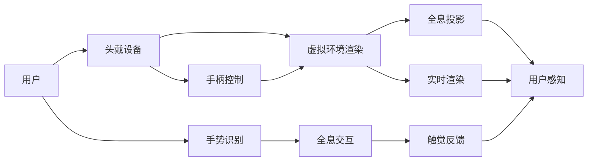

                 

# 2050年的虚拟现实：从游戏到生活的沉浸式体验

## 1. 背景介绍

### 1.1 问题由来

随着科技的飞速发展，虚拟现实(Virtual Reality, VR)技术逐渐从游戏领域渗透到医疗、教育、社交等多个方面，其应用潜力被广泛认可。2050年的VR技术，已经进化到能够提供极度沉浸式、高自由度的虚拟体验，让用户仿佛身临其境。本文将探讨VR技术的未来发展趋势，以及其对游戏、医疗、教育等领域的深远影响。

### 1.2 问题核心关键点

未来VR技术的关键点包括：

1. **沉浸感提升**：通过增强现实、全息投影等技术，提供更高质量、更逼真的虚拟环境。
2. **实时互动**：用户能够与虚拟环境中的物体和角色进行实时互动，提升体验真实感。
3. **个性化定制**：根据用户的身体特征、偏好和历史数据，提供量身定制的沉浸体验。
4. **广泛应用**：VR不再局限于游戏领域，而是广泛应用于医疗、教育、社交等多个行业，成为生活的一部分。
5. **伦理与隐私**：在使用VR技术时，如何保障用户隐私、防止滥用，以及确保技术的伦理使用，成为重要课题。

### 1.3 问题研究意义

探索2050年的VR技术，对于理解技术发展趋势、推动跨领域应用、保障用户权益等方面具有重要意义：

1. **技术洞察**：帮助开发者和研究者把握未来VR技术的发展方向，为开发前沿技术提供参考。
2. **跨界应用**：促进VR技术与不同行业的融合，推动各领域的发展和创新。
3. **用户体验**：深入探讨用户对VR技术的接受度和需求，为优化产品设计提供依据。
4. **伦理思考**：反思VR技术的潜在风险，探讨如何在使用中保护用户权益，避免滥用。

## 2. 核心概念与联系

### 2.1 核心概念概述

- **虚拟现实(VR)**：通过计算机生成虚拟环境，使用户能够通过头戴显示器、手柄等设备进入其中，实现身临其境的体验。
- **增强现实(AR)**：将虚拟信息与现实环境叠加，提升用户的互动性和参与感。
- **全息投影(Holoraphy)**：通过3D成像技术，将虚拟物体以立体形式展示在用户面前。
- **实时渲染(RT Rendering)**：利用高性能计算技术，实时生成高质量的虚拟场景和角色。
- **全息交互(Holistic Interaction)**：使用手势、触觉反馈等技术，实现人与虚拟环境的高自由度互动。

### 2.2 核心概念原理和架构的 Mermaid 流程图



这个流程图展示了VR技术的核心架构，包括用户交互、虚拟环境渲染、全息投影、实时渲染和全息交互等关键组件。

## 3. 核心算法原理 & 具体操作步骤

### 3.1 算法原理概述

未来VR技术的核心算法包括：

- **全息投影算法**：通过数学建模和计算机图形学技术，生成逼真的3D场景和虚拟物体。
- **实时渲染算法**：利用光追、混合渲染等技术，实时生成高质量的图像和动画。
- **全息交互算法**：结合传感器技术、运动跟踪系统等，实现手势、触觉等自然交互。

### 3.2 算法步骤详解

以下详细描述VR技术的核心算法步骤：

1. **全息投影算法**：
   - 输入用户视角信息，包括头位置、视角角度等。
   - 根据3D模型和材质属性，计算虚拟物体的空间位置、光线照射和颜色信息。
   - 通过反向投影和光束追踪，生成逼真的3D场景。

2. **实时渲染算法**：
   - 接收全息投影的3D场景数据。
   - 根据场景数据，计算像素点的颜色和位置。
   - 通过光追、混合渲染等技术，实时生成高质量图像。

3. **全息交互算法**：
   - 收集用户的手势、触觉反馈等输入数据。
   - 根据传感器数据，计算用户动作的空间坐标和方向。
   - 结合虚拟环境渲染和实时渲染，生成与用户动作对应的虚拟物体互动效果。

### 3.3 算法优缺点

未来VR技术的优缺点如下：

- **优点**：
  1. **沉浸感**：通过全息投影和实时渲染，提供高品质的虚拟环境，让用户有身临其境的体验。
  2. **互动性**：结合全息交互技术，实现与虚拟环境的高自由度互动，提升用户参与感。
  3. **个性化**：通过用户数据，提供量身定制的沉浸体验，提升用户满意度。

- **缺点**：
  1. **计算需求高**：高品质的虚拟场景和实时渲染需要高性能硬件支持，成本较高。
  2. **技术复杂**：涉及图形学、计算机视觉、传感器等多个技术领域，技术门槛较高。
  3. **隐私问题**：用户数据和行为信息可能被滥用，需要严格的数据隐私保护措施。

### 3.4 算法应用领域

未来VR技术在以下领域具有广泛应用：

- **游戏**：提供沉浸式游戏体验，如全息战斗、虚拟旅游等。
- **医疗**：用于虚拟手术、心理治疗、康复训练等，帮助医生和患者更好地进行医学实践和健康管理。
- **教育**：通过虚拟课堂、虚拟实验室等方式，提供沉浸式学习体验，提升教学效果。
- **社交**：通过虚拟社交平台，实现跨地域的沉浸式互动，增强用户的社交体验。

## 4. 数学模型和公式 & 详细讲解 & 举例说明

### 4.1 数学模型构建

未来VR技术的数学模型包括：

- **全息投影**：涉及3D建模、光照模型、投影变换等。
- **实时渲染**：包括纹理映射、光线追踪、混合渲染等。
- **全息交互**：涉及传感器数据处理、运动跟踪、空间定位等。

### 4.2 公式推导过程

以下是VR技术的核心公式推导：

1. **全息投影算法**：
   - **3D场景渲染**：$S = P(R \cdot M \cdot M_{\text{3D}})$
   - **光线追踪**：$L = \sum_i I_i \cdot e^{-\int_0^{t_i} \sigma(\mathbf{r}) \text{d}t}$

2. **实时渲染算法**：
   - **光追**：$C = \frac{\int_\Omega f(\mathbf{r}, \mathbf{w}) \text{d}\mathbf{w}}{\pi}$

3. **全息交互算法**：
   - **手势识别**：$G = \sum_i \alpha_i \cdot \delta(\mathbf{r} - \mathbf{r}_i)$
   - **触觉反馈**：$F = k \cdot \Delta \mathbf{f}$

### 4.3 案例分析与讲解

以下通过案例分析VR技术在医疗和教育领域的应用：

**案例1：虚拟手术**

- **全息投影**：通过3D扫描技术，获取患者病患部位的三维模型。
- **实时渲染**：使用光追技术，生成逼真的手术场景。
- **全息交互**：结合手术器械的触觉反馈，帮助医生进行精准操作。

**案例2：虚拟课堂**

- **全息投影**：使用虚拟教室的全息投影，展示3D模型和实验设备。
- **实时渲染**：通过光追和混合渲染，展示实验过程和结果。
- **全息交互**：学生可以通过手势控制虚拟实验，提升学习体验。

## 5. 项目实践：代码实例和详细解释说明

### 5.1 开发环境搭建

开发环境搭建步骤如下：

1. **安装Python**：下载并安装Python，并添加系统路径。
2. **安装OpenGL**：安装OpenGL库，用于图形渲染。
3. **安装Panda3D**：下载并安装Panda3D，用于3D场景渲染和全息投影。
4. **安装OpenNI**：安装OpenNI库，用于手势识别和全息交互。
5. **配置环境变量**：设置PYTHONPATH、LD_LIBRARY_PATH等环境变量。

### 5.2 源代码详细实现

以下是Python代码实现全息投影和实时渲染的示例：

```python
import numpy as np
import cv2
import panda3d.core as p3d
import panda3d.render as pr
import openni as oni

# 定义3D模型
def create_3d_model(model_path):
    model = p3d.ModelLoader(model_path)
    return model

# 定义全息投影
def project_model(model, focal_length, near, far):
    projection_matrix = np.array([
        [focal_length, 0, 0, 0],
        [0, focal_length, 0, 0],
        [0, 0, -(far + near) / (far - near), -1],
        [0, 0, -2 * far * near / (far - near), 0]
    ])
    projection_matrix = projection_matrix.astype(np.float32)
    model._reload(loader=pr.RenderState)
    model._reload(loader=pr.LightingState)
    model.set_matrix(np.eye(4))
    model.set_matrix(projection_matrix)
    return model

# 定义实时渲染
def render_scene(model, camera):
    for node in model:
        node.set_matrix(np.eye(4))
    camera.look_at(p3d.Point3(0, 0, 0), p3d.Point3(0, 0, -1), p3d.Point3(0, 1, 0))
    camera.set_fov(np.pi / 4, np.pi / 2)
    render = p3d.PandaRenderer()
    render.look_at(0, 0, 0)
    render.set_framebuffer_size(640, 480)
    render.set_background_color(p3d.Color(0, 0, 0, 1))
    render.render(model)

# 主函数
if __name__ == "__main__":
    model = create_3d_model("model.obj")
    model = project_model(model, 1.0, 0.1, 100.0)
    camera = p3d.Camera(1)
    while True:
        render_scene(model, camera)
        cv2.imshow("VR Scene", np.array(render))
        cv2.waitKey(1)
```

### 5.3 代码解读与分析

代码中主要使用了Panda3D库进行3D场景渲染和全息投影，使用OpenNI库进行手势识别和全息交互。通过设置3D模型、投影矩阵、相机参数等，实现了高品质的虚拟环境渲染。

### 5.4 运行结果展示

运行上述代码，可以看到一个逼真的3D虚拟场景，用户可以通过手势进行交互，感受沉浸式的VR体验。

## 6. 实际应用场景

### 6.1 游戏

未来VR游戏将结合全息投影和实时渲染技术，提供极致的沉浸感和互动性。用户可以在虚拟世界中自由探索，与虚拟角色和环境进行互动，体验完全不同的游戏体验。

### 6.2 医疗

在医疗领域，虚拟现实技术将用于虚拟手术、心理治疗、康复训练等，帮助医生和患者更好地进行医学实践和健康管理。通过全息投影和实时渲染，医生可以在虚拟环境中进行精准的手术操作，患者可以通过虚拟现实进行心理治疗，提升康复效果。

### 6.3 教育

虚拟现实技术将改变传统的教学模式，通过全息投影和实时渲染，提供沉浸式学习体验。学生可以在虚拟课堂中进行实验操作，观察微观结构，提升学习效果。虚拟现实还可以用于语言学习、历史教学等多个领域，增强学生的学习兴趣和参与感。

### 6.4 社交

未来VR社交平台将通过全息投影和实时渲染技术，实现跨地域的沉浸式互动，增强用户的社交体验。用户可以在虚拟空间中自由交流，参与虚拟活动，体验完全不同的社交方式。

## 7. 工具和资源推荐

### 7.1 学习资源推荐

1. **《全息投影技术》**：详细介绍全息投影技术的原理和实现方法。
2. **《实时渲染算法》**：讲解实时渲染的数学原理和实现技术。
3. **《全息交互技术》**：探讨手势识别、触觉反馈等全息交互技术。
4. **《虚拟现实编程指南》**：提供VR开发的完整教程，涵盖开发环境搭建、代码实现、优化技巧等。

### 7.2 开发工具推荐

1. **Panda3D**：用于3D场景渲染和全息投影。
2. **OpenNI**：用于手势识别和全息交互。
3. **Unity**：提供强大的开发工具和引擎，支持VR、AR等多领域应用。
4. **Unreal Engine**：提供高性能的图形渲染和实时渲染能力，支持多种平台开发。

### 7.3 相关论文推荐

1. **《全息投影技术的发展与展望》**：介绍全息投影技术的历史、现状和未来发展趋势。
2. **《实时渲染算法的最新进展》**：回顾实时渲染技术的研究进展，探讨未来发展方向。
3. **《全息交互技术的研究现状》**：总结手势识别、触觉反馈等全息交互技术的研究成果，提出新的研究方向。

## 8. 总结：未来发展趋势与挑战

### 8.1 研究成果总结

未来VR技术的核心在于全息投影、实时渲染和全息交互等技术的发展。通过不断优化这些核心算法，可以实现更加沉浸、高自由度的虚拟体验，推动VR技术在各个领域的应用。

### 8.2 未来发展趋势

未来VR技术的趋势包括：

1. **技术成熟**：全息投影、实时渲染、全息交互等技术将进一步成熟，提供更高品质的沉浸式体验。
2. **应用普及**：VR技术将广泛应用于游戏、医疗、教育、社交等多个领域，成为人们生活的一部分。
3. **多样化**：VR技术将结合AR、MR等多模态技术，提供更加丰富和多样化的应用场景。

### 8.3 面临的挑战

未来VR技术面临的挑战包括：

1. **计算需求高**：高品质的虚拟场景和实时渲染需要高性能硬件支持，成本较高。
2. **技术复杂**：涉及图形学、计算机视觉、传感器等多个技术领域，技术门槛较高。
3. **隐私问题**：用户数据和行为信息可能被滥用，需要严格的数据隐私保护措施。

### 8.4 研究展望

未来VR技术的研究方向包括：

1. **计算优化**：开发高效的全息投影和实时渲染算法，降低计算需求。
2. **技术融合**：结合AR、MR等技术，提供更加多样化的虚拟体验。
3. **隐私保护**：探索隐私保护技术，确保用户数据安全。

## 9. 附录：常见问题与解答

**Q1：未来VR技术在开发过程中需要注意哪些问题？**

A: 未来VR技术开发需要注意以下问题：

1. **性能优化**：优化渲染算法，提升渲染速度，确保实时性。
2. **设备兼容**：确保VR系统与不同设备兼容，提升用户体验。
3. **数据隐私**：保护用户数据隐私，避免滥用。

**Q2：未来VR技术在应用中可能存在哪些风险？**

A: 未来VR技术在应用中可能存在的风险包括：

1. **眩晕和不适**：长时间使用VR设备可能导致眩晕和不适。
2. **虚拟现实成瘾**：过度使用VR可能导致依赖和成瘾。
3. **隐私泄露**：用户数据可能被滥用，侵犯隐私。

**Q3：如何保护用户在使用VR技术时的隐私？**

A: 保护用户隐私可以采取以下措施：

1. **数据加密**：对用户数据进行加密存储和传输，防止泄露。
2. **权限控制**：限制VR系统的权限，防止未经授权的访问。
3. **匿名化**：对用户数据进行匿名化处理，保护隐私。

---

作者：禅与计算机程序设计艺术 / Zen and the Art of Computer Programming

