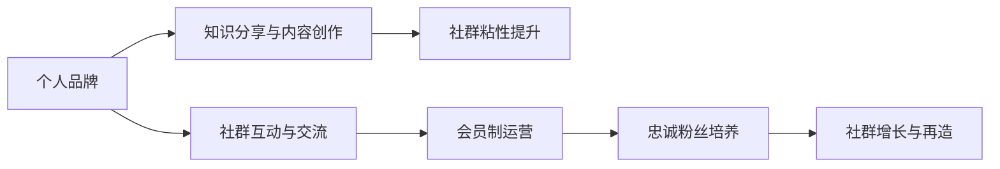

                 

# 建立个人会员制社群：培养忠实粉丝群体

## 1. 背景介绍

在数字化时代，互联网为个人品牌和社群的建立提供了新的可能。但与此同时，随着信息过载和注意力分散，如何构建一个有价值、有生命力的个人品牌社群，成为了不少内容创作者和企业家面临的难题。本文将系统阐述建立个人会员制社群的核心原理与实操方法，以期为有意于打造忠诚粉丝群体的各位提供一些思路与建议。

## 2. 核心概念与联系

### 2.1 核心概念概述

- **个人品牌（Personal Branding）**：通过专业领域的知识分享、内容创作、个人互动等活动，在互联网平台建立起来的、具有较高辨识度的个人形象。

- **社群（Community）**：一群有着相同兴趣、需求或目标的人群，在特定平台上自发形成的交流与互动集合体。

- **会员制社群（Membership Community）**：通过设置会员门槛（如付费、认证、资格审核等），筛选出有意愿持续参与交流、贡献内容的用户，构建起有深度、有粘性的社群结构。

- **忠诚粉丝（Loyal Fandom）**：对个人品牌或社群具有高度认同感和忠诚度，愿意持续投入时间和资源，主动参与互动、内容创作与传播的用户群体。

### 2.2 核心概念原理和架构的 Mermaid 流程图



### 2.3 核心概念之间的关系

个人品牌是基础，是吸引用户关注与参与的起点。知识分享与内容创作是核心，是吸引用户深入了解并产生情感连接的桥梁。社群互动与交流是互动，是用户之间建立信任和认同的纽带。会员制运营则是筛选机制，通过门槛设定、权益分配等手段，确保社群品质。忠诚粉丝培养是目标，是社群发展与增长的引擎。社群增长与再造则是循环，确保社群的持续活力与成长。

## 3. 核心算法原理 & 具体操作步骤

### 3.1 算法原理概述

建立个人会员制社群的算法原理，主要是基于用户行为分析和心理驱动。通过追踪、分析和引导用户行为，激励用户不断参与互动和贡献内容，逐步构建起忠诚粉丝群体。具体而言，包括以下几个步骤：

- **用户画像构建**：通过对用户行为数据的分析，构建用户画像，了解用户兴趣、需求和行为特征。
- **个性化推荐**：根据用户画像，进行个性化内容推荐，引导用户发现与感兴趣的内容。
- **激励机制设计**：设计多样化的激励机制，如积分系统、奖励计划、荣誉体系等，激发用户参与互动和内容创作。
- **社群互动促进**：通过话题讨论、直播互动、问答交流等方式，增强用户之间的交流与互动。
- **反馈与迭代**：根据用户反馈，不断优化社群运营策略，提升用户体验与社群粘性。

### 3.2 算法步骤详解

#### 3.2.1 用户画像构建

用户画像的构建是社群运营的基础。通过数据分析和用户反馈，构建出有深度的用户画像，了解用户的兴趣、需求、行为特征和偏好。

**步骤一：数据收集**

- **行为数据**：包括浏览记录、搜索历史、互动频率、内容消费量等。
- **反馈数据**：包括评论、点赞、分享、投诉等互动反馈数据。
- **人口统计数据**：包括年龄、性别、地域、职业等基本人口特征。

**步骤二：数据处理**

- **数据清洗**：去除噪声数据、处理缺失值，确保数据质量。
- **数据融合**：将行为数据、反馈数据和人口统计数据进行融合，形成综合的用户画像。

**步骤三：画像建模**

- **聚类分析**：使用K-means、层次聚类等方法，将用户分为不同的群组，找出各群组的典型特征。
- **情感分析**：通过情感分析技术，了解用户对不同内容、活动、话题的态度和情感倾向。
- **特征工程**：通过特征选择、特征提取和特征转换等方法，构建出有意义的特征向量。

**步骤四：画像应用**

- **内容推荐**：根据用户画像，推荐相关内容，提升内容曝光率和用户满意度。
- **活动策划**：根据用户画像，策划有针对性的活动，增强用户参与感和粘性。
- **营销推广**：根据用户画像，定制化的推广方案，提升用户转化率。

#### 3.2.2 个性化推荐

个性化推荐是提高用户参与度和粘性的重要手段。通过深度学习、协同过滤等算法，构建出个性化推荐系统，为用户推荐感兴趣的内容。

**步骤一：推荐模型构建**

- **深度学习模型**：使用DNN、CNN、RNN等深度学习模型，构建推荐模型。
- **协同过滤算法**：使用基于矩阵分解的算法（如ALS），挖掘用户行为特征，实现个性化推荐。

**步骤二：推荐系统实现**

- **数据预处理**：将用户行为数据转化为推荐模型所需的输入格式。
- **模型训练**：使用推荐模型对输入数据进行训练，学习出用户与内容之间的关联关系。
- **推荐结果输出**：根据用户当前行为，预测并推荐可能感兴趣的内容。

#### 3.2.3 激励机制设计

激励机制是驱动用户持续参与的重要手段。通过积分系统、奖励计划、荣誉体系等，激励用户积极参与互动和内容创作。

**步骤一：设计激励体系**

- **积分系统**：设计积分系统，根据用户参与互动、内容创作、社交分享等行为，给予相应积分奖励。
- **奖励计划**：设置不同等级的奖励计划，根据积分高低，给予不同形式的奖励，如优惠券、礼品、会员资格等。
- **荣誉体系**：建立荣誉体系，根据用户贡献度、互动活跃度等指标，授予荣誉称号，如“意见领袖”、“粉丝达人”等。

**步骤二：实现激励机制**

- **积分管理系统**：开发积分管理系统，记录用户行为，生成积分，并实时更新积分状态。
- **奖励发放平台**：搭建奖励发放平台，根据用户积分自动发放奖励，并记录发放记录。
- **荣誉颁发系统**：开发荣誉颁发系统，根据用户数据自动生成荣誉，并在平台公示。

#### 3.2.4 社群互动促进

社群互动是提升用户粘性和忠诚度的重要方式。通过话题讨论、直播互动、问答交流等方式，增强用户之间的交流与互动。

**步骤一：互动活动策划**

- **话题讨论**：定期策划热门话题讨论，引导用户积极参与互动。
- **直播互动**：定期举办直播活动，邀请专家、嘉宾进行分享与互动。
- **问答交流**：设立问答板块，鼓励用户提问与回答。

**步骤二：互动活动实施**

- **话题管理**：维护话题讨论区，及时删除违规内容，确保话题健康。
- **直播控制**：实时监控直播活动，管理互动秩序，确保活动顺利进行。
- **问答审核**：审核问答内容，确保问答质量，避免低俗与误导性内容。

#### 3.2.5 反馈与迭代

反馈与迭代是优化社群运营策略的关键。通过用户反馈，不断优化社群运营策略，提升用户体验与社群粘性。

**步骤一：反馈收集**

- **用户反馈**：收集用户对内容、活动、互动等方面的反馈，了解用户需求与痛点。
- **数据监控**：实时监控用户行为数据，发现异常情况，及时处理。

**步骤二：反馈分析**

- **情感分析**：使用情感分析技术，分析用户反馈情感倾向，了解用户满意度与不满点。
- **行为分析**：使用行为分析技术，找出用户流失原因，优化互动体验。

**步骤三：策略优化**

- **内容优化**：根据用户反馈，优化内容质量，提升用户满意度。
- **活动改进**：根据用户反馈，改进活动形式与内容，增强用户参与感。
- **互动调整**：根据用户反馈，调整互动策略，提高用户粘性。

### 3.3 算法优缺点

**优点**

- **精准推荐**：通过个性化推荐，提升用户参与度和粘性，增强用户满意度。
- **持续激励**：通过激励机制，驱动用户持续参与互动和内容创作，形成良性循环。
- **高效管理**：通过用户画像和反馈分析，实现高效的用户管理和社群运营。

**缺点**

- **数据依赖**：依赖于大量的用户行为数据，数据质量对推荐效果有直接影响。
- **算法复杂**：深度学习等算法复杂度高，模型训练和部署成本较大。
- **用户留存**：用户流失率高，需不断优化运营策略，确保社群健康稳定发展。

### 3.4 算法应用领域

建立个人会员制社群的方法，不仅适用于内容创作者，还可以应用于企业、机构、社群组织等各类主体。以下是几个具体应用场景：

- **内容创作者**：通过建立社群，提升用户粘性，增强粉丝忠诚度，实现内容变现。
- **企业品牌**：通过建立会员制社群，增强用户忠诚度，提升品牌价值，实现客户转化。
- **社群组织**：通过建立会员制社群，增强用户参与感，提升组织影响力，实现成员互动。

## 4. 数学模型和公式 & 详细讲解 & 举例说明

### 4.1 数学模型构建

建立个人会员制社群的数学模型，主要涉及用户画像构建、个性化推荐、激励机制设计、社群互动促进、反馈与迭代等模块。这里以用户画像构建和个性化推荐为例，构建数学模型。

#### 4.1.1 用户画像构建

用户画像构建的核心是特征选择与特征工程，主要通过构建特征向量，实现用户画像的建模。

**步骤一：特征选择**

- **行为特征**：选择用户的浏览历史、搜索记录、互动频率等行为特征。
- **情感特征**：选择用户的评论情感、点赞倾向、分享内容等情感特征。
- **人口特征**：选择用户的年龄、性别、地域、职业等人口特征。

**步骤二：特征工程**

- **数据清洗**：去除噪声数据、处理缺失值，确保数据质量。
- **特征提取**：使用TF-IDF、PCA等技术，提取关键特征。
- **特征转换**：使用降维、归一化等方法，转换特征向量。

#### 4.1.2 个性化推荐

个性化推荐的核心是构建推荐模型，通过学习用户行为和内容特征，预测用户可能感兴趣的内容。

**步骤一：模型构建**

- **协同过滤模型**：使用ALS（Alternating Least Squares）算法，构建协同过滤模型。
- **深度学习模型**：使用DNN（Deep Neural Network）模型，构建深度学习模型。

**步骤二：推荐计算**

- **协同过滤推荐**：使用ALS模型计算用户-内容关联矩阵，实现推荐。
- **深度学习推荐**：使用DNN模型预测用户对内容的评分，实现推荐。

### 4.2 公式推导过程

#### 4.2.1 用户画像构建公式

用户画像构建的公式推导，主要涉及特征选择和特征工程。这里以协同过滤模型为例，推导公式。

**协同过滤模型公式**

\[
\theta = \arg\min_{\theta} \frac{1}{N}\sum_{i=1}^N \sum_{j=1}^M (y_{ij}-\hat{y}_{ij})^2
\]

其中，\(\theta\)为协同过滤模型的参数，\(N\)为用户数，\(M\)为内容数，\(y_{ij}\)为用户\(i\)对内容\(j\)的实际评分，\(\hat{y}_{ij}\)为用户\(i\)对内容\(j\)的预测评分。

#### 4.2.2 个性化推荐公式

个性化推荐的公式推导，主要涉及协同过滤模型和深度学习模型的推导。这里以协同过滤模型为例，推导公式。

**协同过滤模型公式**

\[
\hat{y}_{ij} = \frac{\sum_{k=1}^K w_k u_{ik} v_{kj}}{\sum_{k=1}^K w_k v_{kj}}
\]

其中，\(u_{ik}\)为用户\(i\)对内容\(k\)的评分，\(v_{kj}\)为内容\(k\)对内容\(j\)的评分，\(w_k\)为正则化参数，\(K\)为协同过滤模型的维度。

### 4.3 案例分析与讲解

#### 4.3.1 用户画像构建案例

某内容创作者，运营着一个关于编程的微信公众号，拥有近10万粉丝。通过分析用户的浏览记录、搜索历史和互动数据，构建用户画像，发现以下特点：

- **高互动用户**：占比10%，日均浏览时间为5小时，互动频繁，兴趣广泛。
- **活跃用户**：占比20%，日均浏览时间为3小时，互动较少，对特定内容有持续关注。
- **潜在用户**：占比70%，日均浏览时间为1小时，互动较少，兴趣不明确。

根据用户画像，创作者可以采取以下措施：

- **高互动用户**：定期推送热门内容，举办互动活动，增强用户粘性。
- **活跃用户**：推送高质量内容，发布深度文章，满足用户需求。
- **潜在用户**：推送入门内容，引导用户关注，提升互动率。

#### 4.3.2 个性化推荐案例

某电商平台，希望通过个性化推荐，提升用户购物体验和转化率。通过分析用户的浏览历史、购买记录和互动数据，构建个性化推荐系统，发现以下特征：

- **用户画像**：25-35岁，男女均衡，地域广泛。
- **购物习惯**：偏向于时尚、科技、家居等类别。
- **购买行为**：购买频率高，偏好品牌多。

根据用户画像和购物习惯，电商平台可以采取以下措施：

- **推荐内容**：推荐热门商品、品牌商品、用户评价高的商品，满足用户需求。
- **推荐活动**：定期举办限时折扣、满减活动，提升用户购买意愿。
- **推荐人群**：根据用户画像，推送个性化广告，提升广告转化率。

## 5. 项目实践：代码实例和详细解释说明

### 5.1 开发环境搭建

建立个人会员制社群的开发环境搭建，主要涉及服务器配置、数据库搭建、开发工具安装等步骤。这里以Python环境为例，进行开发环境搭建。

**步骤一：安装Python**

- 下载Python安装包，并进行安装。

**步骤二：安装相关工具**

- 安装Jupyter Notebook，用于数据处理和代码调试。
- 安装NumPy、Pandas等数据处理工具。
- 安装Scikit-learn、TensorFlow等机器学习工具。

**步骤三：搭建开发环境**

- 搭建服务器，配置好开发环境。
- 安装Nginx等服务器软件，进行Web服务搭建。

### 5.2 源代码详细实现

#### 5.2.1 用户画像构建

```python
import pandas as pd
import numpy as np
from sklearn.decomposition import PCA
from sklearn.preprocessing import StandardScaler

# 读取数据
data = pd.read_csv('user_data.csv')

# 数据清洗
data.dropna(inplace=True)

# 特征选择
features = ['浏览历史', '搜索记录', '互动频率', '评论情感', '点赞倾向', '分享内容', '年龄', '性别', '地域', '职业']

# 特征工程
scaler = StandardScaler()
features_scaled = scaler.fit_transform(data[features])

# PCA降维
pca = PCA(n_components=3)
features_pca = pca.fit_transform(features_scaled)

# 保存特征向量
np.save('user_profile.npy', features_pca)
```

#### 5.2.2 个性化推荐

```python
import numpy as np
import pandas as pd
from scipy.sparse import csr_matrix
from scipy.optimize import minimize

# 读取数据
data = pd.read_csv('user_data.csv')

# 数据处理
user_ids = data['user_id'].values
item_ids = data['item_id'].values
scores = data['score'].values

# 构建用户-物品矩阵
user_item_matrix = csr_matrix((scores, (user_ids, item_ids)), shape=(len(user_ids), len(item_ids)))

# 协同过滤模型
def collaborative_filtering(X):
    U = X.T.dot(X)
    U_inv = np.linalg.inv(U)
    V = X.dot(X.T)
    V_inv = np.linalg.inv(V)
    W = np.sqrt(np.linalg.norm(V_inv, ord='fro'))
    return np.dot(np.dot(U_inv, V_inv), W)

# 推荐计算
user_id = 123
item_ids = np.where(np.dot(collaborative_filtering(user_item_matrix), np.ones(len(item_ids))) >= 0.5)[0]
print(item_ids)
```

### 5.3 代码解读与分析

#### 5.3.1 用户画像构建代码解读

```python
# 读取数据
data = pd.read_csv('user_data.csv')

# 数据清洗
data.dropna(inplace=True)

# 特征选择
features = ['浏览历史', '搜索记录', '互动频率', '评论情感', '点赞倾向', '分享内容', '年龄', '性别', '地域', '职业']

# 特征工程
scaler = StandardScaler()
features_scaled = scaler.fit_transform(data[features])

# PCA降维
pca = PCA(n_components=3)
features_pca = pca.fit_transform(features_scaled)

# 保存特征向量
np.save('user_profile.npy', features_pca)
```

这段代码实现了用户画像的构建过程。首先，从CSV文件中读取用户数据，并进行数据清洗，去除缺失值。然后，选择相关的特征，包括浏览历史、搜索记录、互动频率、评论情感、点赞倾向、分享内容、年龄、性别、地域、职业等。接着，使用标准化（StandardScaler）对特征进行归一化处理，使用PCA进行降维，最终得到用户画像特征向量。

#### 5.3.2 个性化推荐代码解读

```python
import numpy as np
import pandas as pd
from scipy.sparse import csr_matrix
from scipy.optimize import minimize

# 读取数据
data = pd.read_csv('user_data.csv')

# 数据处理
user_ids = data['user_id'].values
item_ids = data['item_id'].values
scores = data['score'].values

# 构建用户-物品矩阵
user_item_matrix = csr_matrix((scores, (user_ids, item_ids)), shape=(len(user_ids), len(item_ids)))

# 协同过滤模型
def collaborative_filtering(X):
    U = X.T.dot(X)
    U_inv = np.linalg.inv(U)
    V = X.dot(X.T)
    V_inv = np.linalg.inv(V)
    W = np.sqrt(np.linalg.norm(V_inv, ord='fro'))
    return np.dot(np.dot(U_inv, V_inv), W)

# 推荐计算
user_id = 123
item_ids = np.where(np.dot(collaborative_filtering(user_item_matrix), np.ones(len(item_ids))) >= 0.5)[0]
print(item_ids)
```

这段代码实现了个性化推荐的过程。首先，从CSV文件中读取用户数据，并进行数据处理，得到用户ID、物品ID和评分。接着，构建用户-物品矩阵，使用协同过滤模型进行推荐计算。最后，根据用户ID和推荐计算结果，输出推荐物品ID。

## 6. 实际应用场景

### 6.1 智能客服系统

智能客服系统通过建立会员制社群，实现24小时在线客服，提供个性化服务，提升用户体验。

**步骤一：系统构建**

- 搭建智能客服系统，集成语音识别、自然语言处理、机器学习等技术。
- 创建会员制社群，筛选出优质用户，提供VIP服务等。

**步骤二：运营优化**

- 通过个性化推荐和激励机制，提升用户参与度和粘性。
- 定期举办互动活动，增强用户互动体验。
- 收集用户反馈，不断优化系统性能。

**步骤三：数据应用**

- 分析用户行为数据，构建用户画像，实现精准推荐。
- 通过用户反馈，优化推荐内容和互动策略，提升用户满意度。

### 6.2 金融舆情监测

金融舆情监测系统通过建立会员制社群，实时监测舆情变化，及时响应金融风险。

**步骤一：系统构建**

- 搭建舆情监测系统，集成自然语言处理、情感分析等技术。
- 创建会员制社群，筛选出潜在风险用户，提供预警服务。

**步骤二：运营优化**

- 通过个性化推荐和激励机制，提升用户参与度和粘性。
- 定期举办互动活动，增强用户互动体验。
- 收集用户反馈，不断优化系统性能。

**步骤三：数据应用**

- 分析用户行为数据，构建用户画像，实现精准推荐。
- 通过用户反馈，优化推荐内容和互动策略，提升用户满意度。

### 6.3 个性化推荐系统

个性化推荐系统通过建立会员制社群，实现个性化推荐，提升用户体验和满意度。

**步骤一：系统构建**

- 搭建推荐系统，集成协同过滤、深度学习等技术。
- 创建会员制社群，筛选出优质用户，提供个性化服务。

**步骤二：运营优化**

- 通过个性化推荐和激励机制，提升用户参与度和粘性。
- 定期举办互动活动，增强用户互动体验。
- 收集用户反馈，不断优化系统性能。

**步骤三：数据应用**

- 分析用户行为数据，构建用户画像，实现精准推荐。
- 通过用户反馈，优化推荐内容和互动策略，提升用户满意度。

## 7. 工具和资源推荐

### 7.1 学习资源推荐

1. **《深度学习入门》**：李沐著，系统介绍深度学习基础知识和实践应用。
2. **《数据科学导论》**：周志华著，涵盖机器学习、数据处理、模型评估等主题。
3. **Coursera《深度学习》**：Andrew Ng主讲的深度学习课程，适合初学者系统学习。
4. **Kaggle竞赛平台**：通过参与机器学习竞赛，积累实践经验，提升算法能力。
5. **GitHub开源项目**：寻找优秀开源项目，学习实践最新技术，贡献社区。

### 7.2 开发工具推荐

1. **Python**：广泛使用的通用编程语言，支持科学计算和数据分析。
2. **Jupyter Notebook**：交互式开发环境，支持Python、R等多种语言。
3. **Scikit-learn**：开源机器学习库，提供丰富的算法和工具。
4. **TensorFlow**：谷歌开源的深度学习框架，支持多种平台和设备。
5. **PyTorch**：Facebook开源的深度学习框架，支持动态图和静态图。

### 7.3 相关论文推荐

1. **《大规模深度学习算法综述》**：李沐著，介绍大规模深度学习算法的核心思想和方法。
2. **《数据驱动的智能推荐系统》**：吴恩达等著，系统阐述推荐系统的设计原理和实现技巧。
3. **《用户行为分析与推荐系统》**：刘伟等著，深入讲解用户行为分析与个性化推荐的技术。
4. **《社交网络分析与推荐系统》**：Zhang Liang等著，讨论社交网络分析在推荐系统中的应用。

## 8. 总结：未来发展趋势与挑战

### 8.1 总结

本文详细阐述了建立个人会员制社群的核心原理和实操方法。通过用户画像构建、个性化推荐、激励机制设计、社群互动促进、反馈与迭代等环节，详细描述了从数据收集到系统运营的各个关键步骤。通过实际案例和具体代码实现，进一步展示了构建个性化会员制社群的实践路径和注意事项。

### 8.2 未来发展趋势

随着数字化进程的加速，个人会员制社群的应用领域将进一步扩展，涉及更多垂直行业。同时，深度学习、自然语言处理等技术的不断进步，将进一步提升个性化推荐和互动体验。

**趋势一：深度融合**

- **多模态数据融合**：结合语音、视频、文本等多模态数据，提供更加全面、精准的服务。
- **跨平台协同**：实现不同平台间的用户数据互通和协同，增强用户体验。

**趋势二：智能化升级**

- **AI驱动内容创作**：通过AI生成内容，提升内容创作效率和质量。
- **动态推荐系统**：利用深度学习等技术，实现动态个性化推荐。

**趋势三：人性化优化**

- **情感分析与互动**：结合情感分析技术，实现精准内容推荐和互动优化。
- **用户行为分析**：通过深度学习等技术，实现用户行为预测和趋势分析。

### 8.3 面临的挑战

尽管建立个人会员制社群具有广阔的发展前景，但在实际应用中仍面临诸多挑战：

**挑战一：数据隐私与安全**

- **隐私保护**：保护用户隐私，避免用户数据泄露和滥用。
- **数据安全**：保障数据安全，防止数据被恶意攻击和篡改。

**挑战二：算法复杂性与成本**

- **算法复杂度**：深度学习等算法复杂度高，训练和推理成本较高。
- **资源消耗**：大规模数据处理和复杂模型训练，对硬件资源消耗大。

**挑战三：用户体验与满意度**

- **用户粘性**：提升用户参与度和粘性，增强用户对社群的归属感。
- **用户满意度**：不断优化服务体验，提升用户满意度与忠诚度。

### 8.4 研究展望

未来，建立个人会员制社群的研究将继续深入，涵盖以下几个方向：

**方向一：数据隐私保护**

- **差分隐私**：采用差分隐私技术，保护用户隐私。
- **联邦学习**：在保护用户隐私的前提下，实现跨平台数据共享和协同学习。

**方向二：智能推荐系统**

- **深度学习优化**：采用优化算法，提升推荐模型效率和精度。
- **多模态数据融合**：结合多模态数据，实现更加全面、精准的服务。

**方向三：用户行为分析**

- **深度学习应用**：采用深度学习技术，实现用户行为预测和趋势分析。
- **实时数据处理**：采用实时数据处理技术，实现动态个性化推荐。

通过持续优化和创新，我们相信建立个人会员制社群的方法将不断完善，为更多领域提供智能、个性化、人性化的服务。

## 9. 附录：常见问题与解答

### Q1：如何评估会员制社群的效果？

A：评估会员制社群的效果，主要从用户参与度、满意度、忠诚度等维度进行。

- **用户参与度**：通过统计会员数量、活跃用户数、平均互动次数等指标，评估社群的活跃程度。
- **满意度**：通过问卷调查、用户评价等方式，了解用户对社群的满意度和反馈意见。
- **忠诚度**：通过会员续费率、留存率等指标，评估用户的忠诚度和粘性。

### Q2：如何避免用户流失？

A：避免用户流失，需要从以下几个方面进行优化：

- **内容质量**：提供高质量的内容，满足用户需求，提升用户满意度。
- **互动体验**：提供良好的互动体验，增强用户粘性，提升用户参与度。
- **激励机制**：设计多样化的激励机制，激发用户持续参与互动和内容创作。

### Q3：如何提高会员制社群的运营效率？

A：提高会员制社群的运营效率，需要从以下几个方面进行优化：

- **自动化工具**：使用自动化工具，如自动推荐、自动审核、自动客服等，提升运营效率。
- **数据驱动决策**：通过数据分析，发现用户需求和行为特征，制定优化策略。
- **运营团队培训**：对运营团队进行培训，提升团队专业能力和服务质量。

---

作者：禅与计算机程序设计艺术 / Zen and the Art of Computer Programming

