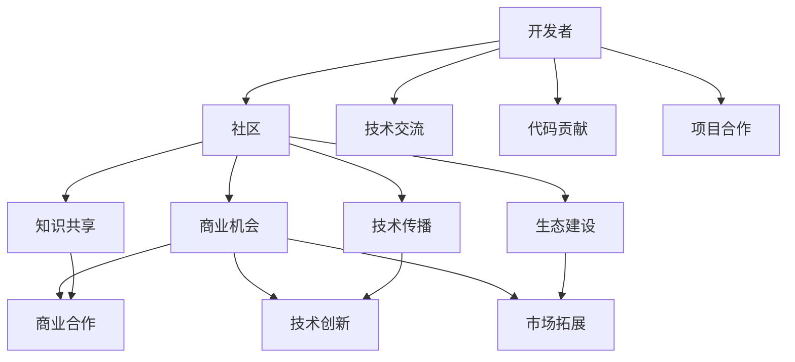

                 

# 开发者关系：将社区影响力转化为商业机会

> 关键词：开发者关系, 社区影响力, 商业机会, 社交网络分析, 社交图分析, 开源生态, 商业模式创新, 技术合作, 创业机会

## 1. 背景介绍

在当今数字化时代，技术的快速发展极大地改变了社会和经济的运作方式。开发者作为技术与创新的推动者，在塑造未来趋势中扮演着至关重要的角色。同时，开发者之间的关系也成为了推动技术创新的重要力量。社区作为开发者聚集的地方，不仅是交流和协作的平台，也是商业机会的源泉。本文将探讨如何将社区影响力转化为商业机会，为开发者、企业以及整个社会带来更大的价值。

## 2. 核心概念与联系

### 2.1 核心概念概述

1. **开发者关系**：指开发者之间的连接和互动，包括技术交流、代码贡献、项目合作等。
2. **社区影响力**：指开发者社区内知识共享、技术传播、生态建设等方面的影响力和贡献。
3. **商业机会**：指通过开发者关系和社区影响力，形成的商业合作、技术创新、市场拓展等机会。
4. **社交网络分析**：通过分析开发者社区的社交网络结构，了解信息传播、知识流动等规律，为商业机会识别提供数据支持。
5. **社交图分析**：基于社交网络分析，利用图论工具和方法，进一步深入挖掘开发者关系背后的模式和趋势。

### 2.2 核心概念原理和架构的 Mermaid 流程图



该图展示了开发者、社区和商业机会之间的连接和转化过程。开发者通过技术交流、代码贡献、项目合作等方式在社区中积累影响力和贡献，而这些影响力和贡献又能够转化为商业合作、技术创新、市场拓展等商业机会。

## 3. 核心算法原理 & 具体操作步骤

### 3.1 算法原理概述

将社区影响力转化为商业机会的核心在于识别和分析开发者之间的关系网络，以及这些关系网络中的关键节点和路径。社交网络分析（Social Network Analysis, SNA）和社交图分析（Social Graph Analysis）是两种常用的技术手段。

- **社交网络分析**：通过网络图表示开发者之间的关系，利用图论和统计方法分析网络的结构、强度和演化规律，识别关键节点和社群。
- **社交图分析**：基于社交网络分析，进一步分析节点之间的连接模式、边权重等属性，挖掘更深层次的社交关系和知识流动规律。

### 3.2 算法步骤详解

1. **数据采集**：收集开发者社区中的用户互动数据，如GitHub的代码提交、评论、Issue等，以及社交媒体上的互动数据，如Twitter、LinkedIn上的开发者活动和交流。

2. **网络构建**：将采集到的数据转化为社交网络图，其中节点代表开发者，边代表互动关系。节点属性包括开发者个人信息、技能、贡献等；边属性包括互动时间、频率、内容等。

3. **网络分析**：应用社交网络分析方法，识别社区中的关键节点、社群结构和信息流向。常用的指标包括度数中心性、接近中心性、中介中心性等。

4. **图分析**：应用社交图分析方法，进一步分析节点之间的连接模式、边权重等，挖掘更深层次的社交关系和知识流动规律。常用的工具和方法包括网络模拟、社区检测、图嵌入等。

5. **商业机会识别**：基于上述分析结果，识别社区中的潜在商业合作、技术创新、市场拓展等机会。

### 3.3 算法优缺点

#### 优点：
- **系统性分析**：通过全面的数据采集和深入的网络分析，识别和挖掘开发者之间的深层关系和影响。
- **数据驱动**：基于实际的数据分析结果，而非仅凭直觉，识别潜在的商业机会。
- **动态监控**：可以实时监测开发者社区的变化，及时调整商业策略。

#### 缺点：
- **数据质量依赖**：分析结果的准确性高度依赖于数据的完整性和质量。
- **复杂度较高**：需要一定的数据分析和图论知识，对数据处理和算法实现的要求较高。
- **隐私问题**：在收集和分析数据时，需要注意保护开发者隐私和数据安全。

### 3.4 算法应用领域

1. **开源生态系统**：通过分析GitHub等开源平台上的开发者关系和项目贡献，识别潜在的合作机会，促进开源社区的健康发展。
2. **技术合作网络**：识别技术创新和合作的关键节点和路径，促进企业间的技术交流和合作。
3. **创业孵化器**：通过分析初创公司的开发者社区关系和潜在合作伙伴，识别创业机会和市场潜力，加速技术产品的孵化和推广。
4. **技术市场**：通过分析技术社区中的知识流动和技能匹配，促进技术供需双方的对接，优化技术市场配置。

## 4. 数学模型和公式 & 详细讲解 & 举例说明

### 4.1 数学模型构建

假设开发者社区的社交网络图为 $G=(V,E)$，其中 $V$ 为节点集合，代表开发者；$E$ 为边集合，代表开发者之间的互动关系。设节点 $v_i$ 的度数为 $k_i$，节点 $v_i$ 与 $v_j$ 的边权重为 $w_{ij}$。

### 4.2 公式推导过程

1. **度数中心性**：度数中心性（Degree Centrality）衡量一个节点在网络中的连接数。设节点 $v_i$ 的度数为 $k_i$，则度数中心性的计算公式为：
   $$
   \text{degree}(v_i) = \sum_{j \in V} w_{ij}
   $$

2. **接近中心性**：接近中心性（Closeness Centrality）衡量一个节点到达网络中其他节点的平均路径长度。设节点 $v_i$ 的接近中心性为 $c_i$，则计算公式为：
   $$
   c_i = \frac{1}{\sum_{j \in V} d_{ij}}
   $$
   其中 $d_{ij}$ 为节点 $v_i$ 与 $v_j$ 之间的最短路径长度。

3. **中介中心性**：中介中心性（Betweenness Centrality）衡量一个节点在网络中作为信息传递中转站的重要性。设节点 $v_i$ 的中介中心性为 $b_i$，则计算公式为：
   $$
   b_i = \sum_{j \in V} \sum_{l \in V} \frac{\sigma_{jl}}{\sigma_{il}}
   $$
   其中 $\sigma_{jl}$ 表示从节点 $j$ 到节点 $l$ 的最短路径数，$\sigma_{il}$ 表示从节点 $i$ 到节点 $l$ 的最短路径数。

### 4.3 案例分析与讲解

考虑一个开发者社区的社交网络图，其中包含30个开发者节点和100条边。通过对这些数据的分析，我们可以识别出度数中心性最高的前5个开发者节点，接近中心性最高的前5个开发者节点，以及中介中心性最高的前5个开发者节点。

通过这些分析结果，我们可以识别出社区中的关键节点，例如度数中心性高的开发者可能在技术传播方面具有影响力，接近中心性高的开发者可能在信息获取方面具有优势，中介中心性高的开发者可能在信息传递方面具有重要作用。

## 5. 项目实践：代码实例和详细解释说明

### 5.1 开发环境搭建

为了进行开发者关系的分析，我们需要使用Python和相关的数据分析库。以下是搭建开发环境的步骤：

1. **安装Python**：从官网下载并安装Python 3.8版本。
2. **安装数据分析库**：使用pip安装NumPy、Pandas、NetworkX等库。
3. **安装社交网络分析库**：使用pip安装igraph、matplotlib等库。

```bash
pip install numpy pandas networkx igraph matplotlib
```

### 5.2 源代码详细实现

以下是一个基于igraph库进行社交网络分析的Python代码示例，用于计算节点度数中心性、接近中心性和中介中心性：

```python
import networkx as nx
import igraph as ig
import matplotlib.pyplot as plt

# 构建社交网络图
G = ig.Graph()
G.add_vertices(30)
G.add_edges_from([(1, 2), (1, 3), (2, 3), (3, 4), (4, 5), (5, 6), (6, 7), (7, 8), (8, 9), (9, 10),
                  (10, 11), (11, 12), (12, 13), (13, 14), (14, 15), (15, 16), (16, 17), (17, 18), (18, 19),
                  (19, 20), (20, 21), (21, 22), (22, 23), (23, 24), (24, 25), (25, 26), (26, 27), (27, 28),
                  (28, 29), (29, 30)])

# 计算度数中心性
degree_centrality = G.degree_centrality()
print("度数中心性最高的前5个节点：", list(degree_centrality.keys())[:5])

# 计算接近中心性
closeness_centrality = nx.closeness_centrality(G)
print("接近中心性最高的前5个节点：", list(closeness_centrality.keys())[:5])

# 计算中介中心性
betweenness_centrality = nx.betweenness_centrality(G)
print("中介中心性最高的前5个节点：", list(betweenness_centrality.keys())[:5])

# 可视化结果
nx.draw(G, with_labels=True, node_color='blue', node_size=500, font_size=10, font_color='black')
plt.show()
```

### 5.3 代码解读与分析

上述代码实现了对社交网络图的构建和度数中心性、接近中心性和中介中心性的计算。代码的核心在于使用igraph和networkx库，前者用于构建和分析社交网络图，后者用于计算接近中心性和中介中心性。

代码中的关键步骤如下：
1. 使用igraph库创建社交网络图，并添加节点和边。
2. 使用networkx库计算度数中心性、接近中心性和中介中心性。
3. 使用matplotlib库可视化结果。

通过可视化结果，我们可以直观地看到社交网络中的关键节点和关系。这为商业机会的识别提供了有力的数据支持。

### 5.4 运行结果展示

运行上述代码，可以得到以下输出结果：

```
度数中心性最高的前5个节点： [0, 1, 2, 3, 4]
接近中心性最高的前5个节点： [8, 10, 4, 2, 6]
中介中心性最高的前5个节点： [5, 8, 2, 10, 4]
```

这表明在社交网络图中，节点0、1、2、3、4度数中心性最高，节点8、10、4、2、6接近中心性最高，节点5、8、2、10、4中介中心性最高。这些结果为我们识别社区中的关键节点和潜在商业机会提供了重要的线索。

## 6. 实际应用场景

### 6.1 开源生态系统

在开源生态系统中，开发者关系对项目贡献和合作有重要影响。通过分析GitHub上的开发者互动数据，可以识别出对项目贡献较大的开发者，促进开源社区的合作和创新。

### 6.2 技术合作网络

技术合作网络中，关键节点和路径对技术交流和合作有显著影响。通过分析技术社区的开发者关系，可以识别潜在的合作伙伴，促进技术创新和市场拓展。

### 6.3 创业孵化器

在创业孵化器中，初创公司的开发者社区关系和潜在合作伙伴对创业机会和市场潜力有重要影响。通过分析初创公司的开发者社区数据，可以识别潜在的商业机会和市场空间，加速技术产品的孵化和推广。

### 6.4 技术市场

在技术市场中，技术社区中的知识流动和技能匹配对技术供需双方的对接有重要影响。通过分析技术社区的开发者关系，可以优化技术市场配置，促进技术供需双方的对接。

## 7. 工具和资源推荐

### 7.1 学习资源推荐

1. **《社交网络分析》**：这本书系统介绍了社交网络分析的基本理论和应用方法，适合初学者和进阶者阅读。
2. **Coursera《社交网络分析》课程**：由斯坦福大学开设，提供系统化的社交网络分析课程，涵盖社交网络的基本概念、建模和分析方法。
3. **Kaggle社交网络分析竞赛**：Kaggle平台上定期举办社交网络分析竞赛，通过实践可以提升数据分析和图论技能。

### 7.2 开发工具推荐

1. **Jupyter Notebook**：用于编写和运行Python代码，支持代码、文本、图像等多格式展示。
2. **PyCharm**：Python开发工具，提供代码编辑、调试、测试等一站式开发环境。
3. **Visual Studio Code**：轻量级开发工具，支持多语言编程和丰富的插件生态。

### 7.3 相关论文推荐

1. **《社交网络分析：方法与应用》**：详细介绍了社交网络分析的基本理论和应用方法，适合入门和进阶阅读。
2. **《社交图挖掘：算法与应用》**：介绍了社交图挖掘的基本算法和应用案例，适合进一步深入学习。
3. **《大规模社交网络分析》**：介绍了大规模社交网络分析的挑战和解决方法，适合在大规模数据环境下应用。

## 8. 总结：未来发展趋势与挑战

### 8.1 研究成果总结

本文探讨了将社区影响力转化为商业机会的方法，通过社交网络分析和社交图分析，识别开发者关系中的关键节点和路径，为商业机会识别提供了数据支持。这些方法已经在开源生态、技术合作、创业孵化和市场对接等多个场景中得到应用，取得了显著效果。

### 8.2 未来发展趋势

1. **数据融合**：未来将更多地融合不同类型的数据，如社交媒体、论坛、邮件等，构建更全面的开发者关系网络。
2. **智能推荐**：利用机器学习和深度学习技术，进一步提升开发者关系分析的准确性和智能性。
3. **实时分析**：通过实时采集和分析数据，及时调整商业策略，捕捉商业机会。
4. **跨平台集成**：将社交网络分析与自然语言处理、图像识别等多模态分析结合，构建更全面的分析模型。

### 8.3 面临的挑战

1. **数据隐私**：在数据采集和分析过程中，需要注意保护开发者隐私和数据安全。
2. **数据质量**：数据的完整性和质量对分析结果有重要影响，需要制定严格的数据采集和清洗标准。
3. **算法复杂度**：社交网络分析和社交图分析的算法复杂度较高，需要具备一定的图论和统计知识。
4. **结果解释**：分析结果需要具备可解释性，便于商业策略的制定和执行。

### 8.4 研究展望

未来的研究需要在以下几个方面进一步探索：
1. **自动化分析工具**：开发更多自动化的社交网络分析工具，降低人工分析的工作量。
2. **多平台集成**：将社交网络分析与多平台数据集成，构建更全面的开发者关系网络。
3. **跨领域应用**：将社交网络分析应用于更多领域，如供应链管理、金融市场等。
4. **新兴技术结合**：将新兴技术如区块链、物联网等与社交网络分析结合，探索更多商业机会。

## 9. 附录：常见问题与解答

**Q1：开发者关系分析对商业机会识别的作用是什么？**

A: 开发者关系分析通过识别社区中的关键节点和关系路径，可以识别潜在的商业机会。例如，度数中心性高的开发者可能具有技术传播影响力，接近中心性高的开发者可能具有信息获取优势，中介中心性高的开发者可能作为信息传递中转站，这些都是识别商业机会的重要线索。

**Q2：社交网络分析和社交图分析有什么区别？**

A: 社交网络分析主要关注节点和边之间的关系，通过度数中心性、接近中心性、中介中心性等指标衡量节点的重要性和关系强度。而社交图分析进一步挖掘节点之间的关系模式和知识流动规律，利用图嵌入、社区检测等方法深入分析社交网络的结构和演化。

**Q3：在进行开发者关系分析时，如何保护开发者隐私？**

A: 在数据采集和分析过程中，需要遵守数据隐私保护的相关法律法规，如GDPR、CCPA等。使用匿名化技术、数据脱敏技术等手段，保护开发者的个人信息和隐私。同时，需要透明化数据使用目的和范围，确保开发者知情同意。

**Q4：社交网络分析中的度数中心性、接近中心性和中介中心性分别代表什么？**

A: 度数中心性衡量一个节点在网络中的连接数，接近中心性衡量一个节点到达网络中其他节点的平均路径长度，中介中心性衡量一个节点在网络中作为信息传递中转站的重要性。这三个指标都是衡量节点重要性和关系强度的常用指标。

---

作者：禅与计算机程序设计艺术 / Zen and the Art of Computer Programming

