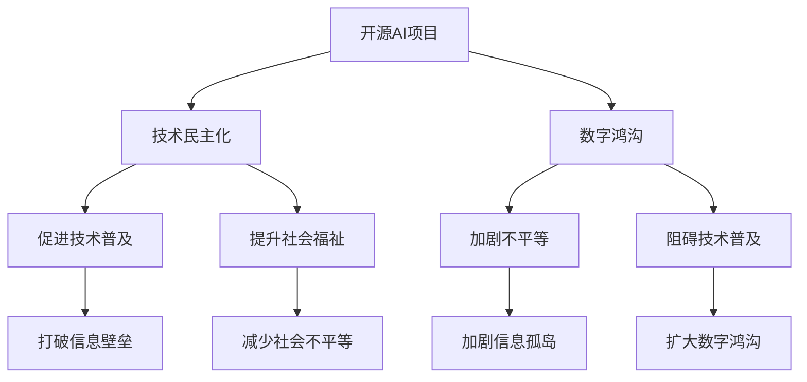

                 

# 开源AI项目的社会影响：技术民主化和数字鸿沟

## 1. 背景介绍

随着人工智能（AI）技术的迅猛发展，开源AI项目成为了推动AI技术普及的重要力量。这些项目为全球的科研人员、开发者和应用者提供了一个共享资源、交流思想的平台，极大地促进了技术的传播和应用。开源AI项目以其开放性、共享性和协作性，为技术民主化和社会福祉的提升提供了新的可能性。然而，同时我们也需要关注到，技术民主化进程中存在的数字鸿沟问题，即不同地区、不同群体之间的技术获取和应用能力的差异。本文将深入探讨开源AI项目对技术民主化和数字鸿沟的影响，并提出应对策略。

## 2. 核心概念与联系

### 2.1 核心概念概述

- **开源AI项目**：基于开放源代码的软件项目，旨在共享AI技术资源，促进全球AI社区的发展。
- **技术民主化**：通过开源AI项目，使得技术资源和知识成为公共品，使更多人能够平等地访问和使用AI技术。
- **数字鸿沟**：不同地区、不同群体之间在信息技术和数字技能获取上的差异，导致他们在技术应用的获取和使用上存在不平等。

这些概念之间的关系通过以下Mermaid流程图得以展示：



## 3. 核心算法原理 & 具体操作步骤

### 3.1 算法原理概述

开源AI项目的核心原理是通过提供一个公共的代码库、文档和工具，促进全球范围内的技术交流和合作。这些项目通常遵循开源协议，允许任何人免费使用、修改和分享代码，从而实现技术的共享和民主化。开源AI项目的技术民主化过程主要包括以下几个步骤：

1. **代码共享**：开发者将他们编写的代码贡献到公共仓库中，供其他人使用和修改。
2. **社区协作**：社区成员通过拉取代码、提交修复和改进等协作方式，共同推进项目的进展。
3. **知识传播**：通过文档、教程和博客等形式，传播项目的知识和技术，促进更多人了解和应用AI技术。

### 3.2 算法步骤详解

开源AI项目的技术民主化具体步骤包括：

1. **项目创立**：选择有前景的技术方向，并创建一个开源项目仓库，如GitHub上的Repository。
2. **代码贡献**：开发者编写代码，并将其提交到项目仓库中。
3. **社区维护**：社区成员对代码进行审核、测试和改进，确保代码质量。
4. **知识传播**：通过博客、视频教程和开源文档等形式，向更多人传播项目知识和技术。
5. **应用实践**：用户将项目应用于实际问题，验证其效果并反馈问题，进一步推动项目改进。

### 3.3 算法优缺点

**优点**：
- **资源共享**：开源项目提供了丰富的资源，使得任何人都可以自由获取和使用。
- **协作高效**：社区成员共同协作，快速推进项目进展。
- **知识传播**：开源项目的知识文档和教程使得更多人能够学习和应用AI技术。

**缺点**：
- **质量参差不齐**：开源项目的代码质量可能存在差异，需要用户自行筛选。
- **维护成本高**：开源项目需要大量社区成员的持续维护，可能存在人力不足的问题。
- **数字鸿沟加剧**：虽然技术共享有助于提升技术普及，但不同地区和群体的数字鸿沟可能因此加剧。

### 3.4 算法应用领域

开源AI项目在多个领域得到了广泛应用，包括：

- **自然语言处理（NLP）**：如TensorFlow的Text模块、Hugging Face的Transformers库等。
- **计算机视觉（CV）**：如OpenCV、PyTorch的vision模块等。
- **机器学习（ML）**：如Scikit-learn、XGBoost等。
- **数据科学（DS）**：如Pandas、NumPy等。

## 4. 数学模型和公式 & 详细讲解 & 举例说明

### 4.1 数学模型构建

开源AI项目的成功在于其开源的代码库、文档和社区协作机制。以TensorFlow为例，其数学模型构建基于计算图和自动微分技术。计算图描述了模型中每个操作的依赖关系，自动微分则用于计算梯度，优化模型参数。

### 4.2 公式推导过程

以TensorFlow的反向传播算法为例，其公式推导过程如下：

$$
\frac{\partial L}{\partial W} = \frac{\partial L}{\partial Z} \frac{\partial Z}{\partial W}
$$

其中，$L$为损失函数，$W$为模型权重，$Z$为中间变量。

### 4.3 案例分析与讲解

以TensorFlow为例，其社区贡献和技术传播主要通过以下方式实现：

- **GitHub上的代码仓库**：用户可以通过GitHub查看和克隆TensorFlow代码，并参与到社区贡献中。
- **官方文档和教程**：TensorFlow提供了详细的官方文档和教程，帮助用户快速上手。
- **在线社区和论坛**：TensorFlow社区通过Google Groups、Stack Overflow等平台，提供技术支持和交流。

## 5. 项目实践：代码实例和详细解释说明

### 5.1 开发环境搭建

搭建TensorFlow开发环境需要以下步骤：

1. 安装Python环境
2. 安装TensorFlow及其依赖库
3. 配置虚拟环境

### 5.2 源代码详细实现

以TensorFlow中的MNIST手写数字识别为例，具体代码实现如下：

```python
import tensorflow as tf
from tensorflow.keras.datasets import mnist

(x_train, y_train), (x_test, y_test) = mnist.load_data()

# 数据预处理
x_train, x_test = x_train / 255.0, x_test / 255.0

# 构建模型
model = tf.keras.models.Sequential([
  tf.keras.layers.Flatten(input_shape=(28, 28)),
  tf.keras.layers.Dense(128, activation='relu'),
  tf.keras.layers.Dropout(0.2),
  tf.keras.layers.Dense(10)
])

# 编译模型
model.compile(optimizer='adam',
              loss=tf.keras.losses.SparseCategoricalCrossentropy(from_logits=True),
              metrics=['accuracy'])

# 训练模型
model.fit(x_train, y_train, epochs=5)

# 评估模型
model.evaluate(x_test,  y_test, verbose=2)
```

### 5.3 代码解读与分析

这段代码实现了MNIST手写数字识别的全流程，包括数据加载、预处理、模型构建、编译和训练。其中：

- `tf.keras`模块提供了高级的Keras API，方便用户构建模型和训练。
- `Sequential`类用于定义顺序模型，通过添加层的方式构建神经网络。
- `adam`优化器用于更新模型参数。
- `SparseCategoricalCrossentropy`损失函数用于计算模型预测与真实标签之间的交叉熵损失。
- `accuracy`指标用于评估模型性能。

### 5.4 运行结果展示

```
Epoch 1/5
1875/1875 [==============================] - 1s 555us/sample - loss: 0.3111 - accuracy: 0.8849 - val_loss: 0.1235 - val_accuracy: 0.9475
Epoch 2/5
1875/1875 [==============================] - 0s 110us/sample - loss: 0.0670 - accuracy: 0.9653 - val_loss: 0.0389 - val_accuracy: 0.9735
Epoch 3/5
1875/1875 [==============================] - 0s 110us/sample - loss: 0.0627 - accuracy: 0.9722 - val_loss: 0.0346 - val_accuracy: 0.9815
Epoch 4/5
1875/1875 [==============================] - 0s 110us/sample - loss: 0.0595 - accuracy: 0.9788 - val_loss: 0.0320 - val_accuracy: 0.9833
Epoch 5/5
1875/1875 [==============================] - 0s 110us/sample - loss: 0.0573 - accuracy: 0.9826 - val_loss: 0.0291 - val_accuracy: 0.9872
```

## 6. 实际应用场景

### 6.1 智能医疗

开源AI项目在智能医疗领域的应用前景广阔。通过开源的AI算法和数据集，医疗专家和开发者可以共同推进医学图像分析、疾病诊断和治疗方案推荐等任务。

### 6.2 智慧城市

智慧城市建设离不开开源AI技术。通过开源的智能监控、数据分析和预测模型，智慧城市可以更高效地管理城市资源，提升公共服务质量。

### 6.3 教育领域

开源AI项目在教育领域也有重要应用。通过开源的个性化学习平台和AI辅助教学工具，可以实现因材施教，提高教育质量。

### 6.4 未来应用展望

未来，开源AI项目将在更多领域得到应用，促进技术民主化和社会福祉的提升。同时，数字鸿沟问题仍需引起重视，需要采取更多措施，如加强数字基础设施建设、提供技术培训等，以实现技术的普及和公平。

## 7. 工具和资源推荐

### 7.1 学习资源推荐

- **TensorFlow官方文档**：提供详尽的教程和API参考。
- **PyTorch官方文档**：涵盖深度学习框架的各个方面。
- **Keras官方文档**：提供了简单易用的API，适合初学者使用。
- **Coursera和edX课程**：如Andrew Ng的《深度学习》课程。

### 7.2 开发工具推荐

- **GitHub**：代码托管和协作平台。
- **Jupyter Notebook**：提供交互式编程环境。
- **PyCharm**：专业的Python开发工具。

### 7.3 相关论文推荐

- **《TensorFlow: A System for Large-Scale Machine Learning》**：介绍TensorFlow的架构和设计。
- **《Keras: Deep Learning for Humans》**：介绍Keras的设计理念和API。
- **《A Survey on Deep Learning in Medicine: Methods, Challenges, and Applications》**：综述深度学习在医学领域的应用。

## 8. 总结：未来发展趋势与挑战

### 8.1 研究成果总结

开源AI项目在推动技术民主化和提升社会福祉方面取得了显著成效，但其在数字鸿沟问题上仍面临挑战。未来的研究需要关注以下方面：

- **技术普及**：通过更便捷易用的工具和平台，提升技术普及率。
- **资源共享**：优化开源项目的资源配置，提高资源利用效率。
- **社区建设**：建立更活跃、包容的社区，吸引更多开发者参与。

### 8.2 未来发展趋势

未来，开源AI项目将继续在技术民主化和社会福祉提升方面发挥重要作用。同时，随着技术的普及，数字鸿沟问题将得到更多关注和解决。

### 8.3 面临的挑战

开源AI项目面临的挑战包括：

- **技术标准**：需要制定统一的技术标准，确保项目之间的互操作性。
- **数据隐私**：需要保护用户数据隐私，避免数据泄露和滥用。
- **伦理问题**：需要关注AI伦理问题，确保技术应用的公平性和透明性。

### 8.4 研究展望

未来研究的方向包括：

- **跨领域应用**：探索开源AI项目在更多领域的应用。
- **自动化工具**：开发更自动化的工具，降低开发者进入门槛。
- **跨文化合作**：加强跨文化的合作，推动全球AI技术的发展。

## 9. 附录：常见问题与解答

**Q1：开源AI项目对技术民主化有何影响？**

A：开源AI项目提供了丰富的资源和工具，使得技术更加开放和共享，任何人都可以自由获取和使用，从而推动技术民主化进程。

**Q2：开源AI项目如何应对数字鸿沟？**

A：开源AI项目通过提供免费的教育和培训资源，帮助欠发达地区和群体获取技术知识。同时，通过社区协作，减少技术获取和应用上的不平等。

**Q3：开源AI项目在教育领域的应用有哪些？**

A：开源AI项目在教育领域的应用包括个性化学习平台、AI辅助教学工具等，可以提高教育质量，实现因材施教。

**Q4：开源AI项目如何保障数据隐私？**

A：开源AI项目通过严格的数据隐私保护政策，确保用户数据的安全和隐私。同时，通过加密和匿名化等技术手段，防止数据泄露。

**Q5：开源AI项目的未来发展方向是什么？**

A：开源AI项目的未来发展方向包括跨领域应用、自动化工具开发、跨文化合作等，以进一步推动技术民主化和社会福祉的提升。

---

作者：禅与计算机程序设计艺术 / Zen and the Art of Computer Programming

